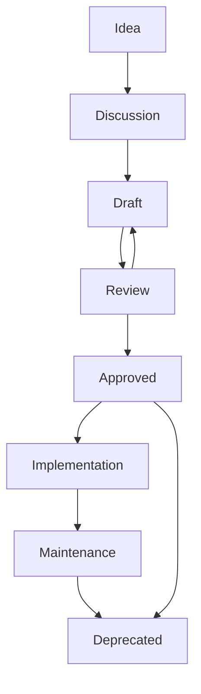

# Document Lifecycle

## Metadata

| Field | Value |
|-------|-------|
| Document ID | KAI-GOV-002 |
| Status | Draft |
| Version | 0.1 |
| Owner | Chief Software Architect |
| Created | 2026-07-14 |
| Last Updated | 2026-07-14 |
| Related Documents | [Documentation Standards](./Documentation-Standards.md) |

---

## Purpose

Every engineering document follows a defined lifecycle to ensure that decisions are deliberate, reviewed, and approved before they influence implementation. Without a lifecycle, documents exist in an ambiguous state where incomplete ideas may be treated as directives.

Architecture must be approved before implementation begins. This principle prevents wasted effort, scope creep, and contradictions between design and code. The lifecycle enforces a clear boundary between intent and execution.

## Scope

This lifecycle applies to every document stored in this repository, across all folders:

- 01-Foundation
- 02-Products
- 03-Roadmap
- 04-Architecture
- 05-Development
- 06-Modules
- 07-Releases
- 08-ADR
- 09-Research
- 10-Templates

No document is exempt. Governance documents (00-Governance) also follow this lifecycle.

## Documentation Workflow

Every document progresses through the following stages:

### Stage Definitions

| Stage | Description |
|-------|-------------|
| Idea | A need for documentation is identified. No file exists yet. |
| Discussion | The scope, ownership, and approach are discussed among stakeholders. |
| Draft | The document is created and content is written. It is incomplete or unreviewed. It must not drive implementation. |
| Review | The document is submitted for peer review. Feedback is collected and incorporated. May return to Draft if significant rework is needed. |
| Approved | The document has been reviewed and accepted. It represents the current agreed-upon state and may drive implementation. |
| Implementation | The content described in the document is being realized in the platform. The document serves as the reference during development. |
| Maintenance | The document is implemented and remains current. It is updated as the platform evolves. |
| Deprecated | The document is no longer current. It is retained for historical reference and must link to its replacement. |

## Responsibilities

| Role | Responsibilities |
|------|-----------------|
| Founder | Sets strategic direction. Approves foundational and product-level documents. Final authority on scope and priorities. |
| Architect | Authors and maintains architecture documents. Reviews technical documents for consistency. Ensures cross-document coherence. |
| Developer | Implements approved documents. Reports inconsistencies or gaps. Proposes changes through the defined workflow. |
| Reviewer | Reviews documents for accuracy, completeness, and consistency. Provides actionable feedback within defined timelines. |
| AI Coding Agent | Implements only approved documents. Follows documented architecture as the single source of truth. Never invents undocumented functionality. |
| Future Contributors | Follow existing standards. Propose changes through the governance process. Do not bypass the lifecycle. |

## Approval Rules

The following rules are absolute and apply without exception:

- Documents in Draft status must not be implemented. Draft indicates incomplete or unreviewed content that may change significantly.
- Only documents with Approved status may drive development work.
- Deprecated documents must not be used as the basis for new work. Their replacements must be referenced instead.
- Documents targeting a future platform version must not be implemented in earlier releases, regardless of their approval status.
- A document cannot move to Approved without at least one review cycle.
- Approval authority is determined by the document type and folder ownership.

## Change Management

Approved documents may be changed through the following process:

1. **Create Discussion** — Identify the need for change. Document the rationale and scope of the proposed modification.
2. **Update Draft** — Modify the document. Set status back to Draft. Increment the working version.
3. **Review** — Submit for review. Reviewers assess the change against the original intent and current platform state.
4. **Approve** — Designated approver accepts the changes. Status returns to Approved.
5. **Increment Version** — Update the version number following the versioning rules defined in Documentation Standards.
6. **Record Change History** — Note what changed, when, and why. Maintain traceability.

Rules:

- Trivial corrections (typos, broken links) may follow an abbreviated review but must still increment the version.
- Structural changes require full review.
- Changes that alter the fundamental scope of a document require a major version increment.

## Relationship with Roadmap

The documentation categories serve distinct purposes in the delivery process:

| Category | Determines |
|----------|-----------|
| Roadmap | **When** — Timing, sequencing, and prioritization of work |
| Architecture | **How** — Technical design, structure, and system behavior |
| Modules | **What** — Specific components, their boundaries, and interfaces |
| Development | **Implementation** — Follows approved documents only |

These relationships are directional:

- Roadmap informs Architecture by defining delivery order.
- Architecture informs Modules by defining structure.
- Modules inform Development by defining scope.
- Development never drives Architecture. Implementation follows design.

## AI Agent Rules

AI coding agents operating on the Kairo platform must follow these rules without exception:

- **Never implement Draft documents.** Draft content is provisional and must not influence code.
- **Never implement future roadmap items.** Only work that is scheduled for the current release may be implemented.
- **Always follow approved documentation.** The architecture repository is the authoritative source for all design decisions.
- **Never invent undocumented functionality.** If a capability is not described in an approved document, it must not be built.
- **Use this repository as the single source of truth.** Do not rely on external conversations, assumptions, or prior context that contradicts approved documents.
- **Respect document status.** Check the status field before acting on any document.
- **Report gaps.** If implementation requires decisions not covered by existing documentation, flag the gap rather than improvising.
- **One task, one commit.** Each unit of work corresponds to a single documented task and a single commit.

## Governance Principles

The following principles govern all documentation activities:

- **Documentation First** — Write the document before writing the code. Design precedes implementation.
- **Review Before Code** — No implementation begins until the relevant documentation is reviewed and approved.
- **Incremental Delivery** — Deliver documentation and implementation in small, reviewable increments.
- **One Task One Commit** — Each commit addresses exactly one documented task. Do not combine unrelated changes.
- **Architecture Before Implementation** — System design is decided in documentation, not discovered during coding.
- **No Scope Creep** — Each document and each task has a defined boundary. Do not exceed it.

## Document Retirement

When a document reaches the end of its useful life:

1. Set the document status to Deprecated.
2. Add a note at the top of the document indicating it is deprecated and linking to the replacement document.
3. Update the MASTER_INDEX to reflect the deprecation.
4. Do not delete the document. Historical architecture decisions have long-term reference value.
5. Remove the deprecated document from any active workflow references.
6. Ensure all documents that previously linked to the deprecated document are updated to reference the replacement.

Deprecated documents remain in the repository indefinitely. They serve as historical records of past decisions and their rationale.
