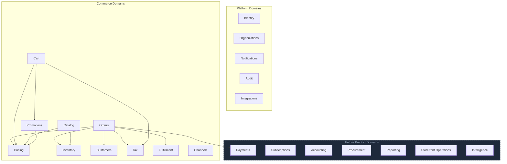

# Domain Model

## Metadata

| Field | Value |
|-------|-------|
| Title | Kairo Business Domain Model |
| Document ID | KAI-PROD-005 |
| Status | Draft |
| Version | 0.1 |
| Target Release | N/A |
| Owner | Chief Product Architect |
| Created | 2026-07-15 |
| Last Updated | 2026-07-15 |
| Reviewers | TODO |
| Related Documents | [Product Boundaries](./Product-Boundaries.md), [Product Ecosystem](./Product-Ecosystem.md), [Kairo Commerce](./Kairo-Commerce.md) |
| Dependencies | None |

---

## Purpose

This document identifies every major business domain within the Kairo ecosystem. It defines what each domain is responsible for, which product owns it, and how domains relate to one another.

Domains are the fundamental organizational units of business logic. They determine how the platform is structured, how products are scoped, and where capabilities belong. Every feature, entity, and operation maps to exactly one domain.

This is a business-level model. It describes what exists in the problem space, not how it is built.

---

## Domain Overview

---

## Platform Domains

### Identity

| Attribute | Detail |
|-----------|--------|
| Purpose | Manage who users are and what they are allowed to do |
| Ownership | Shared Platform / Kairo Identity |
| Business Responsibility | Authentication, authorization, credentials, roles, permissions, sessions, API keys, federation |

**Relationships:**
- Every domain depends on Identity for access control.
- Identity does not depend on any other business domain.
- Identity provides the trust boundary that all other domains operate within.

---

### Organizations

| Attribute | Detail |
|-----------|--------|
| Purpose | Represent the business entities that operate on the platform |
| Ownership | Shared Platform |
| Business Responsibility | Tenant structure, organization profiles, organization hierarchy, multi-tenant data boundaries |

**Relationships:**
- Organizations scope all domain data. Every entity in every domain belongs to an organization.
- Identity associates users with organizations.
- All product domains operate within an organization context.

---

### Notifications

| Attribute | Detail |
|-----------|--------|
| Purpose | Deliver messages and alerts to users and external systems |
| Ownership | Shared Platform |
| Business Responsibility | Email delivery, webhook dispatch, notification preferences, delivery tracking, template management |

**Relationships:**
- All domains produce events that may trigger notifications.
- Notifications does not own the business events — it delivers messages on behalf of other domains.
- Notification preferences are scoped per user and per organization.

---

### Audit

| Attribute | Detail |
|-----------|--------|
| Purpose | Record a tamper-evident history of significant actions across the platform |
| Ownership | Shared Platform |
| Business Responsibility | Audit trail, compliance logging, data access records, retention policies |

**Relationships:**
- Every domain contributes audit entries for significant operations.
- Audit does not influence business logic. It is a passive observer.
- Identity provides the actor information for each audit entry.

---

### Integrations

| Attribute | Detail |
|-----------|--------|
| Purpose | Connect the platform to external systems and services |
| Ownership | Shared Platform |
| Business Responsibility | Integration configuration, credential management for external services, webhook registration, event routing to external systems |

**Relationships:**
- All domains may require external integrations (payment providers, shipping carriers, tax services, ERPs).
- Integrations provides the framework. Individual domains define their specific integration points.
- Integration credentials are scoped per organization and governed by Identity.

---

## Commerce Domains

### Catalog

| Attribute | Detail |
|-----------|--------|
| Purpose | Define what can be sold |
| Ownership | Kairo Commerce |
| Business Responsibility | Products, product variants, categories, attributes, product types, product media references, product relationships |

**Relationships:**
- Pricing attaches prices to catalog items.
- Inventory tracks stock levels for catalog items.
- Orders reference catalog items as line items.
- Channels determine which catalog items are visible in which context.

---

### Pricing

| Attribute | Detail |
|-----------|--------|
| Purpose | Determine what things cost |
| Ownership | Kairo Commerce |
| Business Responsibility | Price lists, price tiers, customer-specific pricing, currency-aware pricing, price scheduling, price overrides |

**Relationships:**
- Pricing operates on Catalog items.
- Cart and Orders consume prices during calculation.
- Promotions modify effective prices through discount rules.
- Channels may scope which price lists apply.
- Tax is calculated on top of resolved prices.

---

### Inventory

| Attribute | Detail |
|-----------|--------|
| Purpose | Track what is available to sell |
| Ownership | Kairo Commerce |
| Business Responsibility | Stock levels, stock reservations, stock movements, multi-location inventory, reorder thresholds, inventory adjustments |

**Relationships:**
- Inventory is tracked against Catalog items.
- Orders reserve and decrement inventory.
- Fulfillment consumes inventory from specific locations.
- Channels may scope inventory visibility by location.

---

### Customers

| Attribute | Detail |
|-----------|--------|
| Purpose | Represent the people and businesses that buy |
| Ownership | Kairo Commerce |
| Business Responsibility | Customer profiles, shipping and billing addresses, customer groups, customer notes, customer-specific pricing eligibility |

**Relationships:**
- Identity manages the customer's login and credentials. Customers manages the commerce-specific profile.
- Orders are placed by customers.
- Pricing may vary by customer or customer group.
- Customers belong to an organization context.

---

### Cart

| Attribute | Detail |
|-----------|--------|
| Purpose | Manage the pre-order shopping state |
| Ownership | Kairo Commerce |
| Business Responsibility | Cart creation, item management, cart-level calculations, cart persistence, cart expiration |

**Relationships:**
- Cart contains references to Catalog items.
- Cart resolves prices from Pricing.
- Cart applies rules from Promotions.
- Cart calculates tax through the Tax domain.
- Cart converts to an Order upon checkout.

---

### Promotions

| Attribute | Detail |
|-----------|--------|
| Purpose | Define rules that modify pricing to incentivize purchases |
| Ownership | Kairo Commerce |
| Business Responsibility | Discount rules, coupon codes, promotional campaigns, stacking rules, eligibility conditions, usage limits |

**Relationships:**
- Promotions modify prices resolved by Pricing.
- Cart and Orders apply promotional rules during calculation.
- Promotions may target specific Catalog items, categories, or Customer groups.
- Channels may scope which promotions are active.

---

### Tax

| Attribute | Detail |
|-----------|--------|
| Purpose | Calculate tax obligations on transactions |
| Ownership | Kairo Commerce |
| Business Responsibility | Tax zones, tax rates, tax categories, tax rules, tax calculation on carts and orders, tax exemptions |

**Relationships:**
- Tax is calculated on prices resolved by Pricing after Promotions.
- Cart and Orders include tax in their totals.
- Tax zones are determined by Customer addresses.
- Tax may integrate with external tax services through the Integrations domain.

---

### Orders

| Attribute | Detail |
|-----------|--------|
| Purpose | Record and manage purchase transactions |
| Ownership | Kairo Commerce |
| Business Responsibility | Order creation, order lifecycle, line items, order totals, order status transitions, order history, returns and refunds initiation |

**Relationships:**
- Orders reference Catalog items, resolved Pricing, applied Promotions, and calculated Tax.
- Orders are placed by Customers.
- Orders trigger Inventory reservations and decrements.
- Orders initiate payment requests to the Payments domain.
- Orders trigger Fulfillment workflows.
- Completed orders generate events consumed by Accounting (ERP).

---

### Fulfillment

| Attribute | Detail |
|-----------|--------|
| Purpose | Manage the delivery of ordered goods |
| Ownership | Kairo Commerce |
| Business Responsibility | Shipping methods, fulfillment workflows, shipment creation, tracking references, delivery status, partial fulfillment |

**Relationships:**
- Fulfillment is triggered by Orders.
- Fulfillment consumes Inventory from specific locations.
- Fulfillment may integrate with external shipping carriers through Integrations.
- Fulfillment status updates are reflected on Orders.

---

### Channels

| Attribute | Detail |
|-----------|--------|
| Purpose | Represent distinct sales contexts |
| Ownership | Kairo Commerce |
| Business Responsibility | Channel definitions, channel-specific catalog visibility, channel-specific pricing, channel-specific inventory, channel-specific promotions |

**Relationships:**
- Channels scope which Catalog items, Prices, Inventory, and Promotions are active.
- Orders are placed within a Channel context.
- Channels are independent. Configuration in one channel does not affect another.

---

## Future Product Domains

These domains belong to future Kairo products. They are listed here to establish ownership and prevent boundary confusion as the ecosystem grows.

### Payments

| Attribute | Detail |
|-----------|--------|
| Purpose | Process financial transactions |
| Ownership | Kairo Payments |
| Business Responsibility | Payment authorization, capture, settlement, refund execution, payment method management, provider routing, transaction records |

**Relationships:**
- Orders initiate payment requests. Payments processes them.
- Payments provides transaction status back to Orders.
- Payments feeds transaction data to Accounting.

---

### Subscriptions

| Attribute | Detail |
|-----------|--------|
| Purpose | Manage recurring purchase agreements |
| Ownership | Kairo Commerce (future extension) |
| Business Responsibility | Subscription plans, billing cycles, subscription lifecycle, renewal, cancellation, usage tracking |

**Relationships:**
- Subscriptions reference Catalog items and Pricing.
- Subscriptions generate recurring Orders.
- Subscriptions trigger recurring Payments.

---

### Accounting

| Attribute | Detail |
|-----------|--------|
| Purpose | Record the financial impact of business operations |
| Ownership | Kairo ERP |
| Business Responsibility | Chart of accounts, journal entries, ledgers, fiscal periods, financial reporting, reconciliation |

**Relationships:**
- Accounting receives events from Orders, Payments, and Procurement.
- Accounting does not initiate business transactions. It records their financial consequences.

---

### Procurement

| Attribute | Detail |
|-----------|--------|
| Purpose | Manage the acquisition of goods and services |
| Ownership | Kairo ERP |
| Business Responsibility | Purchase orders, supplier management, receiving, cost tracking |

**Relationships:**
- Procurement supplies Inventory.
- Procurement generates Accounting entries.
- Procurement references Catalog items for goods received.

---

### Reporting

| Attribute | Detail |
|-----------|--------|
| Purpose | Aggregate and present business data for decision-making |
| Ownership | Kairo AI / Shared Platform |
| Business Responsibility | Cross-domain data aggregation, business metrics, dashboards, data export |

**Relationships:**
- Reporting reads from all domains. It writes to none.
- Reporting does not own business data. It derives views from data owned by other domains.

---

### Storefront Operations

| Attribute | Detail |
|-----------|--------|
| Purpose | Manage physical retail operations |
| Ownership | Kairo POS |
| Business Responsibility | Register sessions, in-store sales, cash management, staff operations, receipt generation, offline transactions |

**Relationships:**
- Storefront Operations consumes Catalog, Pricing, and Inventory from Commerce.
- Storefront Operations initiates Payments for in-store transactions.
- Storefront Operations generates events consumed by Accounting.

---

### Intelligence

| Attribute | Detail |
|-----------|--------|
| Purpose | Derive actionable insights from platform data |
| Ownership | Kairo AI |
| Business Responsibility | Demand forecasting, pricing optimization, anomaly detection, recommendations, search ranking |

**Relationships:**
- Intelligence reads data from all domains. It does not modify domain data directly.
- Intelligence provides suggestions and signals. Domain owners decide whether to act on them.

---

## Domain Relationship Summary

| Domain | Depends On | Depended On By |
|--------|-----------|----------------|
| Identity | None | All domains |
| Organizations | Identity | All domains |
| Catalog | Organizations | Pricing, Inventory, Cart, Orders, Channels |
| Pricing | Catalog | Cart, Orders, Promotions |
| Promotions | Catalog, Pricing | Cart, Orders |
| Tax | Pricing | Cart, Orders |
| Inventory | Catalog | Orders, Fulfillment |
| Customers | Identity, Organizations | Orders, Pricing |
| Cart | Catalog, Pricing, Promotions, Tax | Orders |
| Orders | Catalog, Pricing, Promotions, Tax, Inventory, Customers | Fulfillment, Payments, Accounting |
| Fulfillment | Orders, Inventory | Notifications |
| Channels | Catalog, Pricing, Inventory, Promotions | Orders, Cart |
| Payments | Orders | Accounting |
| Accounting | Orders, Payments, Procurement | Reporting |
| Notifications | All domains (event sources) | None |
| Audit | All domains (event sources) | None |
| Integrations | Organizations | All domains (as needed) |
| Reporting | All domains (read-only) | None |
| Intelligence | All domains (read-only) | None |
