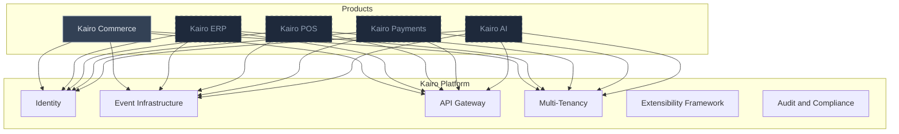
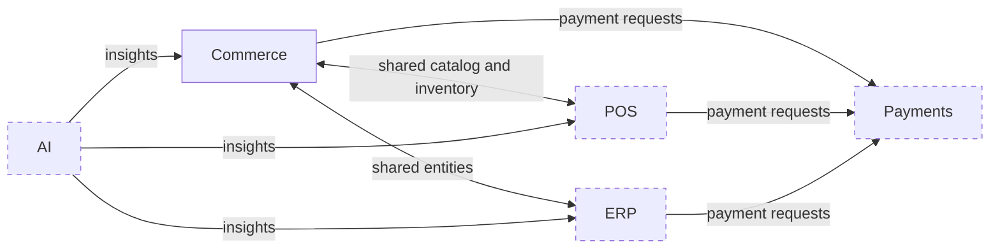
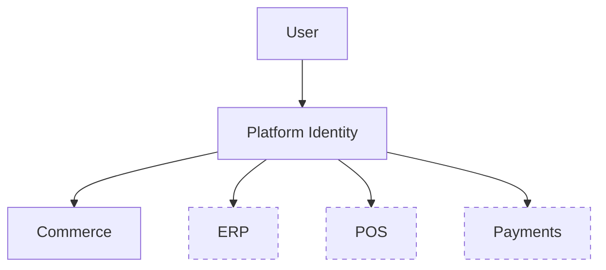

# Product Ecosystem

## Metadata

| Field | Value |
|-------|-------|
| Title | Kairo Product Ecosystem |
| Document ID | KAI-PROD-003 |
| Status | Draft |
| Version | 0.1 |
| Target Release | N/A |
| Owner | Chief Product Architect |
| Created | 2026-07-15 |
| Last Updated | 2026-07-15 |
| Reviewers | TODO |
| Related Documents | [Kairo Platform](./Kairo-Platform.md), [Kairo Commerce](./Kairo-Commerce.md), [Vision](../01-Foundation/Vision.md) |
| Dependencies | None |

---

## Purpose

This document describes the complete Kairo product ecosystem — its current state, its planned direction, and the relationships between products. It establishes how products coexist, how they remain independent, and how the platform ensures consistency across the ecosystem.

---

## Ecosystem Overview

Solid borders represent current products. Dashed borders represent future products.

---

## Current Products

### Kairo Commerce

The first product in the ecosystem. Kairo Commerce provides API-first commerce backend infrastructure covering catalog, pricing, inventory, orders, cart, and related commerce operations.

See [Kairo Commerce](./Kairo-Commerce.md) for the full product definition.

---

## Future Products

The following products are planned for the Kairo ecosystem. They are listed here to establish directional intent, not commitment. Each product will be formally defined in its own product document when it enters active planning.

### Kairo ERP

Enterprise resource planning capabilities including accounting, procurement, and operational management. Designed to interoperate with Commerce for businesses that need unified back-office operations.

### Kairo POS

Point-of-sale infrastructure for physical retail. Extends the commerce domain into in-store operations while sharing catalog, inventory, pricing, and customer data with Commerce.

### Kairo Payments

Payment processing and financial operations. Provides a unified payment layer that all other products can consume, replacing per-product payment integrations with a single platform service.

### Kairo Identity

Dedicated identity and access management product for organizations that need advanced identity capabilities beyond the platform's built-in authentication. Customer identity, federated login, and fine-grained access control.

### Kairo AI

AI-powered capabilities that operate across the ecosystem. Demand forecasting, pricing optimization, search relevance, and operational intelligence derived from cross-product data.

---

## Relationships Between Products

Products in the ecosystem relate to each other through the platform layer, not through direct dependencies.

Key relationship principles:

- **No product depends on another for basic operation.** Every product functions independently. Interoperability is additive.
- **Shared entities are referenced, not duplicated.** When Commerce and ERP both need a customer record, they reference the same entity through the platform's identity layer.
- **Communication is event-driven.** Products notify the ecosystem of state changes through events. Other products subscribe to relevant events. There is no synchronous coupling between products.
- **Integration is optional.** A customer using Commerce alone never encounters references to ERP, POS, or any other product.

---

## Shared Platform Services

All products consume the following platform services rather than implementing their own:

| Service | Responsibility |
|---------|---------------|
| Identity | Authentication, authorization, and user management |
| API Gateway | Routing, rate limiting, and unified API entry point |
| Event Infrastructure | Asynchronous event publishing and subscription |
| Multi-Tenancy | Tenant isolation, data partitioning, and tenant-scoped operations |
| Extensibility Framework | Webhooks, custom fields, and extension mechanisms |
| Audit and Compliance | Audit logging, data governance, and regulatory support |
| Developer Tooling | SDKs, CLI, sandbox environments, and API documentation |

---

## Shared Identity

Identity is a platform concern, not a product concern.

- A single identity model spans all products. A user authenticated in Commerce is authenticated across the ecosystem.
- Permissions are scoped per product and per tenant. Access to Commerce does not imply access to ERP.
- Customer identity is unified. A customer record exists once, regardless of how many products interact with that customer.
- Service-to-service authentication between products uses the platform's identity infrastructure.

---

## Shared Infrastructure

Products share infrastructure to ensure consistency and reduce operational overhead:

- **Event bus** — All products emit and consume events through a single platform event system. Event formats are standardized.
- **Configuration management** — Platform-level configuration (tenancy, feature flags, environment settings) is managed centrally.
- **Monitoring and observability** — Logging, metrics, and tracing follow platform standards and flow into unified observability infrastructure.
- **Data conventions** — Identifier formats, timestamp formats, currency handling, and pagination patterns are defined once at the platform level.

---

## Product Independence

Despite sharing platform services, every product maintains strict independence:

- **Independent release cycles** — Each product is versioned and released on its own schedule.
- **Independent data ownership** — Each product owns its domain data. No product reads or writes another product's data directly.
- **Independent adoption** — Customers adopt products individually. There is no minimum bundle.
- **Independent teams** — Products can be developed by separate teams without coordination beyond platform conventions.
- **Independent documentation** — Each product has its own documentation within the repository, following shared standards.

Independence is not isolation. Products are aware of each other's existence and designed to interoperate. But interoperability is always optional and additive.

---

## Platform Consistency

Consistency across the ecosystem is maintained through:

- **API standards** — All products follow the same request/response patterns, error formats, pagination, filtering, and versioning conventions.
- **Naming conventions** — Entity names, field names, and endpoint patterns follow platform-wide rules.
- **Security model** — Authentication, authorization, and data isolation work identically across all products.
- **Event conventions** — Event naming, payload structure, and delivery semantics are standardized.
- **Documentation structure** — Product documentation follows the same templates and metadata standards.
- **Extensibility patterns** — Webhooks, custom fields, and integration points follow the same mechanisms in every product.

Consistency is enforced through governance, not through shared code. Each product implements the conventions independently but is held to the same standard through review and documentation.

---

## Future Growth

The ecosystem is designed to grow without restructuring:

- New products are added by adopting platform conventions and registering with platform services. Existing products are not modified.
- Cross-product capabilities emerge naturally as the ecosystem matures. Unified dashboards, cross-domain reporting, and ecosystem-wide search become possible without retrofitting.
- The platform layer evolves to support new shared needs. When multiple products require the same capability, it becomes a platform service rather than being duplicated.
- Third-party integration follows the same patterns as inter-product communication. External systems interact with Kairo products through the same APIs and events that products use internally.

The goal is an ecosystem that becomes more valuable with each product added, while each product remains independently valuable on its own.
