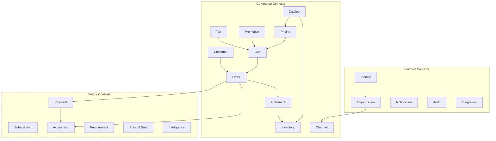

# Bounded Contexts

## Metadata

| Field | Value |
|-------|-------|
| Title | Kairo Bounded Contexts |
| Document ID | KAI-CAP-002 |
| Status | Draft |
| Version | 0.1 |
| Target Release | N/A |
| Owner | Chief Domain Architect |
| Created | 2026-07-15 |
| Last Updated | 2026-07-15 |
| Reviewers | TODO |
| Related Documents | [Capability Map](./Capability-Map.md), [Domain Model](../02-Products/Domain-Model.md), [Product Boundaries](../02-Products/Product-Boundaries.md), [Commerce Domain](../02-Products/Commerce-Domain.md) |
| Dependencies | None |

---

## Purpose

A bounded context is a boundary within which a particular domain model is defined and consistent. The same word may mean different things in different contexts — and that is intentional. Each bounded context owns its terminology, its rules, and its data within its boundary.

This document defines every bounded context in the Kairo platform. It establishes what each context owns, what it excludes, and how contexts relate to one another. These boundaries determine how the platform is structured and how products communicate.

Getting bounded contexts right is one of the most consequential architectural decisions. Misaligned boundaries create coupling, ambiguity, and structural debt that compounds with every feature added.

---

## Context Map

---

## Platform Contexts

### Identity Context

| Attribute | Detail |
|-----------|--------|
| Purpose | Establish and verify who is interacting with the platform and what they are permitted to do |
| Business Ownership | Shared Platform / Kairo Identity |

**Responsibilities:**
- User authentication and credential management
- Role and permission definitions
- Token issuance and validation
- Session lifecycle
- API key management
- Security policy enforcement (MFA, password rules, lockout)
- Federation with external identity providers

**Public Contracts:**
- Authenticated user identity (user ID, roles, permissions)
- Token validation interface
- Permission evaluation interface

**Intentionally Excluded:**
- Commerce-specific customer data (addresses, order history) — belongs to Customer context
- Product-specific activity records — each context owns its own activity data
- Audit trail storage — belongs to Audit context

**Relationship to Other Contexts:**
- All contexts depend on Identity for authentication and authorization.
- Identity is upstream of every other context. It has no upstream dependencies.
- Organization context consumes Identity to associate users with tenants.
- Customer context references Identity for credential management but owns the commerce profile independently.

---

### Organization Context

| Attribute | Detail |
|-----------|--------|
| Purpose | Represent the business entities that operate on the platform and establish data boundaries |
| Business Ownership | Shared Platform |

**Responsibilities:**
- Tenant creation and lifecycle
- Organization profile and settings
- Data isolation boundaries
- Organization-level configuration

**Public Contracts:**
- Organization identity (organization ID, tenant boundary)
- Tenant resolution for incoming requests
- Organization settings interface

**Intentionally Excluded:**
- Store-level configuration — belongs to Channel context within Commerce
- User management — belongs to Identity context
- Billing and subscription management — future platform concern

**Relationship to Other Contexts:**
- Downstream of Identity (users belong to organizations).
- Upstream of all product contexts (all data is organization-scoped).
- Channel context operates within the organization boundary.

---

### Notification Context

| Attribute | Detail |
|-----------|--------|
| Purpose | Deliver messages to users and external systems in response to platform events |
| Business Ownership | Shared Platform |

**Responsibilities:**
- Message delivery across channels (email, webhook)
- Template management and rendering
- Delivery tracking and retry
- Notification preferences per user

**Public Contracts:**
- Notification dispatch interface (accepts event, recipient, channel)
- Delivery status inquiry

**Intentionally Excluded:**
- Business event definitions — each context defines its own events
- Recipient resolution logic beyond basic user lookup — product contexts determine who should be notified
- Marketing campaign management — outside platform scope

**Relationship to Other Contexts:**
- Downstream of all contexts that produce notifiable events (Order, Fulfillment, Inventory, Payment).
- Depends on Identity for recipient resolution.
- Does not influence business logic in any other context.

---

### Audit Context

| Attribute | Detail |
|-----------|--------|
| Purpose | Record a tamper-evident history of significant actions for accountability and compliance |
| Business Ownership | Shared Platform |

**Responsibilities:**
- Audit entry collection and storage
- Retention policy management
- Audit trail query and retrieval
- Compliance reporting support

**Public Contracts:**
- Audit entry submission interface (actor, action, resource, timestamp, context)
- Audit trail query interface

**Intentionally Excluded:**
- Business logic enforcement — Audit observes but does not influence
- Analytics or aggregation — belongs to Intelligence context
- Event processing beyond recording — Audit stores, not reacts

**Relationship to Other Contexts:**
- Downstream of all contexts. Receives audit entries from every significant operation.
- Depends on Identity for actor identification.
- Purely observational. No other context depends on Audit for business decisions.

---

### Integration Context

| Attribute | Detail |
|-----------|--------|
| Purpose | Manage connections between the Kairo platform and external systems |
| Business Ownership | Shared Platform |

**Responsibilities:**
- Integration configuration and credential storage
- Webhook registration and management
- External service connection lifecycle
- Integration health monitoring

**Public Contracts:**
- Integration configuration interface
- Webhook registration and dispatch interface
- External service credential retrieval (for authorized contexts)

**Intentionally Excluded:**
- Domain-specific integration logic — each context defines what it integrates with and why
- Data transformation between systems — handled at the product level
- Third-party application hosting — Kairo is not a marketplace

**Relationship to Other Contexts:**
- Serves all contexts that need external connectivity (Tax for tax services, Fulfillment for carriers, Payment for providers).
- Scoped per organization through the Organization context.
- Credentials governed by Identity.

---

## Commerce Contexts

### Catalog Context

| Attribute | Detail |
|-----------|--------|
| Purpose | Define and organize everything that can be sold |
| Business Ownership | Kairo Commerce |

**Responsibilities:**
- Product lifecycle (creation, modification, archival)
- Variant management with attribute combinations
- Category hierarchy and product categorization
- Product type definitions and attribute schemas
- Product relationships (related, cross-sell, bundle)
- Media reference management

**Public Contracts:**
- Product and variant identity (product ID, variant ID, SKU)
- Product data retrieval (attributes, categories, relationships)
- Product availability status

**Intentionally Excluded:**
- Pricing — Catalog defines what exists, Pricing defines what it costs
- Stock levels — Catalog defines items, Inventory tracks quantities
- Sales performance — belongs to Intelligence or Reporting
- Content management — editorial content belongs to external systems

**Relationship to Other Contexts:**
- Upstream of Pricing, Inventory, Cart, Order, and Channel contexts.
- Does not depend on any Commerce context. Depends only on Organization for scoping.
- Catalog items are referenced by ID in all downstream contexts. Downstream contexts do not modify catalog data.

**Term Clarification:**
- "Product" in Catalog means a sellable item definition. In Order context, a product reference is a line item snapshot.

---

### Pricing Context

| Attribute | Detail |
|-----------|--------|
| Purpose | Determine the correct price for any item in any context |
| Business Ownership | Kairo Commerce |

**Responsibilities:**
- Price list creation and management
- Price resolution based on context (channel, customer group, currency, quantity)
- Multi-currency price management
- Price scheduling and effective date management
- Price override handling

**Public Contracts:**
- Price resolution interface (given item, context, return resolved price)
- Price list retrieval

**Intentionally Excluded:**
- Discounts and promotional modifications — belongs to Promotion context
- Tax calculation — belongs to Tax context
- Payment collection — belongs to Payment context
- Cost of goods / purchase price — belongs to Procurement context (ERP)

**Relationship to Other Contexts:**
- Downstream of Catalog (prices attach to catalog items).
- Upstream of Cart and Order (provides resolved base prices).
- Promotion context modifies prices resolved by Pricing.
- Customer context provides group membership used for price resolution.
- Channel context determines which price lists are active.

**Term Clarification:**
- "Price" in Pricing means the base amount before discounts and tax. In Order context, "price" is the final resolved amount including all modifications.

---

### Inventory Context

| Attribute | Detail |
|-----------|--------|
| Purpose | Track what is available and where it is located |
| Business Ownership | Kairo Commerce |

**Responsibilities:**
- Stock level maintenance per variant per location
- Reservation management during purchase flow
- Stock movement recording (sale, return, adjustment, transfer, receipt)
- Multi-location inventory tracking
- Reorder threshold awareness

**Public Contracts:**
- Stock availability inquiry (given variant and location, return available quantity)
- Reservation request and release interface
- Stock adjustment interface

**Intentionally Excluded:**
- Warehouse management (bin locations, pick paths, warehouse layout) — future OMS/WMS concern
- Demand forecasting — belongs to Intelligence context
- Procurement and purchasing — belongs to Procurement context (ERP)
- Inventory valuation and costing — belongs to Accounting context (ERP)

**Relationship to Other Contexts:**
- Downstream of Catalog (tracks quantities for catalog items).
- Cart creates reservations. Order confirms or releases them.
- Fulfillment decrements inventory from specific locations.
- Returns restock inventory.

**Term Clarification:**
- "Available" in Inventory means physical stock minus active reservations. This differs from "visible" in Channel context, which determines whether a customer can see the item.

---

### Customer Context

| Attribute | Detail |
|-----------|--------|
| Purpose | Represent the people and businesses that purchase within commerce |
| Business Ownership | Kairo Commerce |

**Responsibilities:**
- Customer profile management (name, contact information)
- Address management (shipping, billing)
- Customer group assignment and membership
- Guest customer handling
- Customer notes and metadata

**Public Contracts:**
- Customer identity within commerce (customer ID, profile data)
- Customer group membership inquiry
- Address retrieval for checkout and fulfillment

**Intentionally Excluded:**
- Login credentials and authentication — belongs to Identity context
- Order history — belongs to Order context (referenced by customer ID)
- Payment methods — belongs to Payment context
- Customer analytics and segmentation — belongs to Intelligence context

**Relationship to Other Contexts:**
- References Identity for credential management. Owns the commerce-specific profile independently.
- Upstream of Order (orders belong to customers), Pricing (customer-specific pricing), and Promotion (customer eligibility).
- Organization context provides the tenant boundary.

**Term Clarification:**
- "Customer" in this context is a commerce concept — someone who buys. "User" in Identity context is anyone who authenticates. A customer may or may not be a user (guest checkout).

---

### Cart Context

| Attribute | Detail |
|-----------|--------|
| Purpose | Manage the pre-order shopping state with real-time calculations |
| Business Ownership | Kairo Commerce |

**Responsibilities:**
- Cart creation, persistence, and expiration
- Item management (add, remove, update quantity)
- Price resolution from Pricing context
- Discount application from Promotion context
- Tax calculation from Tax context
- Shipping method selection
- Cart totals and summary calculation
- Cart-to-order conversion

**Public Contracts:**
- Cart management interface (create, modify, retrieve)
- Cart calculation summary (items, subtotal, discounts, tax, shipping, total)

**Intentionally Excluded:**
- Order creation beyond the handoff — Order context takes ownership after conversion
- Payment processing — initiated during checkout, owned by Payment context
- Inventory ownership — Cart creates reservations through Inventory context but does not own stock data

**Relationship to Other Contexts:**
- Downstream of Catalog (item references), Pricing (price resolution), Promotion (discount application), Tax (tax calculation).
- Creates reservations in Inventory context.
- Upstream of Order context (cart converts to order at checkout).
- Customer context provides buyer identity when available.

---

### Order Context

| Attribute | Detail |
|-----------|--------|
| Purpose | Record and manage confirmed purchase transactions through their lifecycle |
| Business Ownership | Kairo Commerce |

**Responsibilities:**
- Order creation from completed carts
- Order lifecycle management (status transitions)
- Line item records with resolved prices, discounts, and tax
- Order total verification and storage
- Cancellation processing
- Return and refund initiation
- Order history maintenance

**Public Contracts:**
- Order identity (order ID, order number)
- Order data retrieval (line items, totals, status, history)
- Order lifecycle events (created, completed, cancelled, returned)

**Intentionally Excluded:**
- Payment execution — Order initiates payment requests; Payment context processes them
- Physical fulfillment — Order triggers fulfillment; Fulfillment context manages delivery
- Accounting entries — Order emits events; Accounting context records financial impact
- Advanced orchestration (split orders, backorders, routing) — future OMS context

**Relationship to Other Contexts:**
- Downstream of Cart (created from cart), Customer (buyer), Catalog, Pricing, Promotion, Tax (line item data).
- Upstream of Fulfillment (triggers shipment), Payment (triggers charge), Accounting (triggers journal entries).
- Returns feed back into Payment (refund) and Inventory (restock).

**Term Clarification:**
- "Order" is an immutable record of a transaction. Line item prices on an order are snapshots at the time of purchase, not live references to the Pricing context.

---

### Promotion Context

| Attribute | Detail |
|-----------|--------|
| Purpose | Define rules that modify pricing to incentivize purchases |
| Business Ownership | Kairo Commerce |

**Responsibilities:**
- Discount rule creation and management
- Coupon code lifecycle (creation, usage tracking, expiration)
- Eligibility evaluation based on cart contents, customer, and channel
- Stacking rule enforcement
- Campaign scheduling

**Public Contracts:**
- Promotion evaluation interface (given cart state, return applicable discounts)
- Coupon validation interface

**Intentionally Excluded:**
- Base pricing — belongs to Pricing context
- Marketing campaign management — outside Commerce scope
- Loyalty point accrual and redemption — future extension
- Analytics on promotion effectiveness — belongs to Intelligence context

**Relationship to Other Contexts:**
- Operates on base prices from Pricing context.
- Consumed by Cart and Order contexts during calculation.
- May reference Catalog (product targeting), Customer (group eligibility), and Channel (channel scoping).
- Does not modify Pricing data. Produces discount adjustments applied at calculation time.

---

### Tax Context

| Attribute | Detail |
|-----------|--------|
| Purpose | Determine and apply correct tax obligations |
| Business Ownership | Kairo Commerce |

**Responsibilities:**
- Tax zone and rate management
- Tax category definitions
- Tax calculation on taxable amounts
- Tax exemption handling
- External tax service delegation

**Public Contracts:**
- Tax calculation interface (given items, amounts, destination, return tax breakdown)
- Tax zone resolution (given address, return applicable zone)

**Intentionally Excluded:**
- Tax filing and remittance — belongs to Accounting context (ERP)
- Tax reporting — belongs to Reporting / Accounting
- Tax policy decisions — business configuration, not system responsibility

**Relationship to Other Contexts:**
- Downstream of Pricing (calculates tax on resolved prices after promotions).
- Consumed by Cart and Order contexts.
- Customer context provides destination addresses and exemption status.
- May delegate to external tax services through Integration context.

---

### Fulfillment Context

| Attribute | Detail |
|-----------|--------|
| Purpose | Coordinate the delivery of ordered goods |
| Business Ownership | Kairo Commerce |

**Responsibilities:**
- Shipment creation against order line items
- Fulfillment location selection
- Partial fulfillment management
- Tracking reference storage
- Delivery status updates
- Shipping method and rate management

**Public Contracts:**
- Shipment creation and tracking interface
- Fulfillment status events (shipped, delivered)
- Shipping method and rate inquiry

**Intentionally Excluded:**
- Warehouse management (bin locations, pick optimization) — future OMS/WMS concern
- Carrier contract negotiation — business process outside platform
- Logistics optimization and routing — belongs to Intelligence context or OMS
- Last-mile delivery operations — external carrier responsibility

**Relationship to Other Contexts:**
- Downstream of Order (fulfills order line items).
- Decrements Inventory from specific locations.
- Uses Integration context for carrier connections.
- Emits events consumed by Notification and Audit contexts.

---

### Channel Context

| Attribute | Detail |
|-----------|--------|
| Purpose | Define and manage distinct sales contexts within commerce |
| Business Ownership | Kairo Commerce |

**Responsibilities:**
- Channel creation and configuration
- Catalog visibility scoping per channel
- Pricing scope per channel
- Inventory visibility per channel
- Promotion scope per channel
- Channel-specific defaults and settings

**Public Contracts:**
- Channel identity and configuration retrieval
- Channel-scoped query filters for Catalog, Pricing, Inventory, and Promotion

**Intentionally Excluded:**
- Channel-specific frontend rendering — belongs to the developer's application
- Cross-channel analytics — belongs to Intelligence context
- Channel-specific authentication — uses platform Identity

**Relationship to Other Contexts:**
- Downstream of Organization (channels belong to an organization).
- Scopes Catalog, Pricing, Inventory, and Promotion contexts.
- Orders and Carts are placed within a channel context.
- Channels are independent. Configuration in one does not affect another.

---

## Future Contexts

### Payment Context

| Attribute | Detail |
|-----------|--------|
| Purpose | Process financial transactions |
| Business Ownership | Kairo Payments |

**Responsibilities:**
- Payment authorization, capture, and settlement
- Refund execution
- Payment method management
- Provider routing and failover
- Transaction record maintenance
- PCI compliance boundary management

**Public Contracts:**
- Payment request interface (amount, currency, method)
- Transaction status and history
- Refund execution interface

**Intentionally Excluded:**
- Order totals calculation — belongs to Order context
- Accounting entries — belongs to Accounting context
- Cash handling — belongs to POS context
- Pricing decisions — belongs to Pricing context

**Relationship to Other Contexts:**
- Downstream of Order (receives payment requests) and POS (in-store payments).
- Upstream of Accounting (feeds transaction data).
- Uses Integration context for provider connections.

---

### Subscription Context

| Attribute | Detail |
|-----------|--------|
| Purpose | Manage recurring purchase agreements |
| Business Ownership | Kairo Commerce (future extension) |

**Responsibilities:**
- Subscription plan definitions
- Billing cycle management
- Renewal and cancellation processing
- Usage tracking for metered subscriptions

**Public Contracts:**
- Subscription lifecycle interface (create, renew, cancel, pause)
- Upcoming renewal inquiry

**Intentionally Excluded:**
- One-time order processing — belongs to Order context
- Payment execution for renewals — belongs to Payment context
- Subscription analytics — belongs to Intelligence context

**Relationship to Other Contexts:**
- References Catalog and Pricing for subscription products and recurring prices.
- Generates Orders for each billing cycle.
- Triggers Payments for recurring charges.

---

### Accounting Context

| Attribute | Detail |
|-----------|--------|
| Purpose | Record the financial consequences of business operations |
| Business Ownership | Kairo ERP |

**Responsibilities:**
- Chart of accounts management
- Journal entry creation from business events
- Ledger maintenance
- Fiscal period management
- Financial reconciliation

**Public Contracts:**
- Financial summary interfaces
- Account balance inquiry

**Intentionally Excluded:**
- Business transaction initiation — Accounting records, not initiates
- Pricing decisions — belongs to Pricing context
- Inventory quantities — belongs to Inventory context

**Relationship to Other Contexts:**
- Downstream of Order, Payment, and Procurement (receives events to record).
- Does not influence upstream business logic.

---

### Procurement Context

| Attribute | Detail |
|-----------|--------|
| Purpose | Manage the acquisition of goods and services |
| Business Ownership | Kairo ERP |

**Responsibilities:**
- Purchase order creation and lifecycle
- Supplier management
- Goods receiving
- Cost tracking

**Public Contracts:**
- Purchase order interface
- Supplier data retrieval
- Receiving confirmation interface

**Intentionally Excluded:**
- Selling goods — belongs to Commerce contexts
- Inventory level management — belongs to Inventory context (Commerce)
- Payment to suppliers — belongs to Payment context

**Relationship to Other Contexts:**
- Supplies Inventory context (goods received increase stock).
- Feeds Accounting context (purchase costs recorded as journal entries).
- References Catalog items for goods being procured.

---

### Point of Sale Context

| Attribute | Detail |
|-----------|--------|
| Purpose | Manage physical retail transactions and in-store operations |
| Business Ownership | Kairo POS |

**Responsibilities:**
- Register session management
- In-store transaction processing
- Cash and drawer management
- Receipt generation
- Offline transaction queuing and sync
- Staff shift operations

**Public Contracts:**
- Transaction record interface
- Register session interface

**Intentionally Excluded:**
- Product catalog — consumed from Catalog context
- Pricing — consumed from Pricing context
- Inventory management — POS triggers changes, Inventory owns data
- Online orders — belongs to Order context

**Relationship to Other Contexts:**
- Consumes Catalog, Pricing, and Inventory from Commerce.
- Initiates Payments for in-store transactions.
- Emits events consumed by Accounting and Audit.

---

### Intelligence Context

| Attribute | Detail |
|-----------|--------|
| Purpose | Derive insights and recommendations from platform data |
| Business Ownership | Kairo AI |

**Responsibilities:**
- Cross-context data aggregation for analysis
- Predictive model execution
- Recommendation generation
- Anomaly and fraud signal detection

**Public Contracts:**
- Recommendation interface (given context, return suggestions)
- Forecast interface (given parameters, return predictions)
- Anomaly alert interface

**Intentionally Excluded:**
- Business data ownership — Intelligence reads, does not own
- Direct data modification in other contexts — provides signals, not commands
- Operational decisions — domain owners decide whether to act on insights

**Relationship to Other Contexts:**
- Reads from all contexts. Writes to none.
- Provides advisory signals consumed by domain owners at their discretion.

---

## Context Interaction Patterns

Bounded contexts interact through defined patterns. These patterns determine coupling and autonomy.

| Pattern | Description | Used When |
|---------|-------------|----------|
| Event | One context publishes an event. Another subscribes and reacts. No direct coupling. | Order publishes "OrderCompleted." Accounting subscribes and creates a journal entry. |
| Query | One context requests data from another through a defined interface. | Cart queries Pricing for resolved prices. |
| Command | One context requests an action from another through a defined interface. | Order sends a payment request to Payment. |
| Reference | One context holds an identifier from another context. It does not hold the data itself. | Order holds a customer ID. Customer data is retrieved from Customer context when needed. |

**Rules:**
- Contexts never access another context's internal data directly.
- All inter-context communication uses public contracts.
- Events are preferred for decoupling. Commands and queries create tighter coupling and should be used only when necessary.
- References are by ID only. Contexts do not embed copies of another context's data except as point-in-time snapshots (e.g., order line item prices).
