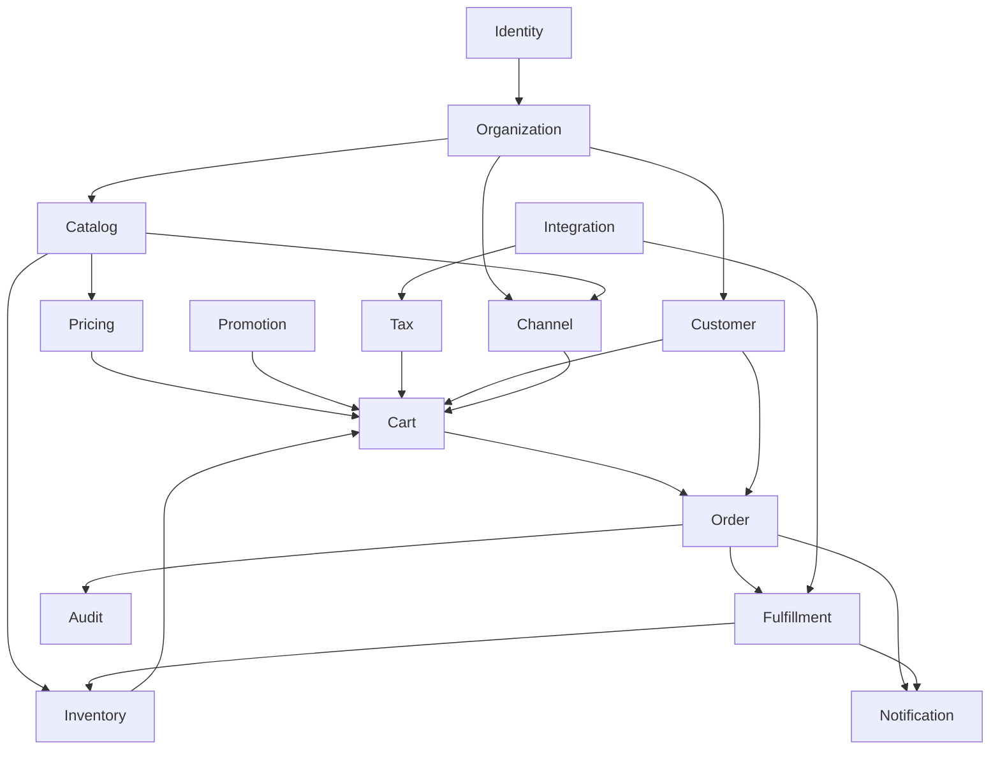
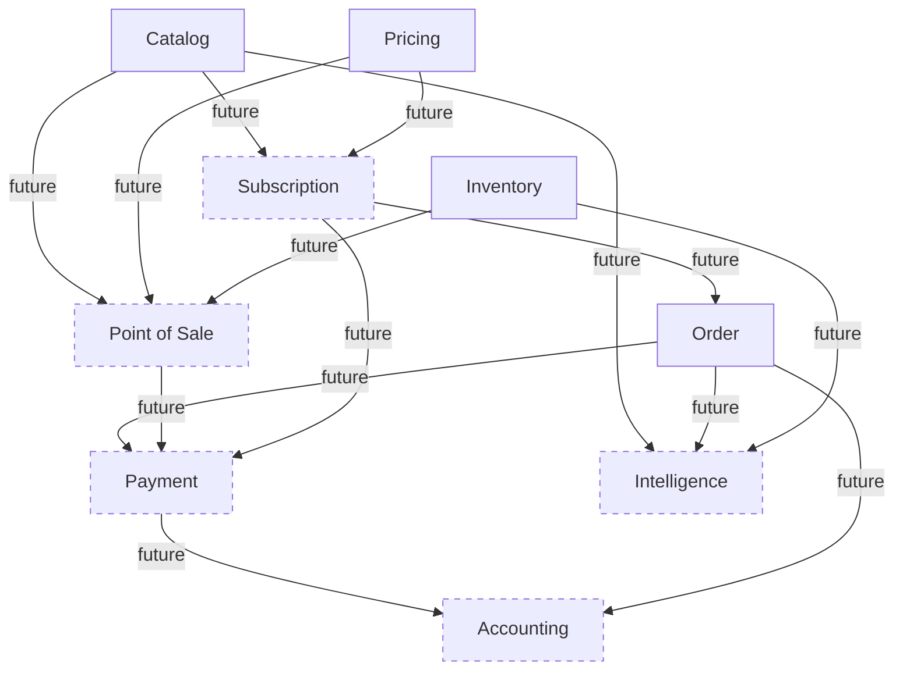
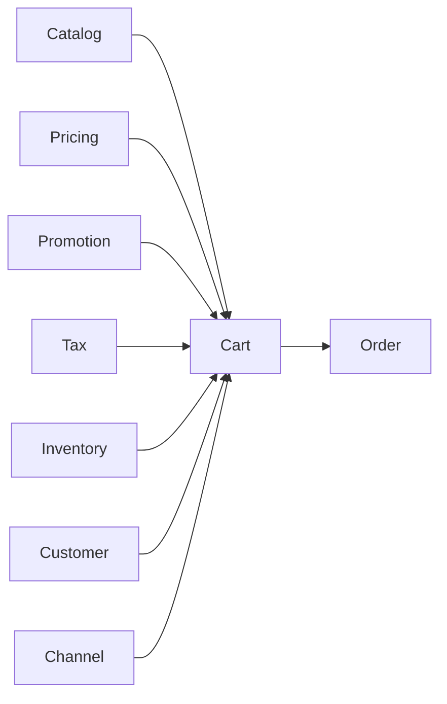
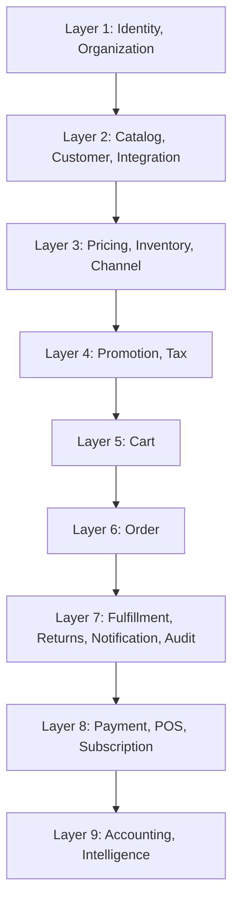

# Capability Dependencies

## Metadata

| Field | Value |
|-------|-------|
| Title | Kairo Capability Dependencies |
| Document ID | KAI-CAP-004 |
| Status | Draft |
| Version | 0.1 |
| Target Release | N/A |
| Owner | Chief Domain Architect |
| Created | 2026-07-15 |
| Last Updated | 2026-07-15 |
| Reviewers | TODO |
| Related Documents | [Capability Map](./Capability-Map.md), [Bounded Contexts](./Bounded-Contexts.md), [Context Relationships](./Context-Relationships.md) |
| Dependencies | None |

---

## Purpose

This document maps the dependencies between every business capability in the Kairo platform. It defines what each capability depends on, what depends on it, when it was introduced, and how critical it is to the business.

This map drives build sequencing, risk assessment, and impact analysis. Before any capability is modified, this document reveals what will be affected. Before any capability is planned, this document reveals what must exist first.

---

## Dependency Overview

### Future Capability Dependencies

---

## Platform Capabilities

### Identity Management

| Attribute | Detail |
|-----------|--------|
| Depends On | None |
| Required By | Organization, and transitively every capability in the platform |
| Version Introduced | v1.0 |
| Business Priority | Critical |
| Complexity | High |
| Business Criticality | Foundational — the platform cannot operate without Identity |

Identity is the root of the dependency tree. No other capability functions without it. It must be built and operational before any other capability.

---

### Organization Management

| Attribute | Detail |
|-----------|--------|
| Depends On | Identity |
| Required By | Catalog, Customer, Channel, and transitively all Commerce capabilities |
| Version Introduced | v1.0 |
| Business Priority | Critical |
| Complexity | Medium |
| Business Criticality | Foundational — all data is scoped to an organization |

Organization establishes the tenant boundary. Every commerce and platform capability operates within an organization context.

---

### Notification Delivery

| Attribute | Detail |
|-----------|--------|
| Depends On | Identity (recipient resolution), all event-producing capabilities (event sources) |
| Required By | None directly — consumers subscribe optionally |
| Version Introduced | v1.0 |
| Business Priority | High |
| Complexity | Medium |
| Business Criticality | Operational — important for customer communication but not a blocking dependency for other capabilities |

Notification is a leaf capability. Many capabilities feed events into it, but no capability depends on Notification to function.

---

### Audit and Compliance

| Attribute | Detail |
|-----------|--------|
| Depends On | Identity (actor identification), all capabilities (event sources) |
| Required By | None directly — Audit is observational |
| Version Introduced | v1.0 |
| Business Priority | High |
| Complexity | Medium |
| Business Criticality | Compliance — required for regulatory and operational accountability but does not block business operations |

Audit is a passive observer. It records events from all capabilities but no capability depends on Audit for its own operation.

---

### Integration Management

| Attribute | Detail |
|-----------|--------|
| Depends On | Identity (credential governance), Organization (scoping) |
| Required By | Tax (external tax services), Fulfillment (shipping carriers), Payment (payment providers) |
| Version Introduced | v1.0 |
| Business Priority | High |
| Complexity | Medium |
| Business Criticality | Enabling — unlocks external connectivity for capabilities that depend on third-party services |

Integration is infrastructure that capabilities consume when they need external connectivity. It is not required by all capabilities, but those that depend on it cannot function with external services without it.

---

## Commerce Capabilities

### Catalog Management

| Attribute | Detail |
|-----------|--------|
| Depends On | Organization |
| Required By | Pricing, Inventory, Cart, Order, Channel, Promotion, Fulfillment, POS, Subscription, Intelligence |
| Version Introduced | v1.0 |
| Business Priority | Critical |
| Complexity | High |
| Business Criticality | Core — every commerce operation references catalog items. Nothing can be sold without a catalog. |

Catalog is the most depended-upon Commerce capability. It defines the items that the entire commerce system operates on.

---

### Pricing Management

| Attribute | Detail |
|-----------|--------|
| Depends On | Catalog, Customer (customer-specific pricing), Channel (channel-scoped pricing) |
| Required By | Cart, Order, Promotion, POS, Subscription |
| Version Introduced | v1.0 |
| Business Priority | Critical |
| Complexity | High |
| Business Criticality | Core — nothing can be sold without a price |

Pricing is the second most critical Commerce capability. Cart and Order cannot calculate totals without resolved prices.

---

### Inventory Management

| Attribute | Detail |
|-----------|--------|
| Depends On | Catalog, Organization |
| Required By | Cart (availability, reservations), Order (stock confirmation), Fulfillment (location selection), POS, Intelligence |
| Version Introduced | v1.0 |
| Business Priority | Critical |
| Complexity | High |
| Business Criticality | Core — prevents overselling and enables fulfillment decisions |

Inventory is required for accurate commerce operations. Without it, the platform cannot guarantee availability or prevent overselling.

---

### Customer Management

| Attribute | Detail |
|-----------|--------|
| Depends On | Identity, Organization |
| Required By | Cart (customer context), Order (order ownership), Pricing (customer-specific pricing), Promotion (eligibility) |
| Version Introduced | v1.0 |
| Business Priority | Critical |
| Complexity | Medium |
| Business Criticality | Core — orders require a buyer. Pricing and promotions require customer context. |

Customer enables personalized commerce. Guest checkout reduces the hard dependency for basic order placement, but full commerce operations require customer management.

---

### Channel Management

| Attribute | Detail |
|-----------|--------|
| Depends On | Organization, Catalog |
| Required By | Cart (channel context), Pricing (channel scoping), Promotion (channel scoping), Inventory (visibility scoping) |
| Version Introduced | v1.0 |
| Business Priority | High |
| Complexity | Medium |
| Business Criticality | Important — required for multi-channel operations. Single-channel businesses can operate with a default channel. |

Channel enables differentiated sales contexts. It is architecturally present from v1.0 but operationally optional for single-channel use cases.

---

### Promotions and Discounts

| Attribute | Detail |
|-----------|--------|
| Depends On | Catalog (product targeting), Pricing (base prices), Customer (eligibility), Channel (scoping) |
| Required By | Cart (discount application), Order (discount records) |
| Version Introduced | v1.0 |
| Business Priority | High |
| Complexity | High |
| Business Criticality | Important — drives revenue through incentives. Commerce can operate without promotions but loses a key competitive capability. |

Promotions depend on multiple upstream capabilities to evaluate eligibility. The rule engine complexity is high, but the capability is additive — basic commerce functions without it.

---

### Tax Calculation

| Attribute | Detail |
|-----------|--------|
| Depends On | Pricing (taxable amounts), Customer (destination, exemptions), Integration (external tax services) |
| Required By | Cart (tax in totals), Order (tax records) |
| Version Introduced | v1.0 |
| Business Priority | Critical |
| Complexity | High |
| Business Criticality | Compliance — legally required for commerce transactions in most jurisdictions |

Tax is a compliance requirement. Commerce cannot legally operate in most markets without accurate tax calculation. Despite being technically downstream, its business criticality is at the same level as Pricing.

---

### Cart

| Attribute | Detail |
|-----------|--------|
| Depends On | Catalog, Pricing, Promotion, Tax, Inventory, Customer, Channel |
| Required By | Order |
| Version Introduced | v1.0 |
| Business Priority | Critical |
| Complexity | High |
| Business Criticality | Core — the bridge between browsing and purchasing. Orchestrates all upstream capabilities into a purchase-ready state. |

Cart has the most upstream dependencies of any Commerce capability. It is the orchestration point that brings Catalog, Pricing, Promotion, Tax, Inventory, Customer, and Channel together into a single calculated state.

---

### Order Management

| Attribute | Detail |
|-----------|--------|
| Depends On | Cart, Customer, Catalog, Pricing, Promotion, Tax |
| Required By | Fulfillment, Payment, Accounting, Notification, Audit, Intelligence |
| Version Introduced | v1.0 |
| Business Priority | Critical |
| Complexity | High |
| Business Criticality | Core — the system of record for all sales transactions |

Order is the central record of commerce activity. It is heavily depended upon by downstream capabilities and is the primary data source for financial and operational processes.

---

### Returns Management

| Attribute | Detail |
|-----------|--------|
| Depends On | Order, Inventory (restock), Payment (refund) |
| Required By | Notification, Audit, Accounting |
| Version Introduced | v1.0 |
| Business Priority | High |
| Complexity | Medium |
| Business Criticality | Operational — required for complete order lifecycle support and customer satisfaction |

Returns close the loop on the order lifecycle. They trigger inventory and financial reversals across multiple capabilities.

---

### Shipping and Fulfillment

| Attribute | Detail |
|-----------|--------|
| Depends On | Order, Inventory (location selection), Integration (carrier connections) |
| Required By | Notification (shipping updates), Audit, Inventory (stock decrement) |
| Version Introduced | v1.0 |
| Business Priority | Critical |
| Complexity | Medium |
| Business Criticality | Core — completing the sale requires delivery of goods |

Fulfillment connects the digital transaction to the physical world. It is the final step in the core commerce flow.

---

## Future Capabilities

### Payment Processing

| Attribute | Detail |
|-----------|--------|
| Depends On | Order (payment requests), Identity, Integration (provider connections) |
| Required By | Accounting (transaction records), Returns (refund execution), Subscription (recurring charges) |
| Version Introduced | Future |
| Business Priority | Critical |
| Complexity | High |
| Business Criticality | Core — commerce requires payment. Initially handled through Integration; becomes a dedicated capability. |

---

### Subscription Management

| Attribute | Detail |
|-----------|--------|
| Depends On | Catalog (subscription products), Pricing (recurring pricing), Payment (recurring charges), Order (recurring order creation) |
| Required By | Accounting (recurring revenue), Intelligence (churn analysis) |
| Version Introduced | Future |
| Business Priority | Medium |
| Complexity | High |
| Business Criticality | Growth — enables recurring revenue business models |

---

### Point-of-Sale Operations

| Attribute | Detail |
|-----------|--------|
| Depends On | Catalog, Pricing, Inventory, Identity (staff auth), Payment (in-store payments) |
| Required By | Accounting (in-store revenue), Audit, Notification |
| Version Introduced | Future |
| Business Priority | Medium |
| Complexity | High |
| Business Criticality | Extension — enables omnichannel commerce |

---

### Accounting

| Attribute | Detail |
|-----------|--------|
| Depends On | Order (revenue events), Payment (transaction records), Returns (reversal events) |
| Required By | Intelligence (financial analysis) |
| Version Introduced | Future |
| Business Priority | Medium |
| Complexity | High |
| Business Criticality | Compliance — required for financial reporting and regulatory obligations |

---

### Intelligence

| Attribute | Detail |
|-----------|--------|
| Depends On | Catalog, Order, Inventory, Payment, Accounting (all read-only) |
| Required By | None — advisory capability |
| Version Introduced | Future |
| Business Priority | Low (initially) |
| Complexity | High |
| Business Criticality | Strategic — provides long-term competitive advantage through data-driven decisions |

---

## Dependency Summary

| Capability | Depends On (count) | Required By (count) | Criticality |
|-----------|-------------------|-------------------|-------------|
| Identity | 0 | All | Foundational |
| Organization | 1 | All Commerce | Foundational |
| Catalog | 1 | 10+ | Core |
| Pricing | 3 | 5+ | Core |
| Inventory | 2 | 5+ | Core |
| Customer | 2 | 4 | Core |
| Channel | 2 | 4 | Important |
| Promotion | 4 | 2 | Important |
| Tax | 3 | 2 | Compliance |
| Cart | 7 | 1 | Core |
| Order | 6 | 6+ | Core |
| Returns | 3 | 3 | Operational |
| Fulfillment | 3 | 3 | Core |
| Notification | 1+ | 0 | Operational |
| Audit | 1+ | 0 | Compliance |
| Integration | 2 | 3+ | Enabling |
| Payment | 3 | 3+ | Core (future) |
| Subscription | 4 | 2 | Growth (future) |
| POS | 5 | 3 | Extension (future) |
| Accounting | 3 | 1 | Compliance (future) |
| Intelligence | 5+ | 0 | Strategic (future) |

---

## Build Sequence Implications

The dependency graph implies a natural build sequence:

Each layer can only be built after its dependencies in prior layers are operational. Within a layer, capabilities can be built in parallel.

---

## Impact Analysis Rules

When modifying a capability:

1. Identify all capabilities in its "Required By" list.
2. Assess whether the change affects the public contract consumed by those capabilities.
3. If the public contract changes, all downstream capabilities must be evaluated and potentially updated.
4. Changes to foundational capabilities (Identity, Organization, Catalog) have the widest blast radius and require the most rigorous review.
5. Changes to leaf capabilities (Notification, Audit, Intelligence) have no downstream impact.
