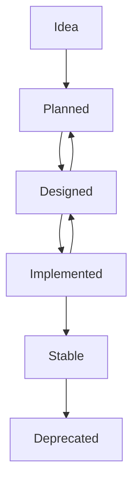

# Capability Lifecycle

## Metadata

| Field | Value |
|-------|-------|
| Title | Kairo Capability Lifecycle |
| Document ID | KAI-CAP-006 |
| Status | Draft |
| Version | 0.1 |
| Target Release | N/A |
| Owner | Chief Domain Architect |
| Created | 2026-07-15 |
| Last Updated | 2026-07-15 |
| Reviewers | TODO |
| Related Documents | [Capability Map](./Capability-Map.md), [Capability Dependencies](./Capability-Dependencies.md), [Document Lifecycle](../00-Governance/Document-Lifecycle.md) |
| Dependencies | None |

---

## Purpose

Business capabilities are not static. They emerge from business needs, mature through design and implementation, stabilize in production, and eventually may be replaced or retired. This document defines the lifecycle that every business capability follows from initial concept to deprecation.

Understanding where a capability sits in its lifecycle determines what actions are appropriate. A capability in the Idea stage cannot be built. A capability in Stable status should not be redesigned without justification. A Deprecated capability must not be used for new work.

---

## Lifecycle Stages

### Idea

The need for a capability has been identified but not yet committed to.

| Attribute | Detail |
|-----------|--------|
| Entry Criteria | A business need or customer problem has been articulated |
| Activities | Discussion among stakeholders, initial scoping, feasibility assessment |
| Artifacts | None required. May have informal notes or discussion records. |
| Exit Criteria | Decision to plan the capability or discard the idea |
| Allowed Actions | Discuss, evaluate, discard |
| Prohibited Actions | Design, implement, allocate resources, commit to timelines |

Ideas may come from customer feedback, competitive analysis, strategic direction, or internal observation. Not all ideas become capabilities. Discarding an idea after evaluation is a normal and healthy outcome.

---

### Planned

The capability has been accepted for future development. It has been scoped, prioritized, and assigned to a target release.

| Attribute | Detail |
|-----------|--------|
| Entry Criteria | Idea has been evaluated and accepted. Business priority is assigned. Target release is identified. |
| Activities | Dependency analysis, resource planning, capability registration in the Capability Map |
| Artifacts | Entry in the Capability Map, dependency mapping, roadmap placement |
| Exit Criteria | Decision to begin design work |
| Allowed Actions | Plan, analyze dependencies, allocate to a release |
| Prohibited Actions | Design architecture, write specifications, implement |

A planned capability is a commitment to design, not a commitment to deliver. Planning validates that the capability fits within the platform's direction and that its dependencies can be satisfied.

---

### Designed

The capability has been architecturally designed, documented, and approved. Its bounded context, public contracts, and relationships to other capabilities are defined.

| Attribute | Detail |
|-----------|--------|
| Entry Criteria | Planning is complete. Architecture and specification documents are drafted and approved. |
| Activities | Architecture design, API contract definition, bounded context specification, dependency contract negotiation, document review |
| Artifacts | Architecture document (approved), module specification (approved), API contracts (approved), ADR for significant decisions |
| Exit Criteria | All design documents are approved. Dependencies are confirmed. Implementation can begin. |
| Allowed Actions | Design, document, review, approve, negotiate contracts with dependent capabilities |
| Prohibited Actions | Implement in production, release to customers |

Design may reveal that the capability needs to return to Planned if the scope, complexity, or dependencies are significantly different from what was assumed during planning.

---

### Implemented

The capability has been built, tested, and deployed. It is available for use but may still be maturing.

| Attribute | Detail |
|-----------|--------|
| Entry Criteria | Design is approved. Code is complete. Tests pass. Deployment is successful. |
| Activities | Development, testing, deployment, initial monitoring, documentation updates |
| Artifacts | Working code, test suites, deployment records, updated documentation |
| Exit Criteria | Capability has been in production for a defined period without significant issues |
| Allowed Actions | Use in production, monitor, fix defects, iterate on feedback |
| Prohibited Actions | Treat as permanently stable, stop monitoring, reduce test coverage |

An implemented capability may return to Designed if production experience reveals fundamental design issues that require rearchitecting rather than incremental fixes.

---

### Stable

The capability is mature, reliable, and well-understood. It handles production workloads without significant issues. Its contracts are established and depended upon by other capabilities.

| Attribute | Detail |
|-----------|--------|
| Entry Criteria | Implemented capability has operated in production without significant issues for a sustained period. Performance and reliability meet defined standards. |
| Activities | Maintenance, incremental improvement, performance optimization, documentation maintenance |
| Artifacts | Maintained documentation, performance baselines, operational runbooks |
| Exit Criteria | Decision to deprecate based on replacement or obsolescence |
| Allowed Actions | Maintain, optimize, extend within defined scope, update documentation |
| Prohibited Actions | Fundamental redesign without a formal decision record, removal of existing contracts without deprecation process |

Stable is the target state for all capabilities. Most of the platform's lifetime is spent with capabilities in this stage. Changes to stable capabilities follow the change management process and require review proportional to the change's impact.

---

### Deprecated

The capability is being replaced or retired. It remains available for existing consumers but must not be used for new work.

| Attribute | Detail |
|-----------|--------|
| Entry Criteria | A replacement capability exists or the business need no longer applies. A formal deprecation decision has been recorded. |
| Activities | Migration support, consumer notification, sunset timeline communication, documentation of replacement |
| Artifacts | Deprecation notice, migration guide, replacement capability reference, ADR documenting the decision |
| Exit Criteria | All consumers have migrated. The capability is decommissioned. |
| Allowed Actions | Support existing consumers, provide migration guidance, maintain until decommission |
| Prohibited Actions | Accept new consumers, add new features, use as a dependency for new capabilities |

Deprecated capabilities are never deleted from documentation. Their records are retained for historical reference. The Capability Map marks them as deprecated and links to their replacements.

---

## Lifecycle Transitions

| From | To | Trigger | Authority |
|------|----|---------|-----------|
| Idea | Planned | Business case accepted, priority assigned | Product Architect |
| Idea | Discarded | Idea does not align with vision, is infeasible, or is deprioritized | Product Architect |
| Planned | Designed | Design work begins based on roadmap schedule | Architect |
| Designed | Planned | Design reveals scope or dependency issues requiring re-planning | Architect |
| Designed | Implemented | Design approved, implementation begins | Architect |
| Implemented | Designed | Production reveals fundamental design flaws | Architect |
| Implemented | Stable | Sustained production operation without significant issues | Architect |
| Stable | Deprecated | Replacement exists or business need has ended | Product Architect, Founder |

---

## Governance

### Capability Registration

Every capability must be registered in the [Capability Map](./Capability-Map.md) when it enters the Planned stage. Registration includes:

- Capability name and description
- Owning product
- Dependencies
- Target lifecycle stage
- Business priority and criticality

### Stage Gate Reviews

Transitions between lifecycle stages require review:

| Transition | Review Requirement |
|-----------|-------------------|
| Idea → Planned | Product review confirming alignment with vision and roadmap |
| Planned → Designed | Architecture review confirming design quality and dependency readiness |
| Designed → Implemented | Design approval sign-off from architect and relevant reviewers |
| Implemented → Stable | Operational review confirming production readiness and reliability |
| Stable → Deprecated | Cross-product impact assessment and migration plan review |

### Documentation Requirements by Stage

| Stage | Required Documentation |
|-------|----------------------|
| Idea | None |
| Planned | Capability Map entry, dependency analysis |
| Designed | Architecture document, module specification, API contracts, ADRs |
| Implemented | Updated architecture documents, deployment documentation, test documentation |
| Stable | Maintained documentation, operational runbooks, performance baselines |
| Deprecated | Deprecation notice, migration guide, replacement reference |

### Dependency Governance

- A capability cannot move to Implemented if its upstream dependencies are not at least Implemented.
- A capability cannot move to Stable if its critical upstream dependencies are not Stable.
- A capability cannot be Deprecated while downstream capabilities depend on it, unless those capabilities have migrated to an alternative.
- Circular dependencies between capabilities are prohibited.

### Change Management

Changes to capabilities follow different processes depending on lifecycle stage:

| Stage | Change Process |
|-------|---------------|
| Idea | Informal discussion |
| Planned | Scope changes require product review |
| Designed | Contract changes require architecture review and downstream impact assessment |
| Implemented | Bug fixes follow standard development process. Design changes require return to Designed stage. |
| Stable | All changes require review. Contract changes require deprecation of old contracts and migration support. |
| Deprecated | No changes except critical security fixes |

### AI Agent Rules

AI coding agents must respect capability lifecycle:

- Never implement capabilities in Idea or Planned stages.
- Only implement capabilities with approved design documents (Designed stage or later).
- Never add new consumers to Deprecated capabilities.
- Verify the lifecycle stage of a capability before performing work on it.
- Report if a capability referenced in a task does not appear in the Capability Map.
