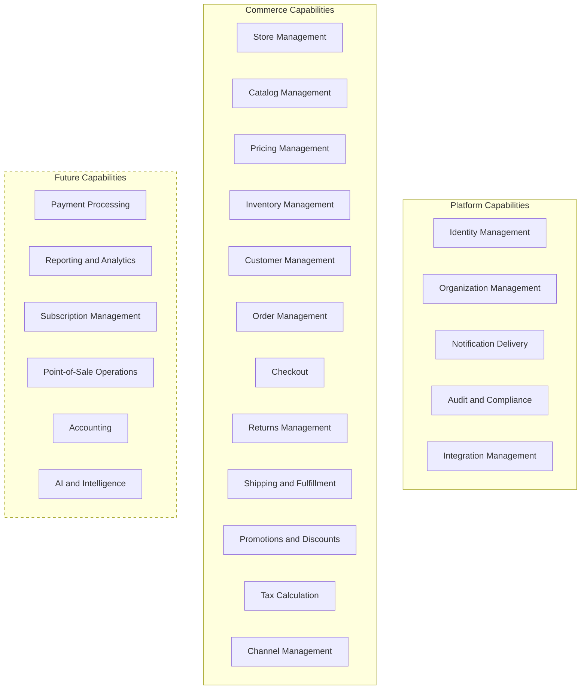
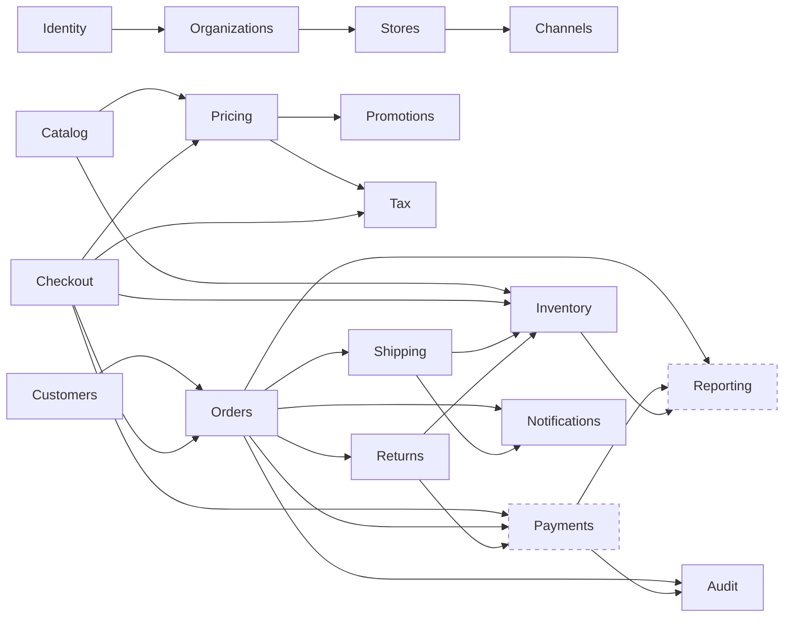

# Business Capability Map

## Metadata

| Field | Value |
|-------|-------|
| Title | Kairo Business Capability Map |
| Document ID | KAI-CAP-001 |
| Status | Draft |
| Version | 0.1 |
| Target Release | N/A |
| Owner | Chief Domain Architect |
| Created | 2026-07-15 |
| Last Updated | 2026-07-15 |
| Reviewers | TODO |
| Related Documents | [Domain Model](../02-Products/Domain-Model.md), [Product Boundaries](../02-Products/Product-Boundaries.md), [Product Ecosystem](../02-Products/Product-Ecosystem.md), [Commerce Domain](../02-Products/Commerce-Domain.md) |
| Dependencies | None |

---

## Purpose

This document defines every major business capability in the Kairo platform at the highest level. It answers the question: "What can Kairo do as a business system?"

Business capabilities describe what the platform does in business terms, independent of how it is built. They are stable over time — the platform's architecture, technology, and team structure may change, but the business capabilities remain consistent.

This map serves as the authoritative reference for capability ownership, dependencies, and growth direction. When a new feature is proposed, this map determines which capability it belongs to and which product owns it.

---

## Capability Overview

---

## Capability Relationships

---

## Platform Capabilities

### Identity Management

| Attribute | Detail |
|-----------|--------|
| Purpose | Verify who users are and control what they can do |
| Business Value | Enables secure access to all platform capabilities. Provides a single identity across the ecosystem. Protects business data through role-based access control. |
| Owning Product | Shared Platform / Kairo Identity |
| Dependencies | None. Identity is a foundational capability with no upstream dependencies. |

**Future Growth:**
- Federated identity and single sign-on across external providers.
- Customer self-service identity management.
- Fine-grained, attribute-based access control.
- Multi-organization user membership.

---

### Organization Management

| Attribute | Detail |
|-----------|--------|
| Purpose | Represent and manage the business entities that operate on the platform |
| Business Value | Provides the tenant boundary for all data and operations. Enables multi-tenant platform operation. Supports businesses with complex organizational structures. |
| Owning Product | Shared Platform |
| Dependencies | Identity Management (users belong to organizations) |

**Future Growth:**
- Organization hierarchies for parent-child business relationships.
- Cross-organization data sharing with controlled access.
- Organization-level billing and usage tracking.

---

### Notification Delivery

| Attribute | Detail |
|-----------|--------|
| Purpose | Deliver messages and alerts to users and external systems when significant events occur |
| Business Value | Keeps stakeholders informed of order status, inventory changes, and operational events. Enables external systems to react to platform activity. Reduces manual monitoring effort. |
| Owning Product | Shared Platform |
| Dependencies | Identity Management (recipient resolution), all products (event sources) |

**Future Growth:**
- Multi-channel delivery (email, SMS, push).
- Notification preferences and quiet hours.
- Template management with variable substitution.
- Delivery tracking and retry.

---

### Audit and Compliance

| Attribute | Detail |
|-----------|--------|
| Purpose | Maintain a tamper-evident record of all significant actions for accountability and regulatory compliance |
| Business Value | Provides traceability for every business operation. Supports regulatory compliance requirements. Enables forensic investigation when issues arise. Builds trust through transparency. |
| Owning Product | Shared Platform |
| Dependencies | Identity Management (actor identification), all products (event sources) |

**Future Growth:**
- Configurable retention policies per organization.
- Compliance reporting for specific regulatory frameworks.
- Data access auditing.
- Audit export and archival.

---

### Integration Management

| Attribute | Detail |
|-----------|--------|
| Purpose | Connect the Kairo platform to external systems and third-party services |
| Business Value | Enables businesses to use Kairo alongside their existing tools. Supports payment providers, shipping carriers, tax services, and other external systems. Prevents vendor lock-in by maintaining open integration points. |
| Owning Product | Shared Platform |
| Dependencies | Identity Management (credential governance), Organizations (integration scoping) |

**Future Growth:**
- Pre-built connectors for common external systems.
- Integration health monitoring and alerting.
- Data transformation and mapping capabilities.
- Integration marketplace for community contributions.

---

## Commerce Capabilities

### Store Management

| Attribute | Detail |
|-----------|--------|
| Purpose | Define and configure the commercial operations within an organization |
| Business Value | Enables organizations to operate one or more distinct commercial businesses. Provides the operational context for commerce activities. Supports multi-store operations from a single organization. |
| Owning Product | Kairo Commerce |
| Dependencies | Organization Management (stores belong to organizations) |

**Future Growth:**
- Store-level settings and configuration inheritance.
- Store performance metrics and health indicators.
- Multi-region store configurations.

---

### Catalog Management

| Attribute | Detail |
|-----------|--------|
| Purpose | Define, organize, and maintain everything that can be sold |
| Business Value | Provides the foundation for all commerce operations. Enables rich product representation with variants and attributes. Supports complex product hierarchies and relationships. Drives the customer browsing and discovery experience. |
| Owning Product | Kairo Commerce |
| Dependencies | Store Management (catalog scoping), Channel Management (visibility control) |

**Future Growth:**
- Bundle and kit management.
- Digital product and service catalog support.
- Product lifecycle management (draft, active, archived).
- Catalog import and export capabilities.
- Advanced attribute types and validation.

---

### Pricing Management

| Attribute | Detail |
|-----------|--------|
| Purpose | Determine the correct price for any item in any context |
| Business Value | Enables flexible pricing strategies across markets, customer segments, and channels. Supports competitive positioning through dynamic pricing. Handles multi-currency operations for international commerce. Provides the financial foundation for all transactions. |
| Owning Product | Kairo Commerce |
| Dependencies | Catalog Management (items to price), Customer Management (customer-specific pricing), Channel Management (channel-scoped pricing) |

**Future Growth:**
- Scheduled pricing with automatic activation.
- Volume and tiered pricing.
- Contract-based and negotiated pricing for B2B.
- Price comparison and margin analysis.

---

### Inventory Management

| Attribute | Detail |
|-----------|--------|
| Purpose | Track what is available to sell and where it is located |
| Business Value | Prevents overselling by maintaining accurate stock counts. Supports multi-location operations with location-aware availability. Enables informed fulfillment decisions based on stock distribution. Provides the data foundation for replenishment planning. |
| Owning Product | Kairo Commerce |
| Dependencies | Catalog Management (items to track), Store Management (location context) |

**Future Growth:**
- Inventory transfer between locations.
- Automated reorder point notifications.
- Inventory forecasting integration with AI.
- Lot and serial number tracking.
- Inventory valuation methods.

---

### Customer Management

| Attribute | Detail |
|-----------|--------|
| Purpose | Represent and manage the people and businesses that purchase |
| Business Value | Enables personalized commerce experiences through customer context. Supports targeted pricing and promotions by customer group. Maintains purchase history for customer service and relationship management. Provides the customer dimension for business analytics. |
| Owning Product | Kairo Commerce |
| Dependencies | Identity Management (authentication and credentials), Organization Management (customer scoping) |

**Future Growth:**
- Company accounts with hierarchical buyer roles for B2B.
- Customer segmentation.
- Customer lifetime value tracking.
- Loyalty program membership.

---

### Checkout

| Attribute | Detail |
|-----------|--------|
| Purpose | Convert a customer's purchase intent into a confirmed order |
| Business Value | Orchestrates the critical moment of conversion. Ensures pricing, tax, inventory, and payment are resolved correctly before commitment. Provides the bridge between browsing and purchasing. Directly impacts revenue through conversion rate. |
| Owning Product | Kairo Commerce |
| Dependencies | Pricing Management (price resolution), Tax Calculation (tax application), Inventory Management (availability confirmation), Payment Processing (payment initiation), Customer Management (customer context) |

**Future Growth:**
- Multi-step checkout workflows.
- Checkout extensibility for custom validation.
- Abandoned checkout recovery signals.
- Quote-to-order conversion for B2B.

---

### Order Management

| Attribute | Detail |
|-----------|--------|
| Purpose | Record, track, and manage purchase transactions through their complete lifecycle |
| Business Value | Provides the system of record for all sales. Enables operational visibility into order status and fulfillment progress. Supports customer service through order history and modification. Generates the data that drives financial and operational reporting. |
| Owning Product | Kairo Commerce |
| Dependencies | Checkout (order creation), Customer Management (order ownership), Catalog Management (line item references), Pricing Management (resolved prices) |

**Future Growth:**
- Order editing and amendment after placement.
- Backorder management.
- Split orders across fulfillment locations.
- Advanced order orchestration (Kairo OMS).

---

### Promotions and Discounts

| Attribute | Detail |
|-----------|--------|
| Purpose | Create incentives that influence purchasing behavior |
| Business Value | Drives revenue through strategic discounting. Enables customer acquisition and retention campaigns. Supports competitive pricing tactics. Provides measurable marketing mechanisms tied directly to transactions. |
| Owning Product | Kairo Commerce |
| Dependencies | Pricing Management (base prices to modify), Catalog Management (product targeting), Customer Management (eligibility), Channel Management (channel scoping) |

**Future Growth:**
- Loyalty points and rewards programs.
- Tiered membership benefits.
- Referral incentives.
- Advanced stacking and exclusion rules.

---

### Tax Calculation

| Attribute | Detail |
|-----------|--------|
| Purpose | Determine and apply correct tax obligations to transactions |
| Business Value | Ensures regulatory compliance across jurisdictions. Automates complex tax determination that would otherwise require manual calculation. Supports international commerce with jurisdiction-specific rules. Protects the business from tax liability errors. |
| Owning Product | Kairo Commerce |
| Dependencies | Pricing Management (taxable amounts), Customer Management (tax exemptions, shipping addresses), Integration Management (external tax services) |

**Future Growth:**
- External tax provider integration (automated rate lookup).
- Tax reporting and filing support.
- Cross-border tax handling.
- Tax-inclusive pricing regions.

---

### Returns Management

| Attribute | Detail |
|-----------|--------|
| Purpose | Handle the return of purchased goods and the associated financial and inventory adjustments |
| Business Value | Supports customer satisfaction through clear return processes. Maintains inventory accuracy by restocking returned items. Provides operational visibility into return rates and reasons. Initiates refund processing to complete the customer experience. |
| Owning Product | Kairo Commerce |
| Dependencies | Order Management (original order reference), Inventory Management (restock), Payment Processing (refund execution) |

**Future Growth:**
- Return merchandise authorization workflows.
- Exchange processing.
- Store credit as refund alternative.
- Return reason analysis.

---

### Shipping and Fulfillment

| Attribute | Detail |
|-----------|--------|
| Purpose | Coordinate the delivery of ordered goods from warehouse to customer |
| Business Value | Completes the customer's purchase experience. Enables multi-location fulfillment for operational efficiency. Provides delivery visibility through tracking. Supports customer expectations for shipping speed and reliability. |
| Owning Product | Kairo Commerce |
| Dependencies | Order Management (items to fulfill), Inventory Management (stock location), Integration Management (carrier connections) |

**Future Growth:**
- Intelligent fulfillment routing based on location and cost.
- Ship-from-store capabilities.
- Dropship fulfillment.
- Delivery scheduling and time-slot selection.

---

### Channel Management

| Attribute | Detail |
|-----------|--------|
| Purpose | Operate distinct sales contexts from a single platform |
| Business Value | Enables businesses to serve different markets, regions, or customer segments with tailored experiences. Supports B2B and B2C operations from the same infrastructure. Provides operational isolation between channels without data duplication. |
| Owning Product | Kairo Commerce |
| Dependencies | Store Management (channel scoping), Catalog Management (channel visibility), Pricing Management (channel pricing) |

**Future Growth:**
- Channel-specific reporting.
- Cross-channel order visibility.
- Channel-level permission models.

---

## Future Capabilities

### Payment Processing

| Attribute | Detail |
|-----------|--------|
| Purpose | Process financial transactions across the ecosystem |
| Business Value | Provides a unified payment layer for all products. Manages PCI compliance centrally. Supports multiple payment methods and providers. Eliminates per-product payment integration effort. |
| Owning Product | Kairo Payments |
| Dependencies | Identity Management (payer identification), Order Management / POS Operations (payment requests), Integration Management (provider connections) |

**Future Growth:**
- Multi-provider routing and failover.
- Payout management for marketplace models.
- Recurring payment support for subscriptions.
- Alternative payment methods (wallets, BNPL).

---

### Reporting and Analytics

| Attribute | Detail |
|-----------|--------|
| Purpose | Aggregate business data across the ecosystem for decision-making |
| Business Value | Provides operational visibility across all products. Enables data-driven business decisions. Surfaces trends and anomalies that inform strategy. Supports compliance and regulatory reporting requirements. |
| Owning Product | Kairo AI / Shared Platform |
| Dependencies | All products (data sources — read-only) |

**Future Growth:**
- Cross-product dashboards.
- Custom report builder.
- Scheduled report generation and delivery.
- Data export for external analysis tools.

---

### Subscription Management

| Attribute | Detail |
|-----------|--------|
| Purpose | Manage recurring purchase agreements and billing |
| Business Value | Enables recurring revenue business models. Automates billing and order generation for subscription products. Supports customer retention through predictable service delivery. |
| Owning Product | Kairo Commerce (future extension) |
| Dependencies | Catalog Management (subscription products), Pricing Management (recurring pricing), Payment Processing (recurring charges), Order Management (recurring orders) |

**Future Growth:**
- Usage-based billing.
- Subscription tiers and upgrades.
- Trial periods and grace periods.
- Subscription analytics.

---

### Point-of-Sale Operations

| Attribute | Detail |
|-----------|--------|
| Purpose | Support physical retail sales and in-store operations |
| Business Value | Extends commerce into physical retail. Unifies online and in-store operations. Enables omnichannel customer experiences. Provides real-time inventory synchronization across channels. |
| Owning Product | Kairo POS |
| Dependencies | Catalog Management (product data), Pricing Management (in-store prices), Inventory Management (stock availability), Payment Processing (in-store payments), Identity Management (staff authentication) |

**Future Growth:**
- Offline-capable transactions.
- Multi-register management.
- Staff performance tracking.
- In-store customer engagement tools.

---

### Accounting

| Attribute | Detail |
|-----------|--------|
| Purpose | Record the financial impact of all business operations |
| Business Value | Provides the financial system of record. Supports regulatory compliance for financial reporting. Enables profitability analysis and cost management. Automates financial record-keeping from commerce and payment events. |
| Owning Product | Kairo ERP |
| Dependencies | Order Management (revenue events), Payment Processing (transaction records), Returns Management (refund records) |

**Future Growth:**
- Multi-entity accounting.
- Automated reconciliation.
- Tax filing integration.
- Financial consolidation.

---

### AI and Intelligence

| Attribute | Detail |
|-----------|--------|
| Purpose | Derive actionable insights and automate decisions through data analysis |
| Business Value | Reduces manual analysis effort. Surfaces opportunities invisible to human review at scale. Improves operational efficiency through predictive capabilities. Enhances customer experience through personalization. |
| Owning Product | Kairo AI |
| Dependencies | All products (data sources — read-only), Integration Management (external data enrichment) |

**Future Growth:**
- Demand forecasting.
- Dynamic pricing recommendations.
- Fraud detection signals.
- Search ranking and relevance optimization.
- Product recommendations.

---

## Capability Ownership Summary

| Capability | Owning Product | Status |
|-----------|---------------|--------|
| Identity Management | Shared Platform / Kairo Identity | Active |
| Organization Management | Shared Platform | Active |
| Notification Delivery | Shared Platform | Active |
| Audit and Compliance | Shared Platform | Active |
| Integration Management | Shared Platform | Active |
| Store Management | Kairo Commerce | Active |
| Catalog Management | Kairo Commerce | Active |
| Pricing Management | Kairo Commerce | Active |
| Inventory Management | Kairo Commerce | Active |
| Customer Management | Kairo Commerce | Active |
| Checkout | Kairo Commerce | Active |
| Order Management | Kairo Commerce | Active |
| Promotions and Discounts | Kairo Commerce | Active |
| Tax Calculation | Kairo Commerce | Active |
| Returns Management | Kairo Commerce | Active |
| Shipping and Fulfillment | Kairo Commerce | Active |
| Channel Management | Kairo Commerce | Active |
| Payment Processing | Kairo Payments | Future |
| Reporting and Analytics | Kairo AI / Shared Platform | Future |
| Subscription Management | Kairo Commerce | Future |
| Point-of-Sale Operations | Kairo POS | Future |
| Accounting | Kairo ERP | Future |
| AI and Intelligence | Kairo AI | Future |

---

## Governance

- Every new business capability must be added to this map before development begins.
- Capability ownership is exclusive. Disputes are resolved through the process defined in [Product Boundaries](../02-Products/Product-Boundaries.md).
- This document is updated when new capabilities are identified or when ownership changes through a formal decision record.
