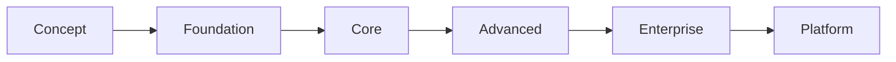

# Capability Maturity Model

## Metadata

| Field | Value |
|-------|-------|
| Title | Kairo Capability Maturity Model |
| Document ID | KAI-CAP-007 |
| Status | Draft |
| Version | 0.1 |
| Target Release | N/A |
| Owner | Chief Domain Architect |
| Created | 2026-07-15 |
| Last Updated | 2026-07-15 |
| Reviewers | TODO |
| Related Documents | [Capability Lifecycle](./Capability-Lifecycle.md), [Capability Map](./Capability-Map.md), [Capability Dependencies](./Capability-Dependencies.md) |
| Dependencies | None |

---

## Purpose

Maturity describes how complete, reliable, and production-hardened a capability is. While the lifecycle defines where a capability sits in its journey from idea to retirement, maturity defines how deep and robust its implementation is at any given point.

A capability can be Implemented (lifecycle) but only at Foundation maturity. It can be Stable (lifecycle) and at Advanced maturity. These are independent dimensions that together provide a complete picture of a capability's readiness.

This model sets expectations for what each maturity level delivers, what quality standards apply, and what must be true before a capability advances to the next level.

---

## Maturity Levels

---

### Level 0: Concept

The capability exists as a defined business concept. It is documented but not yet built.

| Attribute | Expectation |
|-----------|-------------|
| Documentation | Capability is registered in the Capability Map. Purpose and boundaries are defined. |
| API | No API exists. Contracts may be drafted. |
| Data Model | Conceptual only. No schema exists. |
| Testing | None. |
| Reliability | N/A. |
| Observability | N/A. |
| Security | Threat model may be drafted. |
| Performance | N/A. |

**What this level means:** The organization understands what the capability is and why it is needed. No code has been written. This level corresponds to capabilities in the Planned or Designed lifecycle stage.

---

### Level 1: Foundation

The capability exists in a minimal, functional form. It handles the simplest use case end to end.

| Attribute | Expectation |
|-----------|-------------|
| Documentation | Architecture document and basic API documentation exist. |
| API | Core endpoints are functional. Contracts cover the primary use case. |
| Data Model | Schema supports the primary use case. May lack optimization. |
| Testing | Unit tests cover critical paths. Basic integration tests exist. |
| Reliability | Handles expected load for early adoption. Not hardened for production stress. |
| Observability | Basic logging is in place. Errors are captured. |
| Security | Authentication and authorization are enforced. Basic input validation exists. |
| Performance | Functional under light load. No performance optimization. |

**What this level means:** The capability works for its primary scenario. It is suitable for internal testing and early adopters who understand its limitations. It is not ready for production workloads with demanding requirements.

---

### Level 2: Core

The capability handles all common use cases reliably. It is production-ready for typical workloads.

| Attribute | Expectation |
|-----------|-------------|
| Documentation | Complete API documentation. Module specification is approved. Common use cases are documented with examples. |
| API | All primary and secondary endpoints are implemented. Error responses are clear and actionable. Pagination, filtering, and sorting are functional. |
| Data Model | Schema supports all common scenarios. Indexes are optimized for primary access patterns. |
| Testing | Comprehensive unit and integration tests. Edge cases for common scenarios are covered. |
| Reliability | Handles production workloads. Failure modes are identified and handled gracefully. |
| Observability | Structured logging, key metrics, and request tracing are in place. Alerts exist for critical failures. |
| Security | Full authorization model. Input validation is comprehensive. Data access boundaries are enforced. |
| Performance | Meets defined performance targets for common operations. Performance baselines are established. |

**What this level means:** The capability is ready for production use by the majority of customers. It handles standard commerce scenarios without gaps. This is the minimum acceptable level for a general availability release.

---

### Level 3: Advanced

The capability handles complex, real-world scenarios including edge cases, high-volume operations, and sophisticated business rules.

| Attribute | Expectation |
|-----------|-------------|
| Documentation | Advanced use cases are documented. Troubleshooting guides exist. Performance tuning guidance is available. |
| API | Advanced query capabilities, bulk operations, and complex filtering are supported. Webhook coverage is complete. |
| Data Model | Schema supports complex scenarios (multi-currency, multi-location, complex hierarchies). Data migration tooling exists. |
| Testing | Stress tests, chaos testing, and complex scenario tests are in place. Test coverage includes multi-tenant edge cases. |
| Reliability | Handles sustained high load. Degradation is graceful and predictable. Recovery from failures is automatic where possible. |
| Observability | Business-level metrics are tracked. Anomaly detection is in place. Operational dashboards are available. |
| Security | Advanced access control (field-level, row-level where appropriate). Security audit has been conducted. |
| Performance | Optimized for high-volume operations. Caching strategies are implemented. Performance under peak load is characterized. |

**What this level means:** The capability serves demanding customers with complex requirements. It handles edge cases that simpler implementations would fail on. It is operationally mature and well-understood by the team.

---

### Level 4: Enterprise

The capability meets the requirements of large-scale, complex organizations with demanding compliance, performance, and operational needs.

| Attribute | Expectation |
|-----------|-------------|
| Documentation | Enterprise deployment guides exist. Compliance documentation is available. SLA definitions are published. |
| API | Batch processing, asynchronous operations, and long-running workflow support where applicable. API versioning and deprecation processes are proven. |
| Data Model | Supports high-volume data at scale. Archival and retention strategies are implemented. |
| Testing | Load tests simulate enterprise-scale workloads. Compliance test suites exist. Disaster recovery is tested. |
| Reliability | SLA targets are defined and met. Redundancy and failover are in place. Recovery time objectives are documented and tested. |
| Observability | End-to-end transaction tracing across capabilities. SLA compliance monitoring. Capacity planning data is available. |
| Security | Compliance with industry standards (SOC 2, GDPR where applicable). Encryption at rest and in transit. Regular penetration testing. |
| Performance | Meets enterprise SLA under sustained peak load. Horizontal scaling is validated. |

**What this level means:** The capability is trusted by organizations where downtime, data loss, or compliance failures have significant business consequences. It is operationally excellent and meets formal reliability commitments.

---

### Level 5: Platform

The capability operates as foundational platform infrastructure. It is consumed by multiple products, has proven stability over extended periods, and serves as a building block for the ecosystem.

| Attribute | Expectation |
|-----------|-------------|
| Documentation | Platform integration guides exist. Multi-product consumption patterns are documented. Extension points are fully documented. |
| API | Contracts are stable and backward-compatible across multiple major versions. Breaking changes have not occurred for an extended period. |
| Data Model | Data model has been stable through multiple product releases without breaking changes. |
| Testing | Cross-product integration tests validate the capability's behavior as consumed by multiple products. Regression suites cover all known consumption patterns. |
| Reliability | Proven track record across multiple products and customer scales. Uptime exceeds formal SLA targets consistently. |
| Observability | Cross-product impact monitoring. Capacity planning accounts for multi-product growth. |
| Security | Security model is proven across diverse consumption patterns. Threat model is current and reviewed regularly. |
| Performance | Performance characteristics are stable and predictable under diverse workloads from multiple products. |

**What this level means:** The capability is infrastructure that the ecosystem depends on. Identity and Organization are expected to reach this level. Product-specific capabilities (e.g., Promotions) may never need to reach this level. Platform maturity is reserved for capabilities that serve as the foundation for multiple products.

---

## Maturity Assessment

Each capability should be periodically assessed against this model. The assessment captures the current maturity level and identifies what is needed to advance.

| Capability | Current Maturity | Target Maturity | Gap Summary |
|-----------|-----------------|----------------|-------------|
| Identity | TODO | Platform | TODO |
| Organization | TODO | Platform | TODO |
| Catalog | TODO | Core | TODO |
| Pricing | TODO | Core | TODO |
| Inventory | TODO | Core | TODO |
| Customer | TODO | Core | TODO |
| Channel | TODO | Core | TODO |
| Promotion | TODO | Core | TODO |
| Tax | TODO | Core | TODO |
| Cart | TODO | Core | TODO |
| Order | TODO | Core | TODO |
| Fulfillment | TODO | Core | TODO |
| Notification | TODO | Core | TODO |
| Audit | TODO | Core | TODO |
| Integration | TODO | Core | TODO |

---

## Advancement Criteria

A capability advances to the next maturity level when all expectations for that level are met across every attribute. Partial compliance does not qualify.

| Transition | Key Requirements |
|-----------|-----------------|
| Concept → Foundation | Functional primary use case, basic tests, basic documentation |
| Foundation → Core | All common use cases handled, production-ready reliability, complete API documentation, performance baselines |
| Core → Advanced | Complex scenarios handled, stress-tested, advanced observability, security audited |
| Advanced → Enterprise | SLA-grade reliability, compliance documentation, disaster recovery tested, enterprise-scale validated |
| Enterprise → Platform | Multi-product consumption proven, long-term contract stability, cross-product testing |

---

## Governance

- Maturity assessments are conducted when a capability transitions lifecycle stages (Implemented → Stable) or when a release is being prepared.
- Maturity targets are set during the Planned lifecycle stage and reviewed during design.
- A capability's maturity level is recorded in the Capability Map.
- Maturity advancement requires evidence, not assertion. Each attribute must be demonstrably met.
- Not all capabilities need to reach the highest maturity levels. The target maturity is determined by the capability's role and criticality. Platform-foundational capabilities target Platform maturity. Product-specific capabilities may target Core or Advanced.
- Maturity regression (dropping a level) is possible if standards are no longer met. This triggers a remediation plan.
