# Capability Roadmap

## Metadata

| Field | Value |
|-------|-------|
| Title | Kairo Capability Roadmap |
| Document ID | KAI-CAP-008 |
| Status | Draft |
| Version | 0.1 |
| Target Release | N/A |
| Owner | Chief Domain Architect |
| Created | 2026-07-15 |
| Last Updated | 2026-07-15 |
| Reviewers | TODO |
| Related Documents | [Capability Map](./Capability-Map.md), [Capability Dependencies](./Capability-Dependencies.md), [Capability Maturity](./Capability-Maturity.md), [Capability Lifecycle](./Capability-Lifecycle.md) |
| Dependencies | None |

---

## Purpose

This document maps business capabilities to platform versions. It establishes the sequence in which capabilities are introduced and matured across releases. This is a directional plan, not a commitment. Specific timelines and scope are managed in release-specific roadmap documents.

The sequencing is driven by dependency order, business priority, and the principle that each release must deliver a coherent, usable set of capabilities — not isolated features.

---

## Roadmap Overview

```mermaid
gantt
    title Capability Roadmap by Version
    dateFormat X
    axisFormat %s

    section Platform
    Identity                :done, 0, 1
    Organization            :done, 0, 1
    Configuration           :done, 0, 1
    Integration             :active, 0, 2
    Notification            :active, 1, 2
    Audit                   :active, 1, 2
    Search                  :2, 3
    Media                   :2, 3

    section Commerce
    Catalog                 :done, 0, 1
    Pricing                 :done, 0, 1
    Inventory               :done, 0, 1
    Customer                :done, 0, 1
    Channel                 :done, 0, 1
    Promotion               :done, 0, 1
    Tax                     :done, 0, 1
    Cart                    :done, 0, 1
    Order                   :done, 0, 1
    Fulfillment             :done, 0, 1
    Returns                 :active, 1, 2
    Advanced Inventory      :2, 3
    Advanced Pricing        :2, 3
    Subscription            :3, 4

    section Future Products
    Identity (dedicated)    :2, 3
    Payments                :2, 3
    POS                     :3, 4
    OMS                     :3, 4
    ERP                     :4, 5
    AI                      :4, 5
```

---

## V1 — Core Commerce

The first release establishes the platform foundation and delivers a complete, end-to-end commerce capability.

### Platform Capabilities

| Capability | Target Maturity | Purpose |
|-----------|----------------|---------|
| Identity | Foundation | Authentication and authorization for all API access |
| Organization | Foundation | Tenant isolation and data boundaries |
| Configuration | Foundation | Platform and tenant-level settings |

### Commerce Capabilities

| Capability | Target Maturity | Purpose |
|-----------|----------------|---------|
| Catalog | Core | Product and variant management |
| Pricing | Core | Price lists, multi-currency, customer-specific pricing |
| Inventory | Foundation | Stock tracking, reservations, multi-location |
| Customer | Core | Customer profiles, addresses, groups |
| Channel | Foundation | Single-channel with multi-channel architecture |
| Promotion | Foundation | Basic discount rules and coupon codes |
| Tax | Foundation | Tax zones, rates, and calculation |
| Cart | Core | Server-side cart with full calculation |
| Order | Core | Order lifecycle, line items, status management |
| Fulfillment | Foundation | Shipping methods, shipment creation, tracking |

### V1 Coherence

V1 delivers a complete purchase flow: browse catalog, add to cart, calculate pricing and tax, place order, fulfill. A developer can build a functioning commerce experience using only V1 capabilities.

---

## V2 — Operational Depth

The second release deepens existing capabilities and introduces platform services that were architecturally present but minimally implemented in V1.

### Platform Capabilities

| Capability | Target Maturity | Purpose |
|-----------|----------------|---------|
| Identity | Core | Hardened authentication, improved permission model |
| Organization | Core | Organization settings, configuration inheritance |
| Integration | Core | External service connectivity framework |
| Notification | Core | Email and webhook delivery |
| Audit | Core | Compliance logging across all capabilities |
| Search | Foundation | Product search with filtering and faceting |
| Media | Foundation | Asset storage and retrieval |

### Commerce Capabilities

| Capability | Target Maturity | Purpose |
|-----------|----------------|---------|
| Catalog | Advanced | Product relationships, advanced attributes, bulk operations |
| Pricing | Advanced | Scheduled pricing, volume tiers, price comparison |
| Inventory | Core | Multi-location management, transfer support, adjustment workflows |
| Customer | Advanced | Customer segmentation, company accounts |
| Channel | Core | Multi-channel operations, channel-specific configuration |
| Promotion | Core | Advanced rules, stacking, campaign scheduling |
| Tax | Core | External tax service integration, cross-border support |
| Cart | Advanced | Checkout extensibility, abandoned cart signals |
| Order | Advanced | Order editing, partial operations, advanced lifecycle |
| Fulfillment | Core | Multi-location fulfillment, carrier integration |
| Returns | Core | Return authorization, restock, refund initiation |

### New Product Capabilities

| Capability | Target Maturity | Purpose |
|-----------|----------------|---------|
| Identity (dedicated product) | Foundation | Federation, SSO, advanced security policies |
| Payments | Foundation | Payment processing, provider routing, refund execution |

### V2 Coherence

V2 delivers a commerce platform suitable for mid-market businesses with complex operations. Multi-location inventory, advanced pricing, integrated payments, and operational tooling (search, notifications, audit) provide a complete operational foundation.

---

## V3 — Scale and Expansion

The third release extends the platform into new commerce models and introduces physical retail and advanced order management.

### Platform Capabilities

| Capability | Target Maturity | Purpose |
|-----------|----------------|---------|
| Identity | Advanced | Enterprise identity features, advanced MFA |
| Search | Core | Cross-entity search, relevance tuning |
| Media | Core | Asset transformation, CDN optimization |
| Integration | Advanced | Pre-built connectors, health monitoring |

### Commerce Capabilities

| Capability | Target Maturity | Purpose |
|-----------|----------------|---------|
| Pricing | Enterprise | Contract pricing, negotiated quotes for B2B |
| Inventory | Advanced | Lot tracking, serial numbers, forecasting integration |
| Promotion | Advanced | Loyalty programs, tiered membership benefits |
| Subscription | Foundation | Recurring orders, billing cycles, renewal management |

### New Product Capabilities

| Capability | Target Maturity | Purpose |
|-----------|----------------|---------|
| Payments | Core | Multi-provider routing, saved payment methods, recurring payments |
| POS | Foundation | Register operations, in-store sales, offline capability |
| OMS | Foundation | Advanced fulfillment routing, split shipments, backorder management |

### V3 Coherence

V3 delivers a platform that supports subscription commerce, physical retail, and complex fulfillment. Businesses with omnichannel operations and recurring revenue models can operate entirely on the Kairo ecosystem.

---

## Future — Ecosystem Maturity

Subsequent releases focus on ecosystem breadth, enterprise readiness, and intelligence capabilities.

### New Product Capabilities

| Capability | Target Maturity | Purpose |
|-----------|----------------|---------|
| ERP (Accounting) | Foundation | Chart of accounts, journal entries, financial reporting |
| ERP (Procurement) | Foundation | Purchase orders, supplier management, receiving |
| AI (Intelligence) | Foundation | Demand forecasting, pricing optimization, recommendations |
| AI (Reporting) | Foundation | Cross-product dashboards, business metrics |

### Maturity Advancement

| Capability | Target Maturity | Advancement |
|-----------|----------------|-------------|
| Identity | Platform | Multi-product foundation, proven stability |
| Organization | Platform | Multi-product tenant management |
| Commerce (core) | Enterprise | SLA-grade reliability, compliance readiness |
| Payments | Advanced | Enterprise payment operations |
| POS | Core | Full in-store operations |
| OMS | Core | Complex fulfillment orchestration |

### Future Coherence

The future state is a mature ecosystem where Commerce, Payments, POS, ERP, and AI operate as independent but interoperable products on a shared platform. Each product has reached the maturity level appropriate to its role. The platform layer has reached Platform maturity, providing the stable infrastructure that all products depend on.

---

## Version-Capability Matrix

| Capability | V1 | V2 | V3 | Future |
|-----------|----|----|----|----|
| Identity | Foundation | Core | Advanced | Platform |
| Organization | Foundation | Core | Core | Platform |
| Configuration | Foundation | Core | Core | Advanced |
| Integration | — | Core | Advanced | Advanced |
| Notification | — | Core | Core | Advanced |
| Audit | — | Core | Core | Advanced |
| Search | — | Foundation | Core | Advanced |
| Media | — | Foundation | Core | Core |
| Catalog | Core | Advanced | Advanced | Enterprise |
| Pricing | Core | Advanced | Enterprise | Enterprise |
| Inventory | Foundation | Core | Advanced | Enterprise |
| Customer | Core | Advanced | Advanced | Enterprise |
| Channel | Foundation | Core | Core | Advanced |
| Promotion | Foundation | Core | Advanced | Advanced |
| Tax | Foundation | Core | Core | Advanced |
| Cart | Core | Advanced | Advanced | Enterprise |
| Order | Core | Advanced | Advanced | Enterprise |
| Fulfillment | Foundation | Core | Core | Advanced |
| Returns | — | Core | Core | Advanced |
| Subscription | — | — | Foundation | Core |
| Identity (product) | — | Foundation | Core | Advanced |
| Payments | — | Foundation | Core | Advanced |
| POS | — | — | Foundation | Core |
| OMS | — | — | Foundation | Core |
| ERP | — | — | — | Foundation |
| AI | — | — | — | Foundation |

---

## Governance

- This roadmap is updated when release planning decisions change capability timing or maturity targets.
- Capability sequencing follows the dependency order defined in the [Capability Dependencies](./Capability-Dependencies.md) document.
- A capability cannot be scheduled for a release if its upstream dependencies are not scheduled for the same or an earlier release.
- Maturity targets are aspirational. Actual maturity is assessed at release time using the [Capability Maturity](./Capability-Maturity.md) model.
- Changes to this roadmap require product review and architect approval.
