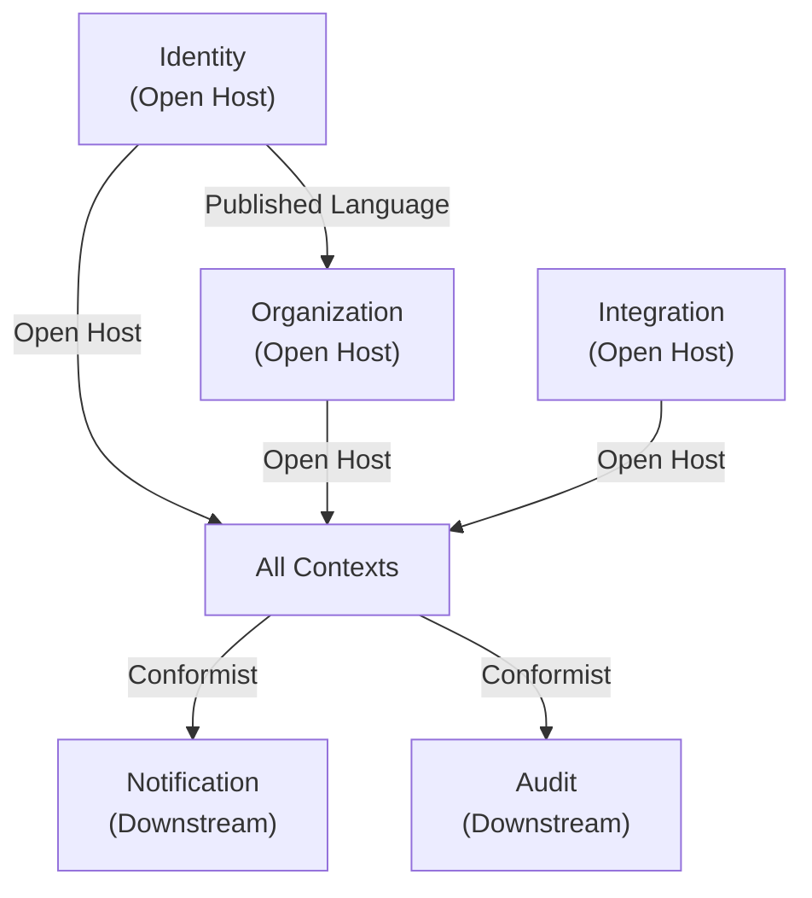
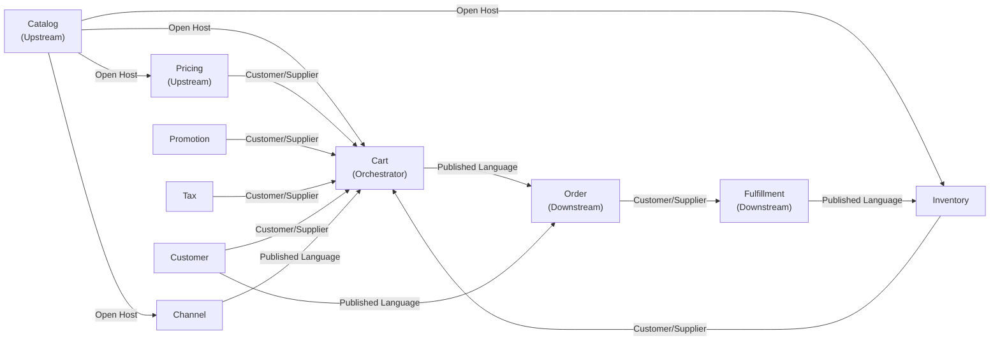
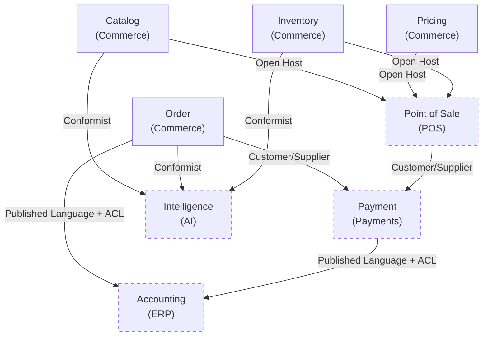

# Context Relationships

## Metadata

| Field | Value |
|-------|-------|
| Title | Kairo Context Relationships |
| Document ID | KAI-CAP-003 |
| Status | Draft |
| Version | 0.1 |
| Target Release | N/A |
| Owner | Chief Domain Architect |
| Created | 2026-07-15 |
| Last Updated | 2026-07-15 |
| Reviewers | TODO |
| Related Documents | [Bounded Contexts](./Bounded-Contexts.md), [Capability Map](./Capability-Map.md), [Product Boundaries](../02-Products/Product-Boundaries.md) |
| Dependencies | None |

---

## Purpose

This document defines how bounded contexts in the Kairo platform relate to and communicate with one another. It uses Domain-Driven Design relationship patterns to describe the nature of each connection — who depends on whom, who conforms to whose model, and where translation layers are required.

Understanding these relationships prevents accidental coupling, clarifies ownership during disputes, and guides how integration contracts are designed.

---

## Relationship Patterns

The following DDD relationship patterns are used throughout this document:

| Pattern | Description |
|---------|-------------|
| **Upstream / Downstream** | The upstream context influences the downstream context. The downstream context depends on data or events from the upstream. The upstream has no dependency on the downstream. |
| **Customer / Supplier** | The downstream context is the customer. The upstream context is the supplier. The supplier accommodates the customer's needs within reason, and the two teams negotiate the contract. |
| **Conformist** | The downstream context conforms to the upstream context's model without negotiation. The upstream does not adapt for the downstream. |
| **Published Language** | Contexts communicate through a well-defined, shared language (schemas, event formats, API contracts) that is versioned and documented independently of either context. |
| **Shared Kernel** | Two contexts share a small, explicitly defined subset of their model. Changes to the shared part require agreement from both sides. |
| **Anti-Corruption Layer (ACL)** | The downstream context builds a translation layer to protect its own model from the upstream context's model. Used when the upstream model does not align with the downstream's domain language. |
| **Open Host Service** | The upstream context provides a well-defined, stable service interface that any downstream context can consume without bilateral negotiation. |

---

## Platform Context Relationships

### Identity → All Contexts

| Attribute | Detail |
|-----------|--------|
| Pattern | **Open Host Service** |
| Direction | Identity is upstream of every context in the platform |
| Contract | Identity exposes authentication and authorization interfaces through a published, versioned API. All contexts consume these interfaces without negotiation. |
| Rationale | Identity is foundational infrastructure. Its model is stable and universal. Downstream contexts conform to Identity's published language for user identity, tokens, and permission evaluation. |

### Organization → All Product Contexts

| Attribute | Detail |
|-----------|--------|
| Pattern | **Open Host Service** |
| Direction | Organization is upstream. All product contexts are downstream. |
| Contract | Organization provides tenant resolution, organization identity, and data boundary enforcement. Product contexts conform to the organization model for scoping. |
| Rationale | Multi-tenancy is a platform invariant. Every context operates within an organization boundary. The Organization context does not adapt per product. |

### All Contexts → Notification

| Attribute | Detail |
|-----------|--------|
| Pattern | **Conformist** |
| Direction | All event-producing contexts are upstream. Notification is downstream. |
| Contract | Contexts publish domain events using the platform's published event language. Notification subscribes to relevant events and translates them into messages. |
| Rationale | Notification has no leverage over upstream contexts. It conforms to whatever events are published and builds its delivery logic around them. |

### All Contexts → Audit

| Attribute | Detail |
|-----------|--------|
| Pattern | **Conformist** |
| Direction | All contexts are upstream. Audit is downstream. |
| Contract | Contexts emit audit entries using a standardized audit schema. Audit stores them without interpretation. |
| Rationale | Audit is a passive observer. It conforms to a minimal shared schema (actor, action, resource, timestamp) and does not influence the upstream model. |

### Integration → Product Contexts

| Attribute | Detail |
|-----------|--------|
| Pattern | **Open Host Service** |
| Direction | Integration is upstream (provides infrastructure). Product contexts are downstream (consume integration capabilities). |
| Contract | Integration provides connection management, credential storage, and webhook dispatch. Product contexts define their specific external integrations using this framework. |
| Rationale | Integration is shared infrastructure. Product contexts declare what they integrate with; the Integration context provides the how. |

---

## Commerce Context Relationships

### Core Commerce Flow

### Catalog → Pricing

| Attribute | Detail |
|-----------|--------|
| Pattern | **Open Host Service** |
| Direction | Catalog is upstream. Pricing is downstream. |
| Contract | Catalog exposes product and variant identities. Pricing attaches prices to these identities. Catalog does not know about prices. |
| Rationale | Catalog defines what exists. Pricing determines what it costs. Pricing conforms to Catalog's product model (product ID, variant ID, SKU) without requiring Catalog to accommodate pricing concerns. |

### Catalog → Inventory

| Attribute | Detail |
|-----------|--------|
| Pattern | **Open Host Service** |
| Direction | Catalog is upstream. Inventory is downstream. |
| Contract | Catalog exposes variant identities. Inventory tracks quantities against those identities. Catalog does not know about stock levels. |
| Rationale | Catalog defines trackable items. Inventory conforms to Catalog's variant model for tracking. |

### Catalog → Channel

| Attribute | Detail |
|-----------|--------|
| Pattern | **Open Host Service** |
| Direction | Catalog is upstream. Channel is downstream. |
| Contract | Catalog provides the full product set. Channel scopes visibility by selecting which catalog items are active per channel. |
| Rationale | Catalog defines all products. Channel applies visibility filters. Catalog is not aware of channels. |

### Pricing → Cart

| Attribute | Detail |
|-----------|--------|
| Pattern | **Customer / Supplier** |
| Direction | Pricing is upstream (supplier). Cart is downstream (customer). |
| Contract | Cart requests resolved prices for items in a specific context (channel, customer group, currency). Pricing returns the applicable price. The contract is negotiated — Cart's needs influence how Pricing exposes its resolution interface. |
| Rationale | Cart has specific requirements for price resolution (contextual, real-time, batch-capable). Pricing accommodates these requirements through a negotiated interface. |

### Promotion → Cart

| Attribute | Detail |
|-----------|--------|
| Pattern | **Customer / Supplier** |
| Direction | Promotion is upstream (supplier). Cart is downstream (customer). |
| Contract | Cart submits its current state (items, customer, channel) to Promotion and receives applicable discounts. The interface is negotiated to serve Cart's calculation flow. |
| Rationale | Promotion evaluation depends on Cart state. The two contexts collaborate closely, with Promotion adapting its evaluation interface to Cart's needs. |

### Tax → Cart

| Attribute | Detail |
|-----------|--------|
| Pattern | **Customer / Supplier** |
| Direction | Tax is upstream (supplier). Cart is downstream (customer). |
| Contract | Cart provides taxable amounts and destination addresses. Tax returns a tax breakdown. The interface is shaped by Cart's calculation requirements. |
| Rationale | Tax calculation is a service consumed during Cart calculation. Tax adapts its interface to Cart's batch and real-time needs. |

### Customer → Cart / Order

| Attribute | Detail |
|-----------|--------|
| Pattern | **Customer / Supplier** |
| Direction | Customer is upstream (supplier). Cart and Order are downstream (customers). |
| Contract | Cart and Order request customer profile data (addresses, group membership) from Customer. Customer provides a retrieval interface that serves checkout and order recording needs. |
| Rationale | Cart needs customer context for pricing and tax. Order needs customer identity for ownership. Customer accommodates both. |

### Inventory → Cart

| Attribute | Detail |
|-----------|--------|
| Pattern | **Customer / Supplier** |
| Direction | Inventory is upstream (supplier). Cart is downstream (customer). |
| Contract | Cart requests availability checks and creates reservations. Inventory provides real-time availability and reservation interfaces. |
| Rationale | Cart needs to verify availability and hold stock during checkout. Inventory provides these capabilities through an interface shaped by Cart's real-time requirements. |

### Cart → Order

| Attribute | Detail |
|-----------|--------|
| Pattern | **Published Language** |
| Direction | Cart is upstream. Order is downstream. |
| Contract | Cart produces a fully calculated checkout result (line items, prices, discounts, tax, totals) in a defined schema. Order consumes this schema to create an order record. |
| Rationale | The cart-to-order transition is a critical handoff. The published language ensures that the data structure is explicit, versioned, and not coupled to either context's internal model. Order captures a snapshot — it does not maintain a live reference to Cart. |

### Order → Fulfillment

| Attribute | Detail |
|-----------|--------|
| Pattern | **Customer / Supplier** |
| Direction | Order is upstream (customer). Fulfillment is downstream (supplier). |
| Contract | Order requests fulfillment of line items. Fulfillment provides shipment creation, tracking, and status updates. The interface is negotiated — Order's lifecycle needs influence how Fulfillment exposes status. |
| Rationale | Order initiates fulfillment and needs visibility into progress. Fulfillment provides the operational capability and adapts its status reporting to Order's lifecycle. |

### Fulfillment → Inventory

| Attribute | Detail |
|-----------|--------|
| Pattern | **Published Language** |
| Direction | Fulfillment is upstream (event producer). Inventory is downstream (event consumer). |
| Contract | Fulfillment publishes shipment events using the platform event schema. Inventory subscribes and decrements stock from the fulfilled location. |
| Rationale | Fulfillment determines what was shipped from where. Inventory reacts to these events. The published event language decouples the two contexts. |

---

## Cross-Product Relationships

### Order → Payment

| Attribute | Detail |
|-----------|--------|
| Pattern | **Customer / Supplier** |
| Direction | Order is upstream (customer). Payment is downstream (supplier). |
| Contract | Order sends a payment request (amount, currency, reference). Payment processes it and returns transaction status. The interface is negotiated between Commerce and Payments teams. |
| Rationale | Order needs payment processed reliably. Payment needs clear, unambiguous requests. Both teams collaborate on the contract. |

### Order → Accounting (ACL)

| Attribute | Detail |
|-----------|--------|
| Pattern | **Published Language** with **Anti-Corruption Layer** |
| Direction | Order is upstream. Accounting is downstream. |
| Contract | Order publishes order lifecycle events using the platform event schema. Accounting consumes these events through an ACL that translates commerce terminology into accounting terminology (orders become revenue entries, line items become account postings). |
| Rationale | Commerce and accounting speak different domain languages. An order "completion" in Commerce is a "revenue recognition" in Accounting. The ACL protects Accounting's model from Commerce concepts and vice versa. |

### Payment → Accounting (ACL)

| Attribute | Detail |
|-----------|--------|
| Pattern | **Published Language** with **Anti-Corruption Layer** |
| Direction | Payment is upstream. Accounting is downstream. |
| Contract | Payment publishes transaction events. Accounting translates them into journal entries through an ACL. A payment capture becomes a cash receipt posting. A refund becomes a reversal entry. |
| Rationale | Payment and accounting models differ fundamentally. Payment deals in transactions. Accounting deals in double-entry postings. The ACL translates between these worldviews. |

### Commerce (Catalog, Pricing, Inventory) → POS

| Attribute | Detail |
|-----------|--------|
| Pattern | **Open Host Service** |
| Direction | Commerce contexts are upstream. POS is downstream. |
| Contract | Commerce exposes Catalog, Pricing, and Inventory through stable, versioned APIs. POS consumes these APIs to display products, apply prices, and check availability at the register. |
| Rationale | POS reuses Commerce's core data rather than duplicating it. Commerce provides open host services that any consumer — including POS — can use without bilateral negotiation. |

### Commerce Contexts → Intelligence

| Attribute | Detail |
|-----------|--------|
| Pattern | **Conformist** |
| Direction | Commerce contexts are upstream. Intelligence is downstream. |
| Contract | Commerce contexts expose data through their standard APIs and events. Intelligence conforms to Commerce's model and builds its analytical models from the data as published. |
| Rationale | Intelligence has no leverage to change Commerce's model. It consumes whatever Commerce publishes. If Commerce's model changes, Intelligence adapts. Commerce never adapts for Intelligence. |

---

## Shared Kernel

The Kairo platform uses a minimal shared kernel across all contexts:

| Shared Element | Description | Governed By |
|---------------|-------------|-------------|
| Entity identifiers | UUID format for all entity IDs across all contexts | Platform |
| Timestamp format | ISO 8601 UTC timestamps | Platform |
| Currency codes | ISO 4217 currency codes | Platform |
| Country codes | ISO 3166-1 country codes | Platform |
| Event envelope | Standard event metadata (event ID, type, timestamp, source, tenant) | Platform |
| Money representation | Amount as integer (minor units) plus currency code | Platform |
| Error response format | Standard error schema (code, message, details) | Platform |

**Rules for the shared kernel:**
- Changes to the shared kernel require agreement from all product teams.
- The shared kernel is versioned independently.
- The shared kernel is as small as possible. Only truly universal concepts belong here.
- Domain-specific concepts never enter the shared kernel.

---

## Relationship Governance

- Every new relationship between contexts must be documented in this file before development begins.
- The relationship pattern must be explicitly chosen and justified. Default to the loosest coupling that meets the requirement.
- ACLs are required when contexts belong to different products with different domain languages.
- Published languages are versioned and documented in the owning context's API documentation.
- Customer/Supplier relationships require both teams to agree on the contract. Changes require negotiation.
- Conformist relationships are used only when the downstream context has no leverage or need to influence the upstream model.
- The shared kernel is modified only through a formal governance process with cross-team agreement.
