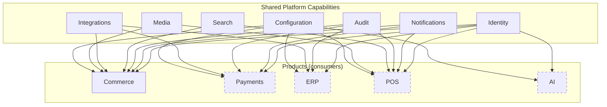

# Shared Capabilities

## Metadata

| Field | Value |
|-------|-------|
| Title | Kairo Shared Capabilities |
| Document ID | KAI-CAP-005 |
| Status | Draft |
| Version | 0.1 |
| Target Release | N/A |
| Owner | Chief Domain Architect |
| Created | 2026-07-15 |
| Last Updated | 2026-07-15 |
| Reviewers | TODO |
| Related Documents | [Capability Map](./Capability-Map.md), [Capability Dependencies](./Capability-Dependencies.md), [Kairo Platform](../02-Products/Kairo-Platform.md), [Product Boundaries](../02-Products/Product-Boundaries.md) |
| Dependencies | None |

---

## Purpose

This document identifies the capabilities that belong to the Kairo platform layer rather than to any individual product. It explains why each capability is shared and defines the responsibilities that the platform holds on behalf of all products.

A capability is shared when it meets one or more of these criteria:

- **Multiple products need it.** If two or more products require the same capability, duplicating it creates inconsistency and waste.
- **It is domain-neutral.** The capability does not belong to any business domain. It is infrastructure that enables domain logic.
- **Consistency is mandatory.** The capability must behave identically across all products. Per-product implementation would introduce divergence.
- **It crosses product boundaries.** The capability operates across multiple products and cannot be owned by one without creating inappropriate coupling.

---

## Shared Capability Map

---

## Identity

### What It Provides

Authentication, authorization, user management, role and permission definitions, token issuance, session management, API key lifecycle, and security policy enforcement.

### Why It Is Shared

Identity is the most fundamental cross-cutting concern. Every API request to every product must be authenticated and authorized. If each product implemented its own identity system, users would need separate credentials per product, permissions would be inconsistent, and security policies would diverge.

A single identity layer ensures:

- One set of credentials works across the entire ecosystem.
- Permissions are evaluated consistently regardless of which product handles the request.
- Security policies (MFA, session expiration, lockout) are enforced uniformly.
- A user authenticated in one product is recognized in all others.

### Why It Does Not Belong to a Single Product

No product's business domain is identity. Commerce is about selling. ERP is about accounting. POS is about retail operations. Identity is infrastructure that all of them depend on equally. Placing it in any one product would give that product inappropriate influence over all others.

---

## Notifications

### What It Provides

Message delivery across channels (email, webhook), template management, delivery tracking, retry logic, and notification preference management.

### Why It Is Shared

Every product produces events that require external notification — order confirmations, payment receipts, shipment updates, inventory alerts, security warnings. If each product built its own notification system, the organization would manage multiple template engines, multiple delivery pipelines, and multiple preference stores.

A shared notification capability ensures:

- Delivery infrastructure is maintained once.
- Templates follow consistent formatting standards.
- Users manage their notification preferences in one place.
- Delivery reliability (retry, failure handling) is implemented once and tested thoroughly.

### Why It Does Not Belong to a Single Product

Notifications serve all products equally. An order confirmation from Commerce and a payment receipt from Payments must be delivered through the same infrastructure with the same reliability guarantees. No single product's domain encompasses message delivery.

---

## Audit

### What It Provides

Tamper-evident recording of significant actions, compliance logging, audit trail query and retrieval, and retention policy management.

### Why It Is Shared

Regulatory compliance and operational accountability span the entire platform. An auditor reviewing a transaction needs to trace the action from the order in Commerce through the payment in Payments to the accounting entry in ERP. This trace must be consistent, queryable, and stored in a single, trusted audit trail.

A shared audit capability ensures:

- All products contribute to a single audit trail with a consistent schema.
- Compliance requirements are met uniformly.
- Cross-product actions are traceable end to end.
- Retention policies are applied consistently.

### Why It Does Not Belong to a Single Product

Audit is inherently cross-product. An audit trail scoped to one product provides incomplete visibility. The value of audit is in its completeness — every significant action across the entire ecosystem is recorded in one place.

---

## Search

### What It Provides

Full-text and structured search capabilities across product data. Search indexing, query processing, relevance ranking, filtering, and faceted search.

### Why It Is Shared

Search is a horizontal capability that operates on data from multiple domains. A customer searching for products needs fast, relevant results. An operator searching for orders needs structured filtering. These search experiences share the same infrastructure — indexing pipelines, query engines, and relevance algorithms.

A shared search capability ensures:

- Search infrastructure is optimized once for performance and relevance.
- Indexing patterns are consistent across all searchable entities.
- Query capabilities (filtering, faceting, pagination) work the same way regardless of what is being searched.
- Future cross-product search (searching orders and products together) is possible without building new infrastructure.

### Why It Does Not Belong to a Single Product

Products define what is searchable within their domain. The search infrastructure that indexes, stores, and queries that data is domain-neutral. Placing search inside Commerce would make it unavailable to ERP, POS, and future products without creating dependencies on Commerce.

---

## Integrations

### What It Provides

Connection management for external systems, credential storage for third-party services, webhook registration and dispatch, integration health monitoring, and external service configuration.

### Why It Is Shared

Multiple products need external connectivity. Commerce integrates with shipping carriers and tax services. Payments integrates with payment providers. ERP integrates with accounting systems. Each of these integrations requires secure credential storage, connection lifecycle management, and health monitoring.

A shared integration capability ensures:

- Credentials are stored securely in one place with consistent encryption and access control.
- Integration patterns (OAuth flows, API key management, webhook verification) are implemented once.
- Health monitoring and alerting work the same way across all external connections.
- New products inherit integration infrastructure without building their own.

### Why It Does Not Belong to a Single Product

Integration is infrastructure. The business logic of what to integrate with belongs to each product (Commerce decides to connect to a shipping carrier; Payments decides to connect to a payment provider). The how of managing that connection — credential storage, connection health, retry logic — is shared infrastructure that no single product should own.

---

## Media

### What It Provides

Media asset storage, retrieval, transformation (resizing, format conversion), and reference management for images, documents, and other binary assets.

### Why It Is Shared

Multiple products need to store and serve media. Commerce needs product images. POS needs receipt logos. Future products will have their own media requirements. Media storage, CDN integration, and transformation pipelines are infrastructure concerns that should not be reimplemented per product.

A shared media capability ensures:

- Storage infrastructure is managed and optimized once.
- Asset transformation (thumbnails, format conversion) follows consistent rules.
- Media references are stable and work across products.
- Storage costs and performance are managed centrally.

### Why It Does Not Belong to a Single Product

Products define what media they need (Commerce knows that products have images). The infrastructure that stores, serves, and transforms those assets is domain-neutral. If Commerce owned media, POS would need to depend on Commerce for image storage — an inappropriate coupling.

---

## Configuration

### What It Provides

Platform-wide and product-level configuration management, feature flags, environment settings, tenant-specific configuration, and configuration inheritance.

### Why It Is Shared

Every product needs configuration — feature flags to control rollout, environment-specific settings, tenant-level customization. If each product maintained its own configuration system, operators would manage settings in multiple places with inconsistent interfaces and no inheritance model.

A shared configuration capability ensures:

- Platform-level settings apply across all products consistently.
- Product-level settings follow the same patterns and interfaces.
- Tenant-specific configuration overrides work uniformly.
- Feature flags are managed through a single system with consistent evaluation.
- Configuration changes are auditable through the shared audit trail.

### Why It Does Not Belong to a Single Product

Configuration is operational infrastructure. Each product defines what is configurable within its domain, but the mechanism for storing, retrieving, inheriting, and auditing configuration is shared. Duplicating this per product would create operational inconsistency.

---

## Governance Rules for Shared Capabilities

- **Shared capabilities serve all products equally.** No product receives preferential treatment or custom accommodations that break consistency.
- **Products consume shared capabilities through defined interfaces.** Products do not extend or modify shared capability internals.
- **Changes to shared capabilities require cross-product impact assessment.** A change that improves one product's experience but breaks another's is not acceptable.
- **New shared capabilities are introduced when two or more products need the same domain-neutral functionality.** A capability is not elevated to shared status preemptively.
- **Shared capabilities own their data and interfaces.** Products hold references to shared data (e.g., user IDs, media references) but do not duplicate or cache shared data beyond their operational needs.
- **Shared capabilities follow the same documentation, versioning, and lifecycle standards as product capabilities.** They are not treated as second-class infrastructure.

---

## When a Capability Should NOT Be Shared

Not every cross-product concern belongs to the shared platform. A capability remains within a product when:

- It serves a specific business domain even if other products find it useful. Other products consume it through defined APIs, not by moving it to the platform.
- Its behavior must vary significantly per product. Shared capabilities behave consistently. If per-product divergence is required, the capability is not a good candidate for sharing.
- It would create unnecessary coupling. Adding a capability to the shared platform creates a dependency from every product. If only two products need it, a direct relationship between those products may be more appropriate.
- It is experimental. Shared capabilities must be stable. Experimental features remain in the product that is exploring them until they are proven and needed by multiple products.
