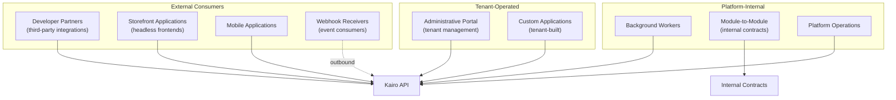
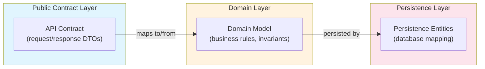
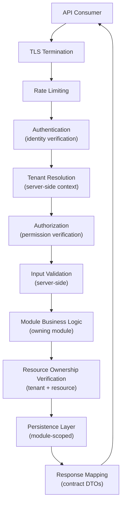

# API Architecture

## Metadata

| Field | Value |
|-------|-------|
| Title | Kairo API Architecture Foundation |
| Document ID | KAI-API-001 |
| Status | Draft |
| Version | 0.1 |
| Target Release | V1 |
| Owner | Chief API Architect |
| Created | 2026-07-21 |
| Last Updated | 2026-07-21 |
| Reviewers | TODO |
| Related Documents | [API Security](../Security/API-Security.md), [Multi-Tenancy Architecture](../Multi-Tenancy/Multi-Tenancy-Architecture.md), [Data Architecture](../Data/Data-Architecture.md), [Data Ownership](../Data/Data-Ownership.md), [Module Architecture](../Module-Architecture.md), [Product Boundaries](../../02-Products/Product-Boundaries.md), [Identifier Strategy](../Data/Identifier-Strategy.md), [Authorization Architecture](../Security/Authorization-Architecture.md), [Transaction and Consistency](../Data/Transaction-and-Consistency-Architecture.md) |
| Dependencies | [Module Architecture](../Module-Architecture.md), [Security Architecture](../Security/Security-Architecture.md), [Data Architecture](../Data/Data-Architecture.md) |

---

## Applicable Version

This document defines the V1 API architecture. It aligns with the modular monolith strategy where all API surfaces are served from a single deployment. Future API evolution (gateway splitting, BFF patterns, GraphQL) is identified but not required for V1.

---

## 1. API Architecture Purpose

API architecture defines how the Kairo platform exposes its business capabilities to the outside world and to its own internal components. It governs:

- What is exposed and to whom.
- How security, tenancy, and ownership are enforced on every request.
- How contracts remain stable while the platform evolves.
- How developers discover, understand, and integrate with the platform.

Without explicit API architecture, individual modules create inconsistent, undiscoverable, insecure endpoints that fragment the developer experience and create maintenance burden.

---

## 2. API-First Philosophy

| Principle | Detail |
|-----------|--------|
| APIs are the product | Kairo's value is delivered through APIs. The API is the primary interface, not a secondary output. |
| API before UI | APIs are designed and documented before any frontend consumes them. UIs are consumers, not drivers. |
| APIs are complete | Every platform capability is accessible through an API. No capability exists only in a UI. |
| APIs are self-sufficient | An API consumer can accomplish their goal entirely through the API without needing human intervention or out-of-band communication. |
| APIs are the contract | The API defines what the platform promises. Internal implementation may change; the API contract holds. |

---

## 3. Developer-First Philosophy

| Principle | Detail |
|-----------|--------|
| Developer experience is a feature | APIs are designed for the humans who consume them. Clarity, consistency, and predictability matter. |
| Minimal surprise | APIs behave as a developer would expect. Conventions are followed. Exceptions are documented. |
| Fast time-to-integration | A developer can make their first successful API call within minutes of reading documentation. |
| Clear error communication | When something goes wrong, the API tells the developer exactly what, why, and how to fix it. |
| Self-service | Developers do not need to contact support to understand or use the API. Documentation and tooling are sufficient. |

---

## 4. API Consumers

The platform serves distinct consumer categories with different needs, trust levels, and access patterns.

| Consumer | Trust Level | Authentication | Typical Access |
|----------|-------------|---------------|----------------|
| Developer partners | Authenticated, authorized | API keys + OAuth2 | Integration APIs |
| Storefront applications | Authenticated (customer or anonymous) | Session/JWT | Storefront APIs |
| Mobile applications | Authenticated (customer) | JWT | Storefront + Customer APIs |
| Administrative portal | Authenticated, elevated | JWT with org context | Administrative APIs |
| Custom tenant applications | Authenticated, authorized | API keys + OAuth2 | Public APIs (scoped) |
| Background workers | Internal, service-level | Service credentials | Internal APIs |
| Module-to-module | Internal, in-process (V1) | No network auth (same process) | Internal contracts |
| Platform operations | Highly privileged | Platform credentials | Administrative + Platform APIs |

---

## 5. API Surfaces

The platform exposes multiple API surfaces, each serving a distinct consumer category with distinct security, authorization, and contract characteristics.

| Surface | Consumer | Purpose | Auth Required | Tenant Context |
|---------|----------|---------|:---:|:---:|
| Public API | All external consumers | Full platform capability access | Yes | Yes |
| Storefront API | Storefront applications | Shopping experience (catalog, cart, checkout) | Optional (anonymous browsing) | Yes |
| Customer API | Authenticated customers | Account, orders, addresses | Yes (customer) | Yes |
| Administrative API | Tenant administrators | Organization and store management | Yes (elevated) | Yes |
| Integration API | External systems | Inbound/outbound data exchange | Yes (system) | Yes |
| Internal module contracts | Modules within the platform | Cross-module communication | N/A (in-process V1) | Inherited |
| Platform API | Platform operations | Platform-level management | Yes (platform) | Optional |

---

## 6. Public versus Private APIs

| Aspect | Public APIs | Private/Internal APIs |
|--------|-------------|----------------------|
| Consumer | External developers, partners, tenant applications | Platform modules, background workers |
| Contract stability | Strong. Breaking changes require versioning. | Moderate. Internal contracts evolve with coordination. |
| Documentation | Mandatory. Developer portal. | Required. Internal documentation. |
| Security | Full authentication + authorization + rate limiting | **Internal APIs are not automatically exempt from security or compatibility rules.** |
| Observability | Full request logging, metrics, tracing | Full tracing, metrics (may omit request logging) |
| Versioning | Explicit. Major versions in path or header. | Implicit. Coordinated deployment. |

---

## 7. Administrative APIs

| Aspect | Detail |
|--------|--------|
| Purpose | Organization and store management, configuration, user management, reporting |
| Consumer | Administrative portal, tenant automation scripts |
| Authorization | Requires organization-level administrative permissions |
| Tenant scope | Always operates within a single organization context |
| Contract | Public contract stability rules apply (consumed by external admin tools) |
| Examples (conceptual) | Manage products, configure stores, manage users, view reports, configure integrations |

---

## 8. Storefront APIs

| Aspect | Detail |
|--------|--------|
| Purpose | Shopping experience — browsing, searching, carting, checkout |
| Consumer | Headless storefront applications, mobile apps |
| Authorization | Anonymous browsing allowed. Checkout requires authentication. |
| Tenant scope | Always operates within a single store context (resolved from request) |
| Performance | Highest performance requirements. Cacheable where possible. |
| Contract | Public contract stability. Storefront developers depend on these heavily. |
| Examples (conceptual) | Browse catalog, search products, manage cart, checkout, view order status |

---

## 9. Customer APIs

| Aspect | Detail |
|--------|--------|
| Purpose | Authenticated customer self-service — account, orders, preferences |
| Consumer | Customer-facing applications (storefront logged-in areas, mobile apps) |
| Authorization | Customer must be authenticated. Can only access their own data. |
| Tenant scope | Customer within an organization context |
| Data access | Strictly limited to the authenticated customer's own resources |
| Examples (conceptual) | View my orders, update my address, manage my preferences |

---

## 10. Integration APIs

| Aspect | Detail |
|--------|--------|
| Purpose | System-to-system data exchange with external platforms |
| Consumer | ERP systems, payment providers, shipping carriers, tax services, marketing tools |
| Authorization | System-level credentials (API keys, OAuth2 client credentials) |
| Tenant scope | Always within an organization context |
| Characteristics | Idempotent operations. Bulk-capable. Webhook support for outbound. |
| Quality | Import validation applies. External data is untrusted. |
| Examples (conceptual) | Sync inventory, receive payment callbacks, push order to fulfillment, import products |

---

## 11. Internal Module Contracts

| Aspect | Detail |
|--------|--------|
| Purpose | Cross-module communication within the platform |
| V1 mechanism | In-process method calls through defined interfaces (modular monolith) |
| Future mechanism | May become HTTP/gRPC if modules are extracted to services |
| Ownership | **The owning module owns its API contract.** The module defines what it exposes; consumers depend on the contract, not the implementation. |
| Stability | Internal contracts are versioned internally. Changes require coordination with consumers. |
| Security | Even internal calls must respect authorization context. The caller's permissions are validated. |
| Data | Internal contracts return contract-defined types, not persistence entities. |

---

## 12. API Ownership

**The owning module owns its API contract.**

| Rule | Detail |
|------|--------|
| Module owns its endpoints | The module that owns the business capability owns the API that exposes it |
| No cross-module endpoint ownership | Module A does not define endpoints that write to Module B's data |
| Contract is the module's promise | The API contract is what the module promises to the outside world. Internal implementation is not the consumer's concern. |
| Contract changes require module owner approval | No external team modifies another module's API contract without the owner's consent |
| Shared concerns are platform-provided | Cross-cutting API behavior (auth, rate limiting, error formatting) is platform infrastructure, not module-owned |

---

## 13. Tenant-Aware API Principles

**Tenant identifiers are not trusted merely because clients supply them.**

| Principle | Detail |
|-----------|--------|
| Tenant context is server-resolved | The platform determines the tenant from the authenticated identity and request context, not from a client-supplied tenant ID |
| Tenant scope is enforced, not optional | Every data-accessing request operates within a tenant boundary. There is no "all tenants" mode for regular API consumers. |
| Resource ownership is verified server-side | **Resource ownership must be verified server-side.** A valid resource ID from another tenant is still denied. |
| Tenant context is immutable during a request | Once resolved, the tenant context does not change within a single request lifecycle |
| Cross-tenant access is governed | Platform operations that cross tenant boundaries require explicit authorization and audit (see [Cross-Tenant Operations](../Multi-Tenancy/Cross-Tenant-Operations.md)) |

---

## 14. Security Principles

**Authentication does not replace authorization.**

| Principle | Detail |
|-----------|--------|
| Authentication proves identity | The caller is who they claim to be |
| Authorization proves permission | The caller is allowed to perform this action on this resource in this context |
| Both are required | An authenticated request without authorization checks is insecure |
| Defence in depth | Multiple security layers (TLS, authentication, authorization, tenant filtering, resource ownership) — not reliance on a single check |
| Deny by default | If authorization is ambiguous, deny. No "open by default" endpoints in production. |
| Rate limiting | All API surfaces are rate-limited to prevent abuse and ensure fair usage |
| Input validation | All input is validated. APIs do not trust client input. Server-side validation is authoritative. |

See [API Security](../Security/API-Security.md) for comprehensive security architecture.

---

## 15. Data Ownership Principles

**APIs expose business capabilities rather than database structures.**

**Public API contracts must not expose persistence entities directly.**

| Principle | Detail |
|-----------|--------|
| APIs expose capabilities | An API represents a business action or query, not a database table CRUD operation |
| Response models are purpose-built | API DTOs are designed for the consumer's need, not mirrored from database entities |
| Internal schema is hidden | Database column names, internal IDs, and persistence-specific fields do not leak into API responses |
| Identifiers follow strategy | APIs use the public resource identifier defined by [Identifier Strategy](../Data/Identifier-Strategy.md). No internal surrogate keys exposed. |
| Data classification applies | API responses respect [Data Classification](../Data/Data-Classification-and-Sensitivity.md) rules. Sensitive fields are omitted or masked per consumer context. |

The public contract layer is independent of the persistence layer. Changes to database schema do not automatically change the API. Changes to the API do not require database changes.

---

## 16. Contract Stability

**Breaking changes require explicit versioning and migration planning.**

| Rule | Detail |
|------|--------|
| Additive changes are non-breaking | Adding new optional fields, new endpoints, or new enum values (where documented as extensible) is non-breaking |
| Removing or renaming fields is breaking | Consumers depend on field names. Removal or rename breaks them. |
| Changing field semantics is breaking | If "status" changes from string to integer, that is breaking even if the field name remains. |
| Breaking changes require new version | A breaking change creates a new API version. The old version continues to work during a migration period. |
| Deprecation before removal | Fields and endpoints are deprecated (documented, warned) before removal. |
| Migration window | Breaking changes provide a documented migration period during which both old and new versions coexist. |

---

## 17. Compatibility

| Aspect | Rule |
|--------|------|
| Backward compatible | New API versions can serve old clients (additive only in minor versions) |
| Forward compatible | Old API clients gracefully ignore unknown fields in responses |
| Content negotiation | Clients specify the API version they expect. Platform responds accordingly. |
| Default version | Unversioned requests receive the latest stable version (with migration-period exceptions) |
| Sunset policy | Deprecated versions are sunset with advance notice. Sunset dates are communicated. |

---

## 18. Discoverability

| Aspect | Detail |
|--------|--------|
| Developer portal | All public APIs are documented in a searchable developer portal |
| OpenAPI specification | Machine-readable API specifications are generated from contracts (not hand-written) |
| Consistent patterns | APIs follow predictable patterns. Knowing one module's API helps predict another's. |
| Self-describing errors | Error responses include enough context for a developer to understand and resolve the issue |
| Example requests | Documentation includes working examples for common operations |
| Changelog | API changes are published in a machine-readable changelog |
| SDKs | **APIs must support future SDK generation without sacrificing domain clarity.** Contract clarity enables automated SDK generation. |

---

## 19. Observability

| Aspect | Detail |
|--------|--------|
| Request tracing | Every request receives a correlation ID. Traces span authentication, authorization, business logic, and persistence. |
| Metrics | Request count, latency, error rate per endpoint, per tenant, per consumer |
| Logging | Structured logging with correlation ID. Sensitive data masked per classification rules. |
| Health checks | Standard health endpoints for infrastructure monitoring |
| SLA visibility | Performance metrics visible for SLA monitoring |
| Alerting | Anomaly detection on error rates, latency spikes, and rate-limit exhaustion |

---

## 20. Performance Principles

| Principle | Detail |
|-----------|--------|
| Pagination required | Collection endpoints must support pagination. No unbounded result sets. |
| Efficient by default | Default query parameters return reasonable result sizes. Consumers opt-in to larger responses. |
| Cacheable where safe | Read-only, non-personalized responses support HTTP caching (Cache-Control, ETag) |
| Bulk operations available | Where batch processing is common, bulk endpoints reduce round-trips |
| Timeout-aware | Long-running operations return quickly with async status (202 Accepted pattern) |
| Rate-limited | Fair usage enforced per consumer. Burst and sustained limits defined. |
| Resource-efficient | APIs do not fetch more data than needed. Sparse fieldsets or selective expansion where appropriate. |

---

## 21. V1 API Architecture

| Aspect | V1 Approach |
|--------|-------------|
| Transport | HTTPS REST (JSON) |
| Authentication | JWT (short-lived) + API keys for system integrations |
| Authorization | Role-based + resource ownership verification |
| Versioning | URL path versioning (e.g., `/v1/...`) |
| Error format | Consistent JSON error object (type, title, status, detail, instance) |
| Documentation | OpenAPI 3.x generated from code. Developer portal. |
| Rate limiting | Per-consumer, per-endpoint. Platform-enforced. |
| Pagination | Cursor-based for collections. Offset available where appropriate. |
| Idempotency | Idempotency-Key header for mutations where duplicate execution is dangerous |
| Tenant context | Server-resolved from authentication context. Never client-supplied. |
| Internal modules | In-process calls through interfaces (modular monolith) |
| Observability | Correlation ID, structured logs, Prometheus metrics, OpenTelemetry traces |
| Deployment | Single deployment serves all API surfaces |

---

## 22. Future API Evolution

| Capability | Description | Target |
|-----------|-------------|--------|
| API gateway separation | Dedicated API gateway for routing, rate limiting, and edge caching | V2 |
| Backend-for-frontend (BFF) | Surface-specific API compositions for storefront, admin, mobile | V2+ |
| GraphQL | Query-oriented surface for complex frontend needs | V2+ (evaluated) |
| gRPC for internal | High-performance internal communication if services are extracted | V3+ |
| Webhook management API | Self-service webhook subscription and management | V2 |
| API marketplace | Third-party extensions exposed through the API platform | V3+ |
| Multi-region routing | Geo-aware API routing for latency optimization | V3+ |
| Event streaming API | Real-time event subscription for consumers | V2+ |

---

## Request Flow

Every API request follows this path regardless of surface:

| Step | Responsibility | Failure Behavior |
|------|---------------|-----------------|
| TLS | Platform infrastructure | Connection refused |
| Rate limiting | Platform infrastructure | 429 Too Many Requests |
| Authentication | Platform infrastructure | 401 Unauthorized |
| Tenant resolution | Platform infrastructure | 403 Forbidden (no valid context) |
| Authorization | Platform + module | 403 Forbidden |
| Input validation | Module (domain layer) | 400 Bad Request (machine-readable errors) |
| Business logic | Module | 409 Conflict / 422 Unprocessable / domain errors |
| Resource ownership | Module + platform | 404 Not Found (do not reveal existence) |
| Persistence | Module | 500 Internal Error (generic to consumer) |
| Response mapping | Module | Maps domain result to contract DTO |

---

## Mandatory Principles Summary

| # | Principle |
|---|-----------|
| 1 | APIs expose business capabilities rather than database structures |
| 2 | The owning module owns its API contract |
| 3 | Authentication does not replace authorization |
| 4 | Tenant identifiers are not trusted merely because clients supply them |
| 5 | Resource ownership must be verified server-side |
| 6 | Public API contracts must not expose persistence entities directly |
| 7 | Breaking changes require explicit versioning and migration planning |
| 8 | Financial and inventory mutations require idempotency where duplicate execution is dangerous |
| 9 | API errors must be predictable and machine-readable |
| 10 | API behavior must be consistent across modules |
| 11 | Internal APIs are not automatically exempt from security or compatibility rules |
| 12 | APIs must support future SDK generation without sacrificing domain clarity |

---

## Idempotency Requirements

**Financial and inventory mutations require idempotency where duplicate execution is dangerous.**

| Operation Category | Idempotency Required | Mechanism |
|-------------------|:---:|---------|
| Payment authorization | Yes | Idempotency-Key header |
| Payment capture | Yes | Idempotency-Key or transaction reference |
| Refund | Yes | Idempotency-Key |
| Inventory adjustment | Yes | Idempotency-Key |
| Order placement (checkout) | Yes | Idempotency-Key |
| Product creation | No (low financial risk) | Duplicate creates separate product |
| Configuration update | No (naturally idempotent) | Setting a value is idempotent |
| Read operations | N/A | Reads are inherently safe |

See [Transaction and Consistency Architecture](../Data/Transaction-and-Consistency-Architecture.md) for full idempotency architecture.

---

## Error Consistency

**API errors must be predictable and machine-readable.**

| Rule | Detail |
|------|--------|
| Standard format | All errors use the same JSON structure regardless of module |
| Machine-readable type | Error type is a stable URI or code that programs can match on |
| Human-readable detail | Error detail explains the problem in plain language |
| Status code consistency | Same HTTP status codes mean the same thing across all endpoints |
| Validation errors are structured | Field-level validation errors identify which fields failed and why |
| No stack traces in production | Internal errors return generic messages. Details are in logs, not responses. |

---

## API Behavior Consistency

**API behavior must be consistent across modules.**

| Aspect | Consistency Rule |
|--------|-----------------|
| Naming | Resource names follow the same conventions across all modules |
| Pagination | Same pagination parameters and response envelope everywhere |
| Filtering | Same filtering syntax across all collection endpoints |
| Sorting | Same sorting parameter format across all collections |
| Error format | Same error structure everywhere |
| Date format | ISO 8601 everywhere |
| ID format | Same identifier format across all resources |
| Null handling | Consistent rules for null vs. absent fields |
| Envelope | Same response envelope structure (or lack thereof) across all endpoints |

---

## Version Gate

| Version | API Architecture Gate |
|---------|---------------------|
| V1 | REST/JSON APIs for all surfaces. JWT + API key authentication. Server-side tenant resolution. Authorization on all endpoints. Idempotency for financial/inventory mutations. Consistent error format. Pagination on all collections. Rate limiting. OpenAPI documentation. Correlation IDs. Module-owned contracts separate from persistence. |
| V2 | API gateway separation evaluated. BFF pattern for surface-specific compositions. Webhook management API. GraphQL evaluated. Event streaming API. Enhanced rate limiting with tenant-specific tiers. |
| V3 | gRPC for extracted services. API marketplace for extensions. Multi-region routing. Advanced caching and CDN integration. |

---

## Decision Summary

| Decision | Rationale |
|----------|-----------|
| REST/JSON for V1 | Most widely understood. Best tooling ecosystem. Sufficient for V1 complexity. No need for GraphQL or gRPC complexity yet. |
| URL path versioning | Simple, visible, cacheable. Header versioning is harder to discover and debug. |
| Server-side tenant resolution | Client-supplied tenant IDs are untrusted. The server determines tenant from the authenticated context. |
| Module-owned API contracts | The module that owns the capability owns the contract. Prevents contract sprawl and ownership confusion. |
| Idempotency-Key header (not body) | Industry standard (Stripe, PayPal). Separates idempotency concern from business payload. |
| Same deployment for all surfaces (V1) | Modular monolith means a single deployment. Separate gateways are future complexity. |
| Consistent error format across modules | Developer experience requires predictability. Per-module error formats create integration friction. |
| Cursor-based pagination default | Stable pagination across concurrent writes. Offset pagination has known issues with inserts/deletes during traversal. |

---

## Alternatives Considered

| Alternative | Rejected Because |
|------------|-----------------|
| GraphQL as primary API | Higher complexity for V1. REST covers V1 needs. GraphQL adds complexity in authorization, caching, and rate limiting. Can be added as a surface later. |
| gRPC for all APIs | Not browser-friendly. Requires proxying for web consumers. Appropriate for internal service communication in future, not for external APIs. |
| Header-based versioning | Less visible. Harder to test in browsers and simple tools. URL path versioning is more explicit and discoverable. |
| Client-supplied tenant IDs | Security risk. Clients can supply incorrect tenant IDs. Server-resolved from authentication context eliminates this attack vector. |
| Per-module error formats | Inconsistency frustrates developers. A standard error format across all modules enables generic error handling in SDKs and client libraries. |
| Monolithic API specification | Single giant OpenAPI spec becomes unmaintainable. Per-module specs composed at build time is more maintainable. |

---

## Trade-offs

| Trade-off | Accepted Because |
|-----------|-----------------|
| REST verbosity vs. GraphQL efficiency | REST is simpler to implement, secure, and cache. V1 does not have the frontend query complexity that justifies GraphQL. |
| Single deployment limits independent scaling | V1 does not need independent API scaling. Modular monolith simplifies deployment. Gateway separation is V2. |
| URL versioning creates URL noise | Clarity > aesthetics. `/v1/products` is immediately obvious. Worth the URL length. |
| Cursor pagination complexity | Cursors are more complex to implement than offset, but correct under concurrent writes. Worth the implementation cost. |
| Consistent error format limits module flexibility | Modules cannot invent custom error structures. This is intentional — developer experience > module autonomy for error formatting. |

---

## Architecture Impact

| Concern | Impact |
|---------|--------|
| Module design | Every module must expose a well-defined API contract. Contract is separate from domain and persistence models. |
| Security | Authentication, authorization, and tenant resolution are platform concerns applied before module code executes. |
| Multi-tenancy | Tenant context is resolved by the platform. Modules receive a verified tenant context, never raw client input. |
| Data access | API responses map from domain/read models. Never serialize persistence entities to API consumers. |
| Performance | Pagination, rate limiting, and caching are architectural requirements, not optional enhancements. |
| Observability | Correlation IDs, structured logging, and metrics are required on all API paths. |
| Testing | API contracts are tested independently of implementation (contract tests). |
| Documentation | OpenAPI specifications are generated from code. Manual documentation supplements generated specs. |

---

## Implementation Impact

| Area | Impact |
|------|--------|
| Modules | Must define API contracts (request/response types). Must implement domain validation. Must map between contract, domain, and persistence layers. Must support idempotency where required. |
| Platform | Must provide authentication, tenant resolution, authorization middleware. Must provide rate limiting. Must provide error formatting. Must provide correlation ID generation and propagation. |
| Frontend | Consumes APIs through defined contracts. Handles standard error format. Implements pagination. Manages authentication tokens. |
| SDKs | Generated from OpenAPI specifications. Domain-clear naming enables clean SDK APIs. |
| Operations | Must monitor API metrics (latency, error rates, rate-limit exhaustion). Must manage API key lifecycle. |
| Documentation | Developer portal consumes OpenAPI specs. Changelog published with each release. |
| Testing | Contract tests verify API stability. Integration tests verify end-to-end flows. Performance tests verify latency SLAs. |

---

## Security Responsibilities

| Role | API Security Responsibilities |
|------|------------------------------|
| Chief API Architect | Defines API security principles. Reviews API surface design. Ensures consistent security model across surfaces. |
| Module Teams | Implement authorization logic for their endpoints. Validate input. Verify resource ownership. |
| Platform Team | Provides authentication middleware. Implements tenant resolution. Enforces rate limiting. Provides error formatting. |
| Security Team | Reviews API security design. Penetration testing of API surfaces. Validates authorization model coverage. Reviews rate-limiting configuration. |
| Operations | Monitors for security anomalies. Manages API key rotation. Responds to rate-limit abuse. |

---

## Multi-Tenancy Responsibilities

| Responsibility | Detail |
|---------------|--------|
| Tenant resolution | Platform resolves tenant from authenticated context. Never from client header. |
| Tenant-scoped data access | Every API query operates within the resolved tenant boundary |
| Cross-tenant prevention | API responses never include data from other tenants |
| Resource ownership verification | Accessing a resource verifies it belongs to the resolved tenant |
| Platform operations | Cross-tenant platform APIs require explicit platform-level authorization |

---

## Out of Scope

This document does not define:

- Concrete endpoint URLs or path structures — defined in module specifications.
- Request/response DTO definitions — defined in module specifications.
- Controller implementation or middleware code — defined in development standards.
- OpenAPI specification files — generated from implementation.
- API gateway product selection — defined in infrastructure architecture (future).
- Authentication token format or OAuth2 flow details — defined in [Identity and Authentication](../Security/Identity-and-Authentication.md).
- Database schemas — defined in [Data Architecture](../Data/Data-Architecture.md).
- Specific rate-limit numeric values — defined in deployment configuration.

---

## Future Considerations

- **GraphQL surface** — Evaluated for complex frontend query needs where REST becomes verbose.
- **gRPC for service extraction** — If modules become independent services, gRPC provides high-performance internal communication.
- **API gateway** — Dedicated gateway for routing, edge caching, advanced rate limiting, and API composition.
- **Backend-for-frontend (BFF)** — Surface-specific API layers that compose multiple module calls for specific frontends.
- **Event streaming API** — WebSocket or SSE-based real-time event delivery to consumers.
- **API marketplace** — Third-party extensions exposed and discoverable through the platform's API infrastructure.
- **Multi-region API routing** — Geo-aware routing for latency optimization and data residency compliance.

---

## Future Refactoring Triggers

This document should be revisited when:

- Single deployment becomes a performance bottleneck (trigger for API gateway separation).
- Frontend query complexity exceeds REST ergonomics (trigger for GraphQL evaluation).
- Module extraction to services occurs (trigger for gRPC internal communication).
- Rate-limiting needs exceed simple per-consumer limits (trigger for tiered rate limiting).
- Multi-region deployment is needed (trigger for geo-routing architecture).
- Third-party extension ecosystem develops (trigger for API marketplace architecture).
- Real-time consumer needs emerge (trigger for event streaming API).

---

## Change History

| Version | Date | Author | Description |
|---------|------|--------|-------------|
| 0.1 | 2026-07-21 | Chief API Architect | Initial draft — API architecture foundation |
