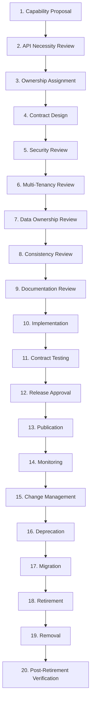
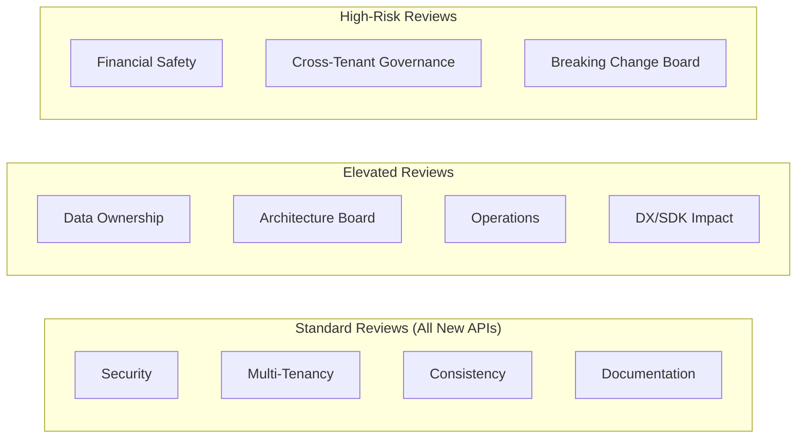

# API Governance and Lifecycle

## Metadata

| Field | Value |
|-------|-------|
| Title | Kairo API Governance and Platform Lifecycle Architecture |
| Document ID | KAI-API-013 |
| Status | Draft |
| Version | 0.1 |
| Target Release | V1 |
| Owner | API Governance and Platform Lifecycle Architect |
| Created | 2026-07-21 |
| Last Updated | 2026-07-21 |
| Reviewers | TODO |
| Related Documents | [API Architecture](./API-Architecture.md), [Documentation Standards](../../00-Governance/Documentation-Standards.md), [Document Lifecycle](../../00-Governance/Document-Lifecycle.md), [Secure Development Lifecycle](../Security/Secure-Development-Lifecycle.md), [API Versioning and Compatibility](./API-Versioning-and-Compatibility.md), [API Documentation and SDK Architecture](./API-Documentation-and-SDK-Architecture.md), [API Surfaces and Boundaries](./API-Surfaces-and-Boundaries.md), [API Contract Standards](./API-Contract-Standards.md) |
| Dependencies | [API Architecture](./API-Architecture.md), [Documentation Standards](../../00-Governance/Documentation-Standards.md), [Secure Development Lifecycle](../Security/Secure-Development-Lifecycle.md) |

---

## Applicable Version

This document defines V1 API governance processes. All modules must follow these governance stages when proposing, designing, implementing, releasing, and retiring API capabilities. The process scales with risk — higher-risk changes receive stronger review.

---

## Purpose

This document defines the complete lifecycle of an API capability — from initial proposal through design, review, implementation, release, operation, deprecation, and retirement. It establishes who owns APIs, who reviews them, what approval is required, and how the platform ensures that no API exists without ownership, documentation, testing, or governance.

Without explicit governance, APIs accumulate without ownership, documentation drifts, breaking changes surprise consumers, and retired APIs linger indefinitely. This document prevents all of these.

---

## Scope

This document covers:

- API lifecycle stages from proposal through retirement.
- Required review types and review gates per change category.
- Governance roles and their responsibilities.
- Exception processes and emergency change handling.
- API inventory and usage monitoring.
- Deprecation evidence and retirement execution.
- ADR triggers for API decisions.

This document does not cover:

- Specific API endpoint designs (module specifications).
- Code review procedures for implementation (development standards).
- CI/CD pipeline configuration (infrastructure).
- Operational monitoring tooling (operations documentation).
- Specific review meeting schedules (team process).

---

## Mandatory Statements

| # | Statement |
|---|-----------|
| 1 | No public API is ownerless |
| 2 | No API is considered complete without documentation and tests |
| 3 | Breaking changes require approval |
| 4 | Temporary APIs require an expiry and owner |
| 5 | Deprecated APIs remain monitored |
| 6 | Emergency changes require retrospective review |
| 7 | AI-generated API implementation follows the same review gates |
| 8 | Internal APIs are not automatically exempt from ownership and lifecycle rules |
| 9 | Cross-module APIs require boundary review |

---

## API Lifecycle Stages

---

### 1. Capability Proposal

| Aspect | Detail |
|--------|--------|
| Trigger | Business need, product requirement, or integration request |
| Input | What capability is needed and why |
| Output | Proposal document identifying the business need and target consumers |
| Decision | Is a new API endpoint the right solution? (Not every need requires a new endpoint) |
| Owner | Product or module team proposing the capability |

---

### 2. API Necessity Review

| Aspect | Detail |
|--------|--------|
| Question | Can this be served by an existing endpoint? Does this justify new API surface? |
| Alternatives | Existing endpoint with new parameter, extension mechanism, documentation improvement |
| Outcome | Proceed with new API or resolve through existing capabilities |
| Gate | Prevents unnecessary API surface proliferation |

---

### 3. Ownership Assignment

**No public API is ownerless.**

| Aspect | Detail |
|--------|--------|
| Assigned | Every new API capability must have an explicit owner before design begins |
| Owner scope | Module team that owns the business capability |
| Responsibility | Owner is accountable for the API's design, documentation, testing, operation, and eventual retirement |
| Transfer | If ownership transfers (team change), new owner is explicitly assigned |
| No orphans | APIs without owners are flagged in API inventory review and assigned |

---

### 4. Contract Design

| Aspect | Detail |
|--------|--------|
| Standards | Follows [API Contract Standards](./API-Contract-Standards.md) |
| Consumer-first | Designed for the consumer's need, not the implementation's convenience |
| Review artifact | Contract specification (OpenAPI or equivalent design document) |
| Feedback | Consumer representatives (DX team, partners) may provide input |
| Versioning | Designed within the current API version's compatibility rules |

---

### 5. Security Review

| Aspect | Detail |
|--------|--------|
| Reviewer | Security team or designated security reviewer |
| Checks | Authentication, authorization, rate limiting, input validation, information leakage, tenant isolation |
| Required for | All new public endpoints. All operations handling sensitive data. |
| Output | Approval or required changes |
| Reference | [Secure Development Lifecycle](../Security/Secure-Development-Lifecycle.md) |

---

### 6. Multi-Tenancy Review

| Aspect | Detail |
|--------|--------|
| Reviewer | Multi-tenancy architect or designated reviewer |
| Checks | Tenant scope enforcement, cross-tenant prevention, tenant context in all paths |
| Required for | All endpoints accessing tenant-scoped data |
| Output | Confirmation that tenant isolation is maintained |

---

### 7. Data Ownership Review

| Aspect | Detail |
|--------|--------|
| Reviewer | Data architect or module owner of accessed data |
| Checks | API does not expose another module's internal data. References use public contracts. |
| Required for | Endpoints accessing data from other modules. Cross-module query patterns. |
| Output | Confirmation that data ownership boundaries are respected |
| **Cross-module APIs require boundary review** | Any API that reads or references another module's data must be reviewed for boundary compliance |

---

### 8. Consistency Review

| Aspect | Detail |
|--------|--------|
| Reviewer | API architecture or DX team |
| Checks | Naming conventions, error patterns, pagination, response structure match platform standards |
| Required for | All new endpoints |
| Output | Confirmation that the API feels consistent with the rest of the platform |
| Reference | [API Contract Standards](./API-Contract-Standards.md), [Request and Response Standards](./Request-and-Response-Standards.md) |

---

### 9. Documentation Review

**No API is considered complete without documentation and tests.**

| Aspect | Detail |
|--------|--------|
| Reviewer | DX team or documentation owner |
| Checks | Reference docs complete, descriptions present, examples provided, error docs present |
| Required for | All public endpoints |
| Output | Documentation approved for publication |
| Reference | [API Documentation and SDK Architecture](./API-Documentation-and-SDK-Architecture.md) |

---

### 10. Implementation

| Aspect | Detail |
|--------|--------|
| Standards | Follows approved contract design. Module development standards. |
| **AI-generated API implementation follows the same review gates** | Implementation generated by AI tools receives identical review to human-written code. No bypass. |
| Code review | Standard code review process |
| Contract alignment | Implementation must match the approved contract specification |

---

### 11. Contract Testing

| Aspect | Detail |
|--------|--------|
| Requirement | Contract tests verify implementation matches specification |
| Coverage | All endpoints have contract tests. All error cases have tests. |
| CI | Contract tests run in CI pipeline. Failures block release. |
| Drift detection | Tests detect any divergence between specification and implementation |
| **Completeness** | An API without contract tests is not considered complete |

---

### 12. Release Approval

| Aspect | Detail |
|--------|--------|
| Gate | All reviews passed. Tests passing. Documentation complete. |
| Approver | API owner + architecture approval for new surfaces |
| Breaking changes | **Breaking changes require approval** — architecture review board |
| Release notes | Changes documented in changelog before release |
| SDK impact | SDK team notified if SDK updates are needed |

---

### 13. Publication

| Aspect | Detail |
|--------|--------|
| Documentation | Published to developer portal simultaneously with deployment |
| Changelog | Published with the release |
| SDK | Updated SDK released (if affected) |
| Communication | Partners/consumers notified of new capabilities (changelog, email for significant additions) |

---

### 14. Monitoring

**Deprecated APIs remain monitored.**

| Aspect | Detail |
|--------|--------|
| Metrics | Request volume, error rate, latency per endpoint |
| Alerting | Anomalies trigger investigation (error spike, latency degradation) |
| Usage tracking | Per-consumer, per-endpoint usage tracked for lifecycle decisions |
| Deprecated endpoints | Continue to be monitored (usage drives retirement timing) |
| Health | Endpoint availability monitored |

---

### 15. Change Management

| Aspect | Detail |
|--------|--------|
| Non-breaking | Standard review process. Changelog entry. No version bump. |
| Breaking | Full governance cycle — design review, security review, new version, migration plan |
| Reference | [API Versioning and Compatibility](./API-Versioning-and-Compatibility.md) |

---

### 16. Deprecation

| Aspect | Detail |
|--------|--------|
| Decision | Based on replacement availability, usage evidence, maintenance burden |
| Communication | Deprecation notice in documentation, changelog, response headers, and direct communication |
| Timeline | Minimum 12 months deprecation period |
| Headers | `Deprecation: true` and `Sunset: <date>` on all responses |
| Functionality | Deprecated APIs continue to function identically during deprecation |

---

### 17. Migration

| Aspect | Detail |
|--------|--------|
| Guide | Published migration guide (field mapping, code examples) |
| Support | Consumer support during migration period |
| Tracking | Migration progress tracked (consumer adoption of new version) |
| Extension | If significant consumers have not migrated, timeline may be extended |

---

### 18. Retirement

| Aspect | Detail |
|--------|--------|
| Prerequisites | Migration period complete. Usage evidence reviewed. Consumers migrated or notified. |
| Execution | Endpoint begins returning 410 Gone with migration guidance |
| Reversible | If critical consumers discovered post-retirement, may be temporarily restored |
| Communication | Final retirement notice sent in advance |

---

### 19. Removal

| Aspect | Detail |
|--------|--------|
| When | After retirement period. No remaining consumers. |
| Action | Endpoint code removed from codebase. Specification removed from current version. |
| Historical | Specification retained in historical version documentation |
| Irreversible | After removal, restoration requires re-implementation |

---

### 20. Post-Retirement Verification

| Aspect | Detail |
|--------|--------|
| Check | Verify no traffic to retired endpoints. Verify no consumer complaints. |
| Documentation | Verify retired endpoints removed from active documentation. |
| SDK | Verify SDK no longer references retired endpoints. |
| Clean | Confirm implementation code removed from codebase. |

---

## Required Reviews by Change Category

| Change Category | Security | Multi-Tenancy | Data Ownership | Consistency | Documentation | Operations | Architecture Board | Financial | DX/SDK |
|----------------|:---:|:---:|:---:|:---:|:---:|:---:|:---:|:---:|:---:|
| New public API surface | Yes | Yes | If cross-module | Yes | Yes | Yes | Yes | — | Yes |
| New administrative capability | Yes | Yes | If cross-module | Yes | Yes | — | — | — | — |
| New authentication method | **Yes** | Yes | — | Yes | Yes | Yes | **Yes** | — | Yes |
| New cross-tenant operation | **Yes** | **Yes** | **Yes** | Yes | Yes | Yes | **Yes** | — | — |
| Payment mutation | **Yes** | Yes | Yes | Yes | Yes | — | — | **Yes** | Yes |
| Inventory mutation | Yes | Yes | Yes | Yes | Yes | — | — | — | — |
| File upload | **Yes** | Yes | — | Yes | Yes | Yes | — | — | — |
| Data export | **Yes** | Yes | **Yes** | Yes | Yes | — | — | — | — |
| Bulk operation | Yes | Yes | Yes | Yes | Yes | Yes | — | If financial | — |
| Webhook (outbound) | Yes | Yes | — | Yes | Yes | — | — | — | Yes |
| Breaking change | Yes | Yes | Yes | Yes | Yes | Yes | **Yes** | If affected | **Yes** |
| New SDK | — | — | — | — | Yes | — | — | — | **Yes** |
| New API version | **Yes** | Yes | Yes | Yes | **Yes** | Yes | **Yes** | If affected | **Yes** |

---

## Governance Roles

### API Owner

| Aspect | Detail |
|--------|--------|
| Who | Module team lead or designated API owner within the module |
| Responsibility | Accountable for API design, documentation, testing, operation, and retirement |
| Authority | Approves non-breaking changes within their module |
| Obligation | Ensures API meets all governance standards |

### Domain Owner

| Aspect | Detail |
|--------|--------|
| Who | Business capability owner (product manager or domain lead) |
| Responsibility | Validates that the API serves the business need correctly |
| Authority | Approves capability scope and business semantics |

### Security Reviewer

| Aspect | Detail |
|--------|--------|
| Who | Security team member |
| Responsibility | Validates security properties (auth, authz, tenant isolation, input validation, information leakage) |
| Authority | Can block release on security concerns |

### Data Reviewer

| Aspect | Detail |
|--------|--------|
| Who | Data architect or data-owning module representative |
| Responsibility | Validates data ownership boundaries, classification compliance, and cross-module access rules |
| Authority | Can block release on data boundary violations |

### Developer-Experience Reviewer

| Aspect | Detail |
|--------|--------|
| Who | DX team member or API consistency reviewer |
| Responsibility | Validates naming, patterns, documentation quality, and consumer ergonomics |
| Authority | Can request changes for consistency. Does not block on preference. |

### Operations Reviewer

| Aspect | Detail |
|--------|--------|
| Who | Operations team member |
| Responsibility | Validates operational readiness (monitoring, rate limiting, resource impact) |
| Authority | Can block release if operational risk is unacceptable |

### Approval Authority

| Change Level | Approval Authority |
|-------------|-------------------|
| Non-breaking change (within module) | API owner |
| New public endpoint | API owner + architecture review |
| Breaking change | Architecture review board |
| New API version | Architecture review board + product |
| Emergency security change | Security team (with retrospective review) |
| Cross-tenant operation | Architecture board + security + multi-tenancy architect |

---

## ADR Triggers

An Architecture Decision Record (ADR) is required when:

| Trigger | Why |
|---------|-----|
| New API surface type is proposed | Establishes a new category of API that will be maintained long-term |
| Authentication mechanism change | Affects all consumers and security posture |
| Versioning strategy change | Affects compatibility promises and consumer trust |
| Response envelope change | Affects all consumers and SDKs |
| Cross-tenant API capability | Creates governance and security precedent |
| Exception to governance rules | Documents why and under what constraints the exception applies |
| New public protocol (WebSocket, gRPC, GraphQL) | Establishes new technology commitment |
| Permanent removal of published capability | Irreversible. Consumers permanently affected. |

---

## Exception Process

| Aspect | Detail |
|--------|--------|
| When | Standard governance creates unacceptable delay for a justified business need |
| Request | Written exception request identifying: what rule, why exception, what risk mitigation |
| Approval | Architecture review board or designated authority |
| Conditions | Exceptions are time-bound with a concrete plan to resolve (reach compliance) |
| Tracked | Exceptions are tracked in API inventory. Not forgotten. |
| Review | Exceptions are reviewed monthly. Expired exceptions must be resolved or re-approved. |

---

## Emergency Security Changes

**Emergency changes require retrospective review.**

| Aspect | Detail |
|--------|--------|
| Authority | Security team may authorize immediate changes for critical vulnerabilities |
| Scope | Narrowly scoped to the security fix |
| Bypass | Normal review gates may be bypassed. Breaking changes permitted if necessary. |
| Communication | Immediate notification to affected consumers |
| Retrospective | Within 5 business days, a retrospective review is conducted |
| Retrospective output | ADR documenting the change, its impact, and any permanent governance adjustments needed |
| Audit | Emergency change and retrospective are audit-logged |

---

## Temporary APIs

**Temporary APIs require an expiry and owner.**

| Rule | Detail |
|------|--------|
| Explicit flag | Temporary APIs are explicitly marked as temporary in inventory |
| Owner | Must have an assigned owner (not "the team") |
| Expiry date | Must have a concrete expiry date |
| Renewal | If not retired by expiry, owner must renew with justification or retire |
| Review | Temporary APIs are reviewed at each inventory review |
| Examples | Beta endpoints, experimental features, migration-support endpoints |

---

## API Inventory

| Aspect | Detail |
|--------|--------|
| Registry | All public and internal APIs are registered in an inventory |
| Fields | Endpoint, owner, status (active/deprecated/temporary), creation date, last review date |
| Review cadence | Quarterly inventory review |
| Orphan detection | APIs without active owners are flagged for reassignment |
| Usage data | Inventory includes usage metrics (request volume, consumer count) |
| Stale detection | APIs with zero usage for extended periods are flagged for deprecation review |

---

## Usage Monitoring

**Deprecated APIs remain monitored.**

| Metric | Purpose |
|--------|---------|
| Request volume per endpoint | Capacity planning, deprecation evidence |
| Unique consumer count | Understand adoption breadth |
| Error rate per endpoint | Quality and reliability |
| Latency percentiles | Performance SLA |
| Usage trend | Growing, stable, or declining (informs lifecycle decisions) |
| Deprecated endpoint usage | Evidence for retirement timing |
| Consumer migration progress | Track adoption of new version during deprecation |

---

## Deprecation Evidence

| Evidence Type | Purpose |
|--------------|---------|
| Usage metrics | Prove that usage has declined sufficiently for retirement |
| Consumer migration | Verify that known consumers have migrated |
| Alternative availability | Confirm that replacement API is available and documented |
| Communication proof | Confirm that deprecation notices were sent and received |
| Timeline compliance | Verify that minimum deprecation period has elapsed |
| Support readiness | Confirm that support can handle remaining stragglers |

---

## AI-Generated Implementation

**AI-generated API implementation follows the same review gates.**

| Rule | Detail |
|------|--------|
| Same standards | AI-generated code meets the same quality, security, and design standards |
| Same reviews | All review gates apply identically (security, tenancy, data, consistency, documentation) |
| Same testing | Contract tests, security tests, and integration tests are required regardless of authorship |
| No bypass | "Generated by AI" is not a justification for skipping governance |
| Attribution | AI-generated code is disclosed during review (reviewer awareness) |
| Responsibility | The API owner remains accountable regardless of how code was produced |

---

## Internal API Governance

**Internal APIs are not automatically exempt from ownership and lifecycle rules.**

| Rule | Detail |
|------|--------|
| Ownership required | Internal APIs have assigned owners |
| Documentation required | Internal APIs are documented (may be less formal than public docs) |
| Breaking changes coordinated | Internal breaking changes are coordinated with consumers (other modules) |
| Testing required | Internal APIs have contract tests |
| Lifecycle managed | Internal APIs can be deprecated and retired |
| Reduced ceremony | Reviews may be lighter (no DX review, no SDK impact) but security and data reviews still apply |

---

## Version Gate

| Version | API Governance Gate |
|---------|---------------------|
| V1 | All public APIs have assigned owners. All endpoints have documentation and contract tests. Security and multi-tenancy review for all new endpoints. Breaking changes require architecture board approval. API inventory maintained. Usage monitoring active. Deprecation process defined and followed. Emergency change process with retrospective. Temporary APIs tracked with expiry. |
| V2 | Automated governance checks in CI (ownership, documentation completeness, test coverage). Consumer-facing governance transparency (public roadmap, deprecation dashboard). Enhanced inventory with health scoring. |
| V3 | Self-service governance (teams self-certify against checklist with audit). Automated breaking-change detection blocks non-approved changes. API maturity model with progressive autonomy. |

---

## Decision Summary

| Decision | Rationale |
|----------|-----------|
| Mandatory ownership for all APIs | Ownerless APIs degrade without accountability. Someone must be responsible for maintenance, quality, and eventual retirement. |
| Risk-proportionate review | Low-risk changes (new optional field) need light review. High-risk changes (payment mutation, cross-tenant) need thorough review. Proportionality prevents governance from blocking progress. |
| AI-generated code follows same gates | AI can produce code with security flaws, boundary violations, or inconsistencies. Same review catches these regardless of authorship. |
| Quarterly inventory review | APIs accumulate over time. Regular review catches orphans, stale endpoints, and forgotten temporaries. |
| Emergency bypass with mandatory retrospective | Security emergencies cannot wait for full governance. But bypassing review without follow-up creates precedent for ungoverned changes. Retrospective ensures accountability. |
| Internal APIs governed (lighter) | Internal does not mean ungoverned. Module extraction to services makes internal APIs into external APIs. Governance from the start prevents painful retrofit. |
| Deprecation evidence required | Retirement without evidence risks breaking unknown consumers. Evidence-driven decisions are responsible stewardship. |

---

## Alternatives Considered

| Alternative | Rejected Because |
|------------|-----------------|
| No formal governance (trust teams) | Works at small scale. Fails as team count grows. Inconsistency, orphans, and unreviewed changes accumulate. |
| Uniform heavy review for all changes | Slows minor changes unnecessarily. Risk-proportionate review balances safety with velocity. |
| AI-generated code exempt from review | AI produces plausible but potentially flawed code. Without review, security vulnerabilities and boundary violations go undetected. |
| No internal API governance | Internal APIs become external when modules are extracted. Retrofitting governance is harder than starting with lightweight governance. |
| Immediate retirement (no deprecation period) | Breaks consumers without warning. Irresponsible stewardship. Deprecation period provides migration time. |
| Governance as optional (opt-in) | Teams under pressure will opt out. Governance must be the default path, with exceptions requiring justification. |
| Annual inventory review | Too infrequent. Orphans and stale APIs persist too long. Quarterly catches issues within a reasonable timeframe. |

---

## Architecture Impact

| Concern | Impact |
|---------|--------|
| Module development | Modules must follow governance process for all API changes. Reviews are part of the development workflow, not an afterthought. |
| CI/CD | Pipeline must enforce governance gates (documentation present, tests passing, spec aligned). |
| Release process | API changes require governance clearance before release. Governance is a release gate. |
| Organization | Clear role assignments (API owner, reviewers) must be maintained. |
| Tooling | API inventory tooling must be maintained. Usage monitoring must be configured per endpoint. |

---

## Implementation Impact

| Area | Impact |
|------|--------|
| Modules | Must follow governance process. Must maintain ownership. Must produce documentation and tests. Must respond to deprecation timelines. |
| Platform | Must provide governance tooling (inventory, usage monitoring, deprecation tracking). Must enforce documentation and testing requirements in CI. |
| Architecture Team | Must conduct reviews. Must maintain review efficiency (not become bottleneck). Must manage API inventory. |
| Security Team | Must provide timely security reviews. Must authorize emergency changes. Must conduct retrospectives. |
| Operations | Must monitor API health. Must provide usage data for lifecycle decisions. Must execute retirement (endpoint removal/410). |

---

## Security Responsibilities

| Role | Governance Security Responsibilities |
|------|-------------------------------------|
| API Governance Architect | Defines governance process. Ensures security review is mandatory. Manages exception process. |
| Module Teams (API Owners) | Follow governance. Ensure security review occurs. Maintain documentation. Respond to security findings. |
| Security Team | Conducts security reviews. Authorizes emergency changes. Validates no bypasses. |
| Architecture Board | Approves breaking changes. Reviews cross-tenant proposals. Oversees governance effectiveness. |
| Operations | Monitors for ungoverned endpoints. Tracks governance compliance metrics. |

---

## Multi-Tenancy Responsibilities

| Responsibility | Detail |
|---------------|--------|
| Review mandatory | Multi-tenancy review is required for all endpoints accessing tenant data |
| Cross-tenant escalated | Cross-tenant operations require architecture board + security + MT architect approval |
| Tenant context verified | Review confirms tenant context is resolved and enforced in all paths |
| No tenant bypass | No governance exception permits bypassing tenant isolation |

---

## Out of Scope

This document does not define:

- Specific API endpoint designs (module specifications).
- Code review procedures (development standards).
- Meeting schedules or review SLAs (team process agreements).
- CI/CD pipeline implementation (infrastructure documentation).
- Monitoring tool configuration (operations documentation).
- Organization chart or team assignments (company operations).

---

## Future Considerations

- **Self-service governance certification** — Teams self-certify against a checklist with random audit.
- **Automated breaking-change gates** — CI automatically blocks unapproved breaking changes.
- **API maturity model** — Progressive governance autonomy based on team track record.
- **Consumer-facing governance** — Public deprecation dashboard and roadmap visibility.
- **API health scoring** — Automated scoring based on documentation, testing, usage, and error rates.
- **Governance analytics** — Metrics on review cycle time, exception rate, and compliance.

---

## Future Refactoring Triggers

This document should be revisited when:

- Team count grows beyond what current review process can serve efficiently.
- Review cycle times become a bottleneck for delivery.
- API inventory exceeds manageable size for quarterly review.
- Module extraction creates new internal→external API transitions.
- Regulatory requirements mandate formal API governance evidence.
- AI-generated code volume changes the review workload significantly.

---

## Change History

| Version | Date | Author | Description |
|---------|------|--------|-------------|
| 0.1 | 2026-07-21 | API Governance and Platform Lifecycle Architect | Initial draft — API governance and lifecycle |
