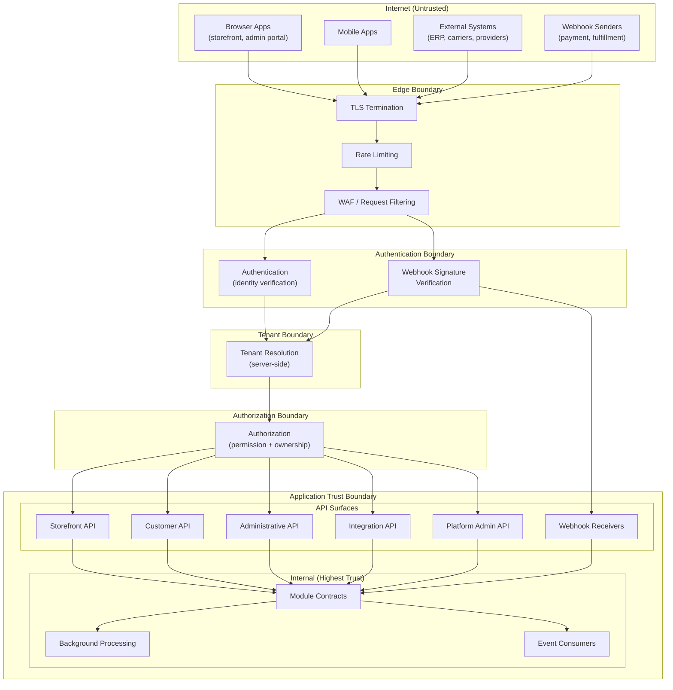

# API Surfaces and Boundaries

## Metadata

| Field | Value |
|-------|-------|
| Title | Kairo API Surfaces, Consumers, Trust Levels and Ownership Boundaries |
| Document ID | KAI-API-002 |
| Status | Draft |
| Version | 0.1 |
| Target Release | V1 |
| Owner | API Boundary and Platform Integration Architect |
| Created | 2026-07-21 |
| Last Updated | 2026-07-21 |
| Reviewers | TODO |
| Related Documents | [API Architecture](./API-Architecture.md), [Identity and Authentication](../Security/Identity-and-Authentication.md), [Authorization Architecture](../Security/Authorization-Architecture.md), [Tenant Resolution](../Multi-Tenancy/Tenant-Resolution.md), [API Security](../Security/API-Security.md), [Multi-Tenancy Architecture](../Multi-Tenancy/Multi-Tenancy-Architecture.md), [Module Architecture](../Module-Architecture.md), [Data Classification and Sensitivity](../Data/Data-Classification-and-Sensitivity.md) |
| Dependencies | [API Architecture](./API-Architecture.md), [Identity and Authentication](../Security/Identity-and-Authentication.md), [Authorization Architecture](../Security/Authorization-Architecture.md) |

---

## Applicable Version

This document defines API surfaces for V1 and identifies future surfaces. V1 delivers a focused set of API surfaces from a single deployment (modular monolith). Future surfaces are identified but not delivered.

---

## Purpose

This document defines what API surfaces exist, who consumes them, what trust level each consumer holds, and how boundaries between surfaces are enforced. It establishes the rules that prevent privileged operations from leaking to unprivileged consumers, ensure tenant isolation across all surfaces, and maintain governance even for internal APIs.

Without explicit surface definitions, platforms converge toward a single unrestricted API that serves every consumer type — creating security vulnerabilities, authorization complexity, and developer confusion.

---

## Scope

This document covers:

- All conceptual API surfaces (public, administrative, integration, internal, background, event).
- Consumer identification and trust classification.
- Authentication, authorization, and tenancy expectations per surface.
- Boundary definitions between surface categories.
- Explicit prohibitions that prevent boundary violations.
- V1 delivery scope versus future surfaces.

This document does not cover:

- Concrete endpoint URLs or path structures (defined in module specifications).
- Authentication token formats or OAuth2 flow configuration (defined in [Identity and Authentication](../Security/Identity-and-Authentication.md)).
- Rate-limit numeric values (defined in deployment configuration).
- API gateway product selection (defined in future infrastructure architecture).

---

## API Surfaces

### 1. Public Storefront API

| Aspect | Detail |
|--------|--------|
| **Intended consumers** | Headless storefront applications, mobile commerce apps, progressive web apps |
| **Trust level** | Low — anonymous browsing permitted; authenticated for personalization and checkout |
| **Authentication direction** | Optional for browsing; required (customer JWT) for cart, checkout, and order creation |
| **Authorization expectations** | Anonymous: read-only public catalog. Authenticated: customer-scope operations only. No administrative capability. |
| **Tenant scope** | Single store context (resolved from request origin or store identifier) |
| **Data sensitivity** | Public catalog data (Public). Customer data on authenticated paths (Confidential). Payment initiation (Restricted path). |
| **Stability expectations** | High — storefront developers depend heavily on these contracts |
| **Versioning expectations** | Explicit versioning. Breaking changes require migration period. |
| **Rate-limit direction** | Per-origin or per-session. Higher burst limits for browsing. Stricter limits on mutations (cart, checkout). |
| **Audit requirements** | Mutations audited (order creation, payment initiation). Read-heavy browsing not individually audited. |
| **Availability expectations** | Highest — revenue-generating surface. Degraded mode acceptable (cached catalog) over full outage. |
| **V1 or future status** | **V1** |

---

### 2. Customer Account API

| Aspect | Detail |
|--------|--------|
| **Intended consumers** | Authenticated customers via storefront apps, mobile apps, account portals |
| **Trust level** | Medium — authenticated customer identity verified, but limited to their own data |
| **Authentication direction** | Required — customer JWT with verified identity |
| **Authorization expectations** | Customer can access only their own resources (orders, addresses, preferences). Cannot access other customers' data or administrative functions. |
| **Tenant scope** | Customer within an organization. Customer can only see their own data within the organization they belong to. |
| **Data sensitivity** | Confidential (personal data, order history, addresses) |
| **Stability expectations** | High — customer-facing applications depend on these |
| **Versioning expectations** | Explicit versioning. Same migration-period rules as storefront. |
| **Rate-limit direction** | Per-customer. Moderate limits. Prevent enumeration attacks. |
| **Audit requirements** | All mutations audited (address changes, preference updates). Access to sensitive data logged. |
| **Availability expectations** | High — customer experience depends on account access |
| **V1 or future status** | **V1** |

---

### 3. Administrative API

| Aspect | Detail |
|--------|--------|
| **Intended consumers** | Administrative portal (organization management UI), tenant automation scripts, admin tooling |
| **Trust level** | High — authenticated organization members with administrative permissions |
| **Authentication direction** | Required — organization member JWT with elevated role |
| **Authorization expectations** | Role-based within organization. Different administrative roles have different capabilities (product manager, store admin, finance viewer). |
| **Tenant scope** | Single organization. Administrator can manage all stores and resources within their organization. |
| **Data sensitivity** | Confidential to Restricted (financial data, customer data, configuration) |
| **Stability expectations** | High — admin tools and automation scripts depend on contract stability |
| **Versioning expectations** | Explicit versioning. Breaking changes require migration period. |
| **Rate-limit direction** | Per-user, per-organization. Higher limits than storefront (administrative operations are less frequent but larger). |
| **Audit requirements** | All operations audited. Administrative mutations are compliance-sensitive. |
| **Availability expectations** | High — but secondary to storefront (brief admin downtime does not lose revenue) |
| **V1 or future status** | **V1** |

---

### 4. Partner and Integration API

| Aspect | Detail |
|--------|--------|
| **Intended consumers** | External systems — ERP, shipping carriers, payment providers, tax services, marketing platforms |
| **Trust level** | Medium-High — authenticated system identity with scoped permissions |
| **Authentication direction** | Required — API keys or OAuth2 client credentials (machine-to-machine) |
| **Authorization expectations** | Scoped to specific capabilities (e.g., inventory sync, order read, product import). Not full administrative access. |
| **Tenant scope** | Single organization. Integration credentials are organization-scoped. |
| **Data sensitivity** | Varies by integration scope — may access Confidential data (orders, customers) |
| **Stability expectations** | Very high — integration partners cannot easily update. Long deprecation windows. |
| **Versioning expectations** | Explicit. Longest migration windows of any surface. |
| **Rate-limit direction** | Per-integration, per-organization. Bulk-operation-aware limits. |
| **Audit requirements** | All operations audited. Integration source identified in audit records. |
| **Availability expectations** | High — integration failures can cascade to external systems |
| **V1 or future status** | **V1** |

---

### 5. Developer-Management API

| Aspect | Detail |
|--------|--------|
| **Intended consumers** | Developer portal, API key management tools, webhook configuration tools |
| **Trust level** | High — authenticated organization members managing their integration configuration |
| **Authentication direction** | Required — organization member JWT with developer/admin role |
| **Authorization expectations** | Manage API keys, configure webhooks, view API usage metrics — scoped to own organization |
| **Tenant scope** | Single organization |
| **Data sensitivity** | Confidential (API keys are secrets during creation, usage metrics are internal) |
| **Stability expectations** | Moderate — developer tooling, not production integration path |
| **Versioning expectations** | Standard versioning. May evolve faster than production APIs. |
| **Rate-limit direction** | Per-user. Low volume expected. |
| **Audit requirements** | All key management operations audited. Key creation/revocation is security-sensitive. |
| **Availability expectations** | Moderate — management operations, not runtime |
| **V1 or future status** | **V1** (basic API key management). Enhanced features **V2**. |

---

### 6. Platform-Administration API

| Aspect | Detail |
|--------|--------|
| **Intended consumers** | Platform operators, internal operations tooling, platform health monitoring |
| **Trust level** | Highest — platform-level credentials with cross-tenant capability |
| **Authentication direction** | Required — platform operator credentials (separate from tenant authentication) |
| **Authorization expectations** | Platform-wide operations: tenant provisioning, platform configuration, cross-tenant diagnostics. Governed by [Cross-Tenant Operations](../Multi-Tenancy/Cross-Tenant-Operations.md). |
| **Tenant scope** | Cross-tenant or tenant-specific (platform operator chooses context) |
| **Data sensitivity** | Restricted — platform configuration, tenant metadata, operational data |
| **Stability expectations** | Moderate — internal tooling, controlled consumers |
| **Versioning expectations** | Internal versioning. Coordinated deployment. |
| **Rate-limit direction** | Per-operator. Low volume. No public exposure. |
| **Audit requirements** | Every operation audited with elevated scrutiny. Cross-tenant access logged. |
| **Availability expectations** | High for health checks and diagnostics. Moderate for configuration changes. |
| **V1 or future status** | **V1** (basic provisioning and health). Enhanced **V2+**. |

---

### 7. Internal Module Contracts

| Aspect | Detail |
|--------|--------|
| **Intended consumers** | Other modules within the platform (in-process V1; potentially networked future) |
| **Trust level** | High — authenticated internal caller within the same trust boundary |
| **Authentication direction** | V1: in-process, no network authentication (same deployment). Future: service-to-service credentials. |
| **Authorization expectations** | The calling module operates within the request's original authorization context. Internal calls do not escalate privileges. |
| **Tenant scope** | Inherited from the originating request's tenant context |
| **Data sensitivity** | May access internal data representations, but must return contract-defined types (not persistence entities) |
| **Stability expectations** | Moderate — coordinated deployment allows evolution, but breaking changes still require consumer coordination |
| **Versioning expectations** | Internal. Coordinated releases. No independent deployment in V1. |
| **Rate-limit direction** | Not rate-limited in V1 (in-process). Future: circuit breakers if extracted. |
| **Audit requirements** | Not individually audited (the originating external request is audited). Cross-module calls contribute to the original trace. |
| **Availability expectations** | Coupled to platform availability (same process in V1) |
| **V1 or future status** | **V1** (in-process interfaces) |

---

### 8. Background-Processing Interfaces

| Aspect | Detail |
|--------|--------|
| **Intended consumers** | Scheduled jobs, outbox processors, lifecycle workers, import processors |
| **Trust level** | High — internal platform processes with service-level credentials |
| **Authentication direction** | Service identity (internal). Not exposed externally. |
| **Authorization expectations** | Background processes operate with service-level permissions. Actions are scoped to their defined purpose. Not a general-purpose admin bypass. |
| **Tenant scope** | Processes that handle tenant data operate within tenant context per item processed |
| **Data sensitivity** | Full access to internal data for processing. Output must respect classification. |
| **Stability expectations** | Internal — evolves with platform |
| **Versioning expectations** | Internal. Deployed with the platform. |
| **Rate-limit direction** | Self-throttling (backpressure). Not externally rate-limited. |
| **Audit requirements** | Significant actions audited (bulk operations, lifecycle transitions). Routine processing logged (not audited per-item). |
| **Availability expectations** | Required for platform operations. Failure triggers monitoring alerts. |
| **V1 or future status** | **V1** |

---

### 9. Event-Consumer Interfaces

| Aspect | Detail |
|--------|--------|
| **Intended consumers** | Internal event handlers (read-model updaters, notification triggers, cross-module reactions) |
| **Trust level** | High — internal. Events consumed within the platform trust boundary. |
| **Authentication direction** | Internal message infrastructure. No external authentication (messages do not arrive from outside V1). |
| **Authorization expectations** | Event consumers operate on data they are authorized to process. Consumer registration is controlled. |
| **Tenant scope** | Events carry tenant context. Consumers process within the event's tenant boundary. |
| **Data sensitivity** | Events carry only necessary data (not full entity dumps). Classification rules apply to event payloads. |
| **Stability expectations** | Event schemas evolve with governance. Breaking event changes require consumer coordination. |
| **Versioning expectations** | Event schema versioning. Backward-compatible additions preferred. |
| **Rate-limit direction** | Consumer throughput managed via queue configuration and concurrency limits |
| **Audit requirements** | Event publication is traced. Consumption failures are logged. |
| **Availability expectations** | At-least-once delivery guarantee. Eventual processing. |
| **V1 or future status** | **V1** |

---

### 10. Webhook Receiver Interfaces

| Aspect | Detail |
|--------|--------|
| **Intended consumers** | External systems sending callbacks to Kairo (payment provider callbacks, shipping updates, marketplace notifications) |
| **Trust level** | Low — inbound from external internet. Must be verified. |
| **Authentication direction** | Inbound verification — signature validation, shared secret, or provider-specific verification mechanism |
| **Authorization expectations** | Limited to the specific callback purpose. A payment callback cannot modify products. Scoped to the integration's organization. |
| **Tenant scope** | Resolved from the integration configuration (which organization registered this webhook endpoint) |
| **Data sensitivity** | Varies — payment callbacks may contain transaction details (Restricted handling) |
| **Stability expectations** | Receiver stability is critical — external systems cannot easily change their callback format |
| **Versioning expectations** | Provider-dictated. Platform adapts to provider changes. |
| **Rate-limit direction** | Per-source. Spike-tolerant (providers may batch callbacks). |
| **Audit requirements** | All inbound webhooks logged. Processing result recorded. |
| **Availability expectations** | High — missed callbacks can cause state inconsistency (e.g., missed payment confirmation) |
| **V1 or future status** | **V1** (payment and fulfillment callbacks) |

---

## Boundaries

### Public versus Privileged Operations

| Boundary Rule | Enforcement |
|---------------|-------------|
| Storefront credentials cannot perform administrative operations | Authorization layer denies. Administrative endpoints require admin role. |
| Customer credentials cannot access other customers' data | Resource ownership verification. 404 returned (not 403, to prevent enumeration). |
| Anonymous access is read-only on public data | Mutations require authentication. No anonymous writes. |
| Integration credentials are scoped | Integrations receive only the permissions explicitly granted, not full admin access. |

### Organization versus Platform Administration

| Boundary Rule | Enforcement |
|---------------|-------------|
| Organization admins cannot perform cross-tenant operations | Tenant context is enforced. No API path allows org admins to escape their tenant. |
| Platform admins are not organization admins by default | Platform credentials have platform-level access, not automatic org-level business access. |
| Platform operations are separately authenticated | Platform credentials are distinct from tenant credentials. Different authentication path. |
| Cross-tenant diagnostic access is audited | Platform admin accessing tenant data is logged with elevated audit scrutiny. |

### Storefront versus Backend Integration

| Boundary Rule | Enforcement |
|---------------|-------------|
| Storefront APIs serve shopping experiences | Catalog, cart, checkout, order status. Not product management or configuration. |
| Backend integrations serve system-to-system exchange | Inventory sync, order export, product import. Not customer-facing flows. |
| Storefront is optimized for latency | Cacheable, minimal payload, fast responses. |
| Integrations are optimized for throughput | Bulk operations, larger payloads, longer timeouts acceptable. |

### Human versus Machine Consumers

| Boundary Rule | Enforcement |
|---------------|-------------|
| Human consumers authenticate interactively | JWT via login flow. Short-lived tokens. Session management. |
| Machine consumers authenticate non-interactively | API keys or client credentials. Long-lived but revocable. No session. |
| Human consumers have rate limits tuned for interactive use | Burst-friendly for UI interactions. |
| Machine consumers have rate limits tuned for throughput | Higher sustained limits. Lower burst tolerance. |
| Human consumers see user-friendly errors | Clear messages. Actionable guidance. |
| Machine consumers see machine-parseable errors | Stable error codes. Structured detail. |

### Synchronous APIs versus Asynchronous Messaging

| Boundary Rule | Enforcement |
|---------------|-------------|
| Synchronous APIs return immediate responses | Success, failure, or accepted-for-processing. No silent background-only processing on sync paths. |
| Long-running operations use accepted pattern | 202 Accepted + status polling or webhook callback for completion. |
| Asynchronous messaging is internal (V1) | External consumers use synchronous APIs. Internal propagation uses events. |
| Events are not a public API surface (V1) | External event streaming is future. V1 events are internal infrastructure. |

### External Contracts versus Internal Contracts

| Boundary Rule | Enforcement |
|---------------|-------------|
| External contracts are versioned and stable | Breaking changes require new version with migration period |
| Internal contracts evolve with coordination | Deployed together (V1). Breaking changes coordinated, not versioned independently. |
| External contracts are documented publicly | Developer portal, OpenAPI specifications. |
| Internal contracts are documented internally | Architecture documentation, interface definitions. |
| External contracts carry full security overhead | Auth, rate limiting, audit on every request. |
| Internal contracts inherit security context | Caller's context flows through. No re-authentication in-process (V1). |

### API Contracts versus Module Implementation

| Boundary Rule | Enforcement |
|---------------|-------------|
| API contract is the module's public promise | The contract defines what consumers can depend on. Nothing else is guaranteed. |
| Implementation changes do not break contracts | Internal refactoring, persistence changes, and optimization are invisible to consumers. |
| Contract types are independent of domain types | API DTOs are designed for consumers. Domain models are designed for business rules. They evolve independently. |
| New internal features do not automatically become API surface | Explicit decision to expose through API. Not automatic promotion. |

### API Contracts versus Persistence Models

| Boundary Rule | Enforcement |
|---------------|-------------|
| API contracts never expose persistence entities | Mapping layer between persistence and API response. Never serialize entities directly. |
| Database schema changes do not force API changes | Additive schema changes are invisible to consumers. Destructive schema changes are handled in the mapping layer. |
| API field names may differ from column names | API naming serves developer clarity. Database naming serves operational clarity. They are independent. |
| Internal IDs are not exposed through APIs | Public resource identifiers are used. Database surrogate keys remain internal. |

---

## Explicit Prohibitions

| # | Prohibition | Rationale |
|---|-------------|-----------|
| 1 | **Administrative operations through storefront credentials** | Storefront consumers (anonymous or customer-authenticated) must never be able to perform product management, user administration, or configuration changes. Storefront and admin are separate trust levels. |
| 2 | **Secret credentials in browser applications** | Browser-side code is visible to users. API keys, client secrets, and service credentials must never be embedded in frontend applications. Browser clients use short-lived tokens obtained through interactive flows. |
| 3 | **Cross-tenant operations through ordinary tenant APIs** | Tenant API consumers operate within their organization boundary. No tenant API path allows accessing another organization's data. Cross-tenant requires platform-level credentials and governance. |
| 4 | **Direct exposure of module internals** | Internal data structures, queue names, database identifiers, and implementation details must not leak through API responses, error messages, or headers. |
| 5 | **Treating internal networking as sufficient authorization** | Being on the internal network or in the same process does not constitute authorization. Internal calls still operate within an authorization context. Network position is not identity. |
| 6 | **Sharing one unrestricted API surface across every consumer type** | A single API that serves storefront, admin, integration, and platform consumers creates authorization complexity and surface confusion. Surfaces are distinguished by purpose and trust level. |

---

## API Surface Matrix

| Surface | Auth Required | Tenant Scoped | Trust Level | Stability | Rate Limited | Audited | V1 |
|---------|:---:|:---:|---------|---------|:---:|:---:|:---:|
| Public Storefront | Optional/Required | Yes (store) | Low | High | Yes | Mutations | Yes |
| Customer Account | Required | Yes (customer) | Medium | High | Yes | Yes | Yes |
| Administrative | Required | Yes (org) | High | High | Yes | Yes | Yes |
| Partner/Integration | Required | Yes (org) | Medium-High | Very High | Yes | Yes | Yes |
| Developer Management | Required | Yes (org) | High | Moderate | Yes | Yes | Partial |
| Platform Administration | Required | Cross/Specific | Highest | Moderate | Yes | All+elevated | Partial |
| Internal Module Contracts | Inherited | Inherited | High | Moderate | No (V1) | Traced | Yes |
| Background Processing | Service | Per-item | High | Internal | Self-throttle | Significant | Yes |
| Event Consumers | Internal | Per-event | High | Governed | Queue-managed | Traced | Yes |
| Webhook Receivers | Verified | Resolved | Low | Provider-set | Yes | Yes | Yes |

---

## Consumer-to-Surface Matrix

| Consumer | Storefront | Customer | Admin | Integration | Developer Mgmt | Platform Admin | Internal | Background | Events | Webhooks |
|----------|:---:|:---:|:---:|:---:|:---:|:---:|:---:|:---:|:---:|:---:|
| Storefront application | **Yes** | **Yes** | — | — | — | — | — | — | — | — |
| Mobile application | **Yes** | **Yes** | — | — | — | — | — | — | — | — |
| Admin portal | — | — | **Yes** | — | **Yes** | — | — | — | — | — |
| Tenant automation | — | — | **Yes** | — | **Yes** | — | — | — | — | — |
| External ERP/system | — | — | — | **Yes** | — | — | — | — | — | — |
| Payment provider | — | — | — | — | — | — | — | — | — | **Yes** |
| Shipping carrier | — | — | — | — | — | — | — | — | — | **Yes** |
| Platform operator | — | — | — | — | — | **Yes** | — | — | — | — |
| Internal modules | — | — | — | — | — | — | **Yes** | — | — | — |
| Background workers | — | — | — | — | — | — | **Yes** | **Yes** | — | — |
| Event handlers | — | — | — | — | — | — | **Yes** | — | **Yes** | — |

---

## Trust Boundary Diagram

---

## V1 versus Future Surface Table

| Surface | V1 Scope | V2+ Enhancements |
|---------|----------|-----------------|
| Public Storefront API | Full catalog browsing, cart, checkout, order status | Personalization, wishlist, reviews |
| Customer Account API | Orders, addresses, preferences | Loyalty, subscriptions, saved payments |
| Administrative API | Products, stores, users, basic reports, configuration | Advanced analytics, workflow automation |
| Partner/Integration API | Inventory sync, order export, product import, payment callbacks | Marketplace integrations, advanced webhooks |
| Developer Management API | API key create/revoke, basic usage visibility | Webhook management, quota management, sandbox environments |
| Platform Administration API | Tenant provisioning, health checks, basic diagnostics | Cross-tenant analytics, advanced configuration, feature flags |
| Internal Module Contracts | In-process interfaces between modules | Service extraction with gRPC (if needed) |
| Background Processing | Outbox processor, lifecycle jobs, import processor | Scheduled reporting, advanced workflow engines |
| Event Consumers | Internal event handlers for read models and notifications | External event streaming (V2+), third-party subscriptions |
| Webhook Receivers | Payment and fulfillment provider callbacks | Marketplace and broader partner callbacks |

---

## Version Gate

| Version | API Surfaces Gate |
|---------|------------------|
| V1 | Storefront, Customer, Administrative, Integration, and Webhook surfaces operational. Internal module contracts functional. Background processing active. Event consumers handling cross-module propagation. Basic developer management. Basic platform admin. All surfaces tenant-aware. Prohibitions enforced. |
| V2 | Enhanced developer management (webhook self-service). External event streaming evaluated. API gateway separation. Enhanced platform administration. |
| V3 | GraphQL surface evaluated. gRPC for extracted services. API marketplace. Real-time streaming. Multi-region routing. |

---

## Decision Summary

| Decision | Rationale |
|----------|-----------|
| Distinct surfaces per consumer type | One unrestricted API creates authorization complexity and security risk. Separate surfaces enable targeted security, rate limiting, and documentation. |
| Storefront allows anonymous access | Commerce requires anonymous browsing. Forcing authentication for catalog access is bad UX and bad business. |
| Integration API is separate from admin | Integrations need specific scoped capabilities, not full admin access. Principle of least privilege. |
| Webhook receivers are a distinct surface | Inbound external callbacks have unique trust characteristics (signature verification, no standard auth) that require separate handling. |
| Internal APIs are governed | Internal does not mean ungoverned. Authorization context flows through. Breaking changes are coordinated. Security context is inherited. |
| Platform admin is separately authenticated | Platform operators and tenant admins are distinct identities with distinct trust levels. Mixing them creates privilege escalation risk. |
| Events are internal in V1 | External event streaming adds complexity (auth, delivery guarantees, subscription management). V1 keeps events internal. |

---

## Alternatives Considered

| Alternative | Rejected Because |
|------------|-----------------|
| Single unified API for all consumers | Creates authorization complexity. Every endpoint needs per-consumer-type authorization logic. Difficult to rate-limit fairly. Confusing documentation. |
| No anonymous storefront access | Forcing authentication for browsing reduces conversion. Commerce requires anonymous catalog access. |
| Integration reuses admin API | Over-privileges integrations. An ERP that needs inventory sync should not get full admin access. Scoped integration permissions are safer. |
| Internal APIs without governance | Creates hidden coupling. Changes break consumers without notice. Authorization bypass creates security holes if modules are later extracted. |
| External event streaming in V1 | Adds substantial infrastructure (subscription management, delivery guarantees, authentication for consumers). V1 does not need it. Internal events suffice. |
| Shared credentials across browser and server | Browser credentials are exposed to end users. Server credentials have higher trust. Mixing trust levels is insecure. |

---

## Architecture Impact

| Concern | Impact |
|---------|--------|
| Module design | Modules must expose contracts suitable for multiple surfaces (admin, storefront, integration may require different views of the same data) |
| Security | Each surface has distinct authentication and authorization requirements. Platform must support multiple auth flows. |
| Multi-tenancy | Tenant resolution works differently per surface (store context for storefront, org context for admin, integration config for webhooks) |
| Rate limiting | Different rate-limit profiles per surface. Infrastructure must support per-surface configuration. |
| Documentation | Developer portal organizes documentation by surface. Different audiences see different surfaces. |
| Deployment | V1 serves all surfaces from single deployment. Future gateway may route to surface-specific deployments. |
| Testing | Each surface requires independent security testing (penetration testing per trust level). |

---

## Implementation Impact

| Area | Impact |
|------|--------|
| Modules | Must expose operations through appropriate surface contracts. Must not leak admin capabilities through storefront paths. Must support different authorization requirements per surface. |
| Platform | Must route requests to appropriate surface handlers. Must apply surface-specific rate limits. Must resolve tenant context per surface rules. Must prevent cross-surface privilege escalation. |
| Frontend | Must use appropriate surface (storefront apps use storefront API, admin apps use admin API). Must not embed server-side credentials. |
| Integrations | Must use scoped integration credentials. Must handle rate limits and retries. Must validate webhook signatures on inbound callbacks. |
| Operations | Must monitor per-surface metrics. Must manage per-surface rate-limit configuration. Must handle webhook receiver availability. |

---

## Security Responsibilities

| Role | Surface and Boundary Responsibilities |
|------|--------------------------------------|
| API Boundary Architect | Defines surfaces and their trust levels. Validates boundary enforcement. Reviews new surface proposals. |
| Module Teams | Implement appropriate authorization per surface for their endpoints. Ensure admin operations are not accessible through storefront paths. |
| Platform Team | Implements surface routing. Enforces rate limits per surface. Implements tenant resolution per surface type. Prevents cross-surface escalation. |
| Security Team | Validates boundary enforcement. Penetration tests each surface independently. Reviews credential handling per surface. |
| Operations | Monitors per-surface health and anomalies. Manages webhook receiver availability. Responds to rate-limit abuse. |

---

## Multi-Tenancy Responsibilities

| Responsibility | Detail |
|---------------|--------|
| Per-surface tenant resolution | Storefront resolves from store context. Admin/Integration from org credentials. Platform from platform operator context. Webhook from integration registration. |
| No cross-tenant through tenant surfaces | Ordinary tenant API consumers (storefront, admin, integration) cannot access other organizations' data. |
| Platform cross-tenant governed | Platform admin surface can cross tenant boundaries but is audited and governed. |
| Events carry tenant context | Event consumers process within the event's originating tenant boundary. |
| Background processes scope per-item | Background jobs that process multiple tenants' data scope each item to its tenant. |

---

## Out of Scope

This document does not define:

- Concrete endpoint URLs or payload structures (defined in module specifications).
- OAuth2 flow configuration or token formats (defined in [Identity and Authentication](../Security/Identity-and-Authentication.md)).
- Rate-limit numeric values or tier definitions (defined in deployment configuration).
- API gateway product selection (defined in future infrastructure architecture).
- Specific authorization role definitions (defined in [Authorization Architecture](../Security/Authorization-Architecture.md)).
- Webhook payload formats (defined in module specifications per integration).

---

## Future Considerations

- **External event streaming surface** — Real-time event delivery to authorized external consumers.
- **GraphQL surface** — Query-oriented surface for complex frontend needs that cross module boundaries.
- **API marketplace surface** — Third-party extensions exposed as discoverable API endpoints.
- **Sandbox surface** — Isolated environment for developer testing without affecting production data.
- **Multi-region surface routing** — Geographic routing with data residency awareness.
- **Partner portal** — Self-service integration management beyond basic API key management.

---

## Future Refactoring Triggers

This document should be revisited when:

- Single deployment cannot serve all surfaces adequately (trigger for API gateway with surface-specific routing).
- External event consumers are required (trigger for event streaming surface definition).
- Third-party extensions need API exposure (trigger for marketplace surface).
- GraphQL demand is validated from frontend teams (trigger for query surface evaluation).
- Multi-region deployment begins (trigger for regional surface routing).
- New consumer categories emerge that do not fit existing surfaces (trigger for new surface evaluation).

---

## Change History

| Version | Date | Author | Description |
|---------|------|--------|-------------|
| 0.1 | 2026-07-21 | API Boundary and Platform Integration Architect | Initial draft — API surfaces and boundaries |
