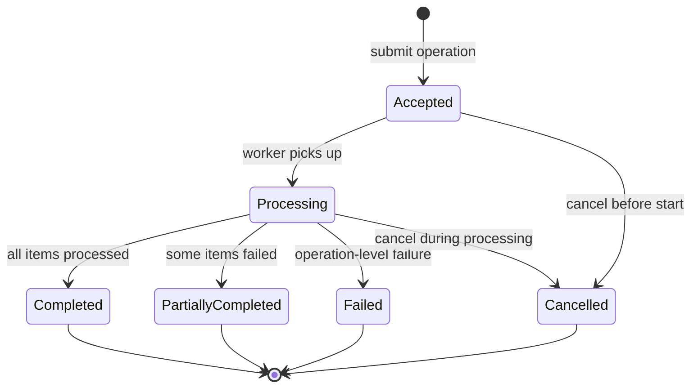

# Bulk and Asynchronous Operations

## Metadata

| Field | Value |
|-------|-------|
| Title | Kairo Bulk Processing and Asynchronous API Architecture |
| Document ID | KAI-API-010 |
| Status | Draft |
| Version | 0.1 |
| Target Release | V1 |
| Owner | Bulk Processing and Asynchronous API Architect |
| Created | 2026-07-21 |
| Last Updated | 2026-07-21 |
| Reviewers | TODO |
| Related Documents | [API Architecture](./API-Architecture.md), [Idempotency, Concurrency, and Retries](./Idempotency-Concurrency-and-Retries.md), [Request and Response Standards](./Request-and-Response-Standards.md), [Error Architecture](./Error-Architecture.md), [Data Lifecycle and Retention](../Data/Data-Lifecycle-and-Retention.md), [Tenant Isolation](../Multi-Tenancy/Tenant-Isolation.md), [Audit and Security Monitoring](../Security/Audit-and-Security-Monitoring.md), [Transaction and Consistency Architecture](../Data/Transaction-and-Consistency-Architecture.md) |
| Dependencies | [API Architecture](./API-Architecture.md), [Idempotency, Concurrency, and Retries](./Idempotency-Concurrency-and-Retries.md) |

---

## Applicable Version

This document defines V1 bulk and asynchronous operation architecture. V1 provides practical bulk capabilities (imports, exports, batch mutations) with conservative limits. Advanced features (resume-from-failure, parallel chunk processing) are identified as future.

---

## Purpose

This document defines how the Kairo platform handles operations that are too large for synchronous processing — bulk mutations, data imports, data exports, and long-running computations. It establishes how these operations are accepted, tracked, completed, and how failures are communicated.

Large operations create unique challenges: they can exhaust server resources, create ambiguity about completion status, produce partial results that are hard to interpret, and generate security concerns around result access. This document addresses all of these.

---

## Scope

This document covers:

- Bulk read and mutation operation architecture.
- Batch size limits, validation, authorization, and tenant isolation.
- Atomic versus partial processing semantics.
- Asynchronous operation lifecycle (acceptance through completion/failure).
- Import and export operation architecture.
- Result retention, download security, and expiration.
- Idempotency, concurrency, cancellation, and retry for bulk operations.
- Observability and audit requirements.

This document does not cover:

- Specific endpoint paths or queue implementation (module specifications / infrastructure).
- Maximum numeric batch sizes (deployment configuration).
- Queue technology selection (infrastructure decisions).
- Worker scaling configuration (operations documentation).
- File format specifications for imports/exports (module specifications).

---

## Mandatory Principles

| # | Principle |
|---|-----------|
| 1 | Large operations must not block synchronous request workers indefinitely |
| 2 | Acceptance does not mean successful completion |
| 3 | Partial-success behavior must be declared before execution |
| 4 | Per-item authorization is required where items may have different ownership |
| 5 | Bulk requests must not bypass ordinary validation |
| 6 | Tenant limits and platform limits both apply |
| 7 | Result files inherit the classification of their contents |
| 8 | Export URLs require controlled access and expiration |
| 9 | Repeated submission must not create uncontrolled duplicate processing |
| 10 | Asynchronous operations require stable status and terminal-state semantics |
| 11 | Bulk operations affecting payments or inventory require stronger safeguards |

---

## 1. Bulk Read Operations

| Aspect | Detail |
|--------|--------|
| Definition | Retrieving multiple resources in a single request (batch GET by IDs) |
| Use case | Client has a list of IDs and wants all resources in one round-trip |
| Limit | Maximum number of IDs per request (bounded) |
| Authorization | Each requested resource is individually authorization-checked |
| Missing items | Items that do not exist or are unauthorized are omitted (not error) or individually flagged |
| Tenant scope | All requested resources must belong to the authenticated tenant |
| Synchronous | Bulk reads are synchronous (bounded size ensures acceptable response time) |
| Not a query | Bulk read by ID list is distinct from collection filtering |

---

## 2. Bulk Mutation Operations

| Aspect | Detail |
|--------|--------|
| Definition | Applying a mutation to multiple items in a single request |
| Use cases | Bulk status change, bulk price update, bulk tag assignment, bulk deletion |
| Modes | Synchronous (small batches) or asynchronous (large batches) |
| Threshold | Operations exceeding the synchronous size limit automatically become asynchronous |
| Per-item processing | Each item is individually validated, authorized, and processed |
| Result | Per-item success/failure reporting |

---

## 3. Batch Limits

**Tenant limits and platform limits both apply.**

| Limit Type | Purpose | Enforcement |
|-----------|---------|-------------|
| Platform maximum | Absolute ceiling to protect infrastructure | Platform-enforced. Cannot be exceeded. |
| Tenant quota | Fair-use allocation per organization | Per-tenant. May vary by plan (future). |
| Per-request limit | Maximum items in a single synchronous batch | Returns 400 if exceeded. |
| Async threshold | Size above which operations become asynchronous | Platform-enforced transition. |
| Concurrent operations | Maximum simultaneous async operations per tenant | Queued beyond limit. |
| Daily volume | Maximum bulk operations per day (future) | Quota-enforced. |

| Category | V1 Direction |
|----------|-------------|
| Synchronous batch | Small (tens of items, e.g., 10-50) |
| Asynchronous batch | Medium (hundreds to low thousands) |
| Maximum single operation | Bounded (configured per operation type) |
| Concurrent async per tenant | Limited (e.g., 3-5 concurrent operations) |

---

## 4. Per-Item Validation

**Bulk requests must not bypass ordinary validation.**

| Rule | Detail |
|------|--------|
| Same validation | Each item in a bulk request passes the same validation as a single-item request |
| All items validated | All items are validated before processing begins (for synchronous batches) |
| Per-item errors | Validation failures identify which specific items failed and why |
| No bulk shortcut | Bulk submission does not grant any validation bypass or relaxation |
| Format validation | The bulk request structure itself is validated (array format, required fields per item) |
| Fail-fast option | For synchronous batches: optionally reject entire batch if any item fails validation (atomic mode) |

---

## 5. Authorization

**Per-item authorization is required where items may have different ownership.**

| Rule | Detail |
|------|--------|
| Per-item check | Each item in the batch is authorization-checked individually |
| Mixed access | Some items may succeed and others fail authorization (partial success) |
| Tenant boundary | All items must belong to the authenticated tenant (platform-enforced) |
| Cross-store (within tenant) | Items spanning multiple stores within a tenant: each checked against store-level permissions |
| No escalation | Bulk operations do not grant elevated permissions. Same authorization as single-item. |
| Unauthorized items | Unauthorized items are reported as failed (per-item error) without affecting authorized items |

---

## 6. Tenant Isolation

| Rule | Detail |
|------|--------|
| All items same tenant | A bulk operation operates entirely within one tenant boundary |
| No cross-tenant bulk | Bulk operations spanning multiple organizations are not supported through tenant APIs |
| Platform-level exception | Platform admin APIs may perform cross-tenant bulk operations (governed, audited) |
| Resource consumption isolated | One tenant's bulk operation does not degrade service for other tenants (fair scheduling) |
| Queue isolation direction | Background processing uses fair-share scheduling across tenants |

---

## 7. Atomic versus Partial Processing

**Partial-success behavior must be declared before execution.**

| Mode | Behavior | When Used |
|------|----------|-----------|
| Atomic (all-or-nothing) | If any item fails, no items are committed | Small batches where consistency requires all or none (e.g., related items that must all exist) |
| Partial (best-effort) | Successful items are committed. Failed items are reported individually. | Large batches where partial progress is better than total failure (e.g., product import) |
| Declared | The mode is documented per endpoint. Consumer knows before calling which behavior applies. | Always |

| Rule | Detail |
|------|--------|
| Default is partial | Unless explicitly documented as atomic, bulk operations use partial processing |
| Atomic limited | Atomic mode is only available for small synchronous batches (within transaction limits) |
| No silent partial | Partial success is always explicitly indicated in the response. Never ambiguous. |
| Financial exception | Financial bulk operations (e.g., bulk refund) default to atomic unless explicitly designed for partial |

---

## 8. Partial Success

| Rule | Detail |
|------|--------|
| Explicit reporting | Response clearly identifies which items succeeded and which failed |
| Per-item result | Each item has its own success/failure status |
| Error detail | Failed items include error code and message (same as single-item errors) |
| Summary | Response includes total count, success count, and failure count |
| HTTP status | 200 with `PARTIAL_SUCCESS` error code (see [Error Architecture](./Error-Architecture.md)) |
| `isSuccess` | `false` if any item failed. `true` only if all items succeeded. |

### Partial-Failure Conceptual Example (non-binding)

```json
{
  "isSuccess": false,
  "data": {
    "totalCount": 5,
    "successCount": 3,
    "failureCount": 2,
    "results": [
      { "index": 0, "success": true, "data": { "id": "prod_01A" } },
      { "index": 1, "success": true, "data": { "id": "prod_01B" } },
      { "index": 2, "success": false, "error": { "code": "VALIDATION_FAILED", "field": "price.amount", "message": "Amount must be positive", "meta": null } },
      { "index": 3, "success": true, "data": { "id": "prod_01D" } },
      { "index": 4, "success": false, "error": { "code": "CONFLICT_DUPLICATE", "field": "sku", "message": "SKU already exists", "meta": { "existingId": "prod_01X" } } }
    ]
  },
  "message": "3 of 5 items processed successfully",
  "errors": [
    { "code": "PARTIAL_SUCCESS", "field": null, "message": "2 items failed processing", "meta": { "successCount": 3, "failureCount": 2 } }
  ]
}
```

---

## 9. Idempotency

**Repeated submission must not create uncontrolled duplicate processing.**

| Rule | Detail |
|------|--------|
| Batch-level key | The bulk operation accepts an `Idempotency-Key` for the entire submission |
| Duplicate submission | Submitting the same batch (same key) returns the stored result without re-processing |
| Per-item keys | Individual items within the batch may carry their own idempotency identifiers (for item-level deduplication) |
| Async deduplication | Resubmitting an async operation with the same key returns the existing operation status |
| Import deduplication | Import operations use item-level identifiers to prevent duplicate record creation |
| Financial batches | Bulk financial operations require both batch-level and item-level idempotency |

---

## 10. Concurrency

| Rule | Detail |
|------|--------|
| Concurrent bulk limit | Limited concurrent async operations per tenant prevents resource monopolization |
| Queued when at limit | Operations submitted beyond the concurrency limit are queued (not rejected) |
| Priority | No priority mechanism in V1. FIFO within a tenant. |
| Item-level concurrency | If two bulk operations modify the same resource, standard optimistic concurrency applies (one may fail per-item) |
| No global lock | Bulk operations do not globally lock resources. Only individual items during processing. |

---

## 11. Rate Limits

| Rule | Detail |
|------|--------|
| Submission rate | Bulk operation submission is rate-limited (not unlimited) |
| Distinct from item rate | Rate limiting on bulk endpoints is separate from single-item endpoint limits |
| Not a bypass | Bulk endpoints do not allow consumers to exceed the effective per-item rate by batching |
| Async does not bypass | Submitting many async operations does not escape rate limiting (submission itself is limited) |

---

## 12. Resource Quotas

| Rule | Detail |
|------|--------|
| Storage quota | Async operation results and export files count toward tenant storage quota (future) |
| Operation count | Maximum concurrent and daily async operations per tenant |
| File size | Export files have maximum size limits |
| Import size | Import files have maximum size and row count limits |
| Exceeded quota | Returns 403 or 429 with quota information |

---

## Asynchronous Operation Lifecycle

### 13. Asynchronous Acceptance

**Acceptance does not mean successful completion.**

| Aspect | Detail |
|--------|--------|
| HTTP 202 | Operation accepted for processing. Work has not yet begun. |
| Response | Operation status resource with `operationId` and `statusUrl` |
| Immediate | Acceptance is immediate. No waiting for processing to start. |
| Validated | Basic request validation occurs before acceptance (malformed requests are rejected synchronously) |
| Not committed | Acceptance means the platform will attempt the operation. It does not guarantee success. |
| Polling | Consumer polls the status URL for progress and completion |

---

### 14. Operation Resources

| Field | Type | Purpose |
|-------|------|---------|
| `operationId` | string | Unique identifier for this operation |
| `type` | string | Operation type (import, export, bulk_update, etc.) |
| `status` | string | Current lifecycle state |
| `progress` | object or null | Progress information (when available) |
| `result` | object or null | Result when completed |
| `errors` | array or null | Errors when failed |
| `createdAt` | string | When accepted |
| `startedAt` | string or null | When processing began |
| `completedAt` | string or null | When terminal state reached |
| `expiresAt` | string or null | When result/status will be cleaned up |
| `statusUrl` | string | URL to poll for status |
| `cancelUrl` | string or null | URL to request cancellation (if cancellable) |

---

### 15. Operation Status

**Asynchronous operations require stable status and terminal-state semantics.**



| Status | Terminal | Meaning |
|--------|:-------:|---------|
| `accepted` | No | Submitted and queued. Not yet processing. |
| `processing` | No | Actively being processed. Progress may be available. |
| `completed` | Yes | All items processed successfully. Result available. |
| `partially_completed` | Yes | Some items succeeded, some failed. Per-item results available. |
| `failed` | Yes | Operation-level failure. No items processed (or rolled back). |
| `cancelled` | Yes | Operation was cancelled before or during processing. |

| Rule | Detail |
|------|--------|
| Terminal is final | Once in a terminal state, status never changes again |
| Only terminal states have results | `result` is populated only in terminal states |
| Polling returns current state | GET on status URL always returns the current state |
| No regression | Status only moves forward (accepted → processing → terminal). Never backward. |

---

### 16. Progress

| Aspect | Detail |
|--------|--------|
| Optional | Progress information is provided when measurable (not all operations can report progress) |
| Structure | `{ "processedCount": 45, "totalCount": 100, "percentage": 45 }` |
| Not guaranteed accurate | Progress is best-effort. Total may adjust during processing. |
| Polling frequency | Consumers should poll at reasonable intervals (not sub-second). |
| ETag for polling | Status endpoint supports conditional GET (304 Not Modified) to reduce load |

---

### 17. Completion

| Aspect | Detail |
|--------|--------|
| Status | `completed` or `partially_completed` |
| Result | Available in the operation resource (inline or via download URL) |
| Small results | Inline in the operation status response |
| Large results | Available via a download URL (see section 22) |
| Notification | V1: polling only. V2+: webhook notification on completion. |
| Retention | Results are retained for a defined period (see section 21) |

---

### 18. Failure

| Aspect | Detail |
|--------|--------|
| Operation failure | Entire operation failed (infrastructure error, unrecoverable problem) |
| Status | `failed` |
| Error detail | Operation-level error in the `errors` field |
| Retryable | Whether the operation can be resubmitted is indicated in error meta |
| No partial result | On operation-level failure, no partial results are produced (contrast with `partially_completed`) |
| Financial safeguard | **Bulk operations affecting payments or inventory require stronger safeguards.** Financial batch failures trigger reconciliation review. |

---

### 19. Cancellation

| Aspect | Detail |
|--------|--------|
| Availability | Cancellation is available for operations in `accepted` and (if supported) `processing` states |
| Request | POST to the operation's `cancelUrl` |
| Best-effort | Cancellation in `processing` state is best-effort. Some items may have already been processed. |
| Terminal | After cancellation, operation status is `cancelled` |
| Already processed | Items processed before cancellation are committed (partial result available) |
| Not all cancellable | Some operations cannot be cancelled once processing begins (documented per operation type) |

---

### 20. Retry

| Aspect | Detail |
|--------|--------|
| Failed operations | May be resubmitted with the same or new idempotency key (depending on failure type) |
| Same key = replay | If the original operation completed (even failed), same key replays that result |
| New key = new attempt | To genuinely retry, use a new idempotency key |
| Partial retry | Consumer may resubmit only the failed items from a partial completion (with new key) |
| Automatic retry | Platform does not automatically retry failed operations (consumer decides) |

---

### 21. Result Retention

| Rule | Detail |
|------|--------|
| Retained period | Operation status and results are retained for a defined period after completion |
| V1 direction | Results retained for days (not minutes, not permanently). Exact duration configured. |
| After expiration | Operation status returns 410 Gone |
| Consumer responsibility | Consumer must retrieve results before expiration |
| Not a backup | Operation results are operational, not long-term storage |

---

### 22. Result Download

| Rule | Detail |
|------|--------|
| Large results | Operations producing large outputs provide a download URL |
| **Controlled access** | **Export URLs require controlled access and expiration.** URLs are signed/tokenized. Not publicly accessible. |
| Expiration | Download URLs expire after a defined period |
| Single-use direction | Download URLs may be single-use or time-limited (module decides) |
| Classification | **Result files inherit the classification of their contents.** An export containing customer data is Confidential. |
| Audit | Download of result files is audit-logged |
| Tenant-scoped | Download URLs are valid only for the authenticated tenant that created the operation |

---

## 23. Imports

| Aspect | Detail |
|--------|--------|
| Definition | Ingesting external data into the platform (product catalog, customer list, inventory) |
| Processing | Always asynchronous (file sizes exceed synchronous limits) |
| Validation | Per-row validation. Invalid rows reported individually. |
| Mode | Partial processing (valid rows imported, invalid rows rejected and reported) |
| Deduplication | Import operations use identifiers to prevent duplicate record creation |
| Idempotency | Import submission carries idempotency key. Resubmission returns existing operation status. |
| Format | Documented per module (CSV, JSON). Platform-validated structure. |
| Size limit | Maximum file size and row count per import operation |
| Progress | Row count progress reported |
| Result | Summary (imported/rejected/skipped counts) + error detail per rejected row |
| Authorization | Importer must have creation permission. Items are created within their tenant. |
| Audit | Import operation logged (source, counts, actor, timestamp) |

---

## 24. Exports

| Aspect | Detail |
|--------|--------|
| Definition | Extracting data from the platform for external consumption |
| Processing | Asynchronous (may require reading large datasets) |
| Authorization | Exporter must have read permission on exported data. Export permission may be distinct. |
| Tenant scope | Exports contain only the authenticated tenant's data |
| Classification | **Result files inherit the classification of their contents.** |
| Format | Documented per module (CSV, JSON). Consumer-requested where supported. |
| Size limit | Maximum export size. Very large exports may be chunked (future). |
| Download security | **Export URLs require controlled access and expiration.** |
| Retention | Export files have short TTL (e.g., 24-72 hours). Auto-deleted after expiration. |
| Audit | Export operation logged (scope, classification, actor, timestamp) |
| Sensitive data | Exports respect data classification. PII handling follows classification rules. |

---

## 25. Background Processing

| Aspect | Detail |
|--------|--------|
| Definition | Platform-initiated asynchronous work (scheduled jobs, event-driven reactions, lifecycle operations) |
| Distinct from API async | Background processing is platform-initiated, not consumer-initiated via API |
| Idempotent | Background jobs must be idempotent (see [Idempotency, Concurrency, and Retries](./Idempotency-Concurrency-and-Retries.md)) |
| Tenant-aware | Background jobs processing tenant data operate within tenant context per item |
| Fair scheduling | Multi-tenant background processing does not allow one tenant to monopolize workers |
| Monitoring | Background job health is monitored. Failures trigger alerts. |
| Not exposed | Internal background processing is not exposed to consumers as API operations |

---

## 26. Notifications

| Aspect | V1 | Future |
|--------|-----|--------|
| Completion notification | Consumer polls status URL | Webhook notification on terminal state |
| Failure notification | Discovered via polling | Webhook + email notification |
| Progress notification | Polling only | WebSocket/SSE for real-time progress |
| Platform alerting | Internal monitoring alerts | Consumer-configurable alerts |

---

## 27. Audit Records

| Event | Audit Record |
|-------|-------------|
| Bulk operation submitted | Actor, type, item count, tenant, timestamp |
| Bulk operation started | Operation ID, start time |
| Bulk operation completed | Operation ID, success/partial/failure, counts, duration |
| Individual item processed (financial) | Per-item audit for financial/inventory items |
| Export generated | Scope, classification, actor, download status |
| Export downloaded | Actor, timestamp, file classification |
| Import completed | Source, counts (imported/rejected), actor |
| Cancellation requested | Actor, operation ID, timestamp |

---

## 28. Operational Observability

| Metric | Purpose |
|--------|---------|
| Operations submitted (count, per type) | Volume monitoring |
| Operations in progress (gauge) | Capacity monitoring |
| Processing duration (histogram) | Performance monitoring |
| Success/failure rate | Reliability monitoring |
| Items processed per second | Throughput monitoring |
| Queue depth per tenant | Fairness monitoring |
| Export file sizes | Storage monitoring |
| Concurrent operation count per tenant | Quota monitoring |

---

## Bulk-Operation Decision Matrix

| Factor | Synchronous Bulk | Asynchronous Bulk |
|--------|:---:|:---:|
| Item count ≤ sync limit | **Yes** | Acceptable |
| Item count > sync limit | No | **Required** |
| Expected duration < 5s | **Yes** | Overkill |
| Expected duration > 30s | No | **Required** |
| Consumer needs immediate result | **Yes** | Not possible |
| Consumer can poll for result | Acceptable | **Yes** |
| External provider calls per item | Risky (timeout) | **Recommended** |
| Financial mutations | Only if very small batch | **Recommended** |
| Import operations | Never | **Always** |
| Export operations | Never (except tiny) | **Always** |
| Cross-item dependencies | Manageable (atomic) | Complex (ordering) |

---

## Security Considerations

| Concern | Protection |
|---------|-----------|
| Tenant isolation | All items in a bulk operation belong to one tenant. Platform-enforced. |
| Per-item authorization | Each item individually checked. No bulk authorization bypass. |
| Rate-limit bypass | Bulk endpoints have their own rate limits. Cannot circumvent single-item limits. |
| Export data leakage | Export URLs are signed, time-limited, and tenant-scoped. Not guessable. |
| Import injection | Import data is validated with the same rigor as API input. No validation bypass. |
| Resource exhaustion | Batch limits, concurrency limits, and timeouts prevent monopolization. |
| Sensitive in results | Result files classified per contents. Download is audited. |
| Duplicate financial effects | Financial batches require idempotency at both batch and item level. |

---

## V1 Limits and Future Evolution

| Capability | V1 | V2+ |
|-----------|-----|------|
| Synchronous batch (items) | Small (10-50) | Increased with optimization |
| Async batch (items) | Medium (hundreds to low thousands) | Large (tens of thousands) |
| Concurrent async per tenant | Limited (3-5) | Configurable per plan |
| Import (file size) | Bounded (MB range) | Large (GB range with chunked upload) |
| Export (result size) | Bounded | Chunked large exports |
| Progress reporting | Basic (count/percentage) | Detailed (per-stage, ETA) |
| Completion notification | Polling | Webhook notification |
| Resume from failure | Not supported | Resume-from-checkpoint |
| Parallel chunk processing | Sequential | Parallel chunks |
| Priority queue | FIFO only | Priority levels |
| Cancellation | Before-start only | During-processing (best-effort) |

---

## Version Gate

| Version | Bulk and Async Operations Gate |
|---------|-------------------------------|
| V1 | Synchronous bulk for small batches. Async operations for imports, exports, and large batches. 202 Accepted + polling for status. Per-item validation and authorization. Partial-success reporting. Idempotency on submissions. Batch-level and per-item idempotency for financial/inventory. Export URL controlled access with expiration. Result retention with TTL. Audit for all bulk operations. Conservative size limits. |
| V2 | Webhook completion notification. Larger batch sizes. Resume-from-failure. Enhanced progress (stages, ETA). Configurable per-plan quotas. During-processing cancellation. Chunked upload for large imports. |
| V3 | Parallel chunk processing. Priority queues. Real-time progress (WebSocket). Cross-module bulk orchestration. Streaming exports. |

---

## Decision Summary

| Decision | Rationale |
|----------|-----------|
| Async for large operations | **Large operations must not block synchronous request workers indefinitely.** Async processing allows the API to remain responsive while work proceeds in background. |
| Partial-success as default | All-or-nothing for large batches means one bad item fails everything. Partial success with clear per-item reporting is more practical. |
| Per-item validation/authorization | Bulk is not a security bypass. Every item receives the same scrutiny as a single-item request. |
| Signed expiring export URLs | Publicly accessible or permanent URLs create data leakage risk. Controlled access protects exported data. |
| Polling for V1 (not webhooks) | Polling is simpler to implement and debug. Webhook notifications add infrastructure complexity appropriate for V2. |
| Conservative V1 limits | Start small, increase with confidence. Over-permissive limits in V1 risk platform stability. |
| Financial batches require extra safeguards | Financial operations have real-world consequences. Duplicate charges or refunds are unacceptable. Extra idempotency requirements are justified. |
| Results are not permanent | Operation results are operational artifacts with TTL. Long-term data access uses standard API queries. |

---

## Alternatives Considered

| Alternative | Rejected Because |
|------------|-----------------|
| All bulk operations synchronous | Large operations would block workers, timeout, and exhaust resources. Unacceptable for imports and exports. |
| All-or-nothing for all bulk ops | One bad item out of 1000 failing the entire operation is impractical. Partial success is more useful. |
| Skip per-item authorization | Security bypass. A bulk endpoint that does not check per-item permissions is a vulnerability. |
| Permanent export URLs | Data leakage risk. Old exports with sensitive data remain accessible indefinitely. |
| Automatic retry of failed operations | Platform cannot know if the consumer wants to retry. Consumer must decide (different parameters, different timing). |
| No batch size limits | Resource exhaustion. One consumer submitting unlimited batches degrades the platform for everyone. |
| Webhook notifications in V1 | Infrastructure complexity. Webhook infrastructure (retry, dead letter, subscription management) is V2 work. Polling is sufficient for V1. |
| Real-time progress streaming | Over-engineering for V1. Polling-based progress with percentage is sufficient. |

---

## Architecture Impact

| Concern | Impact |
|---------|--------|
| Module design | Modules must support batch processing for their resources. Must implement per-item validation and authorization in batch context. Must produce per-item results. |
| Infrastructure | Platform must provide async operation framework (job queue, status tracking, result storage). Must provide export file storage with controlled access. |
| Performance | Bulk operations use background workers separated from synchronous API workers. Fair scheduling across tenants required. |
| Security | Export URLs must be signed/tokenized. Import data must pass full validation. Per-item authorization mandatory. |
| Storage | Operation results and export files consume storage. TTL-based cleanup required. |
| Monitoring | Queue depth, processing duration, and failure rates must be monitored per operation type. |

---

## Implementation Impact

| Area | Impact |
|------|--------|
| Modules | Must implement bulk variants of operations. Must handle per-item validation/authorization. Must produce per-item result reporting. Must support idempotency for bulk submissions. |
| Platform | Must provide async operation framework (accept, queue, process, track, complete). Must provide export file storage with signed URLs. Must enforce batch limits and concurrency limits. Must implement fair-share scheduling. |
| Frontend | Must implement polling for async operations. Must display per-item results (success/failure). Must handle partial-success UI. |
| SDKs | Must provide async operation helpers (submit + poll until complete). Must expose per-item results. |
| Operations | Must monitor queue health. Must manage result file cleanup. Must alert on processing failures. Must track per-tenant resource consumption. |

---

## Security Responsibilities

| Role | Bulk and Async Responsibilities |
|------|-------------------------------|
| Bulk Processing Architect | Defines bulk operation patterns. Reviews batch limit decisions. Governs partial-success semantics. |
| Module Teams | Implement bulk processing for their resources. Ensure per-item validation/authorization. Implement import/export for their domain. |
| Platform Team | Provides async operation framework. Provides export file storage with access control. Enforces limits and fair scheduling. Manages result cleanup. |
| Security Team | Reviews export URL security. Validates per-item authorization enforcement. Reviews import validation rigor. Audits export access patterns. |
| Operations | Monitors bulk operation health. Manages queue scaling. Responds to processing failures. Tracks storage consumption. |

---

## Multi-Tenancy Responsibilities

| Responsibility | Detail |
|---------------|--------|
| Single-tenant operations | All items in a bulk operation belong to one tenant |
| Fair scheduling | No tenant monopolizes processing capacity |
| Isolated quotas | Per-tenant limits on concurrent operations and batch sizes |
| Export isolation | Export files contain only the requesting tenant's data |
| Import isolation | Imported data belongs to the authenticated tenant |
| Cross-tenant invisible | One tenant's bulk operations are invisible to other tenants |

---

## Out of Scope

This document does not define:

- Specific endpoint paths for bulk operations (module specifications).
- Queue technology (RabbitMQ, etc.) configuration (infrastructure).
- Worker scaling and deployment configuration (operations).
- File format specifications for imports/exports (module specifications).
- Specific numeric batch size limits (deployment configuration).
- Dashboard UI for operation monitoring (frontend specifications).

---

## Future Considerations

- **Resume-from-failure** — Restart failed operations from the last checkpoint without reprocessing completed items.
- **Chunked upload** — Large import files uploaded in chunks with assembly on server.
- **Parallel processing** — Large batches split into parallel chunks for faster processing.
- **Priority queues** — Different priority levels for bulk operations.
- **Streaming export** — Stream results as they are produced (not wait for full completion).
- **Cross-module orchestration** — Bulk operations that span multiple modules (e.g., import product + price + inventory together).
- **Consumer-configurable quotas** — Self-service quota adjustment based on plan level.
- **Operation templates** — Pre-configured bulk operation definitions for common patterns.

---

## Future Refactoring Triggers

This document should be revisited when:

- V1 batch limits prove too restrictive for real workloads (trigger for limit increase).
- Polling creates excessive load on status endpoints (trigger for webhook notifications).
- Import file sizes exceed V1 limits (trigger for chunked upload).
- Processing duration becomes unacceptable (trigger for parallel processing).
- Failed operations waste too much completed work (trigger for resume-from-failure).
- Fair-share scheduling proves insufficient (trigger for priority queues).
- Export data volumes grow beyond file-based delivery (trigger for streaming export).

---

## Change History

| Version | Date | Author | Description |
|---------|------|--------|-------------|
| 0.1 | 2026-07-21 | Bulk Processing and Asynchronous API Architect | Initial draft — bulk and asynchronous operations architecture |
