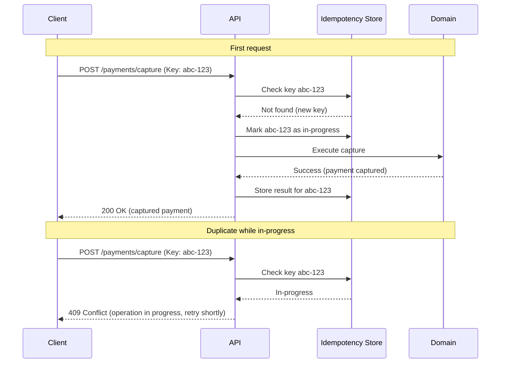
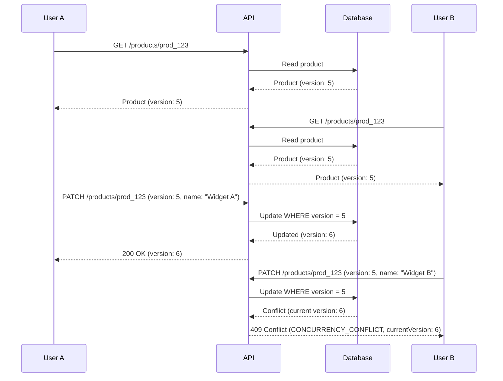
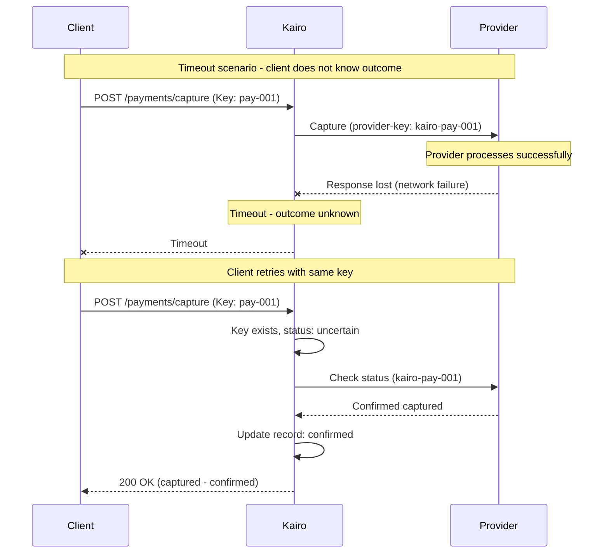

# Idempotency, Concurrency, and Retries

## Metadata

| Field | Value |
|-------|-------|
| Title | Kairo API Idempotency, Concurrency Control, and Retry Semantics |
| Document ID | KAI-API-009 |
| Status | Draft |
| Version | 0.1 |
| Target Release | V1 |
| Owner | Distributed API Reliability Architect |
| Created | 2026-07-21 |
| Last Updated | 2026-07-21 |
| Reviewers | TODO |
| Related Documents | [API Architecture](./API-Architecture.md), [Transaction and Consistency Architecture](../Data/Transaction-and-Consistency-Architecture.md), [API Security](../Security/API-Security.md), [Error Architecture](./Error-Architecture.md), [Request and Response Standards](./Request-and-Response-Standards.md), [Resource and Operation Modeling](./Resource-and-Operation-Modeling.md) |
| Dependencies | [API Architecture](./API-Architecture.md), [Transaction and Consistency Architecture](../Data/Transaction-and-Consistency-Architecture.md) |
| Forward References | Webhook Architecture (future document in this phase) |

---

## Applicable Version

This document defines V1 idempotency, concurrency, and retry semantics. All modules performing state-changing operations must implement these patterns where applicable. Financial and inventory operations have mandatory idempotency requirements.

---

## Purpose

This document defines how the Kairo platform handles duplicate requests, concurrent modifications, and retry behavior — ensuring that network unreliability, client retries, and concurrent access do not produce incorrect business outcomes.

In distributed systems, exactly-once delivery is impossible to guarantee at the network level. Clients retry. Networks duplicate. Timeouts leave outcome ambiguous. Without explicit idempotency and concurrency controls, these realities produce duplicate charges, double inventory deductions, lost updates, and inconsistent state. This document prevents all of these.

---

## Scope

This document covers:

- Idempotency definition, scope, and lifecycle.
- Idempotency key semantics (tenant scope, credential scope, equivalence, replay).
- Optimistic concurrency control and lost-update prevention.
- Client, server, and provider retry semantics.
- Timeout ambiguity and resolution patterns.
- Financial and inventory operation requirements.
- Webhook and background processing idempotency.

This document does not cover:

- Idempotency storage table schemas (implementation detail).
- Middleware implementation code (development standards).
- Specific retry configuration values (deployment configuration).
- Event deduplication in message processing (event architecture phase).
- Database transaction isolation levels (see [Transaction and Consistency Architecture](../Data/Transaction-and-Consistency-Architecture.md)).

---

## Mandatory Principles

| # | Principle |
|---|-----------|
| 1 | Retrying must not create duplicate business effects |
| 2 | An idempotency key is scoped to an authorized tenant and operation |
| 3 | Reusing a key with materially different input must fail |
| 4 | Timeout does not prove failure |
| 5 | Financial clients must be able to determine the authoritative outcome |
| 6 | Concurrency conflicts must not silently overwrite data |
| 7 | Idempotency does not replace domain validation |
| 8 | Database uniqueness alone may not solve all duplicate business effects |
| 9 | Provider-side and Kairo-side idempotency must be coordinated where applicable |

---

## 1. Idempotency Definition

An operation is idempotent when executing it multiple times produces the same business outcome as executing it once.

| Aspect | Detail |
|--------|--------|
| Same outcome | The second execution has the same business effect as the first (none — it is already done) |
| Same response | The second execution returns the same response as the first (replay) |
| No side effects | The second execution does not produce duplicate events, duplicate charges, or duplicate records |
| Client perspective | From the client's perspective, retrying is safe. They will get the same result. |

---

## 2. Naturally Idempotent Operations

Some operations are inherently idempotent without explicit idempotency keys:

| Operation | Why Naturally Idempotent |
|-----------|--------------------------|
| GET (read) | Reading does not change state |
| DELETE (by ID) | Deleting an already-deleted resource has no additional effect |
| PUT (full replacement with same data) | Setting a value to what it already is has no additional effect |
| Configuration set (specific value) | Setting "timezone = UTC" repeatedly is harmless |

These operations do not require `Idempotency-Key` headers.

---

## 3. Idempotency-Protected Mutations

Operations where duplicate execution produces dangerous business effects require explicit idempotency protection:

| Operation | Why Protection Required |
|-----------|------------------------|
| Order creation | Duplicate creates two orders |
| Payment authorization | Duplicate authorizes twice the amount |
| Payment capture | Duplicate captures twice |
| Refund | Duplicate refunds twice the amount |
| Cancellation (with side effects) | Duplicate may trigger double compensation |
| Inventory adjustment | Duplicate adjusts quantity twice |
| Inventory reservation | Duplicate reserves twice the needed stock |
| Subscription creation | Duplicate creates two subscriptions |
| Webhook-triggered mutations | Duplicate webhook delivery triggers duplicate processing |
| Bulk mutation submission | Duplicate submission processes the batch twice |

---

## 4. Idempotency-Key Scope

**An idempotency key is scoped to an authorized tenant and operation.**

| Scope Dimension | Detail |
|----------------|--------|
| Key | Client-provided string identifying the intended operation |
| Tenant | Key is scoped to the authenticated organization. Same key from different tenants are independent. |
| Credentials | Key is scoped to the authenticated identity. Different users within the same tenant have independent key spaces. |
| Endpoint | Key is scoped to the specific operation (endpoint + method). Same key on different endpoints are independent. |
| Combined scope | The uniqueness boundary is: `(tenant, credential, endpoint, key)` |

---

## 5. Tenant Scope

| Rule | Detail |
|------|--------|
| Tenant-isolated | An idempotency key used by Tenant A has no effect on Tenant B |
| No cross-tenant collision | Same key string from different tenants is treated as completely independent |
| Tenant context required | Idempotency key processing requires resolved tenant context (occurs after authentication) |

---

## 6. Credential Scope

| Rule | Detail |
|------|--------|
| Identity-scoped | Keys are scoped to the authenticated identity (API key or user) |
| Prevents cross-user conflict | User A's idempotency key does not conflict with User B's, even in the same tenant |
| Prevents accidental reuse | Different team members cannot accidentally reuse each other's keys |

---

## 7. Request Equivalence

**Reusing a key with materially different input must fail.**

| Rule | Detail |
|------|--------|
| First request wins | The first request with a given key defines the operation. Its parameters are stored. |
| Identical replay succeeds | A subsequent request with the same key AND materially identical parameters returns the stored result. |
| Different parameters fail | A subsequent request with the same key but materially different parameters returns 409 Conflict (`IDEMPOTENCY_KEY_CONFLICT`). |
| Material difference | Fields that change the business outcome are material. Metadata (request timing, headers) is not. |
| Module defines materiality | Each module documents which fields constitute material difference for its operations. |

---

## 8. Response Replay

| Rule | Detail |
|------|--------|
| Stored response | When the first execution completes, the response (status code + body) is stored with the key |
| Replay on duplicate | Subsequent requests with the same key return the stored response without re-executing |
| Same HTTP status | Replayed response includes the same HTTP status as the original |
| Same body | Replayed response includes the same response body as the original |
| Transparent to consumer | The consumer cannot distinguish a replayed response from a fresh one (this is intentional) |

---

## 9. Idempotency Retention

| Rule | Detail |
|------|--------|
| TTL | Idempotency keys expire after a configured period (hours to days, not minutes) |
| After expiry | A previously used key can be reused for a new operation (the old record is gone) |
| Retention direction | Long enough for all reasonable retry scenarios. Short enough to prevent unbounded storage. |
| Not permanent | Idempotency records are operational, not permanent audit. Audit records are separate. |
| Financial | Financial idempotency records may have longer retention than non-financial |

---

## 10. In-Progress Requests

| Rule | Detail |
|------|--------|
| Concurrent duplicate | If a duplicate request arrives while the first is still processing, it waits or returns 409 |
| No parallel execution | The same idempotency key must never trigger parallel execution of the same operation |
| Lock or queue | Implementation uses locking or queuing to prevent concurrent execution |
| Timeout on lock | If waiting for the first request exceeds a timeout, return 409 or 503 with retry guidance |

---

## 11. Failed Requests

| Rule | Detail |
|------|--------|
| Failed = stored failure | If the first execution fails, the failure response is stored |
| Replay failure | Subsequent requests with the same key replay the failure (same error response) |
| Client must use new key | To retry a failed operation, the client must use a NEW idempotency key |
| Prevents retry loops | Replaying a failure prevents infinite retry with the same key creating repeated attempts |
| Transient vs permanent | Both transient and permanent failures are stored. Client uses a new key to genuinely retry. |

---

## 12. Conflicting Reuse

**Reusing a key with materially different input must fail.**

| Scenario | Behavior |
|----------|----------|
| Same key + same parameters | Replay stored response |
| Same key + different parameters | 409 Conflict (`IDEMPOTENCY_KEY_CONFLICT`) |
| Same key + in progress | 409 Conflict or wait (implementation-dependent) |
| Same key + after TTL expiry | Treated as new request (old record expired) |
| Same key + different endpoint | Independent (key scope includes endpoint) |
| Same key + different tenant | Independent (key scope includes tenant) |

---

## 13. Optimistic Concurrency

**Concurrency conflicts must not silently overwrite data.**

| Aspect | Detail |
|--------|--------|
| Mechanism | Resources carry a version indicator (ETag or version field) |
| Read-before-write | Client reads resource (receives version), modifies locally, sends update with version |
| Conflict detection | If resource version has changed since read, update is rejected (409 Conflict) |
| No silent overwrite | A concurrent modification by another user is never silently lost |
| Retry path | Client re-reads current state, re-applies their change, resubmits with new version |

---

## 14. Resource Versions

| Rule | Detail |
|------|--------|
| Version field | Resources that support updates carry a version indicator |
| Incremented on change | Version changes on every successful modification |
| Opaque to consumer | Version format is opaque (consumers do not parse or predict it) |
| Returned on read | Every read of the resource includes the current version |
| Required on update | Update/patch requests include the version they are modifying against |
| Missing version | If consumer omits version on update: module may reject (safe) or accept (last-write-wins for non-critical resources) |

---

## 15. Conditional Requests

| Header | Purpose |
|--------|---------|
| `If-Match: "<etag>"` | Execute only if the resource matches this version (for updates) |
| `If-None-Match: "*"` | Execute only if the resource does NOT exist (for creation) |
| `If-None-Match: "<etag>"` | Return 304 Not Modified if resource has not changed (for caching) |

| Response | Meaning |
|----------|---------|
| 412 Precondition Failed | The condition was not met (version mismatch) |
| 304 Not Modified | Resource has not changed since the provided version |
| 200/201 | Condition met, operation executed |

---

## 16. Lost-Update Prevention

---

## 17. Duplicate Delivery

| Context | Duplication Source | Mitigation |
|---------|-------------------|-----------|
| Client retry | Network failure, timeout | Idempotency key |
| Load balancer retry | Upstream timeout | Idempotency key |
| Webhook redelivery | Receiver timeout or failure | Idempotency on receiver processing |
| Event redelivery | At-least-once messaging | Consumer-side deduplication |
| Background job retry | Worker crash during processing | Job-level idempotency |

**Database uniqueness alone may not solve all duplicate business effects.** A unique constraint prevents duplicate records but does not prevent duplicate external side effects (duplicate payment provider calls, duplicate notification sends).

---

## 18. Client Retries

| Rule | Detail |
|------|--------|
| Safe with key | Retrying with the same idempotency key is always safe (replay or in-progress response) |
| New key for new attempt | If client wants to genuinely retry a DIFFERENT operation, use a new key |
| Status-aware | Only retry on retryable errors (5xx, timeout, network failure). Do not retry 4xx. |
| Backoff required | Client retries must use exponential backoff (see section 22) |
| Limit attempts | Maximum retry count prevents infinite loops |
| Timeout ≠ failure | **Timeout does not prove failure.** Client must check status before assuming failure. |

---

## 19. Server Retries

| Rule | Detail |
|------|--------|
| Internal retries | Platform may internally retry transient infrastructure failures (DB connection, cache miss) |
| Transparent | Internal retries are invisible to the consumer (same request, same response) |
| Bounded | Internal retries are limited (1-2 attempts) with short delays |
| Idempotent internally | Internal retries only for operations that are safe to retry (reads, idempotent writes) |
| No external retry | Platform does not retry external provider calls without explicit idempotency coordination |

---

## 20. Provider Retries

**Provider-side and Kairo-side idempotency must be coordinated where applicable.**

| Rule | Detail |
|------|--------|
| Provider idempotency | When calling external providers (payment gateways), Kairo sends an idempotency key to the provider |
| Key propagation | Kairo's internal idempotency key maps to the provider's idempotency mechanism |
| Coordinated retry | Retrying a provider call uses the same provider-side idempotency key |
| Provider response stored | Provider response is stored as part of Kairo's idempotency record |
| Provider timeout | If provider does not respond, Kairo cannot assume success or failure (see section 21) |

---

## 21. Timeout Ambiguity

**Timeout does not prove failure.**
**Financial clients must be able to determine the authoritative outcome.**

| Scenario | The Problem | Resolution |
|----------|-------------|-----------|
| Client → Kairo timeout | Client does not know if Kairo received and processed the request | Client retries with same idempotency key. Gets replay (if processed) or fresh execution (if not). |
| Kairo → Provider timeout | Kairo does not know if provider processed the request | Kairo marks operation as "uncertain." Client queries status. Provider reconciliation on next sync. |
| Provider → Kairo timeout | Provider processed but Kairo did not receive confirmation | Kairo marks as "uncertain." Background job queries provider for authoritative status. |

### Timeout Resolution Direction

| Resolution | When |
|-----------|------|
| Client retry with same key | Always safe. Gets replay or fresh result. |
| Status check endpoint | Client queries operation status to determine outcome |
| Background reconciliation | Platform periodically reconciles uncertain operations with providers |
| Manual resolution | Last resort for unresolvable discrepancies (support intervention) |

---

## 22. Retry Backoff

| Rule | Detail |
|------|--------|
| Exponential | Each retry waits longer: base × 2^attempt (e.g., 1s, 2s, 4s, 8s) |
| Jitter | Random jitter added to prevent thundering herd |
| Maximum delay | Cap on maximum delay between retries (e.g., 30-60 seconds) |
| Respect Retry-After | If server provides `Retry-After` header, use that instead of calculated backoff |
| Platform guidance | Documentation recommends specific backoff parameters per error category |

---

## 23. Retry Limits

| Rule | Detail |
|------|--------|
| Maximum attempts | Finite retry count per operation (e.g., 3-5 attempts) |
| Total timeout | Maximum total time spent retrying (e.g., 2 minutes total) |
| Escalation | After exhausting retries, escalate (alert, log, queue for manual review) |
| No infinite retry | Unbounded retry loops are prohibited |
| Status check over retry | For uncertain financial operations: check status rather than blindly retrying |

---

## 24. Financial Operations

**Financial clients must be able to determine the authoritative outcome.**

| Requirement | Detail |
|-------------|--------|
| Mandatory idempotency | All financial mutations require `Idempotency-Key` |
| Provider coordination | Kairo-side key maps to provider-side idempotency |
| Outcome determinable | After any failure/timeout, client can determine: did money move? |
| Status endpoint | Financial operations have queryable status (pending, captured, failed, uncertain) |
| Reconciliation | Platform reconciles uncertain financial operations with providers |
| No double-charge | Under no circumstances does a retry produce a duplicate charge |
| No double-refund | Under no circumstances does a retry produce a duplicate refund |
| Audit | Every financial operation attempt is audit-logged regardless of outcome |

| Financial Operation | Idempotency Key | Provider Key | Status Queryable | Reconcilable |
|--------------------|:---:|:---:|:---:|:---:|
| Payment authorization | Required | Required | Yes | Yes |
| Payment capture | Required | Required | Yes | Yes |
| Refund | Required | Required | Yes | Yes |
| Void | Required | Required | Yes | Yes |
| Payout (future) | Required | Required | Yes | Yes |

---

## 25. Inventory Operations

| Requirement | Detail |
|-------------|--------|
| Mandatory idempotency | Inventory adjustments and reservations require `Idempotency-Key` |
| Movement record | Every adjustment creates a movement record (idempotent on key) |
| No double-deduction | Retrying a stock deduction with the same key does not deduct twice |
| No double-reservation | Retrying a reservation with the same key does not reserve twice |
| Concurrency | Concurrent adjustments to the same SKU use optimistic concurrency or atomic operations |
| Negative prevention | Adjustments that would result in negative stock (if disallowed) fail regardless of idempotency |

| Inventory Operation | Idempotency Key | Creates Movement | Concurrency Control |
|--------------------|:---:|:---:|---------------------|
| Stock adjustment | Required | Yes | Atomic decrement/increment |
| Reservation | Required | Yes | Atomic reservation |
| Reservation release | Required | Yes | Atomic release |
| Inventory import (bulk) | Per-item key | Yes (per item) | Per-SKU atomic |

---

## 26. Webhook Processing

| Requirement | Detail |
|-------------|--------|
| At-least-once delivery | Webhook providers may deliver the same event multiple times |
| Receiver idempotency | Kairo's webhook receivers must handle duplicate deliveries without duplicate processing |
| Deduplication key | Provider event ID or delivery ID serves as the deduplication key |
| Processing record | Webhook processing records which events have been handled |
| Order independence | Webhooks may arrive out of order. Processing must handle this. |
| Audit | Webhook receipt and processing are audit-logged |

See Webhook Architecture (forward reference) for comprehensive webhook handling.

---

## 27. Background Processing

| Requirement | Detail |
|-------------|--------|
| Job idempotency | Background jobs that perform mutations must be idempotent |
| Job ID as key | The job's unique identifier serves as the idempotency key for its operation |
| Crash recovery | If a worker crashes mid-processing, the job is retried by another worker with the same ID |
| Exactly-once effect | At-least-once execution + idempotent operation = effectively-once business effect |
| Progress tracking | Long-running jobs track progress to avoid re-processing completed portions on retry |

---

## 28. Audit Requirements

| Event | Audit Record |
|-------|-------------|
| Idempotent operation first execution | Standard business audit event |
| Idempotent operation replay | Logged (replay detected, key reused) but not a new business event |
| Idempotency key conflict | Logged as potential misuse or programming error |
| Concurrency conflict | Logged (caller informed, no data changed) |
| Financial timeout → uncertain | Logged with elevated priority (requires reconciliation) |
| Reconciliation resolution | Logged (outcome determined, state updated) |
| Retry exhaustion | Logged as operational event requiring attention |

---

## Idempotency Requirements Matrix

| Operation | Idempotency Key Required | Provider Key Required | Concurrency Control | Status Queryable |
|-----------|:---:|:---:|:---:|:---:|
| Order creation (checkout) | Yes | — | Optimistic (cart version) | Yes |
| Payment authorization | Yes | Yes (payment provider) | — | Yes |
| Payment capture | Yes | Yes (payment provider) | — | Yes |
| Refund | Yes | Yes (payment provider) | — | Yes |
| Cancellation (with compensation) | Yes | Conditional | Optimistic (order version) | Yes |
| Inventory adjustment | Yes | — | Atomic operation | — |
| Inventory reservation | Yes | — | Atomic operation | — |
| Subscription creation | Yes | Conditional | — | Yes |
| Webhook-triggered mutation | Yes (event ID) | — | Per-operation | — |
| Bulk mutation submission | Yes (batch ID) | — | Per-item | Yes |

---

## Retry Safety Matrix

| Error Category | Safe to Retry | With Same Key | Action Before Retry |
|---------------|:---:|:---:|---------------------|
| Network timeout | Yes | Yes | None (key ensures safety) |
| 500 Internal Error | Cautious | Yes | Brief backoff |
| 502 Bad Gateway | Yes | Yes | Backoff |
| 503 Service Unavailable | Yes | Yes | Respect Retry-After |
| 429 Too Many Requests | Yes | Yes | Respect Retry-After |
| 409 Concurrency Conflict | Yes | No (new key) | Re-read resource, re-apply change |
| 409 Idempotency Conflict | No | No | Use new key with correct parameters |
| 400 Validation Error | No | — | Fix request |
| 401 Unauthorized | Yes | Yes | Refresh credentials first |
| 403 Forbidden | No | — | Insufficient permissions |
| 404 Not Found | No | — | Resource does not exist |
| 422 Business Rule | No | — | Business condition not met |
| Financial timeout | Cautious | Yes | Check status endpoint first |

---

## Version Gate

| Version | Idempotency and Concurrency Gate |
|---------|----------------------------------|
| V1 | Idempotency-Key header supported on all dangerous mutations. Financial operations mandate idempotency. Inventory operations mandate idempotency. Response replay on duplicate key. Conflicting key reuse returns 409. Optimistic concurrency on resource updates (version/ETag). Conditional request support (If-Match). Provider-side idempotency for payment operations. Status endpoints for financial operations. Webhook receiver deduplication. Background job idempotency. |
| V2 | Enhanced reconciliation automation. Idempotency analytics (duplicate rates, conflict rates). Client-specific retry guidance. Advanced bulk operation idempotency (resume from failure point). |
| V3 | Distributed idempotency across service boundaries (if extracted). Cross-region idempotency coordination. |

---

## Decision Summary

| Decision | Rationale |
|----------|-----------|
| Client-provided idempotency keys | Client controls the key because they know their intent. Server-generated keys cannot protect against client-side duplication. |
| Tenant + credential + endpoint scope | Prevents cross-tenant and cross-user key collisions. Endpoint scoping prevents accidental reuse across different operations. |
| Store failed responses | Replaying a failure prevents the client from infinitely retrying the same failing request with the same key. Client must use new key for a genuinely new attempt. |
| Optimistic concurrency over pessimistic locking | Pessimistic locks at the API level create timeouts and deadlocks. Optimistic concurrency (conflict detection on write) is appropriate for web APIs. |
| Provider idempotency coordination | External providers (payment gateways) have their own idempotency mechanisms. Kairo must coordinate keys to prevent duplicate charges even when Kairo's own state is lost. |
| Status endpoints for financial operations | Timeout ambiguity on financial operations requires a way to determine outcome. Status endpoints provide this without retrying the operation. |
| Background job ID as idempotency key | Simplest approach for background processing. The job system naturally provides unique IDs per intended execution. |

---

## Alternatives Considered

| Alternative | Rejected Because |
|------------|-----------------|
| Server-generated idempotency keys | Cannot protect against client-side duplication (client retries before receiving the server-generated key). |
| No idempotency (rely on unique constraints) | Unique constraints prevent duplicate records but not duplicate side effects (provider calls, events, notifications). |
| Pessimistic locking for concurrency | Creates deadlocks, timeouts, and scalability issues in web APIs. Optimistic concurrency is more appropriate. |
| Permanent idempotency records | Unbounded storage growth. Keys should expire after a reasonable retry window. |
| Retry with same key after failure | Would replay the failure forever. Client must use new key to genuinely retry a different attempt. |
| Automatic retry of all provider calls | Unsafe without idempotency coordination. Could produce duplicate charges. |
| Ignore concurrency (last-write-wins) | Silently discards concurrent changes. Unacceptable for business data. |

---

## Architecture Impact

| Concern | Impact |
|---------|--------|
| Module design | Modules must implement idempotency checking for dangerous mutations. Must store idempotency records atomically with the operation. Must implement optimistic concurrency on updatable resources. |
| Infrastructure | Platform must provide idempotency storage infrastructure. Must provide concurrency version injection in responses. |
| External integration | Provider calls must propagate idempotency keys. Provider responses must be stored for replay. |
| Events | Idempotent operations produce events on first execution only (not on replay). |
| Performance | Idempotency check adds one lookup per protected request. Optimistic concurrency adds version check per update. Both are O(1) and acceptable. |
| Testing | Must test duplicate request handling. Must test concurrent modification detection. Must test timeout recovery flows. |

---

## Implementation Impact

| Area | Impact |
|------|--------|
| Modules | Must accept and validate Idempotency-Key header. Must store operation result with key atomically. Must replay stored result on duplicate. Must reject conflicting key reuse. Must implement version/ETag on updatable resources. Must reject concurrent modifications. |
| Platform | Must provide idempotency store infrastructure. Must inject version headers in responses. Must provide conditional request handling. Must coordinate provider-side idempotency for payment operations. |
| Frontend/SDK | Must generate unique idempotency keys per operation attempt. Must implement retry with backoff. Must handle 409 Conflict (concurrency) with re-read + retry. Must handle 409 (idempotency conflict) with new key. |
| Operations | Must monitor idempotency record storage. Must manage TTL/cleanup. Must monitor reconciliation for uncertain operations. |
| Testing | Must test: duplicate requests return same response, conflicting key reuse is rejected, concurrent updates are detected, financial timeout recovery works, webhook deduplication functions. |

---

## Security Responsibilities

| Role | Idempotency and Concurrency Responsibilities |
|------|---------------------------------------------|
| Reliability Architect | Defines idempotency and concurrency patterns. Reviews module implementations. Defines retry guidance. |
| Module Teams | Implement idempotency for their dangerous mutations. Implement optimistic concurrency. Coordinate provider-side keys. |
| Platform Team | Provides idempotency store infrastructure. Provides version injection. Implements conditional request handling. Manages reconciliation infrastructure. |
| Security Team | Validates that idempotency keys cannot be used for enumeration or cross-tenant attacks. Reviews key scoping. |
| Operations | Monitors idempotency storage health. Monitors reconciliation queue. Manages TTL configuration. |

---

## Multi-Tenancy Responsibilities

| Responsibility | Detail |
|---------------|--------|
| Tenant-scoped keys | Idempotency keys are scoped to tenant. Cross-tenant key collision is impossible. |
| Tenant-scoped concurrency | Resource versions are per-resource (inherently tenant-scoped since resources are tenant-owned). |
| No cross-tenant replay | A replayed response is always the response for the authenticated tenant's operation. |
| Reconciliation per-tenant | Financial reconciliation operates within tenant boundaries. |

---

## Out of Scope

This document does not define:

- Idempotency storage table schema (implementation detail).
- Specific retry delay values (deployment configuration).
- Event deduplication in message queues (event architecture phase).
- Database transaction isolation levels (see [Transaction and Consistency Architecture](../Data/Transaction-and-Consistency-Architecture.md)).
- Payment provider-specific idempotency APIs (integration specifications).
- Middleware implementation code (development standards).

---

## Future Considerations

- **Distributed idempotency** — If modules are extracted to services, idempotency must work across service boundaries.
- **Cross-region coordination** — Multi-region deployment requires idempotency records accessible from all regions.
- **Idempotency analytics** — Dashboard showing duplicate rates, conflict rates, and reconciliation status.
- **Client-adaptive retry** — Dynamic retry guidance based on current system health.
- **Resume-from-failure for bulk operations** — Restart failed bulk operations from the point of failure without re-processing completed items.
- **Automatic reconciliation** — Platform automatically resolves uncertain financial operations without manual intervention.

---

## Future Refactoring Triggers

This document should be revisited when:

- Module extraction to services requires distributed idempotency coordination.
- Multi-region deployment requires cross-region idempotency record access.
- Financial reconciliation volume exceeds manual resolution capacity.
- New payment providers with different idempotency mechanisms are integrated.
- Event architecture introduces consumer-side deduplication requirements.
- Bulk operation patterns require resume-from-failure capability.

---

## Change History

| Version | Date | Author | Description |
|---------|------|--------|-------------|
| 0.1 | 2026-07-21 | Distributed API Reliability Architect | Initial draft — idempotency, concurrency, and retry architecture |
