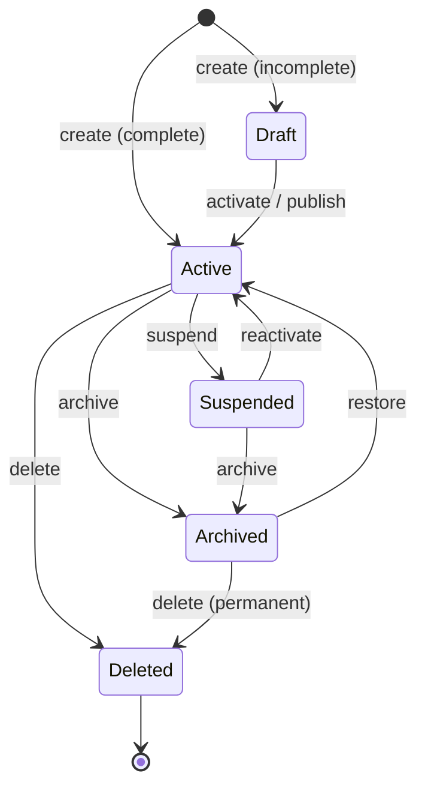
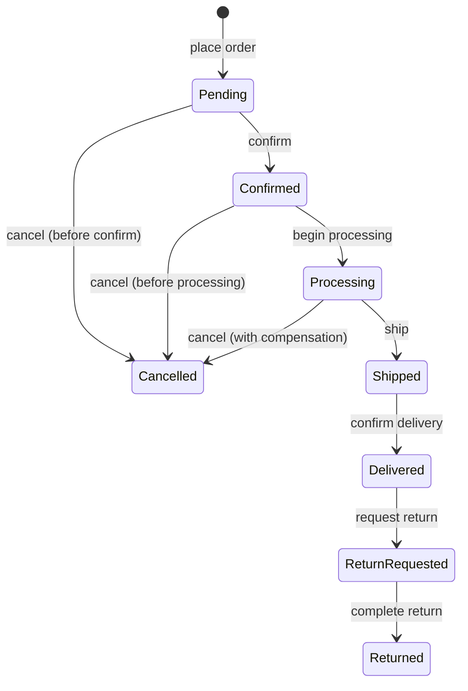
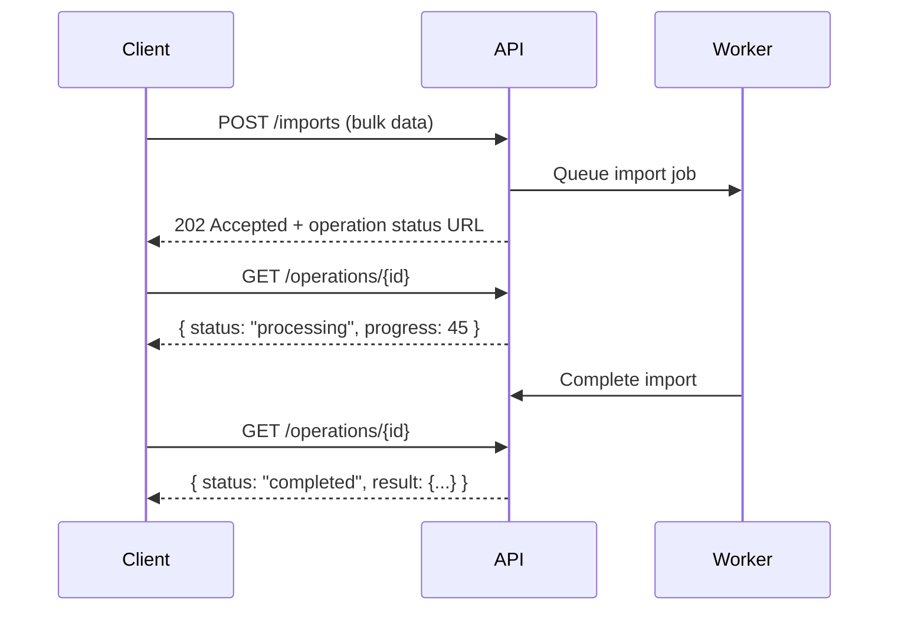

# Resource and Operation Modeling

## Metadata

| Field | Value |
|-------|-------|
| Title | Kairo API Resource and Operation Modeling |
| Document ID | KAI-API-004 |
| Status | Draft |
| Version | 0.1 |
| Target Release | V1 |
| Owner | Resource-Oriented API Design Architect |
| Created | 2026-07-21 |
| Last Updated | 2026-07-21 |
| Reviewers | TODO |
| Related Documents | [API Architecture](./API-Architecture.md), [API Contract Standards](./API-Contract-Standards.md), [Data Modeling Principles](../Data/Data-Modeling-Principles.md), [Transaction and Consistency Architecture](../Data/Transaction-and-Consistency-Architecture.md), [Module Architecture](../Module-Architecture.md), [Data Ownership](../Data/Data-Ownership.md), [Identifier Strategy](../Data/Identifier-Strategy.md) |
| Dependencies | [API Architecture](./API-Architecture.md), [Data Modeling Principles](../Data/Data-Modeling-Principles.md), [Module Architecture](../Module-Architecture.md) |

---

## Applicable Version

This document defines V1 resource and operation modeling. All modules follow these patterns when designing their API operations. The patterns ensure business semantics are preserved in the API rather than reduced to generic database operations.

---

## Purpose

This document defines how business concepts are modeled as API resources and how business operations are expressed as API operations. It establishes when to use standard resource patterns, when to use explicit business actions, and how state transitions, cross-module relationships, and complex operations are handled.

The goal is to ensure that the Kairo API expresses business meaning — not database CRUD. An API that models "adjust inventory" as a direct quantity update, or "cancel order" as a status field PATCH, loses the business semantics that protect against invalid operations, audit gaps, and domain rule violations.

---

## Scope

This document covers:

- Resource definition, ownership, identity, and lifecycle.
- Collection, subresource, and relationship patterns.
- Command, query, and business-action operation types.
- State transitions, long-running operations, and immutability.
- Cross-module references and aggregate boundaries.
- Partial updates, bulk operations, deletion, and archival.
- When to use each operation style.

This document does not cover:

- Concrete endpoint paths or HTTP method assignments (module specifications).
- DTO field definitions or schema (module specifications).
- Error response formatting (API error standards).
- Pagination and filtering syntax (API patterns document).
- Event payload contracts (event architecture phase).

---

## Mandatory Principles

| # | Principle |
|---|-----------|
| 1 | APIs model business concepts, not screens |
| 2 | State-changing business actions require explicit semantics |
| 3 | Invalid state transitions must fail predictably |
| 4 | Resource nesting must not create excessive coupling |
| 5 | Cross-module relationships use stable references |
| 6 | Deletion semantics must reflect actual lifecycle rules |
| 7 | PATCH-style behavior requires clear field and concurrency semantics |
| 8 | Financial actions must not be represented as arbitrary record updates |
| 9 | Inventory adjustment must be modeled as a business operation, not direct quantity replacement |
| 10 | Status changes must follow approved transition rules |

---

## 1. Resource Definition

A resource is an API representation of a business concept that has identity, state, and lifecycle.

| Aspect | Detail |
|--------|--------|
| Identity | Every resource has a stable, unique identifier |
| State | Resources have observable state (fields, status, relationships) |
| Lifecycle | Resources are created, may change, and eventually become inactive or deleted |
| Boundary | A resource belongs to exactly one module. One module owns its lifecycle. |
| Representation | Resources are represented in JSON with consistent conventions (see [API Contract Standards](./API-Contract-Standards.md)) |
| Not a table | Resources represent business concepts. They may be backed by multiple tables, or a single table may produce multiple resource types. |

---

## 2. Resource Ownership

| Rule | Detail |
|------|--------|
| Module owns its resources | The module that owns the business capability owns the resource definition and lifecycle |
| Single owner | Each resource type has exactly one owning module. No shared ownership. |
| Owner defines contract | The owning module defines the resource's fields, valid states, transitions, and operations |
| Owner enforces invariants | Only the owning module validates and enforces the resource's business rules |
| Consumers reference, not own | Other modules reference resources by ID. They do not modify another module's resources directly. |

---

## 3. Resource Identity

| Rule | Detail |
|------|--------|
| Public ID | Every resource has a public identifier following [Identifier Strategy](../Data/Identifier-Strategy.md) |
| Immutable | Resource IDs never change after creation |
| Globally unique | IDs are unique across all tenants and all resource types |
| Self-referencing | Resources include their own `id` in every representation |
| Not authorization | Knowing a resource ID does not grant access (see [API Architecture](./API-Architecture.md)) |

---

## 4. Resource Lifecycle

Resources progress through defined lifecycle stages. Not all resources use all stages.

| Stage | Meaning | API Visibility |
|-------|---------|---------------|
| Draft | Created but incomplete or unpublished | Visible to owner/admin |
| Active | Fully operational, participating in business processes | Visible to all authorized consumers |
| Suspended | Temporarily inactive, may be reactivated | Visible to admin. Not operational. |
| Archived | No longer active. Retained for historical reference. | Visible through explicit archive queries. Not in active collections. |
| Deleted | Removed. No longer accessible through standard APIs. | Not visible. May be recoverable through admin operations within retention window. |

Not every resource type implements every stage. Simple resources may only have Active and Deleted. Complex resources (products, stores, organizations) may use the full lifecycle.

---

## 5. Collections

| Rule | Detail |
|------|--------|
| Always paginated | Collection endpoints never return unbounded result sets |
| Consistent shape | Items in a collection have the same resource shape as single-resource endpoints |
| Filterable | Collections support filtering by relevant attributes |
| Sortable | Collections support sorting by relevant fields |
| Default scope | Collections return active resources by default. Archived/deleted require explicit filter. |
| Tenant-scoped | Collections automatically filtered to the authenticated tenant |

---

## 6. Subresources

Subresources are resources that exist within the context of a parent resource and have no independent existence.

| Rule | Detail |
|------|--------|
| Lifecycle coupled | Subresource lifecycle is bound to the parent. Deleting the parent cascades to subresources. |
| Accessed through parent | Subresources are accessed through their parent's context |
| Own identity | Subresources have their own ID within the parent's scope |
| Examples | Order line items (subresource of Order). Product variants (subresource of Product). |
| Limit nesting | Maximum two levels of nesting. Deeper nesting indicates modeling problems. |

---

## 7. Relationships

| Pattern | When to Use | Example |
|---------|-------------|---------|
| Reference by ID | Resources in different modules or with independent lifecycles | Order references `customerId` |
| Subresource | Lifecycle-coupled, no independent existence | Order contains line items |
| Expansion | Consumer optionally includes related resource data | Expand `customer` on order response |
| Link | Provide URL to related resource | `links: { customer: "..." }` |

---

## 8. References

**Cross-module relationships use stable references.**

| Rule | Detail |
|------|--------|
| Reference by public ID | Cross-module references use the target resource's public identifier |
| Reference is not ownership | Referencing a resource does not create ownership or lifecycle coupling |
| Reference validation | References are validated at creation (target exists and is accessible) |
| Broken references | If a referenced resource is deleted, the reference remains but resolution returns 404 |
| No cascading across modules | Deleting a resource in Module A does not cascade deletes in Module B |
| Snapshot where needed | Where point-in-time data is required (e.g., price at order time), the value is captured, not just referenced |

---

## 9. Commands

Commands are operations that change state with explicit business intent.

| Aspect | Detail |
|--------|--------|
| Named by intent | Commands express what the caller wants to happen: "cancel order", "capture payment", "adjust inventory" |
| Not generic CRUD | Commands are not "update resource with these fields." They are specific business actions. |
| Validation | Commands validate that the operation is permitted in the current state |
| Result | Commands return the resulting resource state after the operation |
| Idempotency | Commands where duplicate execution is dangerous support idempotency keys |
| Audit | Commands that change business state produce audit events |

---

## 10. Queries

Queries retrieve data without changing state.

| Aspect | Detail |
|--------|--------|
| Safe | Queries never produce side effects |
| Idempotent | Repeated queries return the same result (given the same data state) |
| Parameterized | Queries accept filters, sorts, and pagination |
| Cacheable | Query responses may be cached (where freshness permits) |
| Separation | Query contracts may return different shapes than command contracts (optimized for reading) |

---

## 11. Business Actions

**State-changing business actions require explicit semantics.**
**Financial actions must not be represented as arbitrary record updates.**

Business actions are operations with domain meaning that go beyond simple field updates. They enforce business rules, validate preconditions, produce events, and may have side effects.

| Pattern | When to Use | Example |
|---------|-------------|---------|
| Generic update | Only for simple attribute changes with no business rules | Update product description |
| Business action | When the operation has preconditions, side effects, or domain rules | Cancel order, capture payment, adjust inventory |

### Conceptual Examples

| Action | Why Not a Generic Update |
|--------|--------------------------|
| **Product activation** | Requires completeness validation (all required fields populated). Changes visibility. Produces event. |
| **Inventory adjustment** | Must record reason, source. Cannot be negative (unless explicitly allowed). Produces movement record. Not "set quantity to X." |
| **Order cancellation** | Requires state validation (not already shipped). Triggers refund. Releases inventory. Produces event. |
| **Payment capture** | Financial operation. Requires idempotency. Communicates with external provider. Cannot be retried carelessly. |
| **Refund initiation** | Financial operation. Must not exceed original payment. Requires reason. Produces audit event. |
| **Store suspension** | Changes operational status. Affects all store operations. Requires authorization. Produces event. |

---

## 12. State Transitions

**Invalid state transitions must fail predictably.**
**Status changes must follow approved transition rules.**

| Rule | Detail |
|------|--------|
| Explicit transitions | Valid transitions are defined per resource type. Not all states are reachable from all other states. |
| Predictable failure | Attempting an invalid transition returns a clear error identifying the current state and valid transitions |
| Transition as action | State transitions are modeled as business actions, not as field updates. "Cancel" is an action, not `PATCH { status: "cancelled" }`. |
| Preconditions | Each transition has preconditions that must be met (e.g., "can only cancel before shipment") |
| Side effects | Transitions may trigger side effects (release reservation, initiate refund, send notification) |
| Audit | State transitions are audit events |
| Concurrency | Transitions use optimistic concurrency to prevent conflicting changes |

---

## 13. Long-Running Operations

| Aspect | Detail |
|--------|--------|
| When | Operations that cannot complete within a request timeout (bulk imports, complex calculations, external system calls) |
| Pattern | Return 202 Accepted with a status resource. Consumer polls for completion. |
| Status resource | Reports: pending, processing, completed, failed. Includes progress where meaningful. |
| Result | On completion, the status resource links to or includes the result |
| Cancellation | Long-running operations support cancellation where feasible |
| Timeout | Maximum operation duration is defined. Operations exceeding it are failed. |
| Future: webhooks | V2+ may notify completion via webhook instead of requiring polling |

---

## 14. Immutable Resources

Some resources are immutable after creation — they represent facts that cannot be changed.

| Example | Why Immutable |
|---------|--------------|
| Audit events | Historical record must not be altered |
| Payment transactions | Financial record of what happened. Cannot be undone, only compensated. |
| Order snapshots | Point-in-time record of what was ordered at what price |
| Invoices | Legal document. Cannot be modified after issuance. |

| Rule | Detail |
|------|--------|
| No update operations | Immutable resources have no update/patch operations |
| Corrections create new records | Errors are corrected by creating compensating records (credit notes, adjustments), not by modifying originals |
| Append-only | New information is added as new records, not as modifications to existing ones |

---

## 15. Historical Records

| Aspect | Detail |
|--------|--------|
| Definition | Records that represent past events or past states (completed orders, past payments, historical prices) |
| Query access | Accessible through queries with date-range filtering |
| No modification | Historical records are not modifiable through standard APIs. Corrections create new records. |
| Retention | Subject to retention policies (see [Data Lifecycle](../Data/Data-Lifecycle-and-Retention.md)) |
| Archival | May move to archived state after retention period while remaining queryable |

---

## 16. Aggregate Boundaries

| Rule | Detail |
|------|--------|
| Definition | An aggregate is a cluster of resources that are modified together as a unit of consistency |
| Root resource | Every aggregate has a root resource that is the entry point for modifications |
| Internal consistency | Changes within an aggregate are transactionally consistent |
| Cross-aggregate eventual | Changes across aggregates (especially cross-module) are eventually consistent |
| API reflects aggregates | The API structure reflects aggregate boundaries. Operations target aggregate roots. |
| Example | Order (root) + LineItems (within aggregate) = modified together. Order + Payment = separate aggregates, eventually consistent. |

---

## 17. Nested Resources

**Resource nesting must not create excessive coupling.**

| Rule | Detail |
|------|--------|
| Maximum depth | Two levels maximum: `/resources/{id}/subresources/{subId}` |
| Nesting indicates containment | Nesting means lifecycle dependency. The child cannot exist without the parent. |
| Independent resources are not nested | If a resource has an independent lifecycle, it is a top-level resource with a reference, not a nested subresource. |
| Avoid deep nesting | `/organizations/{id}/stores/{id}/products/{id}/variants/{id}` is too deep. Flatten. |
| Cross-module not nested | Resources from different modules are never nested under each other |

---

## 18. Cross-Module References

**Cross-module relationships use stable references.**

| Rule | Detail |
|------|--------|
| Reference by ID only | Module A references Module B's resources by public ID |
| No direct access | Module A cannot directly query Module B's internal data structures |
| Contract-based | Module A uses Module B's published API contract to access referenced resources |
| Eventual consistency | Cross-module state synchronization is eventually consistent (events) |
| Snapshot for point-in-time | Where the referenced value at a moment matters (price, address at order time), snapshot the value |
| Graceful degradation | If Module B is temporarily unavailable, Module A handles the reference gracefully |

---

## 19. Partial Updates

**PATCH-style behavior requires clear field and concurrency semantics.**

| Rule | Detail |
|------|--------|
| Only provided fields change | In a partial update, only fields present in the request body are changed. Absent fields remain unchanged. |
| Null to clear | Sending `null` for a field explicitly clears it (distinct from omitting the field) |
| Not for state transitions | Partial updates are for attribute changes (name, description). State transitions use business actions. |
| Concurrency control | Partial updates use optimistic concurrency (ETag or version field) to prevent lost updates |
| Not for financial fields | Price, quantity, payment amounts are never changed through generic partial updates. They use business actions. |
| Validation | All changed fields are validated. Partial does not mean unvalidated. |

| Field Behavior in Partial Update | Meaning |
|----------------------------------|---------|
| Field present with value | Set field to this value |
| Field present with `null` | Clear the field (set to empty) |
| Field absent | Do not change this field |

---

## 20. Bulk Actions

| Aspect | Detail |
|--------|--------|
| When | Multiple resources need the same operation (bulk import, bulk status change, bulk delete) |
| Pattern | Bulk endpoint accepts array of items. Returns per-item results (success/failure). |
| Partial success | Bulk operations may partially succeed. Response identifies which items succeeded and which failed. |
| Size limits | Bulk operations have a maximum batch size. Larger operations use long-running operation pattern. |
| Atomicity | Bulk operations are NOT all-or-nothing by default (partial success is acceptable). All-or-nothing is a specific variant where stated. |
| Idempotency | Bulk operations support idempotency keys. Individual items within the bulk may have their own idempotency. |

---

## 21. Deletion

**Deletion semantics must reflect actual lifecycle rules.**

| Rule | Detail |
|------|--------|
| Soft delete default | Most resources are soft-deleted (marked inactive, not physically removed) |
| Hard delete rare | Physical deletion is reserved for data lifecycle compliance (retention expiry, right-to-erasure) |
| Deletion is a business action | Deletion has preconditions (no active children, no pending transactions) |
| Financial resources | Financial records (payments, invoices) are NEVER deleted. They are cancelled or voided. |
| References | Deletion does not cascade across module boundaries. References to deleted resources become unresolvable. |
| Response | Deletion returns 204 No Content or the final resource state |
| Recovery | Soft-deleted resources may be recoverable within a window (admin operation) |

---

## 22. Archival

| Rule | Detail |
|------|--------|
| Definition | Moving a resource from active to historical status. Not deletion. |
| Queryable | Archived resources remain queryable through explicit archive-scoped queries |
| Not in active collections | Archived resources do not appear in standard collection queries |
| Reversible | Archival may be reversed (restore to active) if business rules permit |
| Automatic | Some archival is automatic (e.g., orders older than N years move to archived state) |

---

## 23. Restoration

| Aspect | Detail |
|--------|--------|
| From archived | Archived resources may be restored to active state |
| From soft-deleted | Soft-deleted resources may be restored within the recovery window |
| Validation | Restoration validates that the resource can return to active state (no conflicts) |
| Admin operation | Restoration is an administrative action, not a standard consumer operation |
| Audit | Restoration is an auditable event |

---

## 24. Operation Results

| Operation Type | Expected Result |
|---------------|----------------|
| Resource creation | 201 Created + created resource |
| Resource query (single) | 200 OK + resource |
| Resource query (collection) | 200 OK + collection with pagination |
| Business action (sync) | 200 OK + resulting resource state |
| Business action (async) | 202 Accepted + operation status |
| Partial update | 200 OK + updated resource |
| Deletion | 204 No Content |
| Invalid request | 400 Bad Request + validation errors |
| Invalid transition | 409 Conflict + current state + valid transitions |
| Not found | 404 Not Found |
| Unauthorized | 401 Unauthorized |
| Forbidden | 403 Forbidden |

---

## When to Use Each Pattern

| Pattern | Use When | Do NOT Use When |
|---------|----------|-----------------|
| Standard resource operations (GET, POST) | Simple retrieval and creation with minimal business rules | Operation has significant preconditions, side effects, or domain rules |
| Explicit business-action operations | Operation has preconditions, produces side effects, or represents domain-specific intent | Simple attribute changes with no business rules |
| Commands | Changing state with specific business meaning (cancel, capture, refund, adjust) | Reading data |
| Queries | Retrieving data without side effects | Any operation that changes state |
| Asynchronous operations | Operation cannot complete within request timeout or involves external system processing | Simple operations that complete in milliseconds |
| Events rather than synchronous APIs | Cross-module state propagation. Consumer does not need immediate result. Multiple consumers need the same information. | Consumer needs an immediate response. Single specific consumer. Request-reply pattern. |

---

## Anti-Patterns

| Anti-Pattern | Why Wrong | Correct Approach |
|-------------|-----------|-----------------|
| `PATCH /orders/{id} { status: "cancelled" }` | Loses business semantics. No precondition validation. No side effects (refund, inventory release). | `POST /orders/{id}/cancel` with reason |
| `PUT /inventory/{id} { quantity: 50 }` | Loses adjustment context (why? from where? by how much?). No movement record. | `POST /inventory/{id}/adjustments` with quantity delta and reason |
| `PATCH /payments/{id} { status: "captured" }` | Financial operation disguised as field update. No idempotency. No provider communication. | `POST /payments/{id}/capture` with idempotency key |
| `PATCH /products/{id} { status: "active" }` | Activation has preconditions (completeness check). Should produce event. | `POST /products/{id}/activate` |
| `DELETE /payments/{id}` | Financial records cannot be deleted. | `POST /payments/{id}/void` or `POST /refunds` |
| `PATCH /stores/{id} { status: "suspended" }` | Suspension affects all operations. Requires authorization. Produces event. | `POST /stores/{id}/suspend` with reason |

---

## Version Gate

| Version | Resource and Operation Modeling Gate |
|---------|-------------------------------------|
| V1 | Resources modeled per business concept. Business actions used for state transitions, financial operations, and inventory adjustments. Generic updates only for simple attributes. Optimistic concurrency on updates. Cross-module references by ID. Collections paginated. Long-running operations use 202 + polling. Soft-delete default. |
| V2 | Webhook notification for long-running operation completion. Enhanced bulk operations. Custom field extension on resources. Advanced expansion/embedding for relationships. |
| V3 | Event streaming for resource change notifications. GraphQL for flexible resource querying. Advanced archival and retention automation. |

---

## Decision Summary

| Decision | Rationale |
|----------|-----------|
| Business actions over generic PATCH for state transitions | Generic updates lose precondition validation, audit context, and side-effect triggering. Business actions preserve domain semantics. |
| Inventory adjustment as operation, not quantity set | Direct quantity replacement loses "why" (reason), "how much" (delta), and prevents movement tracking. Adjustment as operation captures business context. |
| Financial operations as explicit actions | Financial operations require idempotency, external provider communication, and audit. Generic updates provide none of these. |
| Maximum two levels of nesting | Deeper nesting creates tight coupling, complex URLs, and authorization challenges. Flat + references is cleaner. |
| Soft delete as default | Business data has retention requirements, audit dependencies, and recovery needs. Physical deletion is a data-lifecycle concern, not an API concern. |
| Optimistic concurrency for updates | Pessimistic locking at the API level creates timeouts and deadlocks. Optimistic concurrency (conflict detection) is appropriate for web APIs. |
| Partial success for bulk operations | All-or-nothing for large batches means one bad item fails the entire batch. Partial success with per-item error reporting is more practical. |
| Snapshot for cross-module point-in-time data | Referencing a price by ID means the price could change between order time and viewing. Snapshotting preserves the actual value at the moment it mattered. |

---

## Alternatives Considered

| Alternative | Rejected Because |
|------------|-----------------|
| Pure CRUD for all operations | Loses business semantics. Cannot enforce preconditions. Cannot trigger side effects. Produces anemic APIs. |
| Status field updates for state transitions | No precondition enforcement. No side effects. No audit of the transition itself. Just a field change. |
| Direct quantity replacement for inventory | No movement history. No reason tracking. No adjustment audit. Impossible to reconcile. |
| Deep nesting (3+ levels) | Creates URL complexity, authorization challenges, and tight coupling between resources that may not be truly coupled. |
| All-or-nothing bulk operations | One invalid item fails the entire batch. Impractical for large imports where partial progress is better than no progress. |
| Hard delete as default | Breaks audit trails. Violates retention requirements. Makes recovery impossible. Soft-delete protects against mistakes. |
| Embedding related resources by default | Large responses. N+1 concerns in reverse (too much data). Opt-in expansion gives consumers control. |

---

## Architecture Impact

| Concern | Impact |
|---------|--------|
| Module design | Modules must distinguish between simple attributes (updatable) and domain operations (business actions). Domain layer enforces state transition rules. |
| API design | Every endpoint is classified as resource operation, business action, query, or async operation. No ambiguous "update everything" endpoints. |
| Events | Business actions produce domain events. Cross-module propagation through events, not synchronous calls. |
| Persistence | Resource models map to persistence independently. State machine logic lives in domain layer, not in the API layer. |
| Testing | State transition tests verify that invalid transitions are rejected. Business action tests verify preconditions and side effects. |
| Documentation | Each business action documents its preconditions, valid source states, and side effects. |

---

## Implementation Impact

| Area | Impact |
|------|--------|
| Modules | Must implement state machines for lifecycle-bearing resources. Must expose business actions as distinct operations. Must enforce transition rules in domain layer. Must support optimistic concurrency. |
| Platform | Must provide state-machine infrastructure support. Must provide long-running operation framework (status tracking, polling). Must provide bulk operation infrastructure. |
| Frontend | Must model operations as actions (not field edits). Must handle 409 Conflict with transition guidance. Must handle 202 Accepted with polling. |
| Testing | Must test valid and invalid state transitions. Must test business action preconditions. Must test concurrency conflict handling. Must test bulk partial-success scenarios. |
| Documentation | Must document per-resource lifecycle diagram. Must document business actions with preconditions. Must document valid state transitions. |

---

## Security Responsibilities

| Role | Resource Modeling Responsibilities |
|------|----------------------------------|
| API Design Architect | Defines resource and operation patterns. Reviews that business actions are not disguised as generic updates. Validates state transition modeling. |
| Module Teams | Implement state machines. Define business actions per their domain. Enforce transition rules. Support concurrency control. |
| Platform Team | Provides state-machine infrastructure. Provides long-running operation framework. Provides bulk operation patterns. |
| Security Team | Validates that administrative operations are not accessible through standard patterns. Reviews that financial operations enforce idempotency. |

---

## Multi-Tenancy Responsibilities

| Responsibility | Detail |
|---------------|--------|
| Resources are tenant-scoped | Every resource belongs to a tenant. Operations are scoped to the authenticated tenant. |
| Cross-module references within tenant | References between modules are always within the same tenant boundary |
| Deletion respects tenant | Deleting a resource in one tenant has no effect on other tenants |
| Bulk operations are tenant-scoped | Bulk actions operate only on resources within the authenticated tenant |
| State transitions are tenant-independent | The same transition rules apply to all tenants (platform rules, not per-tenant customization in V1) |

---

## Out of Scope

This document does not define:

- Concrete endpoint URLs or HTTP method assignments (module specifications).
- Specific resource field definitions (module specifications).
- State machine implementation code (development standards).
- Event payload contracts (event architecture phase).
- Pagination and filtering syntax (API patterns document).
- Error response format (API error standards document).
- Specific lifecycle stages per resource type (module specifications).

---

## Future Considerations

- **Resource versioning** — Track resource versions for advanced conflict resolution and history.
- **Event sourcing for specific resources** — Where full history reconstruction is needed, event-sourced resources.
- **Custom workflows** — Tenant-defined state transitions and approval workflows for specific resource types.
- **Resource subscriptions** — Real-time notifications when specific resources change.
- **Computed resources** — Read-only resources derived from multiple sources (reporting/analytics).
- **Resource templates** — Pre-configured resource creation from templates.

---

## Future Refactoring Triggers

This document should be revisited when:

- Custom tenant-defined workflows are needed (trigger for configurable state machines).
- Event sourcing is evaluated for specific resources (trigger for event-sourced resource patterns).
- GraphQL adoption changes how resources are queried (trigger for query-side modeling updates).
- Real-time resource subscriptions are needed (trigger for subscription pattern definition).
- Complex multi-step wizards emerge (trigger for draft/progressive-creation patterns).
- Cross-module aggregate operations are needed (trigger for saga-based operation modeling).

---

## Change History

| Version | Date | Author | Description |
|---------|------|--------|-------------|
| 0.1 | 2026-07-21 | Resource-Oriented API Design Architect | Initial draft — resource and operation modeling |
