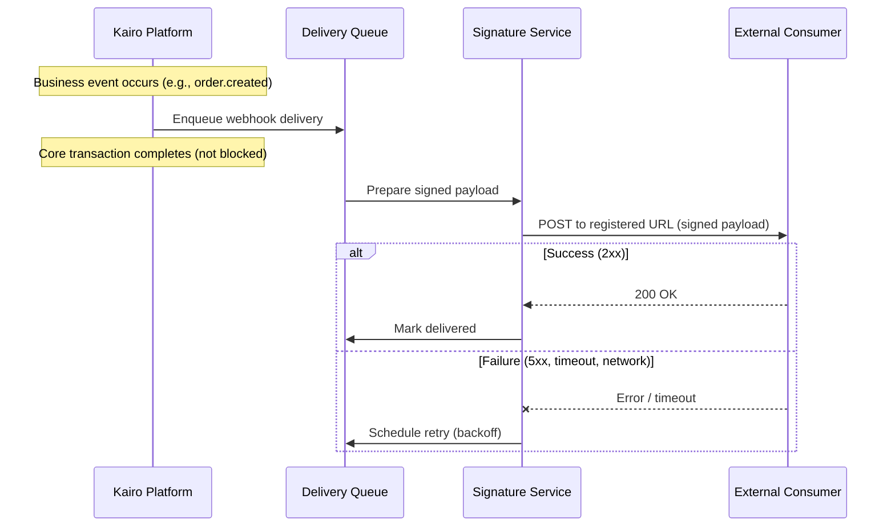
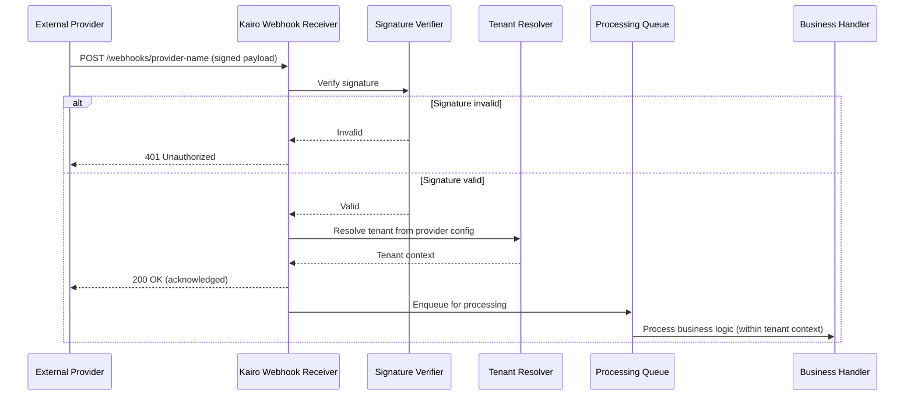

# Webhook Architecture

## Metadata

| Field | Value |
|-------|-------|
| Title | Kairo Webhook and External Event Delivery Architecture |
| Document ID | KAI-API-011 |
| Status | Draft |
| Version | 0.1 |
| Target Release | V1 |
| Owner | Webhook and External Event Delivery Architect |
| Created | 2026-07-21 |
| Last Updated | 2026-07-21 |
| Reviewers | TODO |
| Related Documents | [API Architecture](./API-Architecture.md), [API Security](../Security/API-Security.md), [Secrets and Key Management](../Security/Secrets-and-Key-Management.md), [Idempotency, Concurrency, and Retries](./Idempotency-Concurrency-and-Retries.md), [Transaction and Consistency Architecture](../Data/Transaction-and-Consistency-Architecture.md), [Error Architecture](./Error-Architecture.md), [API Surfaces and Boundaries](./API-Surfaces-and-Boundaries.md), [Data Classification and Sensitivity](../Data/Data-Classification-and-Sensitivity.md) |
| Dependencies | [API Architecture](./API-Architecture.md), [API Security](../Security/API-Security.md), [Secrets and Key Management](../Security/Secrets-and-Key-Management.md) |
| Forward References | Event Architecture (future phase — defines internal domain events that trigger outbound webhooks) |

---

## Applicable Version

This document defines V1 webhook architecture for both outbound (Kairo → external) and inbound (external → Kairo) webhook flows. V1 provides core webhook capabilities with conservative delivery policies. Advanced features (fan-out, transformation, subscription APIs) are identified for future versions.

---

## Purpose

This document defines how the Kairo platform delivers events to external consumers (outbound webhooks) and receives callbacks from external providers (inbound webhooks). It establishes authenticity, delivery semantics, failure handling, and security for both directions.

Webhooks are the primary mechanism for real-time integration between Kairo and the outside world. Outbound webhooks notify partners and custom applications when business events occur. Inbound webhooks receive callbacks from payment providers, shipping carriers, and other external systems. Both directions have distinct trust models, failure modes, and security requirements.

---

## Scope

This document covers:

- Outbound webhook subscription, delivery, signing, retry, and lifecycle.
- Inbound webhook verification, processing, deduplication, and tenant resolution.
- Security (signing, secret rotation, replay protection) for both directions.
- Delivery semantics, failure handling, and operational observability.
- Versioning and compatibility for webhook payloads.

This document does not cover:

- Internal domain event architecture (future Event Architecture phase).
- Provider-specific implementation code (integration specifications).
- Webhook management UI design (frontend specifications).
- Queue infrastructure selection (infrastructure decisions).
- Specific event type catalogs (module specifications).

---

## Mandatory Principles

| # | Principle |
|---|-----------|
| 1 | Webhook delivery is at least once unless proven otherwise |
| 2 | Consumers must tolerate duplicates |
| 3 | Kairo must verify inbound authenticity before business processing |
| 4 | Tenant context must be resolved through trusted provider configuration |
| 5 | Payload receipt and business processing may be separated |
| 6 | A successful transport response does not necessarily mean business completion |
| 7 | Webhooks must not contain unnecessary sensitive data |
| 8 | Secrets must be rotatable |
| 9 | Delivery logs must avoid unsafe payload exposure |
| 10 | Outbound webhook failures must not block core transactions indefinitely |
| 11 | Webhook versions follow explicit compatibility policy |

---

## Outbound Webhooks

Outbound webhooks deliver platform events to external consumer endpoints registered by tenants.

### Outbound Delivery Flow



---

### 1. Subscription Ownership

| Rule | Detail |
|------|--------|
| Organization-owned | Webhook subscriptions belong to an organization |
| Admin-managed | Creating, modifying, and deleting subscriptions requires administrative permissions |
| Multiple subscriptions | An organization may have multiple subscriptions (different URLs, different event selections) |
| Self-service | Tenant administrators manage their own subscriptions (no platform intervention required) |
| Not shared | Subscriptions are not shared between organizations |

---

### 2. Organization Scope

| Rule | Detail |
|------|--------|
| Tenant-scoped delivery | Outbound webhooks deliver only the owning organization's events |
| No cross-tenant | A subscription never receives events from other organizations |
| All stores (default) | A subscription at the organization level receives events from all stores within the organization |
| Store-filtered | Subscriptions may be scoped to specific stores (see section 3) |

---

### 3. Store Scope

| Rule | Detail |
|------|--------|
| Optional filter | Subscriptions may be filtered to specific stores within the organization |
| Default: all stores | If no store filter is specified, all store events are delivered |
| Multiple stores | A subscription may listen to events from multiple specific stores |
| Store deletion | If a filtered store is deleted, events for that store cease (subscription remains) |

---

### 4. Endpoint Registration

| Rule | Detail |
|------|--------|
| HTTPS required | Only HTTPS endpoints accepted. No HTTP. |
| URL validation | Platform validates the URL format at registration time |
| Verification (direction) | V1: URL reachability not verified at registration (consumer's responsibility). V2+: verification challenge. |
| Multiple endpoints | Different subscriptions may target different URLs |
| No localhost | Private/internal network addresses rejected (SSRF prevention) |
| IP allowlisting | Kairo publishes source IP ranges for consumers to allowlist (direction for V2) |

---

### 5. Secret Management

**Secrets must be rotatable.**

| Rule | Detail |
|------|--------|
| Per-subscription secret | Each subscription has a signing secret used to authenticate deliveries |
| Platform-generated | Secret is generated by the platform at subscription creation |
| Displayed once | Secret is displayed to the admin once at creation. Not retrievable after. |
| Rotation | Admin can rotate the secret. New secret takes effect immediately. |
| Dual-secret window | During rotation, platform may sign with both old and new secret briefly (or consumer verifies both). Direction defined per implementation. |
| Storage | Secrets are encrypted at rest per [Secrets and Key Management](../Security/Secrets-and-Key-Management.md) |

---

### 6. Event Selection

| Rule | Detail |
|------|--------|
| Subscribe to types | Subscriptions specify which event types they want to receive |
| Wildcard direction | V1 supports explicit type selection. V2+ may support wildcards (e.g., `order.*`). |
| Available types | Event type catalog is documented per module. Only published types are subscribable. |
| New types opt-in | New event types are not automatically added to existing subscriptions |
| Minimum one type | A subscription must subscribe to at least one event type |

---

### 7. Payload Contracts

**Webhooks must not contain unnecessary sensitive data.**
**Webhook versions follow explicit compatibility policy.**

| Rule | Detail |
|------|--------|
| Consistent structure | All webhook payloads follow a standard envelope structure |
| Event type identified | Payload includes the event type for routing |
| Resource reference | Payload includes the affected resource ID (consumer fetches full data via API if needed) |
| Minimal sensitive data | Payload contains summary information. Full PII/financial details available via API, not in webhook body. |
| Classification | Payload data follows [Data Classification and Sensitivity](../Data/Data-Classification-and-Sensitivity.md) |
| Versioned | Payload format is versioned. Subscription specifies which version to receive. |
| Additive compatible | New fields may be added without version bump (consumers ignore unknown fields) |
| Removal is breaking | Removing fields requires new version with migration |

#### Payload Envelope (conceptual, non-binding)

```json
{
  "id": "evt_01H5EXAMPLE",
  "type": "order.created",
  "version": "1",
  "timestamp": "2026-07-21T10:30:00Z",
  "organizationId": "org_01H3...",
  "storeId": "store_01H4...",
  "data": {
    "orderId": "order_01H5...",
    "status": "pending",
    "totalAmount": { "amount": "129.99", "currency": "USD" },
    "itemCount": 3
  }
}
```

---

### 8. Delivery Identifiers

| Rule | Detail |
|------|--------|
| Event ID | Each event has a globally unique ID (`id` in payload) |
| Delivery ID | Each delivery attempt has a unique delivery ID (in header) |
| Deduplication | Consumers use the event ID to deduplicate (same event may be delivered multiple times) |
| Tracing | Delivery ID enables tracing specific delivery attempts in logs |

---

### 9. Signing

| Rule | Detail |
|------|--------|
| HMAC signature | Every delivery is signed using HMAC-SHA256 with the subscription's secret |
| Signature header | Signature is included in a request header (e.g., `X-Kairo-Signature`) |
| Signed content | Signature covers the raw request body (not individual fields) |
| Verification | Consumer MUST verify the signature before processing the payload |
| Constant-time comparison | Consumers should use constant-time string comparison for signature verification |

---

### 10. Timestamps

| Rule | Detail |
|------|--------|
| Event timestamp | When the business event occurred (in payload) |
| Delivery timestamp | When this delivery attempt was made (in header) |
| Tolerance | Consumers may reject deliveries where the timestamp is too old (replay protection) |

---

### 11. Replay Protection

| Rule | Detail |
|------|--------|
| Timestamp-based | Consumers should reject deliveries with timestamps significantly in the past |
| Tolerance window | Recommended 5-minute tolerance (accounts for retry scheduling) |
| Event ID tracking | Consumers should track processed event IDs to prevent replay |
| Platform does not replay | Platform does not redeliver events beyond the retry window (except manual resend) |

---

### 12. Retry Policy

**Webhook delivery is at least once unless proven otherwise.**

| Rule | Detail |
|------|--------|
| Retry on failure | Failed deliveries (5xx, timeout, network error) are retried |
| Not on 4xx | Client errors (4xx) are not retried (except 408, 429) |
| Maximum attempts | Finite retry count (e.g., 5-10 attempts) |
| Total window | Maximum retry window (e.g., 24-72 hours) |
| After exhaustion | Event is marked as failed. Not retried further. Visible in delivery logs. |
| 2xx is success | Any 2xx status from consumer is treated as successful delivery |

---

### 13. Backoff

| Rule | Detail |
|------|--------|
| Exponential | Retry delays increase exponentially (e.g., 1m, 5m, 30m, 2h, 12h) |
| Jitter | Random jitter added to prevent thundering herd |
| Configurable direction | Platform determines retry schedule. Not consumer-configurable in V1. |

---

### 14. Ordering

| Rule | Detail |
|------|--------|
| Best-effort ordering | Events are delivered in approximately chronological order |
| Not guaranteed | Strict ordering is not guaranteed (retries, parallel delivery may reorder) |
| Consumer handles out-of-order | Consumers must handle events arriving out of order (use timestamps and resource state) |
| Same resource hint | Events for the same resource are delivered in order where feasible (best-effort) |

---

### 15. Duplicate Delivery

**Consumers must tolerate duplicates.**

| Rule | Detail |
|------|--------|
| At-least-once | The platform guarantees at least one delivery attempt. May deliver more. |
| Deduplication is consumer's responsibility | Consumer uses the event ID to detect and skip duplicates |
| Retry causes duplicates | If consumer processed the event but responded with error/timeout, retry delivers again |
| Platform does not guarantee exactly-once | Network conditions make exactly-once delivery impossible to guarantee |

---

### 16. Failure Handling

**Outbound webhook failures must not block core transactions indefinitely.**

| Rule | Detail |
|------|--------|
| Decoupled | Webhook delivery is decoupled from the core transaction (async queue) |
| Transaction completes | The business transaction (order creation, payment) completes regardless of webhook delivery success |
| Failure visibility | Delivery failures are visible in the subscription's delivery logs |
| Consumer notification | After repeated failures, the organization is notified (email/notification) |
| No rollback | A failed webhook delivery never causes a business transaction to roll back |

---

### 17. Suspension

| Rule | Detail |
|------|--------|
| Automatic suspension | After sustained failure (e.g., consecutive failures over 24-72 hours), subscription is suspended |
| No delivery | Suspended subscriptions stop receiving delivery attempts |
| Events queued (briefly) | Events may be briefly retained for replay after reactivation. Not indefinitely. |
| Notification | Organization is notified when a subscription is suspended |
| Admin visible | Suspension status visible in subscription management |

---

### 18. Reactivation

| Rule | Detail |
|------|--------|
| Manual | Admin reactivates the subscription after resolving the endpoint issue |
| Test delivery | A test event is sent to verify the endpoint before full reactivation |
| Missed events | Events that occurred during suspension may be lost (not guaranteed replay) |
| Consumer reconciliation | Consumer should reconcile state via API after reactivation |

---

### 19. Delivery Logs

**Delivery logs must avoid unsafe payload exposure.**

| Rule | Detail |
|------|--------|
| Per-subscription | Delivery history is available per subscription |
| Includes | Event type, delivery timestamp, response status, success/failure |
| Excludes | Full payload body (may contain sensitive data) |
| Retention | Delivery logs retained for a defined period (days to weeks) |
| Admin access | Only organization administrators can view delivery logs |
| Troubleshooting | Sufficient detail to diagnose delivery issues without exposing full payloads |

---

### 20. Payload Retention

| Rule | Detail |
|------|--------|
| Short-term | Payloads retained briefly for retry purposes |
| Not long-term | Payloads are not permanently stored after successful delivery |
| After retry exhaustion | Payload may be retained briefly for manual investigation, then deleted |
| Not a data store | Webhook delivery infrastructure is not an event replay system |

---

### 21. Versioning

**Webhook versions follow explicit compatibility policy.**

| Rule | Detail |
|------|--------|
| Per-subscription version | Each subscription specifies the payload version it expects |
| Additive is non-breaking | New fields added to a version do not require version bump |
| Removal is breaking | Removing fields or changing semantics requires new version |
| Multiple versions | Platform may serve multiple active versions simultaneously |
| Deprecation | Old versions follow API deprecation policy (notice, timeline, sunset) |
| Default version | New subscriptions default to the latest stable version |

---

### 22. Test Delivery

| Rule | Detail |
|------|--------|
| Available | Admins can trigger a test delivery to verify endpoint connectivity |
| Test event | Clearly marked as a test (event type includes test indicator) |
| No business effect | Test events do not represent real business events. Consumer should acknowledge and discard. |
| Signature valid | Test deliveries use the real subscription secret (validates full verification flow) |

---

### 23. Tenant Deletion

| Rule | Detail |
|------|--------|
| Subscriptions deleted | When a tenant is deleted, all webhook subscriptions are removed |
| Delivery ceases | No further events are delivered for the deleted tenant |
| Pending deliveries | In-flight deliveries for a deleting tenant are abandoned |
| Logs cleaned | Delivery logs for the tenant are deleted per data lifecycle policy |

---

## Inbound Webhooks

Inbound webhooks receive callbacks from external providers (payment gateways, shipping carriers, marketplace platforms).

### Inbound Processing Flow



---

### 1. Provider Identification

| Rule | Detail |
|------|--------|
| Per-provider endpoint | Each provider type has its own receiver endpoint (not a shared generic receiver) |
| Provider known | Only registered/supported providers can send webhooks. Unknown sources are rejected. |
| Configuration | Provider webhook configuration (signing key, account mapping) is stored per integration |

---

### 2. Signature Verification

**Kairo must verify inbound authenticity before business processing.**

| Rule | Detail |
|------|--------|
| Mandatory | All inbound webhooks must be signature-verified before any business processing |
| Provider-specific | Each provider has its own signing mechanism (HMAC, asymmetric, etc.) |
| Fail-closed | If signature verification fails, the webhook is rejected (401/403) |
| Raw body | Signature verification uses the raw request body (not parsed/re-serialized) |
| Before processing | Verification occurs before tenant resolution, before business logic, before queuing for async processing |

---

### 3. Replay Protection

| Rule | Detail |
|------|--------|
| Timestamp validation | Where providers include timestamps, validate recency |
| Event ID tracking | Store processed event IDs to detect replays |
| Tolerance | Accept events within a reasonable time window (provider-dependent) |
| Old events | Events significantly in the past are rejected |

---

### 4. Endpoint Isolation

| Rule | Detail |
|------|--------|
| Per-provider | Separate endpoint per provider type |
| Not publicly discoverable | Webhook receiver URLs are not listed in public documentation (provider-specific) |
| Rate-limited | Inbound webhook endpoints are rate-limited to prevent abuse |
| SSRF protection | Responses do not follow redirects or fetch external resources based on payload content |

---

### 5. Payload Validation

| Rule | Detail |
|------|--------|
| Structure validation | Payload is validated against expected structure before processing |
| Type checking | Fields are type-checked per provider's documented contract |
| Size limits | Maximum payload size enforced |
| Malformed rejection | Malformed payloads are logged and rejected (200 OK to prevent provider retry if desired, or 400 — provider-dependent) |

---

### 6. Event Deduplication

**Consumers must tolerate duplicates** (applies to Kairo as a consumer of provider webhooks).

| Rule | Detail |
|------|--------|
| Provider event ID | Use the provider's event/delivery ID for deduplication |
| Idempotent processing | Business handlers must be idempotent (processing the same event twice has no additional effect) |
| Dedup store | Processed event IDs are stored for a retention window |
| Duplicate handling | Duplicate events are acknowledged (200 OK) but not re-processed |

---

### 7. Tenant Resolution

**Tenant context must be resolved through trusted provider configuration.**

| Rule | Detail |
|------|--------|
| Not from payload | Tenant is NOT resolved from untrusted payload fields supplied by the provider |
| From configuration | Tenant is resolved from the integration configuration that maps the provider account to a Kairo organization |
| Trusted mapping | The mapping between provider account ID and Kairo organization was established during integration setup (trusted operation) |
| Verification | Provider account ID in the payload is matched against the registered integration |
| Failure | If tenant cannot be resolved, the webhook is logged and rejected |

---

### 8. Provider-Account Mapping

| Rule | Detail |
|------|--------|
| Integration setup | During integration configuration, the organization maps their provider account to Kairo |
| Stored mapping | `(provider_type, provider_account_id) → kairo_organization_id` |
| Unique | A provider account maps to exactly one Kairo organization |
| Verified | Mapping is verified during setup (not blindly trusted later) |
| Multiple accounts | An organization may have multiple provider accounts (each mapped separately) |

---

### 9. Asynchronous Processing

**Payload receipt and business processing may be separated.**
**A successful transport response does not necessarily mean business completion.**

| Rule | Detail |
|------|--------|
| Acknowledge quickly | Return 200 OK to the provider immediately after verification and queuing |
| Process async | Business logic executes asynchronously from a queue |
| Provider timeout | Providers have short timeouts. Synchronous processing risks timeout and redelivery. |
| Separation | Receipt (200 OK) means "received and will process." Not "business operation complete." |
| Failure handling | If async processing fails, Kairo handles internally (no provider retry expected) |

---

### 10. Idempotency

| Rule | Detail |
|------|--------|
| Handler idempotency | Business handlers processing webhook events must be idempotent |
| Natural dedup | Payment confirmation for an already-confirmed payment is a no-op |
| State checks | Handlers check current state before acting (don't assume the event is news) |
| Provider retries | Providers may retry if they don't receive 200 OK. Handler must handle this. |

---

### 11. Unknown Events

| Rule | Detail |
|------|--------|
| Acknowledge | Unknown event types are acknowledged (200 OK) but not processed |
| Log | Unknown events are logged for investigation |
| No failure | Unknown events do not cause errors or alerts (providers may add new event types) |
| Forward-compatible | Kairo gracefully ignores events it does not yet handle |

---

### 12. Out-of-Order Events

| Rule | Detail |
|------|--------|
| Expected | Events may arrive out of chronological order |
| State-based processing | Handlers check current resource state, not assumed sequence |
| Timestamps | Use event timestamps to determine chronological order when relevant |
| Ignore stale | If current state is newer than the event (based on timestamps/versions), event is safely ignored |
| No assumption | Never assume event N arrives before event N+1 |

---

### 13. Retry Behavior

| Rule | Detail |
|------|--------|
| Provider retries | If Kairo returns non-2xx, providers will retry (provider-dependent schedule) |
| Kairo acknowledges quickly | 200 OK prevents unnecessary provider retries |
| Internal retry | If Kairo's internal processing fails, Kairo retries internally (not relying on provider retry) |
| Dead letter | Events that fail internal processing after retries go to dead-letter queue for investigation |

---

### 14. Provider Reconciliation

| Rule | Detail |
|------|--------|
| Webhooks supplement, not replace | Webhooks are notifications. Platform reconciles with provider via API for authoritative state. |
| Periodic sync | Critical integrations (payments) periodically sync state via API regardless of webhooks |
| Missed events | If webhooks are missed (outage), reconciliation catches the gap |
| Authoritative source | Provider's API (not webhook payload) is the authoritative source for provider-side state |

---

### 15. Security Monitoring

| Rule | Detail |
|------|--------|
| Signature failures logged | Failed signature verifications are logged as security events |
| Volume anomalies | Unusual webhook volume (spike or drop) triggers alerts |
| Unknown sources | Requests from unknown sources are rejected and logged |
| Credential compromise | If provider signing key is compromised, rotation is immediate (see [Secrets and Key Management](../Security/Secrets-and-Key-Management.md)) |
| Audit | Webhook receipt and processing are audit-logged |

---

## Version Gate

| Version | Webhook Architecture Gate |
|---------|--------------------------|
| V1 | Outbound: subscription management, event selection, HMAC signing, exponential retry, automatic suspension, delivery logs, test delivery. Inbound: per-provider endpoints, signature verification, async processing, event deduplication, tenant resolution from config, idempotent handlers, provider reconciliation. Both: at-least-once semantics. |
| V2 | Outbound: webhook management API (self-service), endpoint verification challenge, event replay (manual), fan-out improvements, wildcard subscriptions. Inbound: enhanced dead-letter handling, automated reconciliation. |
| V3 | Outbound: real-time streaming alternative (WebSocket/SSE), event transformation, custom filtering. Inbound: multi-provider webhook gateway. |

---

## Decision Summary

| Decision | Rationale |
|----------|-----------|
| At-least-once delivery (not exactly-once) | Exactly-once is impossible to guarantee across networks. At-least-once with consumer deduplication is honest and practical. |
| Async delivery decoupled from transactions | Blocking a payment transaction on webhook delivery would make webhook consumer availability a dependency of core platform reliability. |
| Signature-based authenticity (HMAC) | Simple, well-understood, and sufficient for webhook authenticity. Asymmetric signing is over-complex for this use case. |
| Tenant resolution from config (not payload) | Payload is untrusted. A malicious or misconfigured provider could supply wrong tenant IDs. Config-based resolution is secure. |
| Acknowledge-then-process for inbound | Provider timeouts are short (5-30s). Synchronous processing risks timeout → unnecessary retry → duplicate delivery storm. |
| Per-provider inbound endpoints | Different providers have different signing mechanisms, payload formats, and retry behaviors. Unified endpoint would require complex routing logic. |
| Delivery logs without full payload | Full payloads in logs risk exposing sensitive data (customer info, payment details). Metadata is sufficient for troubleshooting. |
| Automatic suspension after sustained failure | Prevents unbounded retry accumulation. Notifies the organization. Consumer fixes and reactivates. |
| Subscription-level secrets | Per-subscription secrets enable independent rotation and limit blast radius of compromise. |

---

## Alternatives Considered

| Alternative | Rejected Because |
|------------|-----------------|
| Exactly-once delivery guarantee | Impossible across networks. Claiming it is dishonest. At-least-once with deduplication is correct. |
| Synchronous delivery (block transaction) | Makes webhook consumer availability a dependency of core platform. Unacceptable reliability risk. |
| Shared signing secret across subscriptions | Compromise of one secret affects all. Per-subscription limits blast radius. |
| Tenant resolution from webhook payload | Payload is untrusted. Provider could send wrong tenant data. Config-based resolution is secure. |
| Synchronous inbound processing | Provider timeouts cause retries. Retries cause duplicates. Async processing avoids this spiral. |
| Generic inbound webhook endpoint | Different providers need different verification, parsing, and mapping. Generic endpoint is a complex routing mess. |
| Full payload in delivery logs | Sensitive data exposure risk. Event type + timestamp + status is sufficient for troubleshooting. |
| Unlimited retry (never give up) | Unbounded retry accumulation. Failing endpoint may never recover. Suspension is more practical. |
| Consumer-provided signing keys | Platform-generated keys are more secure (proper entropy). Consumer-provided keys may be weak. |

---

## Architecture Impact

| Concern | Impact |
|---------|--------|
| Module design | Modules publish domain events that trigger outbound webhooks. Must define event types and payload contracts. |
| Infrastructure | Platform requires webhook delivery queue, retry scheduling, signature service, and delivery tracking. |
| Integration | Inbound webhooks require per-provider receiver implementation with provider-specific verification. |
| Security | Signing secrets must be stored encrypted. Signature verification before any business processing. |
| Observability | Delivery success/failure rates, queue depth, suspension events must be monitored. |
| Event Architecture dependency | Outbound webhooks are triggered by internal domain events. Event Architecture phase defines the internal event contracts. |

---

## Implementation Impact

| Area | Impact |
|------|--------|
| Modules | Must define webhook-eligible event types. Must produce event payloads conforming to the webhook envelope. Must implement idempotent inbound webhook handlers for their domain. |
| Platform | Must provide webhook delivery infrastructure (queue, retry, signing, suspension). Must provide inbound webhook receiver framework (verification, routing, async processing). Must manage subscription lifecycle and secrets. |
| Frontend | Must provide subscription management UI (create, configure, view logs, test, reactivate). |
| Operations | Must monitor delivery health. Must manage suspended subscriptions. Must investigate dead-letter events. Must rotate compromised secrets. |
| Security | Must audit webhook secret access. Must monitor signature verification failures. Must respond to potential compromise. |

---

## Security Responsibilities

| Role | Webhook Security Responsibilities |
|------|----------------------------------|
| Webhook Architect | Defines signing and verification standards. Reviews security of webhook flows. Governs payload sensitivity. |
| Module Teams | Define event payloads (minimal sensitive data). Implement idempotent inbound handlers. |
| Platform Team | Implements signing infrastructure. Manages secret storage. Implements inbound verification. Enforces rate limiting on receivers. |
| Security Team | Reviews signing approach. Monitors verification failures. Responds to secret compromise. Audits webhook access. |
| Operations | Monitors delivery health. Manages suspension notifications. Investigates dead-letter events. |

---

## Multi-Tenancy Responsibilities

| Responsibility | Detail |
|---------------|--------|
| Outbound tenant isolation | Subscriptions deliver only their organization's events. No cross-tenant delivery. |
| Inbound tenant resolution | Resolved from trusted integration configuration, not from provider payload. |
| Secret isolation | Each subscription has its own secret. No shared secrets across tenants. |
| Delivery log isolation | Each tenant sees only their own delivery logs. |
| Suspension is per-subscription | One subscription's suspension does not affect other tenants or other subscriptions. |

---

## Out of Scope

This document does not define:

- Internal domain event architecture (future Event Architecture phase).
- Provider-specific webhook integration code (integration specifications).
- Webhook management UI design (frontend specifications).
- Queue technology selection (infrastructure decisions).
- Specific event type catalogs (defined per module).
- Event payload field definitions (defined per module).
- Signing key byte lengths or algorithm parameters (implementation detail following [Secrets and Key Management](../Security/Secrets-and-Key-Management.md)).

---

## Future Considerations

- **Event replay** — Admin ability to replay a specific event to a subscription (for recovery after outage).
- **Webhook management API** — Self-service API for subscription CRUD (in addition to admin portal).
- **Endpoint verification challenge** — Verify endpoint ownership during registration (challenge-response).
- **Fan-out optimization** — Efficient delivery to many subscriptions for the same event.
- **Event transformation** — Tenant-configured payload transformation before delivery.
- **Real-time streaming** — WebSocket/SSE alternative for consumers wanting persistent connections.
- **Dead-letter dashboard** — Consumer visibility into failed inbound event processing.
- **Multi-provider gateway** — Unified inbound framework reducing per-provider implementation effort.

---

## Future Refactoring Triggers

This document should be revisited when:

- Event Architecture phase defines internal event contracts (trigger for outbound event source alignment).
- Webhook delivery volume exceeds single-queue capacity (trigger for fan-out architecture).
- Consumers need event replay capability (trigger for event store/replay infrastructure).
- Provider integrations exceed manageable per-provider implementation (trigger for gateway pattern).
- Real-time consumers need sub-second delivery (trigger for streaming alternative).
- Secret rotation frequency requires zero-downtime dual-key (trigger for enhanced rotation protocol).

---

## Change History

| Version | Date | Author | Description |
|---------|------|--------|-------------|
| 0.1 | 2026-07-21 | Webhook and External Event Delivery Architect | Initial draft — webhook architecture |
