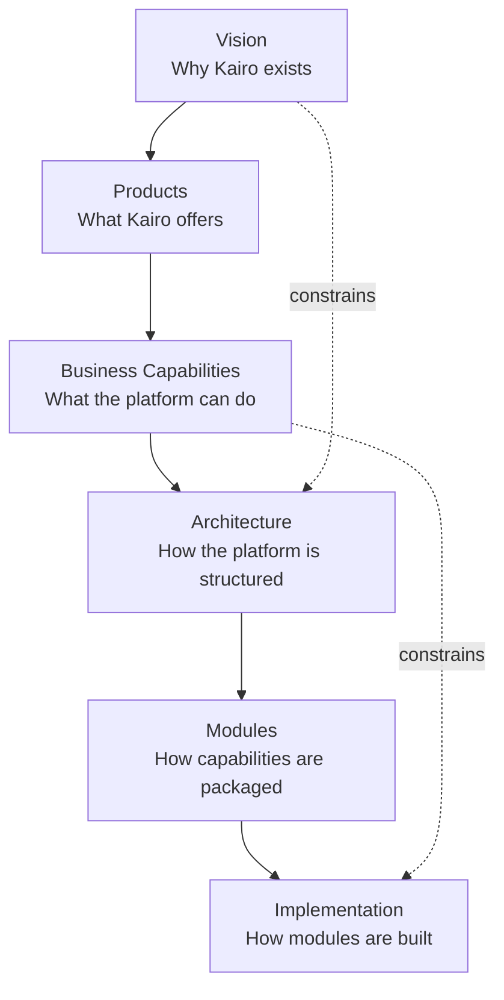
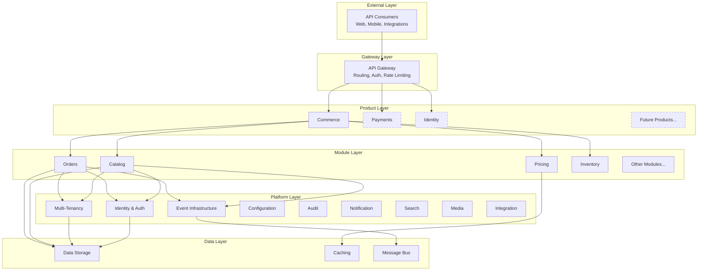

# Architecture Overview

## Metadata

| Field | Value |
|-------|-------|
| Title | Kairo Architecture Overview |
| Document ID | KAI-ARCH-001 |
| Status | Draft |
| Version | 0.1 |
| Target Release | N/A |
| Owner | Chief Software Architect |
| Created | 2026-07-15 |
| Last Updated | 2026-07-15 |
| Reviewers | TODO |
| Related Documents | [Vision](../01-Foundation/Vision.md), [Technical Philosophy](../01-Foundation/Technical-Philosophy.md), [Product Ecosystem](../02-Products/Product-Ecosystem.md), [Capability Map](../03-Business-Capabilities/Capability-Map.md), [Bounded Contexts](../03-Business-Capabilities/Bounded-Contexts.md), [Context Relationships](../03-Business-Capabilities/Context-Relationships.md) |
| Dependencies | None |

---

## Purpose

This document provides the executive overview of Kairo's technical architecture. It explains why architecture matters, how business capabilities drive architectural decisions, and how the platform is structured at the highest level.

Architecture is the bridge between business intent and working software. Without deliberate architecture, complexity grows unchecked, decisions are made inconsistently, and the system becomes progressively harder to change. Kairo's architecture exists to ensure that the platform can evolve over many years while maintaining coherence, reliability, and developer experience.

This document does not describe implementation details. It establishes the architectural frame within which all implementation decisions are made.

---

## Scope

This document covers:

- The relationship between business strategy and technical architecture
- The goals and philosophy that guide architectural decisions
- The major architectural layers of the platform
- The principles that constrain how architecture evolves

This document does not cover:

- Specific module designs (see `06-Modules/`)
- API contracts (see individual module specifications)
- Database schemas or data models
- Deployment topology or infrastructure configuration

---

## Why Architecture Matters

Architecture determines what is possible, what is easy, and what is hard. It is the set of decisions that are expensive to change once made. These decisions include:

- How the system is divided into components
- How components communicate
- Where data lives and who owns it
- What can change independently and what must change together
- How the system behaves under failure

Getting these decisions right early creates a foundation that supports growth. Getting them wrong creates structural debt that compounds with every feature added.

For Kairo, architecture is especially critical because:

- The platform must serve multiple products that evolve independently.
- Business capabilities must be composable without creating fragile coupling.
- The developer experience depends on consistent, predictable behavior across the entire ecosystem.
- The system must support a decade of evolution without requiring wholesale replacement.

---

## How Business Drives Architecture

Architecture does not exist in isolation. It is derived from business needs and constrained by business realities. The Kairo platform follows a deliberate chain from vision to implementation:

Each layer in this chain serves a specific purpose:

| Layer | Determines | Driven By |
|-------|-----------|-----------|
| Vision | Why the platform exists and where it is going | Founder, market, long-term strategy |
| Products | What distinct offerings the platform provides | Vision, customer needs |
| Business Capabilities | What the platform can do in business terms | Products, domain analysis |
| Architecture | How the platform is structured to deliver capabilities | Capabilities, technical constraints, quality attributes |
| Modules | How capabilities are packaged into buildable units | Architecture, bounded contexts |
| Implementation | How modules are coded, tested, and deployed | Modules, development standards |

Architecture responds to business capabilities. When a new capability is defined, architecture determines where it fits, how it communicates, and what constraints apply. Architecture does not invent capabilities — it serves them.

---

## Architecture Goals

The architecture must achieve the following goals:

### Enable Product Independence

Each product in the Kairo ecosystem must be developable, deployable, and adoptable independently. The architecture must prevent coupling that would force products to release, scale, or fail together.

### Support Capability Composition

Business capabilities must be composable. A customer adopting Catalog, Pricing, and Orders should not be forced to adopt Fulfillment or Promotions. The architecture must allow any combination of capabilities to work together without requiring all of them.

### Ensure Developer Experience Consistency

The architecture must produce a consistent developer experience across all products and capabilities. API patterns, error handling, authentication, and data conventions must be uniform. Consistency is an architectural property, not a documentation exercise.

### Maintain Long-Term Evolvability

The architecture must support change over many years. New capabilities, new products, and new requirements must be accommodable without restructuring the foundation. Decisions made today must not foreclose options needed tomorrow.

### Enforce Domain Boundaries

Business domain boundaries must be enforced architecturally, not by convention. A module must not be able to accidentally access another module's data or bypass its contracts. Boundaries must be structural.

### Deliver Reliability at the Infrastructure Level

Reliability must be an architectural property. Data integrity, failure handling, and recovery must be designed into the system's structure, not bolted on through application logic.

---

## Architecture Philosophy

### Business Domains Drive Structure

The system is structured around business domains, not technical layers. Each bounded context owns its data, its logic, and its contracts. Cross-cutting technical concerns (authentication, logging, event delivery) are provided by the platform layer, not by individual domains.

### Modular Monolith First, Services Later

The initial architecture is a modular monolith with strict internal boundaries. Module boundaries are enforced through architecture — modules communicate through defined interfaces, not direct data access. This provides the discipline of service-oriented architecture without the operational complexity of distributed systems.

Service extraction happens when justified by concrete requirements (independent scaling, team autonomy, deployment independence), not by anticipation.

### Contracts Over Coupling

Modules interact through explicit contracts: defined APIs, typed events, and documented queries. No module accesses another module's internals. Contracts are versioned and backward-compatible. This ensures that modules can evolve independently within the constraints of their contracts.

### Platform Absorbs Cross-Cutting Complexity

Concerns that span multiple modules — authentication, authorization, multi-tenancy, event delivery, audit, configuration — are handled by the platform layer. Individual modules consume these services through defined interfaces. No module reimplements a platform concern.

### Simplicity Until Complexity Is Proven Necessary

The architecture starts simple and adds complexity only when real requirements demand it. Distributed transactions, eventual consistency, CQRS, and other complex patterns are adopted per-module when the module's specific requirements justify them — not applied uniformly across the system.

---

## Architectural Layers

The Kairo platform is organized into distinct architectural layers. Each layer has a clear responsibility and defined relationships with adjacent layers.

### Layer Responsibilities

| Layer | Responsibility |
|-------|---------------|
| **External** | API consumers — applications, integrations, and services that interact with the platform through its public APIs |
| **Gateway** | Request routing, authentication verification, rate limiting, API versioning, and request validation |
| **Product** | Product-level orchestration and product-specific cross-module concerns |
| **Module** | Business logic, domain rules, and data ownership within a bounded context |
| **Platform** | Cross-cutting infrastructure services consumed by all modules and products |
| **Data** | Persistent storage, caching, and asynchronous message delivery |

### Layer Rules

- Layers communicate downward. A higher layer may call a lower layer. A lower layer never calls a higher layer directly — it communicates upward through events.
- Modules within the same product may communicate through defined interfaces. Modules in different products communicate only through the platform event layer or published APIs.
- The data layer is never accessed directly by the gateway or external layers. All data access goes through the module layer.
- Platform services are consumed by modules through defined interfaces. Modules do not bypass the platform layer to access shared infrastructure directly.

---

## Guiding Principles

These principles constrain every architectural decision:

- **Domain boundaries are sacred.** Modules own their data exclusively. No shortcut justifies cross-module data access.
- **Contracts are the integration surface.** Modules know each other only through their published contracts. Internal changes that do not affect the contract require no coordination.
- **Events for decoupling, APIs for queries.** Asynchronous events decouple producers from consumers. Synchronous APIs are used when a response is needed immediately.
- **Consistency within a module, eventual consistency between modules.** Each module maintains strong consistency within its boundary. Cross-module consistency is achieved through events and reconciliation.
- **Fail safely.** When a dependency is unavailable, the system degrades gracefully rather than failing completely. The blast radius of any failure is contained to the affected module.
- **Observe everything.** Every module emits structured logs, metrics, and traces. Observability is an architectural requirement, not an operational afterthought.
- **Secure by structure.** Authentication, authorization, and data isolation are enforced by the platform layer. Modules cannot bypass these controls even if they try.

---

## Architecture Impact

Architecture decisions have measurable impact on the platform's quality attributes:

| Quality Attribute | How Architecture Supports It |
|------------------|------------------------------|
| Developer Experience | Consistent API patterns, predictable error handling, and uniform conventions across all modules |
| Reliability | Fault isolation between modules, graceful degradation, and platform-level health management |
| Security | Centralized authentication and authorization, enforced tenant isolation, structural access control |
| Performance | Module-level optimization, independent scaling paths, caching at the platform layer |
| Maintainability | Clear module boundaries, documented contracts, and isolated change impact |
| Evolvability | Modular structure that allows individual modules to be replaced, extracted, or extended without system-wide changes |

---

## Version Gate

Architecture decisions are gated by version. Each platform version defines which architectural capabilities are available:

| Version | Architectural Milestone |
|---------|------------------------|
| V1 | Modular monolith with strict module boundaries. Platform layer provides identity, tenancy, events, and configuration. |
| V2 | Platform layer matures with search, media, notification, audit, and integration services. Module contracts are stable. |
| V3 | Architecture supports multiple products. Cross-product event communication is proven. Service extraction is evaluated where justified. |
| Future | Full ecosystem architecture with independent product deployment. Platform layer reaches infrastructure-grade maturity. |

Architecture does not jump ahead of the version gate. V1 does not implement V3 architectural patterns. Each version builds on the previous version's proven foundation.

---

## Out of Scope

This document does not cover:

- Specific technology choices (language, framework, database) — documented in ADRs
- Module-level architecture — documented in individual module specifications
- API design standards — documented in development standards
- Deployment and infrastructure architecture — documented separately
- Performance benchmarks or SLA definitions — documented in release and operational documents

---

## Future Considerations

As the platform evolves, the architecture must accommodate:

- **Multi-product deployment** — Independent deployment of products while maintaining shared platform services.
- **Service extraction** — Extracting modules into independent services when scaling or organizational requirements justify it.
- **Geographic distribution** — Multi-region deployment for latency and compliance requirements.
- **Plugin architecture** — Formal extension points that allow third-party code to execute within the platform's trust boundary.
- **Cross-product workflows** — Orchestrated processes that span multiple products (e.g., order-to-accounting-to-payment flows).

These considerations inform current architectural decisions without driving premature implementation. The architecture is designed so that these capabilities can be added when needed without restructuring the foundation.

---

## Change History

| Version | Date | Author | Description |
|---------|------|--------|-------------|
| 0.1 | 2026-07-15 | Chief Software Architect | Initial draft |
