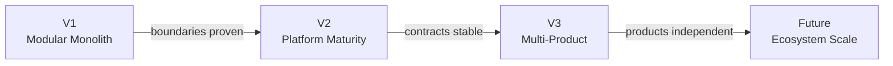
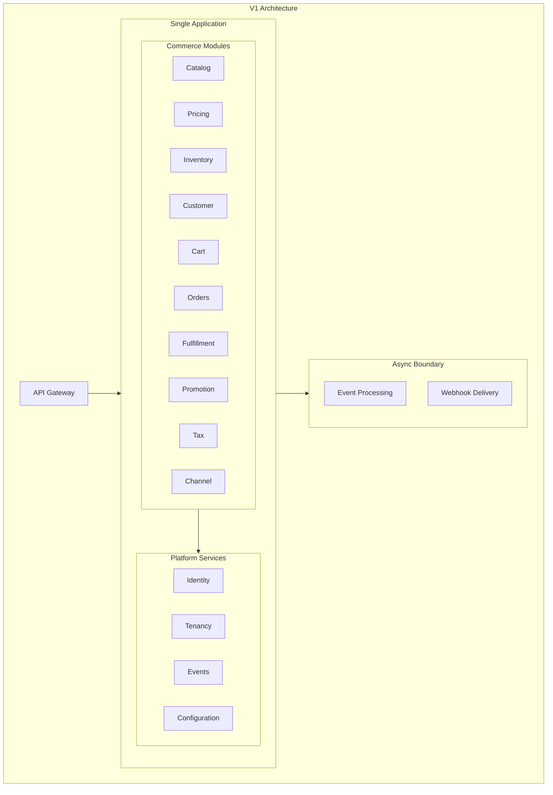
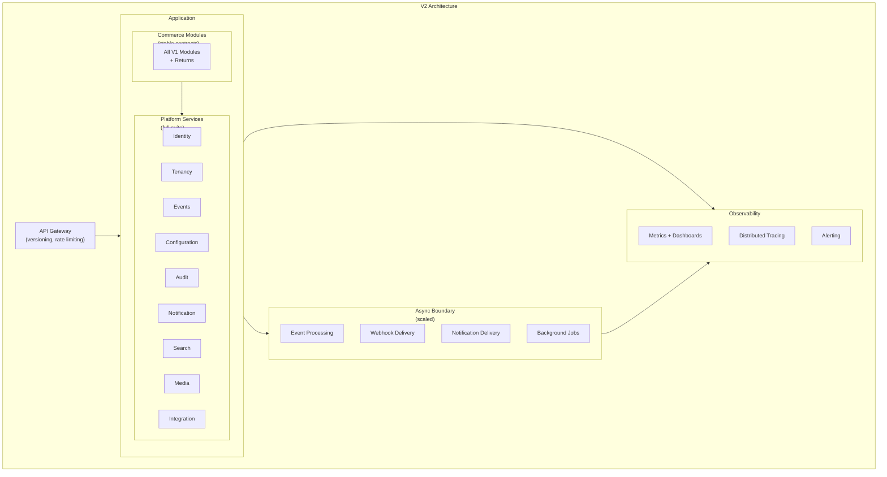
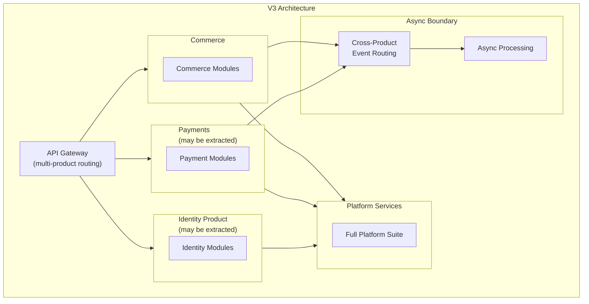
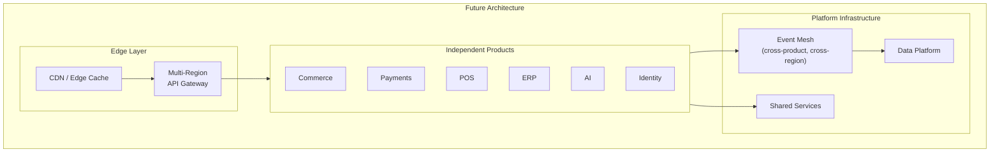

# Architecture Roadmap

## Metadata

| Field | Value |
|-------|-------|
| Title | Kairo Architecture Roadmap |
| Document ID | KAI-ARCH-008 |
| Status | Draft |
| Version | 0.1 |
| Target Release | N/A |
| Owner | Chief Software Architect |
| Created | 2026-07-15 |
| Last Updated | 2026-07-15 |
| Reviewers | TODO |
| Related Documents | [Architecture Overview](./Architecture-Overview.md), [System Architecture](./System-Architecture.md), [Monolith Strategy](./Monolith-Strategy.md), [Module Architecture](./Module-Architecture.md), [Technology Stack](./Technology-Stack.md), [Capability Roadmap](../03-Business-Capabilities/Capability-Roadmap.md) |
| Dependencies | None |

---

## Purpose

This document maps the evolution of Kairo's architecture across platform versions. Architecture evolves deliberately — each version builds on the proven foundation of the previous version. No version implements patterns that have not been validated by real requirements.

This is a directional plan. It describes the architectural milestones that each version targets. It does not prescribe implementation timelines or dictate feature scope. The architecture evolves to support business capabilities, not the reverse.

---

## Evolution Principles

- **Architecture follows need.** Architectural complexity is added when business requirements demand it, not in anticipation.
- **Each version proves the previous version's foundation.** V2 validates that V1's boundaries are correct before adding new capabilities.
- **No version breaks the previous version.** Architectural evolution is additive. V2 extends V1. It does not replace it.
- **Simplicity is the default.** The simplest architecture that serves the current version's requirements is the correct architecture.
- **Version gates are mandatory.** A version's architectural milestones must be met before the next version's architectural work begins.

---

## Architecture Evolution Overview

---

## V1 — Modular Monolith

### Architecture Goal

Establish a modular monolith with strict internal boundaries, a platform service layer, and a complete commerce request flow.

### Architecture State

### Architectural Milestones

| Milestone | Description |
|-----------|-------------|
| Module boundaries enforced | Every Commerce module has defined boundaries. No cross-module data access. |
| Public contracts defined | Every module exposes contracts. Inter-module communication uses interfaces. |
| Platform services operational | Identity, multi-tenancy, events, and configuration are functional. |
| API gateway in place | Single entry point for all external requests. Authentication enforced at the boundary. |
| Async boundary separated | Event processing and webhook delivery operate independently from request handling. |
| Structured observability | Structured logging, request correlation, and basic health checks across all modules. |
| Dependency graph acyclic | No circular dependencies between modules. Dependency direction is documented and enforced. |

### What V1 Does NOT Include

- No multi-product architecture. Only Commerce exists.
- No service extraction. All modules run in one process.
- No advanced caching strategy. Basic caching for critical paths only.
- No geographic distribution. Single-region deployment.
- No cross-product event routing. Events flow within Commerce only.

### Version Gate

V1 is complete when:

- [ ] All Commerce modules follow the module architecture standard.
- [ ] Public contracts are defined and consumed for every inter-module relationship.
- [ ] Platform services (Identity, Tenancy, Events, Configuration) are operational.
- [ ] API gateway authenticates and routes all external requests.
- [ ] Event processing operates in a separate async boundary.
- [ ] Structured logging and health checks cover all modules.
- [ ] Integration tests validate cross-module contract compliance.
- [ ] A complete purchase flow (browse → cart → checkout → order → fulfillment) works end to end.

---

## V2 — Platform Maturity

### Architecture Goal

Mature the platform service layer, stabilize module contracts, and introduce the full observability and operational infrastructure needed for production reliability.

### Architecture State

### Architectural Milestones

| Milestone | Description |
|-----------|-------------|
| Full platform service suite | Audit, notification, search, media, and integration services are operational. |
| Contract versioning proven | Module contracts support backward-compatible evolution. Deprecation process is tested. |
| API versioning operational | Gateway supports concurrent API versions. Version negotiation works. |
| Full observability stack | Metrics, distributed tracing, and alerting cover all modules and async processing. |
| Caching strategy systematic | Caching is applied consistently across modules with documented invalidation patterns. |
| Background job infrastructure | Job scheduling, retry, and dead-letter handling are operational. |
| Feature flags operational | Per-tenant feature flag evaluation supports controlled rollout. |
| Performance baselines established | Core operations have measured performance baselines and automated regression detection. |

### What V2 Does NOT Include

- No product-level deployment separation. Commerce and platform still deploy together.
- No multi-product event routing. Only Commerce publishes and consumes events.
- No service extraction. Modules remain in the monolith.
- No geographic distribution.

### Version Gate

V2 is complete when:

- [ ] All platform services (audit, notification, search, media, integration) are operational and consumed by Commerce modules.
- [ ] Module contracts have been stable through at least one release cycle without breaking changes.
- [ ] API versioning supports at least two concurrent versions.
- [ ] Distributed tracing covers the full request lifecycle from gateway through modules to event processing.
- [ ] Performance baselines exist for all critical operations.
- [ ] Background job infrastructure handles all async processing with retry and monitoring.
- [ ] Feature flags support per-tenant rollout for at least one capability.
- [ ] Caching reduces database load measurably for read-heavy operations.

---

## V3 — Multi-Product Architecture

### Architecture Goal

Extend the architecture to support multiple independent products on the shared platform. Validate cross-product communication. Evaluate selective service extraction.

### Architecture State

### Architectural Milestones

| Milestone | Description |
|-----------|-------------|
| Multi-product gateway routing | API gateway routes to multiple products based on URL path. |
| Cross-product event routing | Events published by Commerce are consumable by Payments and vice versa through the platform event bus. |
| Product deployment independence evaluated | At least one product (Payments or Identity) can be deployed independently if its extraction criteria are met. |
| Service extraction validated | If a module is extracted, the extraction process is proven and documented. |
| Contract compatibility across products | Products consume each other's contracts through the same patterns used within the monolith. |
| Platform services serve multiple products | Platform services (Identity, Events, Config) are proven under multi-product load. |
| Advanced authorization | Permission model supports cross-product authorization (a user with Commerce permissions and Payments permissions). |

### What V3 Does NOT Include

- No mandatory service extraction. Extraction happens only where justified.
- No geographic distribution. Multi-region is evaluated but not required.
- No service mesh. Inter-product communication uses direct API calls or events.

### Version Gate

V3 is complete when:

- [ ] At least two products are operational on the shared platform.
- [ ] Cross-product events are published and consumed reliably.
- [ ] API gateway routes to multiple products without modification to existing product routes.
- [ ] Platform services handle multi-product load without degradation.
- [ ] If a service was extracted, the extraction process is documented and repeatable.
- [ ] Cross-product authorization works correctly (user with permissions in multiple products).
- [ ] Independent deployment of at least one product is proven (or a documented decision explains why it is not yet needed).

---

## Future — Ecosystem Scale

### Architecture Goal

Support a full ecosystem of independently operated products with geographic distribution, enterprise-grade reliability, and infrastructure-level platform maturity.

### Architecture State

### Architectural Milestones

| Milestone | Description |
|-----------|-------------|
| Geographic distribution | Multi-region deployment with latency-optimized routing. |
| Event mesh | Cross-product, cross-region event routing with guaranteed delivery. |
| Platform-grade shared services | Identity, Events, and Configuration operate at infrastructure maturity with formal SLAs. |
| Data platform | Cross-product data aggregation for reporting and intelligence without violating module data ownership. |
| Independent product operations | Each product has its own deployment pipeline, scaling, and operational monitoring. |
| Enterprise reliability | Formal SLAs, disaster recovery testing, and compliance certifications. |

### Version Gate

Future milestones are complete when:

- [ ] Multiple products operate independently in production with separate deployment pipelines.
- [ ] Multi-region deployment serves requests from geographically distributed endpoints.
- [ ] Event delivery works reliably across product and region boundaries.
- [ ] Platform services meet formal SLA targets consistently.
- [ ] Disaster recovery is tested and documented.
- [ ] The architecture supports adding new products without modifying existing products or platform infrastructure.

---

## Evolution Without Forcing Implementation

The architecture roadmap describes structural milestones, not feature deliverables. This distinction is critical:

| Architecture says | Architecture does NOT say |
|-------------------|--------------------------|
| V1 requires module boundaries | V1 must implement specific modules by a date |
| V2 requires stable contracts | V2 must ship specific API endpoints |
| V3 requires cross-product events | V3 must launch Payments by a date |
| Future requires multi-region | Future must deploy to specific regions |

Architecture defines the structural prerequisites for each version. Product roadmaps decide what is built within those structures. The architecture does not drive feature decisions — it enables them.

### How This Works in Practice

1. The product team decides to add a new capability (e.g., subscription management).
2. The architecture roadmap determines which version's structural foundation is required (subscriptions require stable contracts and event routing — V2 minimum).
3. If the current architecture version supports the capability, implementation proceeds.
4. If the current architecture version does not support the capability, the architectural prerequisite is addressed first.

Architecture evolves ahead of or alongside capabilities, never behind them. A capability is not built on a foundation that does not exist yet.

---

## Architectural Risk by Version

| Version | Primary Architectural Risk | Mitigation |
|---------|---------------------------|-----------|
| V1 | Module boundaries are wrong | Monolith allows inexpensive boundary adjustment. Validate boundaries through real usage. |
| V2 | Contract stability is premature | Only stabilize contracts that have been consumed in production. Allow internal contracts to evolve. |
| V3 | Extraction complexity is underestimated | Extract only when concrete criteria are met. Start with the simplest extraction candidate. |
| Future | Distributed system complexity overwhelms operations | Add distribution incrementally. Maintain the option to keep products co-deployed. |

---

## Change History

| Version | Date | Author | Description |
|---------|------|--------|-------------|
| 0.1 | 2026-07-15 | Chief Software Architect | Initial draft |
