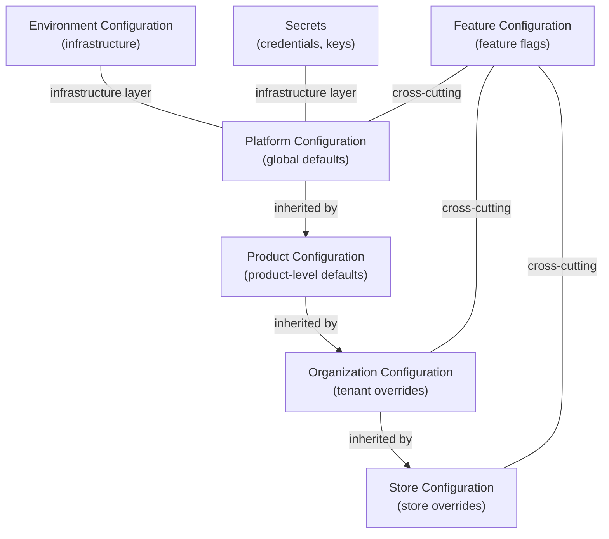
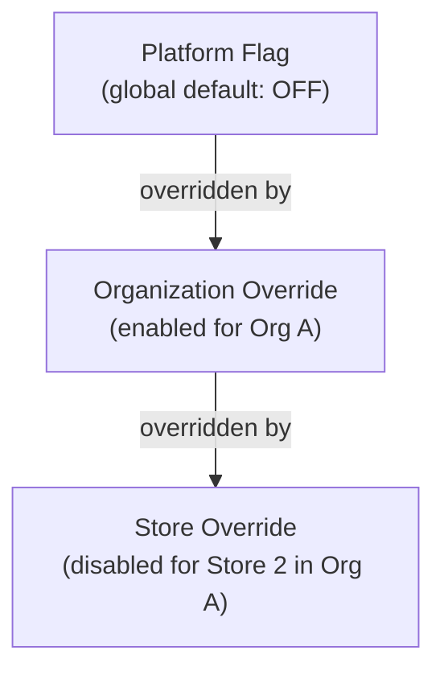
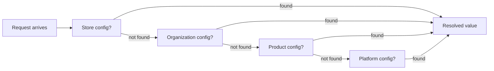

# Configuration Architecture

## Metadata

| Field | Value |
|-------|-------|
| Title | Kairo Configuration Architecture |
| Document ID | KAI-CORE-006 |
| Status | Draft |
| Version | 0.1 |
| Target Release | N/A |
| Owner | Chief Platform Architect |
| Created | 2026-07-18 |
| Last Updated | 2026-07-18 |
| Reviewers | TODO |
| Related Documents | [Platform Services](../05-Platform-Core/Platform-Services.md), [Platform Hierarchy](../05-Platform-Core/Platform-Hierarchy.md), [Organization Model](../05-Platform-Core/Organization-Model.md), [Store Model](../05-Platform-Core/Store-Model.md), [Cross-Cutting Concerns](./Cross-Cutting-Concerns.md) |
| Dependencies | None |

---

## Purpose

This document defines how configuration works across the Kairo platform — what types of configuration exist, how they are organized, how they inherit and override, and what rules govern their use.

Configuration determines how the platform behaves without changing code. It spans from global platform defaults down through organizations, stores, and individual features. A well-designed configuration architecture enables flexibility without creating chaos.

---

## Configuration Philosophy

- **Convention over configuration.** Sensible defaults reduce what must be configured. Most tenants should operate without touching most settings.
- **Hierarchical resolution.** Configuration is resolved from the most specific level that defines it, falling back to broader defaults.
- **No surprises.** A configuration change at one level never silently overrides an explicit setting at a more specific level.
- **Safe by default.** Default values are the secure, correct choice. Configuration allows customization, not activation of safety.
- **Auditable.** Every configuration change is recorded. Who changed what, when, and from what previous value.

---

## Configuration Layers

---

## Global Configuration

Platform-wide defaults that apply to every organization, store, and product unless overridden at a lower level.

### What It Contains

| Category | Examples |
|----------|---------|
| Security minimums | Minimum password length, MFA availability, session timeout ceiling |
| API behavior | Default pagination size, maximum page size, rate limit defaults |
| Data conventions | Default timestamp format, default currency display, identifier format |
| Platform limits | Maximum stores per organization, maximum API keys per organization, maximum webhook registrations |
| Operational defaults | Default log level, default health check interval, default retry policy |

### Rules

- Global configuration is managed by the platform team.
- Tenants cannot see or modify global configuration directly.
- Global values serve as fallbacks. They are used only when no more specific value is defined.
- Security minimums in global configuration cannot be relaxed at any lower level. They can only be made stricter.

---

## Organization Configuration

Tenant-level settings that customize platform behavior for a specific business.

### What It Contains

| Category | Examples |
|----------|---------|
| Business identity | Organization name, legal entity, contact details |
| Regional settings | Default timezone, default locale, default currency |
| Security policies | Password policy (at least as strict as global), MFA enforcement, session duration, IP allowlists |
| Operational settings | Notification preferences, default webhook headers, API key naming conventions |
| Feature enablement | Which platform features are available to this organization (controlled by subscription or feature flags) |
| Integration defaults | Default payment provider, default shipping carrier for new stores |

### Rules

- Organization configuration is managed by organization administrators.
- Organization settings override platform defaults within the organization's boundary.
- Organization security policies can only be stricter than global minimums, never more permissive.
- Organization configuration applies to all stores within the organization unless overridden at the store level.

---

## Store Configuration

Settings that customize behavior for a specific commercial operation within an organization.

### What It Contains

| Category | Examples |
|----------|---------|
| Commerce settings | Default currency for this store, catalog display rules, checkout flow configuration |
| Tax | Tax zones, tax rates, tax-inclusive/exclusive pricing mode |
| Shipping | Available shipping methods, default fulfillment location, rate calculation rules |
| Pricing | Default price list, price display format, price rounding rules |
| Notification | Store-specific email sender address, order confirmation template selection |
| Localization | Store-specific locale, date format, measurement units |

### Rules

- Store configuration is managed by users with store-level administrative permissions.
- Store settings override organization defaults within the store's boundary.
- Store configuration cannot override organization-level security policies.
- Each store is configured independently. A change in one store does not affect another.

---

## Feature Configuration

Runtime flags that control feature availability across the platform, per organization, or per store.

### What It Contains

| Category | Examples |
|----------|---------|
| Platform features | New platform capabilities being rolled out gradually |
| Product features | Product-specific capabilities under development or limited release |
| Tenant features | Features enabled for specific organizations based on subscription or agreement |
| Operational flags | Kill switches for emergency feature disablement |

### Resolution

Feature flags are resolved at the most specific level:

### Rules

- Feature flags are temporary. Each flag has a defined purpose and planned removal date.
- Flags are evaluated at request time from the resolved configuration, not from code constants.
- Flag evaluation is fast. Values are cached and refreshed periodically, not queried on every request.
- Flag state changes are audited.
- A flag at a lower level can only restrict availability, not grant it beyond what higher levels allow. If the platform disables a feature globally, no organization can enable it.

---

## Environment Configuration

Infrastructure settings that vary between deployment environments (development, staging, production). These are not business configuration — they are operational parameters.

### What It Contains

| Category | Examples |
|----------|---------|
| Connection strings | Database endpoints, cache endpoints, message broker endpoints |
| Service endpoints | External service URLs, API gateway address |
| Operational parameters | Log verbosity, debug mode enablement, tracing sample rate |
| Scaling parameters | Worker thread counts, queue concurrency limits, batch sizes |
| Environment identity | Environment name, deployment version, region identifier |

### Rules

- Environment configuration is managed by the operations team, not by application code.
- Environment values are injected at deployment time, not compiled into the application.
- Environment configuration is never tenant-specific. It applies equally to all tenants within the deployment.
- Environment configuration is not accessible through business APIs. It is invisible to tenants.
- Code never contains environment-specific values. No hardcoded URLs, no embedded connection strings.

---

## Secrets

Sensitive credentials that must be protected from unauthorized access, logging, and accidental exposure.

### What It Contains

| Category | Examples |
|----------|---------|
| Infrastructure credentials | Database passwords, cache authentication, message broker credentials |
| External service credentials | Payment provider API keys, shipping carrier credentials, tax service tokens |
| Encryption keys | Data encryption keys, token signing keys |
| Internal service credentials | Service-to-service authentication tokens |

### Rules

- Secrets are stored in a dedicated secret management system, never in configuration files, environment variables at rest, or source code.
- Secrets are accessed at runtime through the platform's secret interface. Modules do not read secrets from files.
- Secrets are never logged. The logging infrastructure strips or masks any value identified as a secret.
- Secrets are scoped. Organization-level secrets (integration credentials) are accessible only within that organization's context.
- Secret rotation is supported without redeployment. The secret management system handles rotation; consuming services refresh periodically.
- Access to secrets is audited. Every secret retrieval is recorded.

### Secret Ownership

| Secret Type | Owner | Scope |
|-------------|-------|-------|
| Infrastructure credentials | Platform operations | Environment-wide |
| Encryption keys | Platform | Environment-wide |
| Integration credentials | Organization | Organization-scoped |
| Service-to-service credentials | Platform | Environment-wide |

---

## Configuration Inheritance

Configuration resolves from the most specific level that defines a value, falling back through the hierarchy until a value is found.

### Resolution Order

### Inheritance Rules

- **Most specific wins.** A value defined at the store level takes precedence over the same value at the organization level.
- **Absence means inherit.** If a store does not define a value, it inherits from the organization. If the organization does not define it, it inherits from the product default, then the platform default.
- **Security only tightens.** Security-related settings (password length, session timeout, MFA requirements) can only become stricter at lower levels. An organization cannot relax a platform minimum. A store cannot relax an organization policy.
- **No implicit override.** Setting a value at a lower level is an explicit action. Configuration does not silently override values that were intentionally set higher in the hierarchy.
- **Deletion restores inheritance.** Removing a store-level override causes the store to inherit the organization-level value again.

### Inheritance Examples

| Setting | Platform | Organization | Store | Resolved for Store |
|---------|----------|-------------|-------|-------------------|
| Currency | USD | EUR | — (not set) | EUR (from organization) |
| Session timeout | 30 min | 15 min | 10 min | 10 min (from store) |
| Min password length | 8 | 12 | — (not set) | 12 (from organization) |
| Pagination default | 25 | — (not set) | 50 | 50 (from store) |
| MFA required | false | true | — (not set) | true (from organization) |

---

## Configuration Overrides

### Override Capabilities by Level

| Setting Type | Organization Can Override | Store Can Override |
|-------------|--------------------------|-------------------|
| Business identity | Yes | Yes (store-level identity) |
| Regional settings | Yes | Yes |
| Security policies | Tighten only | Cannot override organization security |
| Commerce settings | N/A | Yes |
| Tax configuration | N/A | Yes |
| Shipping configuration | N/A | Yes |
| Feature flags | Limited (tenant enablement) | Limited (store disablement) |
| API behavior | No | No |
| Platform limits | No | No |

### Override Rules

- **Platform-managed settings** (API behavior, platform limits) cannot be overridden by tenants. They are controlled exclusively by the platform team.
- **Security settings** flow downward with a tightening-only rule. Each level can make security stricter but never more permissive.
- **Business settings** (currency, locale, commerce rules) are freely overridable at each level within the hierarchy.
- **Feature flags** follow a restrictive model: the platform can enable a feature globally; an organization can have it enabled or disabled; a store can disable a feature for itself but cannot enable one that the organization has disabled.

---

## Architecture Impact

| Concern | Impact |
|---------|--------|
| Request pipeline | Every request resolves configuration based on the authenticated tenant and store context. Resolution results are cached per request. |
| Caching | Resolved configuration is cached at the tenant+store level. Cache invalidation occurs when any level in the hierarchy changes. |
| Performance | Configuration resolution adds per-request overhead. Caching and precomputation minimize this cost. |
| Module design | Modules access configuration through the platform interface. They request a setting key; the platform resolves the hierarchy. |
| Testing | Tests must validate configuration inheritance, including edge cases (missing levels, security tightening, deletion restoring inheritance). |
| Multi-tenancy | Configuration is tenant-scoped. The resolution system must never return one tenant's configuration to another. |

---

## Decision Summary

| Decision | Rationale |
|----------|-----------|
| Hierarchical resolution | Reduces configuration burden. Most tenants need only override a few settings. Defaults handle the rest. |
| Security only tightens | A tenant cannot weaken platform security guarantees. This protects all users and the platform's compliance posture. |
| Secrets are separate from configuration | Secrets have different access patterns, storage requirements, and audit needs. Mixing them with general configuration creates security risk. |
| Environment configuration is invisible to tenants | Infrastructure details are not business concerns. Exposing them creates coupling between tenant expectations and deployment topology. |
| Feature flags are cross-cutting | Flags affect behavior at any level. A dedicated flag system with hierarchy-aware resolution is more maintainable than embedding flags in general configuration. |
| Convention over configuration | Reducing the number of settings a tenant must touch decreases onboarding friction and support burden. |

---

## Version Gate

| Version | Configuration Expectation |
|---------|--------------------------|
| V1 | Platform → Organization → Store hierarchy is operational. Environment configuration is externalized. Secrets are managed through a dedicated interface. Core settings (currency, locale, timezone) resolve correctly through the hierarchy. |
| V2 | Feature flags with tenant-scoped resolution are operational. Configuration change auditing is in place. Runtime configuration refresh works without redeployment. Security tightening rules are enforced. |
| V3 | Configuration supports multi-product resolution (product-level defaults). Configuration change history with rollback is available. Configuration validation prevents invalid combinations. |

---

## Out of Scope

This document does not define:

- Specific configuration keys or their default values — documented in module specifications.
- Configuration API endpoints — documented in API specifications.
- Secret management tooling selection — documented in infrastructure decisions.
- Configuration UI design — the platform is API-first; admin UIs are built by developers.

---

## Future Considerations

- **Configuration schemas** — Typed configuration with validation rules that prevent invalid values at write time rather than discovering errors at read time.
- **Configuration environments** — Promote configuration changes from staging to production with diff and approval.
- **Configuration templates** — Pre-built configuration sets for common business types (B2C retail, B2B wholesale).
- **Configuration API for tenants** — Allow tenants to manage their configuration programmatically through the API.
- **Cross-store configuration** — Settings that apply to a group of stores without requiring individual configuration.

---

## Change History

| Version | Date | Author | Description |
|---------|------|--------|-------------|
| 0.1 | 2026-07-18 | Chief Platform Architect | Initial draft |
