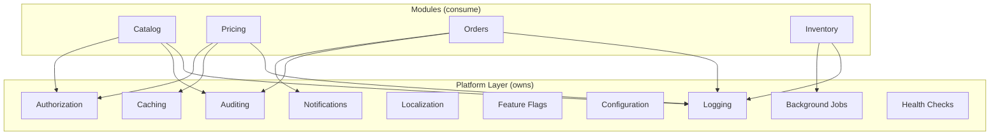
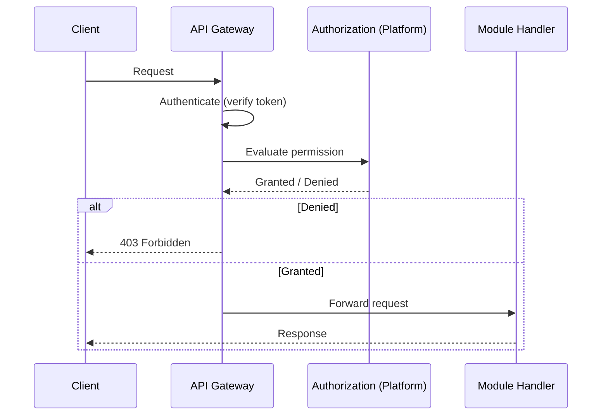
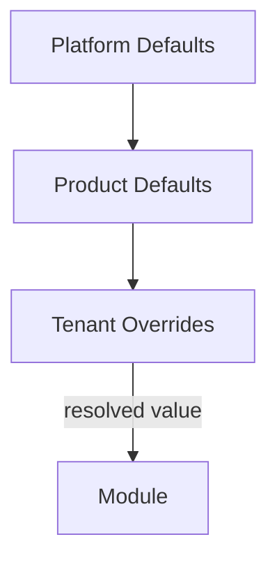
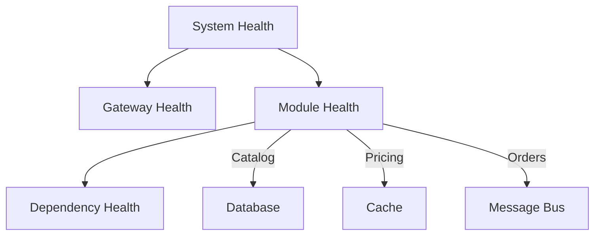

# Cross-Cutting Concerns

## Metadata

| Field | Value |
|-------|-------|
| Title | Kairo Cross-Cutting Concerns |
| Document ID | KAI-ARCH-007 |
| Status | Draft |
| Version | 0.1 |
| Target Release | N/A |
| Owner | Chief Software Architect |
| Created | 2026-07-15 |
| Last Updated | 2026-07-15 |
| Reviewers | TODO |
| Related Documents | [Architecture Overview](./Architecture-Overview.md), [Module Architecture](./Module-Architecture.md), [Architecture Principles](./Architecture-Principles.md), [Shared Capabilities](../03-Business-Capabilities/Shared-Capabilities.md) |
| Dependencies | None |

---

## Purpose

Cross-cutting concerns are behaviors that apply uniformly across all modules and products. They are not business logic — they are infrastructure capabilities that every module needs but no module should implement independently.

This document defines each cross-cutting concern, establishes ownership, and specifies how modules consume these capabilities. The goal is consistency: every module logs the same way, authorizes the same way, and caches the same way.

---

## Ownership Principle

Cross-cutting concerns are owned by the platform layer. Individual modules consume them through defined interfaces. Modules do not implement, extend, or override cross-cutting behavior unless explicitly supported by the platform's extension points.

---

## Logging

### What It Provides

Structured, contextual log emission from every layer of the system — gateway, modules, platform services, and background processing.

### Ownership

Platform layer. The logging infrastructure, format, and pipeline are owned centrally. Modules emit logs through the platform's logging interface.

### How Modules Consume It

- Modules use the platform-provided logger. They do not create their own logging infrastructure.
- Every log entry automatically includes request ID, tenant ID, module name, and timestamp.
- Modules add domain-specific context (order ID, product ID) to log entries.
- Log levels (Debug, Information, Warning, Error, Critical) follow platform-defined conventions for when each level is appropriate.

### Rules

- All logs are structured. Unstructured string messages are not permitted.
- Sensitive data (credentials, payment information, personal identifiers) must never appear in logs.
- Log volume is managed. Hot paths log at Debug level. Business events log at Information level. Errors log at Error level.
- Log format is consistent across all modules. No module defines its own log structure.

---

## Auditing

### What It Provides

Tamper-evident recording of significant business actions for accountability, compliance, and forensic analysis.

### Ownership

Platform layer. The audit infrastructure, storage, retention, and query capabilities are owned centrally.

### How Modules Consume It

- Modules emit audit entries through the platform's audit interface for significant state changes (create, update, delete operations on business entities).
- Each audit entry includes: actor (who), action (what), resource (on what), timestamp (when), tenant (within which context), and outcome (result).
- Modules define which operations are auditable based on their business domain.

### Rules

- Audit entries are immutable. Once written, they cannot be modified or deleted by application logic.
- Audit is not logging. Logs are operational. Audit is compliance. Not every log entry is an audit entry.
- Audit entries are written synchronously or with guaranteed delivery. Loss of audit data is not acceptable.
- Audit does not influence business logic. It observes and records.

### Audit vs. Logging

| Concern | Logging | Auditing |
|---------|---------|----------|
| Purpose | Operational troubleshooting | Compliance and accountability |
| Audience | Engineers | Auditors, compliance officers, administrators |
| Retention | Days to weeks | Months to years |
| Completeness | Best effort | Guaranteed for defined operations |
| Mutability | May be rotated or purged | Immutable |

---

## Caching

### What It Provides

Distributed cache infrastructure for reducing data access latency and database load.

### Ownership

Platform layer. The caching infrastructure (Redis) and access patterns are owned centrally. Cache invalidation strategies are coordinated at the platform level.

### How Modules Consume It

- Modules use the platform's cache interface to store and retrieve frequently accessed data.
- Cache keys follow the platform naming convention: `{tenant}:{module}:{entity}:{id}`.
- Modules define their own cache durations based on data volatility.
- Modules are responsible for cache invalidation when their data changes.

### Rules

- The system must function correctly with an empty cache. Caching improves performance; it does not provide correctness.
- Cache entries include tenant scoping. A tenant must never receive cached data from another tenant.
- Cache stampede protection is handled at the platform level.
- Modules do not implement their own caching infrastructure. In-memory caches for request-scoped data are permitted; persistent or shared caches use the platform.

---

## Authorization

### What It Provides

Permission evaluation that determines whether an authenticated user is allowed to perform a specific action on a specific resource.

### Ownership

Platform layer (Identity). The authorization framework, permission evaluation engine, and role management are owned by the platform. Modules define their own permissions and resources.

### How Modules Consume It

- Modules declare the permissions they require (e.g., `catalog:products:read`, `orders:orders:create`).
- The platform evaluates permissions before the module's business logic executes.
- Modules do not implement their own authorization checks. Authorization is enforced by the request pipeline.
- Resource-level authorization (can this user access this specific order?) is evaluated by the module using platform-provided utilities.

### Rules

- Authorization is deny-by-default. An action is forbidden unless a permission explicitly grants it.
- Authorization is enforced at the pipeline level. A module cannot be reached by an unauthorized request.
- Permission definitions are documented in each module's specification.
- Authorization logic does not leak into business logic. Business rules and access control are separate concerns.

---

## Localization

### What It Provides

Support for locale-aware content, formatting, and messages across the platform.

### Ownership

Platform layer. The localization framework and locale resolution are owned centrally. Modules provide their own localizable content.

### How Modules Consume It

- Modules use the platform's localization interface for user-facing messages, error descriptions, and notification content.
- Locale is resolved from the request context (Accept-Language header or tenant configuration).
- Modules provide locale-specific content (e.g., product names, descriptions) through their own data model. The platform does not translate business data.
- System messages (error messages, validation messages) follow platform-managed locale resources.

### Rules

- API responses use the locale from the request context. Internal processing uses invariant culture.
- Monetary formatting, date formatting, and number formatting use the platform's locale-aware formatters.
- Locale-specific business data (product names in multiple languages) is the module's responsibility. The platform provides the framework, not the translations.
- English is the default locale. All system messages exist in English at minimum.

---

## Feature Flags

### What It Provides

Runtime control over feature availability without redeployment.

### Ownership

Platform layer (Configuration). Feature flag infrastructure, evaluation, and management are owned centrally.

### How Modules Consume It

- Modules check feature flags through the platform's feature flag interface before executing flag-gated logic.
- Feature flags are scoped by tenant, allowing per-tenant feature rollout.
- Modules define their own flags. The platform provides the evaluation and management infrastructure.

### Rules

- Feature flags are temporary. Each flag has a documented purpose and a planned removal date.
- Feature flags do not replace configuration. Flags control rollout. Configuration controls behavior.
- Flag evaluation is fast. Feature flags are resolved from cache, not from database queries on every request.
- Stale flags are technical debt. Flags that have been fully rolled out must be removed and their code paths simplified.

---

## Configuration

### What It Provides

Hierarchical, tenant-aware configuration management for platform settings, product settings, and module settings.

### Ownership

Platform layer. The configuration infrastructure, inheritance model, and management interface are owned centrally.

### How Modules Consume It

- Modules define their configurable settings and register them with the platform.
- Configuration follows an inheritance hierarchy: platform defaults → product defaults → tenant overrides.
- Modules access configuration through the platform's configuration interface. They do not read configuration files or environment variables directly.

### Rules

- Configuration is not code. Behavior changes that require redeployment are not configuration — they are feature development.
- Sensitive configuration (secrets, credentials) uses the platform's secret management, not plain configuration.
- Configuration changes take effect without redeployment. The platform supports runtime configuration refresh.
- All configuration keys are documented in the owning module's specification.

### Configuration Hierarchy

A tenant override takes precedence over a product default, which takes precedence over a platform default. If no override exists, the default applies.

---

## Notifications

### What It Provides

Multi-channel message delivery (email, webhook) triggered by platform events.

### Ownership

Platform layer. Delivery infrastructure, template management, retry logic, and preference management are owned centrally.

### How Modules Consume It

- Modules publish domain events through the event bus. The notification system subscribes to relevant events and delivers messages.
- Modules do not send notifications directly. They emit events. The notification system decides how to deliver based on event type, recipient preferences, and configured channels.
- Notification templates reference data from events. Modules ensure their events contain sufficient data for notification rendering.

### Rules

- Modules never call email services, SMS services, or webhook endpoints directly.
- Notification delivery is asynchronous. It does not block the business operation that triggered it.
- Delivery failures are retried by the notification system. Modules do not implement retry logic.
- Notification preferences are managed per user and per tenant through the platform.

---

## Background Jobs

### What It Provides

Infrastructure for executing asynchronous, scheduled, or long-running tasks outside the request-response cycle.

### Ownership

Platform layer. Job scheduling, execution, retry, monitoring, and dead-letter handling are owned centrally.

### How Modules Consume It

- Modules register background jobs with the platform's job infrastructure.
- Jobs are triggered by events, schedules, or explicit enqueue requests.
- Modules implement job handlers. The platform manages execution, retry, and monitoring.

### Rules

- Background jobs are idempotent. A job that executes twice must produce the same result as executing once.
- Jobs have defined timeouts. Long-running jobs must checkpoint progress and support resumption.
- Failed jobs are retried with backoff. After maximum retries, they are moved to a dead-letter queue for investigation.
- Job execution is tenant-scoped. A job processes data for one tenant at a time.
- Jobs do not bypass authorization. A job executes with a defined identity and permissions.

---

## Health Checks

### What It Provides

Runtime health assessment of the platform, its services, and its dependencies.

### Ownership

Platform layer. Health check infrastructure, endpoint exposure, and aggregation are owned centrally. Modules contribute their own health status.

### How Modules Consume It

- Modules register health checks that verify their ability to serve requests (database connectivity, external service availability, required configuration present).
- The platform aggregates module health into a system-level health status.
- Health endpoints are exposed for load balancers, orchestrators, and monitoring systems.

### Rules

- Health checks are fast. They verify connectivity, not correctness. A health check should complete in milliseconds.
- Health checks distinguish between liveness (is the process running?) and readiness (can it serve traffic?).
- A module that fails its readiness check is removed from the load balancer. A module that fails its liveness check is restarted.
- Health checks do not expose sensitive information. They return status indicators, not internal details.

### Health Check Hierarchy

---

## Architecture Impact

| Concern | Impact on Architecture |
|---------|----------------------|
| Logging | Requires structured logging infrastructure in the platform layer. All modules depend on a consistent logging interface. |
| Auditing | Requires guaranteed-delivery audit pipeline. Adds write overhead to auditable operations. |
| Caching | Requires distributed cache infrastructure (Redis). Adds cache management responsibility to modules. |
| Authorization | Requires permission framework in the request pipeline. Modules declare permissions; the platform enforces them. |
| Localization | Requires locale resolution in the request pipeline. Modules manage their own locale-specific business data. |
| Feature Flags | Requires flag evaluation infrastructure with tenant-scoped resolution. Adds temporary complexity that must be cleaned up. |
| Configuration | Requires hierarchical configuration store with runtime refresh. Modules depend on configuration interface for all settings. |
| Notifications | Requires event-driven notification pipeline. Decouples modules from delivery channels. |
| Background Jobs | Requires job scheduling and execution infrastructure. Adds resilience patterns (retry, dead-letter) to async processing. |
| Health Checks | Requires health aggregation endpoint. Modules contribute their status. Integrates with orchestration and load balancing. |

---

## Version Gate

| Version | Cross-Cutting Expectations |
|---------|--------------------------|
| V1 | Logging, authorization, configuration, and health checks are operational. Auditing covers core operations. Caching is available for performance-critical paths. Background jobs handle event processing. |
| V2 | Notification delivery is reliable. Feature flags support per-tenant rollout. Localization framework is available. Audit retention policies are enforced. Caching is systematic across all modules. |
| V3 | All cross-cutting concerns are mature and proven across multiple products. Feature flag lifecycle management is enforced. Audit supports compliance reporting. Health checks distinguish liveness and readiness across product boundaries. |

---

## Change History

| Version | Date | Author | Description |
|---------|------|--------|-------------|
| 0.1 | 2026-07-15 | Chief Software Architect | Initial draft |
