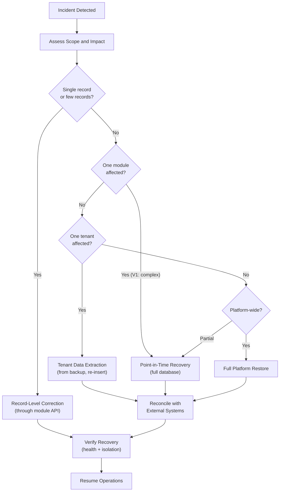

# Backup, Restore, and Disaster Recovery

## Metadata

| Field | Value |
|-------|-------|
| Title | Kairo Backup, Restore, and Disaster Recovery Architecture |
| Document ID | KAI-DATA-010 |
| Status | Draft |
| Version | 0.1 |
| Target Release | V1 |
| Owner | Data Resilience and Disaster Recovery Architect |
| Created | 2026-07-20 |
| Last Updated | 2026-07-20 |
| Reviewers | TODO |
| Related Documents | [Data Architecture](./Data-Architecture.md), [Data Lifecycle and Retention](./Data-Lifecycle-and-Retention.md), [Quality Attributes](../Quality-Attributes.md), [Incident Response](../Security/Incident-Response.md), [Tenant Isolation](../Multi-Tenancy/Tenant-Isolation.md), [Tenant Lifecycle](../Multi-Tenancy/Tenant-Lifecycle.md), [Data Protection](../Security/Data-Protection.md) |
| Dependencies | [Data Architecture](./Data-Architecture.md), [Quality Attributes](../Quality-Attributes.md) |

---

## Purpose

This document defines how the Kairo platform protects against data loss through backup, enables recovery from failures through restoration, and prepares for catastrophic events through disaster recovery planning.

**A backup is not proven until restoration is tested.** Backup without tested restoration is hope, not resilience. This document treats backup creation as only half the requirement — tested, verified restoration is the other half.

---

## Scope

This document covers:

- Backup and recovery objectives and philosophy.
- Backup scope for all data categories.
- Restoration scenarios (platform, module, tenant, record level).
- Failure scenarios and recovery strategies.
- Tenant safety during restoration.
- External system reconciliation.
- Recovery testing requirements.
- V1 practical capabilities and future maturity.

This document does not cover:

- Cloud-provider-specific backup commands or scripts.
- Infrastructure provisioning for backup storage.
- Specific RPO/RTO numeric values (determined by business/SLA decisions).
- High-availability infrastructure (related but distinct — covered in future Infrastructure Architecture).

---

## Backup Objectives

| Objective | Description |
|-----------|-------------|
| **Data durability** | Business data survives infrastructure failure, corruption, or accidental deletion |
| **Recovery capability** | The platform can be restored to a known-good state within defined objectives |
| **Compliance support** | Backup and restoration meet retention and recovery requirements |
| **Tenant safety** | Backup and restoration never expose one tenant's data to another |
| **Operational confidence** | The team has verified confidence that recovery works because it is tested |

---

## Recovery Objectives

### 3. Recovery Point Objective (RPO) Philosophy

RPO defines the maximum acceptable data loss measured in time. "How much data can we afford to lose?"

| Principle | Description |
|-----------|-------------|
| **Business criticality drives RPO** | Different data categories may have different RPO requirements based on their business impact |
| **RPO is a business decision** | Architecture provides the mechanisms. Business determines the acceptable loss. |
| **Lower RPO = higher cost** | Continuous backup (zero RPO) is more expensive than daily backup. The cost-benefit is a business tradeoff. |
| **V1 direction** | V1 targets practical RPO achievable with PostgreSQL continuous archiving (minutes, not hours). Exact value is a deployment decision. |

### 4. Recovery Time Objective (RTO) Philosophy

RTO defines the maximum acceptable time to restore service. "How long can we be down?"

| Principle | Description |
|-----------|-------------|
| **Recovery objectives must be driven by business criticality** | Critical operations (order processing) have lower RTO than analytical operations |
| **RTO includes restoration + verification** | The clock stops when the system is verified operational, not when restoration command completes |
| **Lower RTO = higher investment** | Instant failover requires standby infrastructure. Longer RTO allows restoration from backup. |
| **V1 direction** | V1 targets practical RTO achievable with single-region restoration. Enterprise multi-region failover is future. |

---

## 5. Backup Scope

| Data Store | Backed Up | Mechanism Direction | Recovery Method |
|-----------|:---------:|--------------------|-----------------| 
| PostgreSQL (transactional data) | Yes | Continuous WAL archiving + periodic base backup | Point-in-time recovery |
| Redis (cache) | Conditional | Optional persistence/snapshot. May be rebuilt instead. | Rebuild from authoritative source |
| Object storage (media/files) | Yes | Object storage-native replication/versioning | Restore from replicated copy |
| RabbitMQ (message state) | Limited | Persistent messages survive broker restart. Full backup optional. | Replay from event log or re-trigger |
| Search indexes | No (rebuildable) | Rebuilt from authoritative database | Rebuild from source data |
| Configuration state | Yes | Included in database backup (configuration stored in DB) | Restored with database |
| Secret store | Yes | Separate, encrypted backup | Restore from encrypted backup |
| Audit data | Yes | Included in database backup (or separate audit store backup) | Restored with database |
| Export files | No (regenerable) | Can be regenerated from source data | Re-export if needed |

---

## Backup by Data Category

### 6. Transactional Database Backups

| Aspect | Direction |
|--------|-----------|
| Mechanism | Continuous WAL archiving (PostgreSQL) for point-in-time recovery + periodic full base backups |
| Frequency | Continuous (WAL) + daily/weekly full (base backup) |
| RPO | Minutes (bounded by WAL archive lag) |
| Scope | Entire database (all tenants, all modules) |
| Encryption | Encrypted at rest in backup storage |
| Retention | Per backup retention policy (days to weeks for operational, longer for compliance) |
| Testing | Regular restoration tests verify backup integrity |

### 7. File and Media Backups

| Aspect | Direction |
|--------|-----------|
| Mechanism | Object storage replication or versioning |
| Frequency | Continuous (object storage handles durability natively) |
| RPO | Near-zero (object storage provides high durability) |
| Scope | All tenant media within the storage service |
| Encryption | Encrypted at rest |
| Retention | Same as the source object lifecycle. Deleted files removed per retention. |
| Testing | Periodic verification that files are retrievable |

### 8. Configuration Backups

| Aspect | Direction |
|--------|-----------|
| Mechanism | Included in transactional database backup (configuration is in the DB) |
| Additional | Infrastructure configuration (deployment settings) backed up through infrastructure-as-code version control |
| RPO | Same as database (minutes) |
| Recovery | Restored with database. Infrastructure config restored from version control. |

### 9. Audit Data Backups

| Aspect | Direction |
|--------|-----------|
| Mechanism | Same as transactional database (if audit is in the same DB) or separate backup if audit has its own store |
| Retention | Longer than operational backups. Audit backup retention aligns with compliance requirements. |
| Integrity | Audit backup preserves immutability. Restored audit data is tamper-evident. |
| RPO | Same as database |

### 10. Search Index Recovery

**Cache and search indexes may usually be rebuilt rather than backed up as authoritative data.**

| Aspect | Direction |
|--------|-----------|
| Backup needed? | No. Search indexes are derived from the authoritative database. |
| Recovery method | Full rebuild from the authoritative database after database restoration |
| RTO impact | Rebuild adds time to overall recovery (index rebuild may take minutes to hours depending on data volume) |
| V1 direction | Accept index rebuild time as part of recovery RTO. Index is empty during rebuild (search is unavailable until rebuild completes). |

### 11. Cache Recovery

| Aspect | Direction |
|--------|-----------|
| Backup needed? | No. Cache is ephemeral and derived. |
| Recovery method | Cache warms naturally as requests populate it after restart. Or explicit warm-up for critical paths. |
| RTO impact | Brief performance degradation while cache warms. Not a blocking recovery concern. |
| Impact | Temporary increased database load during cache warming |

### 12. Event and Queue Recovery

| Aspect | Direction |
|--------|-----------|
| Backup needed? | Limited. Persistent messages survive broker restart. Full queue backup is not standard. |
| Recovery method | Durable messages survive. Transient messages are lost. Event replay from outbox if needed. |
| Reconciliation | Events that were published but not processed are reprocessed from the outbox after recovery. |
| Impact | Some events may be reprocessed (at-least-once). Consumers handle duplicates (inbox pattern). |

---

## Security and Access

### 13. Encryption

| Rule | Description |
|------|-------------|
| Backups encrypted at rest | All backup data is encrypted in storage |
| Encryption keys managed separately | Backup encryption keys are in the secret store, not alongside the backup |
| Encryption does not prevent restoration | Key management ensures keys are available for authorized restoration |

### 14. Access Control

**Backups must be protected from ordinary application credentials.**

| Rule | Description |
|------|-------------|
| Separation from application access | Application credentials cannot access backup storage directly |
| Restricted to operations | Only authorized operations personnel can initiate backup or restore |
| Audit of backup access | All backup access (read, write, restore) is logged |
| No developer access to production backups | Production backup access is restricted to production operations |
| Restoration authorization | Restore operations require explicit authorization (not automatic) |

---

## Backup Lifecycle

### 15. Backup Retention

| Principle | Description |
|-----------|-------------|
| Retention is defined | Backups are not kept indefinitely. Retention period is explicit. |
| Rotation | Old backups are rotated out on schedule |
| Deletion follows Data Lifecycle | Tenant data in backups is removed as backups rotate past the retention window |
| Compliance alignment | Backup retention satisfies operational and compliance needs |
| Cost management | Retention duration balances recovery needs against storage cost |

### 16. Backup Immutability Direction

| Principle | Description |
|-----------|-------------|
| Purpose | Protect backups from ransomware, accidental deletion, or malicious modification |
| Direction | Backup storage supports write-once, read-many (WORM) or similar immutability for the retention period |
| V1 approach | V1 protects backups through access control. Immutable storage is a future hardening capability. |
| Future | Immutable backup storage where backups cannot be deleted or modified even with storage credentials |

---

## Restoration Scenarios

### 17. Restore Validation

| Rule | Description |
|------|-------------|
| Post-restore verification | After every restore, the system is verified operational (health checks, data integrity, tenant isolation) |
| Tenant isolation verified | Restored data does not cross-contaminate tenants |
| Application compatibility | Restored database schema is compatible with the running application version |
| Reconciliation triggered | External system state may diverge. Reconciliation identifies and resolves discrepancies. |

### 18. Point-in-Time Recovery

Restore the database to a specific moment (e.g., "restore to 5 minutes before the corruption event"):

| Aspect | Direction |
|--------|-----------|
| Mechanism | WAL replay to a specified timestamp |
| Precision | To the transaction (sub-second) |
| Scope | Entire database (all tenants) |
| Impact | All changes after the target point are lost |
| Post-restore | Application restart. Index rebuild. Cache warm-up. External reconciliation. |
| When used | Data corruption, accidental bulk deletion, failed migration |

### 19. Full-Platform Recovery

Complete platform restoration from scratch:

| Step | Action |
|------|--------|
| 1 | Restore infrastructure (compute, networking, storage) |
| 2 | Restore secrets from encrypted backup |
| 3 | Restore database from backup |
| 4 | Restore file/media storage |
| 5 | Deploy application |
| 6 | Rebuild search indexes |
| 7 | Validate health checks |
| 8 | Verify tenant isolation |
| 9 | Reconcile with external providers |
| 10 | Resume traffic |

### 20. Module-Level Recovery

Restoring a specific module's data (when only that module's data is corrupted):

| Aspect | Direction |
|--------|-----------|
| V1 feasibility | Limited. Shared database means full-database restore is the primary mechanism. Module-specific extraction/restore is complex. |
| Future direction | With per-module databases (service extraction), module-level restore becomes natural. |
| V1 alternative | If only one module's data is corrupted, the team may extract and re-apply the module's data from a full backup (manual, complex). |

### 21. Tenant-Level Recovery

Restoring a specific tenant's data:

| Aspect | Direction |
|--------|-----------|
| V1 feasibility | Complex. Shared database means extracting one tenant's data from a full backup requires careful query and re-insertion. |
| **Tenant-level restore must not expose or overwrite another tenant's data** | The restore process must not inject Tenant A's restored data into Tenant B's scope, or overwrite Tenant B's current data with Tenant A's backup. |
| Future direction | Per-tenant database (V2+) makes per-tenant restore straightforward. |
| V1 alternative | Extract tenant-specific data from backup, validate, and re-insert into the production database with tenant isolation verification. |

### 22. Record-Level Correction

Fixing individual records without full restore:

| Aspect | Direction |
|--------|-----------|
| Mechanism | Application-level data correction through the owning module's update path |
| When used | Individual record corruption, incorrect data from bug, customer-reported error |
| Authorization | Data corrections require elevated permission and audit |
| Backup as reference | The backup is used to identify the correct data. The correction is applied through normal application paths (validated, audited). |
| Not a "restore" | Record-level correction is a data update, not a backup restoration. |

---

## Failure Scenarios

### 23. Accidental Deletion

| Scenario | Recovery |
|----------|----------|
| Single record deleted accidentally | Record-level correction from backup reference. Apply through normal module update. |
| Bulk records deleted accidentally | Point-in-time recovery if detected quickly. Otherwise extract affected records from backup. |
| Entire table dropped | Point-in-time recovery. Immediate incident response. |
| Tenant deleted accidentally | Tenant restoration from backup (within retention window). Restore per [Tenant Lifecycle](../Multi-Tenancy/Tenant-Lifecycle.md). |

### 24. Corruption

| Scenario | Recovery |
|----------|----------|
| Silent data corruption (discovered later) | Identify corruption scope. Extract correct data from backup. Apply corrections through module logic. |
| Database-level corruption | Point-in-time recovery to before corruption. |
| Application bug causing widespread incorrect data | Identify affected records. Apply batch correction or restore from backup. |
| Storage-level corruption | Restore from backup. Verify integrity post-restore. |

### 25. Regional Failure

| Scenario | V1 Recovery | Future Recovery |
|----------|-------------|----------------|
| Entire deployment region unavailable | Restore from backup in same region once infrastructure recovers. Extended downtime. | Failover to secondary region. Minimal downtime. |
| V1 is single-region | Recovery depends on region availability or backup accessibility from another region | Multi-region backup replication. Cross-region failover. |

### 26. Provider Failure

| Scenario | Recovery |
|----------|----------|
| Cloud storage failure | Restore from replicated backup. Object storage durability is provider-managed. |
| Database service failure | Restore from WAL archive/base backup. Provider-managed HA may handle automatically. |
| Secret store failure | Restore from encrypted secret backup. Application cannot start without secrets. |
| Payment provider failure | Platform continues with payment operations in pending state. Reconcile when provider recovers. |
| Shipping provider failure | Platform continues with fulfillment paused. Resume when provider recovers. |

### 27. Ransomware Considerations

| Aspect | Direction |
|--------|-----------|
| Threat | Attacker encrypts or destroys production data and backups |
| Mitigation | Backup access separated from application credentials. Backup immutability (future). Offline or air-gapped backup copies (future). |
| V1 approach | Access control separation. Backup stored in separate account/location from application. Alert on unauthorized backup access. |
| Future | Immutable backup storage. Air-gapped copies. Multi-location backup with independent credentials. |
| **Restoring one system may require reconciliation with external providers** | After ransomware recovery, external system state may have advanced while the platform was down. Reconciliation resolves the gap. |

---

## Recovery Testing

### 28. Recovery Testing

**A backup is not proven until restoration is tested.**

| Test Type | Frequency | Purpose |
|-----------|-----------|---------|
| Full platform restore | Quarterly (minimum) | Verify complete platform can be restored from backup |
| Database point-in-time recovery | Monthly | Verify WAL archiving produces recoverable state |
| Tenant-level data extraction | Quarterly | Verify per-tenant data can be extracted from full backup |
| File/media restore | Quarterly | Verify media assets are recoverable |
| Secret restoration | Quarterly | Verify secrets can be restored (platform cannot start without them) |
| Application compatibility | With each major release | Verify restored backup is compatible with current application |
| Recovery time measurement | With each test | Measure actual RTO and compare against objectives |

### Recovery Testing Rules

- Tests run in isolated environments (never restore production backup into production without process).
- Test results are recorded (date, duration, success/failure, issues discovered).
- Failed tests trigger remediation before the next production deployment.
- Tests validate tenant isolation is maintained after restoration.
- **Manual recovery procedures must be documented and tested.** If recovery requires human steps, those steps are written down and practiced.

---

## Evidence and Audit

### 29. Evidence and Audit

| Requirement | Description |
|-------------|-------------|
| Backup execution logged | Every backup run is recorded (time, scope, success/failure, size) |
| Restore execution logged | Every restore operation is recorded (time, scope, requestor, authorization, result) |
| Recovery test results logged | Test outcomes are recorded for compliance evidence |
| Retention compliance | Evidence that backups are retained per policy and rotated on schedule |
| Access audit | All access to backup storage is logged |

---

## 30. Future Multi-Region Recovery

| Capability | V1 | Future |
|-----------|:---:|:------:|
| Single-region backup | Yes | Yes (baseline) |
| Cross-region backup replication | No | Yes |
| Cross-region failover | No | Yes |
| Multi-region active-active | No | Future |
| Regional data residency in backup | No (single region) | Yes |
| Per-region recovery testing | No | Yes |

### Future Direction

- V1 operates in a single region. Recovery is within that region.
- Future: backups replicate to a secondary region. Failover to the secondary region is possible.
- **Disaster recovery and high availability are related but different.** HA prevents downtime through redundancy. DR recovers from catastrophic failure through restoration. Both are needed at scale; V1 focuses on DR.
- **V1 must choose practical recovery capabilities without pretending to have enterprise multi-region maturity.** V1 has tested backup/restore with defined RTO. It does not have instant failover.

---

## Data Recovery Classification Matrix

| Data Category | RPO Direction | Recovery Method | Rebuild Possible | Backup Required | V1 Priority |
|--------------|--------------|-----------------|:---:|:---:|:-----------:|
| Transactional (orders, inventory) | Minutes | Point-in-time restore | No | Yes | Critical |
| Reference (products, prices) | Minutes | Point-in-time restore | No | Yes | Critical |
| Configuration | Minutes | Database restore | No | Yes | Critical |
| Customer data | Minutes | Database restore | No | Yes | Critical |
| Audit data | Minutes | Database restore | No | Yes | Critical |
| Secrets | Latest | Encrypted backup restore | No | Yes | Critical |
| Media/files | Latest | Object storage restore | No | Yes | High |
| Search indexes | N/A | Rebuild from database | Yes | No | Medium |
| Cache | N/A | Self-warming / rebuild | Yes | No | Low |
| Event queue state | Last persistent checkpoint | Replay from outbox | Partially | Limited | Medium |
| Export files | N/A | Regenerate from source | Yes | No | Low |
| Logs | Best effort | May be lost | Partially | Optional | Low |

---

## Failure Scenario Matrix

| Scenario | Severity | RPO Impact | RTO Impact | Recovery Path | External Reconciliation |
|----------|:--------:|:----------:|:----------:|---------------|:---:|
| Single record deletion | Low | None (correction, not restore) | Minutes | Record-level correction | No |
| Bulk accidental deletion | High | Minutes (to restore point) | Hours | Point-in-time or extract/re-insert | Maybe |
| Database corruption | Critical | Minutes (to restore point) | Hours | Point-in-time recovery | Yes |
| Application bug (data damage) | High | Varies | Hours to days | Identify scope + correct/restore | Maybe |
| Infrastructure failure (recoverable) | High | Minutes | Hours | Restore + restart | Yes |
| Regional failure | Critical | Minutes | Hours to days (V1) | Restore in recovered region | Yes |
| Ransomware | Critical | Minutes (if backup intact) | Hours to days | Restore from clean backup | Yes |
| Payment provider failure | Medium | None (platform data intact) | Minutes (feature degraded) | Wait for provider + reconcile | Yes |
| Secret store failure | Critical | Latest backup | Hours | Restore secrets, restart platform | No |
| Backup corruption | Critical | Last known good | Variable | Use older backup + accept data loss | Yes |

---

## Restore Decision Flow

---

## External System Reconciliation

**Restoring one system may require reconciliation with external providers.**

| Scenario | Reconciliation Needed |
|----------|----------------------|
| Platform restored to earlier state, payment provider has current state | Payment provider shows captured payments that the restored platform shows as pending → reconcile |
| Platform restored, shipping carrier has advanced tracking | Carrier shows delivered; platform shows shipped → reconcile tracking state |
| Platform restored, customer received order confirmation | Customer has confirmation for an order the restored platform may not reflect → reconcile |
| Event replayed after restore | Events may be re-processed by external webhook subscribers → subscribers handle duplicate delivery |

### Reconciliation Rules

- After any restoration that rolls back time, external provider state is checked.
- Reconciliation is prioritized by financial impact (payments first).
- Reconciliation may be automated (provider state query + comparison) or manual (investigation).
- Reconciliation is audit-logged.

---

## Explicit Statements

| Statement | Rationale |
|-----------|-----------|
| **A backup is not proven until restoration is tested** | Untested backups provide false confidence. Regular testing verifies recoverability. |
| **Cache and search indexes may usually be rebuilt rather than backed up** | They are derived from authoritative data. Rebuilding is cheaper and simpler than backing up derived state. |
| **Tenant-level restore must not expose or overwrite another tenant's data** | Restoration is a high-risk operation for isolation. Explicit verification prevents cross-tenant contamination. |
| **Restoring one system may require reconciliation with external providers** | External systems advance independently. Recovery without reconciliation creates state inconsistency. |
| **Recovery objectives must be driven by business criticality** | Not all data has the same recovery urgency. Objectives reflect business impact. |
| **Backups must be protected from ordinary application credentials** | Application compromise should not enable backup destruction or unauthorized access. |
| **Disaster recovery and high availability are related but different** | HA prevents downtime. DR recovers from catastrophe. Both are needed; V1 focuses on DR. |
| **Manual recovery procedures must be documented and tested** | Undocumented procedures fail under pressure. Practiced procedures execute reliably. |
| **V1 must choose practical recovery capabilities without pretending to have enterprise multi-region maturity** | Honest capability assessment enables correct risk communication. Over-claiming creates false confidence. |

---

## V1 vs. Future Recovery Maturity

| Capability | V1 | V2+ | V3+ | Future |
|-----------|:---:|:---:|:---:|:------:|
| Database backup (continuous WAL + periodic base) | Yes | Yes | Yes | Yes |
| Point-in-time recovery | Yes | Yes | Yes | Yes |
| Media/file backup (object storage durability) | Yes | Yes | Yes | Yes |
| Secret backup (encrypted) | Yes | Yes | Yes | Yes |
| Recovery testing (quarterly) | Yes | Yes | Yes | Yes |
| Search index rebuild | Yes | Yes | Yes | Yes |
| Tenant-level data extraction from backup | Manual | Tooling-assisted | Automated | Automated |
| Cross-region backup replication | No | Yes | Yes | Yes |
| Cross-region failover | No | No | Yes | Yes |
| Backup immutability | No (access control only) | Yes | Yes | Yes |
| Automated reconciliation after restore | No | Partial | Yes | Yes |
| Per-tenant backup (dedicated DB) | No | If triggered | Yes | Yes |
| Multi-region active-active | No | No | No | Evaluated |
| Ransomware-resistant backup | Partial (access separation) | Yes (immutable) | Yes | Yes |

---

## Version Gate

| Version | Backup and Recovery Gate |
|---------|------------------------|
| V1 | Database continuous backup (WAL archiving) operational. Point-in-time recovery tested quarterly. Media backup via object storage durability. Secret backup (encrypted, separate). Recovery testing conducted and documented. Backup access separated from application credentials. Restore decision flow documented. Reconciliation process defined for payment providers. Tenant isolation verified post-restore. |
| V2 | Cross-region backup replication operational. Backup immutability available. Tooling-assisted tenant-level restoration. Partial automated reconciliation. Recovery time measured and tracked against objectives. |
| V3 | Cross-region failover capability. Per-tenant backup for dedicated-database tenants. Full automated reconciliation. Ransomware-resistant backup architecture. Recovery SLAs defined and met. |

---

## Decision Summary

| Decision | Rationale |
|----------|-----------|
| Continuous WAL archiving for RPO | Provides minutes-level RPO without complex replication. Practical for V1. |
| Search indexes rebuilt, not backed up | Derived data. Rebuilding is simpler and avoids backup of rapidly-changing indexes. |
| Cache not backed up | Ephemeral by design. Self-warming is sufficient. |
| Quarterly recovery testing | Validates backup integrity regularly. Catches issues before they matter in an incident. |
| Backup access separated from application | Prevents application compromise from enabling backup destruction. |
| V1 single-region (no failover) | Multi-region failover requires significant infrastructure investment. V1 has tested restoration instead. |
| External reconciliation after any time-rollback restore | External systems don't roll back with us. State divergence must be detected and resolved. |
| Manual procedures documented and tested | V1 team is small. Automation is limited. But documented procedures are reliable under pressure. |

---

## Alternatives Considered

| Alternative | Rejected Because |
|------------|-----------------|
| No backup (rely on provider durability) | Provider durability protects against hardware failure. It does not protect against application-level deletion, corruption, or ransomware. |
| Backup everything (including cache and indexes) | Cache and indexes are derived. Backing them up adds complexity without value. Rebuilding is cleaner. |
| Only full-platform restore (no point-in-time) | Point-in-time is essential for targeted recovery (restore to before the bug, not to yesterday's full backup). |
| Assume multi-region failover in V1 | Premature. V1 does not have the infrastructure for failover. Claiming it would create false confidence. |
| No recovery testing (assume backups work) | The most common backup failure mode is "we thought it was working." Testing catches this before incidents. |
| Application credentials access backups | Creates a single point of compromise. Separating credentials limits blast radius. |

---

## Trade-offs

| Trade-off | Accepted Because |
|-----------|-----------------|
| Single-region means extended RTO for regional failure | V1 accepts higher RTO (hours) for regional failure. Multi-region failover is V2+ investment. |
| Tenant-level restore is manual in V1 | Per-tenant extraction from a shared database backup is complex. Automation is V2+. V1 has the procedure, just not the tooling. |
| Quarterly testing cadence (not continuous) | Continuous testing is operationally expensive. Quarterly catches degradation while remaining practical for a small team. |
| Search index rebuild adds to recovery time | The alternative (backing up the index) adds backup complexity. Rebuild time is bounded and predictable. |
| No backup immutability in V1 | Immutable storage requires specific infrastructure. V1 uses access separation. Immutability is V2. |

---

## Architecture Impact

| Concern | Impact |
|---------|--------|
| Database | Must support continuous WAL archiving. Must support point-in-time recovery. |
| Media storage | Must support durability and versioning for recovery. |
| Secret store | Must have its own backup mechanism (separate from database). |
| Deployment | Must produce application versions compatible with restored database schemas. |
| Events | Outbox pattern enables event replay after restoration (events re-published from outbox). |
| Monitoring | Must detect backup failures, verify backup freshness, and alert on issues. |
| Testing | Must include recovery testing in the operational cadence. Results must be tracked. |
| Tenant isolation | Must verify isolation holds after any restoration operation. |
| External integrations | Must support reconciliation after time-rollback restoration. |

---

## Implementation Impact

| Area | Impact |
|------|--------|
| Operations | Must configure and monitor backup execution. Must conduct quarterly recovery tests. Must maintain documented restoration procedures. Must verify tenant isolation post-restore. |
| Platform | Must support outbox replay for event recovery. Must separate backup credentials from application. Must provide health checks for post-restore verification. |
| Modules | Must handle reconciliation scenarios (data in module vs. data in external provider). Must be operational with rebuilt search indexes (handle graceful degradation during rebuild). |
| Security | Must protect backup access. Must encrypt backups. Must audit all backup operations. |
| Testing | Must include recovery scenarios in test plans. Must validate compatibility between application version and restored schema. |

---

## Security Responsibilities

| Role | Recovery Responsibilities |
|------|--------------------------|
| Disaster Recovery Architect | Defines recovery architecture. Reviews procedures. Validates testing adequacy. |
| Operations | Executes backups. Monitors health. Conducts recovery tests. Performs restoration when needed. |
| Platform Team | Provides recovery-compatible architecture (outbox, health checks, rebuild capabilities). |
| Module Teams | Support reconciliation for their external integrations. Ensure module functions during index rebuild. |
| Security Team | Validates backup access controls. Reviews backup encryption. Verifies tenant isolation post-restore. |

---

## Multi-Tenancy Responsibilities

| Responsibility | Detail |
|---------------|--------|
| Full-database backup covers all tenants | V1 shared database means backup is all-or-nothing |
| Tenant-level restore must not affect other tenants | Extraction and re-insertion is scoped to one organization |
| Post-restore isolation verification | Confirm no cross-tenant contamination after any restore |
| Tenant deletion respected | If a tenant was deleted before a restore point, restored data must be re-deleted |
| Backup does not circumvent deletion | Data deleted before the backup rotation completes may temporarily exist in backups. This is documented and time-bounded. |

---

## Out of Scope

This document does not define:

- Cloud-provider-specific backup commands or API calls.
- Infrastructure provisioning for backup storage.
- Specific RPO/RTO numeric values (business/SLA decisions).
- High-availability infrastructure (failover, replication topology).
- Operational runbook step-by-step procedures (documented in operations).
- Specific reconciliation procedures per external provider.

---

## Future Considerations

- **Cross-region backup replication** — Backup copies in a secondary region for geographic disaster resilience.
- **Automated reconciliation** — Tooling that compares platform state with external provider state and resolves differences.
- **Per-tenant backup (dedicated databases)** — When tenants have dedicated databases, per-tenant backup is natural.
- **Backup immutability** — Write-once backup storage that prevents modification even with storage credentials.
- **Continuous recovery testing** — Automated, frequent restore validation in isolated environments.
- **Recovery time optimization** — Pre-provisioned standby infrastructure to reduce RTO.
- **Multi-region failover** — Active-passive or active-active deployments for near-zero RTO.

---

## Future Refactoring Triggers

This document should be revisited when:

- RPO/RTO objectives are formally defined by business/SLA decisions.
- Multi-region deployment is decided (cross-region backup and failover needed).
- Per-tenant databases are introduced (per-tenant backup becomes straightforward).
- A recovery test fails (identify and fix the gap).
- A real incident requires restoration (validate the documented process, update based on findings).
- Backup immutability infrastructure becomes available.
- Infrastructure Architecture phase is formally defined (dependency resolved).
- Data volume growth changes recovery time assumptions.

---

## Change History

| Version | Date | Author | Description |
|---------|------|--------|-------------|
| 0.1 | 2026-07-20 | Data Resilience and Disaster Recovery Architect | Initial draft |
