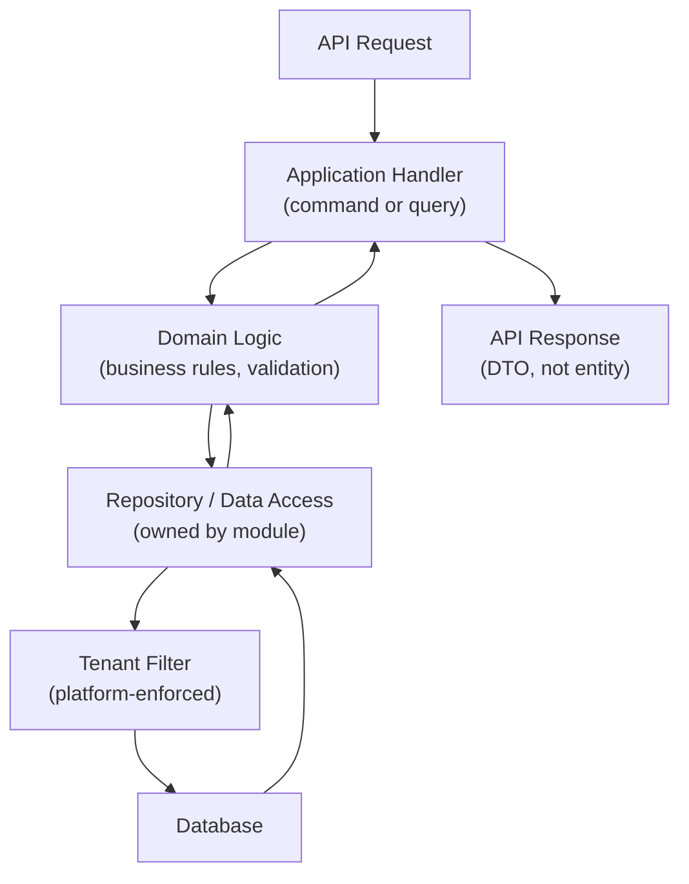
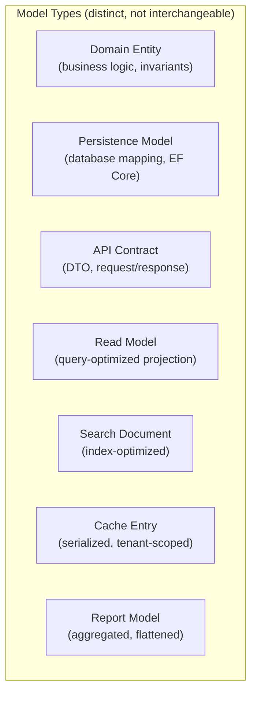

# Data Access and Persistence Architecture

## Metadata

| Field | Value |
|-------|-------|
| Title | Kairo Data Access and Persistence Architecture |
| Document ID | KAI-DATA-007 |
| Status | Draft |
| Version | 0.1 |
| Target Release | V1 |
| Owner | Persistence and Data Access Architecture Lead |
| Created | 2026-07-20 |
| Last Updated | 2026-07-20 |
| Reviewers | TODO |
| Related Documents | [Data Architecture](./Data-Architecture.md), [Data Ownership](./Data-Ownership.md), [Module Architecture](../Module-Architecture.md), [Tenant Isolation](../Multi-Tenancy/Tenant-Isolation.md), [Authorization Architecture](../Security/Authorization-Architecture.md), [Technology Stack](../Technology-Stack.md), [Transaction and Consistency](./Transaction-and-Consistency-Architecture.md), [Data Modeling Principles](./Data-Modeling-Principles.md) |
| Dependencies | [Data Architecture](./Data-Architecture.md), [Module Architecture](../Module-Architecture.md), [Technology Stack](../Technology-Stack.md) |

---

## Purpose

This document defines how modules access and persist data — the architectural patterns, boundaries, and rules that govern how code interacts with storage. It establishes the separation between domain logic, persistence logic, and public contracts, and defines the responsibilities of the platform's data-access layer.

Data access is where architecture meets implementation. Correct data-access patterns produce maintainable, testable, secure, performant code. Incorrect patterns create coupling, security vulnerabilities, performance issues, and untestable systems.

---

## Scope

This document covers:

- Persistence ownership and abstraction philosophy.
- ORM, optimized query, and direct SQL usage boundaries.
- Tenant-aware and authorization-aware access patterns.
- Query safety (pagination, filtering, bulk, timeouts, N+1 prevention).
- Model separation (domain, persistence, API, read, search, cache).
- Cross-module, reporting, and administrative access rules.

This document does not cover:

- Framework-specific code, configuration, or mapping — defined in development standards.
- Database schema definitions — defined in module specifications.
- Specific query implementations — defined in module code.
- Infrastructure configuration (connection strings, pool sizes) — defined in deployment configuration.

---

## Conceptual Request-to-Persistence Flow

---

## 1. Persistence Responsibilities

| Responsibility | Owner |
|---------------|-------|
| Data structure definition | Module (owns its schema) |
| Read operations | Module (through its repository/data-access layer) |
| Write operations | Module (exclusive writer) |
| Tenant filtering | Platform data-access layer (mandatory, module cannot bypass) |
| Connection management | Platform infrastructure |
| Transaction management | Module (local transactions), Platform (provides transaction support) |
| Query optimization | Module (responsible for efficient queries) |
| Migration management | Module (defines migrations), Platform (executes) |

---

## 2. Module-Owned Persistence

**Each module owns its persistence logic.**

| Rule | Description |
|------|-------------|
| Exclusive access | Only the owning module reads from and writes to its tables |
| Internal concern | How a module stores data is its internal implementation detail |
| Contract exposure | Other modules access data through the owning module's public query/command contracts |
| Encapsulation | Changing the persistence strategy (table structure, indexing, caching) does not affect consuming modules |
| Testing | Module persistence is testable independently (integration tests against real database) |

---

## 3. Repository / Data-Access Abstraction

Modules abstract their data access behind a defined interface layer:

| Principle | Description |
|-----------|-------------|
| Domain-oriented interface | Repository methods express domain operations, not SQL operations |
| Implementation flexibility | The interface does not dictate ORM vs. SQL vs. stored procedure |
| Testability | The interface supports substitution in tests (mock/fake for unit, real for integration) |
| Tenant-awareness | The platform data-access layer applies tenant context before queries reach the database |
| Single responsibility | Data access handles persistence. Business logic stays in the domain layer. |

### What the Abstraction IS NOT

- Not a generic CRUD wrapper that simply mirrors database tables.
- Not a way to bypass module boundaries (no generic "get any entity by ID" across modules).
- Not a leaky abstraction that exposes query builders or SQL to the domain layer.

---

## 4. Command vs. Query Responsibilities

| Concern | Command (Write) | Query (Read) |
|---------|-----------------|-------------|
| Purpose | Change state | Retrieve data |
| Validation | Full business rule validation before persistence | Validate filter parameters |
| Transaction | Within a database transaction | Typically no transaction needed (read) |
| Return value | Confirmation or created entity reference | Data projection (DTO) |
| Event publication | Publishes domain events (via outbox) | No events published |
| Authorization | Requires write permission | Requires read permission |
| Tenant filtering | Mandatory on target entity | Mandatory on all query results |

### Separation Benefit

Commands and queries can be optimized independently. Write models prioritize consistency. Read models prioritize query performance.

---

## 5. ORM Usage Direction

The approved ORM is Entity Framework Core (per [Technology Stack](../Technology-Stack.md)).

| When to Use EF Core | Description |
|--------------------|-------------|
| Standard CRUD | Create, read, update, delete for module entities |
| Relationships | Loading related entities within the module boundary |
| Change tracking | Tracking modifications for optimistic concurrency |
| Migrations | Schema evolution through EF Core migrations |
| Complex writes | Multi-entity writes within a single transaction |

### ORM Rules

- EF Core is the default persistence mechanism for write operations and standard reads.
- Entity classes are persistence models (not domain entities directly exposed through APIs).
- EF Core is configured per module. No shared DbContext across modules.
- Eager/explicit loading prevents N+1 queries (lazy loading is disabled or strictly controlled).
- EF Core queries always pass through the tenant filter (interceptor-based enforcement).

---

## 6. Direct SQL Usage Direction

Direct SQL (through the database connection without ORM) is permitted in specific cases:

| When Acceptable | Justification |
|----------------|---------------|
| Performance-critical read queries | ORM overhead is measurable and unacceptable for the specific query pattern |
| Complex reporting queries | Aggregations, GROUP BY, window functions that ORM cannot express cleanly |
| Bulk operations | Batch inserts/updates where ORM per-entity overhead is prohibitive |
| Migration scripts | Schema changes that EF Core migrations cannot express |

### Direct SQL Rules

- Direct SQL is used **only behind owned module boundaries**. No cross-module SQL.
- Direct SQL must include the tenant filter (enforced through a parameterized pattern).
- Direct SQL is wrapped in the module's data-access layer (not in handlers or controllers).
- Direct SQL queries are reviewed for injection safety (parameterized only).
- Direct SQL usage is documented with justification (why ORM is insufficient).

---

## 7. Optimized Query Direction (Dapper-style)

Lightweight data access (Dapper or similar) for optimized read paths:

| When to Use | Description |
|-------------|-------------|
| Read-heavy endpoints | Product listing, order search, catalog browsing |
| Complex projections | Multi-join reads that produce flat DTOs directly |
| Performance-sensitive paths | Checkout price resolution, cart calculation data retrieval |

### Rules

- Used alongside EF Core (not instead of). EF Core for writes, optimized queries for reads.
- Still passes through the tenant filter layer.
- Returns DTOs directly (not persistence entities).
- Query text is in the data-access layer (not in handlers).
- Parameterized queries only (no string concatenation).

---

## 8. Transaction Management

| Principle | Description |
|-----------|-------------|
| Module-local | Transactions encompass one module's operations only |
| Explicit scope | Transaction boundaries are explicit in the application layer (not ambient) |
| Include outbox | The transaction includes writing to the outbox table (atomic with the business write) |
| No cross-module transactions | A transaction never spans multiple modules' data |
| Savepoints for partial operations | Complex multi-step operations within a module may use savepoints |
| Connection-scoped | A transaction is tied to one database connection |

---

## 9. Tenant-Aware Access

**Tenant filtering does not replace authorization. Authorization does not replace tenant-aware query constraints.**

Both are required. They are independent, complementary controls:

| Control | What It Ensures |
|---------|----------------|
| Tenant filtering | Queries never access data outside the authenticated organization. Structural guarantee. |
| Authorization | The authenticated actor has permission for the requested operation. Permission guarantee. |

### Tenant-Aware Rules

- The platform data-access layer **automatically** applies the organization filter to every query.
- Modules cannot bypass the tenant filter.
- Modules cannot issue queries without tenant context (rejected by the platform layer).
- Store-scoping (where applicable) is validated against the actor's store assignments.
- **Shared database access must not become an excuse for architectural coupling.** Being in the same database does not grant access to another module's data.

---

## 10. Query Filtering

| Filter Type | Applied By | Purpose |
|-------------|-----------|---------|
| Tenant filter (organization_id) | Platform data-access layer (automatic) | Isolation guarantee |
| Store filter (store_id) | Module data-access layer (validated against actor's scope) | Store-scoped access |
| Business filters (status, date range, etc.) | Module query logic | Business query requirements |
| Soft-delete filter (where applicable) | Module data-access layer | Exclude inactive records from default queries |
| Authorization filter (resource ownership) | Module (via platform utilities) | Object-level authorization |

### Rules

- Tenant filter is always present and always first. It is non-negotiable.
- Business filters are additive (they further restrict within the tenant scope).
- Filters never widen access beyond the tenant boundary.
- Absence of a business filter returns all records within the tenant scope (with pagination).

---

## 11. Authorization vs. Filtering

| Concern | Tenant Filtering | Authorization |
|---------|-----------------|---------------|
| Answers | "Which organization's data?" | "Can this actor perform this operation?" |
| Enforcement point | Platform data-access layer (automatic) | Authorization pipeline + module |
| Failure mode without it | Cross-tenant data exposure | Unauthorized action execution |
| Sufficient alone? | No (actor may lack permission within tenant) | No (doesn't prevent cross-tenant access) |
| Both required? | **Yes. Always.** | **Yes. Always.** |

---

## Model Separation

### Distinct Model Types

---

## 12. Read Models

Optimized data structures for query paths that do not fit the write model:

| Aspect | Detail |
|--------|--------|
| Purpose | Serve specific read patterns efficiently (list views, search results, dashboards) |
| Ownership | The module that owns the authoritative data |
| Update mechanism | Event-driven from authoritative writes, or computed on query |
| Consistency | Eventually consistent with the write model (bounded lag) |
| Storage | Same database (materialized view or dedicated table) or derived store (search, cache) |

### Rules

- Read models are projections. They are not authoritative.
- Read models are rebuildable from the authoritative source.
- Read models do not trigger business events.
- **Public APIs must not expose persistence entities directly.** API responses use DTOs which may be backed by read models.

---

## 13. Write Models

The authoritative persistence for state changes:

| Aspect | Detail |
|--------|--------|
| Purpose | Record state changes with full consistency |
| Ownership | The module exclusively |
| Update mechanism | Commands through the domain layer |
| Consistency | Strong (ACID transaction within the module) |
| Validation | Full business rule validation before persistence |

---

## 14. Projection Models

Intermediate transformations between persistence and consumption:

| From | To | Purpose |
|------|------|---------|
| Persistence model → API DTO | Serve API consumers | Expose only what the consumer needs |
| Persistence model → Event payload | Communicate state changes | Include only what consumers require |
| Persistence model → Search document | Feed search indexing | Denormalized for search query patterns |
| Persistence model → Cache entry | Feed cache | Serialized for fast retrieval |

### Projection Rules

- Projections never expose internal persistence structure.
- Projections are defined by consumption need, not by storage structure.
- Multiple projections from the same persistence model are normal and expected.

---

## 15. Pagination

**Unbounded queries are prohibited.**

| Rule | Description |
|------|-------------|
| All collection endpoints are paginated | No endpoint returns unbounded result sets |
| Cursor-based pagination | Default mechanism (consistent with [API Security](../Security/API-Security.md)) |
| Maximum page size | Platform-defined ceiling. Client cannot request unlimited results. |
| Default page size | Sensible default when client does not specify |
| Total count | Optional. Provided only when affordable and authorized. |

---

## 16. Sorting

| Rule | Description |
|------|-------------|
| Sortable fields are defined per endpoint | Not every field is sortable (only indexed fields) |
| Default sort is defined | Every paginated endpoint has a deterministic default sort |
| Multi-field sort | Supported with defined limits (maximum sort fields) |
| Sort stability | Sort order is stable for pagination (deterministic with tiebreaker) |

---

## 17. Filtering

| Rule | Description |
|------|-------------|
| Filter fields are defined per endpoint | Not every field is filterable (performance concern) |
| Filter operators are restricted | Equals, contains, range, in-list. No arbitrary SQL expressions. |
| Maximum filter complexity | Defined limit on combined filter conditions |
| Filters do not bypass tenant scoping | Business filters are additive to tenant scope |
| Injection-safe | Filters are parameterized. Never concatenated into queries. |

---

## 18. Bulk Operations

**Bulk operations require explicit validation, authorization, transaction, and audit strategy.**

| Concern | Requirement |
|---------|-------------|
| Authorization | Caller must have permission for the operation type on each affected resource |
| Validation | Each item in the bulk set is validated against business rules |
| Transaction | Bulk may be all-or-nothing or partial-completion (defined per operation) |
| Tenant scoping | All items must belong to the authenticated tenant |
| Audit | Bulk operations are audit-logged (scope and volume recorded) |
| Rate limiting | Bulk operations are subject to stricter rate limits |
| Size limits | Maximum items per bulk request is defined |
| Error reporting | Partial failures report per-item success/failure |

---

## 19. Query Performance

| Principle | Description |
|-----------|-------------|
| Indexes support query patterns | Queries are designed with indexes in mind. Indexes support documented access patterns. |
| Explain-plan awareness | Performance-critical queries are validated against execution plans |
| No full-table scans for operational queries | Every operational query uses an index (tenant filter guarantees this for tenant-scoped data) |
| Query cost awareness | Expensive operations (aggregations, complex joins) are identified and documented |
| Performance targets | Critical paths (catalog list, cart calculation) have defined latency targets |

---

## 20. N+1 Query Prevention

| Strategy | Description |
|----------|-------------|
| Eager loading | Load related data in the initial query where needed |
| Batch loading | Load related data in batches (not per-item) |
| Explicit includes | EF Core includes are explicit, not lazy |
| Read models | Pre-joined projections eliminate multi-query patterns |
| Monitoring | N+1 patterns detected through query monitoring |

### Rules

- Lazy loading is disabled or strictly controlled platform-wide.
- Every endpoint that returns collections with related data uses explicit loading strategy.
- N+1 patterns are treated as performance bugs to be fixed.

---

## 21. Connection Management

| Principle | Description |
|-----------|-------------|
| Connection pooling | Managed by the platform infrastructure (not per-module) |
| Connection-per-request | Each request acquires a connection from the pool and returns it after completion |
| No long-held connections | Operations complete promptly. No request holds a connection for extended processing. |
| Pool exhaustion monitoring | Alerts when connection pool utilization approaches limits |
| Isolation | Connection pool serves all modules in V1 (shared database). Modules do not manage their own pools. |

---

## 22. Timeouts

| Context | Timeout Policy |
|---------|---------------|
| Query execution | Maximum execution time per query. Long-running queries are terminated. |
| Command execution | Maximum time for a write transaction. |
| Connection acquisition | Maximum wait time for a connection from the pool. Fail fast if unavailable. |
| Request total | Overall request timeout encompasses all database operations within it. |

### Rules

- Timeouts prevent resource exhaustion from runaway queries.
- Timeout values are configured (not hardcoded).
- Timeout exceeds trigger investigation (may indicate missing index or poor query design).

---

## 23. Cancellation

| Principle | Description |
|-----------|-------------|
| Request cancellation propagates | If the client disconnects, in-progress database operations are cancelled |
| CancellationToken flow | Cancellation tokens flow from the API layer through handlers to data access |
| Cancelled operations release resources | Cancelled queries release their connection. Cancelled transactions roll back. |
| Partial state prevented | Cancellation within a transaction results in full rollback |

---

## 24. Retries

| Context | Retry Policy |
|---------|-------------|
| Transient database errors | Retry with exponential backoff (connection drops, deadlocks) |
| Query timeout | Retry with backoff (may indicate temporary load) |
| Deadlock retry | Limited retries with randomized backoff |
| Non-transient errors (constraint violation) | No retry (business logic error, not infrastructure issue) |

### Rules

- Retries are applied at the data-access layer for infrastructure errors only.
- Business-logic failures (validation, constraints) are not retried — they propagate to the caller.
- Retry counts are limited. Permanent failures are escalated.
- Retries are idempotent (re-executing the same operation is safe).

---

## 25. Caching Boundaries

| Rule | Description |
|------|-------------|
| Cache sits above the data-access layer | Modules check cache before querying the database |
| Cache is tenant-scoped | Keys include tenant context (per [Tenant Isolation](../Multi-Tenancy/Tenant-Isolation.md)) |
| Cache invalidation is event-driven | Writes publish events; cache consumers invalidate |
| Cache is not authoritative | On miss, the authoritative database is queried |
| Write-through is not default | Writes go to the database. Cache is populated on read or invalidated on write events. |
| Critical-path queries bypass cache | Checkout (final price, final inventory) queries the database directly |

---

## 26. Search Boundaries

| Rule | Description |
|------|-------------|
| Search indexes are fed from module data | The search service indexes data from the authoritative source |
| Modules do not query the search index for business logic | Search is for user-facing discovery, not for business decisions |
| Search is tenant-scoped | Queries and indexes respect tenant boundaries |
| Search is eventually consistent | Index updates lag behind authoritative changes |
| Authoritative operations use the database | Inventory checks, price resolution, order placement use the DB, not the search index |

---

## 27. Cross-Module Data Access

**Modules must not update another module's internal persistence directly.**

| Permitted | Mechanism |
|-----------|-----------|
| Read another module's data | Through the owning module's query contract (not direct SQL) |
| Request a change in another module | Through the owning module's command contract |
| React to another module's changes | Through events (the module publishes, others subscribe) |

| Prohibited | Reason |
|-----------|--------|
| Direct SQL query to another module's tables | Creates coupling. Bypasses owner's business rules. |
| Shared database as justification for cross-access | Physical co-location ≠ architectural access. |
| Generic "get any entity by ID" across modules | Each module exposes specific, purposeful contracts. |

---

## 28. Reporting Access

| Approach | Description |
|----------|-------------|
| V1: Reports query module contracts | Reports use the same query interfaces as API consumers |
| V1: Module-internal reporting queries | Modules may expose reporting-specific query contracts optimized for aggregation |
| Future: Dedicated reporting store | Event-driven projections into a reporting-optimized store |

### Rules

- Reports do not access other modules' data directly.
- Reports use read permissions (not write).
- Reports are tenant-scoped.
- Reporting queries that are too expensive for the transactional database use dedicated read paths (read replicas or reporting projections in future).

---

## 29. Administrative Access

| Context | Data Access Rules |
|---------|------------------|
| Organization admin | Accesses data through the same API contracts as any other user (higher permissions) |
| Platform admin | Does not access tenant business data through normal data-access paths. Uses support tooling with impersonation. |
| Direct database access (operations) | For infrastructure maintenance only. Audited. Not for business data manipulation. |

### Rules

- No "admin backdoor" that bypasses the data-access layer, authorization, or tenant filtering.
- Administrative operations go through the same layers as regular operations (with elevated permissions).
- Direct database access by operations is for infrastructure (migrations, performance investigation), not for business operations.

---

## 30. Future Service Extraction

| Design Principle | Purpose |
|-----------------|---------|
| Module persistence is self-contained | All data-access logic lives within the module. No cross-module shared repositories. |
| Cross-module access uses contracts | If a module is extracted to its own database, the contract interface remains the same. Only the implementation changes (local call → network call). |
| No cross-module joins | Queries never join across module boundaries. This ensures clean extraction. |
| Connection abstraction | The platform provides connection management. Modules do not manage their own database connections. Future routing to different databases is transparent. |

---

## Version Gate

| Version | Data Access Gate |
|---------|-----------------|
| V1 | Module-owned persistence operational. Tenant filtering automatic and mandatory. EF Core for writes and standard reads. Optimized queries for performance-critical reads. Pagination mandatory on all collections. N+1 prevention validated. Transaction management with outbox. No cross-module direct access. Timeout and cancellation operational. |
| V2 | Read replicas evaluated for read-heavy paths. Reporting projections available. Connection pool tuning based on production metrics. Query performance monitoring automated. |
| V3 | Per-module database routing (if modules are extracted). Reporting-optimized store operational. Advanced caching strategies. Cross-product data-access patterns defined. |

---

## Decision Summary

| Decision | Rationale |
|----------|-----------|
| EF Core for writes + optimized queries for reads | EF Core provides safety and convenience for writes. Optimized queries provide performance for reads. Best of both. |
| Module-exclusive persistence | Prevents coupling. Enables independent evolution. Aligns with module architecture. |
| Automatic tenant filtering | Cannot be forgotten or bypassed by module code. Structural guarantee. |
| Both tenant filtering and authorization required | Each catches different failure modes. Neither is sufficient alone. |
| Pagination mandatory | Unbounded queries risk memory exhaustion and timeout. Pagination is always required. |
| No cross-module joins | Enables future service extraction. Prevents implicit cross-module coupling. |
| Cache above data-access, not alongside | Clear layering. Cache miss falls through to the authoritative path. No confusion about source of truth. |
| Direct database access for operations only (not business) | Business operations must go through application logic (validation, authorization, audit). Direct DB access bypasses all of these. |

---

## Alternatives Considered

| Alternative | Rejected Because |
|------------|-----------------|
| ORM-only (no direct SQL) | Some queries cannot be expressed efficiently in ORM. Bulk operations are prohibitively slow through ORM. |
| SQL-only (no ORM) | Loses change tracking, migration tooling, and type-safe query construction. More error-prone for standard CRUD. |
| Shared DbContext across modules | Creates coupling. Module boundaries become meaningless if they share persistence context. |
| Lazy loading enabled by default | Causes N+1 queries implicitly. Explicit loading forces developers to think about data loading strategy. |
| Generic repository pattern | Generic CRUD repositories expose too much. Domain-oriented repositories expose meaningful operations. |
| Cross-module views or shared reporting tables | Creates coupling. Changes to one module's schema break other modules' views. |
| Admin bypass of data-access layer | Eliminates all safety guarantees (authorization, tenant filtering, validation, audit). |

---

## Trade-offs

| Trade-off | Accepted Because |
|-----------|-----------------|
| Dual approach (EF Core + optimized queries) adds learning cost | Better than forcing one tool for all cases. Each tool excels in its domain. |
| Module-exclusive access means modules can't optimize cross-module queries | Prevents coupling that makes extraction impossible. Cross-module reads use contracts (with caching for performance). |
| Automatic tenant filtering adds per-query overhead | Negligible cost. The alternative (module-implemented filtering) risks forgetting it — catastrophic. |
| Pagination limit reduces flexibility for some consumers | Prevents system instability. Consumers that need all data use iteration (paginated requests in sequence). |
| No lazy loading means explicit loading code | More code per query. But every query's data loading is visible and reviewable. No hidden queries. |

---

## Architecture Impact

| Concern | Impact |
|---------|--------|
| Module design | Each module contains its own data-access layer. No shared persistence code across modules. |
| API design | API responses use DTOs mapped from read models or persistence models. Never expose entities directly. |
| Performance | Performance-critical paths use optimized queries. Standard paths use ORM. |
| Testing | Data-access layers are tested with real database (integration tests via Testcontainers). |
| Tenant isolation | Platform data-access layer enforces tenant filtering automatically. Modules cannot bypass. |
| Event publication | Write operations include outbox writes in the same transaction. |
| Caching | Cache sits above data-access. Modules check cache first, fall through to DB on miss. |
| Migration | EF Core migrations manage schema evolution. Direct SQL for what EF Core cannot express. |

---

## Implementation Impact

| Area | Impact |
|------|--------|
| Modules | Must define their own persistence models and data-access interfaces. Must use platform-provided tenant-filtered data access. Must not access other modules' tables. Must implement pagination on all collection queries. |
| Platform | Must provide tenant-filtered data-access layer. Must manage connection pooling. Must support transaction + outbox atomicity. Must enforce query timeouts. |
| APIs | Must map between persistence models and API DTOs. Must never serialize persistence entities directly. Must support pagination, sorting, and filtering parameters. |
| Testing | Must test data-access with real database. Must verify tenant isolation at the query level. Must verify N+1 prevention. |
| Performance | Must identify and optimize hot-path queries. Must use explain plans for performance-critical paths. Must monitor query execution times. |

---

## Security Responsibilities

| Role | Data Access Responsibilities |
|------|----------------------------|
| Persistence Architect | Defines data-access patterns. Reviews persistence designs. Maintains standards. |
| Platform Team | Provides tenant-filtered data access, connection management, and transaction support. |
| Module Teams | Implement module-specific data access using platform-provided infrastructure. Optimize queries. Prevent N+1. |
| Security Team | Validates that tenant filtering is present on all queries. Reviews direct SQL for injection. |
| Operations | Monitors query performance, connection pool health, and timeout frequency. |

---

## Multi-Tenancy Responsibilities

| Responsibility | Detail |
|---------------|--------|
| Automatic tenant filter | Platform data-access layer applies organization_id filter to every query |
| Store-scope validation | Module validates store_id against actor's authorized stores |
| No unscoped queries | Platform rejects queries without tenant context |
| Bulk operations scoped | Every item in a bulk operation is validated against the authenticated tenant |
| Cache scoping | All cached query results include tenant context in the key |

---

## Out of Scope

This document does not define:

- EF Core configuration, DbContext setup, or entity mapping — defined in development standards.
- Database table schemas — defined in module specifications.
- SQL query syntax or specific Dapper usage — defined in development standards.
- Connection string management — defined in infrastructure/secrets documentation.
- Database scaling (read replicas, sharding) — defined in [Data Isolation Strategy](../Multi-Tenancy/Data-Isolation-Strategy.md) and infrastructure architecture.

---

## Future Considerations

- **CQRS separation** — Formal separation of read and write models with dedicated read stores for high-volume queries.
- **Read replicas** — Routing read-heavy queries to replicas when write-primary capacity is consumed.
- **Query result streaming** — For large data exports, streaming results rather than loading into memory.
- **GraphQL data loading** — If GraphQL is introduced, data-loader patterns prevent N+1 at the resolver level.
- **Multi-database routing** — When modules or tenants move to separate databases, the data-access layer routes transparently.
- **Query cost analysis** — Automated analysis of query cost before deployment (CI/CD gate on expensive queries).

---

## Future Refactoring Triggers

This document should be revisited when:

- A module is extracted to its own database (cross-module access becomes network-based).
- Read replicas are introduced (routing logic for read vs. write paths).
- GraphQL layer is added (data-loading patterns differ from REST).
- Query performance issues indicate the dual ORM/optimized approach needs adjustment.
- Connection pool exhaustion occurs under load (scaling strategy needed).
- A new storage type is introduced (graph database, time-series) for a specific module.
- Reporting requirements exceed what module contracts can efficiently serve.

---

## Change History

| Version | Date | Author | Description |
|---------|------|--------|-------------|
| 0.1 | 2026-07-20 | Persistence and Data Access Architecture Lead | Initial draft |
