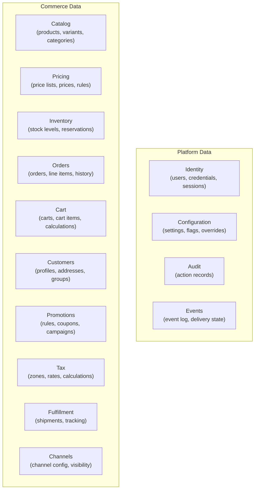
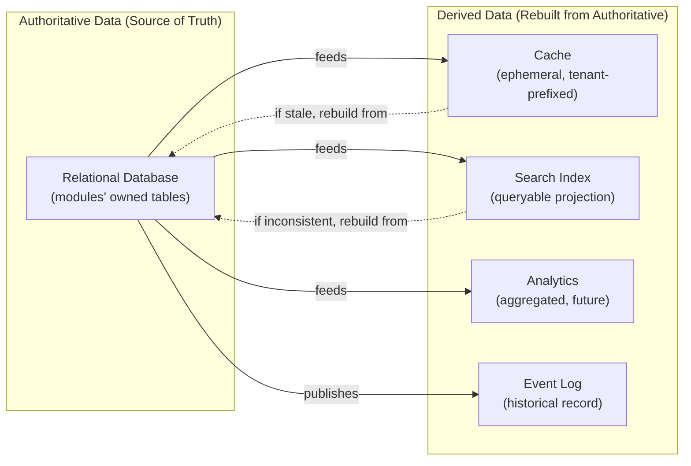
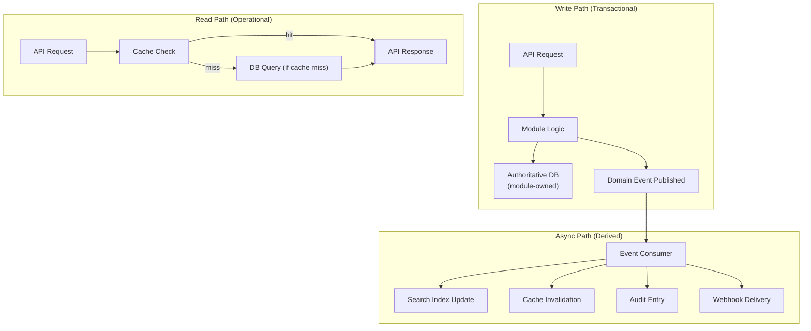

# Data Architecture

## Metadata

| Field | Value |
|-------|-------|
| Title | Kairo Data Architecture |
| Document ID | KAI-DATA-001 |
| Status | Draft |
| Version | 0.1 |
| Target Release | V1 |
| Owner | Chief Data Architect |
| Created | 2026-07-20 |
| Last Updated | 2026-07-20 |
| Reviewers | TODO |
| Related Documents | [Module Architecture](../Module-Architecture.md), [Multi-Tenancy Architecture](../Multi-Tenancy/Multi-Tenancy-Architecture.md), [Data Isolation Strategy](../Multi-Tenancy/Data-Isolation-Strategy.md), [Data Protection](../Security/Data-Protection.md), [Monolith Strategy](../Monolith-Strategy.md), [Technology Stack](../Technology-Stack.md), [Tenant Configuration](../Multi-Tenancy/Tenant-Configuration.md), [Tenant Lifecycle](../Multi-Tenancy/Tenant-Lifecycle.md) |
| Dependencies | [Module Architecture](../Module-Architecture.md), [Data Isolation Strategy](../Multi-Tenancy/Data-Isolation-Strategy.md) |

---

## Applicable Version

This document defines the V1 data architecture. It aligns with the modular monolith strategy and the shared-database, shared-schema tenant isolation model. Future data platform evolution (sharding, dedicated databases, analytical pipelines) is identified but not required for V1.

---

## Purpose

This document defines how data is owned, organized, categorized, and governed across the Kairo platform. It establishes the relationship between business domains and their data, the rules for data consistency and lifecycle, and the architectural principles that ensure data remains correct, secure, and evolvable.

Data architecture ensures that when a module needs data, it knows where to find the authoritative source. When data must be consistent, it knows what guarantees apply. When data must be deleted, it knows what process to follow. Without explicit data architecture, data ownership becomes ambiguous, consistency becomes accidental, and lifecycle becomes unmanaged.

---

## Scope

This document covers:

- Data ownership by business domain and module.
- Data categories and their characteristics.
- Logical and physical data boundary separation.
- Consistency, lifecycle, and quality principles.
- V1 data architecture aligned with the modular monolith.
- Future data platform direction.

This document does not cover:

- Database table schemas, SQL, or migrations — defined in module specifications.
- ORM configuration or entity mapping — defined in development standards.
- API response models — defined in module API specifications.
- Cloud-specific database services — defined in infrastructure documentation.
- Data encryption and classification details — defined in [Data Protection](../Security/Data-Protection.md).
- Tenant isolation enforcement — defined in [Data Isolation Strategy](../Multi-Tenancy/Data-Isolation-Strategy.md).

---

## 1. Data Architecture Purpose

Data architecture serves three functions:

- **Ownership clarity** — Every piece of data has a defined owner (module) that is responsible for its correctness, consistency, and lifecycle.
- **Boundary enforcement** — Data boundaries prevent coupling between modules. One module's internal data structure is invisible to others.
- **Evolution enablement** — Data organization supports the platform's evolution from monolith to services without requiring wholesale data restructuring.

---

## 2. Business Domains and Data Ownership

**Business capabilities own their data.** Each bounded context (as defined in [Module Architecture](../Module-Architecture.md)) is the exclusive owner of its data. Ownership means:

- The owning module defines the data structure.
- The owning module is the only writer.
- The owning module is the authoritative source for its data.
- Other modules access this data only through the owning module's public contracts.

---

## 3. Modules and Persistence

**Modules must not directly manipulate another module's internal data.**

```mermaid
graph LR
    subgraph Correct["Correct: Contract Access"]
        ModA["Module A"] -->|"query interface"| ModB["Module B"]
        ModB -->|"result"| ModA
    end

    subgraph Wrong["Wrong: Direct Data Access"]
        ModC["Module C"] -->|"SQL query"| ModD_DB["Module D's Tables"]
    end

    style Wrong fill:#3b1010,stroke:#ef4444
    style Correct fill:#0a2f1e,stroke:#22c55e
```

Each module:

- Owns its persistence layer (tables, indexes, constraints).
- Exposes data to other modules through defined query contracts.
- Never exposes its internal data structure through those contracts (DTOs, not entities).
- May change its internal storage without affecting consuming modules, as long as contracts are honored.

---

## 4. Logical Data Boundaries

Logical boundaries define data ownership independent of physical storage:

| Module | Data Owned | Not Owned |
|--------|-----------|-----------|
| Catalog | Products, variants, categories, attributes, product types | Prices, stock levels, orders |
| Pricing | Price lists, prices, price rules | Products, orders, customers |
| Inventory | Stock levels, reservations, movements | Products, orders, fulfillment |
| Orders | Orders, line items, order status, order history | Products, customers (references by ID) |
| Cart | Cart state, cart items, calculations | Products, prices (consumed via contracts) |
| Customers | Customer profiles, addresses, groups | Orders, login credentials |
| Promotions | Discount rules, coupons, campaigns | Products, prices, customers (referenced) |
| Tax | Tax zones, tax rates, tax categories | Orders, customers (consumed via contracts) |
| Fulfillment | Shipments, tracking, fulfillment status | Products, inventory (consumed via contracts) |
| Identity | Users, credentials, sessions, roles, permissions | Commerce data |
| Configuration | Settings, overrides, feature flags | Business data |
| Audit | Audit entries | Business data (references by ID) |

### Boundary Rules

- Boundaries are defined by business domain, not by technical convenience.
- Cross-module data access goes through the owning module's contract. No direct access.
- References between modules use IDs only. No embedded foreign objects.
- A module's internal schema can change without affecting other modules (contract remains stable).

---

## 5. Physical Storage Boundaries

**Logical data ownership and physical database placement are separate concerns.**

| Concern | Logical (V1) | Physical (V1) |
|---------|-------------|---------------|
| Data ownership | Per module | All modules share one PostgreSQL database |
| Schema organization | Logically grouped (naming conventions or schemas) | Single shared schema with module-prefixed tables |
| Access control | Platform data layer enforces module boundaries | Database-level access is shared (application-enforced) |
| Tenant separation | Organization ID on all tenant data | Shared tables with mandatory filter |
| Future evolution | Unchanged when physical model changes | May evolve to per-module databases or per-tenant databases |

### Physical Boundary Rules

- V1 uses a single shared PostgreSQL database (per [Data Isolation Strategy](../Multi-Tenancy/Data-Isolation-Strategy.md)).
- Module data is logically separated through naming conventions or schema namespaces.
- Cross-module direct queries are prohibited at the application level even though the database technically allows them.
- The data access layer abstracts physical location. Modules are unaware of where their data physically resides.
- **Data architecture must support future service extraction without forcing microservices in V1.** The shared database with module boundaries enables extraction when justified.

---

## 6. Tenant-Aware Data Principles

- **Organization remains the primary tenant boundary.** Every tenant-owned data row includes the organization identifier.
- **Tenant-owned data must preserve tenant context.** No operation creates, reads, updates, or deletes tenant data without an explicit organization context.
- **Tenant data isolation is enforced by the platform data layer.** Modules consume the data layer; they do not implement their own tenant filtering.
- All tenant data principles from [Multi-Tenancy Architecture](../Multi-Tenancy/Multi-Tenancy-Architecture.md) and [Data Isolation Strategy](../Multi-Tenancy/Data-Isolation-Strategy.md) apply.

---

## 7. Data Security Principles

- **Sensitive data collection must be minimized.** Collect only what is necessary for the defined purpose.
- Data is classified per [Data Protection](../Security/Data-Protection.md): Public, Internal, Confidential, Restricted, Personal, Payment.
- Encryption at rest applies to all storage (volume-level). Sensitive fields receive additional application-level encryption.
- Credentials and secrets are never stored alongside business data. They use the dedicated secret store.
- Access to data is authorized. The data layer enforces tenant context. Authorization validates permission.
- **Persistent data must have an explicit owner.** Unowned data is a system defect.

---

## 8. Data Consistency Principles

| Scope | Consistency Model |
|-------|------------------|
| Within a module | Strong consistency (ACID transactions) |
| Across modules (within a request) | Best effort. Prefer eventual consistency through events. Strong consistency only where business-critical. |
| Across modules (async) | Eventual consistency through events |
| Across products (future) | Eventual consistency through events |

### Consistency Rules

- A module may use transactions internally to ensure its own data is consistent.
- Cross-module operations prefer event-driven eventual consistency.
- Where strong cross-module consistency is required (e.g., checkout: inventory reservation + order creation), it is explicitly documented and architecturally designed.
- Idempotent event consumers ensure that eventual consistency converges without duplication.
- **Derived data must remain traceable to authoritative data.** When derived data becomes stale, the authoritative source is the fallback.

---

## 9. Data Lifecycle Principles

- **Data deletion and retention must be intentional and auditable.** No data is retained indefinitely without a defined purpose.
- Every data category has a defined retention direction (per [Data Protection](../Security/Data-Protection.md)).
- Deletion is complete — no orphaned references remain after deletion.
- Audit records outlive business data (they record what happened even after the data is gone).
- Tenant deletion is a distributed operation that removes data from all subsystems (per [Tenant Lifecycle](../Multi-Tenancy/Tenant-Lifecycle.md)).

---

## 10. Data Quality Principles

- Data is validated at the boundary (when entering the system through APIs or imports).
- Business rules are enforced by the owning module, not by the database alone.
- Referential integrity within a module uses database constraints.
- Referential integrity across modules uses application-level consistency (IDs are valid at write time; dangling references are handled through reconciliation).
- Data quality issues are detected through monitoring, not discovered by end users.

---

## Data Categories

### 11. Transactional Data

Data that records business operations as they occur.

| Aspect | Detail |
|--------|--------|
| Examples | Orders, payments, inventory movements, cart state |
| Characteristics | Strongly consistent within module. Mutable during lifecycle. Immutable after completion. |
| Ownership | Respective commerce modules |
| Consistency | ACID within module. Eventual across modules. |
| Retention | Per business and compliance requirements |
| Tenant scope | Organization + Store |

### 12. Reference Data

Data that defines the business entities against which transactions occur.

| Aspect | Detail |
|--------|--------|
| Examples | Products, categories, price lists, tax zones, shipping methods |
| Characteristics | Relatively stable. Changed through administrative operations. Read frequently. |
| Ownership | Respective commerce modules |
| Consistency | Strong within module. Changes propagate to consumers through events. |
| Retention | While the entity is active. Archived when deactivated. |
| Tenant scope | Organization + Store |

### 13. Configuration Data

Data that controls platform and tenant behavior.

| Aspect | Detail |
|--------|--------|
| Examples | Organization settings, store settings, feature flags, platform defaults |
| Characteristics | Changed infrequently. Read on every request (cached). Hierarchical. |
| Ownership | Configuration service |
| Consistency | Strong. Changes propagate through cache invalidation. |
| Retention | While the tenant exists. Removed on tenant deletion (overrides). Platform defaults persist. |
| Tenant scope | Platform → Organization → Store hierarchy |

### 14. Audit Data

Data that records significant actions for accountability and compliance.

| Aspect | Detail |
|--------|--------|
| Examples | Authentication events, authorization failures, data changes, administrative actions |
| Characteristics | Immutable. Append-only. High volume. Long retention. |
| Ownership | Audit service |
| Consistency | Eventually consistent (written asynchronously with guaranteed delivery). |
| Retention | Compliance-driven (months to years). Outlives business data. |
| Tenant scope | Organization-scoped entries. Platform-scoped entries for infrastructure. |

**Audit records and transactional records serve different purposes.** Audit records who did what. Transaction records what happened to business entities. They are stored, accessed, and retained differently.

### 15. Event Data

Data that represents state changes communicated between modules and systems.

| Aspect | Detail |
|--------|--------|
| Examples | OrderCreated, InventoryReserved, PriceUpdated, PaymentCaptured |
| Characteristics | Immutable once published. Time-ordered. At-least-once delivery. |
| Ownership | Event infrastructure (platform). Event content owned by publishing module. |
| Consistency | Eventual. Consumers process events asynchronously. |
| Retention | Short-term in the event bus (delivery window). Long-term in event store (if event sourcing is used by a module). |
| Tenant scope | Organization (in event envelope) |

### 16. Analytical Data (Future)

Data optimized for reporting, analysis, and business intelligence.

| Aspect | Detail |
|--------|--------|
| Examples | Aggregated sales data, customer behavior patterns, inventory trends |
| Characteristics | Derived from transactional data. Optimized for read/query. May be denormalized. |
| Ownership | Future analytics/reporting service |
| Consistency | Eventually consistent with authoritative sources. Acceptable staleness. |
| Retention | Per analytical need. May be re-derived from authoritative sources. |
| Tenant scope | Organization-scoped (tenant analytics). Platform-scoped (aggregate, de-identified). |
| V1 status | Not required. Identified for future. |

### 17. File and Media Data

Binary assets stored outside the relational database.

| Aspect | Detail |
|--------|--------|
| Examples | Product images, documents, export files |
| Characteristics | Binary. Stored in object storage. Referenced by relational data. |
| Ownership | Media service (platform) |
| Consistency | Eventually consistent with referencing entities. Orphan cleanup required. |
| Retention | While referenced. Cleaned up when references are removed. |
| Tenant scope | Organization-scoped storage paths |

### 18. Search Indexes

Optimized representations of data for full-text and faceted search.

| Aspect | Detail |
|--------|--------|
| Examples | Product search index, order search index, customer search index |
| Characteristics | Derived from authoritative data. Optimized for query patterns. May be rebuilt. |
| Ownership | Search service (platform) |
| Consistency | Eventually consistent. Index updates follow data changes with bounded delay. |
| Retention | While the indexed entity exists. Rebuilt on demand. |
| Tenant scope | Organization-scoped queries and indexes |

**Caches and indexes are not authoritative sources of truth.** If a cache or index disagrees with the authoritative data store, the authoritative store wins.

### 19. Cache Data

Temporary in-memory copies of frequently accessed data.

| Aspect | Detail |
|--------|--------|
| Examples | Resolved configuration, price list lookups, product details, session state |
| Characteristics | Ephemeral. Tenant-scoped keys. Evictable. Rebuildable from authoritative source. |
| Ownership | Platform cache service |
| Consistency | Best effort. TTL-based expiration. Event-driven invalidation. |
| Retention | Temporary (seconds to hours). Lost on eviction or restart. |
| Tenant scope | Tenant-prefixed keys (mandatory) |

### 20. Backup Data

Point-in-time copies of persistent data for disaster recovery.

| Aspect | Detail |
|--------|--------|
| Examples | Database backups, media backups, configuration snapshots |
| Characteristics | Point-in-time. Encrypted. Retained per backup policy. |
| Ownership | Platform operations |
| Consistency | Consistent at the point of capture. |
| Retention | Per backup retention policy. Rotated/deleted when retention expires. |
| Tenant scope | Contains all tenants (shared database). Per-tenant extraction for tenant-specific restore. |

---

## Authoritative vs. Derived Data

### Rules

- When derived data disagrees with authoritative data, the authoritative source is correct.
- Derived data can always be rebuilt from the authoritative source.
- Derived data may be temporarily stale. The staleness window is bounded and documented per data type.
- Decisions must never be made based on derived data when the authoritative source is available and the operation is critical.

---

## Data Flow

---

## 21. V1 Data Architecture

| Aspect | V1 Approach |
|--------|------------|
| Database | Single PostgreSQL instance (shared, per [Technology Stack](../Technology-Stack.md)) |
| Schema | Shared schema with module-prefixed table naming |
| Tenant isolation | Organization ID on all tenant data. Platform data layer enforces filtering. |
| Module boundaries | Application-enforced. No cross-module direct queries. |
| Transactions | ACID within a module. Eventual consistency across modules via events. |
| Caching | Redis (shared, tenant-prefixed keys) |
| Search | Tenant-scoped indexing and queries |
| Events | RabbitMQ (shared, tenant-scoped routing) |
| Media | Object storage (S3-compatible, tenant-scoped paths) |
| Backups | Database-level backup covering all tenants. Per-tenant extraction as needed. |
| Analytics | Not required in V1. Event data may feed future analytics. |

### V1 Alignment

- **Modular monolith compatibility:** Single database supports single deployment. Module boundaries are logical, not physical.
- **Operational simplicity:** One database to manage, monitor, and back up.
- **Future extraction:** Module data boundaries are enforced now so that future physical separation (per-module database, per-tenant database) requires infrastructure changes, not application restructuring.

---

## 22. Future Data Platform Evolution

| Capability | When Triggered | Description |
|-----------|---------------|-------------|
| Per-module database | When module extraction to service is justified | Module's data moves to its own database. Data access layer routes transparently. |
| Per-tenant database | When enterprise customer requires physical isolation | Tenant's data moves to dedicated database. Routing by placement metadata. |
| Read replicas | When read load exceeds single instance capacity | Read traffic directed to replicas. Bounded staleness acceptable for reads. |
| Event sourcing (per module) | When a specific module's domain benefits from event history | Module stores events as authoritative source. Projections derive current state. |
| Analytical data platform | When reporting needs exceed transactional database capacity | ETL/ELT pipeline from authoritative data to analytical store. |
| Data lake/warehouse | When cross-domain analytics are needed | Aggregated, de-identified data for platform-level analysis. |
| Cross-region replication | When multi-region deployment is required | Data replicated to secondary regions for latency or residency. |

### Evolution Rules

- Evolution is triggered by measurable need, not anticipation.
- Application logic does not change when physical placement changes.
- The platform data access layer abstracts storage location.
- Modules are unaware of physical evolution.
- Each evolution step requires an ADR.

---

## Version Gate

| Version | Data Architecture Gate |
|---------|----------------------|
| V1 | Single PostgreSQL database with shared schema. Module data boundaries enforced at application level. Tenant filtering mandatory on all queries. Caching with tenant-prefixed keys. Event-driven derived data updates. Search indexes tenant-scoped. Authoritative/derived distinction clear. Data lifecycle (deletion, retention) operational. |
| V2 | Read replicas evaluated. Per-module database extraction feasible (if triggered). Per-tenant database available (if triggered). Analytical data pipeline evaluated. Data quality monitoring operational. |
| V3 | Multi-region data replication (if triggered). Event sourcing evaluated for specific modules. Full data platform with analytical capabilities. Cross-domain reporting through aggregated data. |

---

## Decision Summary

| Decision | Rationale |
|----------|-----------|
| Modules own their data exclusively | Prevents coupling. Enables independent evolution. Aligns with module architecture. |
| Single shared database for V1 | Aligns with modular monolith. Simplest operationally. Sufficient for V1 scale. |
| Logical boundaries enforced at application level | Database cannot enforce module boundaries in a shared schema. Application enforcement is consistent and testable. |
| Eventual consistency across modules | Strong consistency across modules requires distributed transactions. Eventual consistency through events is simpler, more resilient, and sufficient for most operations. |
| Authoritative/derived separation | Prevents stale derived data from being treated as truth. Enables rebuilding derived data when needed. |
| Tenant context on all data | Enables tenant isolation, per-tenant operations, and future per-tenant physical separation. |
| Placement metadata from V1 | Minimal cost. Enables future routing without restructuring. |
| Audit data separate from business data | Different retention, access, and mutability requirements. Co-locating them creates operational conflicts. |

---

## Alternatives Considered

| Alternative | Rejected Because |
|------------|-----------------|
| Per-module database in V1 | Disproportionate operational complexity for a monolith with one team. No module extraction is planned for V1. |
| Strong consistency across modules | Requires distributed transactions (2PC or saga for every cross-module operation). Massive complexity for limited benefit. Eventually consistency is sufficient for most flows. |
| Single monolithic data model (no module boundaries) | Creates coupling that prevents module extraction. Changes to one area ripple across the system. |
| Event sourcing for all modules | Enormous complexity increase. Most modules have simple CRUD patterns. Event sourcing is appropriate for specific modules (orders) when their domain justifies it. |
| No derived data (always query authoritative) | Poor performance. Cache and search indexes exist because authoritative database cannot serve all read patterns efficiently. |

---

## Trade-offs

| Trade-off | Accepted Because |
|-----------|-----------------|
| Application-enforced module boundaries can theoretically be bypassed | Platform code review and testing prevent bypass. The alternative (separate databases per module) adds operational burden unjustified in V1. |
| Eventual consistency means temporary data staleness across modules | Most operations tolerate bounded staleness (milliseconds to seconds). Operations that require strong consistency are explicitly designed for it. |
| Shared database limits per-module scaling | V1 scale does not require per-module scaling. When it does, extraction is feasible because boundaries are enforced now. |
| Derived data may temporarily disagree with authoritative data | Bounded staleness windows. Clear authoritative source. Rebuilding capability. The cost of always-consistent derived data (synchronous updates) is too high. |
| Single database is a single point of failure | Infrastructure-level replication and backup provide resilience. True multi-write availability is a future capability. |

---

## Architecture Impact

| Concern | Impact |
|---------|--------|
| Module design | Modules define their data structures. Modules access only their own data. Cross-module data access uses contracts. |
| Data access layer | Must enforce module boundaries and tenant filtering. Must abstract physical storage location. |
| Events | Data changes publish events. Derived data (cache, search, analytics) is updated through event consumers. |
| Caching | Tenant-prefixed keys. Invalidation on authoritative data change. Rebuilding from authoritative source on miss. |
| Search | Indexes derived from authoritative data. Tenant-scoped. Updated asynchronously. |
| Testing | Tests validate module boundary enforcement, tenant filtering, and consistency guarantees. |
| Performance | Read path optimized through caching and indexing. Write path is authoritative + event publication. |
| Backup | Single database backup (V1). Per-tenant extraction for tenant operations. |

---

## Implementation Impact

| Area | Impact |
|------|--------|
| Modules | Must define and own their data structures. Must not access other modules' tables. Must use platform data access layer with tenant context. Must publish events on significant data changes. |
| Data access layer | Must enforce mandatory tenant filter. Must prevent cross-module direct access. Must abstract storage location for future routing. |
| Events | Must publish data change events for derived-data consumers (search index, cache invalidation, audit). |
| Cache | Must use tenant-prefixed keys via platform interface. Must invalidate on authoritative data changes. |
| Search | Must index from authoritative data. Must scope all queries to tenant. Must support rebuild. |
| Migrations | Must be backward-compatible during rolling deployment. Must not break tenant isolation. Must not cross module boundaries. |
| Operations | Must manage single database (V1). Must execute backups and retention. Must support per-tenant data export and deletion. |

---

## Security Responsibilities

| Role | Data Responsibilities |
|------|---------------------|
| Chief Data Architect | Defines data architecture. Reviews data-impacting changes. Maintains data governance. |
| Platform Team | Implements data access layer, tenant filtering, caching, and event-driven derived data. |
| Product Teams | Define module data structures. Use platform data access layer. Publish events. Enforce data quality. |
| Operations | Manage database infrastructure. Execute backups. Monitor data growth. Execute retention policies. |
| Security Team | Validates data classification compliance. Reviews data access patterns. Ensures encryption coverage. |

---

## Multi-Tenancy Responsibilities

| Responsibility | Owner | Source |
|---------------|-------|--------|
| Organization ID on all tenant data | Product Teams (module design) | [Data Isolation Strategy](../Multi-Tenancy/Data-Isolation-Strategy.md) |
| Mandatory tenant filter enforcement | Platform Team (data access layer) | [Data Isolation Strategy](../Multi-Tenancy/Data-Isolation-Strategy.md) |
| Tenant-scoped cache keys | Platform Team (cache interface) | [Tenant Isolation](../Multi-Tenancy/Tenant-Isolation.md) |
| Tenant-scoped search indexes | Platform Team (search interface) | [Tenant Isolation](../Multi-Tenancy/Tenant-Isolation.md) |
| Tenant-aware backup/restore | Operations | [Tenant Lifecycle](../Multi-Tenancy/Tenant-Lifecycle.md) |
| Tenant data deletion (distributed) | All Teams (coordinated) | [Tenant Lifecycle](../Multi-Tenancy/Tenant-Lifecycle.md) |
| Placement metadata | Platform Team | [Tenant Scaling and Placement](../Multi-Tenancy/Tenant-Scaling-and-Placement.md) |

---

## Out of Scope

This document does not define:

- Database table schemas, column definitions, or SQL — defined in module specifications.
- ORM entity classes or mapping configuration — defined in development standards.
- API response models or DTOs — defined in module API specifications.
- Cloud-specific database services (RDS, Cloud SQL, etc.) — defined in infrastructure architecture.
- Data encryption implementation — defined in [Data Protection](../Security/Data-Protection.md).
- Tenant isolation enforcement details — defined in [Data Isolation Strategy](../Multi-Tenancy/Data-Isolation-Strategy.md).
- Specific data migration procedures — defined in operational documentation.

---

## Future Considerations

- **Data mesh** — As products multiply, a data mesh approach may formalize domain-oriented data ownership at the product level.
- **Change data capture** — CDC from the authoritative database may feed derived data more efficiently than application-level events.
- **Data contracts** — Formal, versioned data contracts between modules (beyond current interface contracts).
- **Data catalog** — A discoverable catalog of what data exists, where, and who owns it.
- **Data lineage** — Tracking where data came from, how it was transformed, and where it flows.
- **Polyglot persistence** — Future modules may use specialized databases (graph, time-series) when their domain justifies it.

---

## Future Refactoring Triggers

This document should be revisited when:

- A module is extracted to an independent service (data ownership becomes physical, not just logical).
- A tenant requires physical data isolation (per-tenant database introduction).
- The database approaches capacity limits (sharding or read-replica architecture needed).
- An analytical data platform is needed (ETL pipeline, data warehouse).
- A new data category emerges that does not fit existing classifications.
- Event sourcing is adopted for a specific module (changes authoritative data model for that module).
- Multi-region deployment introduces cross-region data replication concerns.
- The Infrastructure Architecture phase is formally defined.

---

## Change History

| Version | Date | Author | Description |
|---------|------|--------|-------------|
| 0.1 | 2026-07-20 | Chief Data Architect | Initial draft |
