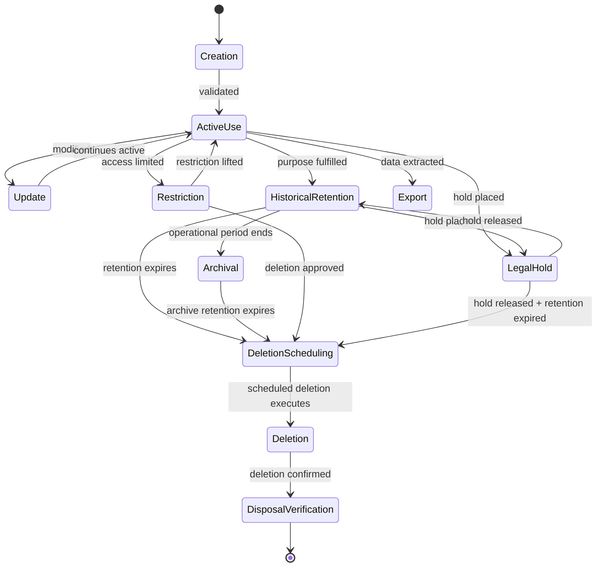
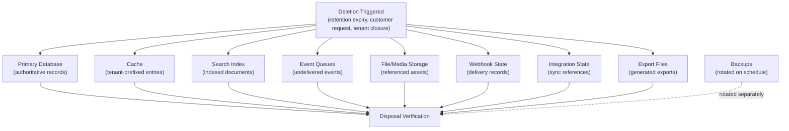

# Data Lifecycle and Retention

## Metadata

| Field | Value |
|-------|-------|
| Title | Kairo Data Lifecycle and Retention Architecture |
| Document ID | KAI-DATA-009 |
| Status | Draft |
| Version | 0.1 |
| Target Release | V1 |
| Owner | Data Lifecycle, Retention and Deletion Architect |
| Created | 2026-07-20 |
| Last Updated | 2026-07-20 |
| Reviewers | TODO |
| Related Documents | [Data Architecture](./Data-Architecture.md), [Data Ownership](./Data-Ownership.md), [Data Classification and Sensitivity](./Data-Classification-and-Sensitivity.md), [Tenant Lifecycle](../Multi-Tenancy/Tenant-Lifecycle.md), [Data Protection](../Security/Data-Protection.md), [Compliance Readiness](../Security/Compliance-Readiness.md), [Audit and Security Monitoring](../Security/Audit-and-Security-Monitoring.md) |
| Dependencies | [Data Architecture](./Data-Architecture.md), [Tenant Lifecycle](../Multi-Tenancy/Tenant-Lifecycle.md), [Data Protection](../Security/Data-Protection.md) |

---

## Purpose

This document defines how data progresses through its lifecycle in the Kairo platform — from creation through active use, historical retention, archival, and eventual deletion. It establishes retention ownership, deletion as a distributed operation, and the distinct handling of authoritative versus derived data.

Data does not exist forever. Every piece of data has a defined lifecycle with a beginning and an end. Without intentional lifecycle management, the platform accumulates data indefinitely — increasing cost, risk, and regulatory liability without proportional value.

---

## Scope

This document covers:

- Data lifecycle stages and their characteristics.
- Retention rules per data category.
- Deletion as a distributed, multi-store operation.
- Tenant closure and customer deletion as distinct scenarios.
- Backup, audit, and derived data lifecycle.
- Legal hold and de-identification.

This document does not cover:

- Specific retention durations in days/months/years (determined by policy, not architecture).
- Legal advice or regulatory interpretation.
- Database implementation of deletion or archival.
- Vendor-specific backup rotation configuration.

---

## Lifecycle Stages

---

### 1. Creation

Data enters the platform through APIs, imports, events, or internal processes.

| Rule | Description |
|------|-------------|
| Ownership assigned at creation | Every record has organization_id (and store_id where applicable) from the moment of creation |
| Validation before persistence | Data is validated against business rules before storage |
| Classification applied | Data inherits its classification at creation (per [Data Classification](./Data-Classification-and-Sensitivity.md)) |
| Audit recorded | Creation of significant entities is audit-logged |
| Retention clock starts | The retention period (where defined) begins at creation |

### 2. Validation

Data is verified against business rules before acceptance.

| Rule | Description |
|------|-------------|
| Business rules enforced | The owning module validates all rules before persistence |
| Referential integrity | Cross-references are validated (IDs exist within the tenant) |
| Classification-appropriate | Data collection complies with minimization principles |
| Rejected data not retained | Invalid data that fails validation is not stored |

### 3. Active Use

Data is operationally current and actively accessed.

| Rule | Description |
|------|-------------|
| Full access within authorization | Authorized users can read, update, and act on active data |
| Performance-optimized | Active data is cached, indexed, and query-optimized |
| Changes publish events | Updates to active data trigger event publication for derived stores |
| Active period varies by type | Products may be active for years. Cart data is active for hours. |

### 4. Update

Active data is modified through authorized operations.

| Rule | Description |
|------|-------------|
| Through owning module only | Updates go through the module's command interfaces |
| Validated on every update | Business rules are re-checked |
| Audited where required | Significant changes are audit-logged |
| Events published | Changes propagate to derived stores |
| Version incremented | Optimistic concurrency version is updated |

### 5. Historical Retention

Data is no longer actively used but retained for reference, compliance, or business need.

| Rule | Description |
|------|-------------|
| Read access continues | Authorized users can view historical data |
| Modification is restricted | Historical records are typically not modified (immutable after completion) |
| Still within retention period | Has not yet reached its retention expiry |
| May be less performantly accessible | Historical data may be in colder storage or paginated differently |
| Examples | Completed orders, historical transactions, archived products |

### 6. Archival

Data moves from operational storage to long-term, lower-cost storage.

| Rule | Description |
|------|-------------|
| Operationally inactive | Not needed for day-to-day business operations |
| Accessible on request | Can be retrieved but with potentially higher latency |
| Retention continues | Archive retention period may differ from operational retention |
| Lower cost | Archived data uses cost-optimized storage tiers |
| V1 direction | V1 does not implement a separate archive tier. Historical data remains in the operational database with lifecycle state. |

### 7. Restriction

Access to data is limited beyond normal authorization.

| Rule | Description |
|------|-------------|
| Triggered by policy | Restriction may result from privacy request, compliance investigation, or dispute |
| Access further limited | Only specific authorized roles can access restricted data |
| Not deleted | Data exists but is not accessible through normal paths |
| Temporary state | Restriction is resolved (lifted, deleted, or held) |

### 8. Export

Data is extracted from the platform for external use.

| Rule | Description |
|------|-------------|
| Tenant-scoped | Exports contain only the requesting tenant's data |
| Authorized | Requires explicit permission. Audit-logged. |
| Classified | Export respects data classification (no restricted data exported) |
| Format documented | Standard, machine-readable format |
| Export files have lifecycle | Generated export files are themselves data with a retention period |

### 9. De-identification

Personal data is anonymized or pseudonymized to remove individual identification.

| Rule | Description |
|------|-------------|
| Purpose | Enables retention of statistical/analytical value without personal data risk |
| Irreversible anonymization | True anonymization cannot be reversed. The individual cannot be re-identified. |
| Pseudonymization | Replaces identifiers with tokens. Reversible with access to the mapping. |
| When used | Customer deletion where business records must be retained (e.g., order financial records) |
| V1 direction | V1 supports anonymization for customer deletion. Pseudonymization is a future capability. |

### 10. Deletion Scheduling

Data is marked for deletion at a future date.

| Rule | Description |
|------|-------------|
| Trigger | Retention period expiry, customer request, tenant closure, administrative action |
| Grace period | A brief grace period before actual deletion allows cancellation if scheduled in error |
| Verification | Before deletion executes, pre-conditions are verified (no legal hold, no active dependencies) |
| Observable | Scheduled deletions are visible in operations monitoring |

### 11. Deletion

Data is permanently removed from the platform.

| Rule | Description |
|------|-------------|
| Irreversible | Once deleted, data cannot be recovered (except from backup within the backup retention window) |
| Distributed | See "Deletion as a Distributed Operation" below |
| Verified | Post-deletion checks confirm removal |
| Audited | The act of deletion is recorded (what was deleted, when, by whom, why) |

### 12. Legal or Operational Hold

Data that would otherwise be deleted or archived is preserved for legal or regulatory reasons.

| Rule | Description |
|------|-------------|
| Overrides normal deletion | Data under hold is not deleted even if retention has expired |
| Time-bound | Holds have a defined scope and expected duration |
| Authorized | Placing a hold requires specific authorization (legal, compliance) |
| Documented | The reason, scope, and duration of the hold are recorded |
| Released explicitly | Holds are released through an explicit action, not automatically |
| V1 direction | V1 supports the concept. Formal legal hold automation is V2+. |

### 13. Restoration (Where Allowed)

Data is recovered from backup or archive.

| Rule | Description |
|------|-------------|
| Tenant-scoped | Restoration targets one tenant without affecting others |
| Time-limited | Restoration is possible only within the backup retention window |
| Verified | Restored data is validated for integrity and tenant correctness |
| Not available after deletion | Once data is deleted AND backup rotation removes it, restoration is impossible |

### 14. Disposal Verification

After deletion, verification confirms that data has been removed.

| Rule | Description |
|------|-------------|
| All stores checked | Authoritative database, caches, indexes, queues, files, backups (within rotation) |
| Verification recorded | The verification result is audit-logged |
| Residual data addressed | Any data found in derived stores after authoritative deletion is cleaned up |

---

## Retention by Data Category

| Data Category | Retention Owner | Retention Trigger | Active Period | Historical Period | Deletion Trigger | Audit Preserved |
|--------------|----------------|------------------|--------------|------------------|-----------------|:---:|
| Organization data | Identity/Platform | Tenant lifecycle | While org is active | Retention period after deactivation | Retention expiry | Yes |
| Store data | Commerce | Store lifecycle | While store is active | With organization after store deactivation | Organization deletion | Yes |
| User data | Identity | Membership lifecycle | While user is active member | After membership removal | Per identity retention policy | Yes |
| Customer data | Customers | Business relationship | While customer is active | After relationship ends or deletion request | Customer request or retention expiry | Yes |
| Product data | Catalog | Product lifecycle | While product is active | After archival | Organization deletion | Yes |
| Inventory data | Inventory | Operational | While stock is tracked | Movements retained for reconciliation | Organization deletion | Yes |
| Order data | Orders | Order lifecycle | While order is active | Retained for business/compliance period | Retention expiry or org deletion | Yes |
| Payment-related data | Payments/Orders | Transaction lifecycle | During processing | Per financial regulation direction | Per provider/regulatory requirements | Yes |
| Audit data | Audit | Compliance | Always active | Retained beyond business data | Compliance retention expiry (years) | N/A (is audit) |
| Logs | Platform | Operational | Days to weeks | Not retained long-term | Rotation/expiry | No |
| Events | Event service | Delivery | During delivery window | Short retention after delivery | Delivery + retention expiry | No |
| Webhooks (delivery records) | Integration | Operational | During retry period | Brief retention after delivery | Rotation/expiry | No |
| Configuration | Configuration | Operational | While override is active | Change history retained | Organization deletion (overrides) | Yes (changes) |
| Files and media | Media | Reference lifecycle | While referenced by active entity | After referencing entity is deleted | Orphan cleanup or org deletion | No |
| Search indexes | Search | Derived | While source entity is active | Removed when source is deleted/archived | Source entity lifecycle | No |
| Caches | Cache | Ephemeral | TTL duration | N/A (evicted automatically) | TTL expiry or invalidation | No |
| Reports (generated) | Export/Reporting | Operational | While useful | Brief retention | Expiry or tenant deletion | No |
| Backups | Operations | Disaster recovery | Per backup rotation policy | Rotated out on schedule | Rotation policy | No |
| Integration data (sync state) | Integration | Operational | While integration is active | After integration deactivation | Organization deletion | Yes (config changes) |
| Imported data | Receiving module | Same as target entity | Same as target entity | Same as target entity | Same as target entity | Same |

---

## Retention Ownership

| Responsibility | Owner |
|---------------|-------|
| Defining retention direction per category | Data Lifecycle Architect |
| Setting specific retention durations | Business/legal/compliance decision (not architecture) |
| Implementing retention automation | Platform Team |
| Executing retention (deletion, archival) | Module Teams (for their data) + Platform (coordination) |
| Verifying deletion completeness | Platform Team |
| Placing and releasing legal holds | Legal/Compliance (future) |
| Monitoring retention compliance | Operations |

---

## Retention Policy Source

**Kairo must not claim universal retention periods without approved policy.**

| Retention Source | Determines |
|-----------------|-----------|
| Business policy | Default retention periods for commerce data (orders, customers, products) |
| Regulatory guidance | Minimum or maximum retention for specific data categories |
| Customer request | Immediate deletion of personal data (right of erasure) |
| Tenant lifecycle | Organization closure triggers cascade deletion after retention period |
| Platform policy | Operational data (logs, events, cache) retention |
| Provider requirements | Payment and integration data retention per provider terms |

### Policy Rules

- **Retention must have a defined purpose.** "Keep forever" is not a retention policy.
- Retention durations are set through governance, not hardcoded in architecture.
- This document defines the lifecycle framework. Specific durations are approved separately.
- **Legal and regulatory requirements require specialist review.** Architecture does not provide legal advice.

---

## Tenant Closure Interaction

When an organization is deactivated and deleted (per [Tenant Lifecycle](../Multi-Tenancy/Tenant-Lifecycle.md)):

| Stage | Data Action |
|-------|-------------|
| Closure requested | Export offered. Grace period. Data remains accessible. |
| Deactivated | Access revoked. Data preserved for retention period. |
| Retention period | Data preserved but inaccessible. Available for restoration if reactivated. |
| Deletion scheduled | Retention expired. Deletion coordinated across all subsystems. |
| Deleted | All tenant business data removed. Audit records preserved (archived). |

### Tenant Closure Rules

- Tenant deletion is distinct from customer deletion (different scope, different trigger).
- Tenant deletion removes ALL business data for that organization.
- Audit records are preserved beyond tenant deletion (compliance requirement).
- Backup rotation eventually removes tenant data from backups (controlled timeline).

---

## Customer Deletion Interaction

When a customer requests deletion of their personal data:

| Step | Action |
|------|--------|
| 1 | Identify all personal data for the customer within the organization |
| 2 | Determine what can be deleted vs. what must be de-identified |
| 3 | Delete personal data where no retention obligation exists |
| 4 | De-identify (anonymize) personal data on records that must be retained (orders with financial records) |
| 5 | Remove from derived stores (cache, search index, analytics) |
| 6 | Verify deletion/anonymization completeness |
| 7 | Audit the deletion action (record that deletion occurred, not what was deleted) |

### Customer Deletion Rules

- Customer deletion removes personal data. It does not delete the business transaction records.
- **Audit and transactional records may have different retention requirements.** An order record may be retained (with customer data anonymized) while the customer's profile is deleted.
- Orders are anonymized (customer reference removed or replaced with anonymous identifier), not deleted.
- Financial records required for accounting remain with personal data removed.

---

## Audit Preservation

| Rule | Description |
|------|-------------|
| Audit outlives business data | Audit records are retained longer than the data they describe |
| Audit outlives tenant | Audit is preserved (archived) even after tenant business data is deleted |
| Audit is not deletable through normal operations | No API deletes audit records. Only retention expiry removes them. |
| Audit retention is compliance-driven | Duration determined by regulatory/compliance requirements |
| Audit references entities by ID | After entity deletion, audit entries reference IDs that no longer resolve. This is acceptable and expected. |

---

## Backup Deletion Limitations

**Backup deletion may follow a different controlled lifecycle.**

| Rule | Description |
|------|-------------|
| Backups are not instantly deletable | Backup rotation removes data on a defined schedule |
| Deleted data persists in backups temporarily | After deletion from the primary store, backups retain the data until rotation |
| Backup retention defines the "true deletion window" | Data is fully gone only when the last backup containing it is rotated out |
| Restoration from backup must respect deletion | If a backup is restored, previously deleted data requires re-deletion |
| Tenant-scoped backup extraction (future) | V2+ supports per-tenant backup operations that avoid this limitation |

---

## Deletion as a Distributed Operation

**Deleting the primary record is not complete deletion.**

### Deletion Propagation

| Store | Deletion Mechanism | Timing |
|-------|-------------------|--------|
| Primary database | Delete records (or anonymize for customer deletion) | Immediate when deletion executes |
| Cache | Invalidate/remove tenant-scoped entries | Immediate (event-driven invalidation) |
| Search index | Remove indexed documents | Immediate (event-driven removal) |
| Event queues | Purge undelivered events for the deleted scope | Immediate |
| File/media storage | Delete assets no longer referenced | After primary deletion confirms |
| Webhook delivery state | Remove delivery records | With integration cleanup |
| Integration state | Remove sync references, external mappings | With primary deletion |
| Export files | Delete generated export files | After primary deletion |
| Backups | Rotated out on schedule | Controlled by backup rotation policy |

### Propagation Rules

- **Derived stores, indexes, files, queues, and caches must be considered.** Deleting only the primary record leaves data in multiple other locations.
- Deletion propagation is coordinated. Each store confirms completion.
- Propagation failures are alerted and retried. Incomplete deletion is tracked.
- Backup deletion follows its own schedule (not immediate). This is documented and accepted.

---

## Cache Invalidation on Lifecycle Changes

| Event | Cache Action |
|-------|-------------|
| Entity updated | Invalidate cached version (event-driven) |
| Entity deleted | Remove from cache (event-driven) |
| Entity archived | Remove from active cache |
| Tenant suspended | Purge tenant's cache entries (prevent serving stale data if reactivated) |
| Tenant deleted | Purge all tenant's cache entries |
| Customer deleted | Remove cached customer data |

---

## Search Index Removal

| Event | Search Action |
|-------|-------------|
| Entity deleted | Remove from index |
| Entity archived | Remove from active search (or mark as archived if searchable archives exist) |
| Customer deleted | Remove or anonymize customer in search index |
| Tenant deleted | Remove all tenant's indexed documents |
| Data correction | Re-index corrected data |

---

## Export File Lifecycle

| Stage | Rule |
|-------|------|
| Generated | Export file created on request. Stored in tenant-scoped location. |
| Available | Accessible to the requesting user for a defined download period. |
| Expired | After download period, export file is automatically deleted. |
| Tenant deletion | All export files for the tenant are deleted. |

---

## Historical Business Records

| Record Type | Handling After Active Period |
|------------|---------------------------|
| Completed orders | Retained in historical state. Immutable. Accessible for customer service and compliance. |
| Payment transactions | Retained per financial regulation direction. |
| Fulfilled shipments | Retained as order history. |
| Applied promotions | Retained as order/transaction context. |
| Price history | Retained for audit/dispute resolution. |
| Inventory movements | Retained for reconciliation. |

### Historical Record Rules

- Historical records are not deleted during normal operations. They are retained for business and compliance purposes.
- Customer deletion anonymizes personal data on historical records (does not delete the record itself).
- Tenant deletion removes historical records after the retention period.
- Historical records may be archived (moved to lower-cost access) after a defined operational period.

---

## De-Identification

| Method | Reversible | Use Case |
|--------|:---:|----------|
| Anonymization | No | Customer deletion. Remove personal data permanently. |
| Pseudonymization | Yes (with key) | Research, analytics. Replace identifiers but retain ability to re-identify if needed. |
| Redaction | No | Remove specific sensitive fields while retaining the record structure. |
| Aggregation | No | Summarize individual records into aggregates (analytics). |

### V1 Direction

- V1 supports anonymization for customer deletion (replace personal data with generic values or null).
- Pseudonymization and aggregation are future capabilities for analytics.
- De-identified data is still subject to tenant scoping (it remains within the organization).

---

## Data Correction

| Rule | Description |
|------|-------------|
| Correction through owning module | Data correction goes through the module's update path (validation, authorization, audit) |
| Audit of corrections | Before/after values are audit-logged for corrections |
| Propagation to derived stores | Corrections trigger cache invalidation and search re-indexing |
| Historical record corrections | Corrections to historical records are exceptional and audited (immutable records are normally not corrected) |

---

## Data Minimization

| Principle | Application |
|-----------|------------|
| Collect only what is needed | Don't store data "just in case." Every field has a purpose. |
| Retain only while purpose exists | When the purpose ends, data enters retention → deletion lifecycle. |
| Derived data is rebuildable | Don't retain derived data permanently. Rebuild from authoritative source when needed. |
| De-identify when full data is not needed | If analytics needs patterns but not individuals, de-identify. |

---

## Future Regional Retention Rules

| Consideration | Direction |
|--------------|-----------|
| Different jurisdictions may have different retention requirements | Retention configuration per organization (linked to jurisdiction) |
| Some data may not be deletable in certain jurisdictions | Legal/compliance review determines per-jurisdiction rules |
| Cross-border data deletion | Deletion propagates to all regions where the tenant's data exists |
| V1 approach | Single-region. Single retention policy. Regional variation is future. |

---

## Explicit Statements

| Statement | Rationale |
|-----------|-----------|
| **Deleting the primary record is not complete deletion** | Data exists in many derived stores. All must be cleaned. |
| **Derived stores, indexes, files, queues and caches must be considered** | Incomplete deletion leaves data accessible through alternative paths. |
| **Backup deletion may follow a different controlled lifecycle** | Backups are rotated on schedule. Immediate deletion from backup is not architecturally feasible. |
| **Retention must have a defined purpose** | Indefinite retention is liability without value. Every category has a retention reason. |
| **Audit and transactional records may have different retention requirements** | Business records may be deleted while audit records of those records must be preserved longer. |
| **Legal and regulatory requirements require specialist review** | Architecture does not provide legal interpretation. Compliance experts determine specific obligations. |
| **Kairo must not claim universal retention periods without approved policy** | Specific durations are governance decisions, not architectural constants. |

---

## Version Gate

| Version | Data Lifecycle Gate |
|---------|-------------------|
| V1 | Lifecycle stages defined per data category. Customer deletion (anonymization) operational. Tenant deletion (distributed) operational. Deletion propagation covers primary DB, cache, search, files, and event queues. Audit preserved beyond business data. Export file lifecycle (auto-expiry) operational. Disposal verification confirms deletion completeness. |
| V2 | Legal hold capability operational. Automated retention expiry (scheduled deletion without manual trigger). Regional retention configuration (if triggered). De-identification for analytics. Per-tenant archival policies. |
| V3 | Full lifecycle automation across all categories. Regional retention rules per jurisdiction. Archival tier with retrieval capability. Lifecycle compliance reporting. |

---

## Decision Summary

| Decision | Rationale |
|----------|-----------|
| Deletion is distributed (not single-record) | Data exists in multiple stores. Single-record deletion leaves data exposed elsewhere. |
| Audit outlives business data | Accountability requires knowing what happened even after the data is gone. |
| Customer deletion anonymizes (not deletes) order records | Financial records must be retained for compliance. Personal data can be removed. |
| Backup rotation is the deletion mechanism for backups | Immediate deletion from backups is impractical. Rotation provides a controlled, documented timeline. |
| Retention requires purpose | Indefinite retention creates unbounded liability. Purpose-linked retention defines a clear endpoint. |
| No universal retention periods in architecture | Durations are business/legal decisions. Architecture provides the framework. Policy provides the numbers. |
| V1 does not implement a separate archive tier | V1 data volume does not justify archive complexity. Historical data remains in the operational database with state flags. |

---

## Alternatives Considered

| Alternative | Rejected Because |
|------------|-----------------|
| Single-record deletion (primary DB only) | Leaves data in caches, indexes, files, and queues. Not true deletion. |
| Immediate backup deletion | Technically impractical for most backup systems. Rotation provides controlled lifecycle. |
| Delete everything on customer request (including order records) | Financial and compliance records must be retained. Anonymization preserves business records without personal data. |
| No formal lifecycle (keep everything) | Creates unbounded liability, storage cost, and regulatory risk. |
| Architecture defines specific retention durations | Durations are business decisions that may change by jurisdiction. Architecture defines the mechanism, not the numbers. |
| Hard-delete audit records with business data | Destroys accountability. Audit must outlive the data it describes. |

---

## Trade-offs

| Trade-off | Accepted Because |
|-----------|-----------------|
| Distributed deletion adds complexity | The alternative (single-store deletion) is incomplete and leaves data exposed. Complexity is justified by correctness. |
| Backup retention means "deleted" data persists temporarily | Immediate backup purge is impractical. The controlled rotation window is documented and accepted. Restoration from backup requires re-applying deletions. |
| Anonymization is less clean than full deletion | Full deletion of orders would break financial records. Anonymization preserves business context while removing personal data. |
| V1 has no archive tier (data grows in operational DB) | V1 data volume is manageable. Archive tier adds operational complexity. Introduced when data volume justifies it. |
| No universal retention durations in the document | Creates uncertainty about specific periods. But claiming durations without legal approval is irresponsible. Policy fills this gap. |

---

## Architecture Impact

| Concern | Impact |
|---------|--------|
| Module design | Every module participates in deletion propagation for its owned data. Every module supports anonymization for customer deletion. |
| Data access | The data-access layer must support soft-state queries (active vs. historical). Must support anonymization operations. |
| Event system | Deletion events trigger propagation to derived stores (cache, search, files). |
| Cache | Must respond to invalidation signals. Must remove deleted entity data immediately. |
| Search | Must respond to removal signals. Must remove or anonymize deleted entity documents. |
| Media | Must remove files when their referencing entities are deleted. Orphan detection catches missed cleanup. |
| Backup | Operates on its own rotation schedule. Restoration must account for deletions that occurred after the backup point. |
| Audit | Audit records survive all other deletion operations. Archived separately from business data. |
| Monitoring | Deletion completeness is observable. Incomplete deletion triggers alerts. |

---

## Implementation Impact

| Area | Impact |
|------|--------|
| Modules | Must define retention direction per entity type. Must implement anonymization for customer data. Must participate in tenant deletion coordination. Must respond to deletion propagation events. |
| Platform | Must coordinate distributed deletion. Must provide disposal verification. Must manage audit archival. Must implement export file lifecycle. |
| Events | Must publish deletion events. Must purge undelivered events for deleted scopes. |
| Cache/Search | Must respond to deletion/invalidation events. Must remove data for deleted entities. |
| Media | Must track file references. Must delete orphaned files. Must participate in tenant deletion. |
| Operations | Must monitor retention expiry. Must verify disposal completeness. Must manage backup rotation. |
| Testing | Must verify deletion propagation to all stores. Must verify anonymization correctness. Must verify audit preservation. |

---

## Security Responsibilities

| Role | Lifecycle Responsibilities |
|------|--------------------------|
| Data Lifecycle Architect | Defines lifecycle framework. Reviews retention policies. Validates deletion completeness. |
| Module Teams | Implement retention, anonymization, and deletion participation for their data. |
| Platform Team | Coordinates distributed deletion. Manages audit archival. Implements disposal verification. |
| Operations | Monitors retention compliance. Manages backup rotation. Verifies disposal. |
| Legal/Compliance (future) | Determines retention durations. Places legal holds. Reviews regulatory requirements. |

---

## Multi-Tenancy Responsibilities

| Responsibility | Detail |
|---------------|--------|
| Tenant deletion is complete | All subsystems remove the tenant's data (per [Tenant Lifecycle](../Multi-Tenancy/Tenant-Lifecycle.md)) |
| Customer deletion is tenant-scoped | Deletion of one customer within one organization. Does not affect other tenants. |
| Deletion does not affect other tenants | Distributed deletion targets only the specified scope. |
| Audit preservation is per-tenant | Archived audit records retain their tenant attribution (for compliance review). |
| Backup rotation applies to all tenants | Shared database backups contain all tenants. Rotation removes all equally. |

---

## Out of Scope

This document does not define:

- Specific retention durations (days, months, years) — determined by business/legal policy.
- Legal interpretation of regulatory requirements — requires specialist review.
- Database-specific deletion commands or archival scripts.
- Backup rotation configuration or schedules.
- Specific anonymization algorithms — defined in implementation.
- Vendor-specific storage tiering configuration.

---

## Future Considerations

- **Automated retention enforcement** — Scheduled jobs that identify and delete data past its retention period.
- **Per-tenant retention configuration** — Different organizations may have different regulatory requirements.
- **Archive tier** — Moving old data to cost-optimized storage with retrieval capability.
- **Retention dashboard** — Visibility into what data is approaching retention expiry.
- **Deletion certificate** — Formal documentation that deletion was completed for compliance evidence.
- **Cross-region deletion coordination** — When multi-region, deletion must propagate across all regions.
- **Legal hold management** — Formal UI and workflow for placing, tracking, and releasing holds.

---

## Future Refactoring Triggers

This document should be revisited when:

- Specific retention durations are approved through governance (integrate into framework).
- Legal hold automation is required (formal hold management workflow).
- Data volume justifies an archive tier (cost optimization trigger).
- Multi-region deployment introduces cross-region deletion coordination.
- A deletion failure leaves residual data (strengthen propagation and verification).
- Regulatory requirements impose specific lifecycle obligations for new data categories.
- Analytics pipeline is introduced (de-identification lifecycle for analytical data).
- Per-tenant retention configuration is needed (jurisdiction-specific requirements).

---

## Change History

| Version | Date | Author | Description |
|---------|------|--------|-------------|
| 0.1 | 2026-07-20 | Data Lifecycle, Retention and Deletion Architect | Initial draft |
