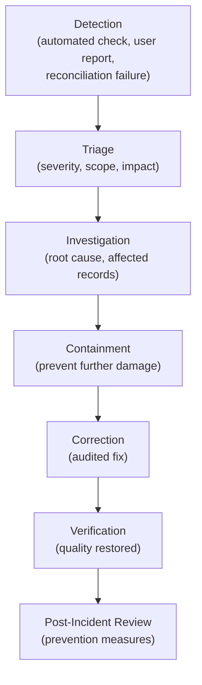

# Data Quality and Governance

## Metadata

| Field | Value |
|-------|-------|
| Title | Kairo Data Quality, Stewardship and Governance Architecture |
| Document ID | KAI-DATA-012 |
| Status | Draft |
| Version | 0.1 |
| Target Release | V1 |
| Owner | Data Governance and Quality Architect |
| Created | 2026-07-20 |
| Last Updated | 2026-07-20 |
| Reviewers | TODO |
| Related Documents | [Data Ownership](./Data-Ownership.md), [Data Modeling Principles](./Data-Modeling-Principles.md), [Reporting and Analytics Architecture](./Reporting-and-Analytics-Architecture.md), [Secure Development Lifecycle](../Security/Secure-Development-Lifecycle.md), [Data Architecture](./Data-Architecture.md), [Data Classification and Sensitivity](./Data-Classification-and-Sensitivity.md) |
| Dependencies | [Data Ownership](./Data-Ownership.md), [Data Architecture](./Data-Architecture.md) |

---

## Purpose

This document defines Kairo's approach to data quality, stewardship, and governance — the practices that ensure platform data is correct, complete, consistent, and trustworthy throughout its lifecycle.

Data quality is not a feature that can be bolted on later. It must be designed into every module from the start, with clear ownership, measurable dimensions, and defined responses to quality failures. This document establishes those rules.

---

## Scope

This document covers:

- Data quality dimensions and their measurement.
- Stewardship responsibilities across organizational roles.
- Quality controls per domain area.
- Governance processes for data contracts, metrics, reference data, and deprecation.
- Incident response for data quality failures.
- Future governance maturity direction.

This document does not cover:

- Specific governance software or tooling products.
- Database schema validation rules (defined per module).
- Data protection and encryption (see [Data Protection](../Security/Data-Protection.md)).
- Tenant isolation enforcement (see Multi-Tenancy architecture).

---

## Mandatory Statements

| Statement | Rationale |
|-----------|-----------|
| **Validation at the UI is insufficient** | UI validation improves UX but does not protect the system. Backend validation is authoritative. UI-only validation is a bug. |
| **Invalid upstream data must not be silently accepted** | Silent acceptance of bad data poisons downstream consumers. Invalid data must be rejected or quarantined with notification. |
| **Corrections must preserve auditability** | Correcting data without recording the correction destroys accountability. Every correction is an auditable event. |
| **Duplicate detection does not automatically justify automatic merging** | Merging duplicates can destroy data. Detection and resolution are separate steps. Automatic merging requires explicit governance approval. |
| **Data-quality rules belong with the owning domain** | The module that owns the data defines and enforces its quality rules. External modules do not impose quality rules on data they do not own. |
| **Analytical transformations must remain traceable** | Derived data must trace back to its source. Untraceable transformations create data that cannot be verified or corrected. |
| **Data quality and data correctness are shared responsibilities but require one accountable owner** | Many roles contribute to quality. One role is accountable per data domain. Shared accountability is no accountability. |
| **Future data catalog tooling is not required for V1** | V1 achieves governance through documentation, code-level validation, and module ownership. Catalog tooling is future investment. |

---

## Data Quality Dimensions

### 1. Data Quality Definition

Data quality is the degree to which data serves its intended purpose — correctly, completely, consistently, and within the expected timeframe. Quality is not absolute; it is measured relative to the data's purpose and consumers.

### 2. Accuracy

| Aspect | Detail |
|--------|--------|
| Definition | Data correctly represents the real-world entity or event it describes |
| Example | A product price of $29.99 accurately reflects the configured price |
| Measurement | Comparison against authoritative source or real-world validation |
| Failure | Inaccurate data leads to incorrect business outcomes (wrong charges, wrong inventory) |

### 3. Completeness

| Aspect | Detail |
|--------|--------|
| Definition | All required data elements are present and populated |
| Example | An order has customer reference, line items, totals, and status |
| Measurement | Percentage of records with all required fields populated |
| Failure | Incomplete data prevents processing or creates ambiguity |

### 4. Consistency

| Aspect | Detail |
|--------|--------|
| Definition | Data does not contradict itself across representations or time |
| Example | Order total equals sum of line items. Inventory count matches movement history. |
| Measurement | Cross-field and cross-module reconciliation checks |
| Failure | Inconsistent data destroys trust and creates investigation overhead |

### 5. Validity

| Aspect | Detail |
|--------|--------|
| Definition | Data conforms to defined rules, formats, and constraints |
| Example | Email addresses match email format. Currency codes are ISO 4217. Quantities are non-negative. |
| Measurement | Validation rule pass rate |
| Failure | Invalid data may be rejected by downstream systems or cause processing errors |

### 6. Timeliness

| Aspect | Detail |
|--------|--------|
| Definition | Data is available when needed and reflects an acceptably recent state |
| Example | Inventory levels reflect movements within the last minute for operational use |
| Measurement | Lag between real-world event and data availability |
| Failure | Stale data leads to decisions based on outdated information |

### 7. Uniqueness

| Aspect | Detail |
|--------|--------|
| Definition | Each real-world entity is represented exactly once in its authoritative store |
| Example | One customer record per customer. One product per SKU within a catalog. |
| Measurement | Duplicate detection rate |
| Failure | Duplicates fragment data, split history, and complicate reporting |

### 8. Traceability

| Aspect | Detail |
|--------|--------|
| Definition | Data origin and transformation history can be determined |
| Example | A report value traces back to specific orders which trace to API requests |
| Measurement | Ability to follow data lineage from consumption to source |
| Failure | Untraceable data cannot be verified, corrected, or audited |

### 9. Integrity

| Aspect | Detail |
|--------|--------|
| Definition | Relationships between data elements are maintained and correct |
| Example | An order line item references a valid product. A payment references a valid order. |
| Measurement | Referential integrity checks, orphan detection |
| Failure | Broken references create processing failures and data inconsistency |

---

## Quality Dimension Matrix

| Dimension | Measurable | V1 Enforcement | V1 Detection | Future Enhancement |
|-----------|:---:|:---:|:---:|:---:|
| Accuracy | Conceptually (against source) | Domain validation | Manual review, reconciliation | Automated accuracy checks |
| Completeness | Yes (required field %) | Required field validation | Validation rejection counts | Completeness dashboards |
| Consistency | Yes (cross-field checks) | Module-internal invariants | Reconciliation checks | Cross-module consistency monitoring |
| Validity | Yes (rule pass rate) | Backend validation rules | Validation error logs | Validation analytics |
| Timeliness | Yes (lag measurement) | Freshness metadata | Freshness monitoring | SLA-based freshness alerts |
| Uniqueness | Yes (duplicate rate) | Unique constraints, idempotency | Constraint violations | Duplicate detection service |
| Traceability | Qualitative | Audit events, correlation IDs | Audit query | Data lineage tooling |
| Integrity | Yes (orphan count) | Foreign key constraints, domain rules | Constraint violations | Integrity scanning |

---

## Data Stewardship

### 10. Data Stewardship

Data stewardship assigns accountability for data quality to specific roles. Stewardship does not mean a single person does all quality work — it means one role is accountable when quality degrades.

| Principle | Detail |
|-----------|--------|
| One accountable owner per data domain | The domain owner is ultimately accountable for data quality in their domain |
| Shared contribution | Many roles contribute (developers, operators, support, tenants) — but accountability is singular |
| Stewardship is ongoing | Quality is maintained continuously, not checked once |
| Stewardship survives team changes | Accountability transfers with domain ownership, not with individuals |

### 11. Domain Ownership

Data quality rules belong with the owning domain. The module that is authoritative for data defines:

- What constitutes valid data (validation rules).
- What constitutes complete data (required fields).
- What constitutes consistent data (invariants).
- How quality is measured (metrics).
- How quality incidents are handled (response process).

See [Data Ownership](./Data-Ownership.md) for authoritative ownership assignments.

### 12. Validation Ownership

| Layer | Validates | Authoritative? |
|-------|-----------|:-:|
| UI / Client | Format hints, immediate feedback | No |
| API Gateway | Authentication, rate limits, format | No |
| Module API layer | Input shape, required fields, basic format | Partially |
| Domain layer | Business rules, invariants, state transitions | **Yes** |
| Persistence layer | Constraints, uniqueness, referential integrity | **Yes** |

**Validation at the UI is insufficient.** The domain layer and persistence layer are the authoritative validators. Any data that passes UI validation must still pass domain validation. Backend rejection of UI-passed data is correct behavior, not a bug.

### 13. Correction Ownership

| Correction Type | Owner | Process |
|----------------|-------|---------|
| Data entry error by tenant | Tenant administrator | Self-service correction through authorized APIs |
| System-introduced error | Module team | Investigation → fix → audited correction |
| Integration error (upstream) | Integration owner + module team | Quarantine → investigation → correction or rejection |
| Bulk data issue | Data steward (module team) | Root cause → correction plan → audited batch correction |
| Historical correction | Module team + governance review | Impact assessment → approved correction → audit record |

**Corrections must preserve auditability.** Every correction creates an audit record showing: what was changed, from what value, to what value, by whom, when, and why.

---

## Quality Incidents

### 14. Data-Quality Incidents

A data-quality incident occurs when data in the platform does not meet its defined quality requirements and the issue impacts business operations, reporting accuracy, or data consumers.

#### Incident Severity

| Severity | Definition | Example | Response |
|----------|-----------|---------|----------|
| Critical | Data corruption affecting financial accuracy or tenant isolation | Payments applied to wrong tenant. Orders with incorrect totals. | Immediate investigation. Halt affected processing. |
| High | Significant data quality degradation affecting business decisions | Inventory counts incorrect. Customer data incomplete. | Same-day investigation. Correction plan within 24h. |
| Medium | Quality degradation noticed but workaround exists | Duplicate records detected. Stale analytics data. | Investigation within 48h. Correction plan within 1 week. |
| Low | Minor quality issue with negligible impact | Formatting inconsistency. Optional field missing. | Logged. Addressed in normal sprint work. |

#### Incident Workflow

---

## Governance Areas

### 15. Reference-Data Governance

| Aspect | Detail |
|--------|--------|
| Definition | Data that is shared across modules and provides standardized values (currencies, countries, statuses, categories) |
| Ownership | Platform team owns platform-level reference data. Modules own domain-specific reference data. |
| Change governance | Reference data changes are versioned. Breaking changes follow deprecation rules. |
| Validation | Modules validate against current reference data values |
| V1 approach | Code-defined reference data with version tracking. No external reference data service. |

### 16. Metric Governance

| Aspect | Detail |
|--------|--------|
| Definition | Named, versioned, documented measurements used for reporting and decision-making |
| Ownership | Metrics are owned by the domain that produces the underlying data |
| Change governance | Metric definition changes are versioned. Historical values reference their computation version. |
| Consistency | Same metric name always means the same computation |
| See also | [Reporting and Analytics Architecture](./Reporting-and-Analytics-Architecture.md) — Metric Definitions section |

### 17. Data-Contract Governance

| Aspect | Detail |
|--------|--------|
| Definition | Agreements between data producers and consumers about shape, quality, and availability |
| Explicit contracts | Module query interfaces define the contract. Schema, required fields, and guarantees are documented. |
| Breaking changes | Require versioning and migration path. Not introduced silently. |
| Monitoring | Contract violations (unexpected nulls, format changes) are detected and reported |
| V1 approach | Module API contracts serve as data contracts. Documented and tested. |

### 18. Import Quality

**Invalid upstream data must not be silently accepted.**

| Rule | Detail |
|------|--------|
| Validation on import | All imported data passes through the same validation as API-submitted data |
| Rejection over corruption | Invalid import rows are rejected, not silently modified or partially imported |
| Quarantine | Invalid records are quarantined with clear error descriptions for correction |
| Notification | Import failures are reported to the initiating user/system |
| Audit | Import operations are audit-logged (source, count, accepted, rejected, timestamp) |
| Idempotency | Re-importing the same data does not create duplicates |

### 19. Integration Quality

| Rule | Detail |
|------|--------|
| External data is untrusted | Data from external systems is validated as if it were user input |
| Mapping validation | Field mappings between external systems and Kairo are explicitly defined and validated |
| Error isolation | Integration failures do not corrupt existing platform data |
| Monitoring | Integration data quality is monitored (rejection rates, format issues) |
| Responsibility | The integration owner is responsible for data quality at the integration boundary |

### 20. Duplicate Resolution

**Duplicate detection does not automatically justify automatic merging.**

| Rule | Detail |
|------|--------|
| Detection and resolution are separate | Detecting a potential duplicate is an observation. Resolving it is a decision. |
| Automatic merging requires governance | Automatic merge rules must be explicitly defined, tested, and approved |
| Merge preserves history | When duplicates are merged, the history of both records is preserved |
| Merge is auditable | Who merged, when, what was combined, what was discarded |
| V1 approach | Duplicate prevention through unique constraints and idempotency. No automatic merge in V1. Manual resolution through support/admin. |

### 21. Reconciliation

| Rule | Detail |
|------|--------|
| Cross-module reconciliation | Data that spans modules (orders → payments) must reconcile at boundaries |
| Financial reconciliation | Financial totals must trace to individual transactions |
| Reconciliation failures are incidents | A reconciliation that does not balance triggers investigation |
| Frequency | Critical reconciliation (financial) is frequent. Others are periodic. |
| V1 approach | Manual reconciliation through module query APIs. Automated reconciliation is future. |

### 22. Historical Correction

| Rule | Detail |
|------|--------|
| Corrections do not rewrite history | The original record and the correction are both preserved |
| Correction event | A correction creates a new event/record that references the original and explains the change |
| Impact assessment | Before correcting historical data, downstream impact is assessed (reports, analytics, integrations) |
| Authorization | Historical corrections require elevated authorization (not standard user action) |
| Audit | Full audit trail: original value, corrected value, reason, authorizer, timestamp |

### 23. Auditability

| Rule | Detail |
|------|--------|
| All mutations are auditable | Create, update, delete operations on business data produce audit records |
| Corrections are auditable | Data corrections are a special case of mutation — always audited |
| Bulk operations are auditable | Bulk imports, bulk corrections, and bulk deletions are individually recorded |
| Audit is immutable | Audit records cannot be modified or deleted by the same system that created them |
| Audit retention | Audit data is retained per compliance and governance requirements |

### 24. Data Lineage

**Analytical transformations must remain traceable.**

| Rule | Detail |
|------|--------|
| Source traceability | Any derived or aggregated data can identify its source records |
| Transformation documentation | How data was transformed from source to destination is documented |
| Report lineage | Report values trace to specific queries against specific data |
| V1 approach | Lineage is maintained through code documentation, module ownership, and audit trails. No lineage tooling in V1. |
| Future | Data lineage tooling that automatically tracks data flow across modules |

### 25. Data Catalog Direction

**Future data catalog tooling is not required for V1.**

| Aspect | V1 Approach | Future Direction |
|--------|-------------|-----------------|
| Data discovery | Documentation in this repository. Module READMEs describe their data. | Searchable data catalog with metadata |
| Schema documentation | Module specifications. EF Core model documentation. | Auto-generated schema catalog |
| Ownership lookup | Data Ownership document | Catalog with ownership metadata |
| Quality metrics | Manual monitoring. Validation error logs. | Quality dashboards per domain |
| Lineage | Code-level documentation | Visual lineage mapping |

### 26. Governance Reviews

| Review Type | Frequency | Participants | Focus |
|-------------|-----------|-------------|-------|
| Data quality review | Per sprint (if issues exist) | Module team, data steward | Quality metrics, open incidents, prevention |
| Data contract review | On change proposal | Producer team, consumer teams | Breaking changes, migration, compatibility |
| Reference data review | On change proposal | Platform team, affected modules | Impact assessment, versioning |
| Metric definition review | On new metric or change | Analytics, domain owner | Definition clarity, computation accuracy |
| Governance maturity review | Quarterly | Architecture team | Maturity progression, tooling needs |

### 27. Deprecation

| Rule | Detail |
|------|--------|
| Deprecation is announced | Data fields, contracts, or reference values being removed are deprecated before removal |
| Deprecation period | Sufficient time for consumers to migrate (minimum one release cycle) |
| Deprecation is visible | Deprecated elements are marked in documentation and (where possible) in API responses |
| Removal follows deprecation | Data elements are not removed without prior deprecation notice |
| Audit | Deprecation decisions are recorded with rationale and timeline |

### 28. Future Enterprise Governance

| Maturity Level | Characteristics | Kairo Target |
|---------------|----------------|:---:|
| Level 1: Ad-hoc | No formal quality processes. Issues found reactively. | — |
| Level 2: Defined | Quality dimensions defined. Ownership assigned. Validation enforced. | V1 |
| Level 3: Measured | Quality metrics tracked. Incidents managed formally. Reconciliation automated. | V2 |
| Level 4: Managed | SLAs on data quality. Automated monitoring. Data catalog operational. Lineage tracked. | V3 |
| Level 5: Optimized | Predictive quality. Self-healing data pipelines. Enterprise governance tooling. | Future |

---

## Ownership Matrix

### Responsibility Assignment

| Responsibility | Product | Domain Owner | Module Owner | Data Steward | Security | Operations | Support | Analytics | Integrations | Tenant Admin |
|---------------|:---:|:---:|:---:|:---:|:---:|:---:|:---:|:---:|:---:|:---:|
| Define data requirements | **A** | C | C | I | I | — | I | C | C | — |
| Define validation rules | I | **A** | R | C | C | — | — | — | C | — |
| Implement validation | — | C | **A** | — | R | — | — | — | — | — |
| Monitor data quality | — | I | C | **A** | — | R | I | C | C | — |
| Investigate quality incidents | — | C | **A** | R | C | C | I | I | C | — |
| Correct data errors | — | A | **R** | C | — | — | I | — | — | I |
| Define metrics | C | **A** | C | C | — | — | — | R | — | — |
| Manage reference data | C | C | R | **A** | — | — | — | — | — | — |
| Import quality assurance | — | C | R | C | — | — | — | — | **A** | I |
| Export governance | — | C | R | C | **A** | — | — | C | — | I |
| Reconciliation | — | C | R | **A** | — | — | — | C | C | — |
| Duplicate resolution | — | A | R | **C** | — | — | R | — | — | I |
| Historical correction approval | — | **A** | R | C | I | — | — | I | — | — |
| Deprecation decision | C | **A** | C | C | I | I | I | I | I | I |

**Legend:** A = Accountable, R = Responsible, C = Consulted, I = Informed

---

## Quality Controls by Domain

### Product Catalog

| Dimension | Control | V1 Enforcement |
|-----------|---------|:-:|
| Accuracy | Product names, descriptions match reality | Tenant responsibility (platform validates format) |
| Completeness | Required fields: name, at least one price, status | Backend validation |
| Consistency | Active product has valid pricing. Published product has required fields. | Domain invariants |
| Validity | SKU format, price format (non-negative, valid currency) | Validation rules |
| Uniqueness | SKU unique within catalog. No duplicate products. | Unique constraints |

### Pricing

| Dimension | Control | V1 Enforcement |
|-----------|---------|:-:|
| Accuracy | Prices reflect intended values (no decimal errors) | Non-negative validation. Currency precision rules. |
| Completeness | Active products have at least one price | Domain invariant |
| Consistency | Price currency matches store currency configuration | Cross-field validation |
| Validity | Non-negative amounts. Valid currency codes. Precision limits. | Validation rules |
| Timeliness | Price changes effective immediately or at scheduled time | Event-driven propagation |

### Inventory

| Dimension | Control | V1 Enforcement |
|-----------|---------|:-:|
| Accuracy | Stock count matches physical reality | Reconciliation (periodic manual) |
| Completeness | All tracked products have inventory records | System-enforced on product creation |
| Consistency | Available = On-hand - Reserved. Movements net to current balance. | Domain invariants |
| Validity | Non-negative quantities (or explicitly allowed negative for backorder) | Validation rules |
| Timeliness | Stock reflects recent movements within seconds | Transactional updates |
| Integrity | Inventory records reference valid products | Referential constraints |

### Customer Data

| Dimension | Control | V1 Enforcement |
|-----------|---------|:-:|
| Accuracy | Customer details match reality | Tenant responsibility (platform validates format) |
| Completeness | Required identification fields present | Backend validation |
| Validity | Email format, phone format, address structure | Validation rules |
| Uniqueness | No duplicate customers within an organization | Unique constraints (email per org) |
| Privacy | Personal data classified and handled per classification | [Data Classification](./Data-Classification-and-Sensitivity.md) |

### Orders

| Dimension | Control | V1 Enforcement |
|-----------|---------|:-:|
| Accuracy | Order totals correct. Line items match products and prices. | Computed totals validated |
| Completeness | Required fields: customer, at least one line, shipping address | Domain validation |
| Consistency | Order total = sum(line totals) + shipping - discounts. Status transitions valid. | Domain invariants |
| Validity | Quantities positive. References valid. Status values defined. | Validation rules |
| Integrity | Line items reference valid products. Customer reference valid. | Domain + referential |
| Timeliness | Order state reflects real-time processing state | Event-driven status updates |

### Payments

| Dimension | Control | V1 Enforcement |
|-----------|---------|:-:|
| Accuracy | Payment amounts match order amounts. Gateway responses recorded accurately. | Cross-reference validation |
| Completeness | Payment records include amount, currency, status, reference | Required fields |
| Consistency | Total payments against order ≤ order total | Domain invariant |
| Integrity | Payment references valid order | Referential constraint |
| Reconciliation | Payment records reconcile with gateway records | Manual reconciliation (V1) |

### Refunds

| Dimension | Control | V1 Enforcement |
|-----------|---------|:-:|
| Accuracy | Refund amount ≤ original payment | Domain rule |
| Completeness | Refund references original payment, reason documented | Required fields |
| Consistency | Total refunds ≤ total payments per order | Domain invariant |
| Integrity | Refund references valid payment and order | Referential constraints |
| Auditability | Full refund history with reasons | Audit events |

### Integrations

| Dimension | Control | V1 Enforcement |
|-----------|---------|:-:|
| Accuracy | Mapped data matches source system semantics | Integration validation |
| Completeness | Required mapping fields populated | Import validation |
| Validity | External data passes same validation as API data | Validation pipeline |
| Timeliness | Integration data reflects acceptable lag | Freshness metadata |
| Traceability | External source identified on imported records | Source tracking |

### Imports

| Dimension | Control | V1 Enforcement |
|-----------|---------|:-:|
| Validity | Every row validated before acceptance | Row-level validation |
| Completeness | Required fields enforced per row | Validation rules |
| Uniqueness | Duplicate detection against existing data | Idempotency keys |
| Quarantine | Invalid rows quarantined with error detail | Rejection reporting |
| Auditability | Import logged (source, count, accepted/rejected) | Audit event |

### Reports

| Dimension | Control | V1 Enforcement |
|-----------|---------|:-:|
| Accuracy | Report data matches authoritative source | Reconciliation checks |
| Timeliness | Data freshness visible to consumer | Freshness metadata |
| Traceability | Report values traceable to source queries | Query documentation |
| Consistency | Same metric shows same value across report surfaces | Metric governance |

---

## V1 Governance Baseline

V1 implements Level 2 (Defined) governance maturity:

| Capability | V1 Implementation |
|-----------|------------------|
| Quality dimensions | Defined in this document. Applied per domain. |
| Validation | Backend validation in domain layer. Persistence constraints. |
| Ownership | Assigned per [Data Ownership](./Data-Ownership.md). Module teams are accountable. |
| Incidents | Severity-based triage. Module team investigates and corrects. |
| Corrections | Audited. API-driven. Authorization required for historical corrections. |
| Reconciliation | Manual through module query APIs. Financial reconciliation required. |
| Reference data | Code-defined. Versioned with releases. |
| Data contracts | Module API specifications serve as contracts. |
| Duplicate prevention | Unique constraints and idempotency. Manual resolution. |
| Import quality | Row-level validation. Quarantine for invalid records. |
| Lineage | Documentation-based. Audit trail provides partial lineage. |
| Catalog | This repository serves as the data catalog. Module docs describe data. |
| Metrics | Defined per domain. Documented in module specifications. |
| Governance reviews | As-needed during sprint reviews. Formal quarterly review. |

---

## Future Maturity Model

| Version | Maturity | Additions |
|---------|----------|-----------|
| V1 | Level 2: Defined | Dimensions defined. Ownership assigned. Validation enforced. Incidents managed. Manual reconciliation. |
| V2 | Level 3: Measured | Quality metrics dashboards. Automated reconciliation for financial data. Data contract monitoring. Integration quality scoring. Duplicate detection service. |
| V3 | Level 4: Managed | Data catalog operational. Automated lineage tracking. Quality SLAs per domain. Predictive quality alerts. Self-service quality dashboards for tenants. |
| Future | Level 5: Optimized | Self-healing data pipelines. AI-assisted quality monitoring. Enterprise governance tooling. Cross-platform data quality federation. |

---

## Version Gate

| Version | Data Quality and Governance Gate |
|---------|--------------------------------|
| V1 | Quality dimensions defined and applied per domain. Backend validation authoritative. Domain ownership enforced. Quality incidents triaged by severity. Corrections audited. Reconciliation manual but required for financial data. Import validation enforced with quarantine. Reference data code-defined and versioned. |
| V2 | Quality metrics measured and dashboarded. Automated financial reconciliation. Data contract monitoring with alerting. Integration quality scoring. Duplicate detection improvements. |
| V3 | Data catalog operational. Lineage tooling deployed. Quality SLAs defined and monitored. Tenant-facing quality visibility. Governance reviews automated. |

---

## Decision Summary

| Decision | Rationale |
|----------|-----------|
| Backend validation is authoritative | UI validation is a convenience for users. Backend validation protects the system. This distinction prevents "validated in the browser" from being treated as system-validated. |
| Domain owner is accountable for quality | Distributed ownership without accountability creates orphan data. One accountable owner per domain ensures issues are resolved. |
| No automatic duplicate merging in V1 | Automatic merging risks data loss. V1 prevents duplicates through constraints. Resolution is manual and deliberate. |
| Manual reconciliation in V1 | Automated reconciliation requires infrastructure. V1 scale allows manual reconciliation through APIs. |
| Documentation-as-catalog in V1 | Catalog tooling is infrastructure investment. V1 data volume and team size does not require dedicated tooling. |
| Corrections as new events (not overwrites) | Overwriting destroys history. Corrections as events preserve the original and the change, enabling audit and rollback. |
| Level 2 governance for V1 | V1 needs defined quality processes without the overhead of full enterprise governance. Level 2 is achievable and meaningful. |

---

## Alternatives Considered

| Alternative | Rejected Because |
|------------|-----------------|
| UI validation as sufficient | UI can be bypassed (API clients, integrations, imports). Backend must be authoritative. |
| Centralized data quality team | V1 team size does not support dedicated quality roles. Domain ownership distributes the work effectively. |
| Automatic duplicate merging | Risk of data loss outweighs convenience. Detection and resolution must be separate. |
| Data catalog tooling in V1 | Premature investment. Documentation serves the purpose at V1 scale. |
| Quality enforcement only at persistence layer | Too late. Invalid data should be rejected at the domain layer with meaningful error messages, not as constraint violations. |
| No formal governance | Informal quality processes lead to gradual data degradation. Lightweight but explicit governance prevents drift. |

---

## Architecture Impact

| Concern | Impact |
|---------|--------|
| Module design | Every module must implement domain-layer validation that is authoritative. Validation rules are not optional for "simple" fields. |
| Data access | Query contracts expose data quality metadata (freshness, completeness) where applicable. |
| Events | Data corrections produce domain events enabling downstream consumers to update. |
| Persistence | Database constraints (unique, check, not-null, foreign key) serve as the final quality safety net, not the primary validation. |
| Imports | Import pipelines include validation, quarantine, and reporting as architectural requirements. |
| Integration | External system data is untrusted by default. Same validation path as user input. |
| Audit | All corrections and quality incidents are captured in the audit stream. |

---

## Implementation Impact

| Area | Impact |
|------|--------|
| Modules | Must implement domain-layer validation (FluentValidation or equivalent). Must define quality rules in module specifications. Must handle corrections as auditable operations. Must support reconciliation queries. |
| Platform | Must provide import infrastructure with validation and quarantine. Must provide correction audit support. Must enforce that all data paths pass through validation (no backdoors). |
| Operations | Must monitor validation rejection rates. Must triage quality incidents by severity. Must support reconciliation operations. |
| Testing | Must test validation rules comprehensively. Must test that invalid data is rejected (not just that valid data is accepted). Must test correction auditability. |

---

## Security Responsibilities

| Role | Quality and Governance Responsibilities |
|------|---------------------------------------|
| Data Governance Architect | Defines quality dimensions, governance processes, maturity targets. Reviews governance effectiveness. |
| Module Teams | Implement validation. Own domain quality. Investigate and correct quality incidents in their domain. |
| Platform Team | Provides validation infrastructure, import framework, audit capabilities. Enforces that all paths are validated. |
| Security Team | Validates that quality processes do not bypass security controls. Reviews export governance. Ensures corrections are authorized. |
| Operations | Monitors quality metrics. Escalates quality incidents. Manages reconciliation schedules. |
| Support | Reports quality issues from tenants. Assists with correction workflows. |

---

## Multi-Tenancy Responsibilities

| Responsibility | Detail |
|---------------|--------|
| Tenant-scoped quality | Quality metrics and incidents are per-tenant. One tenant's quality issue does not affect others. |
| Tenant self-service | Tenants correct their own data through authorized APIs. Platform provides the tools. |
| Cross-tenant quality isolation | A quality incident in one tenant's data does not propagate to other tenants. |
| Platform quality | Platform-level quality (reference data, shared configuration) is the platform team's responsibility. |

---

## Out of Scope

This document does not define:

- Specific governance software or data catalog products.
- Individual module validation rule implementations (defined in module specs).
- Data protection or encryption mechanisms (see Security architecture).
- Tenant isolation enforcement mechanisms (see Multi-Tenancy architecture).
- Specific reconciliation algorithms or schedules (defined per module).
- Dashboard designs or quality reporting UI.

---

## Future Considerations

- **Data catalog** — Searchable metadata repository for all platform data assets.
- **Automated lineage** — Tools that automatically trace data flow across modules.
- **Quality SLAs** — Contractual quality guarantees per data domain with monitoring.
- **Self-healing pipelines** — Automated correction of known quality patterns.
- **Tenant quality dashboards** — Tenants see quality metrics for their own data.
- **Quality scoring** — Composite quality score per data domain for governance reviews.
- **ML-assisted quality** — Machine learning models detecting quality anomalies.

---

## Future Refactoring Triggers

This document should be revisited when:

- Quality incidents exceed what manual processes can manage (trigger for quality tooling).
- Data volume requires automated reconciliation (trigger for reconciliation infrastructure).
- Team size requires dedicated data steward roles (trigger for governance role formalization).
- Cross-module data quality issues emerge (trigger for cross-module quality monitoring).
- Tenant self-service quality needs exceed API capabilities (trigger for quality dashboard).
- Data catalog becomes necessary for team productivity (trigger for catalog tooling).
- Regulatory requirements mandate formal data governance evidence (trigger for governance tooling).

---

## Change History

| Version | Date | Author | Description |
|---------|------|--------|-------------|
| 0.1 | 2026-07-20 | Data Governance and Quality Architect | Initial draft |
