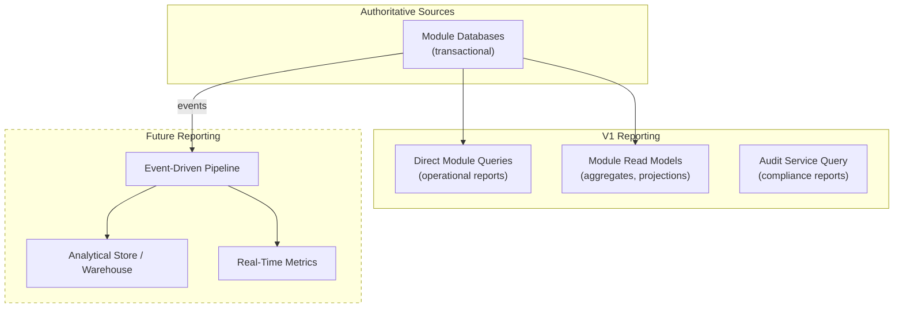

# Reporting and Analytics Architecture

## Metadata

| Field | Value |
|-------|-------|
| Title | Kairo Reporting and Analytics Data Architecture |
| Document ID | KAI-DATA-011 |
| Status | Draft |
| Version | 0.1 |
| Target Release | V1 |
| Owner | Reporting, Analytics and Data Products Architect |
| Created | 2026-07-20 |
| Last Updated | 2026-07-20 |
| Reviewers | TODO |
| Related Documents | [Data Architecture](./Data-Architecture.md), [Data Ownership](./Data-Ownership.md), [Transaction and Consistency](./Transaction-and-Consistency-Architecture.md), [Data Classification and Sensitivity](./Data-Classification-and-Sensitivity.md), [Cross-Tenant Operations](../Multi-Tenancy/Cross-Tenant-Operations.md), [Data Access and Persistence](./Data-Access-and-Persistence.md), [Tenant Isolation](../Multi-Tenancy/Tenant-Isolation.md) |
| Dependencies | [Data Architecture](./Data-Architecture.md), [Data Ownership](./Data-Ownership.md) |

---

## Purpose

This document defines how the Kairo platform serves reporting, analytics, and data-consumption needs — from simple operational queries through complex analytical workloads and future AI/ML consumption.

Reporting and analytics present a unique architectural challenge: they need broad read access to data across modules while respecting module ownership, tenant isolation, and transactional workload stability. This document establishes how these needs are served without creating architectural shortcuts.

---

## Scope

This document covers:

- Reporting categories and their data access patterns.
- Operational, transactional, and analytical workload separation.
- Tenant and platform analytics governance.
- Read models, projections, and future data platform direction.
- Privacy, masking, and tenant isolation for reporting.
- V1 practical approach and future evolution.

This document does not cover:

- Dashboard UI design or visualization tools.
- Specific SQL queries or report definitions.
- Vendor-specific data warehouse products.
- Specific metric formulas (defined per module/product).

---

## Mandatory Principles

| Principle | Rationale |
|-----------|-----------|
| **Reports do not become authoritative owners of transactional data** | Reports consume data. They do not become the source of truth regardless of how much processing they do. |
| **Tenant reports must remain tenant-isolated** | A tenant's reports show only their data. No cross-tenant leakage in reporting. |
| **Platform-wide analytics require explicit authorization and governance** | Aggregate analytics across tenants requires de-identification and purpose limitation. Not casually accessible. |
| **Metrics require stable definitions** | A metric that changes meaning without documentation creates confusion. Metric definitions are versioned. |
| **Financial reports require reconciliation with authoritative transactions** | Financial reports must tie back to authoritative transactional records. Discrepancies are investigated. |
| **Data freshness must be visible** | Report consumers must know when the data was last updated. Hidden lag creates false confidence. |
| **Analytical lag must not be hidden** | If a report is 10 minutes behind real-time, the consumer must see this. |
| **Exported data remains sensitive after leaving the platform** | An exported report containing customer data is still confidential. Export classification applies. |
| **Heavy analytical queries must not destabilize transactional workloads** | Analytical queries compete with operational queries for resources. Separation is required at scale. |
| **Future AI usage must respect data ownership, privacy and tenant boundaries** | AI/ML consuming platform data inherits all data governance rules. AI access is not a bypass. |

---

## Reporting Categories

### 1. Operational Reporting

Real-time or near-real-time visibility into current platform state.

| Aspect | Detail |
|--------|--------|
| Purpose | Current state visibility (what is happening now) |
| Examples | Active orders, current inventory levels, today's revenue, real-time error rates |
| Data freshness | Seconds to minutes |
| Data source | Transactional database (direct read) or very-fresh read model |
| Tenant scope | Single tenant's current state |
| V1 approach | Direct queries against the transactional database (module contracts) |

### 2. Transactional Reporting

Reports derived from individual business transactions.

| Aspect | Detail |
|--------|--------|
| Purpose | Transaction-level detail (what happened) |
| Examples | Order details, payment history, inventory movement log, customer activity |
| Data freshness | Real-time (reads from authoritative source) |
| Data source | Module query contracts |
| Tenant scope | Single tenant's transactions |
| V1 approach | Module query APIs with appropriate filtering |

### 3. Analytical Reporting

Aggregated, comparative, and trend-based analysis over time.

| Aspect | Detail |
|--------|--------|
| Purpose | Patterns, trends, aggregates (what does the data tell us over time) |
| Examples | Monthly revenue trends, conversion rates, inventory turnover, customer lifetime value |
| Data freshness | Minutes to hours (acceptable lag) |
| Data source | Read models, projections, or dedicated analytical store (future) |
| Tenant scope | Single tenant's historical data |
| V1 approach | Module query APIs with aggregation. Dedicated read models for heavy queries. |

---

## Analytics Scope

### 4. Platform Analytics

Aggregate metrics across all tenants for platform operations.

| Aspect | Detail |
|--------|--------|
| Purpose | Platform health, capacity planning, product usage understanding |
| Governance | De-identified or aggregated. Never exposes individual tenant data. Authorized platform team only. |
| Examples | Total platform orders/day, API request volume, error rate distribution, feature adoption |
| V1 approach | Infrastructure metrics (Prometheus). Application-level aggregates from event counts. |

### 5. Tenant Analytics

Per-organization reporting on their own business data.

| Aspect | Detail |
|--------|--------|
| Purpose | Business intelligence for the organization |
| Governance | Strictly tenant-isolated. Only the tenant's own data. Accessible to authorized org users. |
| Examples | Revenue by store, top-selling products, customer acquisition, promotion effectiveness |
| V1 approach | Module query APIs with aggregation within the tenant boundary. |

### 6. Store Analytics

Per-store reporting within an organization.

| Aspect | Detail |
|--------|--------|
| Purpose | Store-level performance visibility |
| Governance | Within the organization. Store-scoped access for store users. Org-level users see all stores. |
| Examples | Store revenue, store-level inventory, store conversion rate |
| V1 approach | Store-filtered queries through module contracts. |

### 7–10. Domain-Specific Analytics

| Domain | Examples | V1 Source |
|--------|----------|-----------|
| Customer analytics | Customer count, acquisition rate, retention, segment distribution | Customer module queries |
| Product analytics | Views (future), variants sold, category performance | Order + Catalog module queries |
| Order analytics | Order volume, average order value, fulfillment time, return rate | Order module queries |
| Inventory analytics | Stock levels, turnover rate, low-stock alerts, reservation rate | Inventory module queries |

---

### 11. Financial Reporting Direction

| Aspect | Detail |
|--------|--------|
| Purpose | Revenue, costs, margins, reconciliation |
| Governance | Restricted to finance-authorized roles. Reconciled with authoritative transaction records. |
| **Financial reports require reconciliation with authoritative transactions** | Reports tie back to orders, payments, refunds. Discrepancies trigger investigation. |
| V1 approach | Order and payment data through module contracts. Manual reconciliation as needed. |
| Future | Dedicated financial reporting with automated reconciliation (ERP integration). |

### 12. Audit Reporting

| Aspect | Detail |
|--------|--------|
| Purpose | Compliance evidence, accountability, investigation |
| Source | Audit service (not transactional database) |
| Governance | Organization admins see their tenant's audit. Platform compliance sees all (authorized). |
| V1 approach | Audit query API with tenant-scoped filtering. |

---

## Reporting Freshness

### 13. Near-Real-Time Reporting

| Aspect | Detail |
|--------|--------|
| Freshness | Seconds to minutes |
| Use cases | Operational dashboards, inventory monitoring, active order tracking |
| Source | Transactional database or very-fresh read model |
| Cost | Queries impact transactional workload. Must be efficient. |
| V1 approach | Direct transactional DB queries with performance-aware design (indexes, limits). |

### 14. Batch Reporting

| Aspect | Detail |
|--------|--------|
| Freshness | Minutes to hours |
| Use cases | Daily summaries, weekly trends, monthly financial reports |
| Source | Read models updated periodically, or scheduled aggregation queries |
| Cost | Separated from real-time workload. Runs during low-traffic periods or against read replicas (future). |
| V1 approach | Scheduled queries during off-peak. Module-level aggregation endpoints. |

---

## Data Access Patterns for Reporting

### 15. Read Models

Dedicated data structures optimized for specific read/report patterns.

| Aspect | Detail |
|--------|--------|
| Purpose | Serve specific query patterns efficiently without impacting write workloads |
| Ownership | The module that owns the authoritative data |
| Update mechanism | Event-driven from authoritative writes |
| Consistency | Eventually consistent (bounded lag) |
| V1 direction | Select high-impact read models where transactional queries are insufficient |

### 16. Projections

Computed views of data tailored for specific consumption patterns.

| Aspect | Detail |
|--------|--------|
| Purpose | Pre-computed aggregates, denormalized views for reporting |
| Ownership | The producing module or a dedicated projection service |
| Update mechanism | Event-driven or periodic batch |
| Examples | Daily order summary projection, product sales aggregate, customer order count |
| V1 direction | Module-internal projections for frequently accessed aggregates |

### 17. Data Warehouse Direction (Future)

| Aspect | Detail |
|--------|--------|
| Purpose | Cross-module analytical queries at scale without impacting transactional systems |
| When needed | When analytical queries exceed transactional database capacity or require cross-module joins that violate module boundaries |
| Architecture direction | Separate analytical store fed by event-driven ETL/ELT |
| Tenant isolation | Maintained in the warehouse (tenant-scoped queries) |
| V1 status | Not required. Identified for future. Module-level reporting is sufficient for V1. |

### 18. Event-Driven Analytics Direction (Future)

| Aspect | Detail |
|--------|--------|
| Purpose | Stream processing for real-time analytics and metric computation |
| When needed | When real-time metrics at scale exceed what direct queries can provide |
| Architecture direction | Event consumers that compute metrics from domain events |
| V1 status | V1 publishes events. Future analytics pipelines consume them. The event architecture supports this without change. |

---

## Reporting Data Flow

---

## Export and Scheduling

### 19. Export Architecture

| Aspect | Detail |
|--------|--------|
| Purpose | Extract data from the platform for external consumption |
| Tenant scope | Exports are always scoped to the authenticated organization |
| Authorization | Requires explicit export permission. Audit-logged. |
| Classification | **Exported data remains sensitive after leaving the platform.** Export respects data classification. |
| Format | Machine-readable (CSV, JSON). Documented and stable. |
| Size limits | Exports are subject to size limits and rate limiting. |
| Lifecycle | Generated export files have a defined TTL (auto-deleted after download period). |
| V1 approach | Module-level export APIs with tenant scoping and authorization. |

### 20. Scheduled Reports (Future)

| Aspect | Detail |
|--------|--------|
| Purpose | Automated periodic report generation and delivery |
| V1 status | Not required for V1. Reports are generated on-demand through APIs. |
| Future direction | Scheduled jobs that generate reports and deliver via notification (email, webhook). |
| Governance | Same authorization and tenant scoping as on-demand reports. |

---

## Data Characteristics

### 21. Aggregate Metrics

| Rule | Description |
|------|-------------|
| Definition stability | **Metrics require stable definitions.** "Revenue" means the same thing today and tomorrow. Definition changes are versioned. |
| Computation source | Metrics are computed from authoritative data through defined formulas |
| Tenant scope | Tenant metrics use only that tenant's data |
| Platform scope | Platform metrics use aggregated, de-identified data |
| Freshness | Metric freshness is documented per metric (real-time vs. periodic) |

### 22. Historical Snapshots

| Rule | Description |
|------|-------------|
| Purpose | Point-in-time captures for trend analysis (e.g., end-of-day inventory levels) |
| Ownership | The module or projection that captures the snapshot |
| Immutability | Once captured, historical snapshots are not modified (they reflect the state at that moment) |
| Retention | Per analytical need (may be shorter than transactional data retention) |
| V1 direction | V1 does not implement formal historical snapshotting. Trend analysis uses transactional history (order dates, inventory movements). |

### 23. Data Freshness

**Data freshness must be visible. Analytical lag must not be hidden.**

| Report Type | Freshness Expectation | How Communicated |
|------------|----------------------|-----------------|
| Operational (real-time) | Seconds | "As of: [timestamp]" |
| Transactional detail | Real-time (authoritative source) | No lag disclaimer needed |
| Analytical aggregate | Minutes to hours | "Data as of: [last update timestamp]" |
| Scheduled report | Defined by schedule | "Generated: [timestamp], Data through: [timestamp]" |
| Export | Point-in-time snapshot | "Exported: [timestamp]" |

### 24. Reconciliation

**Financial reports require reconciliation with authoritative transactions.**

| Rule | Description |
|------|-------------|
| Financial reconciliation | Financial reports must trace to individual transactions. Totals must add up. |
| Discrepancy investigation | If a report disagrees with authoritative data, the authoritative source is correct. The report is investigated. |
| Cross-module reconciliation | Reports that combine data from multiple modules (orders + payments) must reconcile at the boundaries. |
| V1 approach | Manual reconciliation. Module APIs provide the authoritative detail for verification. |
| Future | Automated reconciliation checks on financial reporting. |

---

## Privacy and Access Control

### 25. Privacy and Masking

| Rule | Description |
|------|-------------|
| Classification applies to reports | Report data follows the same classification rules as API responses ([Data Classification](./Data-Classification-and-Sensitivity.md)) |
| Personal data masking | Reports containing personal data respect masking rules based on the viewer's access level |
| Aggregate over individual | Prefer aggregates over individual-level reports where the analytical goal allows |
| Export classification | Exported reports carry their classification. Recipients must handle accordingly. |
| De-identification for platform analytics | Platform-wide analytics use de-identified or aggregated data only |

### 26. Tenant Isolation

**Tenant reports must remain tenant-isolated.**

| Rule | Description |
|------|-------------|
| Reports query within tenant boundary | Every reporting query is scoped to the authenticated organization |
| No cross-tenant data in tenant reports | A tenant's report never includes data from another organization |
| Shared reporting infrastructure is scoped | Even if the underlying query runs on a shared database, results are tenant-filtered |
| Authorization per report type | Different reports may require different permission levels within the organization |

### 27. Cross-Tenant Platform Analytics

**Platform-wide analytics require explicit authorization and governance.**

| Rule | Description |
|------|-------------|
| De-identified only | Individual tenant identity is not visible in platform analytics |
| Aggregated | Data is summarized (counts, averages, distributions), not individual records |
| Authorized access | Only the platform team with explicit analytics authorization |
| Not an access bypass | Platform analytics does not grant access to individual tenant data |
| Governance | Follows rules in [Cross-Tenant Operations](../Multi-Tenancy/Cross-Tenant-Operations.md) |
| V1 approach | Infrastructure metrics (Prometheus). No tenant business data in platform analytics in V1. |

---

## Metric Governance

### 28. Metric Definitions

| Rule | Description |
|------|-------------|
| Documented | Every metric has a documented definition (what it measures, how it is calculated, from what source) |
| Versioned | Changes to metric definitions are versioned. Historical values reference their formula version. |
| Owned | Each metric has an owning team responsible for its accuracy |
| Source-traceable | Every metric can trace its computation to authoritative source data |
| Consistent | The same metric name always means the same thing across all reporting surfaces |

---

## Future Direction

### 29. Future Data Products

| Capability | Description | When |
|-----------|-------------|------|
| Self-service reporting | Tenants query and build their own reports | V2+ |
| Cross-module reporting | Reports that naturally span modules (order + fulfillment + payment) | V2+ (through projections) |
| Real-time dashboards | Streaming metrics for operational visibility | V2+ |
| Data export scheduling | Automated periodic data exports | V2+ |
| Benchmarking (opt-in) | Anonymized comparison against platform averages | V3+ (with governance) |
| Custom metric definitions | Tenants define their own computed metrics | V3+ |

### 30. Future AI and Machine-Learning Consumption

**Future AI usage must respect data ownership, privacy, and tenant boundaries.**

| Rule | Description |
|------|-------------|
| Data ownership respected | AI consumes data through defined contracts. It does not bypass module ownership. |
| Tenant isolation maintained | AI models for one tenant do not use another tenant's data (unless explicitly multi-tenant with de-identification). |
| Privacy preserved | AI training data is de-identified or uses consent-governed data. Personal data is not used for platform model training without governance. |
| Purpose limitation | AI data consumption is purpose-defined. "Train a model" is not a blanket access justification. |
| Consent-aware (future) | If AI uses tenant data for improvements, tenants must be informed and may opt out. |
| V1 status | No AI/ML consumption in V1. Events and data contracts are designed to support future AI consumption without structural change. |

---

## Analytical Options Evaluation

| Approach | When Appropriate | V1 Suitability | Future Suitability |
|----------|-----------------|:-:|:-:|
| Direct transactional queries | Operational reports, low-volume analytics | Yes | Yes (for real-time) |
| Module read models | Frequently accessed aggregates, list views | Yes | Yes |
| Materialized projections | Pre-computed summaries updated by events | Limited (select cases) | Yes |
| Read replicas | Separating analytical from transactional load | No (V1 single DB) | Yes |
| Data warehouse (ELT/ETL) | Heavy cross-module analytics at scale | No | Yes |
| Event-driven streaming analytics | Real-time metric computation | No | Yes |
| AI/ML pipelines | Predictive analytics, recommendations | No | Yes (V3+) |

### V1 Direction

V1 uses:
- **Direct transactional queries** for operational and transactional reporting (through module contracts with performance-aware design).
- **Select module read models** for frequently accessed aggregates where direct queries are insufficient.
- **No dedicated analytical infrastructure** — the transactional database serves reporting needs at V1 scale.

V1 does NOT implement:
- Data warehouse or analytical store.
- Event-driven streaming analytics.
- Cross-module reporting projections (reports stay within module boundaries).
- AI/ML consumption pipelines.

---

## Version Gate

| Version | Reporting and Analytics Gate |
|---------|----------------------------|
| V1 | Module query APIs serve operational and transactional reporting. Tenant isolation enforced on all reports. Basic aggregation endpoints available per module. Export with authorization and audit. Data freshness communicated. Financial reporting traces to authoritative transactions. Platform analytics limited to infrastructure metrics. |
| V2 | Dedicated read models for high-volume analytical queries. Read replicas evaluated for workload separation. Cross-module reporting through projections (event-driven). Scheduled report generation. Self-service export enhancements. |
| V3 | Analytical data store operational. Event-driven streaming metrics. AI/ML data consumption pipeline (governed). Cross-tenant benchmarking (opt-in, anonymized). Custom metric definitions. |

---

## Decision Summary

| Decision | Rationale |
|----------|-----------|
| Direct queries for V1 reporting | V1 data volume does not justify a separate analytical infrastructure. Direct queries are simpler and sufficient. |
| Module contracts for report access | Reports access data through the same contracts as APIs. No special "reporting bypass" that circumvents module boundaries. |
| No cross-module reporting joins in V1 | Cross-module joins create coupling. V1 reports stay within module boundaries. Cross-module correlation is future. |
| Platform analytics uses infrastructure metrics only (V1) | Avoids the complexity and governance burden of accessing tenant business data for platform analytics. |
| Freshness is visible, not hidden | Hidden lag creates false confidence in data accuracy. Visibility enables informed decisions. |
| Financial reconciliation is mandatory | Financial reports that do not reconcile with transactions are unreliable. Reconciliation is a requirement, not a nice-to-have. |
| AI consumption respects all governance | AI is not a special access category. All data ownership, privacy, and tenant rules apply. |

---

## Alternatives Considered

| Alternative | Rejected Because |
|------------|-----------------|
| Dedicated data warehouse in V1 | V1 data volume does not justify the operational overhead. Adding a warehouse prematurely creates maintenance burden without proportional value. |
| Cross-module reporting views in the database | Creates coupling between modules. Prevents independent module evolution. Violates ownership boundaries. |
| Platform analytics on tenant business data (V1) | Requires de-identification infrastructure, governance framework, and consent mechanisms. Too complex for V1. |
| No reporting architecture (ad-hoc queries) | Without architecture, reporting becomes informal database access that bypasses authorization, module boundaries, and tenant isolation. |
| Real-time streaming analytics in V1 | V1 does not need sub-second analytics. Event-driven streaming is infrastructure that should wait for validated need. |
| AI/ML access in V1 | No AI product exists in V1. Building data pipelines for a product that doesn't exist is premature. |

---

## Trade-offs

| Trade-off | Accepted Because |
|-----------|-----------------|
| Direct queries may impact transactional performance | V1 scale is manageable. Query optimization (indexes, limits, off-peak scheduling) mitigates. Read replicas are V2. |
| Module-boundary reporting limits cross-domain analysis | Cross-module correlation requires projections (V2). V1 provides per-module analytics which serves most V1 needs. |
| No real-time streaming limits operational dashboard freshness | V1 freshness is seconds-to-minutes (direct query). Sub-second is not required for V1 use cases. |
| Financial reconciliation is manual in V1 | Automated reconciliation requires infrastructure. V1 reconciles through module APIs manually. Sufficient at V1 scale. |
| No tenant self-service report builder | V1 provides API-based reporting. Custom visualization is the developer's domain (headless platform). |

---

## Architecture Impact

| Concern | Impact |
|---------|--------|
| Module design | Modules expose query contracts suitable for reporting (aggregation endpoints, filtered lists). High-traffic reporting patterns get dedicated read models. |
| Data access | Reporting queries use the same tenant-filtered, authorized data access as all other operations. No reporting backdoor. |
| Performance | Reporting queries are designed with indexes and limits in mind. Heavy queries are identified and optimized. |
| Events | Domain events published by modules support future event-driven analytics without module code changes. |
| Tenant isolation | All reporting respects tenant boundaries. Platform analytics uses de-identified aggregates only. |
| Export | Export endpoints follow data classification, authorization, and audit requirements. |

---

## Implementation Impact

| Area | Impact |
|------|--------|
| Modules | Must expose reporting-suitable query endpoints (aggregation, date-range filtering, pagination). Must support export in standard formats. Must communicate data freshness where lag exists. |
| Platform | Must enforce tenant isolation on all reporting paths. Must provide export infrastructure with authorization and audit. Must track data freshness for reporting endpoints. |
| Operations | Must monitor reporting query performance impact on transactional workload. Must schedule heavy reports during off-peak when possible. |
| Testing | Must verify reporting respects tenant isolation. Must verify export authorization and classification compliance. |

---

## Security Responsibilities

| Role | Reporting Responsibilities |
|------|--------------------------|
| Analytics Architect | Defines reporting architecture. Reviews analytical access patterns. Governs metric definitions. |
| Module Teams | Expose reporting contracts. Define module-level aggregation. Support export for their data. |
| Platform Team | Provides export infrastructure. Enforces tenant isolation. Manages platform metrics. |
| Security Team | Validates tenant isolation in reporting. Reviews export classification compliance. Governs platform analytics access. |
| Operations | Monitors reporting impact on transactional systems. Manages scheduled reporting jobs (future). |

---

## Multi-Tenancy Responsibilities

| Responsibility | Detail |
|---------------|--------|
| Tenant-scoped reporting | All tenant reports query within the organization boundary |
| Platform analytics de-identified | Aggregate metrics only. No individual tenant data exposed. |
| Export scoped | Exports contain only the authenticated tenant's data |
| Cross-tenant analytics governed | Follows [Cross-Tenant Operations](../Multi-Tenancy/Cross-Tenant-Operations.md) controls |
| Reporting does not weaken isolation | Reporting paths use the same tenant-filtered data access as all other paths |

---

## Out of Scope

This document does not define:

- Dashboard UI, chart types, or visualization tools — frontend concern.
- Specific SQL queries or report definitions — defined per module.
- Data warehouse product selection — future infrastructure decision.
- Specific metric formulas (e.g., how to calculate conversion rate) — defined by product/module teams.
- Vendor-specific analytics infrastructure — defined in future infrastructure architecture.

---

## Future Considerations

- **Self-service analytics** — Tenants build custom reports and dashboards using platform-provided tools.
- **Embedded analytics** — Analytics widgets embeddable in tenant applications.
- **Predictive analytics (AI)** — Demand forecasting, churn prediction, price optimization through ML models.
- **Data marketplace** — Tenants opt-in to anonymized benchmarking data.
- **Real-time operational intelligence** — Stream-processing pipelines for immediate operational insights.
- **Analytics API** — Dedicated analytics query API optimized for aggregation and time-series patterns.
- **Metric alerting** — Automated alerts when metrics cross defined thresholds.

---

## Future Refactoring Triggers

This document should be revisited when:

- Reporting queries measurably impact transactional workload (trigger for read replicas or dedicated store).
- Cross-module analytics are required (trigger for projection/warehouse architecture).
- AI/ML product enters development (trigger for governed data consumption pipeline).
- Tenant self-service reporting is needed (trigger for analytics API layer).
- Financial reporting volume requires automated reconciliation.
- Platform analytics needs to use tenant business data (trigger for governance framework).
- Real-time streaming analytics is validated as a business need.
- Data volume exceeds what transactional queries can serve for analytics.

---

## Change History

| Version | Date | Author | Description |
|---------|------|--------|-------------|
| 0.1 | 2026-07-20 | Reporting, Analytics and Data Products Architect | Initial draft |
