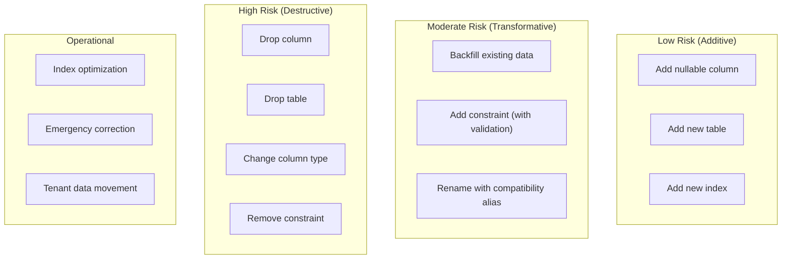
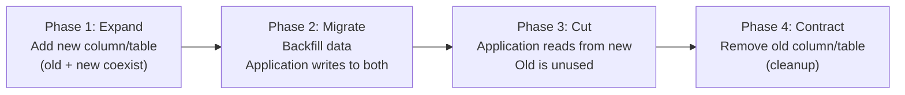
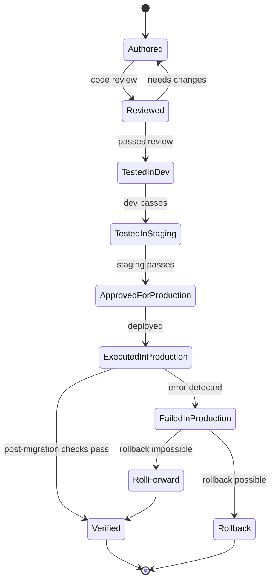

# Schema Evolution and Migrations

## Metadata

| Field | Value |
|-------|-------|
| Title | Kairo Schema Evolution and Migration Architecture |
| Document ID | KAI-DATA-008 |
| Status | Draft |
| Version | 0.1 |
| Target Release | V1 |
| Owner | Database Evolution and Migration Architect |
| Created | 2026-07-20 |
| Last Updated | 2026-07-20 |
| Reviewers | TODO |
| Related Documents | [Data Access and Persistence](./Data-Access-and-Persistence.md), [Data Architecture](./Data-Architecture.md), [Tenant Scaling and Placement](../Multi-Tenancy/Tenant-Scaling-and-Placement.md), [Secure Development Lifecycle](../Security/Secure-Development-Lifecycle.md), [Monolith Strategy](../Monolith-Strategy.md), [Transaction and Consistency](./Transaction-and-Consistency-Architecture.md) |
| Dependencies | [Data Access and Persistence](./Data-Access-and-Persistence.md), [Data Architecture](./Data-Architecture.md) |

---

## Purpose

This document defines how the Kairo platform evolves its data schemas over time — how migrations are authored, categorized, coordinated with application deployment, and executed safely across a multi-tenant shared database.

Schema evolution is one of the most risk-laden operations in a platform's lifecycle. A failed migration can corrupt data, cause downtime, or expose tenant information. A poorly coordinated migration can make the application incompatible with the database. This document ensures that every schema change is deliberate, safe, observable, and recoverable.

---

## Scope

This document covers:

- Migration ownership, boundaries, and ordering.
- Compatibility requirements during rolling deployments.
- Migration categories and their risk profiles.
- Zero-downtime strategies for schema changes.
- Tenant safety, observability, and recovery.
- V1 migration approach and future evolution.

This document does not cover:

- Specific migration scripts or SQL syntax.
- EF Core migration tool configuration.
- Database-specific DDL syntax.
- Infrastructure provisioning for migration execution.

---

## Mandatory Principles

| Principle | Rationale |
|-----------|-----------|
| **Every migration has an owning module** | Ownership determines who reviews, approves, and supports the migration. Unowned migrations are rejected. |
| **Destructive changes require explicit compatibility planning** | Dropping columns, changing types, or removing constraints cannot be done casually. They require a documented plan. |
| **Application deployment and schema evolution must be coordinated** | During rolling deployment, old and new application versions coexist. The schema must support both simultaneously. |
| **Rollback may require application rollback, data restoration, or roll-forward depending on the change** | Not all migrations are reversible through a "down" script. Recovery strategy is chosen per migration. |
| **Data backfills must be resumable where practical** | Large backfills may fail mid-execution. They must be designed to resume from where they left off. |
| **Long-running migrations must not block normal operations unnecessarily** | A migration that locks tables for minutes blocks all tenant operations. This is unacceptable for production. |
| **Tenant data must not be reassigned or exposed during migration** | A migration must not accidentally change organization_id, remove tenant filters, or expose data across boundaries. |
| **Migration success must be observable** | After a migration executes, its completion and health are verifiable without manual inspection. |
| **Production schema changes must not rely on undocumented manual steps** | If a migration requires manual action, that action is documented, scripted, and auditable. |
| **Cross-module migration dependencies require architecture review** | If Module A's migration depends on Module B's migration having run first, this creates coupling that must be reviewed. |

---

## Migration Categories

### Category Definitions

| Category | Description | Risk | Deployment Coordination | Rollback Strategy |
|----------|-------------|:----:|------------------------|-------------------|
| **Additive** | Adds new structures without changing existing ones | Low | None required (backward-compatible by nature) | Drop the added structure |
| **Transformative** | Modifies existing data or adds constraints to populated tables | Moderate | May require application awareness of new constraints | Reverse transformation or remove constraint |
| **Destructive** | Removes or fundamentally changes existing structures | High | Requires expand-and-contract. Multiple deployment phases. | Roll-forward (cannot simply undo) |
| **Data backfill** | Populates new columns or tables with values derived from existing data | Moderate | Application must handle null/absent values during backfill | Re-run backfill (idempotent) |
| **Index/performance** | Adds, removes, or modifies indexes for query optimization | Low-Moderate | None (unless removing an index used by current code) | Recreate removed index |
| **Ownership transfer** | Moves data ownership between modules (rare, architectural) | High | Requires ADR. Coordinated with module teams. | Complex. Case-by-case. |
| **Tenant placement** | Moves tenant data between databases or shards (future) | High | Requires coordination with routing layer | Reverse placement |
| **Emergency correction** | Fixes data corruption or critical bugs in production | Variable | May bypass normal process (documented justification) | Case-specific |

---

## 1. Migration Ownership

| Rule | Description |
|------|-------------|
| Module owns its migrations | The module that owns the data defines and maintains migrations for that data |
| No cross-module migrations | A migration script must not modify another module's tables |
| Platform migrations are owned by the platform team | Shared infrastructure tables (audit, configuration, events) are maintained by the platform |
| Ownership is declared | Every migration file declares its owning module |
| Review by owner | The owning module team reviews and approves the migration |

---

## 2. Module Migration Boundaries

| Rule | Description |
|------|-------------|
| Migrations target one module's schema | A single migration file affects only its owning module's tables |
| No cross-module DDL | A migration for the Catalog module does not alter Orders tables |
| Shared constraints are prohibited | No foreign keys across module boundaries (IDs are references, not constraints) |
| Module-level ordering | Migrations within a module are ordered. Cross-module ordering requires architecture review. |

---

## 3. Migration Ordering

| Context | Ordering Mechanism |
|---------|-------------------|
| Within a module | Sequential (timestamp or version-ordered) |
| Across modules | Independent (no guaranteed order between modules unless explicitly declared) |
| Cross-module dependency | Requires architecture review. The dependent migration documents its prerequisite. |

### Rules

- Modules' migrations are independent by default.
- If Module A's migration requires Module B's migration to have run, this coupling is documented and reviewed.
- The migration system supports per-module migration tracking.

---

## 4. Backward Compatibility

During rolling deployment, **old application code and new schema coexist temporarily:**

| Scenario | Requirement |
|----------|-------------|
| New column added | Old code ignores the new column. No breaking change. |
| Column renamed | Old code still uses the old name during the transition. Alias or both columns exist temporarily. |
| Column dropped | Old code must no longer reference the column BEFORE it is dropped. Removal happens in a later deployment. |
| New constraint added | Existing data must satisfy the constraint. Validation occurs before enforcement. |
| New table added | Old code does not reference the new table. No breaking change. |

### Backward Compatibility Rule

**Every migration must be compatible with the currently deployed application version.** The schema change deploys first (or simultaneously). The application code that depends on the new schema deploys afterward.

---

## 5. Forward Compatibility

After a migration, **new application code and old schema must not coexist problematically:**

| Scenario | Handling |
|----------|----------|
| Application reads a column that doesn't exist yet | Deployment order ensures migration runs before the application expects the column |
| Application writes to a new column on a schema without it | Cannot happen if migration runs before application deployment |

### Forward Compatibility Rule

Migrations run before or during (not after) the application deployment that requires them. The deployment pipeline ensures this ordering.

---

## 6. Expand-and-Contract Strategy

For destructive changes, the expand-and-contract pattern spreads the change across multiple deployments:

### Expand-and-Contract Rules

- Each phase is a separate deployment.
- Each phase is independently safe (rollback returns to the previous phase).
- Phase 4 (removal) only executes after verification that nothing references the old structure.
- The entire cycle may span multiple release cycles for high-risk changes.

---

## 7. Zero-Downtime Direction

**Long-running migrations must not block normal operations unnecessarily.**

| Strategy | When Used |
|----------|----------|
| Online DDL (concurrent index creation) | Adding indexes to large tables |
| Batched backfill (not in a single transaction) | Populating new columns across millions of rows |
| Constraint validation before enforcement | Adding constraints to existing data |
| Shadow writes (write to old + new) | Transitioning between column structures |
| Background processing | Large-scale data transformations |

### Zero-Downtime Rules

- Table-locking DDL is avoided for large tables. Online alternatives are used.
- Backfills run in batches (thousands of rows per batch, not millions in one transaction).
- Constraint additions validate existing data in a non-blocking pass before enforcing the constraint.
- Migrations that require downtime are exceptional, documented, and scheduled.

---

## 8. Data Backfills

| Principle | Description |
|-----------|-------------|
| Resumable | **Data backfills must be resumable where practical.** If interrupted, the backfill continues from where it stopped, not from the beginning. |
| Batched | Process in batches to avoid long transactions and lock contention |
| Idempotent | Running the backfill again on already-processed rows is safe (no duplicate effects) |
| Observable | Progress is trackable (how many rows processed, how many remaining) |
| Tenant-safe | Backfills respect tenant context. No cross-tenant data manipulation. |
| Validated | After backfill, validation confirms all rows have been processed correctly |

---

## 9. Long-Running Migrations

Migrations that affect large volumes of data or add indexes to large tables:

| Rule | Description |
|------|-------------|
| Non-blocking | Use online DDL where supported (CREATE INDEX CONCURRENTLY in PostgreSQL) |
| Batched | Process data in manageable batches |
| Timeboxed | Long migrations have progress tracking and can be paused/resumed |
| Monitored | Database metrics (lock wait, I/O, CPU) are observed during execution |
| Off-peak preferred | Large migrations are scheduled during low-traffic periods where possible |
| Alerting | Anomalous behavior during migration triggers alerts |

---

## 10. Index Changes

| Change Type | Risk | Strategy |
|-------------|:----:|----------|
| Add new index | Low | Concurrent creation (non-blocking). Validate query plan improvement after. |
| Remove index | Moderate | Verify no queries depend on the index. Remove after code change is deployed. |
| Modify index (add columns) | Low-Moderate | Create new index concurrently, then drop old index. |
| Rebuild index | Low | Online rebuild if supported. Schedule if blocking required. |

---

## 11. Constraint Changes

| Change Type | Risk | Strategy |
|-------------|:----:|----------|
| Add NOT NULL | Moderate | Backfill nulls first. Add constraint with validation. Then enforce. |
| Add CHECK constraint | Moderate | Validate existing data satisfies. Then enforce. |
| Add UNIQUE constraint | Moderate | Validate no duplicates exist. Resolve conflicts. Then enforce. |
| Add foreign key (within module) | Low | Validate referential integrity. Then enforce. |
| Remove constraint | Low | Verify removal is intentional. Application must handle previously-constrained data. |

---

## 12. Column/Field Removal

**Destructive. Requires expand-and-contract.**

| Phase | Action |
|-------|--------|
| 1 | Stop writing to the column (application change). Deploy. |
| 2 | Stop reading from the column (application change). Deploy. |
| 3 | Verify no code references the column (automated check). |
| 4 | Drop the column (migration). Deploy. |

### Rules

- Column removal is a multi-phase operation.
- Phase 4 does not execute until phases 1-3 are verified.
- Rushing column removal risks breaking deployed code that still references it.

---

## 13. Type Changes

Changing a column's data type (e.g., string to integer, varchar length increase):

| Strategy | When |
|----------|------|
| Safe widening (varchar 50 → 100) | Direct ALTER. Backward compatible. |
| Narrowing (varchar 100 → 50) | Validate existing data fits. Expand-and-contract if not. |
| Type change (string → integer) | Expand-and-contract. New column, backfill, cut over, remove old. |
| Precision change (decimal scale) | Validate existing data. Direct ALTER if safe. |

---

## 14. Data Transformation

Changing the semantic meaning or structure of existing data:

| Rule | Description |
|------|-------------|
| Source preservation | Original data is preserved until transformation is verified |
| Reversibility planning | Transformation documents how to reverse if needed |
| Validation | Post-transformation validation confirms data integrity |
| Audit | Transformation is recorded (what changed, when, by which migration) |
| Tenant safety | Transformation operates within tenant boundaries |

---

## 15. Default Values

| Rule | Description |
|------|-------------|
| New columns have application defaults | Default values are set by the application when creating new records, not solely by the database |
| Database defaults for backfill | A database default may be used temporarily during backfill. Removed after backfill completes. |
| Explicit over implicit | Defaults are documented. No "magic" default values that consumers must guess. |
| NULL semantics | NULL means "not set." It is not used as a business value. New required fields use expand-and-contract (add nullable, backfill, then make non-null). |

---

## 16. Feature-Flag Coordination

When a schema change supports a new feature that is controlled by a feature flag:

| Step | Action |
|------|--------|
| 1 | Deploy migration (adds new schema structures) |
| 2 | Deploy application code (reads/writes new structures, behind feature flag) |
| 3 | Enable feature flag for specific tenants (gradual rollout) |
| 4 | Enable for all tenants |
| 5 | Remove feature flag and old code path (cleanup) |

### Rules

- The schema is ready before the feature flag is enabled.
- If the feature is rolled back (flag disabled), the schema remains (no harm — unused columns are safe).
- Schema cleanup (removing old structures) happens after the feature is permanently enabled.

---

## 17. Application-Version Compatibility

During rolling deployment, multiple application versions coexist briefly:

| Principle | Description |
|-----------|-------------|
| N and N-1 compatibility | The schema must support both the current (N) and previous (N-1) application versions simultaneously |
| Migration deploys first | Schema changes are applied before the application code that requires them |
| Two-phase changes | Breaking changes are split across at least two deployments (add new → use new → remove old) |
| Compatibility window | The period where old and new versions coexist is minimized but explicitly planned |

---

## 18. Rollback Philosophy

| Change Type | Rollback Strategy |
|------------|------------------|
| Additive (new column, table) | Drop the added structure. No data loss (column was new, no existing data depended on it). |
| Backfill | Null out backfilled values (if the column allows null). Or re-run backfill with corrected logic. |
| Constraint addition | Remove the constraint. No data change needed. |
| Destructive (dropped column) | **Cannot be rolled back.** Data is gone. Recovery requires backup restoration. |
| Type change (via expand-and-contract) | Revert to using the old column. Remove the new column. |

### Rollback Rules

- **Rollback may require application rollback, data restoration, or roll-forward depending on the change.**
- Additive changes are cheaply rolled back (drop the addition).
- Destructive changes cannot be rolled back through schema changes alone. They require data restoration.
- The rollback strategy is documented BEFORE the migration is deployed.

---

## 19. Roll-Forward Philosophy

When rollback is impractical (destructive changes already applied):

| Strategy | When Used |
|----------|----------|
| Fix-forward | Deploy a corrective migration that fixes the issue without reversing the original |
| Data restoration | Restore affected data from backup (tenant-scoped) |
| Compensating migration | Create a new migration that compensates for the error |

### Rules

- Roll-forward is the default for destructive changes (rolling back is not possible).
- Roll-forward migrations are tested before deployment.
- Backup availability is verified before executing destructive migrations.

---

## 20. Migration Observability

**Migration success must be observable.**

| Observable | How |
|-----------|-----|
| Migration executed | Migration tracking table records which migrations have run, when, and by whom |
| Migration duration | Start time, end time, and duration are recorded |
| Rows affected | For backfills, the number of rows processed is recorded |
| Errors | Any errors during migration are logged and alerted |
| Post-migration health | Application health checks confirm normal operation after migration |
| Schema state | Current schema version is queryable and matches the expected state |

---

## 21. Migration Validation

| Validation Step | When |
|----------------|------|
| Pre-migration checks | Before execution: verify preconditions (data state, no conflicts) |
| Test environment execution | Before production: validate in staging against realistic data |
| Post-migration verification | After execution: confirm schema state matches expectations |
| Application health check | After deployment: confirm application functions correctly with new schema |
| Tenant data verification | After execution: confirm tenant isolation is maintained |
| Performance verification | After execution: confirm query performance has not degraded |

---

## 22. Tenant-Aware Migrations

**Tenant data must not be reassigned or exposed during migration.**

| Rule | Description |
|------|-------------|
| Migrations operate on all tenants equally | A schema change applies to all tenants' data simultaneously (shared schema) |
| No tenant-specific migrations (V1) | V1 does not support per-tenant schema differences |
| Tenant context preserved | Migrations that modify data must not alter organization_id or store_id values |
| Isolation maintained | A migration must not create temporary states where one tenant can see another's data |
| Backfills are tenant-aware | Backfill logic respects tenant boundaries (processes per-tenant where relevant) |

---

## 23. Large-Tenant Considerations

When one tenant has significantly more data than others:

| Concern | Mitigation |
|---------|-----------|
| Backfill takes much longer for large tenant | Batched execution. Progress tracked. Does not block other tenants. |
| Index creation on large tenant's data | Online index creation (non-blocking). May take longer. |
| Constraint validation on large data set | Batched validation. Non-blocking. |
| Lock contention during migration | Avoid table-level locks. Use row-level operations. |

---

## 24. Regional or Dedicated Placement (Future)

When tenants are on separate databases (V2+):

| Consideration | Direction |
|--------------|-----------|
| Migration must run on all databases | Migration tooling supports multiple database targets |
| Version consistency | All databases should be at the same schema version (or compatible versions) |
| Rolling migration | Migrate one database at a time to limit blast radius |
| Placement-aware migration | Some migrations may apply only to databases that contain specific data patterns |

### V1 Rule

V1 has one database. All migrations apply to the single shared database. Regional/dedicated placement migration is a future concern.

---

## 25. Test Environment Migrations

| Rule | Description |
|------|-------------|
| Same migrations | Test environments run the exact same migrations as production |
| No test-only schema changes | Schema differences between test and production create false confidence |
| Realistic data volume | Staging has sufficient data to validate migration performance (not just empty tables) |
| Clean state option | Test environments support complete schema rebuild for clean testing |
| Production data never migrated to test | No production data flows to non-production environments |

---

## 26. Disaster Recovery Interaction

| Concern | Rule |
|---------|------|
| Backup compatibility | Backup restoration produces a schema compatible with the running application version |
| Point-in-time recovery | Recovery to a point before a migration requires the application version that matches that schema |
| Migration replay | After restoration, migrations can be replayed to bring the schema to current state |
| Schema version tracking | The database always records its current schema version for compatibility verification |

---

## 27. Future Service Extraction

When a module is extracted to its own database:

| Concern | Direction |
|---------|-----------|
| Migration ownership remains with the module | The module takes its migrations with it |
| Migration history is preserved | The extracted module's new database has the complete migration history |
| Cross-module migration dependencies are resolved | Any dependency on another module's migration is eliminated before extraction |
| Independent versioning | Extracted modules maintain their own migration timeline |

---

## Migration Risk Matrix

| Category | Backward Compatible | Zero Downtime | Rollback | Data Loss Risk | Coordination Required |
|----------|:---:|:---:|:---:|:---:|:---:|
| Additive (new nullable column) | Yes | Yes | Easy | None | None |
| Additive (new table) | Yes | Yes | Easy | None | None |
| Index addition (concurrent) | Yes | Yes | Easy | None | None |
| Data backfill | Yes | Yes | Moderate | None | Application awareness |
| Constraint addition | Yes (if data valid) | Yes (with validation) | Easy | None | Data validation |
| Column rename | No (without alias) | With expand-and-contract | Moderate | None | Multi-phase deployment |
| Column removal | No | With expand-and-contract | Impossible (data gone) | Yes | Multi-phase deployment |
| Type change | No (without new column) | With expand-and-contract | Moderate | Possible | Multi-phase deployment |
| Table removal | No | With expand-and-contract | Impossible (data gone) | Yes | Multi-phase deployment |
| Emergency correction | Variable | Best effort | Case-specific | Variable | Incident response |

---

## Migration Lifecycle

---

## Version Gate

| Version | Schema Evolution Gate |
|---------|---------------------|
| V1 | Per-module migration ownership operational. Expand-and-contract used for destructive changes. Zero-downtime for additive changes. Backfills are batched and resumable. Tenant data integrity verified post-migration. Migration observability (tracking, duration, health checks) operational. Test environments run identical migrations. |
| V2 | Multi-database migration coordination (if tenant placement diverges). Automated pre-migration validation. Migration performance profiling in staging. Large-tenant specific mitigation. |
| V3 | Per-service migration independence (extracted modules). Regional migration coordination. Automated rollback for safe categories. Migration impact prediction tooling. |

---

## Decision Summary

| Decision | Rationale |
|----------|-----------|
| Per-module migration ownership | Prevents uncontrolled schema changes. Aligns with data ownership boundaries. |
| Expand-and-contract for destructive changes | Eliminates downtime risk. Each phase is independently safe. |
| N and N-1 application compatibility | Rolling deployments require both versions to work with the schema during transition. |
| Batched, resumable backfills | Large datasets cannot be backfilled in one transaction. Resumability prevents starting over on failure. |
| Online DDL for indexes | Table locks during index creation block all operations. Online creation avoids this. |
| Migration before application deployment | Ensures the schema is ready before code expects it. Prevents "column not found" errors. |
| Observability mandatory | Unobservable migrations leave the team guessing about schema state. Explicit tracking eliminates this. |
| Roll-forward for destructive changes | Dropped data cannot be un-dropped through a schema change. Recovery requires data restoration or compensating migration. |

---

## Alternatives Considered

| Alternative | Rejected Because |
|------------|-----------------|
| Application-managed schema (auto-migrate on startup) | Uncontrolled in multi-instance deployments. Race conditions between instances. No review step. |
| Cross-module migrations for "efficiency" | Creates coupling between modules. Prevents independent evolution. |
| Downtime window for every destructive change | Unacceptable for a commerce platform. Zero-downtime direction is mandatory. |
| Single-transaction backfills | Locks tables for large datasets. Blocks normal operations. Not resumable on failure. |
| Skip staging validation | Production-only testing is reckless. Staging catches most issues before customer impact. |
| No rollback planning | "We'll figure it out" is not a strategy. Recovery paths are designed in advance. |

---

## Trade-offs

| Trade-off | Accepted Because |
|-----------|-----------------|
| Expand-and-contract is slower (multiple deployments) | Speed is less important than safety for schema changes. Multi-phase prevents data loss. |
| Concurrent index creation is slower than blocking | Blocking an entire table is unacceptable. Slightly longer index creation is fine. |
| Batched backfills take longer than single-transaction | Single-transaction locks the table. Batched may take hours but doesn't block operations. |
| Per-module migration boundaries prevent cross-module schema optimization | Optimization that crosses modules creates coupling. Module independence is more valuable than query optimization across boundaries. |
| Migration before deployment means brief unused schema structures | Unused columns during the transition window are harmless. Missing columns during transition break the application. |

---

## Architecture Impact

| Concern | Impact |
|---------|--------|
| Deployment pipeline | Must execute migrations before (or as part of) application deployment. Must verify migration success before routing traffic. |
| Module design | Each module owns its migrations. No cross-module DDL. Migrations are part of the module's deliverables. |
| Testing | Staging runs identical migrations against realistic data volumes. Migration tests verify backward compatibility. |
| Operations | Monitors migration execution. Observes post-migration health. Manages rollback/roll-forward when issues arise. |
| Data access | Must handle both pre-migration and post-migration schema during rolling deployment. |
| Tenancy | Migrations apply equally to all tenants. No tenant-specific schema differences in V1. |
| Backup | Backup strategy accounts for migration state. Restoration compatibility is verified. |

---

## Implementation Impact

| Area | Impact |
|------|--------|
| Modules | Must author their own migrations. Must ensure backward compatibility during transition. Must document rollback strategy for each migration. Must validate in staging before production. |
| Platform | Must provide migration execution infrastructure. Must track migration state. Must coordinate with deployment pipeline. |
| CI/CD | Must execute migrations as part of deployment. Must verify success before application rollout. Must support rollback triggering. |
| Testing | Must validate migrations against realistic data. Must test backward compatibility (old code + new schema). Must verify tenant isolation post-migration. |
| Operations | Must monitor migration execution. Must verify post-migration health. Must manage emergency corrections. |

---

## Security Responsibilities

| Role | Migration Responsibilities |
|------|--------------------------|
| Migration Architect | Defines migration patterns. Reviews high-risk migrations. Maintains standards. |
| Module Teams | Author and test their modules' migrations. Ensure backward compatibility. Document rollback. |
| Platform Team | Provides migration infrastructure. Manages execution pipeline. Tracks migration state. |
| Operations | Monitors execution. Verifies health. Executes rollback when needed. |
| Security Team | Reviews migrations for tenant safety. Validates no data exposure during migration. |

---

## Multi-Tenancy Responsibilities

| Responsibility | Detail |
|---------------|--------|
| All tenants migrate simultaneously | Shared schema means one migration affects all tenants |
| Tenant data integrity preserved | Migrations must not alter tenant ownership fields |
| No cross-tenant exposure during migration | Temporary states during migration must not break isolation |
| Backfills respect tenant boundaries | Per-tenant processing where needed |
| Large-tenant considerations | Batched processing. Non-blocking DDL. Progress tracking. |

---

## Out of Scope

This document does not define:

- Specific migration scripts or SQL DDL — defined per module during implementation.
- EF Core migration tool configuration — defined in development standards.
- Database-specific DDL syntax (PostgreSQL-specific commands) — defined in implementation.
- Deployment pipeline configuration — defined in CI/CD architecture.
- Specific migration scheduling or change-management procedures — defined in operational documentation.

---

## Future Considerations

- **Automated migration testing** — Tooling that automatically tests migrations against production-like data volumes.
- **Migration dry-run** — Execute migrations in a non-destructive preview mode to predict impact.
- **Per-tenant schema versioning** — When dedicated databases allow tenants to be at different versions temporarily.
- **Migration dependency graph** — Visual representation of migration dependencies across modules.
- **Schema drift detection** — Automated comparison of expected schema versus actual schema to detect manual changes.
- **Migration impact estimation** — Predicting execution time and resource impact before running.

---

## Future Refactoring Triggers

This document should be revisited when:

- Multi-database deployment introduces migration coordination challenges.
- A migration causes a production incident (validate and strengthen the process).
- Module extraction requires independent migration tracking.
- Regional deployment introduces schema version divergence risk.
- The volume of data makes current migration approaches too slow.
- Automated migration validation tooling is evaluated.
- Cross-module migration dependencies emerge that challenge current boundaries.

---

## Change History

| Version | Date | Author | Description |
|---------|------|--------|-------------|
| 0.1 | 2026-07-20 | Database Evolution and Migration Architect | Initial draft |
