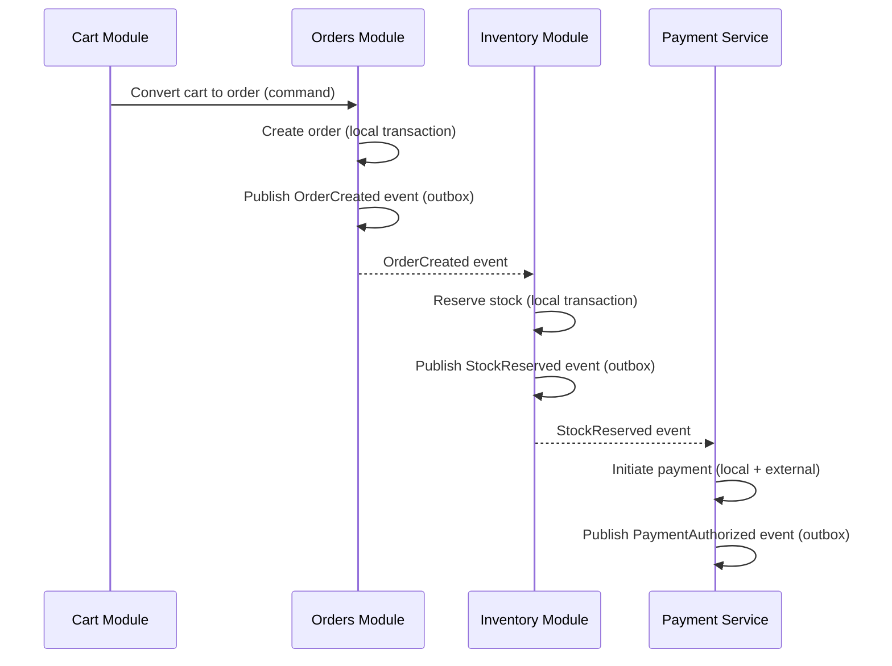
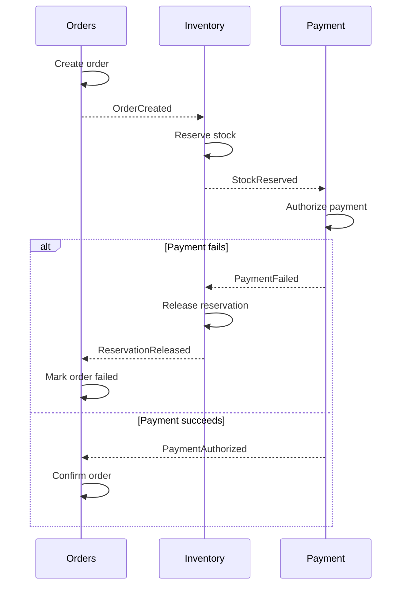
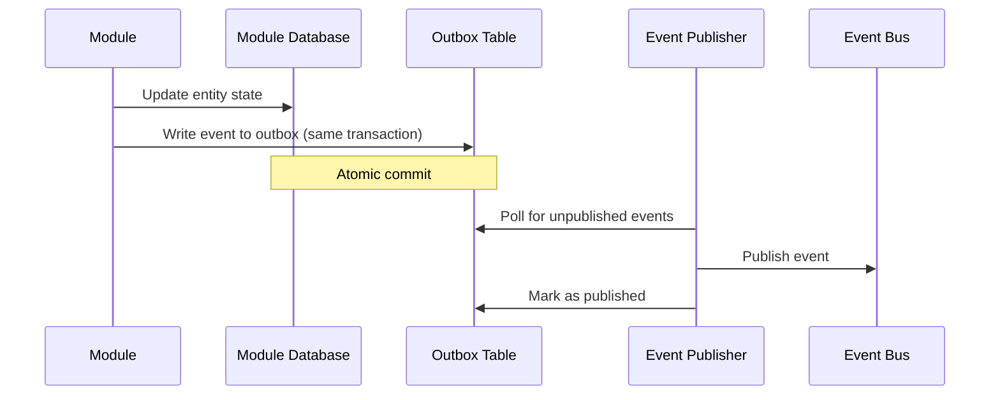
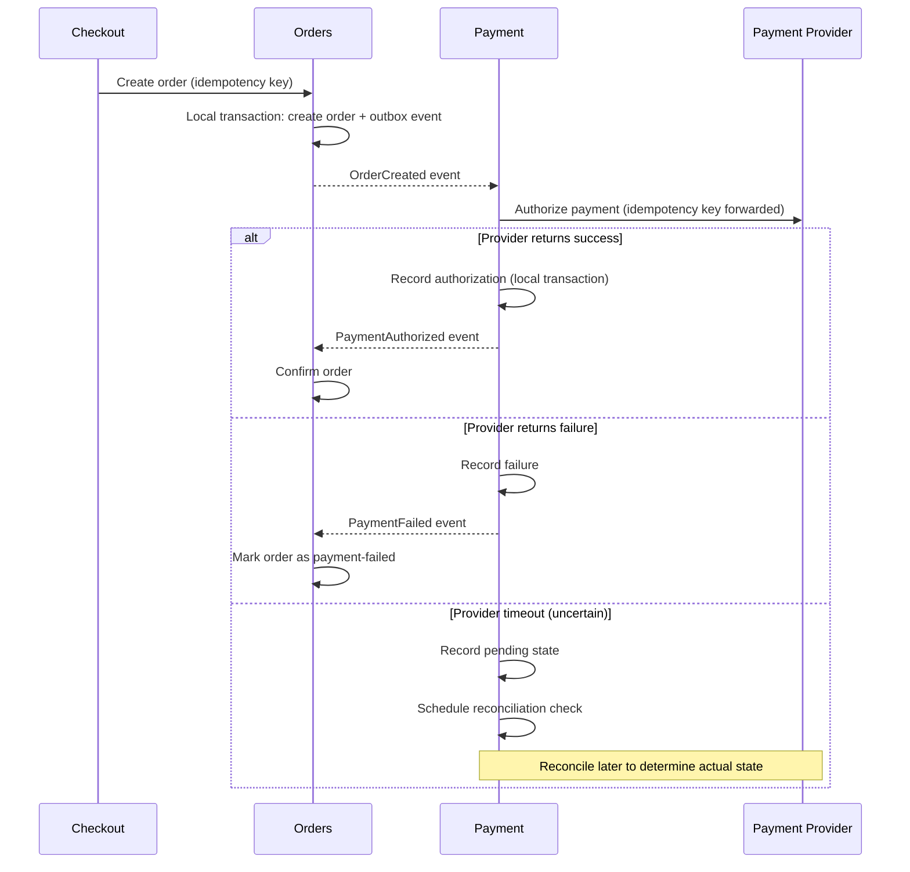
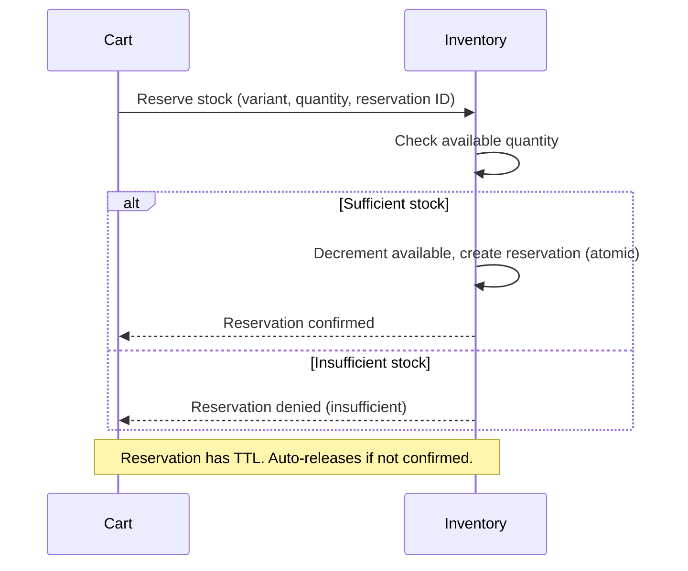

# Transaction and Consistency Architecture

## Metadata

| Field | Value |
|-------|-------|
| Title | Kairo Transaction and Consistency Architecture |
| Document ID | KAI-DATA-006 |
| Status | Draft |
| Version | 0.1 |
| Target Release | V1 |
| Owner | Transactional Systems and Consistency Architect |
| Created | 2026-07-20 |
| Last Updated | 2026-07-20 |
| Reviewers | TODO |
| Related Documents | [Data Architecture](./Data-Architecture.md), [Data Ownership](./Data-Ownership.md), [Architecture Principles](../Architecture-Principles.md), [API Security](../Security/API-Security.md), [Threat Model](../Security/Threat-Model.md), [Module Architecture](../Module-Architecture.md), [Monolith Strategy](../Monolith-Strategy.md) |
| Dependencies | [Data Architecture](./Data-Architecture.md), [Module Architecture](../Module-Architecture.md) |

---

## Purpose

This document defines how the Kairo platform manages transactions, consistency, concurrency, and failure across its operations. It establishes when strong consistency is required, when eventual consistency is acceptable, and how the platform handles the inherent complexity of multi-step business processes.

Getting consistency wrong is expensive. An inventory double-sell, a duplicate payment, or a partially completed order that is neither confirmed nor cancelled creates real financial and trust damage. This document ensures that every operation's consistency requirements are deliberately chosen, not accidentally discovered.

---

## Scope

This document covers:

- Transaction boundaries and consistency models per operation type.
- Idempotency, concurrency, retry, and duplicate handling.
- Cross-module workflow coordination.
- Failure, compensation, and recovery patterns.
- Consistency expectations for derived data (cache, search, reports).
- Scenario analysis for critical business operations.

This document does not cover:

- Implementation code for sagas or outbox patterns.
- Specific event contracts or message formats — defined in future Event Architecture phase (dependency identified).
- Database transaction isolation level configuration — implementation detail.
- Retry policy configuration values — defined in deployment configuration.

---

## Mandatory Principles

| Principle | Rationale |
|-----------|-----------|
| **A single module owns its transaction boundary** | Cross-module transactions create coupling. Each module ensures its own consistency. |
| **Cross-module workflows must not rely on hidden shared-state mutation** | Shared mutable state creates invisible coupling. Modules coordinate through events and contracts. |
| **Financial and inventory operations require explicit consistency semantics** | These operations have real monetary or availability consequences. Implicit consistency is unacceptable. |
| **Retries must not create duplicate business effects** | Networks fail. Requests are retried. A retry must be safe (idempotent) or explicitly designed for exactly-once. |
| **Idempotency is required where duplicate requests are dangerous** | Checkout, payment, refund, inventory adjustment — all must handle duplicate submission safely. |
| **Events are not guaranteed to be processed only once** | At-least-once delivery means consumers must handle duplicate events. Exactly-once is not a platform guarantee. |
| **Derived stores may be eventually consistent** | Caches, search indexes, and reports do not need real-time consistency with the authoritative source. |
| **Database transactions do not automatically solve external provider consistency** | A committed database transaction does not guarantee the payment provider processed the charge. External systems require their own consistency handling. |
| **Distributed transactions are not the default** | 2PC and distributed transactions add massive complexity. They are used only when simpler alternatives are proven insufficient. |
| **Failure and compensation paths must be designed explicitly** | "What happens if step 3 fails?" must be answered in the design, not discovered in production. |

---

## 1. Transactional Boundaries

A transaction boundary defines the scope within which consistency is guaranteed atomically.

| Scope | Consistency Guarantee | Example |
|-------|----------------------|---------|
| Within a single module | Strong (ACID) | Creating an order with its line items |
| Across modules (same request) | Eventual (event-driven) | Order creation → inventory reservation |
| Across modules (async) | Eventual (event-driven) | Order completion → fulfillment initiation |
| Across external systems | Best effort (with reconciliation) | Payment authorization with provider |

### Boundary Rule

Each module owns one transaction. A module's internal state is consistent within its transaction. Cross-module consistency is achieved through events, not through shared transactions.

---

## 2. Aggregate Consistency

Within a module, the aggregate (as defined in [Data Modeling Principles](./Data-Modeling-Principles.md)) is the consistency unit:

- All changes to an aggregate are atomic (one transaction).
- An aggregate is always in a valid state after a transaction.
- Changes to different aggregates (even within the same module) may use separate transactions.

---

## 3. Module-Local Transactions

Operations within a single module use standard database transactions:

| Property | Guarantee |
|----------|-----------|
| Atomicity | All changes commit or all roll back |
| Consistency | Business rules are satisfied after commit |
| Isolation | Concurrent transactions do not interfere |
| Durability | Committed data survives system failures |

### Rules

- A module's transaction encompasses its aggregate change + event publication (via outbox pattern).
- A module's transaction does not span other modules' tables.
- Module-local transactions are the simplest and most reliable consistency mechanism.

---

## 4. Cross-Module Workflows

When a business operation spans multiple modules, coordination is event-driven:

### Rules

- Each module processes its part in a local transaction.
- Events communicate state changes between modules.
- No module waits synchronously for another module's transaction to complete (in the async case).
- Each module is responsible for its own consistency regardless of what other modules do.
- **Cross-module workflows must not rely on hidden shared-state mutation.** State changes are communicated through published events, not through shared database rows.

---

## 5. Strong Consistency

Required when the operation must be all-or-nothing and immediately visible.

| When Required | Example |
|--------------|---------|
| Within a module's aggregate | Order + line items created atomically |
| Financial calculations | Cart total calculation within one request |
| State transitions | Order status change + history record |
| Idempotency record + result | Storing idempotency key + operation result atomically |

### Implementation Direction

- Standard ACID transactions within a single database connection.
- Used for module-internal operations only.
- Not extended across module boundaries in V1.

---

## 6. Eventual Consistency

Acceptable when data can be temporarily stale without causing incorrect business outcomes.

| Where Acceptable | Staleness Window | Impact |
|-----------------|-----------------|--------|
| Search indexes | Seconds to minutes | Search results may not immediately reflect the latest change |
| Cache | Seconds (TTL-based) | Cached data may be slightly outdated |
| Cross-module state | Seconds | Inventory reservation may lag order creation briefly |
| Reports | Minutes | Dashboards do not require real-time accuracy |
| Webhook delivery | Seconds to minutes | External systems receive events with slight delay |
| Analytics | Minutes to hours | Aggregate metrics tolerate lag |

### Rules

- Eventual consistency is the default for cross-module communication.
- The staleness window is bounded and documented per case.
- If eventual consistency is unacceptable for a specific operation, that operation requires synchronous coordination with explicit justification.

---

## 7. Idempotency

**Idempotency is required where duplicate requests are dangerous.**

| Operation | Idempotency Required | Mechanism |
|-----------|:---:|-----------|
| Order creation (checkout) | Yes | Client-provided idempotency key |
| Payment authorization | Yes | Idempotency key forwarded to provider |
| Payment capture | Yes | Idempotency key or transaction reference |
| Refund | Yes | Idempotency key or refund reference |
| Inventory adjustment | Yes | Idempotency key per adjustment |
| Webhook processing | Yes | Event ID as deduplication key |
| Background job execution | Yes | Job ID as deduplication key |
| Product creation | No (low risk) | Duplicate creates a second product — detectable, not financially dangerous |
| Configuration change | No (idempotent by nature) | Setting a value to X is naturally idempotent |

### Idempotency Rules

- The platform stores the result of the first execution.
- Subsequent requests with the same idempotency key return the stored result without re-executing.
- Idempotency keys are tenant-scoped and time-limited (TTL).
- Idempotency key + result are stored atomically within the same transaction as the operation.

---

## 8. Concurrency Control

When multiple requests attempt to modify the same resource simultaneously.

### 9. Optimistic Concurrency

The default concurrency model:

- Read the resource (including a version indicator).
- Perform the modification.
- Write the resource only if the version has not changed since the read.
- If the version has changed, the operation fails with a conflict error.

| Where Used | Example |
|-----------|---------|
| Product updates | Two admins editing the same product simultaneously |
| Inventory adjustments | Concurrent stock updates |
| Configuration changes | Concurrent setting modifications |
| Cart modifications | Concurrent cart item additions |

### Rules

- Optimistic concurrency uses a version field (counter or timestamp).
- Conflicts return 409 (Conflict) to the caller.
- The caller decides whether to retry with the latest version.
- This is the default concurrency strategy for all module entities.

---

### 10. Pessimistic Coordination Direction

Reserved for cases where optimistic concurrency is insufficient:

| Where Considered | Reason |
|-----------------|--------|
| Inventory reservation during checkout | Must guarantee stock is not double-allocated during high-volume sales |
| Payment capture | Must guarantee a single capture per authorization |

### Rules

- Pessimistic coordination (locks, serialized access) is used only where documented.
- The scope of pessimistic coordination is minimized (specific rows/resources, not broad locks).
- Pessimistic coordination is an implementation decision within a module, not a cross-module mechanism.
- V1 uses database-level row locking for the specific cases where it is required.

---

## 11. Duplicate Processing

**Events are not guaranteed to be processed only once.** The platform uses at-least-once delivery.

| Scenario | Duplicate Risk | Handling |
|----------|:---:|-----------|
| Event delivered twice | High (at-least-once) | Consumer uses event ID for deduplication |
| Webhook delivered twice | High (retry on failure) | Consumer uses event ID + timestamp for deduplication |
| API request retried | Moderate (network failure) | Idempotency key for dangerous operations |
| Background job restarted | Moderate (worker failure) | Job ID for deduplication. Idempotent execution. |

### Rules

- Every event consumer must handle receiving the same event multiple times.
- Deduplication uses the event ID or a derived deduplication key.
- Deduplication state is stored per consumer (inbox pattern).
- Duplicate detection has a time window. Events older than the window are assumed already processed.

---

## 12. Retry Behavior

| Retry Context | Strategy | Limits |
|--------------|----------|--------|
| Event consumer failure | Exponential backoff | Maximum retry count, then dead-letter |
| Background job failure | Exponential backoff | Maximum retry count, then dead-letter |
| External provider call failure | Exponential backoff with jitter | Maximum retry count, then failure state |
| API request failure (client) | Client responsibility | Platform returns error; client decides |

### Rules

- **Retries must not create duplicate business effects.** Retried operations must be idempotent or explicitly designed for safe retry.
- Retry policies are configurable per operation type.
- After maximum retries, the operation is dead-lettered for manual investigation.
- Dead-lettered operations are monitored and alerted.
- Retry backoff prevents overwhelming a recovering dependency.

---

## 13. Compensating Actions

When a multi-step workflow partially completes and a later step fails:

| Scenario | Compensation |
|----------|-------------|
| Payment fails after inventory reserved | Release the inventory reservation |
| Fulfillment impossible after payment captured | Initiate refund |
| External provider rejects after internal state created | Revert internal state to previous valid state |

### Compensation Rules

- Compensation is explicitly designed for each workflow step.
- Compensation is not "undo" — it creates a new action that reverses the effect (e.g., refund, release, cancel).
- Compensation is itself idempotent (compensating twice does not double-reverse).
- Compensation is audited.
- If compensation fails, the operation is escalated for manual resolution.

---

## 14. Sagas and Process Managers

For complex multi-module workflows that require coordination:

### Saga (Choreography)

Each module reacts to events and publishes its result. No central coordinator.

### Process Manager (Orchestration)

A dedicated component coordinates the workflow steps.

| When to Use Choreography | When to Use Orchestration |
|-------------------------|--------------------------|
| Few steps, linear flow | Many steps, complex branching |
| Each module knows its compensation | Central visibility of workflow state is needed |
| Failure paths are simple | Failure paths require complex decision logic |

### V1 Direction

- V1 uses choreography-style sagas for standard flows (order → inventory → payment).
- Process managers are a future capability for complex workflows (e.g., multi-step fulfillment orchestration).

---

## 15. Transactional Outbox

The outbox pattern ensures that a module's state change and its event publication are atomic:

### Rules

- The outbox is in the same database as the module's data (same transaction).
- Event publication happens asynchronously after the transaction commits.
- If publication fails, the event remains in the outbox and is retried.
- This guarantees that committed state changes always produce their corresponding events (no lost events).
- The outbox introduces slight delay (milliseconds) between state change and event availability.

---

## 16. Inbox / Deduplication

The inbox pattern ensures that an event consumer processes each event exactly once (from its perspective):

| Step | Action |
|------|--------|
| 1 | Receive event from bus |
| 2 | Check inbox: has this event ID been processed? |
| 3a | If processed: acknowledge and skip (deduplicate) |
| 3b | If not processed: process the event, record the event ID in inbox (same transaction) |
| 4 | Acknowledge event to bus |

### Rules

- Inbox deduplication uses the event ID.
- The inbox record and the business effect are in the same transaction (atomic).
- Inbox records have a TTL (old entries are cleaned up). Events older than the TTL are assumed already processed.
- Without inbox deduplication, at-least-once delivery causes duplicate business effects.

---

## 17. Failure Recovery

| Failure Type | Recovery Mechanism |
|-------------|-------------------|
| Module transaction failure | Database rollback. No partial state. Caller receives error. |
| Event publication failure (outbox) | Outbox retry. Event will eventually publish. |
| Event consumer failure | Dead-letter after max retries. Manual resolution. |
| External provider timeout | Retry with exponential backoff. Reconciliation if uncertain. |
| External provider rejection | Compensation (revert internal state). |
| Background job failure | Retry with backoff. Dead-letter after max. |
| Infrastructure failure (DB unavailable) | Service degradation. Operations fail safely. Recovery on infrastructure restoration. |

### Recovery Rules

- Every failure scenario has a defined recovery path.
- Recovery is automated where possible (retry, outbox republish).
- Unrecoverable failures are escalated (dead-letter + alert).
- **Failure and compensation paths must be designed explicitly.** No operation proceeds to production without documented failure handling.

---

## 18. Partial Completion

When a workflow is partially complete (some steps succeeded, some have not yet executed):

| Rule | Description |
|------|-------------|
| State reflects reality | The system's state accurately reflects what has actually happened (not what was intended) |
| Incomplete workflows are visible | A partially completed workflow (order created, payment pending) is a valid intermediate state, not a hidden error |
| Timeout handling | If a step does not complete within a defined window, the workflow triggers its failure/compensation path |
| No hidden intermediate states | Every possible intermediate state is a documented, valid state in the lifecycle |

---

## Critical Scenario Analysis

### 19. Financial Consistency

**Financial and inventory operations require explicit consistency semantics.**

#### Payment Authorization

#### Key Rules for Financial Operations

- Idempotency keys are forwarded to payment providers to prevent duplicate charges.
- Payment state is recorded locally before relying on external confirmation.
- Timeout does not assume success OR failure. Reconciliation determines actual state.
- **Database transactions do not automatically solve external provider consistency.** A committed local transaction does not mean the provider processed the charge.

---

### 20. Inventory Consistency

#### Inventory Reservation

#### Key Rules for Inventory

- Reservations are atomic (decrement available + create reservation record in one transaction).
- Reservations have a time-to-live. Unredeemed reservations auto-release.
- Confirmation (order placed) converts the reservation to a permanent decrement.
- Cancellation releases the reservation immediately.
- Concurrent reservations for the same variant use pessimistic locking to prevent oversell.

---

### 21. Order Consistency

#### Order Creation (Checkout)

| Step | Consistency | Failure Handling |
|------|-------------|-----------------|
| Validate cart state | Synchronous (within Cart) | Return error to client |
| Create order from cart | Strong (Orders local transaction) | Rollback. Return error. |
| Publish OrderCreated | Outbox (guaranteed eventual) | Outbox retry |
| Reserve inventory | Eventual (Inventory reacts to event) | If reservation fails, compensation (cancel order or notify customer) |
| Authorize payment | Eventual (Payment reacts to event) | If auth fails, release inventory, mark order failed |
| Confirm order | Eventual (Orders reacts to PaymentAuthorized) | Confirmation completes the cycle |

### Scenario: Refund

| Step | Consistency | Failure Handling |
|------|-------------|-----------------|
| Validate refund eligibility | Synchronous (Orders) | Return error |
| Create refund record | Strong (Orders local) | Rollback |
| Publish RefundInitiated | Outbox | Outbox retry |
| Execute refund with provider | Eventual (Payment processes) | Retry with provider. Reconcile on timeout. |
| Update order state | Eventual (Orders reacts to RefundCompleted) | Completes cycle |
| Restock inventory (if applicable) | Eventual (Inventory reacts to event) | Compensate if restock fails |

### Scenario: Cancellation

| Step | Consistency | Failure Handling |
|------|-------------|-----------------|
| Validate cancellation eligibility | Synchronous (Orders) | Return error if not cancellable |
| Update order status to Cancelled | Strong (Orders local) | Rollback |
| Publish OrderCancelled | Outbox | Outbox retry |
| Release inventory reservation | Eventual (Inventory reacts) | If release fails, alert (stock discrepancy) |
| Reverse payment authorization | Eventual (Payment reacts) | If reversal fails, record for reconciliation |

### Scenario: Webhook Retry

| Step | Consistency | Failure Handling |
|------|-------------|-----------------|
| Receive webhook from provider | Verify signature first | Reject invalid signatures |
| Deduplicate (inbox pattern) | Check if event ID already processed | Skip if duplicate |
| Process event | Module-local transaction | Rollback on failure. Retry will re-deliver. |
| Acknowledge receipt | Return 200 to provider | Provider retries if no acknowledgment |

### Scenario: Background Job Retry

| Step | Consistency | Failure Handling |
|------|-------------|-----------------|
| Dequeue job | Job framework delivers | At-least-once delivery |
| Deduplicate | Check job ID against processed set | Skip if already completed |
| Execute | Module-local transaction | Rollback. Job retries. |
| Complete | Mark job as done | Prevents duplicate on next delivery |

---

## 22. Read-After-Write Expectations

When a user writes data and immediately reads it:

| Context | Expectation |
|---------|-------------|
| Same module, same request | Immediately consistent (strong) |
| Same module, subsequent request | Immediately consistent (reads from authoritative source) |
| Different module (via event) | May be briefly stale (seconds). Acceptable for most cases. |
| Search index | May lag (seconds to minutes). Expected. |
| Cache | May serve old value until invalidation propagates (seconds). |

### Rules

- Read-after-write within the same module is always consistent (reads from the authoritative database, not cache).
- Cross-module reads may reflect a brief lag. This is documented and acceptable.
- If a specific operation requires cross-module read-after-write consistency, it must be explicitly designed (synchronous contract call, not event-based).

---

## 23. Reporting Lag

| Reporting Type | Acceptable Lag |
|---------------|---------------|
| Real-time dashboards | Seconds to minutes |
| Operational reports | Minutes |
| Analytical reports | Minutes to hours |
| Financial reconciliation | End of day (batch) |

### Rules

- **Derived stores may be eventually consistent.** Reports do not need real-time accuracy.
- Report consumers are informed about data freshness (timestamp of last update).
- Reports that require up-to-the-second accuracy query the authoritative source directly (with performance implications).

---

## 24. Search-Index Lag

| Scenario | Expected Lag |
|----------|-------------|
| Product created/updated | Seconds (event-driven index update) |
| Product deleted | Seconds (event-driven removal) |
| Bulk import | Minutes (batched index updates) |

### Rules

- Search indexes are derived data. They lag the authoritative source by a bounded window.
- If a search query misses a just-created resource, this is acceptable and expected.
- The authoritative source (database) is used for operations that require absolute accuracy (checkout validates inventory from DB, not from search).

---

## 25. Cache Consistency

| Scenario | Consistency Mechanism |
|----------|---------------------|
| Data updated | Event triggers cache invalidation. Next read fetches from DB. |
| Cache miss | Read from authoritative source, populate cache. |
| TTL expiry | Cache entry expires. Next read refreshes from source. |
| Concurrent invalidation and read | Brief window where stale data is served. Bounded by invalidation propagation. |

### Rules

- Cache is never the authoritative source. It is a performance optimization.
- Cache invalidation is event-driven (module publishes event → cache consumer invalidates).
- TTL provides a safety net for missed invalidation events.
- Critical operations (checkout pricing, inventory check) read from the authoritative source, not cache.

---

## 26. Future Distributed Transactions

**Distributed transactions are not the default.**

| V1 Approach | Future Consideration |
|-------------|---------------------|
| Module-local ACID + eventual consistency across modules | Distributed sagas with explicit coordination |
| Choreography-style event-driven coordination | Process manager orchestration for complex flows |
| Reconciliation for external provider state | Stronger provider consistency through advanced patterns |

### When Distributed Transactions Might Be Justified (Future)

- Multi-module operations where eventual consistency creates unacceptable business risk that cannot be mitigated by compensation.
- Regulatory requirements that mandate immediate cross-system consistency.
- Complex order management (OMS) where split-order workflows require coordinated state.

### Rules

- Each case requires an ADR with explicit justification.
- The simpler alternative (eventual consistency + compensation) must be proven insufficient before distributed transactions are adopted.
- Distributed transactions are never the first choice. They are the last resort.

---

## Version Gate

| Version | Transaction and Consistency Gate |
|---------|-------------------------------|
| V1 | Module-local ACID transactions operational. Outbox pattern ensures event publication. Idempotency implemented for financial and order operations. Optimistic concurrency on all entities. Inventory reservation with pessimistic locking for critical paths. Compensation paths defined for all cross-module workflows. Event consumer deduplication (inbox) operational. Dead-letter + alerting for failed operations. |
| V2 | Process manager pattern evaluated for complex workflows. Reconciliation automation for payment provider state. Background job idempotency proven at scale. Reporting lag monitoring operational. |
| V3 | Advanced saga patterns for multi-product workflows. Distributed consistency evaluated for specific cases (if triggered). Cross-product workflow coordination defined. |

---

## Decision Summary

| Decision | Rationale |
|----------|-----------|
| Module-local ACID + eventual consistency across modules | Strong consistency within ownership boundaries. Eventual consistency avoids distributed transaction complexity. |
| Outbox pattern for event publication | Guarantees events are published for every committed state change. No lost events. |
| Idempotency for financial/order operations | Network failures and retries are inevitable. Idempotency makes them safe. |
| Optimistic concurrency by default | Most conflicts are rare. Optimistic concurrency avoids lock contention while handling occasional conflicts. |
| Choreography sagas for V1 | Simpler than orchestration. Sufficient for V1's linear workflows. Process managers are future. |
| At-least-once delivery + consumer deduplication | Exactly-once is impractical across system boundaries. At-least-once with deduplication achieves the same business outcome. |
| Compensation over distributed rollback | Compensation (refund, release) is a normal business action. Distributed rollback is a complex system operation. |
| Reconciliation for external provider uncertainty | Timeouts with external providers are common. Reconciliation resolves uncertainty without blocking. |

---

## Alternatives Considered

| Alternative | Rejected Because |
|------------|-----------------|
| Cross-module database transactions | Creates coupling between modules. Prevents independent service extraction. Locks span multiple concerns. |
| Exactly-once event delivery | Impractical across network boundaries. At-least-once + idempotent consumers achieves the same effect more reliably. |
| Synchronous cross-module calls for consistency | Creates tight coupling. A failure in one module blocks all callers. Event-driven is more resilient. |
| No idempotency (assume clients won't retry) | Clients will retry. Networks will fail. Browsers will double-click. Assuming otherwise guarantees duplicate orders. |
| Pessimistic locking everywhere | Reduces concurrency. Most operations don't conflict. Optimistic concurrency is better for throughput. |
| Distributed transactions (2PC) for V1 | Massive complexity. V1 operations are within one database. Local transactions + events are sufficient and simpler. |

---

## Trade-offs

| Trade-off | Accepted Because |
|-----------|-----------------|
| Eventual consistency means temporary cross-module staleness | The staleness window is seconds. The alternative (distributed transactions) adds disproportionate complexity. |
| Outbox adds slight event publication delay | Milliseconds of delay. The guarantee of no lost events is worth the latency. |
| Idempotency storage adds per-operation overhead | Storing idempotency keys is cheap. Duplicate payments are expensive. |
| At-least-once delivery requires consumer deduplication | Deduplication logic in every consumer is the cost. Reliable delivery without message loss is the benefit. |
| Compensation may not perfectly reverse all effects | A refund does not undo the original charge — it creates a new credit. This is acceptable business behavior. |
| Optimistic concurrency causes occasional conflict errors | Conflicts surface to the caller as 409 errors. This is preferable to blocking all concurrent access. |
| Reconciliation introduces delayed certainty for payments | Immediate certainty requires blocking until the provider responds. Reconciliation allows the system to proceed and resolve later. |

---

## Architecture Impact

| Concern | Impact |
|---------|--------|
| Module design | Every module implements local transactions + outbox. Every cross-module workflow defines its event-driven coordination and compensation paths. |
| Data access | Optimistic concurrency on all entities. Pessimistic locking for documented critical paths only. |
| Event system | At-least-once delivery. Events carry idempotency context. Consumers implement inbox deduplication. |
| APIs | Financial and order-creation endpoints require idempotency keys. Conflict responses (409) for concurrent modifications. |
| Background processing | Jobs are idempotent. Jobs deduplicate by job ID. Failed jobs retry with backoff. Dead-letter after max retries. |
| Testing | Tests validate idempotency (same request twice → same result). Tests validate compensation (failure mid-workflow → correct compensation). Tests validate concurrency (parallel requests → no duplicate effects). |
| Monitoring | Dead-letter queues monitored. Reconciliation state monitored. Compensation failures alerted. |

---

## Implementation Impact

| Area | Impact |
|------|--------|
| Modules | Must implement outbox pattern for event publication. Must handle optimistic concurrency conflicts. Must define compensation for every step that might fail. Must implement idempotency for dangerous operations. |
| Event consumers | Must implement inbox deduplication. Must be idempotent. Must handle at-least-once delivery. |
| APIs | Must accept and validate idempotency keys for financial/order endpoints. Must return cached results for duplicate idempotent requests. Must return 409 for concurrency conflicts. |
| Background jobs | Must be idempotent. Must deduplicate. Must retry with backoff. Must dead-letter after max retries. |
| External integrations | Must handle provider timeouts through reconciliation. Must forward idempotency keys to providers. Must not assume provider success without confirmation. |
| Payment processing | Must implement authorization → capture → refund flows with explicit consistency at each step. Must reconcile on timeout. |
| Inventory | Must implement reservation with pessimistic locking for the critical path. Must auto-release expired reservations. |

---

## Security Responsibilities

| Role | Consistency Responsibilities |
|------|----------------------------|
| Consistency Architect | Defines consistency model per operation. Reviews cross-module workflow designs. Validates compensation paths. |
| Module Teams | Implement local transactions, outbox, idempotency, and compensation within their modules. |
| Platform Team | Provides outbox infrastructure, event bus with at-least-once delivery, and dead-letter management. |
| Operations | Monitors dead-letter queues, reconciliation state, and compensation failures. Resolves escalated failures. |

---

## Multi-Tenancy Responsibilities

| Responsibility | Detail |
|---------------|--------|
| Transactions are tenant-scoped | A module's transaction operates within one tenant |
| Idempotency keys are tenant-scoped | Keys from one tenant do not collide with another |
| Dead-letter queues preserve tenant context | Failed operations retain their tenant scope for resolution |
| Compensation is tenant-scoped | Compensating actions target the correct tenant's data |
| Reconciliation is per-tenant | Payment reconciliation operates per organization |

---

## Out of Scope

This document does not define:

- Implementation code for outbox, inbox, or saga patterns — defined in development standards.
- Specific event contracts or message formats — defined in future Event Architecture phase (dependency identified).
- Database transaction isolation level configuration — implementation detail per database.
- Retry policy values (intervals, max attempts) — defined in deployment configuration.
- Payment provider-specific reconciliation procedures — defined in integration specifications.

---

## Future Considerations

- **Event sourcing for specific modules** — Orders may benefit from event sourcing where the event history IS the authoritative state.
- **Process managers for complex orchestration** — When OMS introduces multi-step fulfillment workflows.
- **Exactly-once semantics** — Evaluated when infrastructure supports transactional event consumption natively.
- **Saga state persistence** — Long-running sagas may need explicit state storage for recovery after system restart.
- **Multi-product workflow coordination** — When Payments and Commerce operate as independent products, cross-product sagas may be needed.
- **Reconciliation automation** — Automated resolution of uncertain payment states without manual intervention.

---

## Future Refactoring Triggers

This document should be revisited when:

- The Event Architecture phase is formally defined (event contracts, delivery guarantees, consumer patterns).
- A module is extracted to an independent service (cross-module communication becomes network-based).
- Payment processing becomes a dedicated product (payment consistency patterns may need strengthening).
- OMS introduces complex multi-step fulfillment (process manager pattern needed).
- Reconciliation volume exceeds manual resolution capacity (automation needed).
- A consistency failure causes business damage (strengthen the affected pattern).
- Distributed transactions are proposed (evaluate the ADR against this architecture).

---

## Change History

| Version | Date | Author | Description |
|---------|------|--------|-------------|
| 0.1 | 2026-07-20 | Transactional Systems and Consistency Architect | Initial draft |
