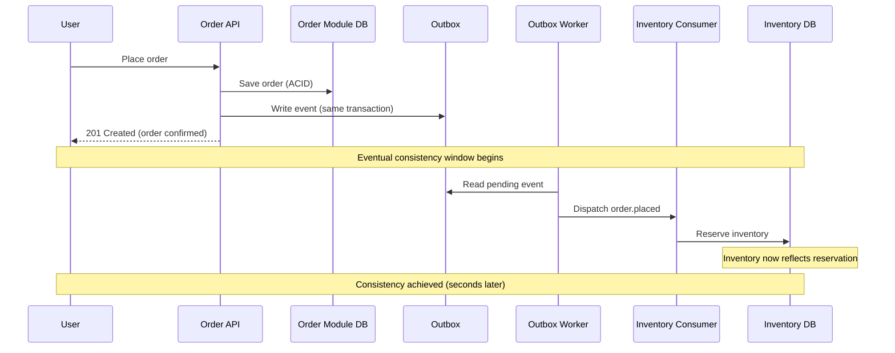

# Delivery, Ordering, and Consistency

## Metadata

| Field | Value |
|-------|-------|
| Title | Kairo Event Delivery Guarantees, Ordering Expectations, and Consistency Semantics |
| Document ID | KAI-EVT-008 |
| Status | Draft |
| Version | 0.1 |
| Target Release | V1 |
| Owner | Distributed Event Delivery and Consistency Architect |
| Created | 2026-07-22 |
| Last Updated | 2026-07-22 |
| Reviewers | TODO |
| Related Documents | [Event Architecture](./Event-Architecture.md), [Event Consumption and Inbox](./Event-Consumption-and-Inbox.md), [Event Publishing and Outbox](./Event-Publishing-and-Outbox.md), [Transaction and Consistency Architecture](../Data/Transaction-and-Consistency-Architecture.md), [Reporting and Analytics Architecture](../Data/Reporting-and-Analytics-Architecture.md), [Data Access and Persistence](../Data/Data-Access-and-Persistence.md) |
| Dependencies | [Event Architecture](./Event-Architecture.md), [Transaction and Consistency Architecture](../Data/Transaction-and-Consistency-Architecture.md) |

---

## Applicable Version

This document defines V1 delivery, ordering, and consistency semantics. V1 provides at-least-once delivery with idempotent consumers in the modular monolith. The architecture establishes honest guarantees — achievable with V1 infrastructure — and identifies where future distributed infrastructure changes the landscape without changing application-level contracts.

---

## Purpose

This document defines what guarantees the Kairo event infrastructure provides regarding delivery, ordering, and consistency — and equally important, what guarantees it does NOT provide. Honest guarantees prevent developers from building on false assumptions that work in testing but fail in production.

Distributed systems have fundamental limits. Networks lose messages. Processes crash between steps. Clocks disagree. This document establishes the guarantees that hold despite these realities and the mechanisms that bridge the gap between infrastructure limits and business correctness requirements.

---

## Scope

This document covers:

- Delivery guarantee semantics (at-most-once, at-least-once, effectively-once).
- Ordering expectations (global, per-aggregate, per-tenant, partition).
- Consistency semantics (eventual, lag, staleness, reconciliation).
- User-visible and operational consistency implications.
- V1 guarantees and future distributed guarantees.

This document does not cover:

- Broker technology or partition configuration (infrastructure documentation).
- Consumer handler implementation (development standards).
- Outbox or inbox table schemas (implementation details).
- Event contract format (see [Event Contract Standards](./Event-Contract-Standards.md)).
- API response consistency (see [Transaction and Consistency Architecture](../Data/Transaction-and-Consistency-Architecture.md)).

---

## Mandatory Principles

| # | Principle |
|---|-----------|
| 1 | Kairo must not claim exactly-once delivery without a precise, limited definition |
| 2 | At-least-once delivery is the default architectural assumption for durable integration events |
| 3 | Effectively-once business outcomes require idempotency and deduplication |
| 4 | Global ordering is not the default |
| 5 | Ordering must be defined only where business behavior requires it |
| 6 | Consumers must tolerate unrelated events arriving concurrently |
| 7 | Eventual consistency must be visible in user experience and operational tooling |
| 8 | Consumer lag must be measurable |
| 9 | Reconciliation is required for critical external integrations |
| 10 | Search indexes and analytical projections may lag authoritative state |
| 11 | Financial and inventory projections require explicit correctness rules |
| 12 | Delivery guarantees may differ between internal notifications and durable integration events |

---

## Delivery Guarantees

### 1. At-Most-Once Delivery

| Aspect | Detail |
|--------|--------|
| Definition | Each event is delivered zero or one times. Never more. May be lost. |
| Use in Kairo | **Not the default for integration events.** Losing business-significant facts is unacceptable. |
| Appropriate for | Ephemeral notifications where loss is recoverable (cache invalidation, UI hints) |
| Mechanism | Fire-and-forget dispatch. No retry. No outbox. |
| Risk | Events may be silently lost on any failure |
| V1 usage | Limited to non-critical in-process notifications where loss triggers self-healing (cache miss) |

---

### 2. At-Least-Once Delivery

**At-least-once delivery is the default architectural assumption for durable integration events.**

| Aspect | Detail |
|--------|--------|
| Definition | Each event is delivered one or more times. Never lost (assuming infrastructure is functional within bounded time). May be duplicated. |
| Use in Kairo | **Default for all integration events.** The transactional outbox ensures publication. Infrastructure retries ensure delivery. |
| Mechanism | Outbox → publication worker → event infrastructure → consumer. Retry on failure. Dead-letter on exhaustion. |
| Trade-off | May deliver duplicates. Consumers must handle. |
| Why not at-most-once | Losing an "order placed" event means inventory is never reserved and payment is never authorized. Unacceptable. |

---

### 3. Effectively-Once Business Processing

**Effectively-once business outcomes require idempotency and deduplication.**

| Aspect | Detail |
|--------|--------|
| Definition | Each event produces its business effect exactly once, even though delivery may occur multiple times |
| Mechanism | At-least-once delivery + idempotent consumer = effectively-once business outcome |
| Not infrastructure | This is NOT an infrastructure guarantee. It is an application-level guarantee achieved through consumer design. |
| Components | Event ID deduplication (inbox), state-based idempotency checks, or naturally idempotent operations |
| Result | From the business perspective: each fact is processed once. From the infrastructure perspective: delivery may repeat. |

---

### 4. Exactly-Once Claims

**Kairo must not claim exactly-once delivery without a precise, limited definition.**

| Rule | Detail |
|------|--------|
| Infrastructure level | Exactly-once delivery is NOT guaranteed at the infrastructure level. Networks, crashes, and retries make this impossible to guarantee in general. |
| Application level | Effectively-once business processing IS achievable through idempotency and deduplication. |
| Terminology | Kairo says "at-least-once delivery with effectively-once processing" — not "exactly-once delivery." |
| Why precision matters | Claiming "exactly-once" without qualification creates false confidence. Developers may skip idempotency. Then duplicates cause real damage. |
| Honest documentation | All documentation describes the actual guarantee: delivery may duplicate. Consumer idempotency is required. |

---

### 5. Duplicate Delivery

| Cause | Scenario |
|-------|----------|
| Publication worker crash | Worker dispatches event, crashes before marking published, re-dispatches on restart |
| Network ACK failure | Event delivered to consumer, ACK lost, infrastructure re-delivers |
| Consumer crash | Consumer processes event, crashes before acknowledging, infrastructure re-delivers |
| Replay | Operations triggers replay of historical events |
| Infrastructure retry | Transient failure triggers automatic retry |

| Rule | Detail |
|------|--------|
| Expected | Duplicate delivery is a normal operational scenario, not an error condition |
| Consumer handles | Every consumer must produce correct results even when the same event arrives multiple times |
| Not preventable | No amount of infrastructure sophistication eliminates all duplicate scenarios |
| Frequency | Rare during normal operation. More frequent during infrastructure instability or recovery. |

---

### 6. Event Loss

| Scenario | Protection |
|----------|-----------|
| Application crash before transaction commit | No event recorded (correct — nothing happened) |
| Application crash after commit, outbox exists | Outbox worker publishes on recovery (no loss) |
| Worker crash during dispatch | Outbox record remains pending (no loss) |
| Infrastructure outage (temporary) | Outbox records accumulate. Published on recovery (no loss). |
| Extended infrastructure outage beyond retention | Events may be lost if outbox is cleaned before delivery. Alert triggers investigation. |
| Database corruption | Authoritative data is recoverable from backup. Outbox may need rebuild. |

| Rule | Detail |
|------|--------|
| Outbox prevents loss | The transactional outbox is the primary mechanism preventing event loss |
| Bounded retention | Outbox retention has a finite window. Extended outages may exceed it. |
| Reconciliation for gaps | If events are lost, consumers reconcile via producer APIs |
| Never silent | Event loss is always detectable through monitoring (pending records aging, consumer lag) |

---

## Ordering

### 7. Ordering Overview

**Global ordering is not the default.**
**Ordering must be defined only where business behavior requires it.**

| Ordering Scope | Guarantee | Cost | V1 Support |
|---------------|-----------|------|:---:|
| Global (all events, all producers) | None | Impractical at any scale | No |
| Per-aggregate (events from same aggregate instance) | Best-effort (V1), guaranteed with partitioning (future) | Low | Yes |
| Per-tenant | None (unless same aggregate) | High (requires partitioning) | No |
| Per-partition (future broker) | Guaranteed within partition | Broker feature | Future |
| None (concurrent) | No ordering | Default | Yes |

---

### 8. Global Ordering

| Rule | Detail |
|------|--------|
| Not provided | No ordering relationship between events from different aggregates, modules, or tenants |
| Why not | Global ordering requires a single serialization point — a bottleneck that limits throughput and creates a single point of failure |
| Not needed | Business operations rarely require "Event A from Module X happened before Event B from Module Y" as a guarantee |
| Consumer design | Consumers must not assume global ordering. Use timestamps and causation IDs to reason about sequence when needed. |

---

### 9. Per-Aggregate Ordering

| Rule | Detail |
|------|--------|
| Provided (best-effort V1) | Events from a single aggregate instance are ordered in V1 (single outbox processor, sequential dispatch) |
| Why useful | Business operations within an aggregate are sequential: order placed → paid → shipped. Consumers processing these events benefit from receiving them in order. |
| V1 mechanism | Single publication worker processes outbox records in insertion order. Same aggregate's events are naturally sequential. |
| Future mechanism | Broker partitioning by aggregate/resource ID ensures partition-level ordering |
| Not contractual in V1 | V1 provides ordering as a practical property, not a contractual guarantee. Consumer should handle reordering gracefully. |

---

### 10. Per-Tenant Ordering

| Rule | Detail |
|------|--------|
| Not provided | Events from the same tenant but different aggregates have no ordering guarantee |
| Why not | A tenant may have many concurrent operations. Ordering all of them serializes tenant throughput. |
| Not needed | Different aggregates within a tenant are independent (order A and product B have no ordering relationship) |
| Exception | Events from the same aggregate within a tenant ARE ordered (per-aggregate ordering applies) |

---

### 11. Partition Ordering

| Aspect | Detail |
|--------|--------|
| V1 status | Not applicable (no broker partitions in V1 — in-process delivery) |
| Future | When a broker is deployed, events are partitioned by subject resource ID |
| Guarantee | Events in the same partition are ordered (broker guarantees this) |
| Partition key | Subject (aggregate/resource) ID — ensures same-aggregate events are in the same partition |
| Cross-partition | No ordering between partitions (different aggregates may be in different partitions) |

---

### 12. Concurrent Consumers

**Consumers must tolerate unrelated events arriving concurrently.**

| Rule | Detail |
|------|--------|
| Independent consumers | Different consumers processing the same event do so concurrently and independently |
| Different event types | A consumer may receive events of different types concurrently |
| Same-aggregate serial | Events for the same aggregate are not processed concurrently by the same consumer (V1: single handler, sequential) |
| Different-aggregate concurrent | Events for different aggregates may be processed concurrently (within a single consumer or across consumers) |
| Consumer responsibility | Consumer must handle concurrent processing safely (no shared mutable state across events) |

---

## Consistency

### 13. Eventual Consistency

**Eventual consistency must be visible in user experience and operational tooling.**

| Rule | Detail |
|------|--------|
| Definition | After a state change in Module A, consumers in Module B will eventually reflect that change — but not immediately |
| Bounded | "Eventually" means within a bounded, measurable time window — not indefinitely |
| Visible | Users, operators, and developers must be aware of eventual consistency. It is not hidden. |
| Acceptable lag | Normal operation: seconds. Under load: seconds to minutes. Extended: triggers alerts. |
| Not a bug | Eventual consistency is a deliberate architectural choice. Lag is expected, not a defect. |
| Reference | Aligns with [Transaction and Consistency Architecture](../Data/Transaction-and-Consistency-Architecture.md) |

---

### 14. Read-Model Lag

| Aspect | Detail |
|--------|--------|
| Definition | Read models (query-optimized views) may lag behind the authoritative state |
| Source | Read models are updated by event consumers — lag = publication delay + processing delay |
| Normal lag | Seconds (outbox processing interval + handler execution) |
| Acceptable | For most read scenarios, seconds of lag is acceptable |
| Communicated | APIs serving read-model data communicate freshness where relevant (see [Reporting and Analytics Architecture](../Data/Reporting-and-Analytics-Architecture.md)) |
| Not for decisions | Real-time decisions (stock check for checkout) use the authoritative source, not a read model |

---

### 15. Search-Index Lag

**Search indexes and analytical projections may lag authoritative state.**

| Aspect | Detail |
|--------|--------|
| Definition | Search indexes are populated by event consumers and may lag the authoritative database |
| Normal lag | Seconds to minutes (event processing + indexing time) |
| Visible | Search results indicate freshness where applicable |
| Acceptable | A product activated 5 seconds ago not yet appearing in search is expected behavior |
| Recovery | If search index becomes corrupted or significantly stale, full re-index from authoritative source |
| Not authoritative | Search results are derived. The authoritative database is the source of truth. |

---

### 16. Consumer Lag

**Consumer lag must be measurable.**

| Aspect | Detail |
|--------|--------|
| Definition | The time between event publication and consumer processing completion |
| Measurement | `consumer_lag = consumer_processed_at - event_published_at` |
| Monitoring | Per-consumer lag metrics tracked continuously |
| Alerting | Lag exceeding thresholds triggers alerts |
| Causes | Consumer slowness, consumer failure, high event volume, infrastructure issues |
| Impact | Higher lag = longer eventual consistency window = more stale derived data |

| Lag Category | Duration | Action |
|-------------|----------|--------|
| Normal | < 5 seconds | No action |
| Elevated | 5-60 seconds | Monitor. May resolve naturally. |
| High | 1-5 minutes | Investigate consumer health |
| Critical | > 5 minutes | Investigate. Consumer may be down or poisoned. |

---

### 17. Stale Data

| Scenario | Impact | Mitigation |
|----------|--------|-----------|
| Read model shows old price | Customer sees outdated price | Checkout validates against authoritative price |
| Search shows deleted product | Customer clicks on non-existent product | API returns 404. Search re-indexes shortly. |
| Dashboard shows yesterday's total | Business decision based on stale data | Dashboard shows data freshness timestamp |
| Inventory display shows old stock | Customer attempts to buy unavailable item | Checkout checks authoritative inventory |
| Notification uses old name | Customer sees outdated information | Notification is contextually correct (at time of event) |

| Rule | Detail |
|------|--------|
| Critical decisions use authoritative source | Checkout, payment, and inventory operations query the authoritative database, not derived views |
| Display can tolerate lag | UI elements showing catalog, search results, and dashboards can tolerate seconds-to-minutes of lag |
| Freshness visible | Where staleness matters, data freshness timestamps are communicated |
| Self-correcting | Stale derived data self-corrects when the next event is processed |

---

### 18. Conflict Resolution

| Scenario | Resolution |
|----------|-----------|
| Two events for same resource processed in wrong order | Consumer uses `occurredAt` timestamp to determine which is newer. Older event's effect is discarded. |
| Consumer's derived state disagrees with producer's authoritative state | Producer is correct. Consumer reconciles. |
| Concurrent events update the same consumer state | Consumer uses optimistic concurrency (version check) on its own state |
| Event says "quantity = 50" but consumer already has "quantity = 55" (newer) | Consumer keeps newer value. Stale event is ignored. |

| Rule | Detail |
|------|--------|
| Last-writer-wins (with timestamp) | For derived data, the most recent event (by `occurredAt`) wins |
| Producer is authoritative | Conflicts between derived and authoritative state always resolve in favor of the producer |
| Optimistic concurrency on consumer state | If two events race to update the same consumer state, optimistic concurrency prevents corruption |
| Reconciliation resolves persistent conflicts | If conflicts cannot be resolved automatically, reconciliation from producer API provides the correct state |

---

### 19. Reconciliation

**Reconciliation is required for critical external integrations.**

| Rule | Detail |
|------|--------|
| When needed | Extended consumer failure, dead-letter events discarded, infrastructure failure, external provider gap |
| Mechanism | Consumer calls producer's API to fetch current authoritative state and corrects its derived data |
| Critical integrations | Payment, inventory, and order state require reconciliation capability |
| Frequency | On-demand (recovery). Periodic for critical external integrations (e.g., daily payment reconciliation with provider). |
| Producer support | Producer APIs must support reconciliation queries (modified-since, full-state export) |
| Consumer support | Consumer's data model must be rebuildable from producer API responses |
| External providers | Reconciliation with external providers (payment gateways, carriers) is periodic and auditable |

---

### 20. External Provider Consistency

| Aspect | Detail |
|--------|--------|
| Challenge | External providers (payment gateway, shipping carrier) have their own state that may diverge from Kairo's |
| Webhook lag | Provider webhooks may arrive late or be missed |
| State disagreement | Kairo says "pending." Provider says "captured." Discrepancy requires reconciliation. |
| **Reconciliation** | **Periodic API-based reconciliation with critical external providers** |
| Direction | Payment reconciliation: compare Kairo payment records against provider transaction records |
| Financial requirement | Financial discrepancies must be investigated and resolved. Not silently ignored. |
| Audit | Reconciliation results are auditable (what matched, what diverged, how resolved) |

---

### 21. User-Visible Consistency

| Scenario | User Experience | Implementation |
|----------|----------------|----------------|
| User places order | "Order confirmed" immediately | API responds from authoritative order state |
| User checks inventory (admin) | "In stock: 45" (may be seconds behind) | Read from authoritative or near-real-time read model |
| User searches for product | Product appears after indexing delay | Search index lag is acceptable for search |
| User views order after payment | Status updates within seconds | Payment event → order status consumer → read model |
| User views dashboard | "Revenue: $X (as of 10:30 AM)" | Freshness communicated explicitly |
| Admin changes product price | New price visible in catalog within seconds | Event-driven cache/read-model update |

| Rule | Detail |
|------|--------|
| Immediate actions feel immediate | User's own action result comes from authoritative state (not derived) |
| Background updates are tolerable | Cross-module reactions (inventory reservation after order) take seconds. Users accept this. |
| Freshness visible | Where lag matters, timestamps communicate it |
| Critical checks against authoritative | Checkout, payment, and stock availability use authoritative source, not derived |

---

## Delivery Guarantee Matrix

| Event Category | Delivery Guarantee | Duplicates Possible | Ordering | Consumer Must Be Idempotent |
|---------------|-------------------|:---:|----------|:---:|
| Integration events (cross-module) | At-least-once | Yes | Per-aggregate (best-effort) | **Yes** |
| Internal domain events (same module) | In-process (reliable within process) | Rare | Per-aggregate (sequential) | Recommended |
| Internal notifications (cache, UI hints) | At-most-once (best-effort) | No (no retry) | None | No |
| Webhook delivery (external) | At-least-once | Yes | Best-effort chronological | **Yes** (external consumer) |
| Audit events | Guaranteed (never lost) | Rare | Chronological | Yes |
| Security events | Guaranteed | Rare | Chronological | Yes |
| Operational telemetry | Best-effort | No | None | No |

---

## Ordering Requirement Matrix

| Business Scenario | Ordering Requirement | Scope | Mechanism |
|-------------------|---------------------|-------|-----------|
| Order lifecycle (placed → paid → shipped) | Required | Per-aggregate (order) | Same-aggregate sequential processing |
| Payment lifecycle (authorized → captured) | Required | Per-aggregate (payment) | Same-aggregate sequential processing |
| Product updates (multiple field changes) | Nice-to-have | Per-aggregate (product) | Timestamp-based last-writer-wins |
| Inventory adjustments to same SKU | Required | Per-aggregate (inventory item) | Same-aggregate sequential + atomic operations |
| Customer registration | Not required | — | Independent event |
| Multiple modules reacting to same event | Not required | — | Independent concurrent consumers |
| Events from different orders | Not required | — | Different aggregates are independent |
| Events from different tenants | Not required | — | Different tenants are independent |

---

## Consistency Scenario Table

| Scenario | Consistency Model | Acceptable Lag | Verification | Document |
|----------|------------------|---------------|-------------|----------|
| Order placed → inventory reserved | Eventual | Seconds | Authoritative inventory check at checkout | [Transaction and Consistency](../Data/Transaction-and-Consistency-Architecture.md) |
| Payment captured → order status updated | Eventual | Seconds | Payment status queryable via API | [Transaction and Consistency](../Data/Transaction-and-Consistency-Architecture.md) |
| Product updated → search index updated | Eventual | Seconds to minutes | Re-index self-corrects | [Data Access and Persistence](../Data/Data-Access-and-Persistence.md) |
| Product updated → storefront cache updated | Eventual | Seconds | Cache TTL self-corrects | [Data Access and Persistence](../Data/Data-Access-and-Persistence.md) |
| Order placed → dashboard total updated | Eventual | Minutes | Freshness timestamp shown | [Reporting and Analytics](../Data/Reporting-and-Analytics-Architecture.md) |
| Payment captured → external provider reconciliation | Periodic | Hours | Scheduled reconciliation job | This document |
| Refund processed → customer notified | Eventual | Seconds to minutes | Notification delivery tracking | [Event Architecture](./Event-Architecture.md) |

---

## V1 Guarantees

### 22. V1 Guarantees

| Guarantee | V1 Level | Mechanism |
|-----------|----------|-----------|
| Integration event delivery | At-least-once | Transactional outbox + in-process worker + retry |
| Business processing | Effectively-once | Consumer idempotency (inbox/state-based) |
| Per-aggregate ordering | Best-effort (practical, not contractual) | Single outbox worker, sequential processing |
| Global ordering | None | Not provided, not needed |
| Consumer lag measurement | Yes | Prometheus metrics (publication time vs processing time) |
| Event loss prevention | Yes | Outbox persists through infrastructure failures |
| Duplicate handling | Consumer responsibility | Inbox deduplication or state-based idempotency |
| Reconciliation | API-based | Consumer calls producer API for full state sync |
| Read-model freshness | Seconds | Outbox polling interval + handler processing time |
| External reconciliation | Manual/periodic | Payment reconciliation via provider API |

---

### 23. Future Distributed Guarantees

| Guarantee | Future Level | Mechanism |
|-----------|-------------|-----------|
| Integration event delivery | At-least-once | Outbox → broker → consumer with ACK |
| Per-aggregate ordering | Guaranteed (partition-level) | Broker partitioning by resource ID |
| Competing consumers | Supported | Multiple consumer instances per partition |
| Consumer lag | Real-time dashboard | Broker-native lag metrics |
| Event replay | Automated | Event store with retention-based replay |
| Reconciliation | Automated triggers | Lag-based automatic reconciliation |
| External reconciliation | Automated periodic | Scheduled reconciliation jobs |
| Cross-region consistency | Eventual (region lag) | Multi-region broker replication |

| **Unchanged** | Detail |
|---------------|--------|
| At-least-once delivery | Same guarantee, different infrastructure |
| Consumer idempotency required | Same requirement regardless of infrastructure |
| Per-aggregate ordering scope | Same business scope, stronger infrastructure support |
| Reconciliation as fallback | Same role, better automation |
| Effectively-once processing | Same application-level pattern |

---

## Version Gate

| Version | Delivery, Ordering, and Consistency Gate |
|---------|----------------------------------------|
| V1 | At-least-once delivery for integration events via outbox. Effectively-once processing via consumer idempotency. Per-aggregate ordering (best-effort). Consumer lag measurable. Stale data acknowledged in UX (freshness timestamps). Critical decisions use authoritative source. Reconciliation via producer APIs. External provider reconciliation for payments. No exactly-once claims. |
| V2 | Broker-backed delivery with partition ordering. Consumer lag dashboard. Automated reconciliation triggers. Enhanced external provider reconciliation. Read-model freshness monitoring. |
| V3 | Event replay from event store. Cross-region eventual consistency. Automated conflict resolution for common patterns. Consumer lag SLAs. |

---

## Decision Summary

| Decision | Rationale |
|----------|-----------|
| At-least-once (not at-most-once) | Losing business events (order placed, payment captured) is unacceptable. Duplicates are handleable through idempotency. |
| No exactly-once claims | Dishonest guarantee creates false confidence. Developers skip idempotency. Then duplicates cause real damage. |
| Per-aggregate ordering (not global) | Global ordering is a throughput bottleneck. Business operations are aggregate-scoped. Per-aggregate is sufficient. |
| Eventual consistency is visible | Hidden lag creates false confidence. Users and operators must know when data may be stale. |
| Critical decisions against authoritative | Read models may lag. Checkout and payment decisions must use the authoritative source, not a derived view. |
| Reconciliation for external providers | Webhooks may be missed. Provider state may diverge. Periodic reconciliation catches gaps. |
| Consumer lag is measured | Unmeasured lag is invisible lag. Measured lag enables alerting and capacity planning. |
| Different guarantees per category | Cache invalidation does not need at-least-once. Financial events do. Applying the same guarantee to everything either over-engineers or under-protects. |

---

## Alternatives Considered

| Alternative | Rejected Because |
|------------|-----------------|
| Exactly-once delivery claim | Impossible to guarantee across all failure modes. Creates false confidence. |
| At-most-once for integration events | Losing "order placed" or "payment captured" creates silent business inconsistency. Unacceptable. |
| Global ordering | Requires single serialization point. Throughput bottleneck. Business does not need it. |
| Strong consistency across modules | Requires distributed transactions (2PC). Impractical, slow, and couples module availability. |
| Hide eventual consistency from users | Creates confusion when data appears stale. Visible freshness is honest and manageable. |
| No reconciliation | Events may be lost during extended outages. Without reconciliation, state diverges permanently. |
| At-least-once for cache invalidation | Over-engineering. Cache miss is self-healing. At-most-once is sufficient. |
| No consumer lag monitoring | Invisible lag. Cannot alert. Cannot plan capacity. Cannot detect consumer failures. |

---

## Architecture Impact

| Concern | Impact |
|---------|--------|
| Module design | Modules must implement idempotent consumers. Must support reconciliation APIs. Must use authoritative source for critical decisions. |
| Event infrastructure | Must provide at-least-once delivery for integration events. Must track consumer lag. Must support dead-letter for failed consumption. |
| User experience | UI must communicate freshness where lag is visible. Critical operations must validate against authoritative state. |
| Monitoring | Consumer lag, publication lag, dead-letter accumulation, and reconciliation status are critical operational metrics. |
| External integration | Payment and fulfillment integrations require periodic reconciliation with provider APIs. |
| Testing | Must test: duplicate delivery handling, out-of-order event handling, stale-data scenarios, reconciliation correctness. |

---

## Implementation Impact

| Area | Impact |
|------|--------|
| Modules | Must implement idempotent consumers (per [Event Consumption and Inbox](./Event-Consumption-and-Inbox.md)). Must provide reconciliation query APIs. Must validate critical operations against authoritative source. |
| Platform | Must provide at-least-once delivery infrastructure (outbox + worker). Must track and expose consumer lag metrics. Must provide dead-letter management. |
| Frontend | Must display freshness timestamps where applicable. Must handle stale data gracefully (product removed from search but 404 on click). |
| Operations | Must monitor consumer lag. Must investigate dead-letter events. Must manage reconciliation schedules for external providers. Must alert on lag thresholds. |
| Testing | Must test duplicate event handling. Must test ordering assumptions (out-of-order delivery). Must test reconciliation workflows. Must test stale-data UX. |

---

## Security Responsibilities

| Role | Delivery and Consistency Responsibilities |
|------|------------------------------------------|
| Event Delivery Architect | Defines delivery guarantees. Reviews ordering requirements. Governs consistency expectations. |
| Module Teams | Implement idempotent consumers. Provide reconciliation APIs. Use authoritative source for critical decisions. |
| Platform Team | Provides delivery infrastructure with at-least-once guarantee. Tracks consumer lag. Manages dead-letter. |
| Operations | Monitors delivery health. Manages reconciliation schedules. Investigates lag and dead-letter events. |
| Security Team | Validates that reconciliation with external providers does not expose credentials or sensitive data in logs. |

---

## Multi-Tenancy Responsibilities

| Responsibility | Detail |
|---------------|--------|
| Per-tenant lag possible | Consumer lag may vary by tenant (high-volume tenant may have higher lag during spikes) |
| Fair delivery | No tenant's events should starve other tenants' delivery |
| Per-tenant monitoring | Consumer lag can be broken down per tenant for support |
| Reconciliation per-tenant | Reconciliation operates within tenant boundaries |
| Cross-tenant not mixed | Eventual consistency for Tenant A's events does not affect Tenant B's consistency |

---

## Out of Scope

This document does not define:

- Broker partition configuration (infrastructure documentation).
- Consumer handler implementation (development standards).
- Specific lag threshold numeric values (operations configuration).
- Reconciliation schedule configuration (operations documentation).
- Event contract format (see [Event Contract Standards](./Event-Contract-Standards.md)).
- Outbox/inbox implementation (see [Event Publishing and Outbox](./Event-Publishing-and-Outbox.md), [Event Consumption and Inbox](./Event-Consumption-and-Inbox.md)).

---

## Future Considerations

- **Partition-guaranteed ordering** — Broker partitions ensure per-aggregate ordering contractually.
- **Consumer lag SLAs** — Formal SLA targets for maximum acceptable consumer lag.
- **Automated reconciliation triggers** — Automatic reconciliation when lag or gaps are detected.
- **Cross-region consistency** — Eventual consistency across geographic regions.
- **Conflict-free replicated data types** — CRDT patterns for specific eventually-consistent state.
- **Saga consistency patterns** — Explicit compensation patterns for multi-module workflows.
- **Consistency probes** — Automated testing that measures actual eventual consistency windows.

---

## Future Refactoring Triggers

This document should be revisited when:

- External broker provides contractual partition ordering (trigger for upgrading per-aggregate guarantee).
- Consumer lag SLAs need to be formalized (trigger for SLA definition).
- Multi-region deployment introduces cross-region consistency needs (trigger for geo-consistency patterns).
- Financial reconciliation volume requires automation (trigger for automated reconciliation infrastructure).
- Saga patterns emerge for multi-module workflows (trigger for saga consistency architecture).
- New delivery guarantee categories are needed (trigger for guarantee matrix expansion).

---

## Change History

| Version | Date | Author | Description |
|---------|------|--------|-------------|
| 0.1 | 2026-07-22 | Distributed Event Delivery and Consistency Architect | Initial draft — delivery, ordering, and consistency |
