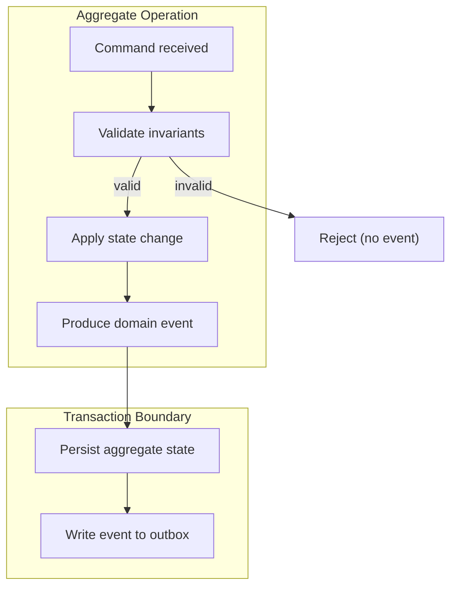
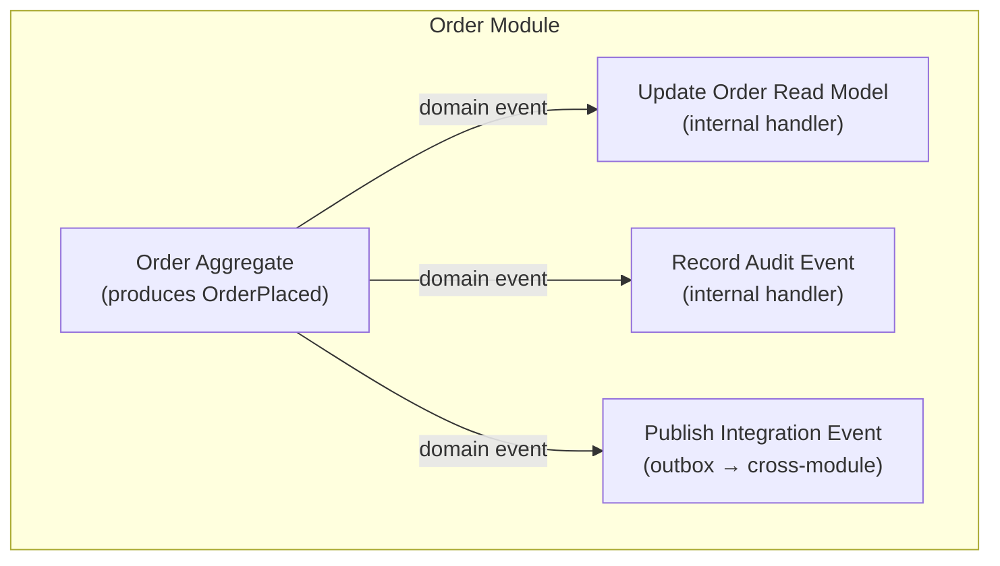
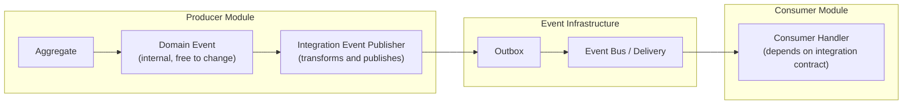

# Domain Event Architecture

## Metadata

| Field | Value |
|-------|-------|
| Title | Kairo Domain Event Architecture |
| Document ID | KAI-EVT-004 |
| Status | Draft |
| Version | 0.1 |
| Target Release | V1 |
| Owner | Domain Event Architecture Lead |
| Created | 2026-07-21 |
| Last Updated | 2026-07-21 |
| Reviewers | TODO |
| Related Documents | [Event Architecture](./Event-Architecture.md), [Event Contract Standards](./Event-Contract-Standards.md), [Event Taxonomy and Ownership](./Event-Taxonomy-and-Ownership.md), [Domain Model](../../02-Products/Domain-Model.md), [Bounded Contexts](../../03-Business-Capabilities/Bounded-Contexts.md), [Transaction and Consistency Architecture](../Data/Transaction-and-Consistency-Architecture.md), [Module Architecture](../Module-Architecture.md) |
| Dependencies | [Event Architecture](./Event-Architecture.md), [Transaction and Consistency Architecture](../Data/Transaction-and-Consistency-Architecture.md), [Module Architecture](../Module-Architecture.md) |

---

## Applicable Version

This document defines V1 domain event architecture aligned with the modular monolith strategy. Domain events are the primary mechanism through which business behavior within aggregates produces observable facts that other parts of the system may react to.

---

## Purpose

This document defines how domain events represent meaningful state changes inside Kairo's business domains. It establishes the relationship between aggregates, transactions, domain events, and their publication — ensuring that events are aligned with real business behavior rather than technical database operations.

Domain events are the bridge between "something happened in this module" and "other parts of the system need to know." Getting this bridge right — producing events at the correct moment, with correct semantics, from the correct source — is foundational to a coherent event-driven architecture.

---

## Scope

This document covers:

- Domain event purpose, creation, timing, and transaction relationship.
- Aggregate ownership of events and invariant preservation.
- Internal consumption versus cross-module publication.
- Conversion from domain events to integration events.
- Event naming, granularity, and payload direction.
- Side effects, failure handling, ordering, and deduplication.
- V1 modular monolith behavior and future service extraction.

This document does not cover:

- Integration event contract schemas (see [Event Contract Standards](./Event-Contract-Standards.md)).
- Event infrastructure technology (infrastructure documentation).
- Consumer handler implementation patterns (development standards).
- Specific domain event definitions per module (module specifications).
- Outbox table schema (implementation detail).

---

## Mandatory Principles

| # | Principle |
|---|-----------|
| 1 | Domain events originate from completed domain behavior |
| 2 | Domain events must not bypass aggregate invariants |
| 3 | Domain events are not used to request behavior |
| 4 | Internal domain events may have different compatibility requirements from public integration events |
| 5 | A domain event does not automatically need external publication |
| 6 | Cross-module consumers must depend on approved integration contracts |
| 7 | Domain-event handlers must not create hidden circular module dependencies |
| 8 | Side effects that must survive process failure require durable publication |
| 9 | Domain events must remain aligned with domain language |
| 10 | Large generic events such as EntityUpdated should be avoided when meaningful business facts are known |

---

## 1. Domain-Event Purpose

Domain events represent business-meaningful state changes that have occurred within a bounded context.

| Purpose | Detail |
|---------|--------|
| Record business facts | "An order was placed." "A payment was captured." Not "a row was inserted." |
| Trigger reactions | Other parts of the system react to the fact (within the module or across modules) |
| Enable decoupling | The producing aggregate does not need to know who reacts |
| Support audit | Domain events feed business audit records |
| Enable extensibility | New reactions can be added without modifying the producing aggregate |

**Domain events originate from completed domain behavior.** They are not speculative, tentative, or requested. They describe what HAS happened, not what SHOULD happen.

---

## 2. Aggregate Ownership

| Rule | Detail |
|------|--------|
| Aggregate produces | Domain events are produced by the aggregate that owns the state change |
| Single aggregate per event | Each domain event is produced by exactly one aggregate instance |
| Aggregate boundary | The event represents a state change within that aggregate's consistency boundary |
| **Not bypassed** | **Domain events must not bypass aggregate invariants.** The aggregate validates all rules before the event is produced. The event reflects a valid state transition. |
| Produced post-validation | Events are created AFTER the aggregate has validated and applied the change — not as a mechanism to validate |

---

## 3. Event Creation

**Domain events originate from completed domain behavior.**

| Rule | Detail |
|------|--------|
| Created by aggregate | The aggregate creates the event as part of its state transition |
| After invariant check | Invariants are satisfied BEFORE the event is created |
| Within the operation | Event creation is part of the domain operation (not a separate step) |
| Intentional | Events are explicitly created by domain logic. Not auto-generated from ORM change tracking. |
| Meaningful | Only business-meaningful state changes produce events. Not every property change. |

---

## 4. Event Timing

| Rule | Detail |
|------|--------|
| Post-commit semantics | The event describes a fact. The fact is true only after the transaction commits. |
| Not before commit | Events are not delivered to consumers before the producing transaction commits |
| Outbox ensures this | The transactional outbox pattern (write event to outbox in same transaction) ensures events represent committed state |
| No speculative events | "Order will be placed" is not an event. "Order was placed" is. |

---

## 5. Transaction Relationship

| Rule | Detail |
|------|--------|
| Same transaction | Event is written to outbox in the same database transaction as the state change |
| Atomic | Either both state change AND event persist, or neither does |
| No split-brain | Prevents: state changed but event lost, or event published but state rolled back |
| Single transaction per aggregate | One aggregate operation = one transaction = zero or more events |
| Multiple events possible | A single aggregate operation may produce multiple domain events (e.g., order placed AND items reserved) |

---

## 6. Internal Consumers

| Rule | Detail |
|------|--------|
| Same module | Internal consumers are handlers within the same module as the producer |
| Same process | In V1 (monolith), internal handlers are in-process |
| Side effects | Internal handlers perform side effects: update read models, send notifications, trigger workflows |
| Not a replacement for domain logic | Core domain logic belongs in the aggregate. Handlers perform follow-on effects. |
| May be synchronous | V1 allows synchronous in-process handlers for immediate side effects (within same transaction context) |
| Or asynchronous | For non-critical side effects, internal handlers may process asynchronously |

---

## 7. Cross-Module Publication

**A domain event does not automatically need external publication.**

| Rule | Detail |
|------|--------|
| Selective | Not every domain event is published across module boundaries. Only those with cross-module significance. |
| Explicit decision | Publishing a domain event as an integration event is an explicit architectural decision (not automatic) |
| Governed | Integration events are governed (schema versioned, documented, reviewed) |
| Internal stays internal | Domain events that only matter within the module remain internal (no governance overhead) |
| Example | `OrderLineItemQuantityAdjusted` may be internal. `OrderPlaced` is published as integration event. |

---

## 8. Conversion to Integration Events

**Cross-module consumers must depend on approved integration contracts.**

| Rule | Detail |
|------|--------|
| Transformation | Domain events are transformed into integration events before cross-module publication |
| Not 1:1 | The integration event may differ from the domain event (different shape, fewer fields, different naming) |
| Stable contract | The integration event has a stable schema (versioned, governed). The domain event may evolve freely. |
| Decoupling | Changes to internal domain events do not automatically break external consumers (transformation layer absorbs changes) |
| Producer responsibility | The producing module maps its domain events to integration events |

---

## 9. Invariant Preservation

**Domain events must not bypass aggregate invariants.**

| Rule | Detail |
|------|--------|
| Events reflect valid state | If an event exists, the producing aggregate validated all invariants before creating it |
| Not a validation mechanism | Events are not created to "check if something is valid." The aggregate validates. The event records the result. |
| Consumer trust | Consumers can trust that the fact described by the event actually occurred correctly (producer validated) |
| No invalid events | If validation fails, no event is produced. The operation is rejected. |
| Example | `OrderPlaced` means: all items had valid prices, customer was valid, payment method accepted. The aggregate verified all of this. |

---

## 10. Event Naming

**Domain events must remain aligned with domain language.**
**Large generic events such as EntityUpdated should be avoided when meaningful business facts are known.**

| Rule | Detail |
|------|--------|
| Past tense | Events describe completed facts: `ProductActivated`, `OrderPlaced`, `PaymentCaptured` |
| Domain language | Names use the bounded context's ubiquitous language (see [Domain Model](../../02-Products/Domain-Model.md)) |
| Specific | Prefer specific events over generic ones. `ProductActivated` not `ProductUpdated`. |
| Business-meaningful | Names describe business meaning, not technical operations. Not `ProductRowUpdated`. |
| Avoid generic | `EntityUpdated`, `RecordChanged`, `DataModified` are anti-patterns. They communicate nothing about what happened. |

| Anti-Pattern | Why Wrong | Correct Approach |
|-------------|-----------|-----------------|
| `ProductUpdated` (generic) | What was updated? Price? Name? Status? | `ProductActivated`, `ProductPriceChanged`, `ProductRenamed` |
| `OrderChanged` | Meaningless. What changed about it? | `OrderCancelled`, `OrderShipped`, `OrderLineAdded` |
| `EntityCreated` | What entity? What business meaning? | `CustomerRegistered`, `OrderPlaced` |
| `DataModified` | No business context at all | Specific event per meaningful change |

---

## 11. Event Granularity

| Guideline | Detail |
|-----------|--------|
| One business fact per event | Each event describes one meaningful business occurrence |
| Not too fine | Changing a product's description is not typically event-worthy (unless consumers care). Activating a product is. |
| Not too coarse | `EverythingHappened` is useless. Events should be specific enough for consumers to act on. |
| Consumer-driven selection | If consumers need to distinguish between types of changes, produce separate events |
| Aggregate-aligned | Event granularity aligns with aggregate operations (one operation → one or more specific events) |
| V1 practical | Start with clearly needed events. Add more when consumer demand demonstrates need. |

---

## 12. Event Payload Direction

| Rule | Detail |
|------|--------|
| Hybrid default | Include key identifying and decision-relevant fields + resource ID for full data access via API |
| Internal events richer | Internal domain events may carry more detail (same module, same trust boundary) |
| Integration events minimized | Integration events follow [Event Contract Standards](./Event-Contract-Standards.md) — minimized, governed |
| Point-in-time where needed | Where consumers need data at the moment of the event (price at order time), include it |
| Reference for everything else | For data that consumers can fetch later (full product details), include the ID |
| No entity dumps | Never serialize the entire aggregate state as an event payload |

---

## 13. Side Effects

**Side effects that must survive process failure require durable publication.**

| Side Effect Type | Durability | Mechanism |
|-----------------|-----------|-----------|
| Update read model (same module) | Must survive failure | Internal handler with retry |
| Send notification (email, push) | Must survive failure | Integration event → notification consumer (outbox-based) |
| Update search index | Should survive failure | Integration event → search consumer (outbox-based) |
| Update analytics | May lose occasionally | Best-effort (V1: derived from integration events) |
| Invalidate cache | Best-effort | In-process handler (cache miss recovers naturally) |
| Trigger webhook | Must survive failure | Integration event → webhook delivery infrastructure |

| Rule | Detail |
|------|--------|
| Critical side effects = durable | If losing the side effect creates business inconsistency, it must go through the outbox |
| Best-effort = in-process | If losing the side effect is recoverable (cache, analytics), in-process handlers are acceptable |
| Not in aggregate | Side effects belong in handlers, not in the aggregate itself (aggregate remains pure domain logic) |

---

## 14. Failure Handling

| Scenario | Handling |
|----------|----------|
| Aggregate validation fails | No event produced. Operation rejected. Standard error response. |
| Transaction fails to commit | State change AND event are both rolled back. Nothing happened. |
| Internal handler fails | Retry in-process. If critical, handler failure may fail the operation (module decides). |
| Integration event delivery fails | Outbox retries. Dead-letter after exhaustion. Source transaction already committed (business operation succeeded). |
| Consumer handler fails | Consumer-side retry. Independent of producer. Dead-letter on exhaustion. |

| Rule | Detail |
|------|--------|
| Producer is committed | Once the transaction commits (state + outbox), the business operation is complete regardless of delivery |
| Delivery is best-effort (at-least-once) | Infrastructure retries delivery. Does not roll back the producing operation on delivery failure. |
| Consumer failure is consumer's problem | The producer is not affected by consumer failures |

---

## 15. Event Ordering

| Rule | Detail |
|------|--------|
| Per-aggregate ordered | Events from a single aggregate instance are ordered (the outbox preserves insertion order) |
| Cross-aggregate not ordered | Events from different aggregate instances (even in the same module) have no global order guarantee |
| Cross-module not ordered | Events from different modules have no ordering guarantee relative to each other |
| Consumer responsibility | If ordering matters to a consumer, the consumer uses event timestamps and causation IDs to reason about sequence |
| V1 simplification | In-process delivery with single outbox processor provides near-ordering. Not contractually guaranteed. |

---

## 16. Duplicate Processing

| Rule | Detail |
|------|--------|
| At-least-once delivery | Events may be delivered more than once (infrastructure retry, processor restart) |
| Consumer idempotency required | Consumers must handle duplicate processing without creating duplicate business effects |
| Event ID for deduplication | Consumers track processed event IDs to detect duplicates |
| State-based idempotency | Consumers check current state before acting (if already in expected state, skip) |
| Same rules as API | Same philosophy as [Idempotency, Concurrency, and Retries](../API/Idempotency-Concurrency-and-Retries.md) applied to event consumers |

---

## 17. Testing

| Test Category | Purpose |
|--------------|---------|
| Event production | Verify that the correct domain events are produced for a given aggregate operation |
| Event content | Verify that produced events contain the expected fields with correct values |
| No event on failure | Verify that no events are produced when the operation is rejected (validation failure) |
| Consumer idempotency | Verify that processing the same event twice does not create duplicate effects |
| Handler behavior | Verify that handlers produce correct side effects from events |
| Integration event mapping | Verify that domain events correctly transform to integration event contracts |
| Ordering assumptions | Verify consumers handle out-of-order events correctly (where relevant) |

---

## 18. Audit Relationship

| Rule | Detail |
|------|--------|
| Events feed audit | Domain events are a natural source for audit records |
| Not identical | The audit record may contain different information (before/after values, actor identity) than the domain event |
| Audit is a consumer | The audit system is a consumer of domain events (or integration events). Events do not replace audit — they inform it. |
| Different retention | Audit records have permanent retention. Domain events may have shorter retention. |
| Different audience | Audit is for compliance/investigation. Domain events are for system coordination. |

---

## 19. V1 Modular-Monolith Behavior

| Aspect | V1 Behavior |
|--------|-------------|
| Event production | Aggregate produces domain event. Written to outbox in same transaction. |
| Internal handling | In-process handlers invoked after transaction commits (within same module). |
| Cross-module delivery | Outbox processor reads committed events, dispatches to in-process event bus. Cross-module consumers handle in-process. |
| Ordering | Near-ordered (single processor, sequential dispatch). Not contractually guaranteed. |
| Failure | Handler failure retried in-process. Dead-letter to database table on exhaustion. |
| Performance | No network hop. In-process dispatch is fast. Outbox adds milliseconds-to-seconds lag. |
| Integration event | Domain event transformer writes integration event to outbox. Same infrastructure delivers it. |
| Testing | All handlers testable in-process. No external infrastructure dependencies for unit tests. |

---

## 20. Future Service Extraction

| Aspect | Future Direction |
|--------|-----------------|
| Domain events unchanged | Internal domain events remain within the extracted service. No contract change needed. |
| Integration events unchanged | Integration event contracts (schema, semantics) remain identical. Only delivery infrastructure changes. |
| Delivery changes | Outbox publishes to external broker instead of in-process bus |
| Consumers move | Consumer handlers may run in different processes/services |
| Ordering | Broker-level partitioning for per-aggregate ordering |
| Failure | Broker-managed retry and dead-letter (instead of in-process) |
| **Contract unchanged** | **The fact that contracts are designed as stable integration contracts from V1 means extraction does not require rewriting events or consumers.** |

---

## Conceptual Scenarios

### ProductActivated

| Aspect | Detail |
|--------|--------|
| Aggregate | Product (within Catalog module) |
| Precondition | Product has all required fields populated (name, price, at least one variant) |
| State change | Product status transitions from `draft` to `active` |
| Domain event | "Product activated" — carries product ID, activation timestamp |
| Internal handler | Update product read model (mark as visible in catalog queries) |
| Integration event | Published for cross-module consumers (search indexer, storefront cache) |
| Not produced if | Product is already active, or product fails completeness validation |

### InventoryAdjusted

| Aspect | Detail |
|--------|--------|
| Aggregate | Inventory item (within Inventory module) |
| Precondition | Adjustment does not violate configured minimum (if enforced) |
| State change | Quantity changes by delta. Movement record created. |
| Domain event | "Inventory adjusted" — carries SKU, delta, new quantity, reason |
| Internal handler | Update stock level read model. Check low-stock threshold alerts. |
| Integration event | Published with SKU, new quantity, delta (for storefront availability) |
| Not produced if | Adjustment would create invalid state (negative when disallowed) |

### OrderPlaced

| Aspect | Detail |
|--------|--------|
| Aggregate | Order (within Order module) |
| Precondition | Cart validated. Items available. Customer valid. Payment method valid. |
| State change | Order created with status `pending` |
| Domain event | "Order placed" — carries order ID, customer ID, line items summary, total |
| Internal handler | Record audit. Schedule confirmation notification. |
| Integration event | Published for payment (authorize), inventory (reserve), fulfillment (prepare) |
| Not produced if | Cart validation fails, items unavailable, customer invalid |

### PaymentCaptured

| Aspect | Detail |
|--------|--------|
| Aggregate | Payment (within Payment module) |
| Precondition | Payment authorized. Order confirmed. Capture amount valid. |
| State change | Payment status transitions from `authorized` to `captured` |
| Domain event | "Payment captured" — carries payment ID, order ID, amount, provider reference |
| Internal handler | Record audit. Update payment read model. |
| Integration event | Published for order (mark as paid), finance (record revenue) |
| Not produced if | Capture fails at provider. Amount exceeds authorization. |

### RefundCompleted

| Aspect | Detail |
|--------|--------|
| Aggregate | Refund (within Payment module) |
| Precondition | Original payment exists. Refund amount valid. Provider confirms. |
| State change | Refund status transitions to `completed` |
| Domain event | "Refund completed" — carries refund ID, payment ID, amount, reason |
| Internal handler | Record audit. Update payment balance. |
| Integration event | Published for order (update status), finance (record adjustment), inventory (return stock if applicable) |
| Not produced if | Provider rejects refund. Amount exceeds original. |

### TenantSuspended

| Aspect | Detail |
|--------|--------|
| Aggregate | Organization (within Tenant module) |
| Precondition | Valid suspension reason. Platform operator authorization. |
| State change | Organization status transitions to `suspended` |
| Domain event | "Tenant suspended" — carries organization ID, reason, suspended by, timestamp |
| Internal handler | Record audit (elevated). Notify organization admins. |
| Integration event | Published for ALL modules (cease active operations for this organization) |
| Not produced if | Organization already suspended. Invalid authorization. |

---

## Circular Dependency Prevention

**Domain-event handlers must not create hidden circular module dependencies.**

| Rule | Detail |
|------|--------|
| Acyclic | If Module A publishes events that Module B consumes, Module B should not publish events that Module A directly depends on for the same operation |
| Detection | Event subscription graphs are reviewed for circular paths |
| Resolution | If circularity exists: introduce a coordinating process manager, or restructure boundaries |
| Not hidden | Circular dependencies through events are just as problematic as direct circular calls — harder to detect because they are asynchronous |
| Review | New event subscriptions are reviewed for potential circularity during governance review |

| Anti-Pattern | Problem | Resolution |
|-------------|---------|-----------|
| Order → Payment → Order (via events) | Order publishes, Payment reacts, Payment publishes back, Order reacts → circular | Payment updates order status via Order's internal API (not via event that Order re-consumes) |
| A → B → C → A | Circular event chain | Break the cycle with a process manager or restructure module boundaries |

---

## Version Gate

| Version | Domain Event Architecture Gate |
|---------|-------------------------------|
| V1 | Aggregates produce domain events for significant state changes. Events written to outbox atomically with state change. Internal handlers process in-process. Integration events published through outbox for cross-module consumers. Events named in past tense using domain language. Hybrid payloads (key fields + reference). Consumer idempotency required. Event → integration event transformation explicit. Circular dependencies reviewed. |
| V2 | Event sourcing evaluated for select aggregates. Saga/process manager patterns formalized. Enhanced event testing tooling. Event catalog with producer-consumer mapping. |
| V3 | Service extraction with unchanged event contracts. Distributed process managers. Complex event processing for business patterns. |

---

## Decision Summary

| Decision | Rationale |
|----------|-----------|
| Aggregate produces events (not repository or ORM) | Events represent domain behavior, not persistence operations. The aggregate knows the business meaning. |
| Outbox for transaction integrity | Prevents split-brain (state committed but event lost, or event published but state rolled back). |
| Explicit transformation to integration events | Decouples internal domain evolution from external contract stability. Internal changes don't break consumers. |
| Specific event names over generic | `ProductActivated` communicates meaning. `EntityUpdated` communicates nothing. Consumers can route without inspecting payload. |
| Hybrid payload direction | Balance between self-sufficiency (consumer has enough to decide) and minimalism (no entity dumps). |
| Critical side effects via outbox | If losing a side effect creates inconsistency, it must go through the durable path. Best-effort for recoverable effects. |
| Circular dependency prevention | Async cycles are as harmful as sync cycles but harder to detect. Proactive prevention through governance. |

---

## Alternatives Considered

| Alternative | Rejected Because |
|------------|-----------------|
| ORM change tracking as event source | Produces technical events (property changed), not business events (product activated). No domain meaning. |
| Direct domain event publication (no transformation) | Couples consumers to internal aggregate model. Internal refactoring breaks external consumers. |
| Generic EntityUpdated events | No routing value. Consumer must inspect payload to determine meaning. Defeats purpose of typed events. |
| All side effects synchronous in aggregate | Makes aggregate complex and slow. Side effects belong in handlers. Aggregate should be pure domain logic. |
| Circular event chains allowed | Creates deadlocks, infinite loops, and reasoning complexity. Acyclic event graphs are simpler and safer. |
| Event sourcing by default | Over-complex for most aggregates. Traditional state + events is sufficient for V1. Event sourcing evaluated per-case. |
| Full entity state in every event | Creates coupling, large payloads, and sensitivity issues. Hybrid (key fields + reference) is more practical. |

---

## Architecture Impact

| Concern | Impact |
|---------|--------|
| Module design | Aggregates must explicitly produce domain events for significant state changes. Domain event → integration event transformation must be implemented. |
| Transaction management | Every aggregate write transaction includes outbox write. No separate event publication step. |
| Handler design | Handlers are separate from aggregates. Internal handlers for same-module effects. Integration events for cross-module. |
| Testing | Domain event production is a testable behavior of aggregates. Handler side effects are independently testable. |
| Governance | New integration events require review. Subscription graph reviewed for circularity. |
| Evolution | Internal domain events evolve freely. Integration events follow compatibility rules. Transformation layer absorbs the difference. |

---

## Implementation Impact

| Area | Impact |
|------|--------|
| Modules | Must implement domain event production in aggregates. Must implement domain → integration event transformation. Must implement idempotent consumers. Must register event subscriptions. |
| Platform | Must provide event infrastructure (in-process bus, outbox, delivery). Must provide handler registration. Must provide retry and dead-letter mechanisms. |
| Testing | Must test event production per aggregate operation. Must test handler idempotency. Must test transformation correctness. Must test circular dependency absence. |
| Documentation | Each module documents: which domain events it produces, which integration events it publishes, which integration events it consumes. |

---

## Security Responsibilities

| Role | Domain Event Responsibilities |
|------|------------------------------|
| Domain Event Architecture Lead | Defines domain event patterns. Reviews event naming and granularity. Validates circular dependency absence. |
| Module Teams | Produce domain events from aggregates. Transform to integration events. Implement idempotent consumers. Document event types. |
| Platform Team | Provides event infrastructure. Manages outbox processing. Implements retry and dead-letter. |
| Security Team | Reviews event payloads for sensitive data. Validates that audit events are correctly sourced from domain events. |

---

## Multi-Tenancy Responsibilities

| Responsibility | Detail |
|---------------|--------|
| Tenant in aggregate context | Aggregates operate within a tenant context. Domain events inherit this context. |
| Tenant in integration events | Integration events carry explicit tenant ID in envelope (per [Event Contract Standards](./Event-Contract-Standards.md)). |
| Consumer scoping | Consumers process within the event's tenant boundary. |
| No cross-tenant side effects | A domain event in Tenant A's context never produces side effects in Tenant B's data. |

---

## Out of Scope

This document does not define:

- Specific domain event types per module (module specifications).
- Event handler implementation code (development standards).
- Outbox table schema or processing implementation (implementation detail).
- Event sourcing patterns (future consideration — evaluated per module).
- Saga/process manager patterns (future consideration).
- Event infrastructure technology (infrastructure documentation).

---

## Future Considerations

- **Event sourcing for select aggregates** — Where full history reconstruction is valuable (order lifecycle, payment audit trail).
- **Saga / process manager patterns** — Multi-step cross-module workflows coordinated through events.
- **Domain event versioning** — If internal domain events need compatibility (event-sourced aggregates).
- **Event-driven projections at scale** — Read models built entirely from event streams.
- **Temporal queries** — Query state as-of a point in time using event history.
- **Domain event replay** — Rebuild state from event history (requires event sourcing adoption).

---

## Future Refactoring Triggers

This document should be revisited when:

- Event sourcing is adopted for specific aggregates (trigger for domain event persistence patterns).
- Multi-step cross-module workflows emerge (trigger for saga/process manager architecture).
- Service extraction changes the execution boundary for domain events (trigger for internal event delivery updates).
- Circular dependency is detected in production (trigger for dependency graph tooling).
- Handler complexity exceeds manageable levels (trigger for handler orchestration patterns).
- Generic events appear in the codebase (trigger for naming/granularity review).

---

## Change History

| Version | Date | Author | Description |
|---------|------|--------|-------------|
| 0.1 | 2026-07-21 | Domain Event Architecture Lead | Initial draft — domain event architecture |
