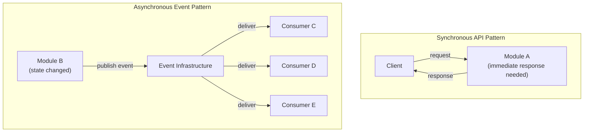
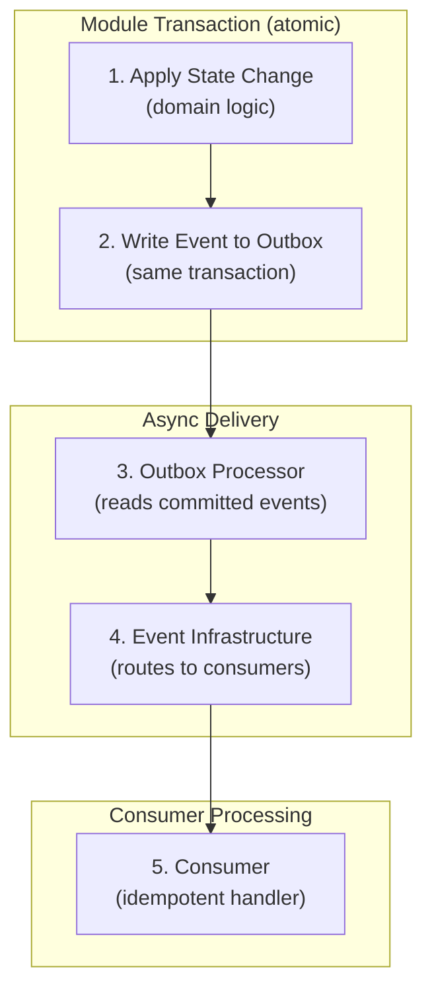
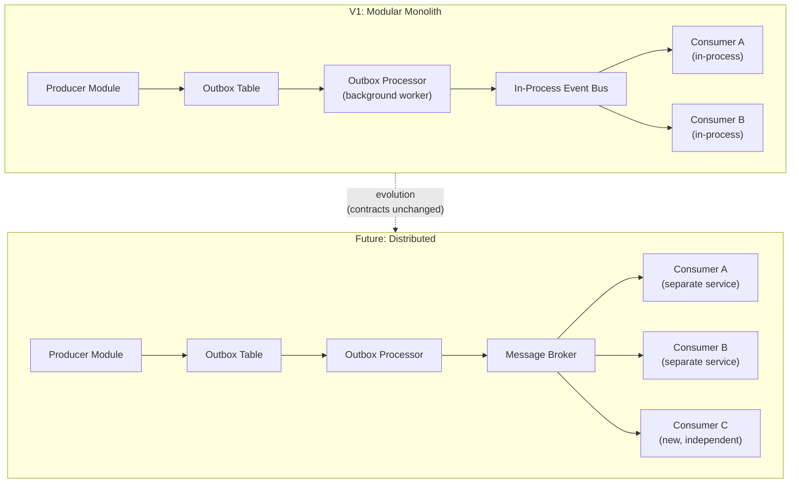

# Event Architecture

## Metadata

| Field | Value |
|-------|-------|
| Title | Kairo Event-Driven Architecture Foundation |
| Document ID | KAI-EVT-001 |
| Status | Draft |
| Version | 0.1 |
| Target Release | V1 |
| Owner | Chief Event-Driven Architecture Lead |
| Created | 2026-07-21 |
| Last Updated | 2026-07-21 |
| Reviewers | TODO |
| Related Documents | [Transaction and Consistency Architecture](../Data/Transaction-and-Consistency-Architecture.md), [Module Architecture](../Module-Architecture.md), [API Architecture](../API/API-Architecture.md), [Multi-Tenancy Architecture](../Multi-Tenancy/Multi-Tenancy-Architecture.md), [Data Architecture](../Data/Data-Architecture.md), [Security Architecture](../Security/Security-Architecture.md), [Webhook Architecture](../API/Webhook-Architecture.md), [Data Ownership](../Data/Data-Ownership.md), [Idempotency, Concurrency, and Retries](../API/Idempotency-Concurrency-and-Retries.md) |
| Dependencies | [Module Architecture](../Module-Architecture.md), [Transaction and Consistency Architecture](../Data/Transaction-and-Consistency-Architecture.md), [Data Ownership](../Data/Data-Ownership.md) |

---

## Applicable Version

This document defines the V1 event architecture aligned with the modular monolith strategy. In V1, events flow in-process through a platform-provided event infrastructure. The architecture is designed so that future extraction to distributed messaging requires no rewriting of event contracts or consumer logic — only infrastructure change.

---

## 1. Purpose of Event-Driven Architecture in Kairo

Event-driven architecture enables modules to communicate about state changes without direct coupling. It serves three fundamental needs:

| Need | How Events Serve It |
|------|---------------------|
| **Cross-module coordination** | When an order is placed, inventory must be reserved, payment must be initiated, and notifications must be sent — without the order module directly calling all of these. |
| **Eventual consistency** | Modules maintain their own state. Cross-module state synchronization happens asynchronously through events, not through shared databases or synchronous calls. |
| **Future extensibility** | New consumers can subscribe to existing events without modifying the producer. The platform grows by adding consumers, not by modifying existing modules. |

Events are not a universal solution. They complement synchronous APIs for specific purposes. See section 2.

---

## 2. Relationship Between Synchronous APIs and Asynchronous Events

**Events are not a replacement for all synchronous APIs.**

| Characteristic | Synchronous API | Asynchronous Event |
|----------------|----------------|-------------------|
| Purpose | Request-reply. Caller needs immediate answer. | Notification. Something happened. Interested parties react. |
| Coupling | Caller depends on callee being available | Producer does not know or depend on consumers |
| Timing | Immediate response | Eventually processed |
| Failure handling | Caller handles failure directly | Infrastructure retries. Dead-letter for investigation. |
| Use when | Consumer needs an immediate response to proceed | Consumer reacts to a fact that already happened |
| Example | "Check if this product is in stock" (API) | "An order was placed" (event) |

| Use API When | Use Event When |
|-------------|---------------|
| Caller needs an immediate answer | Caller does not need an answer |
| Result is needed to continue the operation | Multiple independent reactions to the same fact |
| Single specific consumer | Unknown or future consumers |
| Failure must be handled by the caller immediately | Failure can be retried independently by infrastructure |
| Strong consistency is required | Eventual consistency is acceptable |

---

## 3. Relationship Between Domain Behavior and Events

**Events describe facts that have already occurred.**

| Rule | Detail |
|------|--------|
| Past tense | Events are named in past tense: `OrderPlaced`, `PaymentCaptured`, `InventoryAdjusted` |
| Facts, not commands | An event says "this happened." It does not say "do this." |
| After commit | Events represent state that has been committed. Not speculative or tentative. |
| Domain-meaningful | Events represent business-meaningful state changes, not technical database operations |
| Not every write | Not every database write produces an event. Only business-significant state changes. |

**Events are not disguised remote procedure calls.**

| Anti-Pattern | Why Wrong | Correct Approach |
|-------------|-----------|-----------------|
| `AdjustInventory` (command-as-event) | Disguises a command as an event. Couples consumer to specific action. | `OrderPlaced` — consumer decides to adjust inventory. |
| `SendNotification` (command-as-event) | Tells a specific consumer what to do. Not a fact. | `OrderShipped` — notification consumer reacts. |
| `UpdateSearchIndex` (technical event) | Implementation detail, not domain fact. | `ProductUpdated` — search consumer reacts. |

---

## 4. Event Ownership

**The owning domain or module owns event meaning.**

| Rule | Detail |
|------|--------|
| Producer owns the event | The module that publishes an event defines its contract, meaning, and evolution |
| Single producer per event type | Each event type has exactly one producing module |
| Multiple consumers | Many modules may consume the same event type |
| Consumer does not define | Consumers cannot dictate what the producer puts in an event. They work with what is published. |
| Evolution governed by producer | Schema changes to an event are governed by the producing module (with compatibility rules) |

---

## 5. Event Producers

| Rule | Detail |
|------|--------|
| Module produces | Only the module that owns the business capability produces events for that capability |
| Publication is explicit | Events are published deliberately as part of domain operations (not automatically from every DB write) |
| Transaction-coupled | Event publication is atomic with the producing transaction (see section 12) |
| Minimal payload | Producer includes sufficient context for consumers without over-sharing (see section 11) |
| Not selective | Producer does not choose which consumers receive the event. All eligible consumers see it. |

---

## 6. Event Consumers

| Rule | Detail |
|------|--------|
| Self-selected | Consumers choose which event types they subscribe to |
| Independent | Each consumer processes events independently. One consumer's failure does not affect others. |
| Idempotent | **Consumers must be idempotent where duplicate processing is possible.** |
| Own their reaction | The consumer decides what to do with the event. The producer does not dictate consumer behavior. |
| No direct mutation | **Consumers must not directly mutate the producer's internal state.** Consumers modify their own state. |
| Failure-isolated | A consumer that fails processing an event is retried independently. Other consumers proceed. |

---

## 7. Event Boundaries

| Boundary | Rule |
|----------|------|
| Module boundary | Events cross module boundaries (that is their purpose) |
| Tenant boundary | Events carry tenant context. Consumers process within that tenant. |
| Trust boundary | V1: in-process (same trust boundary). Future: may cross trust boundaries with appropriate security. |
| System boundary | Internal events do not automatically become external events. Outbound webhooks are a separate decision (see [Webhook Architecture](../API/Webhook-Architecture.md)). |

---

## 8. Module Boundaries

| Rule | Detail |
|------|--------|
| Events enable loose coupling | Modules do not call each other directly for state propagation. They publish events. |
| No internal coupling | Publishing an event does not create a dependency on any specific consumer |
| Interface boundary | Events are part of a module's public interface (alongside its API contracts) |
| Internal events possible | A module may have internal events (not published to other modules) for its own use. These are not governed externally. |
| External events governed | Events published for cross-module consumption follow compatibility and governance rules |

---

## 9. Tenant Context

**Tenant context must be explicit for tenant-owned events.**

| Rule | Detail |
|------|--------|
| Always present | Events for tenant-owned data always carry the tenant identifier (organization ID) |
| Explicit in payload | Tenant context is an explicit field in the event envelope (not implicit) |
| Consumer scoping | Consumers process within the event's tenant context. Cross-tenant processing from a single event is not permitted without explicit governance. |
| Platform events | Platform-level events (not tenant-specific) may omit tenant context (clearly documented) |
| No cross-tenant leakage | A consumer processing one tenant's event must not affect another tenant's data |

---

## 10. Security Context

| Rule | Detail |
|------|--------|
| Actor recorded | Events record who caused the action (actor identity) for audit purposes |
| Not full credentials | Events do not carry tokens, passwords, or full credential contexts |
| Audit linkage | Events include correlation IDs linking to the originating request for full audit trail |
| Consumer authorization | Consumers are authorized to process the event types they subscribe to (registration is controlled) |
| V1 in-process | In V1 (same process), security context flows naturally. Future distributed events require explicit security context transmission. |

---

## 11. Data Ownership

**Events do not transfer ownership of authoritative data.**

**Sensitive data must be minimized.**

| Rule | Detail |
|------|--------|
| Reference over copy | Events carry resource IDs. Consumers fetch full data via API if needed. |
| Minimal payload | Include enough for consumer routing and basic decision-making. Not full entity dumps. |
| No sensitive over-sharing | PII, financial details, and credentials are minimized in event payloads |
| Point-in-time context | Where consumers need data at the moment of the event (e.g., price at order time), include it. Otherwise, reference by ID. |
| Ownership unchanged | After consuming an event, the consumer has a reaction (their own state). The producer still owns the source data. |
| Classification applies | Event payload data follows [Data Classification and Sensitivity](../Data/Data-Classification-and-Sensitivity.md) rules |

---

## 12. Event Consistency

**Event publication must preserve transaction consistency.**

| Rule | Detail |
|------|--------|
| Atomic publication | Events are published atomically with the state change that produced them |
| Transactional outbox | V1 direction: write event to outbox table in the same transaction as the state change. Outbox processor delivers to infrastructure. |
| No split-brain | State is committed and event is published together. Not one without the other. |
| Ordering within producer | Events from a single producer for a single aggregate are ordered (within that scope) |
| No global ordering | Cross-module, cross-aggregate global ordering is not guaranteed |

---

## 13. Delivery Expectations

**Delivery may occur more than once.**

| Guarantee | Detail |
|-----------|--------|
| At-least-once | The platform guarantees every published event is delivered at least once. May be more. |
| Not exactly-once | Exactly-once delivery is not guaranteed at the infrastructure level (impossible to guarantee across failures). |
| Not at-most-once | Events are not silently lost. Failed deliveries are retried. |
| Effective exactly-once | At-least-once delivery + idempotent consumer = effectively-once business effect. |
| Delivery timeout | Events are delivered within a bounded time window (not immediately, but not days later). |
| Dead-letter | Events that fail all delivery attempts go to dead-letter for investigation. |

---

## 14. Idempotency

**Consumers must be idempotent where duplicate processing is possible.**

| Rule | Detail |
|------|--------|
| Event ID | Every event has a unique ID. Consumers use it for deduplication. |
| State-based | Consumers check current state before acting (if already processed, skip). |
| Deduplication store | Consumers may maintain a record of processed event IDs. |
| Safe on replay | Processing the same event twice must not produce duplicate business effects. |
| Same as API idempotency | Same philosophy as [Idempotency, Concurrency, and Retries](../API/Idempotency-Concurrency-and-Retries.md) — applied to event consumers. |

---

## 15. Retry Philosophy

| Rule | Detail |
|------|--------|
| Automatic retry | Failed consumer processing is automatically retried by infrastructure |
| Bounded | Finite retry count with exponential backoff |
| Independent | One consumer's retry does not block other consumers |
| Dead-letter | After exhausting retries, event goes to dead-letter queue for manual investigation |
| Not infinite | Events are not retried forever. Bounded retries + dead-letter is the pattern. |
| Investigation | Dead-lettered events trigger operational alerts |

---

## 16. Observability

| Aspect | Detail |
|--------|--------|
| Correlation | Events carry correlation IDs linking to the originating request |
| Tracing | Event publication and consumption are traced (distributed tracing) |
| Metrics | Publication rate, consumption rate, lag, failure rate per consumer |
| Logging | Structured logs for publication, delivery, consumption, and failure |
| Alerting | Consumer lag, dead-letter accumulation, and failure spikes trigger alerts |
| Dashboard direction | Event health dashboard (publication, delivery, consumer status) for V2+ |

---

## 17. Compatibility

**Future extraction must not require rewriting every event contract.**

| Rule | Detail |
|------|--------|
| Schema versioned | Event schemas carry a version identifier |
| Additive compatible | New optional fields can be added without breaking consumers |
| Removal is breaking | Removing fields or changing semantics requires schema version bump |
| Consumer tolerance | Consumers must ignore unknown fields (forward compatibility) |
| Producer responsibility | Producer maintains backward compatibility within a schema version |
| Evolution governed | Schema changes follow governance process (producer reviews impact on consumers) |
| Migration support | When breaking changes are needed, a migration period supports both old and new schemas |

---

## 18. Governance

| Aspect | Detail |
|--------|--------|
| Event catalog | All published event types are cataloged with owner, schema, and consumer list |
| Registration | Consumer subscription to event types is registered (controlled, not arbitrary) |
| Review for new events | New event types require architectural review (naming, payload, boundary compliance) |
| Deprecation | Event types can be deprecated with notice period (same principles as API deprecation) |
| Cross-module impact | Adding/changing events that affect multiple consumers requires coordination |
| Documentation | Every published event type has documented schema, meaning, and usage guidance |

---

## 19. V1 Event Architecture

**V1 must remain compatible with the modular monolith.**

| Aspect | V1 Approach |
|--------|-------------|
| Infrastructure | In-process event bus within the modular monolith deployment |
| Publication | Transactional outbox pattern — event written to DB in same transaction, processed by background worker |
| Delivery | In-process message dispatch to registered consumer handlers |
| Ordering | Per-aggregate ordering within a module. No global ordering. |
| Persistence | Outbox table per module. Processed events cleaned up on schedule. |
| Consumer registration | Code-based registration at startup (in-process wiring) |
| Retry | In-process retry with backoff. Dead-letter table for failures. |
| Tenant context | Carried in event payload. Consumer accesses via event metadata. |
| Observability | Structured logging. Correlation ID propagation. Consumer metrics. |
| Performance | In-process dispatch is fast (no network hop). Outbox processor adds minimal lag (seconds). |

---

## 20. Future Distributed Evolution

| Aspect | Future Direction |
|--------|-----------------|
| Infrastructure | External message broker (RabbitMQ, Azure Service Bus, or equivalent) |
| Publication | Same outbox pattern — outbox processor publishes to broker instead of in-process dispatch |
| Delivery | Broker-managed delivery with acknowledgment |
| Consumers | May run in separate processes/services (extracted modules) |
| Contract unchanged | **Event contracts (payload, schema, semantics) remain identical.** Only infrastructure changes. |
| Security | Cross-service events require authentication (service-to-service credentials) |
| Ordering | Broker-level partitioning for per-aggregate ordering |
| Scaling | Independent consumer scaling. Competing consumers for throughput. |
| Migration path | 1. Deploy broker alongside monolith. 2. Route outbox to broker. 3. Consumers read from broker (still in-process initially). 4. Extract consumers to separate services. |

---

## Mandatory Principles Summary

| # | Principle |
|---|-----------|
| 1 | Events describe facts that have already occurred |
| 2 | Events are not disguised remote procedure calls |
| 3 | The owning domain or module owns event meaning |
| 4 | Consumers must not directly mutate the producer's internal state |
| 5 | Events do not transfer ownership of authoritative data |
| 6 | Delivery may occur more than once |
| 7 | Consumers must be idempotent where duplicate processing is possible |
| 8 | Event publication must preserve transaction consistency |
| 9 | Tenant context must be explicit for tenant-owned events |
| 10 | Sensitive data must be minimized |
| 11 | Events are not a replacement for all synchronous APIs |
| 12 | Eventual consistency must be visible and intentional |
| 13 | V1 must remain compatible with the modular monolith |
| 14 | Future extraction must not require rewriting every event contract |

---

## Relationship to Webhooks

| Aspect | Internal Events | Outbound Webhooks |
|--------|----------------|-------------------|
| Audience | Internal platform consumers (other modules) | External consumer applications |
| Trigger | Internal events may trigger outbound webhook delivery | Webhooks are a delivery mechanism for external notification |
| Ownership | Producing module | Module (event source) + Platform (delivery infrastructure) |
| Security | In-process trust (V1). Service credentials (future). | HMAC-signed delivery to registered external endpoints |
| Contract | Internal event schema (may include more internal detail) | External webhook payload (minimized, public-safe) |
| Mapping | Not 1:1. An internal event may trigger multiple webhooks, or no webhook. | Subscription determines which events produce webhook deliveries |

Internal events and outbound webhooks are related but distinct. An internal `OrderPlaced` event may trigger: (a) inventory reservation (internal consumer), (b) notification sending (internal consumer), AND (c) outbound `order.created` webhook to registered external endpoints. See [Webhook Architecture](../API/Webhook-Architecture.md).

---

## Version Gate

| Version | Event Architecture Gate |
|---------|------------------------|
| V1 | In-process event infrastructure. Transactional outbox for publication consistency. Domain events published for cross-module coordination (order, payment, inventory, catalog state changes). At-least-once delivery with consumer idempotency. Tenant context in all events. Correlation ID propagation. Dead-letter for failed consumption. Event schema versioned. Consumer registration at startup. |
| V2 | External message broker deployed. Outbox publishes to broker. Consumer lag monitoring. Event catalog published. Schema registry evaluated. Enhanced dead-letter management. Event replay capability. |
| V3 | Consumers extracted to separate services. Competing consumers for scaling. Cross-service event security. Event streaming for external consumers (via API). CQRS projections at scale. |

---

## Decision Summary

| Decision | Rationale |
|----------|-----------|
| Transactional outbox for publication | Ensures events are published atomically with state changes. No split-brain (state changed but event lost, or event published but state rolled back). |
| In-process delivery for V1 | Modular monolith means all modules are in one process. No need for external broker complexity in V1. Simple, fast, debuggable. |
| At-least-once delivery (not exactly-once) | Exactly-once is impossible to guarantee across failures. At-least-once with idempotent consumers is honest and practical. |
| Past-tense naming for events | Events are facts. Past tense makes this clear. Prevents confusion with commands. |
| Minimal payload with resource IDs | Prevents coupling to producer's internal model. Consumers fetch what they need via API. Reduces event size and sensitivity. |
| Event contracts survive extraction | Designing contracts as if they will cross service boundaries (even though they don't yet in V1) ensures smooth future extraction. |
| Schema versioning from V1 | Adding versioning later is harder than including it from the start. V1 events carry schema version even though only one version exists. |
| Consumer failure isolation | One failing consumer should not block all event processing. Independent retry per consumer. |

---

## Alternatives Considered

| Alternative | Rejected Because |
|------------|-----------------|
| External broker in V1 | Adds operational complexity (broker deployment, monitoring, configuration) without V1 necessity. All modules are in-process. |
| Synchronous event dispatch (no outbox) | Risks split-brain: state committed but event dispatch fails, or event dispatched but state rolls back. Outbox is atomic. |
| Exactly-once delivery guarantee | Impossible to guarantee at infrastructure level. Claiming it creates false confidence. At-least-once + idempotency is correct. |
| Full entity in event payload | Creates tight coupling between producer's internal model and consumers. Makes events large and sensitive. Minimal + reference is better. |
| Command-style events | Couples producer to consumer behavior. Producer should not dictate what consumers do. Facts enable independent reactions. |
| Global event ordering | Impossible to guarantee efficiently at scale. Per-aggregate ordering (within a producer) is achievable and sufficient. |
| No event architecture in V1 | Cross-module coordination requires either direct coupling (bad) or events (good). Events are needed from V1. |
| CDC (Change Data Capture) from database | Couples event semantics to database schema. Not all schema changes are business events. Domain events are intentional. |

---

## Architecture Impact

| Concern | Impact |
|---------|--------|
| Module design | Modules must identify their domain events. Must implement outbox publication. Must define event schemas. |
| Transaction management | Every state-changing operation that produces events must write to outbox in the same transaction. |
| Cross-module coordination | Modules react to each other through events, not direct calls (for state propagation). |
| Data access | Consumers may need to call producer APIs to fetch full data (events carry IDs, not full entities). |
| Testing | Event publication must be testable. Consumer idempotency must be tested. Dead-letter handling must be tested. |
| Observability | Event flow (publication → delivery → consumption) must be observable end-to-end. |
| Webhook integration | Outbound webhooks are triggered by internal events. Event infrastructure feeds webhook delivery. |

---

## Implementation Impact

| Area | Impact |
|------|--------|
| Modules | Must define event types and schemas. Must publish events via transactional outbox. Must implement idempotent consumers for events they subscribe to. |
| Platform | Must provide event infrastructure (in-process bus, outbox processor, retry, dead-letter). Must provide correlation ID propagation through events. Must provide consumer registration mechanism. |
| Background Workers | Outbox processor runs as background worker. Dead-letter monitoring runs as background worker. |
| Operations | Must monitor consumer lag. Must investigate dead-letter events. Must alert on processing failures. |
| Testing | Must test event publication (events produced for state changes). Must test consumer idempotency. Must test failure and retry scenarios. |
| Documentation | Every published event type must be documented (schema, meaning, producer, consumers). |

---

## Security Responsibilities

| Role | Event Architecture Responsibilities |
|------|-----------------------------------|
| Event Architecture Lead | Defines event patterns and governance. Reviews new event types. Validates boundary compliance. |
| Module Teams | Define and publish their domain events. Implement idempotent consumers. Maintain event schemas. |
| Platform Team | Provides event infrastructure (bus, outbox processor, retry, dead-letter). Manages consumer registration. |
| Security Team | Reviews event payload sensitivity. Validates tenant context inclusion. Reviews security context propagation (for future distributed events). |
| Operations | Monitors event flow health. Investigates dead-letter accumulation. Manages outbox processor performance. |

---

## Multi-Tenancy Responsibilities

| Responsibility | Detail |
|---------------|--------|
| Tenant in every tenant-scoped event | Organization ID is explicit in the event envelope |
| Consumer processes within tenant | Consumers do not process one tenant's event and affect another tenant |
| No cross-tenant event delivery | Events are not accidentally delivered to consumers operating in a different tenant context |
| Platform events clearly marked | Events that are not tenant-specific (platform operational events) are clearly distinguished |

---

## Out of Scope

This document does not define:

- Message broker technology (RabbitMQ, Azure Service Bus, etc.) — infrastructure decision.
- Queue names, topic configuration, or routing rules — deployment configuration.
- Event handler implementation code — development standards or module specifications.
- Serialization format or library — development standards.
- Database table schema for outbox or deduplication — module implementation.
- Consumer deployment topology — infrastructure/operations documentation.
- Specific event types per module — module specifications.
- Webhook delivery mechanics — see [Webhook Architecture](../API/Webhook-Architecture.md).

---

## Future Considerations

- **Event sourcing** — For specific modules where full history reconstruction is valuable (evaluated per module, not platform-wide).
- **CQRS projections** — Read models built from event streams for complex query needs.
- **Event streaming for external consumers** — Real-time event access for partners (via API, not raw broker access).
- **Schema registry** — Centralized registry for event schemas with compatibility validation.
- **Event replay** — Ability to replay events for new consumers or recovery.
- **Competing consumers** — Multiple instances of the same consumer for throughput scaling.
- **Saga orchestration** — Coordinating multi-step processes across modules through events.

---

## Future Refactoring Triggers

This document should be revisited when:

- Module extraction to services begins (trigger for distributed event security and delivery).
- Event volume exceeds in-process capacity (trigger for external broker deployment).
- Consumer lag becomes unacceptable (trigger for competing consumers or scaling).
- New modules need full event history (trigger for event sourcing evaluation).
- CQRS projections are needed at scale (trigger for projection infrastructure).
- External partner event streaming is required (trigger for event streaming API).
- Event schema changes become frequent (trigger for schema registry).

---

## Change History

| Version | Date | Author | Description |
|---------|------|--------|-------------|
| 0.1 | 2026-07-21 | Chief Event-Driven Architecture Lead | Initial draft — event architecture foundation |
