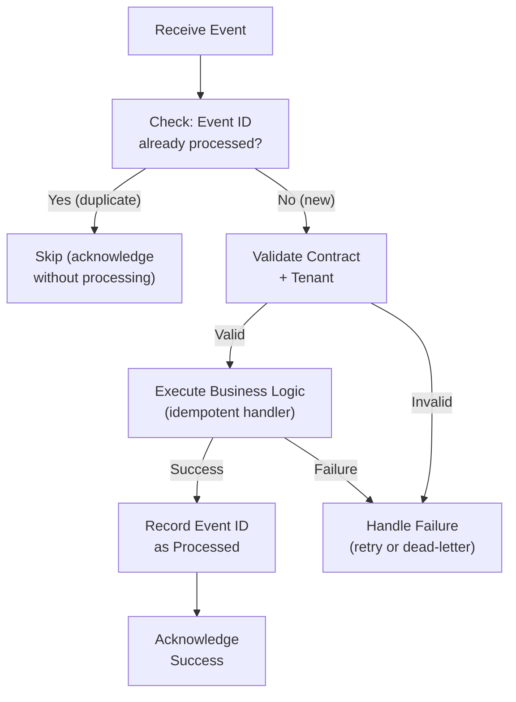
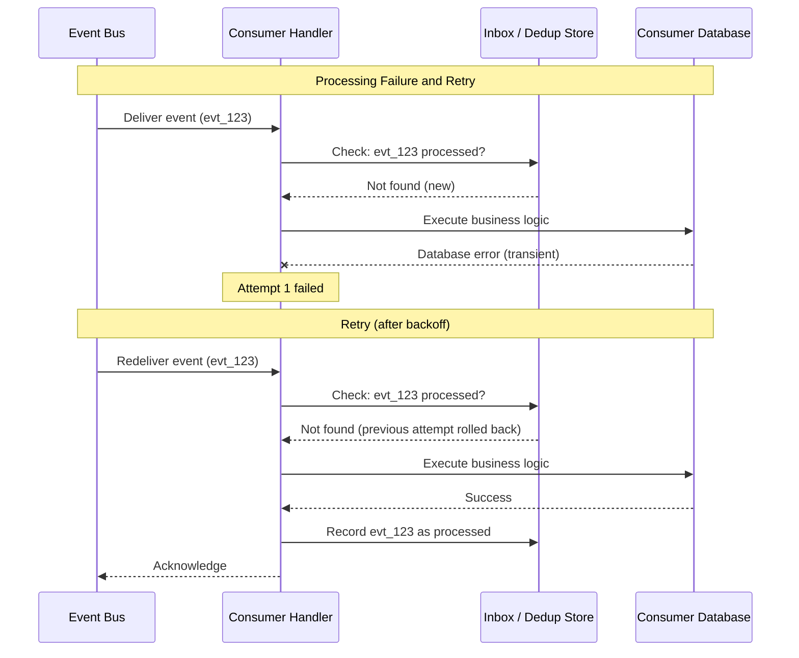
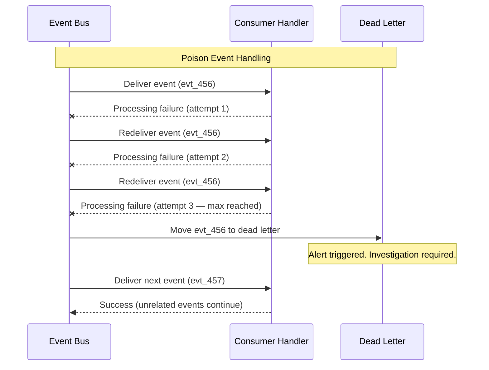
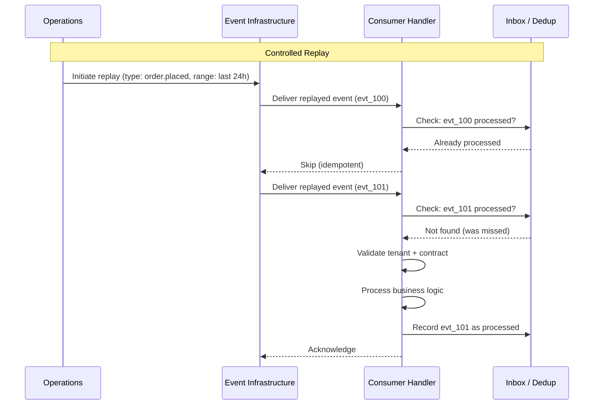

# Event Consumption and Inbox

## Metadata

| Field | Value |
|-------|-------|
| Title | Kairo Reliable Event Consumption, Deduplication, and Inbox Architecture |
| Document ID | KAI-EVT-007 |
| Status | Draft |
| Version | 0.1 |
| Target Release | V1 |
| Owner | Reliable Event Consumption Architect |
| Created | 2026-07-22 |
| Last Updated | 2026-07-22 |
| Reviewers | TODO |
| Related Documents | [Event Architecture](./Event-Architecture.md), [Event Publishing and Outbox](./Event-Publishing-and-Outbox.md), [Integration Event Architecture](./Integration-Event-Architecture.md), [Idempotency, Concurrency, and Retries](../API/Idempotency-Concurrency-and-Retries.md), [Tenant Resolution](../Multi-Tenancy/Tenant-Resolution.md), [Data Ownership](../Data/Data-Ownership.md), [Event Contract Standards](./Event-Contract-Standards.md) |
| Dependencies | [Event Architecture](./Event-Architecture.md), [Event Publishing and Outbox](./Event-Publishing-and-Outbox.md), [Integration Event Architecture](./Integration-Event-Architecture.md) |

---

## Applicable Version

This document defines V1 event consumption architecture aligned with the modular monolith. V1 consumers are in-process handlers with deduplication and retry. The architecture ensures that event-driven side effects are reliable, idempotent, and observable regardless of duplicate delivery or transient failure.

---

## Purpose

This document defines how Kairo modules consume events — from receipt through validation, deduplication, processing, and failure handling. It establishes the rules that ensure duplicate delivery does not create duplicate business effects, tenant context is validated before tenant-owned state is modified, and poison events do not block unrelated processing.

Reliable consumption is the mirror of reliable publication. The outbox ensures events are published at least once. This document ensures that "at least once" does not mean "processed more than once" at the business level.

---

## Scope

This document covers:

- Consumer and subscription ownership.
- Event receipt, validation, and deduplication.
- Inbox pattern and processing state management.
- Idempotent handler design direction.
- Retry, poison-event handling, and failure isolation.
- Consumer pause, resume, replay, and reconciliation.
- Derived data updates and side-effect management.
- V1 behavior and future distributed consumer direction.

This document does not cover:

- Handler implementation code (development standards).
- Inbox table schema (implementation detail).
- Broker consumer group configuration (infrastructure documentation).
- Event payload format (see [Event Contract Standards](./Event-Contract-Standards.md)).
- Outbox publication mechanics (see [Event Publishing and Outbox](./Event-Publishing-and-Outbox.md)).

---

## Mandatory Principles

| # | Principle |
|---|-----------|
| 1 | Receipt and successful business processing are separate states |
| 2 | Consumers must validate event contracts |
| 3 | Consumers must verify trusted source or infrastructure context |
| 4 | Tenant context must be validated before tenant-owned effects occur |
| 5 | Duplicate delivery must not create duplicate business effects |
| 6 | Inbox or equivalent deduplication is required where duplicate effects are dangerous |
| 7 | Consumer processing must respect its own transaction boundary |
| 8 | Producer transaction rollback is not available to consumers |
| 9 | Poison events must not block unrelated events indefinitely |
| 10 | Consumer failure must remain observable |
| 11 | Replaying events must not bypass current authorization, tenant, or compatibility rules |
| 12 | Derived state must remain traceable to source events |

---

## 1. Consumer Ownership

| Rule | Detail |
|------|--------|
| Module owns its consumers | Each consumer handler belongs to the module that needs to react to the event |
| Consumer decides reaction | The consumer determines what to do with the event (producer does not dictate) |
| Consumer owns its derived state | Any state created or updated from an event is owned by the consuming module |
| Consumer is accountable | The consuming module is responsible for its handler's correctness, idempotency, and monitoring |
| No shared handlers | Consumers are not shared across modules. Each module has its own handlers. |

---

## 2. Subscription Ownership

| Rule | Detail |
|------|--------|
| Explicit subscription | Consumers explicitly register for specific event types |
| Controlled registration | Subscription is a governed operation (tracked, reviewed) |
| Independent | Each consumer's subscription is independent. Adding or removing one does not affect others. |
| Type-specific | Consumers subscribe to event types, not to producer modules |
| V1 mechanism | Code-based registration at application startup |

---

## 3. Event Receipt

**Receipt and successful business processing are separate states.**

| Rule | Detail |
|------|--------|
| Receipt = infrastructure | The event has arrived at the consumer's processing boundary |
| Processing = business | The consumer has successfully executed its business logic for this event |
| Not equivalent | Receiving an event does not mean processing succeeded |
| Acknowledgment timing | Infrastructure acknowledges receipt. Business processing may happen synchronously or asynchronously after receipt. |
| V1 behavior | In-process dispatch — receipt and processing attempt happen in the same call, but success/failure of processing is tracked independently |

---

## 4. Contract Validation

**Consumers must validate event contracts.**

| Rule | Detail |
|------|--------|
| Type check | Consumer verifies the event type matches what it subscribed to |
| Version check | Consumer verifies it can handle the event's schema version |
| Required fields | Consumer validates that required envelope and payload fields are present |
| Unknown fields | Consumer ignores unknown fields (forward compatibility) |
| Malformed events | Malformed events (missing required fields, wrong types) are rejected and dead-lettered |
| Not trusted blindly | Even in-process events are validated (prevents programming errors from propagating) |

---

## 5. Tenant Validation

**Tenant context must be validated before tenant-owned effects occur.**

| Rule | Detail |
|------|--------|
| Tenant present | Consumer verifies the event carries a valid tenant identifier |
| Tenant active | Consumer verifies the tenant is active (not suspended, not deleted) before processing |
| Scoped processing | All state changes from event processing occur within the validated tenant boundary |
| Suspended tenant | Events for a suspended tenant may be deferred or processed with restrictions (module decides) |
| Deleted tenant | Events for a deleted tenant are discarded (logged, not processed) |
| Cross-tenant prevention | Processing one tenant's event must not affect another tenant's state |

---

## 6. Authentication and Source Trust

**Consumers must verify trusted source or infrastructure context.**

| Rule | Detail |
|------|--------|
| V1: in-process trust | In the monolith, events are dispatched in-process by trusted platform infrastructure. Source trust is implicit. |
| Future: explicit verification | When events cross service boundaries, consumer verifies the event came from trusted infrastructure (service credentials, signed delivery) |
| Not from external | Internal event consumers do not accept events from external sources (external → webhook receiver → internal processing, not direct) |
| Infrastructure mediates | Consumers trust the event infrastructure, not individual producers directly |

---

## 7. Deduplication

**Duplicate delivery must not create duplicate business effects.**

| Rule | Detail |
|------|--------|
| Event ID is the key | Each event has a unique `id`. Consumer uses this for deduplication. |
| Check before processing | Before executing business logic, consumer checks if this event ID has been processed |
| Already processed = skip | If event ID is found in the processed-events record, consumer acknowledges without re-processing |
| Record after processing | After successful processing, consumer records the event ID as processed |
| Atomic with effect | The deduplication record and the business side effect should be in the same transaction where feasible |
| Retention | Processed-event records are retained for a window matching the maximum expected duplicate delivery period |

---

## 8. Inbox Purpose

**Inbox or equivalent deduplication is required where duplicate effects are dangerous.**

| Purpose | Detail |
|---------|--------|
| Deduplication | Prevent duplicate business effects from duplicate event delivery |
| Processing tracking | Track which events have been processed by this consumer |
| Recovery | Enable determination of processing state after failures |
| Not a business store | Like the outbox, the inbox is operational infrastructure — not the authoritative business record |
| When required | Required for consumers that perform mutations (state changes, external calls, notifications). Optional for read-model updates that are naturally idempotent. |

| Consumer Type | Inbox Required? |
|--------------|:---:|
| Financial state changes (payment, refund) | **Yes** |
| Inventory mutations | **Yes** |
| Order status updates | **Yes** |
| Notification sending | **Yes** (prevent duplicate emails/SMS) |
| Search index updates | No (re-index is naturally idempotent) |
| Cache invalidation | No (re-invalidation is harmless) |
| Read model projection (set-based) | No (set to current value is idempotent) |

---

## 9. Processing State

Each event at a consumer transitions through:

| State | Meaning |
|-------|---------|
| `received` | Event arrived at consumer boundary |
| `processing` | Business logic is executing |
| `processed` | Business logic completed successfully |
| `failed` | Business logic failed (will retry) |
| `dead_lettered` | All retries exhausted. Requires investigation. |

| Rule | Detail |
|------|--------|
| Forward only | States move forward (received → processing → processed/failed) |
| Failed is retryable | Failed events are retried (up to configured limit) |
| Dead-lettered is terminal | Requires manual investigation and resolution |
| Observable | Current state is visible through monitoring |

---

## 10. Transaction Relationship

**Consumer processing must respect its own transaction boundary.**
**Producer transaction rollback is not available to consumers.**

| Rule | Detail |
|------|--------|
| Consumer's own transaction | Consumer processes within its own database transaction (not the producer's) |
| Atomic side effects | The consumer's state change and inbox deduplication record are in the same transaction |
| Producer is committed | By the time a consumer processes an event, the producer's transaction is long committed. No rollback possible. |
| Compensation, not rollback | If a consumer needs to "undo" a reaction, it must perform a compensating action (new event, new state change) — not a rollback |
| Independent | Consumer transactions are independent of other consumers processing the same event |

---

## 11. Idempotent Handlers

| Strategy | When to Use | Detail |
|----------|------------|--------|
| Inbox deduplication | Mutations with side effects | Check event ID before processing. Skip if already processed. |
| State-based idempotency | Set-based operations | Check current state. If already in expected state, skip. (e.g., "set status to paid" — if already paid, skip.) |
| Natural idempotency | Overwrite operations | Operation is inherently idempotent (cache invalidation, search re-index, set value to X). |
| Conditional processing | Timestamp/version-based | Process only if event is newer than current state (ignore stale events). |

| Rule | Detail |
|------|--------|
| At least one strategy | Every consumer must implement at least one idempotency strategy |
| Financial = inbox | Financial mutations always use inbox deduplication (not just state-based) |
| Documented | Each consumer documents its idempotency strategy |
| Tested | Idempotency is explicitly tested (send same event twice, verify single effect) |

---

## 12. Retry

| Rule | Detail |
|------|--------|
| Automatic | Failed processing is retried automatically |
| Bounded | Maximum retry count (e.g., 3-5 attempts) |
| Backoff | Exponential backoff between attempts |
| Independent | One consumer's retry does not affect other consumers |
| Observable | Each retry is logged with attempt count and error |
| After exhaustion | Event moves to dead-letter state. Alert triggered. |
| Idempotency survives retry | Retried processing checks deduplication (may already have partially succeeded) |

---

## 13. Partial Failure

| Scenario | Handling |
|----------|----------|
| Handler succeeds but inbox write fails | Transaction rolls back entirely. Event re-delivered. Handler re-processes (idempotent). |
| Inbox write succeeds but handler side effect fails | Transaction rolls back entirely. Event re-delivered. Dedup check shows not processed (rolled back). |
| Handler succeeds, external call fails | Depends on design: retry entire handler, or store intent and retry external call separately. |
| Multiple side effects, one fails | Transaction rolls back all. Event re-delivered. All side effects re-attempted. |

| Rule | Detail |
|------|--------|
| Atomic | Handler business logic + inbox deduplication record are in the same transaction |
| All-or-nothing | If any part fails, the transaction rolls back. Event is re-delivered. |
| External calls outside transaction | External system calls (APIs, notifications) should be performed after the transaction commits (or through their own outbox) |

---

## 14. Consumer Concurrency

| Aspect | V1 Behavior | Future Behavior |
|--------|-------------|-----------------|
| Concurrent consumers | Single handler instance per event type (no concurrency within a consumer) | Competing consumers (multiple instances) for throughput |
| Cross-event concurrency | Different event types processed concurrently (different handlers) | Same, plus multiple instances per type |
| Same-aggregate sequencing | Events for the same aggregate are processed in order (single handler) | Broker-level partitioning ensures same-aggregate events go to same consumer instance |
| Cross-aggregate | No ordering guarantee between different aggregates | Same |

| Rule | Detail |
|------|--------|
| V1 simplicity | Single handler instance avoids concurrency complexity |
| Future scaling | Competing consumers require partition-aware deduplication |
| Aggregate safety | Same-aggregate events must not be processed concurrently (risk of conflicting state updates) |

---

## 15. Ordering

| Rule | Detail |
|------|--------|
| Per-aggregate best-effort | Events for the same aggregate are delivered in order (V1: single handler ensures this) |
| Cross-aggregate not guaranteed | Events from different aggregates may arrive in any order |
| Timestamp-based reasoning | If ordering matters, consumer uses `occurredAt` timestamps to determine sequence |
| Stale event handling | If an event's timestamp is older than the consumer's current state for that resource, consumer may skip |
| Causation chain | `causationId` enables consumers to reason about event chains when needed |

---

## 16. Poison Events

**Poison events must not block unrelated events indefinitely.**

| Definition | An event that consistently fails processing regardless of retry (bad data, unhandled type, incompatible version, programming error in handler) |

| Rule | Detail |
|------|--------|
| Detection | After N consecutive failures for the same event, it is classified as poisoned |
| Isolation | Poison events are moved to dead-letter (removed from normal processing queue) |
| Unrelated continue | Other events (including from the same producer) continue processing normally |
| No block | A single poison event must not block the entire consumer or all events for a tenant |
| Investigation | Dead-lettered poison events trigger alerts for investigation |
| Resolution | After root cause fix, poison events may be replayed from dead-letter |

---

## 17. Consumer Pause

| Rule | Detail |
|------|--------|
| Operational capability | A consumer can be paused (stops processing new events) without affecting other consumers |
| Events accumulate | While paused, events accumulate in the delivery infrastructure (queue) |
| Backlog limit | If backlog exceeds a threshold, alerts are triggered |
| No event loss | Pausing does not cause events to be discarded |
| Use case | Maintenance, investigation, or deployment requiring consumer downtime |

---

## 18. Consumer Resume

| Rule | Detail |
|------|--------|
| Catches up | On resume, consumer processes accumulated backlog in order |
| Idempotency holds | If some events were partially processed before pause, deduplication handles correctly |
| Monitoring | Resume progress is monitored (backlog drain rate) |
| No rush | Consumer processes at normal rate. No special "catch-up" mode that bypasses validation. |

---

## 19. Replay

**Replaying events must not bypass current authorization, tenant, or compatibility rules.**

| Rule | Detail |
|------|--------|
| Definition | Re-delivering previously processed events to a consumer |
| Use case | New consumer needs historical events. Recovery from data corruption. Fix deployed and need to reprocess. |
| Authorization | Replayed events are subject to current authorization rules (not historical) |
| Tenant validation | Replayed events for deleted/suspended tenants are handled per current rules |
| Compatibility | Replayed events must be compatible with current consumer version |
| Idempotency | Consumer must handle replay correctly (dedup prevents double processing) |
| Source | V1: from outbox (within retention). Future: from event store. |
| Scope | Replay can target: specific event types, time ranges, tenants, or individual events |
| Observable | Replay operations are logged and monitored (distinguished from normal delivery) |

---

## 20. Reconciliation

| Rule | Detail |
|------|--------|
| When needed | Extended consumer downtime. Dead-letter events discarded. Infrastructure failure causing gaps. |
| Mechanism | Consumer calls producer's API to fetch current authoritative state |
| Full sync | Consumer compares its derived state against producer's API and corrects discrepancies |
| Not routine | Reconciliation is a recovery mechanism, not a normal operation |
| Producer must support | Producer APIs must support reconciliation queries (e.g., resources modified since timestamp) |
| Consumer must support | Consumer's data model must be rebuildable from producer API responses |
| Complement to replay | If replay is not available (events expired), reconciliation is the fallback |

---

## 21. Derived Data Updates

**Derived state must remain traceable to source events.**

| Rule | Detail |
|------|--------|
| Consumer state is derived | Data created or updated by a consumer in response to events is derived (not authoritative) |
| Source traceable | Consumer's state can be traced back to the events that produced it |
| Not authoritative | If derived state disagrees with the producer's authoritative data, the producer is correct |
| Rebuildable | Consumer's derived state can be rebuilt from events (replay) or API (reconciliation) |
| Staleness accepted | Derived state may lag behind authoritative state (eventual consistency is visible and intentional) |
| No reverse ownership | Consuming an event does not grant ownership of the source data |

---

## 22. Side Effects

| Side Effect | Transaction Relationship | Failure Handling |
|------------|------------------------|-----------------|
| Update own database state | Within consumer's transaction | Transaction rollback. Retry entire handler. |
| Send notification (email, SMS) | After transaction commits (or via own outbox) | Separate retry. At-least-once. |
| Call external API | After transaction commits | Separate retry with idempotency. |
| Publish own integration event | Write to own outbox in same transaction | Same outbox pattern as producer. |
| Invalidate cache | After transaction commits | Best-effort. Cache miss self-heals. |
| Update search index | After transaction commits or via separate handler | Idempotent re-index. |

| Rule | Detail |
|------|--------|
| DB in transaction | Database side effects within the consumer's transaction (atomic with dedup record) |
| External after commit | External calls (APIs, notifications) performed after transaction commits |
| Own outbox for chain | If a consumer needs to publish its own events, it uses its own outbox (same pattern) |
| Failure isolation | External call failure does not roll back the consumer's processed state |

---

## 23. Monitoring

| Metric | Purpose |
|--------|---------|
| Events received (count) | Throughput monitoring |
| Events processed successfully (count) | Success rate |
| Events failed (count) | Failure rate |
| Processing latency (histogram) | Performance monitoring |
| Consumer lag | Time between event publication and consumer processing |
| Dead-letter count | Events requiring investigation |
| Duplicate detection rate | How often deduplication prevents re-processing |
| Retry rate | How often events require retry |
| Backlog size (when paused) | Accumulation during pause |

| Alert | Severity | Response |
|-------|----------|----------|
| Consumer lag > threshold | Warning | Check consumer health and processing rate |
| Dead-letter count > 0 | High | Investigate failed events |
| Processing failure rate spike | High | Check for poison events or infrastructure issues |
| Consumer not processing | Critical | Consumer may be down or paused unexpectedly |
| Backlog growing after resume | Warning | Consumer may be processing slower than publication rate |

---

## 24. V1 Behavior

| Aspect | V1 Approach |
|--------|-------------|
| Delivery | In-process dispatch from event bus to handler |
| Deduplication | Inbox table in consumer's database (or state-based idempotency for simple cases) |
| Transaction | Handler + dedup record in same DB transaction |
| Retry | In-process retry with backoff (platform-managed) |
| Dead-letter | Dead-letter table in consumer's database |
| Concurrency | Single handler instance per event type |
| Ordering | Natural ordering (single in-process dispatcher) |
| Monitoring | Structured logging + Prometheus metrics |
| Replay | From outbox (within retention) through operations tooling |
| Reconciliation | Via producer module's query APIs |
| Performance | In-process — no network latency. Sub-millisecond delivery. |

---

## 25. Future Distributed Consumers

| Aspect | Future Direction |
|--------|-----------------|
| Delivery | From external message broker (consumers read from broker) |
| Consumer process | May run in separate process or service |
| Competing consumers | Multiple instances of same consumer for throughput |
| Partitioning | Broker partitions by aggregate/resource for ordering |
| Deduplication | Same inbox pattern, but distributed-aware |
| Ordering | Partition-level ordering (same aggregate → same partition → same consumer instance) |
| Security | Consumer authenticates to broker. Verifies event source. |
| Scaling | Independent consumer scaling (add instances as needed) |
| **Handler unchanged** | **Consumer handler logic, deduplication, and idempotency patterns remain identical. Only the delivery mechanism changes.** |

---

## Version Gate

| Version | Event Consumption Gate |
|---------|----------------------|
| V1 | In-process event consumption. Inbox deduplication for mutations. State-based idempotency for projections. Contract and tenant validation on receipt. Bounded retry with backoff. Dead-letter for poison events. Consumer monitoring (lag, failures, dead-letter). Reconciliation via producer APIs. Single handler instance per type. |
| V2 | External broker consumption. Competing consumers for scaling. Enhanced dead-letter management (with reprocessing UI). Consumer lag dashboard. Automated reconciliation triggers. |
| V3 | Cross-service consumer deployment. Partition-aware deduplication. Consumer auto-scaling. Complex event processing patterns. Event-driven saga consumption. |

---

## Decision Summary

| Decision | Rationale |
|----------|-----------|
| Inbox deduplication for mutations | Duplicate delivery is a fact of at-least-once systems. Business mutations (payment, inventory) must never produce duplicate effects. Inbox prevents this. |
| State-based idempotency for projections | Read model updates (set value to X) are naturally idempotent. Full inbox is overhead not needed. |
| Atomic dedup + processing | If dedup record commits but processing fails, event is incorrectly marked as processed. Atomic transaction prevents this. |
| Poison events → dead-letter (not block) | One bad event blocking all processing creates cascading business impact. Isolation via dead-letter is safer. |
| External calls after commit | External calls within the transaction create coupling (slow external call → long transaction) and complexity (rollback doesn't undo external call). |
| Single handler instance in V1 | Avoids concurrency complexity. V1 throughput does not require competing consumers. Scaling is V2. |
| Replay subject to current rules | Historical events replayed with current authorization prevents security regression. Old permissions do not grant access. |
| Consumer state is always derived | Clear ownership boundary. Producer is authoritative. Consumer reacts and derives. No ambiguity. |

---

## Alternatives Considered

| Alternative | Rejected Because |
|------------|-----------------|
| No deduplication (trust at-most-once delivery) | At-most-once means events can be lost. At-least-once with dedup is safer. |
| Global inbox (shared across consumers) | Different consumers have different processing states. Shared inbox creates coupling and contention. |
| Dedup without transaction | Race condition: dedup record saved, processing fails, event incorrectly skipped forever. Atomic is required. |
| Block processing on poison event | One bad event blocks all event processing. Unacceptable business impact. Dead-letter is correct. |
| External calls inside transaction | Long transactions, rollback doesn't undo external effects, coupling to external availability. After-commit is cleaner. |
| Competing consumers in V1 | Adds partition management, distributed dedup, and ordering complexity. Not needed at V1 scale. |
| No contract validation | Trust can fail — programming errors, version mismatches. Validation catches problems early. |
| Replay bypasses current rules | Security hole. Replayed events from before a permission change would grant historical access. Current rules must apply. |

---

## Architecture Impact

| Concern | Impact |
|---------|--------|
| Module design | Every module consuming integration events must implement deduplication (inbox or state-based). Must validate contracts and tenant context. |
| Transaction management | Consumer's processing + dedup record are in a single transaction. External calls are after commit. |
| Monitoring | Consumer health (lag, failures, dead-letter) is a critical operational metric per consumer. |
| Testing | Must test: idempotency (duplicate events), poison handling (consistently failing event), contract validation (malformed events), tenant validation (invalid tenant). |
| Data ownership | Consumer's derived state is explicitly derived. Producer remains authoritative. |
| Failure handling | Bounded retry + dead-letter is the universal pattern. No infinite retry. |

---

## Implementation Impact

| Area | Impact |
|------|--------|
| Modules (Consumers) | Must implement handlers with idempotency strategy. Must validate event contracts. Must validate tenant. Must handle unknown fields gracefully. Must implement retry logic or use platform-provided retry. |
| Platform | Must provide consumer framework (dispatch, retry, dead-letter, monitoring). Must provide inbox infrastructure support. Must provide replay tooling. |
| Operations | Must monitor consumer health per consumer type. Must investigate dead-letter events. Must manage consumer pause/resume. Must support replay operations. |
| Testing | Must test duplicate handling. Must test poison event isolation. Must test tenant validation. Must test contract validation. Must test reconciliation path. |

---

## Security Responsibilities

| Role | Consumption Responsibilities |
|------|------------------------------|
| Event Consumption Architect | Defines consumption patterns. Reviews idempotency strategies. Validates poison-event handling. |
| Module Teams (Consumers) | Implement idempotent handlers. Validate contracts and tenant. Monitor their consumers. Reconcile after failures. |
| Platform Team | Provides consumer framework. Manages retry and dead-letter infrastructure. Provides replay tooling. |
| Security Team | Validates tenant context checking. Reviews replay authorization rules. Ensures source trust verification. |
| Operations | Monitors consumer health. Investigates dead-letter. Manages pause/resume. Executes replay when needed. |

---

## Multi-Tenancy Responsibilities

| Responsibility | Detail |
|---------------|--------|
| Tenant validated before processing | Consumer checks tenant ID is valid and active before modifying tenant-owned state |
| Scoped processing | All consumer side effects are within the validated tenant boundary |
| No cross-tenant | Processing one tenant's event never affects another tenant's data |
| Deleted tenant handling | Events for deleted tenants are discarded (not processed, logged) |
| Suspended tenant handling | Module-specific policy (defer or process with restrictions) |
| Fair processing | Multi-tenant consumer processing uses fair scheduling (no tenant starvation) |

---

## Out of Scope

This document does not define:

- Handler implementation code (development standards).
- Inbox table schema (implementation detail).
- Broker consumer group configuration (infrastructure documentation).
- Event contract format (see [Event Contract Standards](./Event-Contract-Standards.md)).
- Publication mechanics (see [Event Publishing and Outbox](./Event-Publishing-and-Outbox.md)).
- Specific consumer handler designs per module (module specifications).

---

## Future Considerations

- **Competing consumers** — Multiple handler instances for horizontal scaling.
- **Consumer auto-scaling** — Dynamic instance count based on lag.
- **Dead-letter reprocessing UI** — Self-service investigation and replay of dead-lettered events.
- **Consumer health scoring** — Automated scoring based on lag, failure rate, and dead-letter count.
- **Event-driven sagas** — Consumer participation in multi-step coordinated workflows.
- **Partition-aware deduplication** — Inbox optimized for partitioned broker delivery.
- **Consumer versioning** — Multiple consumer versions during rolling deployment.

---

## Future Refactoring Triggers

This document should be revisited when:

- Consumer throughput requires competing consumers (trigger for partition and concurrency design).
- External broker is deployed (trigger for distributed consumer patterns).
- Dead-letter volume requires self-service tooling (trigger for reprocessing UI).
- Consumer lag SLAs are defined (trigger for auto-scaling evaluation).
- Saga patterns emerge (trigger for coordinated consumer architecture).
- Service extraction moves consumers to separate processes (trigger for distributed deduplication).

---

## Change History

| Version | Date | Author | Description |
|---------|------|--------|-------------|
| 0.1 | 2026-07-22 | Reliable Event Consumption Architect | Initial draft — event consumption and inbox architecture |
