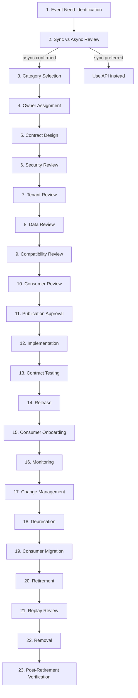
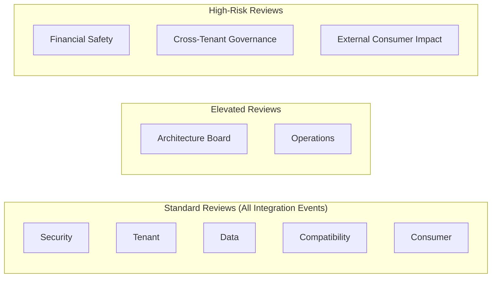

# Event Governance and Lifecycle

## Metadata

| Field | Value |
|-------|-------|
| Title | Kairo Event Governance and Lifecycle Architecture |
| Document ID | KAI-EVT-013 |
| Status | Draft |
| Version | 0.1 |
| Target Release | V1 |
| Owner | Event Governance and Lifecycle Architect |
| Created | 2026-07-22 |
| Last Updated | 2026-07-22 |
| Reviewers | TODO |
| Related Documents | [Event Architecture](./Event-Architecture.md), [Event Versioning and Compatibility](./Event-Versioning-and-Compatibility.md), [Secure Development Lifecycle](../Security/Secure-Development-Lifecycle.md), [API Governance and Lifecycle](../API/API-Governance-and-Lifecycle.md), [Documentation Standards](../../00-Governance/Documentation-Standards.md), [Document Lifecycle](../../00-Governance/Document-Lifecycle.md), [Event Taxonomy and Ownership](./Event-Taxonomy-and-Ownership.md) |
| Dependencies | [Event Architecture](./Event-Architecture.md), [Event Versioning and Compatibility](./Event-Versioning-and-Compatibility.md) |

---

## Applicable Version

This document defines V1 event governance processes. All modules must follow these governance stages when proposing, designing, publishing, and retiring events. The process is proportionate — higher-risk events receive stronger review.

---

## Purpose

This document defines the complete lifecycle of an event — from initial need identification through design, review, publication, operation, deprecation, and retirement. It establishes who owns events, who reviews them, what approval is required, and how the platform prevents event proliferation while enabling useful cross-module communication.

Without governance, event ecosystems grow uncontrolled. Modules publish events for implementation convenience rather than business need. Consumers subscribe without understanding implications. Breaking changes surprise consumers. Retired events linger indefinitely. This document prevents all of these.

---

## Scope

This document covers:

- Event lifecycle stages from need identification through retirement.
- Required reviews per event risk category.
- Governance roles and responsibilities.
- Event proliferation control.
- Consumer onboarding and decommissioning.
- AI-generated implementation governance.
- Emergency and exception processes.

This document does not cover:

- Specific event type definitions (module specifications).
- Event handler implementation code (development standards).
- Event broker configuration (infrastructure documentation).
- Event contract schema details (see [Event Contract Standards](./Event-Contract-Standards.md)).
- Event versioning mechanics (see [Event Versioning and Compatibility](./Event-Versioning-and-Compatibility.md)).

---

## Mandatory Statements

| # | Statement |
|---|-----------|
| 1 | No published event is ownerless |
| 2 | No event should exist only because implementation found it convenient |
| 3 | New events require a synchronous-versus-asynchronous decision |
| 4 | Every external event requires documented consumers and purpose |
| 5 | Temporary events require an owner and expiry |
| 6 | Breaking changes require approval |
| 7 | Deprecated events remain monitored |
| 8 | Consumers must be registered conceptually |
| 9 | Manual replay and recovery require authorization and audit |
| 10 | AI-generated events follow the same governance |
| 11 | Event proliferation must be controlled |
| 12 | Unused events should be retired |

---

## Event Lifecycle Stages

---

### 1. Event Need Identification

| Aspect | Detail |
|--------|--------|
| Trigger | Module needs to communicate a business fact to other modules or external consumers |
| Input | Business scenario, intended consumers, expected reactions |
| Question | Is there a genuine cross-boundary communication need? Or is this implementation convenience? |
| **Proliferation check** | **No event should exist only because implementation found it convenient.** The event must serve a genuine business communication need. |
| Output | Documented need with identified consumers and business justification |

---

### 2. Synchronous-versus-Asynchronous Review

**New events require a synchronous-versus-asynchronous decision.**

| Question | If Yes → | If No → |
|----------|----------|---------|
| Does the caller need an immediate response? | Use synchronous API | Consider event |
| Are there multiple independent reactions? | Event is appropriate | API may suffice |
| Can consumers react independently of each other? | Event is appropriate | May need orchestrated API calls |
| Is eventual consistency acceptable? | Event is appropriate | Use synchronous API |
| Does the reaction need to happen within the same transaction? | Use direct call (same module) or synchronous API | Event is appropriate |

| Rule | Detail |
|------|--------|
| Not automatic | Publishing an event is not the default for every operation. It is a deliberate choice. |
| Document the decision | Record why async (event) was chosen over sync (API) |
| Revisitable | If the decision was wrong, the event can be retired and replaced with API calls |

---

### 3. Event-Category Selection

| Category | When Selected | Reference |
|----------|--------------|-----------|
| Domain event (internal) | State change within module, internal side effects | [Event Taxonomy](./Event-Taxonomy-and-Ownership.md) |
| Integration event (cross-module) | Business fact relevant to other modules | [Event Taxonomy](./Event-Taxonomy-and-Ownership.md) |
| External event (webhook) | Business fact relevant to external consumers | [Webhook Architecture](../API/Webhook-Architecture.md) |

| Rule | Detail |
|------|--------|
| Start internal | If uncertain, start as domain event (internal). Promote to integration event when cross-module need is validated. |
| Not external by default | Integration events are not automatically external. External publication is a separate, higher-governance decision. |

---

### 4. Owner Assignment

**No published event is ownerless.**

| Aspect | Detail |
|--------|--------|
| Assigned | Every event must have an explicit owner before design begins |
| Owner is producer | The module that publishes the event owns it (defines meaning, maintains contract) |
| Responsibility | Owner is accountable for contract stability, documentation, and eventual retirement |
| Transfer | Ownership transfers explicitly when module responsibility changes |
| No orphans | Events without active owners are flagged in event inventory review |

---

### 5. Contract Design

| Aspect | Detail |
|--------|--------|
| Standards | Follows [Event Contract Standards](./Event-Contract-Standards.md) |
| Consumer-informed | Designed with awareness of consumer needs (but not dictated by consumers) |
| Minimized payload | Only include data consumers genuinely need |
| Versioned from start | Version field present from the first publication |
| Documented | Schema, fields, semantics, and purpose documented |

---

### 6. Security Review

| Aspect | Detail |
|--------|--------|
| Reviewer | Security team or designated security reviewer |
| Checks | Data classification, sensitive data minimization, no secrets, tenant context, logging restrictions |
| Required for | All integration and external events. Sensitive domain events. |
| Output | Approval or required changes |
| Reference | [Secure Development Lifecycle](../Security/Secure-Development-Lifecycle.md) |

---

### 7. Tenant Review

| Aspect | Detail |
|--------|--------|
| Reviewer | Multi-tenancy architect or designated reviewer |
| Checks | Tenant context present, cross-tenant prevention, consumer isolation |
| Required for | All events carrying tenant-scoped data |
| Output | Confirmation that tenant isolation is maintained |

---

### 8. Data Review

| Aspect | Detail |
|--------|--------|
| Reviewer | Data architect or data-owning module representative |
| Checks | Payload does not leak producer internals. Data ownership respected. Classification correct. |
| Required for | Events carrying business data |
| Output | Confirmation that data ownership boundaries are respected |

---

### 9. Compatibility Review

| Aspect | Detail |
|--------|--------|
| Reviewer | Event architecture or consuming-module representatives |
| Checks | Schema follows versioning rules. Additive changes only within a version. Forward-compatible. |
| Required for | All changes to existing events. New events reviewed for future-compatibility design. |
| Output | Confirmation that compatibility rules are followed |
| Reference | [Event Versioning and Compatibility](./Event-Versioning-and-Compatibility.md) |

---

### 10. Consumer Review

| Aspect | Detail |
|--------|--------|
| Reviewer | Known consumer representatives |
| Checks | Event meets consumer needs. Payload is sufficient. Schema is usable. |
| Required for | All integration events (at least one identified consumer must validate) |
| Output | Consumer confirmation that the event is consumable |
| **Registered** | **Consumers must be registered conceptually.** Each integration event has at least one documented consumer. |

---

### 11. Publication Approval

| Aspect | Detail |
|--------|--------|
| Gate | All reviews passed. Documentation complete. At least one consumer identified. |
| Approver | Event owner + architecture approval for integration events |
| External events | Require additional architecture + security approval |
| Breaking changes | **Breaking changes require approval** from architecture review |
| Release notes | Event documented in event catalog |

---

### 12. Implementation

| Aspect | Detail |
|--------|--------|
| Standards | Follows approved contract design. Event infrastructure patterns. |
| **AI governance** | **AI-generated events follow the same governance.** Implementation generated by AI receives identical review. |
| Contract alignment | Implementation must match the approved contract schema |
| Outbox integration | Producer implements outbox publication per [Event Publishing and Outbox](./Event-Publishing-and-Outbox.md) |

---

### 13. Contract Testing

| Aspect | Detail |
|--------|--------|
| Requirement | Contract tests verify that published events match the documented schema |
| Coverage | All integration events have contract tests |
| CI | Contract tests run in CI. Failures block release. |
| Consumer tests | Consumer idempotency and handling are tested independently |

---

### 14. Release

| Aspect | Detail |
|--------|--------|
| Documentation | Event catalog updated with new event type |
| Changelog | Published in event changelog |
| Consumer notification | Identified consumers notified of availability |

---

### 15. Consumer Onboarding

| Aspect | Detail |
|--------|--------|
| Registration | Consumer subscription registered (code-based V1, governed future) |
| Documentation review | Consumer reviews schema documentation |
| Idempotency | Consumer implements idempotent handling before going live |
| Testing | Consumer tests with sample events (including duplicates) |
| No producer change | Adding a consumer does not require producer changes |

---

### 16. Monitoring

**Deprecated events remain monitored.**

| Aspect | Detail |
|--------|--------|
| Metrics | Publication rate, consumer lag, failure rate per event type |
| Alerting | Failures alert per [Event Observability and Auditing](./Event-Observability-and-Auditing.md) |
| Usage tracking | Consumer subscription count and activity tracked |
| Deprecated events | Continue to be monitored (usage drives retirement timing) |

---

### 17. Change Management

| Aspect | Detail |
|--------|--------|
| Non-breaking | Standard review. No version bump. Changelog entry. |
| Breaking | Full governance cycle — design, reviews, new version, migration plan |
| Reference | [Event Versioning and Compatibility](./Event-Versioning-and-Compatibility.md) |

---

### 18. Deprecation

| Aspect | Detail |
|--------|--------|
| Decision | Based on replacement availability, usage evidence, maintenance burden |
| Communication | Deprecation notice in event catalog, changelog, and direct consumer notification |
| Timeline | Internal: minimum one release cycle. External (webhook): minimum 6-12 months. |
| Continued publication | Deprecated events continue to be published during deprecation period |
| **Visibility** | **Deprecated events require usage visibility.** Usage tracked to inform retirement decision. |

---

### 19. Consumer Migration

| Aspect | Detail |
|--------|--------|
| Guide | Published migration guidance (if new event replaces old) |
| Support | Consumer support during migration |
| Tracking | Consumer adoption of new event tracked |
| Extension | If consumers have not migrated, timeline may be extended |

---

### 20. Retirement

| Aspect | Detail |
|--------|--------|
| Prerequisites | All consumers migrated. Usage evidence confirms no active consumers. |
| Execution | Producer stops publishing the event |
| Historical | Already-stored events retain their version. They are never modified. |
| Communication | Retirement notice sent in advance |

---

### 21. Replay Review

| Aspect | Detail |
|--------|--------|
| Question | After retirement, can historical events of this type still be replayed? |
| Consumer capability | Are consumers still capable of handling this event's version? |
| Decision | Document whether replay of retired event type is supported or not |
| If not supported | Consumers must reconcile via API if they need historical data |

---

### 22. Removal

| Aspect | Detail |
|--------|--------|
| When | After retirement period. No remaining consumers. Replay no longer needed. |
| Action | Event type removed from active catalog. Schema retained in historical documentation. |
| Code removal | Producer publication code removed |
| Historical | Stored events remain in any event store/archive (never deleted from historical record) |

---

### 23. Post-Retirement Verification

| Aspect | Detail |
|--------|--------|
| Check | Verify no consumers are still processing (no active subscriptions) |
| Monitoring | Verify no unexpected errors from missing event publication |
| Documentation | Verify event is marked as retired in catalog |
| Clean | Verify no orphaned consumer registrations remain |

---

## Required Reviews by Event Risk Category

| Event Category | Security | Tenant | Data | Compatibility | Consumer | Operations | Architecture | Financial |
|---------------|:---:|:---:|:---:|:---:|:---:|:---:|:---:|:---:|
| New integration event | Yes | Yes | Yes | Yes | Yes | — | Yes | — |
| External event (webhook) | **Yes** | Yes | **Yes** | Yes | Yes | — | **Yes** | — |
| Sensitive-data event | **Yes** | Yes | **Yes** | Yes | Yes | — | — | — |
| Cross-tenant event | **Yes** | **Yes** | Yes | Yes | Yes | — | **Yes** | — |
| Financial event (payment, refund) | **Yes** | Yes | Yes | Yes | Yes | Yes | — | **Yes** |
| Inventory event | Yes | Yes | Yes | Yes | Yes | — | — | — |
| Payment event | **Yes** | Yes | Yes | Yes | Yes | Yes | — | **Yes** |
| Tenant lifecycle event | **Yes** | **Yes** | Yes | Yes | Yes | Yes | **Yes** | — |
| Breaking change | Yes | Yes | Yes | **Yes** | **Yes** | Yes | **Yes** | If affected |
| New external consumer | **Yes** | Yes | — | — | **Yes** | — | — | — |
| Event replay | — | Yes | — | — | — | **Yes** | — | If financial |
| Manual dead-letter recovery | — | Yes | — | — | — | **Yes** | — | If financial |
| New analytics consumer | — | Yes | **Yes** | — | Yes | — | — | — |

---

## Governance Roles

### Domain Owner

| Aspect | Detail |
|--------|--------|
| Who | Business capability owner (product manager or domain lead) |
| Responsibility | Validates that the event represents a genuine business need |
| Authority | Confirms business justification for the event |

### Event Owner

| Aspect | Detail |
|--------|--------|
| Who | Module team lead or designated event owner within the producing module |
| Responsibility | Accountable for the event's contract, documentation, stability, and retirement |
| Authority | Approves non-breaking changes to their events |

### Producer Owner

| Aspect | Detail |
|--------|--------|
| Who | The team that implements and publishes the event |
| Responsibility | Implements publication, maintains contract tests, handles version migration |
| Co-located with event owner | Typically the same team as the event owner |

### Consumer Owner

| Aspect | Detail |
|--------|--------|
| Who | The team that implements a consumer for the event |
| Responsibility | Implements idempotent handling, maintains consumer tests, migrates on version changes |
| Registration | Registered as a consumer in the event catalog |

### Security Reviewer

| Aspect | Detail |
|--------|--------|
| Who | Security team member |
| Responsibility | Validates data classification, payload sensitivity, tenant isolation, logging restrictions |
| Authority | Can block publication on security concerns |

### Data Reviewer

| Aspect | Detail |
|--------|--------|
| Who | Data architect or data-owning module representative |
| Responsibility | Validates data ownership boundaries, classification compliance, no internal data leakage |
| Authority | Can block publication on data boundary violations |

### Multi-Tenancy Reviewer

| Aspect | Detail |
|--------|--------|
| Who | Multi-tenancy architect or designated reviewer |
| Responsibility | Validates tenant context, cross-tenant prevention, consumer isolation |
| Authority | Can block publication on tenant isolation concerns |

### Operations Reviewer

| Aspect | Detail |
|--------|--------|
| Who | Operations team member |
| Responsibility | Validates observability readiness, monitoring, alerting, capacity impact |
| Authority | Can block publication if operational risk is unacceptable |
| Required for | High-volume events, financial events, tenant lifecycle events |

### Architecture Approver

| Aspect | Detail |
|--------|--------|
| Who | Architecture lead or review board representative |
| Responsibility | Validates architectural alignment, boundary compliance, proliferation control |
| Authority | Final approval for integration events, external events, and breaking changes |

---

## Approval Authority Matrix

| Decision | Event Owner | Architecture | Security | Operations |
|----------|:---:|:---:|:---:|:---:|
| New domain event (internal) | **Approve** | — | — | — |
| New integration event | Propose | **Approve** | Review | — |
| New external event | Propose | **Approve** | **Approve** | Review |
| Non-breaking change | **Approve** | — | If sensitive | — |
| Breaking change | Propose | **Approve** | Review | Review |
| Deprecation | **Approve** | Informed | — | Informed |
| Retirement | **Approve** | Informed | — | Informed |
| Emergency security change | — | Retrospective | **Authorize** | Informed |
| Replay authorization | — | — | — | **Authorize** |
| Dead-letter recovery | — | — | — | **Authorize** (+ event owner approves) |

---

## Event Proliferation Control

**Event proliferation must be controlled.**
**Unused events should be retired.**

| Mechanism | Detail |
|-----------|--------|
| Business justification | Every event must have a documented business need (not just implementation convenience) |
| Consumer requirement | Integration events must have at least one identified consumer before publication |
| Periodic review | Event catalog reviewed quarterly for unused or low-value events |
| Usage metrics | Publication and consumption metrics inform proliferation review |
| Retirement trigger | Events with zero consumers for extended periods (e.g., 3+ months) are candidates for retirement |
| No speculative events | Events are not published "just in case" someone might want them. Publish when a consumer demonstrates need. |
| Consolidation | If multiple similar events could be served by one, consolidate |

---

## Temporary Events

**Temporary events require an owner and expiry.**

| Rule | Detail |
|------|--------|
| Explicit flag | Temporary events are marked as temporary in the event catalog |
| Owner | Must have an assigned owner |
| Expiry date | Must have a concrete expiry date |
| Renewal | If not retired by expiry, owner must renew with justification or retire |
| Examples | Migration-support events, feature-flag-driven events, experimental events |
| Review | Temporary events are reviewed at each quarterly catalog review |

---

## Event Inventory

| Aspect | Detail |
|--------|--------|
| Registry | All published integration events are registered in an event catalog |
| Fields | Event type, owner, category, version, status (active/deprecated/temporary), consumers, creation date, last review |
| Review cadence | Quarterly inventory review |
| Orphan detection | Events without active owners are flagged for reassignment |
| Usage data | Publication rate, consumer count, last consumption timestamp |
| Stale detection | Events with zero consumers or zero publications are flagged |

---

## AI-Generated Implementation

**AI-generated events follow the same governance.**

| Rule | Detail |
|------|--------|
| Same reviews | AI-generated event implementations receive all standard reviews |
| Same testing | Contract tests, security review, and tenant validation apply regardless of authorship |
| No bypass | "Generated by AI" is not a justification for skipping governance |
| Attribution | AI-generated event code is disclosed during review |
| Responsibility | The event owner remains accountable regardless of how code was produced |
| Same standards | Event contracts, payload minimization, and naming conventions apply identically |

---

## Emergency and Exception Process

### Emergency Security Changes

| Rule | Detail |
|------|--------|
| Authority | Security team may authorize immediate event changes for critical vulnerabilities |
| Scope | Narrowly scoped to the security fix |
| Communication | Immediate notification to affected consumers |
| Retrospective | Mandatory retrospective review within 5 business days |
| Audit | Emergency change and retrospective are audit-logged |

### Exception Process

| Rule | Detail |
|------|--------|
| When | Standard governance creates unacceptable delay for a justified need |
| Request | Written exception identifying: what rule, why exception, what mitigation |
| Approval | Architecture approver |
| Time-bound | Exceptions have a concrete plan to reach compliance |
| Tracked | Exceptions tracked in event inventory |
| Reviewed | Exceptions reviewed at quarterly catalog review |

---

## Manual Replay and Recovery

**Manual replay and recovery require authorization and audit.**

| Rule | Detail |
|------|--------|
| Authorization | Operations + event owner must both authorize |
| Scope | Replay scope defined (event types, time range, tenant) |
| Audit | Full audit trail: who authorized, what scope, when executed, results |
| Idempotency | Consumers must handle replay correctly (dedup prevents double processing) |
| Current rules | Replay respects current authorization, tenant, and compatibility rules |
| Financial | Financial event replay requires elevated authorization and reconciliation |

---

## Consumer Registration

**Consumers must be registered conceptually.**

| Rule | Detail |
|------|--------|
| Purpose | Track who consumes what for impact analysis, migration planning, and retirement decisions |
| V1 mechanism | Documentation-based registration (event catalog lists known consumers per event type) |
| Future | Programmatic subscription registry |
| Impact analysis | When changing an event, the consumer list shows who is affected |
| Retirement basis | An event with zero registered consumers is a retirement candidate |
| Onboarding | New consumers are added to the registry during onboarding |
| Decommissioning | Removed consumers are removed from the registry |

---

## Version Gate

| Version | Event Governance Gate |
|---------|----------------------|
| V1 | All integration events have assigned owners. Events justified by business need (not convenience). Security, tenant, and data review for all integration events. Elevated review for financial, cross-tenant, and external events. Contract testing in CI. Event catalog maintained (documentation-based). Quarterly inventory review. Consumer registration tracked. Manual replay authorized and audited. AI-generated code follows same governance. Temporary events have expiry. Deprecated events monitored for usage. |
| V2 | Programmatic event catalog with subscription registry. Automated consumer impact analysis. Breaking-change detection in CI. Self-service consumer onboarding. Usage-driven retirement recommendations. |
| V3 | Automated governance checks (ownership, documentation, testing). Event health scoring. Self-service governance certification for mature teams. Compliance reporting from event catalog. |

---

## Decision Summary

| Decision | Rationale |
|----------|-----------|
| Mandatory business justification | Prevents event proliferation from implementation convenience. Every event must serve a genuine communication need. |
| Sync-vs-async decision required | Forces teams to consciously choose events (vs API). Prevents defaulting to events for everything. |
| Risk-proportionate review | Low-risk internal events need minimal governance. Financial and external events need thorough review. Proportional effort. |
| Quarterly inventory review | Events accumulate. Regular review catches orphans, unused events, and expired temporaries. |
| Consumer registration | Without knowing consumers, you cannot assess impact of changes or justify retirement. Registration enables governance. |
| AI-generated code same governance | AI produces plausible but potentially flawed event implementations. Same review catches issues regardless of authorship. |
| Replay requires dual authorization | Operations can execute. Event owner validates business appropriateness. Both are needed to prevent inappropriate replays. |
| Proliferation control mechanisms | Uncontrolled event growth creates maintenance burden, documentation debt, and confusion. Active control keeps the event ecosystem manageable. |

---

## Alternatives Considered

| Alternative | Rejected Because |
|------------|-----------------|
| No event governance (trust teams) | Events proliferate. Breaking changes surprise consumers. Orphans accumulate. Retirement never happens. |
| Same governance for all events | Over-engineers low-risk internal events. Under-governs high-risk financial events. Proportional is better. |
| No sync-vs-async review | Teams default to events for everything (including things better served by APIs). Results in over-complicated architecture. |
| Automatic event publication for every state change | Event proliferation. Most state changes do not need cross-module communication. Intentional publication prevents noise. |
| No consumer registration | Cannot assess change impact. Cannot know when to retire. Cannot notify affected parties. Registration is essential. |
| AI-generated code bypasses review | AI can produce events with wrong classification, excessive payloads, or missing tenant context. Review is still needed. |
| Permanent multi-version events | Producer maintenance burden grows without bound. Temporary coexistence with governed retirement is correct. |
| No inventory review | Events accumulate indefinitely. No mechanism catches orphans or unused events. Regular review is necessary. |

---

## Architecture Impact

| Concern | Impact |
|---------|--------|
| Module development | Teams must justify events through governance. Cannot publish events without review and documentation. |
| Event catalog | Platform must maintain event catalog with ownership, consumers, and status. |
| Review process | Architecture team must provide timely reviews. Must not become a bottleneck. |
| Release process | Event publication requires governance clearance. Governance is a release gate for new event types. |
| Inventory | Quarterly review requires time and attention from architecture team. |
| Tooling | Event catalog, consumer registry, and usage tracking require tooling support. |

---

## Implementation Impact

| Area | Impact |
|------|--------|
| Modules | Must follow governance process for new events. Must maintain ownership. Must produce documentation and tests. Must respond to migration timelines. |
| Platform | Must provide event catalog infrastructure. Must track consumer registrations. Must support quarterly review. |
| Architecture Team | Must conduct reviews efficiently. Must manage event inventory. Must track exceptions and temporaries. |
| Security Team | Must provide timely security reviews for event payloads. Must authorize emergency changes. |
| Operations | Must monitor event health. Must authorize replays and dead-letter recovery. Must participate in retirement decisions. |

---

## Security Responsibilities

| Role | Governance Security Responsibilities |
|------|-------------------------------------|
| Event Governance Architect | Defines governance process. Ensures security review is mandatory for sensitive events. Manages exceptions. |
| Module Teams (Event Owners) | Follow governance. Ensure security review occurs. Maintain documentation. Manage lifecycle. |
| Security Team | Reviews sensitive/external events. Authorizes emergency changes. Validates no bypasses. |
| Architecture Approver | Approves new integration and external events. Reviews breaking changes. Controls proliferation. |
| Operations | Monitors event health. Authorizes replay and recovery. Reports on usage for retirement decisions. |

---

## Multi-Tenancy Responsibilities

| Responsibility | Detail |
|---------------|--------|
| Tenant review mandatory | All events carrying tenant-scoped data require tenant review |
| Cross-tenant escalated | Cross-tenant events require architecture + security + multi-tenancy reviewer approval |
| Tenant context verified | Review confirms tenant context is present and correctly sourced |
| No tenant bypass | No governance exception permits bypassing tenant isolation in events |

---

## Out of Scope

This document does not define:

- Specific event type definitions (module specifications).
- Event handler implementation code (development standards).
- Event catalog UI design (tooling specifications).
- Quarterly review meeting format (team process agreements).
- Specific review SLA timelines (team process agreements).
- Event broker configuration (infrastructure documentation).

---

## Future Considerations

- **Programmatic event catalog** — Searchable registry with ownership, consumers, and health metrics.
- **Automated governance checks** — CI validates ownership, documentation, and testing requirements.
- **Self-service consumer onboarding** — Consumers register through tooling without manual coordination.
- **Event health scoring** — Automated scoring based on documentation, testing, usage, and failure rates.
- **Usage-driven retirement** — Automated recommendations for events with zero consumers.
- **Governance analytics** — Metrics on review cycle time, exception rate, and compliance.
- **Compliance reporting** — Automated evidence for event governance compliance.

---

## Future Refactoring Triggers

This document should be revisited when:

- Team count grows beyond what current review process can serve efficiently.
- Review cycle times become a bottleneck for event publication.
- Event inventory exceeds manageable size for quarterly review.
- Programmatic catalog tooling is available.
- Module extraction requires governance changes for cross-service events.
- AI-generated event volume changes the review workload significantly.
- Regulatory requirements mandate formal event governance evidence.

---

## Change History

| Version | Date | Author | Description |
|---------|------|--------|-------------|
| 0.1 | 2026-07-22 | Event Governance and Lifecycle Architect | Initial draft — event governance and lifecycle |
