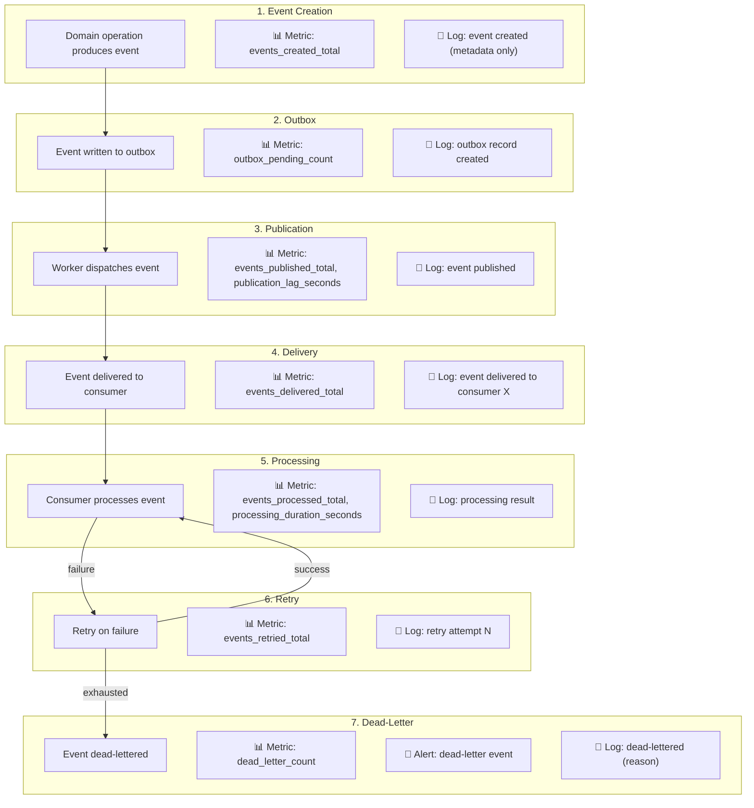

# Event Observability and Auditing

## Metadata

| Field | Value |
|-------|-------|
| Title | Kairo Event Observability, Monitoring, and Audit Architecture |
| Document ID | KAI-EVT-012 |
| Status | Draft |
| Version | 0.1 |
| Target Release | V1 |
| Owner | Event Observability, Monitoring, and Audit Architect |
| Created | 2026-07-22 |
| Last Updated | 2026-07-22 |
| Reviewers | TODO |
| Related Documents | [Event Architecture](./Event-Architecture.md), [Audit and Security Monitoring](../Security/Audit-and-Security-Monitoring.md), [Cross-Cutting Concerns](../Cross-Cutting-Concerns.md), [Incident Response](../Security/Incident-Response.md), [Event Publishing and Outbox](./Event-Publishing-and-Outbox.md), [Retry, Dead-Letter, and Recovery](./Retry-Dead-Letter-and-Recovery.md), [Event Consumption and Inbox](./Event-Consumption-and-Inbox.md) |
| Dependencies | [Event Architecture](./Event-Architecture.md), [Audit and Security Monitoring](../Security/Audit-and-Security-Monitoring.md) |

---

## Applicable Version

This document defines V1 event observability and auditing architecture. V1 provides structured logging, Prometheus metrics, correlation propagation, and basic alerting — sufficient for a modular monolith. Advanced observability (distributed tracing dashboards, event flow visualization, enterprise SIEM integration) is identified for future versions.

---

## Purpose

This document defines how the event lifecycle is observed, measured, logged, audited, and alerted upon. It establishes distinct signal types (business events, audit records, operational logs, metrics, traces, and alerts) and ensures each serves its intended audience without conflation.

Without deliberate observability design, event systems become black boxes. Events are published but nobody knows if they arrive. Consumers fail silently. Dead-letter queues grow unnoticed. Lag becomes invisible. This document ensures every stage of the event lifecycle — from creation through consumption, retry, and recovery — is observable, measurable, and alertable.

---

## Scope

This document covers:

- Observability requirements for every stage of the event lifecycle.
- Signal types (logs, metrics, traces, audits, alerts) and their purposes.
- Correlation spanning API requests through event flows.
- Lag measurement, failure detection, and alerting.
- Sensitive data handling in observability signals.
- Tenant-level and platform-level visibility.
- V1 capabilities and future enterprise observability direction.

This document does not cover:

- Monitoring product selection (Prometheus, Grafana, etc.) — infrastructure decisions.
- Log aggregation tooling — infrastructure decisions.
- Distributed tracing product (Jaeger, Zipkin, etc.) — infrastructure decisions.
- Alert notification routing (PagerDuty, OpsGenie, etc.) — operations configuration.
- Specific metric names or label schemas — development standards.

---

## Mandatory Principles

| # | Principle |
|---|-----------|
| 1 | Event publication and consumption failures must be observable |
| 2 | Correlation must span API, transaction, event, and consumer processing |
| 3 | Consumer lag must be measurable |
| 4 | Dead-letter growth requires alerts |
| 5 | Sensitive payloads must not be logged by default |
| 6 | Event metadata may be logged only according to classification |
| 7 | Replays and manual recovery require audit records |
| 8 | Tenant-visible status must not expose other tenants |
| 9 | Audit records are not replaced by ordinary event logs |
| 10 | Observability must support reconciliation of critical workflows |
| 11 | V1 should establish core visibility without requiring a full enterprise observability platform |

---

## Signal Types

### Clear Distinction

| Signal Type | Purpose | Audience | Retention | Example |
|-------------|---------|----------|-----------|---------|
| **Business events** | Record business facts (domain events, integration events) | Business logic, consumers | Short-term (outbox) to long-term (future event store) | `order.placed`, `payment.captured` |
| **Audit records** | Record who did what, when, for compliance | Compliance, investigation, support | Long-term (permanent per policy) | "User X placed order Y at time T" |
| **Operational logs** | Debug and troubleshoot system behavior | Developers, operations | Short to medium-term (days to weeks) | "Event evt_123 published to bus in 2ms" |
| **Metrics** | Measure system health and performance quantitatively | Operations, capacity planning | Medium-term (aggregated over time) | `event_published_total{type="order.placed"}` |
| **Distributed traces** | Follow a request/event through the system end-to-end | Developers, operations | Short-term (days) | Trace from API request through event to consumer |
| **Security alerts** | Notify of security-relevant occurrences | Security team, incident response | Per incident retention | "Unauthorized event subscription attempt" |

**Audit records are not replaced by ordinary event logs.** Operational logs may be rotated, filtered, or lost. Audit records are permanent compliance artifacts.

---

## Event Lifecycle Observability

---

### 1. Event Creation Observability

| Signal | Detail |
|--------|--------|
| Log | Structured log: event type, event ID, tenant ID, aggregate ID, correlation ID. **Not payload.** |
| Metric | Counter: `events_created_total` by type and module |
| Trace | Span within the producing request's trace |
| When | At the moment the aggregate produces the domain event |

---

### 2. Outbox Observability

| Signal | Detail |
|--------|--------|
| Metric | Gauge: `outbox_pending_count` (current pending records) |
| Metric | Gauge: `outbox_oldest_pending_age_seconds` (how long the oldest record has waited) |
| Metric | Counter: `outbox_records_written_total` |
| Alert | If `outbox_oldest_pending_age_seconds` exceeds threshold → publication may be stalled |
| Log | Record creation logged at debug level |

---

### 3. Publication Observability

| Signal | Detail |
|--------|--------|
| Metric | Counter: `events_published_total` by type |
| Metric | Histogram: `publication_lag_seconds` (time between event creation and publication) |
| Metric | Counter: `publication_failures_total` by type and error category |
| Log | Publication success/failure logged with event ID, type, and duration |
| Trace | Span: outbox worker processing (links to originating trace) |
| Alert | Publication failure rate exceeding threshold |

---

### 4. Transport Observability

| Signal | Detail |
|--------|--------|
| V1 | In-process — minimal transport observability needed (same process) |
| Future (broker) | Broker-level metrics: message throughput, queue depth, partition lag |
| Metric | Counter: `events_dispatched_total` (successful dispatch to bus/broker) |
| Log | Dispatch confirmation logged |

---

### 5. Consumer Observability

| Signal | Detail |
|--------|--------|
| Metric | Counter: `events_received_total` by consumer and type |
| Metric | Counter: `events_processed_total` by consumer, type, and result (success/failure/skipped) |
| Metric | Counter: `events_duplicates_detected_total` by consumer |
| Log | Event received, processing started, processing completed/failed |
| Trace | Consumer processing span (linked to event correlation ID) |

---

### 6. Processing Observability

| Signal | Detail |
|--------|--------|
| Metric | Histogram: `event_processing_duration_seconds` by consumer and type |
| Metric | Counter: `processing_failures_total` by consumer, type, and failure category |
| Log | Processing result: success, failure (with error category), skip (duplicate/invalid) |
| Trace | Processing span with outcome annotation |

---

### 7. Retry Observability

| Signal | Detail |
|--------|--------|
| Metric | Counter: `events_retried_total` by consumer and type |
| Metric | Histogram: `retry_attempt_number` (distribution of how many retries events need) |
| Log | Each retry: attempt number, delay, error reason |
| Alert | Elevated retry rate indicates infrastructure degradation |

---

### 8. Dead-Letter Observability

**Dead-letter growth requires alerts.**

| Signal | Detail |
|--------|--------|
| Metric | Gauge: `dead_letter_count` by consumer (current unresolved count) |
| Metric | Counter: `dead_letter_created_total` by consumer and failure category |
| Metric | Gauge: `dead_letter_oldest_age_seconds` (oldest unresolved dead-letter) |
| Alert | Any dead-letter creation → High severity alert |
| Alert | Financial/inventory dead-letter → Critical severity alert |
| Alert | Dead-letter age exceeding SLA → Escalation |
| Log | Dead-letter creation with: event ID, type, consumer, failure reason, retry history |

---

### 9. Replay Observability

**Replays and manual recovery require audit records.**

| Signal | Detail |
|--------|--------|
| Audit | Replay initiated: operator, scope (event types, time range, tenant), authorization |
| Audit | Replay completed: count processed, count skipped (dedup), count failed |
| Metric | Counter: `events_replayed_total` by consumer |
| Log | Replay progress: events delivered, duplicates skipped, errors encountered |
| Trace | Replay operations linked to operator's action |

---

## Lag Metrics

### 10. Consumer Lag

**Consumer lag must be measurable.**

| Aspect | Detail |
|--------|--------|
| Definition | Time between event publication and consumer processing completion |
| Measurement | `consumer_lag_seconds = consumer_processed_at - event_published_at` |
| Granularity | Per consumer, per event type |
| Metric | Histogram: `consumer_lag_seconds` by consumer and type |
| Alert thresholds | Warning: > 5s. High: > 60s. Critical: > 300s. |
| Dashboard | Consumer lag trend over time |

---

### 11. Publication Lag

| Aspect | Detail |
|--------|--------|
| Definition | Time between event creation (outbox write) and publication (dispatch) |
| Measurement | `publication_lag_seconds = published_at - occurred_at` |
| Normal | Seconds (outbox polling interval + processing time) |
| Metric | Histogram: `publication_lag_seconds` by module |
| Alert | If publication lag exceeds threshold → outbox worker may be stalled |

---

### 12. Processing Duration

| Aspect | Detail |
|--------|--------|
| Definition | Time taken by a consumer to process a single event |
| Measurement | `processing_duration_seconds = processing_end - processing_start` |
| Granularity | Per consumer, per event type |
| Metric | Histogram: `event_processing_duration_seconds` |
| Percentiles | p50, p95, p99 tracked for SLA monitoring |
| Alert | p99 exceeding threshold → consumer may be degrading |

---

### 13. Failure Rates

| Aspect | Detail |
|--------|--------|
| Metric | `processing_failure_rate = failures / (successes + failures)` per consumer |
| Granularity | Per consumer, per event type, per failure category |
| Alert | Failure rate exceeding threshold → investigate |
| Baseline | Normal operation: < 0.1% failure rate |
| Elevated | > 1% → warning. > 5% → critical. |

---

### 14. Duplicate Rates

| Aspect | Detail |
|--------|--------|
| Metric | `duplicate_rate = duplicates_detected / events_received` per consumer |
| Normal | Low (< 1% during normal operation) |
| Elevated | Higher during recovery/replay (expected and acceptable) |
| Alert | Elevated duplicates during normal operation → possible publication issue |
| Diagnostic | High duplicate rate may indicate outbox worker instability |

---

### 15. Throughput

| Aspect | Detail |
|--------|--------|
| Metric | `events_published_per_second` by type and module |
| Metric | `events_processed_per_second` by consumer |
| Capacity | Throughput metrics inform capacity planning |
| Trending | Throughput growth over time indicates scaling needs |
| Alert | Throughput drop → possible publication or consumer failure |

---

## Visibility

### 16. Tenant-Level Visibility

**Tenant-visible status must not expose other tenants.**

| Rule | Detail |
|------|--------|
| Scoped metrics | Metrics can be broken down per tenant for support and investigation |
| Tenant dashboard direction | Future: tenant-facing event health (their webhook delivery status) |
| Isolation | One tenant's metrics/logs are never visible to another tenant |
| Support access | Support investigating a tenant's event issues sees only that tenant's data |
| No cross-tenant aggregation in tenant views | Tenant sees their own metrics only |

---

### 17. Platform-Level Visibility

| Rule | Detail |
|------|--------|
| Aggregate metrics | Platform operators see aggregate metrics across all tenants |
| Per-tenant drill-down | Platform operators can drill down to specific tenant for investigation |
| Health overview | Platform dashboard shows: total throughput, lag across consumers, dead-letter count, failure rate |
| Capacity planning | Platform-level throughput and growth trends |
| No tenant data in platform view | Platform metrics show counts and rates, not event payloads or business data |

---

## Correlation and Tracing

### 18. Correlation

**Correlation must span API, transaction, event, and consumer processing.**

| Rule | Detail |
|------|--------|
| Correlation ID | Propagated from originating API request through event publication to all consumers |
| End-to-end | A single correlation ID links: user request → module operation → event creation → outbox → publication → consumer A processing → consumer B processing |
| Lookup | Given a correlation ID, operators can find all logs, metrics, and audit records related to that user action |
| Format | Same correlation ID format as API (per [Request and Response Standards](../API/Request-and-Response-Standards.md)) |
| Propagation | Event envelope carries `correlationId`. Consumer processing logs include it. |

---

### 19. Causation

| Rule | Detail |
|------|--------|
| Causation ID | Links an event to its direct cause (the event or command that produced it) |
| Chain reconstruction | Causation IDs enable building the full event chain (A caused B, B caused C) |
| Investigation | When debugging, causation chain shows why a specific event was produced |
| Format | Event ID of the causing event (or command ID of the causing command) |
| Logged | Causation ID included in processing logs for chain tracing |

---

### 20. Distributed Trace Direction

| Aspect | V1 | Future |
|--------|-----|--------|
| Trace propagation | Correlation ID propagated through event envelope | W3C Trace Context propagation through broker |
| Visualization | Log correlation (query by correlation ID) | Distributed trace visualization (Jaeger/Zipkin) |
| Span creation | Log-based span annotation | Native trace spans for event creation, publication, delivery, processing |
| Cross-process | N/A (in-process) | Traces span service boundaries |
| V1 approach | Structured logs with correlation ID provide traceable event flows without dedicated tracing infrastructure |

---

## Audit

### 21. Business-Event Audit

| Rule | Detail |
|------|--------|
| Distinct from event | The business audit record is a separate artifact from the domain/integration event |
| Triggered by events | Domain events trigger audit record creation (audit is a consumer of domain events) |
| Content | Who (actor), what (action, before/after), when (timestamp), where (tenant, resource) |
| Retention | Permanent per compliance requirements |
| Not an operational log | Audit records survive log rotation. They are compliance artifacts. |
| Reference | Per [Audit and Security Monitoring](../Security/Audit-and-Security-Monitoring.md) |

---

### 22. Security-Event Audit

| Rule | Detail |
|------|--------|
| Security events | Authentication failures, authorization failures, suspicious patterns, policy violations |
| Event-related security | Failed signature verification (inbound webhooks), unauthorized subscription attempts, tenant context violations |
| Retention | Long-term (security investigation window) |
| Alerting | Security events feed real-time alerting (not just logging) |
| Reference | Per [Audit and Security Monitoring](../Security/Audit-and-Security-Monitoring.md) |

---

### 23. Operational Logs

| Rule | Detail |
|------|--------|
| Purpose | Debug, troubleshoot, and understand system behavior |
| Content | Event lifecycle steps: created, published, delivered, processed, retried, dead-lettered |
| Structured | JSON structured logs with consistent fields (event ID, type, consumer, correlation ID, timestamp) |
| Level | Info for lifecycle transitions. Debug for detailed processing. Warn for retries. Error for failures. |
| **Sensitive payloads must not be logged by default** | Logs contain metadata (event ID, type, tenant, correlation ID). Never payload content for Confidential/Restricted events. |
| Retention | Short to medium-term (days to weeks) per operations policy |

---

## Metrics and Alerts

### 24. Metrics

| Category | Metrics |
|----------|---------|
| Publication | `events_created_total`, `events_published_total`, `publication_lag_seconds`, `publication_failures_total` |
| Outbox | `outbox_pending_count`, `outbox_oldest_pending_age_seconds` |
| Consumer | `events_received_total`, `events_processed_total`, `events_duplicates_detected_total` |
| Processing | `event_processing_duration_seconds`, `processing_failures_total` |
| Retry | `events_retried_total`, `retry_attempt_number` |
| Dead-letter | `dead_letter_count`, `dead_letter_created_total`, `dead_letter_oldest_age_seconds` |
| Lag | `consumer_lag_seconds`, `publication_lag_seconds` |
| Throughput | `events_published_per_second`, `events_processed_per_second` |

---

### 25. Alerts

| Alert | Severity | Trigger | Response |
|-------|----------|---------|----------|
| Dead-letter event created | High | Any event dead-lettered | Investigate within SLA |
| Financial event dead-lettered | Critical | Payment/refund/inventory event dead-lettered | Immediate investigation + reconciliation |
| Consumer lag > threshold | Warning → Critical | Lag exceeds 5s (warn), 60s (high), 300s (critical) | Check consumer health |
| Outbox pending age > threshold | Warning | Oldest pending > 30s | Check publication worker |
| Publication worker not processing | Critical | No events published for > polling interval × 3 | Worker may be down |
| Consumer not processing | Critical | Consumer has received but not processed for extended period | Consumer may be stuck |
| Processing failure rate spike | High | Failure rate > 5% | Investigate for poison events or infrastructure |
| Retry rate elevated | Warning | Retry rate > normal baseline | Infrastructure may be degrading |
| Throughput drop | Warning | Publishing rate drops > 50% from baseline | Check producer health |

---

### 26. Dashboards

| Dashboard | Audience | Content |
|-----------|----------|---------|
| Event health overview | Operations | Total throughput, lag summary, dead-letter count, failure rate |
| Per-consumer detail | Operations, module teams | Consumer lag, processing duration, failure rate, dead-letter for a specific consumer |
| Publication health | Operations | Outbox pending, publication lag, publication rate, worker status |
| Dead-letter management | Operations, module owners | Unresolved dead-letter events, age, failure reasons, trends |
| Tenant event status | Support (per-tenant) | Event delivery status for a specific tenant (webhook delivery, processing status) |
| Capacity planning | Platform team | Throughput trends, growth rates, resource utilization |

---

## Data Protection

### 27. Data Retention

| Signal Type | Retention | Notes |
|-------------|-----------|-------|
| Operational logs | Days to weeks | Rotated per operations policy |
| Metrics | Months (aggregated) | Raw: days. Aggregated: months to years. |
| Distributed traces | Days | Short-term diagnostic use |
| Audit records | Per compliance (years) | Permanent per policy. Never auto-rotated. |
| Dead-letter records | Until resolved | Not auto-deleted while unresolved |
| Alert history | Weeks to months | Incident correlation |

---

### 28. Sensitive-Data Redaction

**Sensitive payloads must not be logged by default.**
**Event metadata may be logged only according to classification.**

| Rule | Detail |
|------|--------|
| Default: metadata only | Logs include: event ID, type, version, tenant ID, correlation ID, producer, timestamps. Never payload. |
| Confidential/Restricted events | Payload never logged (not even at debug level in production) |
| Internal classification | Payload may be logged at debug level in non-production environments only |
| Metrics | Metrics contain counts and durations. Never event content. Never PII. |
| Traces | Trace spans contain operation names and durations. Never payload content. |
| Dead-letter | Dead-letter records store full payload (required for investigation). Access is controlled per [Retry, Dead-Letter, and Recovery](./Retry-Dead-Letter-and-Recovery.md). |
| Alerts | Alert messages contain event ID and type. Never payload content. |

---

### 29. Support Investigation

| Rule | Detail |
|------|--------|
| Correlation-based | Support investigates by correlation ID (finds all related logs, events, and audit records) |
| Tenant-scoped | Support sees only the relevant tenant's data |
| No cross-tenant | Investigating Tenant A's events does not expose Tenant B's information |
| Payload access | If payload inspection is needed, support accesses dead-letter records (authorized, audited) |
| Tooling | Support tooling provides: event status lookup, delivery history, processing result, dead-letter view |
| Audit | Support investigation actions are audit-logged |

---

### 30. Future Enterprise Observability

| Capability | V1 | Future |
|-----------|:---:|:------:|
| Structured logging | Yes | Yes |
| Prometheus metrics | Yes | Yes (+ additional metric backends) |
| Correlation ID propagation | Yes | Yes |
| Consumer lag measurement | Yes | Yes (+ real-time dashboard) |
| Dead-letter alerting | Yes | Yes (+ self-service investigation UI) |
| Basic dashboards (Grafana) | Yes | Yes (+ enhanced) |
| Distributed trace visualization | No (log-based correlation) | Yes (Jaeger/Zipkin) |
| Event flow visualization | No | Yes (visual event chain explorer) |
| AI-assisted anomaly detection | No | Evaluated |
| SLA monitoring | Basic (alerting) | Formal SLA tracking with reporting |
| Tenant-facing event dashboard | No | Yes (webhook delivery status for tenants) |
| SIEM integration | Basic (security events) | Full enterprise SIEM |
| Capacity forecasting | Manual (metric trends) | Automated forecasting |
| Event replay dashboard | No (CLI/operations) | Self-service UI |

---

## Signal-Type Matrix

| Signal | Content | Retention | Audience | Sensitive Data | V1 |
|--------|---------|-----------|----------|:---:|:---:|
| Business events | Domain/integration facts | Outbox TTL (short) | Consumer modules | Per classification | Yes |
| Audit records | Who/what/when/where | Permanent | Compliance, security | Protected | Yes |
| Operational logs | Lifecycle steps, errors | Days-weeks | Operations, developers | Metadata only | Yes |
| Metrics | Counts, durations, gauges | Months (aggregated) | Operations, planning | None | Yes |
| Distributed traces | Request/event flow spans | Days | Developers, operations | None | Future |
| Security alerts | Security violations | Per incident | Security team | Context only | Yes |

---

## Alert-Severity Matrix

| Category | Warning | High | Critical |
|----------|---------|------|----------|
| Consumer lag | > 5 seconds | > 60 seconds | > 300 seconds |
| Dead-letter | — | Non-financial event dead-lettered | Financial/inventory event dead-lettered |
| Publication | Outbox age > 30s | Publication failures > threshold | Worker not processing |
| Processing | Retry rate elevated | Failure rate > 5% | Consumer completely stopped |
| Throughput | — | Drop > 50% from baseline | No events for extended period |
| Dead-letter age | — | > investigation SLA | — |

---

## Ownership Matrix

| Responsibility | Module Teams | Platform Team | Operations | Security Team |
|---------------|:---:|:---:|:---:|:---:|
| Emit structured logs from handlers | **Primary** | Framework | — | — |
| Emit business audit events | **Primary** | Framework | — | Review |
| Define consumer-specific metrics | **Primary** | Framework | Monitor | — |
| Provide platform-wide metrics | — | **Primary** | Monitor | — |
| Configure alerts | Consulted | **Primary** | **Primary** | Consulted |
| Respond to consumer alerts | **Primary** | Assisted | First responder | — |
| Respond to infrastructure alerts | — | **Primary** | First responder | — |
| Respond to security alerts | — | Assisted | Assisted | **Primary** |
| Maintain dashboards | Consulted | **Primary** | **Primary** | Consulted |
| Investigate dead-letter events | **Primary** | Assisted | First responder | If security-related |
| Protect sensitive data in observability | **Primary** | **Primary** | Monitor | **Review** |
| Audit record integrity | — | **Primary** | Monitor | **Review** |
| Tenant-scoped visibility enforcement | — | **Primary** | — | **Review** |
| Capacity planning from metrics | Consulted | **Primary** | Consulted | — |

---

## Version Gate

| Version | Event Observability Gate |
|---------|------------------------|
| V1 | Structured logging for all event lifecycle steps (metadata only for sensitive events). Prometheus metrics for publication, consumption, lag, failures, dead-letter. Correlation ID propagation through event envelope to all consumers. Consumer lag measurable per consumer and type. Dead-letter alerting (elevated for financial/inventory). Basic Grafana dashboards (event health, consumer detail, publication health). Audit records for replays, skips, and recovery actions. Sensitive payload never in logs. Tenant-scoped support investigation. |
| V2 | Distributed trace visualization. Event flow explorer. Self-service dead-letter investigation UI. Tenant-facing webhook delivery dashboard. Enhanced alerting with SLA tracking. Consumer health scoring. |
| V3 | AI-assisted anomaly detection. Automated capacity forecasting. Enterprise SIEM integration. Cross-service event tracing. Event chain visualization. Compliance observability reporting. |

---

## Decision Summary

| Decision | Rationale |
|----------|-----------|
| Metadata-only logging by default | Payload logging creates a shadow data store with weaker protections. Metadata (ID, type, tenant, correlation) is sufficient for operational troubleshooting. |
| Correlation ID propagation as primary tracing (V1) | Full distributed tracing requires infrastructure (Jaeger/Zipkin). Correlation ID in structured logs provides 80% of the tracing value with 20% of the effort. Sufficient for V1. |
| Prometheus metrics for V1 | Already in the approved technology stack. Well-understood. Sufficient for event metrics. |
| Separate audit from operational logs | Audit records have permanent retention and compliance purpose. Operational logs are rotated. Mixing them creates either compliance gaps or storage waste. |
| Dead-letter alerts by default | A dead-letter event represents a potential business inconsistency. It must never go unnoticed. |
| Elevated severity for financial/inventory dead-letters | These failures have disproportionate business impact (incorrect balances, stock inconsistency). |
| Tenant-scoped investigation | Cross-tenant visibility in support tools creates privacy risk. Scoped access is safer. |
| No payload in alerts | Alert messages are routed through notification channels that may have lower security than the event infrastructure. Payload in alerts = data leakage risk. |

---

## Alternatives Considered

| Alternative | Rejected Because |
|------------|-----------------|
| Log full payloads by default | Creates shadow data store. Sensitive data in logs with weaker access controls. Unnecessary for most troubleshooting. |
| No dead-letter alerting | Dead-letter events go unnoticed. Business inconsistencies accumulate silently. |
| Full distributed tracing in V1 | Requires additional infrastructure (tracing backend, instrumentation). Correlation ID in logs is sufficient for V1 monolith. |
| No consumer lag measurement | Invisible lag. Cannot detect consumer failures or capacity issues. Essential for operations. |
| Metrics include tenant-identifying data | Risk of cross-tenant information exposure. Metrics use aggregate counts, not tenant-specific labels (except in tenant-scoped views). |
| Audit in same log stream as operational | Different retention requirements. Different access controls. Different consumers. Mixing creates problems for both. |
| No sensitive-data restrictions | Developers under pressure log everything. Structural restrictions prevent accidental exposure. |
| Alert on every retry | Too noisy. Retries are normal during transient failures. Alert on elevated rates, not individual retries. |

---

## Architecture Impact

| Concern | Impact |
|---------|--------|
| Module design | Every event handler must emit structured logs with correlation ID. Must define relevant consumer metrics. Must classify events for logging restrictions. |
| Event infrastructure | Must propagate correlation and causation IDs. Must emit publication metrics. Must support lag measurement. |
| Platform | Must provide logging framework with classification-aware redaction. Must provide metric collection infrastructure. Must provide alerting integration. |
| Operations | Must configure dashboards per consumer. Must respond to alerts. Must investigate dead-letter events. |
| Testing | Must verify: correlation propagation, sensitive data not in logs, metrics emitted correctly, alerts fire on expected conditions. |

---

## Implementation Impact

| Area | Impact |
|------|--------|
| Modules | Must emit structured logs from handlers (metadata only for sensitive). Must define and emit consumer metrics. Must use correlation IDs in all processing. |
| Platform | Must provide observability framework (log formatting, metric collection, correlation propagation). Must enforce logging restrictions. Must provide alerting rules. |
| Operations | Must configure and maintain dashboards. Must respond to alerts. Must manage log and metric retention. |
| Security | Must review logging configuration for sensitive data exposure. Must validate audit record integrity. Must respond to security alerts. |
| Support | Must use correlation-based investigation tools. Must respect tenant scope boundaries. |

---

## Security Responsibilities

| Role | Observability Responsibilities |
|------|-------------------------------|
| Event Observability Architect | Defines observability standards. Reviews metric and logging designs. Validates sensitive data restrictions. |
| Module Teams | Implement structured logging. Emit metrics from handlers. Classify events for logging restrictions. |
| Platform Team | Provides observability infrastructure. Enforces logging restrictions. Manages metric collection and alerting. |
| Security Team | Reviews logging for sensitive data exposure. Validates audit integrity. Responds to security alerts. |
| Operations | Monitors dashboards. Responds to alerts. Investigates failures. Manages retention. |

---

## Multi-Tenancy Responsibilities

| Responsibility | Detail |
|---------------|--------|
| Metrics per-tenant available | Metrics can be filtered by tenant for support (platform view) |
| Tenant cannot see other tenants | Tenant-facing dashboards (future) show only their own data |
| Support scoped | Support tools filter by tenant. Cross-tenant data is not accessible without elevation. |
| Logs per-tenant | Logs include tenant ID for filtering. Tenant-scoped log queries. |
| Alert scoping | Per-tenant alerting direction (future: tenant-specific webhook delivery alerts) |

---

## Out of Scope

This document does not define:

- Monitoring product selection (Prometheus, Grafana, Jaeger, etc.) — infrastructure decisions.
- Alert routing configuration (PagerDuty, OpsGenie, Slack) — operations configuration.
- Specific metric names, label schemas, or dashboard layouts — development standards.
- Log aggregation product (ELK, Loki, etc.) — infrastructure decisions.
- SIEM product selection — security infrastructure.
- Specific alert threshold numeric values — operations configuration.

---

## Future Considerations

- **Distributed trace visualization** — Full visual trace of event flows across services.
- **Event flow explorer** — Interactive visualization of event chains (producer → consumers → reactions).
- **AI anomaly detection** — ML models detecting unusual event patterns (volume, timing, failure).
- **Tenant-facing dashboard** — Tenants see their own webhook delivery health.
- **Self-service dead-letter UI** — Module owners investigate and manage dead-letter events.
- **SLA monitoring** — Formal SLA tracking with breach detection and reporting.
- **Compliance reporting** — Automated observability compliance evidence.
- **Capacity forecasting** — ML-based throughput and resource forecasting from metric trends.

---

## Future Refactoring Triggers

This document should be revisited when:

- Distributed tracing infrastructure is deployed (trigger for native trace span integration).
- Event volume creates observability data volume challenges (trigger for sampling/aggregation strategy).
- Tenant-facing event status is needed (trigger for tenant dashboard design).
- SLA formalization requires formal monitoring (trigger for SLA tracking tooling).
- Self-service dead-letter investigation is needed (trigger for UI design).
- AI/ML anomaly detection becomes feasible (trigger for advanced alerting).

---

## Change History

| Version | Date | Author | Description |
|---------|------|--------|-------------|
| 0.1 | 2026-07-22 | Event Observability, Monitoring, and Audit Architect | Initial draft — event observability and auditing |
