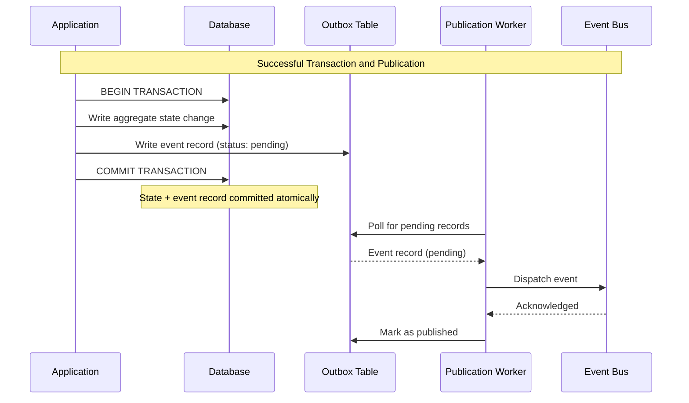
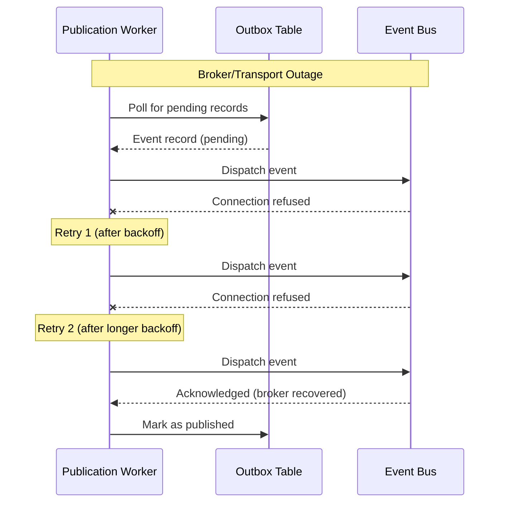
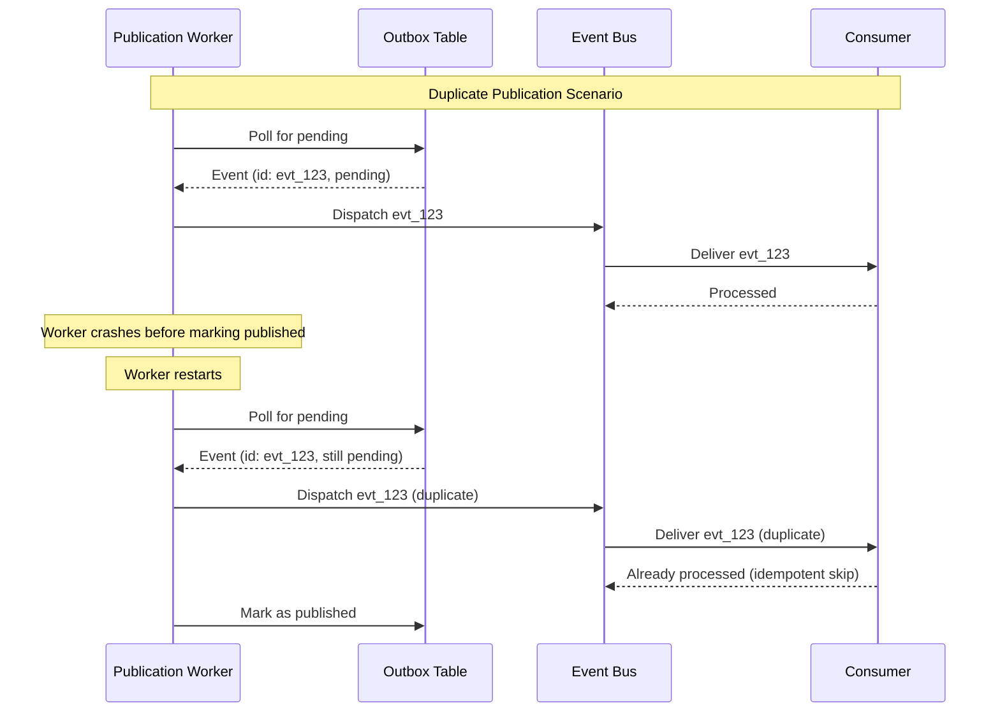
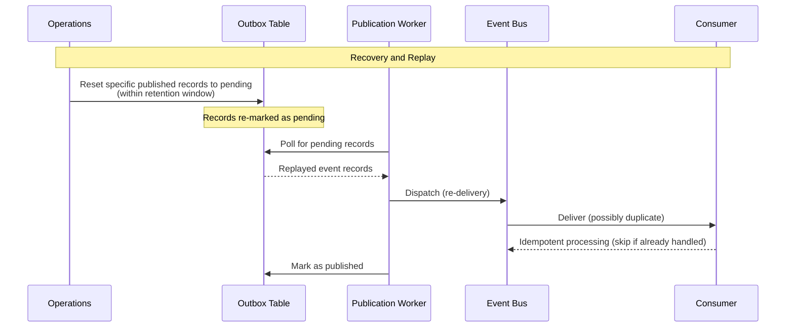

# Event Publishing and Transactional Outbox

## Metadata

| Field | Value |
|-------|-------|
| Title | Kairo Event Publishing and Transactional Outbox Architecture |
| Document ID | KAI-EVT-006 |
| Status | Draft |
| Version | 0.1 |
| Target Release | V1 |
| Owner | Transactional Event Publication Architect |
| Created | 2026-07-22 |
| Last Updated | 2026-07-22 |
| Reviewers | TODO |
| Related Documents | [Event Architecture](./Event-Architecture.md), [Integration Event Architecture](./Integration-Event-Architecture.md), [Domain Event Architecture](./Domain-Event-Architecture.md), [Transaction and Consistency Architecture](../Data/Transaction-and-Consistency-Architecture.md), [Schema Evolution and Migrations](../Data/Schema-Evolution-and-Migrations.md), [Data Lifecycle and Retention](../Data/Data-Lifecycle-and-Retention.md) |
| Dependencies | [Event Architecture](./Event-Architecture.md), [Transaction and Consistency Architecture](../Data/Transaction-and-Consistency-Architecture.md) |
| Forward References | Event Observability and Auditing (future document in this phase) |

---

## Applicable Version

This document defines V1 event publication architecture. V1 uses an in-process transactional outbox pattern within the modular monolith. The architecture ensures that business state changes and event publication intent are recorded atomically, preventing the dual-write problem that causes silent event loss.

---

## Purpose

This document defines how the Kairo platform reliably publishes events — ensuring that every committed business fact that should produce an event actually does, even when infrastructure fails. It establishes the transactional outbox as the mechanism that eliminates the dual-write problem between the application database and event delivery infrastructure.

The dual-write problem is one of the most dangerous consistency issues in event-driven systems: a database transaction commits but the event is never published (or vice versa), creating invisible divergence between state and notifications. The transactional outbox pattern solves this by recording event intent within the same database transaction as the state change.

---

## Scope

This document covers:

- Event publication lifecycle from domain operation through delivery.
- The transactional outbox pattern and its properties.
- Atomic persistence of state and event intent.
- Publication worker behavior (dispatch, retry, ordering).
- Failure recovery, duplicate publication, and replay.
- Outbox retention, cleanup, and monitoring.
- V1 modular-monolith direction and future distributed publication.

This document does not cover:

- Outbox table schema (implementation detail).
- Publication worker implementation code (development standards).
- Broker technology selection or configuration (infrastructure documentation).
- Consumer processing patterns (see [Integration Event Architecture](./Integration-Event-Architecture.md)).
- Event contract format (see [Event Contract Standards](../Events/Event-Contract-Standards.md)).

---

## Mandatory Principles

| # | Principle |
|---|-----------|
| 1 | Business state and durable event intent must be recorded atomically where consistency requires it |
| 2 | Publishing directly to external infrastructure inside a database transaction is not the default |
| 3 | Publication failure must not silently lose committed business facts |
| 4 | Duplicate publication is possible |
| 5 | Consumers must remain idempotent |
| 6 | Outbox records are delivery infrastructure, not the authoritative business record |
| 7 | Publication retries require bounded and observable behavior |
| 8 | Sensitive event content remains protected at rest and in transit |
| 9 | Tenant context must be retained |
| 10 | Cleanup must not destroy records required for recovery or audit |
| 11 | Outbox retention and business audit retention are different concerns |
| 12 | V1 must avoid unnecessary infrastructure while preserving reliable publication |

---

## 1. Event Publication Lifecycle

The complete lifecycle of an event from creation to consumption:

| Phase | What Happens | Owner |
|-------|-------------|-------|
| 1. Domain operation | Aggregate performs state change and produces domain event | Module domain layer |
| 2. Event recording | Event intent is written to outbox in the same database transaction | Module persistence layer |
| 3. Transaction commit | State change and outbox record commit atomically | Database |
| 4. Outbox processing | Publication worker reads committed outbox records | Platform infrastructure |
| 5. Dispatch | Worker delivers event to event infrastructure (in-process bus V1, broker future) | Platform infrastructure |
| 6. Acknowledgment | Outbox record marked as published | Platform infrastructure |
| 7. Consumption | Consumer handlers process the event | Consumer modules |
| 8. Cleanup | Published outbox records are cleaned up after retention period | Platform infrastructure |

---

## 2. Transaction Boundary

**Business state and durable event intent must be recorded atomically where consistency requires it.**

| Rule | Detail |
|------|--------|
| Single transaction | The aggregate state change and the outbox record are written in the same database transaction |
| All-or-nothing | If the transaction rolls back, both the state change and the event record are lost (correct — nothing happened) |
| If committed, event exists | If the transaction commits, the outbox record exists (event WILL be published) |
| No partial | It is impossible for state to be committed without the event record, or vice versa |

---

## 3. Domain Transaction

| Rule | Detail |
|------|--------|
| Aggregate writes state | Normal persistence of the aggregate's new state |
| Same DbContext/connection | Outbox write uses the same database connection and transaction as the state write |
| Module-scoped | Each module's outbox is within its own schema/data scope |
| Transaction size | Outbox records are small (serialized event envelope). Minimal transaction overhead. |

---

## 4. Event Recording

| Rule | Detail |
|------|--------|
| What is recorded | The complete event envelope (per [Event Contract Standards](./Event-Contract-Standards.md)) serialized for delivery |
| When recorded | During the aggregate's save operation, within the same transaction |
| Publication status | Recorded as "pending" (not yet published) |
| Ordering | Outbox records are ordered by insertion (auto-increment or timestamp) |
| Tenant context | Tenant ID is stored with the outbox record for scoping |

---

## 5. Outbox Purpose

**Outbox records are delivery infrastructure, not the authoritative business record.**

| Purpose | Detail |
|---------|--------|
| Bridge | The outbox bridges the gap between database transactions and event delivery |
| Reliability | Ensures events are not lost when delivery infrastructure is temporarily unavailable |
| Decoupling | Separates the timing of state persistence from event delivery |
| Not a business store | The outbox is operational infrastructure. The authoritative business record is the aggregate's persisted state. |
| Not an audit log | Outbox records are cleaned up after delivery. Audit records have permanent retention. |

---

## 6. Atomic Persistence

**Publishing directly to external infrastructure inside a database transaction is not the default.**

| The Dual-Write Problem | Why It Is Dangerous |
|------------------------|---------------------|
| Write state to database, then publish event to broker | If broker publish fails after DB commit, event is lost. State says "done" but nobody was notified. |
| Publish event to broker, then write state to database | If DB write fails after broker publish, consumers react to something that never happened. |
| Both in a distributed transaction | Two-phase commit across DB and broker is complex, slow, and often unavailable. |

| The Outbox Solution | How It Works |
|--------------------|-------------|
| Write state + event record to same database | Single database transaction. Atomic. No dual-write. |
| Separate worker reads outbox and publishes | Delivery happens after commit, outside the business transaction. |
| If delivery fails, outbox record remains | Worker retries until successful. Event is never lost. |

---

## 7. Publication Worker

| Aspect | Detail |
|--------|--------|
| Purpose | Reads committed outbox records and delivers them to event infrastructure |
| Polling | Periodically polls the outbox for pending records |
| Processing | Reads pending records in order, dispatches each to event infrastructure |
| Acknowledgment | Marks successfully delivered records as published |
| Failure | On delivery failure, record remains pending for retry |
| Single worker (V1) | V1 uses a single publication worker per module (avoids concurrent publishing complexity) |
| Background process | Runs as a background service within the monolith |

---

## 8. Dispatch

| Aspect | V1 Behavior | Future Behavior |
|--------|-------------|-----------------|
| Target | In-process event bus | External message broker |
| Transport | Method call (same process) | Network call to broker |
| Latency | Sub-millisecond dispatch | Milliseconds (network) |
| Failure mode | Process crash | Network failure, broker unavailable |
| Acknowledgment | In-process confirmation | Broker acknowledgment |

---

## 9. Publication Status

Each outbox record transitions through these states:

| Status | Meaning |
|--------|---------|
| `pending` | Recorded in outbox. Not yet dispatched. |
| `published` | Successfully dispatched to event infrastructure. |
| `failed` | Dispatch failed after all retry attempts. Requires investigation. |

| Rule | Detail |
|------|--------|
| Only forward | Status moves forward: pending → published or pending → failed |
| No re-pending | A published record is never re-set to pending (replay uses a separate mechanism) |
| Failed is terminal | Failed records require manual investigation and resolution |

---

## 10. Retry

**Publication retries require bounded and observable behavior.**

| Rule | Detail |
|------|--------|
| Automatic | Failed dispatch is retried automatically by the publication worker |
| Bounded | Maximum retry count (e.g., 5-10 attempts) |
| Backoff | Exponential backoff between attempts |
| Observable | Each retry attempt is logged with attempt count and error detail |
| After exhaustion | Record moves to `failed` status. Alert triggered. |
| Not infinite | Unbounded retry would mask underlying infrastructure problems |

---

## 11. Duplicate Publication

**Duplicate publication is possible.**
**Consumers must remain idempotent.**

| Scenario | How Duplicates Occur |
|----------|---------------------|
| Worker crash after dispatch but before acknowledgment | Event was delivered but outbox record not marked as published. Worker restarts and re-dispatches. |
| Network failure after broker receives but before ACK returns | Broker received the event but worker did not receive confirmation. Worker re-dispatches. |
| Worker restart with re-processing window | Worker restarts and re-processes recently committed records that may have been dispatched. |

| Rule | Detail |
|------|--------|
| Expected | Duplicate publication is an expected operational scenario, not an error |
| Event ID is key | Each event has a unique ID. Consumers use this for deduplication. |
| Consumer responsibility | Consumers must handle duplicates (per [Integration Event Architecture](./Integration-Event-Architecture.md)) |
| Not a bug | Duplicate publication is a correct trade-off for reliable at-least-once delivery |

---

## 12. Failure Recovery

**Publication failure must not silently lose committed business facts.**

| Failure Scenario | Impact | Recovery |
|-----------------|--------|----------|
| Application crash during transaction | Transaction rolls back. No state change, no outbox record. Correct — nothing happened. | None needed. |
| Application crash after commit, before worker processes | Outbox record exists (committed). Worker processes on restart. | Automatic — worker picks up pending records. |
| Worker crash during dispatch | Outbox record remains pending. Worker re-processes on restart. | Automatic — may produce duplicate (consumers handle). |
| Worker crash after dispatch, before ACK | Event delivered but not marked published. Worker re-dispatches on restart. | Automatic — duplicate (consumers handle). |
| Event bus/broker unavailable | Worker retries with backoff. Records remain pending. | Automatic — retries until infrastructure recovers. |
| Extended infrastructure outage | Records accumulate in pending. Alerts triggered. | Manual investigation if outage exceeds retry window. |
| Database unavailable | Worker cannot read outbox. | Worker waits for database recovery. No data loss. |

---

## 13. Ordering

| Rule | Detail |
|------|--------|
| Per-module ordered | Within a single module's outbox, records are ordered by insertion |
| Publication respects order | Worker processes records in order (FIFO within a module) |
| Cross-module not ordered | Events from different modules have no ordering guarantee relative to each other |
| Per-aggregate best-effort | Events for the same aggregate are naturally ordered within the module (inserted sequentially by aggregate operations) |
| Consumer handles gaps | If a consumer receives events out of order (due to retry timing), it handles gracefully using timestamps and causation IDs |

---

## 14. Tenant Context

**Tenant context must be retained.**

| Rule | Detail |
|------|--------|
| Stored with record | Tenant ID is stored in the outbox record alongside the event payload |
| Publication preserves | Publication worker preserves tenant context when dispatching |
| Consumer receives | Consumer handler receives the event with its original tenant context |
| No cross-tenant mixing | Outbox processing does not mix events from different tenants (delivery order may interleave, but tenant context is always correct per event) |

---

## 15. Security Classification

**Sensitive event content remains protected at rest and in transit.**

| Rule | Detail |
|------|--------|
| At rest | Outbox records stored in the module's database follow the same encryption-at-rest rules as all persistent data |
| In transit (V1) | In-process dispatch — no network transit. Same security as in-process method calls. |
| In transit (future) | Broker connections must use TLS. Event payloads may be encrypted at the application level for sensitive events. |
| Classification metadata | The event's data classification is stored in the outbox record metadata |
| Minimization | Outbox stores the event payload as designed (already minimized per [Event Contract Standards](./Event-Contract-Standards.md)) |
| Access control | Outbox table access restricted to the owning module and the platform publication worker |

---

## 16. Outbox Retention

**Outbox retention and business audit retention are different concerns.**

| Rule | Detail |
|------|--------|
| Published records | Retained briefly after publication for operational safety (hours to days, not months) |
| Failed records | Retained until investigated and resolved |
| Not permanent | Outbox is operational infrastructure with short-term retention |
| Not audit | The outbox is not an audit log. Audit events have their own permanent retention. |
| Recovery window | Retention period defines the window during which replay from outbox is possible |

| Record Status | Retention |
|--------------|-----------|
| Published | Short-term (configurable, e.g., 24-72 hours post-publication) |
| Failed | Until manually resolved |
| Pending | Until published or failed (retried until one of these states) |

---

## 17. Cleanup

**Cleanup must not destroy records required for recovery or audit.**

| Rule | Detail |
|------|--------|
| Automated | Published records are cleaned up automatically after retention period |
| Failed protected | Failed records are never automatically cleaned up (require investigation) |
| Batch cleanup | Cleanup runs as a scheduled background operation |
| No cascade | Cleanup of outbox records does not affect business data or audit records |
| Audit separate | If an event was audit-relevant, the audit service captured it independently. Outbox cleanup does not affect audit. |
| Monitoring | Cleanup job health is monitored (failure to clean up causes storage growth) |

---

## 18. Monitoring

| Metric | Purpose |
|--------|---------|
| Pending record count | Current backlog — should be near zero during normal operation |
| Pending age (oldest) | How long the oldest pending record has waited — indicates processing lag |
| Publication rate | Events published per second/minute — throughput monitoring |
| Failure rate | Failed dispatches per period — infrastructure health |
| Failed record count | Total failed records awaiting investigation |
| Retry count distribution | How many events required retries — infrastructure reliability |
| Cleanup backlog | Unpurged published records — cleanup job health |
| Worker health | Publication worker liveness and processing status |

| Alert Condition | Severity | Response |
|----------------|----------|----------|
| Pending count rising | Warning | Investigate publication worker or infrastructure |
| Oldest pending > threshold (minutes) | Warning | Check worker health and event bus |
| Failed record count > 0 | High | Investigate failed events. Potential data consistency gap. |
| Worker not processing | Critical | Publication is stalled. Events are not being delivered. |
| Cleanup not running | Warning | Storage will grow. Schedule cleanup maintenance. |

---

## 19. Replay

| Aspect | Detail |
|--------|--------|
| Definition | Re-dispatching previously published events (e.g., for new consumer or recovery) |
| V1 capability | Limited — only records still within outbox retention window can be replayed |
| Mechanism | Operational tool resets specific published records to pending (worker re-dispatches) |
| Idempotency required | Replay delivers events that may have been processed. All consumers must handle this. |
| Scope | Replay can target specific event types, time ranges, or tenant scopes |
| Not routine | Replay is a recovery mechanism, not a regular operational procedure |
| Future | V2+: event store with longer retention enables broader replay capability |

---

## 20. Operational Recovery

| Scenario | Recovery Path |
|----------|-------------|
| Worker was down, records accumulated | Worker startup processes pending records in order. Self-recovering. |
| Infrastructure outage resolved | Worker resumes. Pending records dispatched. Consumers catch up. |
| Failed records after investigation | Fix root cause. Manually re-set to pending for re-dispatch. Or mark as resolved if event is no longer needed. |
| Consumer was down during publication | Events were published successfully. Consumer processes when restarted (event bus/broker retains). |
| Need to replay for new consumer | Replay from outbox (within retention) or consumer reconciles via API if events are no longer available. |
| Corruption of outbox records | Business state is authoritative (not outbox). Rebuild outbox from business state if needed (extreme case). |

---

## 21. V1 Modular-Monolith Implementation Direction

**V1 must avoid unnecessary infrastructure while preserving reliable publication.**

| Aspect | V1 Approach |
|--------|-------------|
| Outbox storage | Database table within each module's schema |
| Publication worker | In-process background service (hosted service in ASP.NET Core) |
| Dispatch target | In-process event bus (same process, no network) |
| Polling interval | Short interval (seconds) for low-latency publication |
| Single worker | One publication worker per module (no concurrency complexity) |
| Retry | In-process retry with exponential backoff |
| Dead-letter | Failed records remain in outbox table (marked failed) |
| Cleanup | Scheduled background job deletes published records after retention period |
| Monitoring | Structured logging + Prometheus metrics for pending/failed counts |
| No external broker | V1 does not require an external message broker |
| Performance | In-process dispatch is fast. Outbox polling adds seconds of latency at most. |

---

## 22. Future Distributed Publication

| Aspect | Future Direction |
|--------|-----------------|
| Outbox unchanged | Same outbox pattern — write to DB in same transaction |
| Worker target changes | Publication worker dispatches to external broker instead of in-process bus |
| Broker handles delivery | Broker provides durable delivery, acknowledgment, and retry to consumers |
| Worker becomes publisher | Worker reads outbox, publishes to broker topic/queue, marks as published |
| Consumer independence | Consumers may run in separate processes reading from broker |
| Ordering | Broker partitioning by aggregate/resource ID for per-aggregate ordering |
| Scaling | Multiple worker instances with partition assignment (one partition per worker) |
| Migration path | 1. Deploy broker. 2. Change worker target from in-process bus to broker. 3. Consumers read from broker (in-process initially). 4. Extract consumers to services. |
| **Contract unchanged** | Event contracts, outbox pattern, and cleanup logic remain identical. Only the dispatch target changes. |

---

## Version Gate

| Version | Event Publishing and Outbox Gate |
|---------|----------------------------------|
| V1 | Transactional outbox in same DB transaction as state change. In-process publication worker. In-process event dispatch. Bounded retry with backoff. Failed record alerting. Automated cleanup of published records. Outbox monitoring (pending count, age, failure count). Replay capability within retention window. Duplicate publication acknowledged and handled by idempotent consumers. |
| V2 | External broker as dispatch target. Enhanced replay from event store. Multiple worker instances with partitioning. Publication lag dashboard. Automated failed-record triage. |
| V3 | Cross-region publication. Event store with long-term retention. Publication SLA monitoring. Advanced partitioning and ordering guarantees. |

---

## Decision Summary

| Decision | Rationale |
|----------|-----------|
| Transactional outbox (not direct publish) | Eliminates dual-write problem. Atomic state + event recording. No lost events after commit. |
| In-process dispatch for V1 | No external broker needed for a monolith. Simpler operations. Same reliability through outbox pattern. |
| Duplicate publication as accepted trade-off | At-least-once publication (may duplicate) is safer than at-most-once (may lose). Consumer idempotency handles duplicates. |
| Short outbox retention (not permanent) | Outbox is infrastructure, not archive. Permanent retention wastes storage and conflates with audit. |
| Single worker per module (V1) | Avoids concurrent publication complexity. Sufficient for V1 throughput. Scaling is a V2 concern. |
| Bounded retries (not infinite) | Infinite retry masks infrastructure problems. Bounded retry + alerting enables investigation. |
| Outbox and audit are separate | Different retention (short vs permanent), different purpose (delivery vs compliance), different consumers. Conflating them creates problems in both. |
| Worker polls (not CDC) | Polling is simpler to implement and debug. CDC adds infrastructure complexity. V1 polling interval of seconds is sufficient. |

---

## Alternatives Considered

| Alternative | Rejected Because |
|------------|-----------------|
| Direct publish to broker in transaction | Dual-write problem. If broker publish fails after DB commit, event is lost. If DB fails after broker publish, phantom event. |
| Two-phase commit (DB + broker) | Complex, slow, and not all databases/brokers support it. Impractical for V1. |
| CDC (Change Data Capture) from database | Adds infrastructure dependency (CDC tool). Harder to debug. Couples events to DB schema, not domain semantics. |
| Permanent outbox retention | Wastes storage. Creates confusion with audit retention. Outbox purpose is delivery, not archival. |
| No outbox (fire-and-forget publish) | Events are silently lost on failure. Unacceptable for business-critical notifications. |
| External broker in V1 | Adds operational complexity without V1 necessity. All modules are in-process. |
| Multiple concurrent workers in V1 | Ordering and duplication complexity. Single worker is sufficient for V1 throughput. |
| Exactly-once publication guarantee | Impossible across failures. At-least-once with idempotent consumers is the correct and honest approach. |

---

## Architecture Impact

| Concern | Impact |
|---------|--------|
| Module design | Every module that publishes integration events must implement the outbox pattern (write event to outbox in same transaction as state change). |
| Transaction management | Outbox write is part of the aggregate's save transaction. No separate transaction. |
| Background processing | Publication worker runs as a background service. Must be healthy for events to flow. |
| Monitoring | Outbox health (pending count, failure count) is a critical operational metric. |
| Storage | Outbox tables consume storage proportional to event volume × retention period. |
| Testing | Must test: atomic recording (rollback loses both state and event), publication (worker dispatches pending records), retry (failed dispatch is retried), cleanup (published records are cleaned up). |

---

## Implementation Impact

| Area | Impact |
|------|--------|
| Modules | Must write outbox records in the same transaction as state changes. Must produce correctly formatted event envelopes. Must not publish directly to event infrastructure from within a transaction. |
| Platform | Must provide outbox infrastructure (base outbox write support, publication worker framework, retry logic, cleanup scheduler). Must provide monitoring for outbox health. |
| Operations | Must monitor publication worker health. Must investigate failed records. Must manage outbox retention configuration. Must respond to publication lag alerts. |
| Testing | Must verify outbox atomicity. Must verify retry behavior. Must verify duplicate handling. Must verify cleanup does not affect active records. |
| Database | Outbox tables must be included in database backup and migration planning. Index on status + creation time for efficient polling. |

---

## Security Responsibilities

| Role | Publishing and Outbox Responsibilities |
|------|---------------------------------------|
| Event Publication Architect | Defines outbox pattern and publication standards. Reviews publication reliability. |
| Module Teams | Implement outbox recording in their save operations. Ensure event payloads follow contract standards. |
| Platform Team | Provides outbox infrastructure (worker, retry, cleanup). Monitors publication health. Manages outbox access control. |
| Security Team | Validates outbox data protection (at-rest encryption follows DB standards). Reviews event payload sensitivity in stored outbox records. |
| Operations | Monitors publication metrics. Investigates failed records. Manages retention configuration. Responds to worker health alerts. |

---

## Multi-Tenancy Responsibilities

| Responsibility | Detail |
|---------------|--------|
| Tenant in outbox records | Every outbox record carries tenant context (for scoped processing and monitoring) |
| Fair publication | Publication worker processes events from all tenants fairly (no starvation) |
| Tenant-scoped monitoring | Pending/failed metrics can be broken down per tenant for support |
| No cross-tenant | Publication of one tenant's events does not affect another tenant's event delivery |
| Replay scoped | Replay operations can target specific tenants |

---

## Out of Scope

This document does not define:

- Outbox table schema (implementation detail).
- Publication worker implementation code (development standards).
- Broker technology, topic naming, or connection configuration (infrastructure documentation).
- Consumer processing patterns (see [Integration Event Architecture](./Integration-Event-Architecture.md)).
- Event payload format (see [Event Contract Standards](./Event-Contract-Standards.md)).
- Audit event capture and retention (see Event Observability and Auditing — forward reference).

---

## Future Considerations

- **Event store** — Long-term event retention beyond outbox lifecycle for replay and history.
- **Partitioned publication** — Multiple workers with partition assignment for throughput.
- **CDC as supplement** — Change Data Capture as an additional publication mechanism for specific use cases.
- **Publication SLAs** — Guaranteed publication latency targets with monitoring.
- **Cross-region publication** — Publishing events across geographic regions.
- **Outbox compression** — Compressing stored event payloads for storage efficiency.
- **Publication batching** — Dispatching multiple events in a single broker call for throughput.

---

## Future Refactoring Triggers

This document should be revisited when:

- Event volume exceeds single-worker capacity (trigger for partitioned publication).
- External broker is deployed (trigger for worker dispatch target change).
- Publication latency exceeds acceptable thresholds (trigger for worker optimization).
- Outbox storage growth becomes significant (trigger for retention tuning or compression).
- Cross-region deployment requires event replication (trigger for distributed publication).
- Event replay needs exceed outbox retention (trigger for event store).
- CDC is evaluated for specific use cases (trigger for supplemental publication pattern).

---

## Change History

| Version | Date | Author | Description |
|---------|------|--------|-------------|
| 0.1 | 2026-07-22 | Transactional Event Publication Architect | Initial draft — event publishing and transactional outbox |
