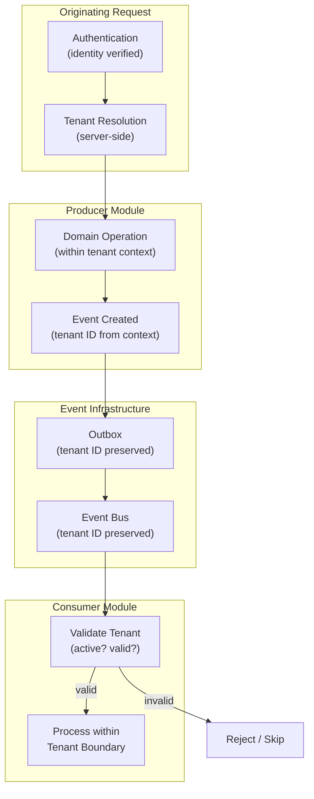

# Event Security and Tenant Context

## Metadata

| Field | Value |
|-------|-------|
| Title | Kairo Event Security, Trust, Tenant Isolation, and Sensitive-Data Architecture |
| Document ID | KAI-EVT-010 |
| Status | Draft |
| Version | 0.1 |
| Target Release | V1 |
| Owner | Event Security and Multi-Tenant Isolation Architect |
| Created | 2026-07-22 |
| Last Updated | 2026-07-22 |
| Reviewers | TODO |
| Related Documents | [Event Architecture](./Event-Architecture.md), [Threat Model](../Security/Threat-Model.md), [Tenant Isolation](../Multi-Tenancy/Tenant-Isolation.md), [Data Classification and Sensitivity](../Data/Data-Classification-and-Sensitivity.md), [Secrets and Key Management](../Security/Secrets-and-Key-Management.md), [API Security](../Security/API-Security.md), [Event Contract Standards](./Event-Contract-Standards.md), [Event Consumption and Inbox](./Event-Consumption-and-Inbox.md) |
| Dependencies | [Event Architecture](./Event-Architecture.md), [Threat Model](../Security/Threat-Model.md), [Tenant Isolation](../Multi-Tenancy/Tenant-Isolation.md) |

---

## Applicable Version

This document defines V1 event security and tenant-context architecture. V1 operates in-process within the modular monolith where trust is implicit (same process). The architecture establishes rules that hold in V1 and extend naturally when events cross service boundaries in the future.

---

## Purpose

This document defines how the Kairo platform secures event flows — ensuring tenant isolation, protecting sensitive data, preventing unauthorized access, and resisting event-level attacks such as injection, spoofing, and replay. It establishes the security and trust model for events as a first-class concern rather than an afterthought.

Events flow through the platform carrying business-critical data. An event with a forged tenant ID could cause one tenant's consumer to modify another tenant's state. An event containing credentials could leak secrets to every subscriber. An event replayed without authorization could trigger duplicate financial effects. This document prevents all of these.

---

## Scope

This document covers:

- Trust boundaries and identity for producers, consumers, and infrastructure.
- Tenant context propagation and validation rules.
- Sensitive data, personal data, and secrets handling in events.
- Encryption, signing, and tamper-detection direction.
- Threat model for events (injection, spoofing, replay, unauthorized subscription).
- Logging restrictions and audit requirements.
- V1 controls and future advanced controls.

This document does not cover:

- TLS certificate management (infrastructure documentation).
- Encryption key generation or rotation procedures (see [Secrets and Key Management](../Security/Secrets-and-Key-Management.md)).
- Webhook signing mechanics (see [Webhook Architecture](../API/Webhook-Architecture.md)).
- API authentication flows (see [API Security](../Security/API-Security.md)).
- Event handler implementation code (development standards).

---

## Mandatory Principles

| # | Principle |
|---|-----------|
| 1 | Tenant context must come from trusted publication context |
| 2 | Consumer-supplied tenant overrides are prohibited |
| 3 | Tenant-owned effects require validation of event tenant context |
| 4 | Platform-level events require explicit classification |
| 5 | Events must not contain credentials or secrets |
| 6 | Sensitive data must be minimized |
| 7 | Encryption does not make sensitive data non-sensitive |
| 8 | Authorization may still be required when consuming an event |
| 9 | Access to event infrastructure does not automatically authorize all event types |
| 10 | Cross-tenant analytics events require explicit governance |
| 11 | Replay must not bypass current isolation or authorization rules |
| 12 | Logging full payloads is prohibited by default for sensitive events |
| 13 | External events require stronger authenticity verification |

---

## Trust Boundaries

### 1. Event Trust Boundaries

| Boundary | V1 Status | Trust Level | Future Status |
|----------|-----------|-------------|---------------|
| Producer → infrastructure | In-process (same trust boundary) | Implicit trust | Service-to-infrastructure (authenticated) |
| Infrastructure → consumer | In-process (same trust boundary) | Implicit trust | Infrastructure-to-service (authenticated) |
| Producer → consumer (via infrastructure) | Same process | High (implicit) | Cross-service (explicit credentials) |
| Platform → external (webhooks) | Network boundary | Low (HMAC signed) | Low (HMAC signed) |
| External → platform (inbound webhooks) | Network boundary | Low (verified) | Low (verified) |

```mermaid
graph TD
    subgraph V1Trust["V1: Single Process Trust Boundary"]
        Producer["Producer Module"]
        Infra["Event Infrastructure<br/>(in-process bus)"]
        ConsumerA["Consumer Module A"]
        ConsumerB["Consumer Module B"]

        Producer -->|"trusted<br/>(same process)"| Infra
        Infra -->|"trusted<br/>(same process)"| ConsumerA
        Infra -->|"trusted<br/>(same process)"| ConsumerB
    end

    subgraph FutureTrust["Future: Distributed Trust Boundaries"]
        ProducerF["Producer Service"]
        BrokerF["Message Broker"]
        ConsumerFA["Consumer Service A"]
        ConsumerFB["Consumer Service B"]

        ProducerF -->|"authenticated<br/>(service credentials)"| BrokerF
        BrokerF -->|"authenticated<br/>(service credentials)"| ConsumerFA
        BrokerF -->|"authenticated<br/>(service credentials)"| ConsumerFB
    end

    subgraph External["External Boundary"]
        Webhook["Webhook Delivery<br/>(HMAC signed)"]
        ExtApp["External Application"]
        Webhook -->|"signed + verified"| ExtApp
    end
```

---

### 2. Producer Identity

| Rule | Detail |
|------|--------|
| Known producer | Every event identifies its producing module (envelope `producer` field) |
| Trusted source | V1: in-process — producer identity is implicit (code execution context). Future: service credentials. |
| Cannot be forged | V1: same process, no forgery risk. Future: infrastructure validates producer credentials. |
| Producer metadata | Producer identity is part of the event envelope, set by infrastructure (not by application code) |

---

### 3. Consumer Identity

| Rule | Detail |
|------|--------|
| Known consumer | Every consumer is registered with the platform for specific event types |
| Controlled subscription | Consumers cannot subscribe to arbitrary event types without registration |
| V1: implicit | In-process registration at startup. Consumer identity is the handler registration. |
| Future: explicit | Service-to-broker authentication. Consumer credentials validated by broker. |

---

### 4. Infrastructure Trust

| Rule | Detail |
|------|--------|
| Trusted mediator | Event infrastructure (bus, outbox processor, broker) is a trusted component |
| Does not modify events | Infrastructure routes events. It does not alter payloads or metadata. |
| Integrity preserved | Events are delivered exactly as published (no modification in transit) |
| V1: implicit | Same process — infrastructure code is part of the trusted application |
| Future: explicit | Broker is a secured, authenticated infrastructure component |

---

## Identity and Authorization

### 5. Authentication

| Aspect | V1 | Future |
|--------|-----|--------|
| Producer → infrastructure | N/A (in-process) | Service credentials (mutual TLS or token) |
| Infrastructure → consumer | N/A (in-process) | Service credentials |
| External inbound | Signature verification per provider | Same (enhanced) |
| External outbound | HMAC signing per subscription | Same |

---

### 6. Authorization

**Authorization may still be required when consuming an event.**
**Access to event infrastructure does not automatically authorize all event types.**

| Rule | Detail |
|------|--------|
| Subscription is authorization | A consumer's registration for an event type IS its authorization to receive that type |
| Not blanket access | Being registered for `order.placed` does not grant access to `payment.captured` |
| Controlled registration | Event type subscriptions are governed (reviewed, approved) |
| Consumer-level auth | The consumer operates within the authorization context appropriate for its module |
| No escalation via events | Consuming an event does not grant higher privileges than the consumer module inherently has |
| Future: fine-grained | Cross-service events may require per-delivery authorization verification |

---

## Tenant Context

### 7. Tenant Context

**Tenant context must come from trusted publication context.**
**Consumer-supplied tenant overrides are prohibited.**

| Rule | Detail |
|------|--------|
| Set by producer's context | The tenant ID in the event comes from the producing module's authenticated tenant context |
| Not from payload construction | Application code does not arbitrarily set tenant ID. It is derived from the operation's authenticated context. |
| Infrastructure preserves | Event infrastructure preserves the tenant context from publication to consumption without modification |
| Consumer validates | Consumer validates the tenant context before performing tenant-scoped effects (per [Event Consumption and Inbox](./Event-Consumption-and-Inbox.md)) |
| No override | Consumers cannot override or replace the event's tenant context |

---

### 8. Organization Context

| Rule | Detail |
|------|--------|
| Primary tenant boundary | Organization ID is the primary tenant identifier in events |
| Always present | For all tenant-scoped events (nearly all business events) |
| Immutable in transit | Organization context does not change between publication and consumption |
| Consumer scoping | All consumer effects operate within this organization boundary |

---

### 9. Store Context

| Rule | Detail |
|------|--------|
| Optional | Store ID is present when the event is store-specific (not all events are) |
| Within organization | Store is always within the event's organization context |
| Consumer use | Consumers may use store context for routing or filtering |
| Null for org-level | Organization-level events (user management, org configuration) have null store context |

---

### 10. Application Context

| Rule | Detail |
|------|--------|
| Actor identity | Events carry the identity of the actor who caused the operation (user ID, system identity) |
| Correlation | Events carry correlation ID linking to the originating request |
| Not full credentials | Events carry actor ID for audit — not tokens, sessions, or passwords |
| Preserved | Application context flows from originating request through event publication to consumption |

---

### 11. Cross-Tenant Restrictions

| Rule | Detail |
|------|--------|
| Prohibited by default | Events for Tenant A must never cause effects in Tenant B's data |
| Consumer isolation | Consumer processing one tenant's event operates within that tenant boundary only |
| No aggregation across tenants | A single consumer handler does not aggregate data from multiple tenants' events (unless explicitly platform-level) |
| Infrastructure does not mix | Event routing does not mix tenants' events in ways that create leakage risk |
| Explicit exception | Platform-level operations that cross tenants (tenant suspension by platform admin) are explicitly classified as platform events |

---

### 12. Platform-Level Events

**Platform-level events require explicit classification.**

| Rule | Detail |
|------|--------|
| Definition | Events that are not tenant-scoped (platform operational events, infrastructure events) |
| Classification | Must be explicitly marked as platform-level (not ambiguously missing tenant context) |
| Tenant ID | `tenantId: null` with explicit documentation that this is intentional |
| Consumers | Only platform-level consumers (not tenant-scoped modules) process platform events |
| Examples | Platform health events, infrastructure scaling events, feature flag changes |
| Governance | Platform events require security review (may affect all tenants) |

---

### 13. Support Operations

| Rule | Detail |
|------|--------|
| Support accessing tenant events | Support personnel accessing dead-letter or event data for a tenant must be authorized for that tenant |
| Audit | Support access to event data is audit-logged |
| Scoped | Support tools filter events by tenant (support sees only the relevant tenant's events) |
| Not cross-tenant | Support investigating Tenant A's events cannot see Tenant B's events |
| Platform support | Platform operators accessing cross-tenant event infrastructure require elevated authorization |

---

## Data Protection

### 14. Encryption in Transit

| Aspect | V1 | Future |
|--------|-----|--------|
| Internal events | N/A (in-process — no network transit) | TLS between services and broker |
| Outbound webhooks | HTTPS (TLS) to external endpoints | Same |
| Inbound webhooks | HTTPS (TLS) from external providers | Same |

---

### 15. Encryption at Rest

| Aspect | Detail |
|--------|--------|
| Outbox table | Encrypted at rest (follows database encryption policy) |
| Dead-letter records | Encrypted at rest (same as outbox) |
| Inbox/dedup records | Encrypted at rest (same) |
| Event payloads | Encrypted as part of database-level encryption. V1 does not use field-level encryption within events. |
| Future | Field-level encryption for specific sensitive fields evaluated for V2+ (cross-service scenarios) |
| **Encryption does not make sensitive data non-sensitive** | A field containing a customer's email is still Confidential regardless of encryption. Minimization remains required. |

---

### 16. Sensitive Data

**Sensitive data must be minimized.**

| Rule | Detail |
|------|--------|
| Minimization is primary | The best protection is not including sensitive data in the first place |
| IDs over details | Use customer ID, not customer email. Use order ID, not order contents. |
| Only what consumers need | Include sensitive data only when consumers genuinely need it to perform their reaction |
| Classification in metadata | Event metadata declares the payload's data classification level |
| Reference pattern | If consumers need sensitive data, they fetch it via authorized API using the resource ID from the event |

---

### 17. Personal Data

| Rule | Detail |
|------|--------|
| Minimize PII | Customer names, emails, addresses, phone numbers should not be in event payloads unless consumers genuinely need them |
| Customer ID preferred | Reference by customer ID. Consumer fetches PII via authorized Customer API if needed. |
| GDPR consideration | Events containing PII have retention implications (right to erasure may affect event stores in future) |
| Classification | Events containing PII are classified as Confidential (at minimum) |

---

### 18. Secrets

**Events must not contain credentials or secrets.**

| Rule | Detail |
|------|--------|
| Never | Events never contain: passwords, API keys, tokens, signing secrets, encryption keys, connection strings |
| No exceptions | There is no use case where a secret should travel through event infrastructure |
| Detection | Code review and automated scanning check for secret patterns in event payloads |
| If needed | If a consumer needs a secret to perform its reaction, it obtains the secret from the secrets management system, not from the event |

---

### 19. Payload Minimization

| Principle | Detail |
|-----------|--------|
| Default: minimal | Events carry the minimum data needed for consumers to route, decide, and react |
| Hybrid default | Key identifying fields + resource ID. Consumer fetches full data via API if needed. |
| Sensitivity reduces payload | Higher-sensitivity data = stronger case for reference-only (ID only, no data) |
| No entity dumps | Complete aggregate state is never serialized into event payloads |
| Review | New event types undergo sensitivity review for payload content |
| Reference | Per [Event Contract Standards](./Event-Contract-Standards.md) |

---

## Integrity and Attack Prevention

### 20. Event Signing Direction

| Aspect | Detail |
|--------|--------|
| V1 (internal) | Not required. In-process events cannot be intercepted or modified in transit. |
| Future (distributed) | Event signing evaluated when events cross service boundaries (producer signs, consumer verifies) |
| External (webhooks) | Already HMAC-signed for outbound webhooks. Verified for inbound webhooks. |
| Direction | When a broker is deployed, evaluate producer-side signing with consumer-side verification |

---

### 21. Tamper Detection

| Aspect | Detail |
|--------|--------|
| V1 | In-process delivery — tamper is not possible (same memory space) |
| Future | If events traverse a network, tamper detection via signing or message authentication codes |
| Outbox integrity | Outbox records are in the database (integrity protected by database security) |
| Dead-letter integrity | Dead-letter records are not modifiable through application APIs |

---

### 22. Replay Attacks

**Replay must not bypass current isolation or authorization rules.**

| Threat | Mitigation |
|--------|-----------|
| Attacker replays old event | Consumer deduplication (inbox) detects already-processed event ID |
| Legitimate replay (recovery) | Replay goes through authorized operations tooling with audit |
| Replay bypassing current permissions | Consumer validates current authorization and tenant context on every event, including replays |
| Stale replay (old deleted tenant) | Consumer validates tenant is active. Deleted-tenant events are skipped. |

---

### 23. Unauthorized Subscription

**Access to event infrastructure does not automatically authorize all event types.**

| Threat | Mitigation |
|--------|-----------|
| Unauthorized consumer subscribes to events | Subscription registration is controlled (code-level in V1, governed in future) |
| V1 mitigation | Subscription is code-based (startup registration). Only deployed code can subscribe. Deployment is controlled. |
| Future mitigation | Broker-level ACLs. Consumer credentials authorize specific topics/event types. |
| Monitoring | Subscription changes are logged. Unexpected subscriptions trigger alerts. |

---

### 24. Event Injection

| Threat | Mitigation |
|--------|-----------|
| Attacker injects fake event into infrastructure | V1: infrastructure is in-process (not externally accessible). No injection vector. |
| Future | Broker access requires authentication. Only authorized producers can publish. |
| Inbound webhooks | External webhook receivers verify signatures. Unverified payloads are rejected. |
| Validation | Consumers validate event contracts. Malformed or unexpected events are rejected. |

---

### 25. Event Spoofing

| Threat | Mitigation |
|--------|-----------|
| Producer spoofs tenant ID | V1: tenant context comes from authenticated request context, not arbitrary code. Infrastructure sets it. |
| Producer spoofs producer identity | V1: producer field set by infrastructure from code context. Future: service credentials. |
| External provider spoofs webhook | Inbound webhook verification (signature checking) prevents spoofing |
| Consumer spoofs acknowledgment | V1: in-process — not applicable. Future: broker manages acknowledgment. |

---

### 26. Metadata Leakage

| Rule | Detail |
|------|--------|
| Event metadata | Metadata fields (correlation ID, producer, timestamps) do not leak sensitive business information |
| Error messages | Event processing errors do not leak event payload content in logs or responses |
| Dead-letter exposure | Dead-letter investigation tools mask sensitive fields per classification |
| Monitoring | Event metrics (counts, types, lag) do not expose payload content |
| Cross-tenant | Monitoring dashboards do not show one tenant's event details to another tenant's operators |

---

### 27. Logging Restrictions

**Logging full payloads is prohibited by default for sensitive events.**

| Rule | Detail |
|------|--------|
| Default: metadata only | Event processing logs include: event ID, type, tenant ID, producer, timestamp, processing result. Not payload. |
| Sensitive events | Events classified as Confidential or Restricted: payload is never logged |
| Internal/Public events | Events classified as Internal or Public: payload may be logged at debug level (not production default) |
| Dead-letter | Dead-letter records store the full payload (required for investigation). Access is controlled. |
| Correlation | Logs include correlation ID for tracing (not payload content) |
| Code review | Logging code is reviewed to ensure no accidental payload exposure |

---

### 28. Audit Requirements

| Event | Audit Record |
|-------|-------------|
| Event published | Producer, type, tenant, event ID, timestamp (not payload) |
| Event consumed successfully | Consumer, event ID, timestamp |
| Event consumption failed | Consumer, event ID, failure reason, retry count |
| Event dead-lettered | Consumer, event ID, failure reason, full retry history |
| Event replayed | Operator, event ID, authorization, timestamp |
| Event skipped | Operator, event ID, authorization, reason |
| Subscription changed | Consumer, event type, action (add/remove), operator |
| Cross-tenant event access | Operator, scope, authorization, timestamp |
| Dead-letter accessed | Operator, tenant scope, timestamp |

---

## Threat Matrix

| Threat | Severity | V1 Risk | Mitigation | Future Enhancement |
|--------|----------|---------|-----------|-------------------|
| Tenant context spoofing | Critical | Low (in-process, context from auth) | Tenant set from authenticated request context by infrastructure | Service-to-service auth for tenant propagation |
| Event injection (fake events) | Critical | Very Low (in-process, no external access) | In-process infrastructure not externally accessible | Broker authentication, producer credentials |
| Unauthorized subscription | High | Low (code-based registration, deployment-controlled) | Subscriptions defined in code, deployed through CI/CD | Broker ACLs, per-topic authorization |
| Event replay attack | High | Low (inbox deduplication, tenant validation) | Consumer deduplication + tenant validation on every event | Signed events with replay-resistant tokens |
| Sensitive data in payload | Medium | Medium (depends on developer discipline) | Payload minimization policy, code review, classification metadata | Automated scanning for PII in event payloads |
| Secrets in event payload | Critical | Low (code review, awareness) | Mandatory principle, code review, secret scanning | Automated secret detection in CI |
| Cross-tenant data leakage via events | Critical | Low (in-process, tenant-scoped handlers) | Tenant validation before processing, no cross-tenant handlers | Per-tenant broker partitioning |
| Payload logged in plain text | Medium | Medium (logging discipline) | Log metadata only, classification-driven restrictions | Automated log scanning for payload content |
| Dead-letter data exposure | Medium | Low (database access control) | Dead-letter access restricted, classification inherited | Self-service investigation UI with masking |
| Event spoofing (producer) | High | Very Low (in-process, trusted) | Producer identity set by infrastructure | Service credentials, signed events |
| Metadata leakage (cross-tenant) | Medium | Low (monitoring scoped) | Per-tenant monitoring views, no cross-tenant exposure | Tenant-scoped observability tooling |
| External webhook forgery | High | Low (signature verification) | HMAC verification on all inbound webhooks | Enhanced verification (mutual TLS) |

---

## Security Responsibility Matrix

| Responsibility | Module Teams | Platform Team | Security Team | Operations |
|---------------|:---:|:---:|:---:|:---:|
| Minimize sensitive data in event payloads | **Primary** | Review | **Review** | — |
| Set tenant context from trusted source | — | **Primary** | Review | — |
| Validate tenant context before processing | **Primary** | Provides framework | Review | — |
| No secrets in event payloads | **Primary** | Scan | **Review** | — |
| Control event subscriptions | **Primary** | **Primary** (infrastructure) | Review | — |
| Dead-letter access control | — | **Primary** | **Review** | Monitor |
| Audit event operations | — | **Primary** (infrastructure) | Review | Monitor |
| Logging restrictions enforcement | **Primary** | **Primary** (framework) | **Review** | Monitor |
| Inbound webhook verification | **Primary** (per provider) | **Primary** (framework) | **Review** | Monitor |
| Event classification metadata | **Primary** | Validate | **Review** | — |
| Respond to security events | — | Assist | **Primary** | **Primary** |
| Cross-tenant event access governance | — | Enforce | **Primary** | Audit |

---

## Version Gate

| Version | Event Security Gate |
|---------|---------------------|
| V1 | Tenant context set from authenticated request context (infrastructure-managed). Consumer validates tenant before processing. No secrets in event payloads. Sensitive data minimized (payload review for new event types). Data classification in event metadata. Logging restrictions enforced (metadata only for sensitive events). Dead-letter access controlled and classified. Inbound webhook signature verification. Outbound webhook HMAC signing. Audit for event lifecycle operations. Subscription controlled through code registration. |
| V2 | Broker-level authentication for producers and consumers. Per-topic ACLs for subscription authorization. Automated PII detection in event payloads. Enhanced dead-letter access controls with investigation UI. Secret scanning in CI for event definitions. |
| V3 | Event signing (producer signs, consumer verifies). Cross-service tenant context verification via service mesh. Field-level encryption for specific sensitive fields. Automated security compliance reporting for event flows. |

---

## Decision Summary

| Decision | Rationale |
|----------|-----------|
| Infrastructure sets tenant context (not application code) | Prevents tenant spoofing. Application code cannot arbitrarily set tenant IDs in events. |
| No secrets in events (absolute rule) | No use case justifies secrets in events. Consumers obtain secrets from secrets management. |
| Minimization over encryption for sensitive data | Encryption protects in transit/at rest but does not reduce the attack surface. Not including the data is safer. |
| Metadata-only logging by default | Full payload logging creates a shadow data store with weaker access controls. Metadata is sufficient for operational troubleshooting. |
| Subscription is authorization (V1) | In a monolith, code-level subscription registration is controlled through deployment. Sufficient for V1. |
| Replay subject to current rules | Replayed events must not grant historical permissions. Current authorization and tenant state apply. |
| Dead-letter inherits classification | Dead-letter records contain event payloads. They have the same sensitivity as the events themselves. |
| In-process trust for V1 | Same-process components inherently trust each other. Adding authentication overhead within a single process is pointless. |

---

## Alternatives Considered

| Alternative | Rejected Because |
|------------|-----------------|
| Application code sets tenant ID | Creates spoofing vector. Developer error or malicious code could set wrong tenant. Infrastructure must control this. |
| Encrypt sensitive data instead of minimizing | Encrypted data is still sensitive (can be decrypted). Minimization eliminates the data from the event entirely. Both are needed but minimization is primary. |
| Log full payloads for debugging | Creates a shadow data store. Sensitive data in logs is harder to protect than in the primary database. Metadata + correlation ID enables investigation without payload. |
| No logging restrictions (trust developers) | Developers under pressure will log everything for debugging. Structural restrictions prevent accidental exposure. |
| Blanket subscription access | Access to event infrastructure should not mean access to all business events. Not every consumer needs to see every event type. |
| No tenant validation in consumer | "Trust the event" without checking. But events may arrive for deleted or suspended tenants. Validation prevents invalid processing. |
| Secrets in events for convenience | "Just put the API key in the event so the consumer has it." Creates massive blast radius if events are exposed. Never acceptable. |
| Skip audit for event operations | Event operations (publish, consume, replay, skip) are business-significant. Skipping audit creates accountability gaps. |

---

## Architecture Impact

| Concern | Impact |
|---------|--------|
| Module design | Modules must not include secrets or unnecessary sensitive data in events. Must validate tenant context before processing. Must classify events. |
| Event infrastructure | Must set tenant context from authenticated request. Must preserve context in transit. Must enforce subscription controls. |
| Logging | Platform logging framework must support metadata-only mode for sensitive events. Must prevent accidental payload logging. |
| Dead-letter | Dead-letter storage must inherit event classification. Access must be controlled. Investigation tooling must mask sensitive fields. |
| Audit | Event lifecycle operations must produce audit records. Cross-tenant access must be audited with elevated scrutiny. |
| Testing | Must test: tenant context propagation, consumer tenant validation, no secrets in payloads, logging restrictions, dead-letter access control. |

---

## Implementation Impact

| Area | Impact |
|------|--------|
| Modules | Must review event payloads for sensitive data. Must classify events. Must validate tenant before processing. Must not log event payloads for sensitive events. Must not include secrets. |
| Platform | Must provide tenant-context propagation through event infrastructure. Must enforce logging restrictions. Must provide dead-letter access control. Must support event classification metadata. |
| Security | Must review new event types for sensitivity. Must validate logging configuration. Must audit dead-letter access. Must respond to event security alerts. |
| Operations | Must monitor event security metrics. Must manage dead-letter access. Must investigate security-related event failures. Must enforce audit trail integrity. |
| Testing | Must verify tenant isolation in event processing. Must verify no sensitive data leakage in logs. Must verify dead-letter classification. Must verify subscription controls. |

---

## Multi-Tenancy Responsibilities

| Responsibility | Detail |
|---------------|--------|
| Tenant in event | Set by infrastructure from authenticated context. Not by application code. |
| Consumer validates | Consumer checks tenant is valid and active before processing |
| No cross-tenant effects | Processing Tenant A's event never modifies Tenant B's data |
| Platform events explicit | Events without tenant context are explicitly classified as platform-level |
| Support scoped | Support investigating events sees only the relevant tenant's data |
| Dead-letter scoped | Dead-letter investigation can be filtered by tenant |
| **Cross-tenant analytics** | **Cross-tenant analytics events require explicit governance** (per [Data Classification and Sensitivity](../Data/Data-Classification-and-Sensitivity.md)) |

---

## Out of Scope

This document does not define:

- TLS certificate management or rotation (infrastructure documentation).
- Encryption key management procedures (see [Secrets and Key Management](../Security/Secrets-and-Key-Management.md)).
- Webhook signing key management (see [Webhook Architecture](../API/Webhook-Architecture.md)).
- API authentication mechanisms (see [API Security](../Security/API-Security.md)).
- Event handler implementation security patterns (development standards).
- Broker authentication configuration (infrastructure documentation).
- Secret scanning tooling selection (development tooling).

---

## Future Considerations

- **Event signing** — Cryptographic signing of events for tamper detection in distributed deployment.
- **Field-level encryption** — Encrypt specific sensitive fields within event payloads for defence in depth.
- **Automated PII scanning** — CI pipeline scanning of event type definitions for unintended PII inclusion.
- **Broker ACLs** — Fine-grained per-topic authorization when external broker is deployed.
- **Service mesh integration** — Mutual TLS and service identity verification for event flows.
- **Event compliance reporting** — Automated reporting on event data classification compliance.
- **Tenant-partitioned events** — Broker-level tenant partitioning for stronger isolation.

---

## Future Refactoring Triggers

This document should be revisited when:

- External broker is deployed (trigger for producer/consumer authentication and broker ACLs).
- Service extraction occurs (trigger for event signing and cross-service tenant verification).
- Regulatory requirements mandate field-level encryption for events (trigger for payload encryption).
- PII scanning tooling is available (trigger for automated compliance checking).
- Cross-tenant analytics events are needed (trigger for governance framework).
- Dead-letter volume requires self-service investigation (trigger for UI with security masking).

---

## Change History

| Version | Date | Author | Description |
|---------|------|--------|-------------|
| 0.1 | 2026-07-22 | Event Security and Multi-Tenant Isolation Architect | Initial draft — event security and tenant context |
