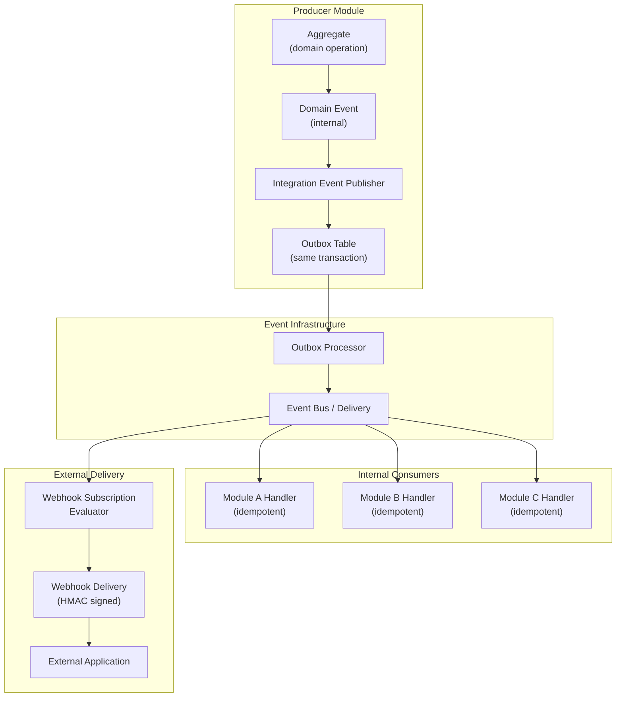
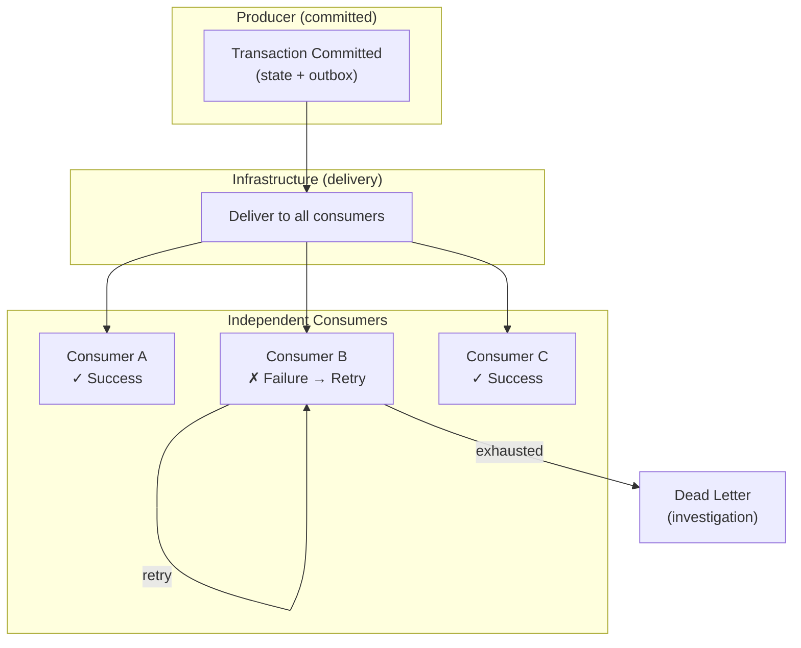

# Integration Event Architecture

## Metadata

| Field | Value |
|-------|-------|
| Title | Kairo Integration Event Architecture |
| Document ID | KAI-EVT-005 |
| Status | Draft |
| Version | 0.1 |
| Target Release | V1 |
| Owner | Integration Event Architecture Lead |
| Created | 2026-07-21 |
| Last Updated | 2026-07-21 |
| Reviewers | TODO |
| Related Documents | [Event Architecture](./Event-Architecture.md), [Event Taxonomy and Ownership](./Event-Taxonomy-and-Ownership.md), [Event Contract Standards](./Event-Contract-Standards.md), [Domain Event Architecture](./Domain-Event-Architecture.md), [Data Ownership](../Data/Data-Ownership.md), [API Surfaces and Boundaries](../API/API-Surfaces-and-Boundaries.md), [Webhook Architecture](../API/Webhook-Architecture.md), [Transaction and Consistency Architecture](../Data/Transaction-and-Consistency-Architecture.md) |
| Dependencies | [Event Architecture](./Event-Architecture.md), [Event Contract Standards](./Event-Contract-Standards.md), [Domain Event Architecture](./Domain-Event-Architecture.md) |

---

## Applicable Version

This document defines V1 integration event architecture. Integration events are the primary mechanism for asynchronous cross-module communication in the Kairo platform. V1 operates in-process within the modular monolith. The architecture is designed so that future distributed delivery requires only infrastructure change — not contract or consumer rewriting.

---

## Purpose

This document defines how integration events communicate business facts across module boundaries. It establishes producer and consumer responsibilities, publication rules, contract stability, payload design, and the relationship between internal cross-module events, cross-product events, and external publication (webhooks).

Integration events are where module autonomy meets system-wide coordination. A well-designed integration event enables loose coupling — the producer publishes a fact, consumers react independently, and neither depends on the other's implementation details. A poorly designed integration event creates hidden coupling, data ownership confusion, and reliability dependencies.

---

## Scope

This document covers:

- Integration event purpose, ownership, and publication boundaries.
- Producer, infrastructure, and consumer responsibilities.
- Internal (cross-module) versus external publication.
- Payload design approaches (reference, snapshot, change).
- Contract stability, consumer onboarding/removal, and replay.
- Failure isolation, reconciliation, and V1 boundaries.
- Future distributed architecture direction.

This document does not cover:

- Internal domain event patterns (see [Domain Event Architecture](./Domain-Event-Architecture.md)).
- Event envelope field definitions (see [Event Contract Standards](./Event-Contract-Standards.md)).
- Webhook delivery mechanics (see [Webhook Architecture](../API/Webhook-Architecture.md)).
- Broker technology selection (infrastructure documentation).
- Specific event type definitions per module (module specifications).

---

## Mandatory Principles

| # | Principle |
|---|-----------|
| 1 | Integration events are explicit published contracts |
| 2 | Producers own event meaning and publication |
| 3 | Consumers own their reactions |
| 4 | Producers must not depend on consumer success for transaction completion unless explicitly designed |
| 5 | Consumers must not assume exclusive delivery |
| 6 | Consumers must tolerate duplicates |
| 7 | Event contracts must avoid leaking producer internals |
| 8 | Cross-module data copies remain derived |
| 9 | A consumer must reconcile when event loss or extended failure is possible |
| 10 | Integration events cannot replace synchronous validation when an immediate decision is required |
| 11 | External publication requires stronger compatibility and security review |
| 12 | Integration events must not become unrestricted data replication |

---

## 1. Integration-Event Purpose

Integration events serve one purpose: communicate business-significant facts across module boundaries so that independent consumers can react.

| What Integration Events DO | What Integration Events DO NOT Do |
|-----------------------------|-----------------------------------|
| Notify other modules that something happened | Request that another module perform an action |
| Enable independent reaction by multiple consumers | Create direct coupling between producer and consumer |
| Support eventual consistency across modules | Provide synchronous validation or immediate decisions |
| Enable extensibility (new consumers without producer changes) | Replicate entire data sets between modules |
| Feed webhook delivery for external notification | Replace APIs for data access |

---

## 2. Producer Ownership

**Producers own event meaning and publication.**

| Responsibility | Detail |
|---------------|--------|
| Defines the event | Producer decides what event types to publish and what they contain |
| Defines the contract | Producer documents the schema, field semantics, and compatibility rules |
| Controls publication | Producer decides when to publish (which domain operations produce events) |
| Maintains stability | Producer follows compatibility rules ([Event Contract Standards](./Event-Contract-Standards.md)) |
| Does not dictate reactions | Producer does not control or prescribe what consumers do with the event |
| Does not depend on consumers | **Producers must not depend on consumer success for transaction completion.** The producing transaction commits regardless of consumer processing. |

---

## 3. Consumer Independence

**Consumers own their reactions.**

| Responsibility | Detail |
|---------------|--------|
| Self-selected subscription | Consumer chooses which events to subscribe to |
| Independent processing | Consumer decides what to do with the event |
| Independent failure | Consumer failure does not affect the producer or other consumers |
| Idempotent | **Consumers must tolerate duplicates.** Processing the same event twice is safe. |
| Not exclusive | **Consumers must not assume exclusive delivery.** Multiple consumers may process the same event. |
| Reconciliation | **A consumer must reconcile when event loss or extended failure is possible.** |
| No mutation of producer data | Consumer reacts within its own domain. Does not directly mutate producer's state. |

---

## 4. Publication Boundaries

**Integration events are explicit published contracts.**

| Rule | Detail |
|------|--------|
| Deliberate publication | Only events explicitly designed for cross-module consumption are published |
| Not automatic | Publishing is a conscious decision, not an automatic promotion of internal domain events |
| Governed | New integration events require architectural review |
| Documented | Every published event type has documented schema, consumers, and purpose |
| Versioned | Published events carry schema version from day one |

---

## 5. Internal Cross-Module Events

| Aspect | Detail |
|--------|--------|
| Definition | Events published by one module and consumed by other modules within the same platform deployment |
| Trust level | High (same process in V1, same team organization, coordinated deployments) |
| Compatibility | Stable with additive evolution. Breaking changes coordinated across affected consumers. |
| Delivery | Via outbox → in-process event bus (V1). Via broker (future). |
| Examples | Order module publishes `order.placed` → Payment module consumes (authorize). Inventory module consumes (reserve). |
| Governance | Architecture review for new events. Consumer registration tracked. |

---

## 6. Cross-Product Events

| Aspect | Detail |
|--------|--------|
| Definition | Events that may flow between Kairo products (when multiple products exist in future) |
| V1 status | N/A — V1 has a single product (Kairo Commerce). Identified for future. |
| Trust level | High but with product boundary respect |
| Compatibility | Stronger stability requirements (products may evolve independently) |
| Future direction | Product-level event contracts with formal versioning and deprecation |

---

## 7. External Integration Events

| Aspect | Detail |
|--------|--------|
| Definition | Events delivered to external systems (partner applications, customer integrations) |
| Mechanism | Outbound webhooks (see [Webhook Architecture](../API/Webhook-Architecture.md)) |
| **Stronger governance** | **External publication requires stronger compatibility and security review** |
| Compatibility | Highest stability. External consumers cannot easily update. Long deprecation. |
| Security | Payload minimized. HMAC signed. No internal details. Classification reviewed. |
| Not identical to internal | External webhook payload may differ from internal integration event (mapped for external safety) |
| Trust level | Low (external consumer). All data is tenant-scoped, signed, and sensitivity-reviewed. |

---

## 8. Event Contract Stability

**Event contracts must avoid leaking producer internals.**

| Rule | Detail |
|------|--------|
| Adding optional fields | Non-breaking. Consumers ignore unknown fields. |
| Removing fields | Breaking. Requires schema version bump and migration period. |
| Changing field semantics | Breaking. Requires new event type or schema version. |
| Adding new event types | Non-breaking for existing consumers (they don't subscribe to new types). |
| Removing event types | Breaking. Requires deprecation notice and migration period. |
| Internal details excluded | Database column names, internal IDs, ORM artifacts never appear in integration events |
| Consumer resilience | Consumers must ignore unknown fields (forward compatibility) |
| Reference | Full rules in [Event Contract Standards](./Event-Contract-Standards.md) |

---

## 9. Payload Design

**Integration events must not become unrestricted data replication.**

| Rule | Detail |
|------|--------|
| Purpose-driven | Include only what consumers need to react (not everything the producer knows) |
| Minimize sensitive data | IDs over PII. Summaries over full details. Consumer fetches via API when full data needed. |
| Not entity replication | Events are not a mechanism to replicate full producer state into every consumer |
| Derived data remains derived | **Cross-module data copies remain derived.** The producer is authoritative. Consumer's copy is a convenience, not a source of truth. |
| Classification applies | Per [Data Classification and Sensitivity](../Data/Data-Classification-and-Sensitivity.md) |

---

## 10. Reference-Only Events

| When Appropriate | Characteristics |
|-----------------|----------------|
| Sensitive resources (customer profiles) | Carries resource ID + event type. Consumer fetches details via authorized API. |
| Large or complex resources | Avoids large event payloads. Consumer requests specific data needed. |
| Consumer needs latest state (not point-in-time) | API always returns current state. Event just signals "something changed." |

| Trade-off | Detail |
|-----------|--------|
| Advantage | Minimal payload. No sensitive data in event. No coupling to producer model. |
| Disadvantage | Consumer must call API (latency, additional load). Requires API availability. |
| V1 suitability | Used for sensitive or large resources where payload minimization is priority. |

---

## 11. Snapshot Events

| When Appropriate | Characteristics |
|-----------------|----------------|
| Consumer needs point-in-time data | Price at order time. Stock level at adjustment time. |
| Small, non-sensitive resources | Payload is manageable and safe. |
| Multiple consumers need same snapshot | Avoids N API calls from N consumers. |

| Trade-off | Detail |
|-----------|--------|
| Advantage | Self-contained. Consumer has data without additional calls. Point-in-time preserved. |
| Disadvantage | Larger payload. May contain data that changes (consumer must not treat as current). |
| V1 suitability | Used for small resources and where point-in-time context is important. |

---

## 12. Change Events

| When Appropriate | Characteristics |
|-----------------|----------------|
| Consumer needs to know what changed (not just current state) | Before/after values. Delta. |
| Audit-style consumption | Compliance records, differential synchronization. |
| Incremental sync | External systems that track changes incrementally. |

| Trade-off | Detail |
|-----------|--------|
| Advantage | Communicates exactly what changed. Enables differential processing. |
| Disadvantage | More complex payload. Consumer must handle missing "before" for new resources. |
| V1 suitability | Limited use. Primarily for audit-adjacent needs. Most consumers prefer snapshot or reference. |

---

## Integration Event Data Flow

---

## 13. Tenant Context

| Rule | Detail |
|------|--------|
| Always explicit | Integration events carry the tenant (organization) ID in the envelope |
| Consumer scoping | Consumers process within the event's tenant context |
| No cross-tenant | A consumer processing one tenant's event must not affect another tenant |
| Store context | Store ID included where event is store-specific |
| Platform events | Platform-level events (not tenant-specific) explicitly documented as such |

---

## 14. Security Classification

| Rule | Detail |
|------|--------|
| Classification in metadata | Event metadata declares the payload's data classification level |
| Payload minimization | Higher classification = less data in payload |
| No secrets | Events never carry tokens, passwords, API keys, or credentials |
| PII minimized | Customer IDs preferred over names/emails in integration events |
| Financial minimized | Order totals acceptable. Full payment card details never. |
| External stricter | Webhook events (external delivery) have stricter data minimization than internal integration events |

---

## 15. Consumer Onboarding

| Rule | Detail |
|------|--------|
| Subscription registration | New consumers register for specific event types (controlled process) |
| Schema review | Consumer reviews the event schema documentation before building a handler |
| Idempotency required | Consumer must implement idempotent processing before going live |
| Testing | Consumer tests with sample events (including duplicates and out-of-order) |
| Monitoring | Consumer establishes processing monitoring (lag, failures, dead-letter) |
| No producer change | Adding a new consumer does not require changes to the producer module |

---

## 16. Consumer Removal

| Rule | Detail |
|------|--------|
| Unsubscribe | Consumer removes its subscription registration |
| No producer change | Removing a consumer does not require changes to the producer module |
| Events continue | Producer continues publishing regardless of consumer count (even zero consumers) |
| Cleanup | Consumer removes its deduplication records and processing state |
| Dead-letter | Events delivered to a removed consumer's dead-letter are cleaned up |

---

## 17. Replay

| Aspect | Detail |
|--------|--------|
| V1 status | No automated replay in V1. Manual replay through operations tooling if needed. |
| Use case | New consumer needs to process historical events. Recovery from extended consumer failure. |
| Direction | V2+: event replay from retained event history for specific consumer or event type |
| Idempotency required | Replay delivers events that may have been processed. Consumer must be idempotent. |
| Not guaranteed | V1 does not retain events beyond outbox processing. Replay requires events to still exist. |
| Reconciliation alternative | If replay is not available, consumer reconciles via producer's API (full state sync) |

---

## 18. Reconciliation

**A consumer must reconcile when event loss or extended failure is possible.**

| Rule | Detail |
|------|--------|
| When needed | Consumer was down for extended period. Dead-letter events were discarded. Event infrastructure failure. |
| Mechanism | Consumer calls producer's API to fetch current state and reconcile its derived data |
| Producer supports | Producer's API must support queries that enable reconciliation (list resources modified since timestamp, or full state export) |
| Consumer responsibility | Consumer designs its data model to support reconciliation (can rebuild from API without replay) |
| Not routine | Reconciliation is a recovery mechanism, not a routine operation. Events handle the normal case. |

---

## 19. Failure Isolation

**Producers must not depend on consumer success for transaction completion.**

| Rule | Detail |
|------|--------|
| Producer transaction commits | The producing module's transaction is committed regardless of consumer processing |
| Consumer failure is independent | One consumer failing does not affect other consumers or the producer |
| No back-pressure to producer | Consumer slowness or failure does not slow or block the producer |
| Dead-letter per consumer | Each consumer has independent dead-letter handling |
| No cascade | A chain of events (A → B → C) does not cascade failure backward. Each step is independent. |
| Producer does not monitor consumers | Producer is not responsible for knowing if consumers have processed successfully |

---

## 20. V1 Boundaries

| Aspect | V1 Approach |
|--------|-------------|
| Scope | Cross-module within a single monolith deployment |
| Delivery | In-process via outbox processor → event bus |
| Ordering | Near-ordered (single processor). Not contractually guaranteed cross-aggregate. |
| Consumers | In-process handlers registered at startup |
| External | Integration events feed webhook delivery infrastructure (outbound) |
| Reconciliation | Via module query APIs (consumer calls producer for full state) |
| Replay | Not automated in V1. Manual operations support. |
| Performance | In-process dispatch. Sub-second delivery typical. |
| Monitoring | Structured logging. Consumer lag metrics. Dead-letter alerting. |

**Integration events cannot replace synchronous validation when an immediate decision is required.**

| Use API (synchronous) | Use Integration Event (asynchronous) |
|----------------------|--------------------------------------|
| "Is this product in stock?" (need answer NOW for checkout) | "Inventory was adjusted" (consumers update their view eventually) |
| "Is this customer valid?" (need answer NOW for order) | "Customer registered" (modules update their references eventually) |
| "Calculate shipping cost" (need answer NOW for cart display) | "Order shipped" (modules react to fulfillment fact) |

---

## 21. Future Distributed Architecture

| Aspect | Future Direction |
|--------|-----------------|
| Delivery | External message broker replaces in-process bus |
| Consumers | May run in separate processes/services |
| Ordering | Broker-level partitioning by aggregate/resource |
| Scaling | Independent consumer scaling (competing consumers for throughput) |
| Security | Cross-service authentication for event delivery |
| Contract | **Unchanged.** Same event contracts, same semantics, different delivery infrastructure. |
| Reconciliation | Enhanced: event replay from broker retention |
| Migration | Outbox processor publishes to broker. Consumers read from broker. Gradual transition. |

---

## Responsibility Matrices

### Producer Responsibility Matrix

| Responsibility | Detail | Timing |
|---------------|--------|--------|
| Define event types | Choose what to publish and what it means | Design time |
| Define contract | Document schema, fields, semantics, version | Design time |
| Validate before publication | Ensure event conforms to schema | Runtime |
| Publish atomically | Write to outbox in same transaction as state change | Runtime |
| Maintain compatibility | Follow additive evolution rules | Ongoing |
| Deprecate with notice | Announce deprecation. Provide migration period. | Lifecycle |
| Support reconciliation | Provide APIs that consumers can use to rebuild state | Design time |
| Not monitor consumers | Producer does not track consumer success/failure | Always |

### Infrastructure Responsibility Matrix

| Responsibility | Detail | Timing |
|---------------|--------|--------|
| Read committed events | Process outbox entries after transaction commit | Runtime |
| Route to consumers | Deliver events to all registered consumer handlers | Runtime |
| Retry on failure | Retry failed consumer deliveries with backoff | Runtime |
| Dead-letter | Move permanently failing events to dead-letter | Runtime |
| Preserve ordering (best-effort) | Per-aggregate ordering where feasible | Runtime |
| Monitor health | Track lag, failure rates, dead-letter accumulation | Operational |
| Not interpret meaning | Infrastructure routes. Does not assign business semantics. | Always |
| Feed webhook evaluation | Pass events to webhook subscription evaluator | Runtime |

### Consumer Responsibility Matrix

| Responsibility | Detail | Timing |
|---------------|--------|--------|
| Subscribe deliberately | Register for specific event types (not all) | Design time |
| Implement idempotency | Handle duplicate delivery without duplicate effects | Design time |
| Handle unknowns | Ignore unknown event fields. Handle unknown event types gracefully. | Design time |
| Own reaction logic | Decide independently what to do with the event | Design time |
| Monitor processing | Track own lag, failures, and dead-letter | Operational |
| Reconcile on failure | If extended failure, reconcile via producer API | Recovery |
| Not mutate producer data | Consumer modifies its own state only | Always |
| Not assume exclusivity | Multiple consumers may process same event | Always |

---

## Internal versus External Publication Matrix

| Aspect | Internal (cross-module) | External (webhook) |
|--------|------------------------|-------------------|
| Trust level | High (same deployment, same team) | Low (external internet) |
| Compatibility | Stable. Additive. Coordinated breaking changes. | Highest. Versioned. Long deprecation (12+ months). |
| Payload sensitivity | Minimized but may include internal references | Strictly minimized. No internal details. HMAC signed. |
| Consumer onboarding | Internal: registration at startup | External: subscription management API |
| Consumer failure | Retry. Dead-letter. No producer impact. | Retry. Exponential backoff. Suspension. |
| Security review | Standard architecture review | **Elevated.** Security team reviews payload and delivery. |
| Governance | New event type requires arch review | New external event requires arch + security review |
| Reconciliation | Consumer calls producer API | External: consumer uses public API with their credentials |
| Delivery guarantee | At-least-once (in-process V1) | At-least-once (HTTP with retry and signing) |
| Ordering | Best-effort per-aggregate | Best-effort chronological |

---

## V1 versus Future Capabilities Matrix

| Capability | V1 | V2+ |
|-----------|:---:|:---:|
| Cross-module integration events | Yes | Yes |
| Outbox-based publication | Yes | Yes |
| In-process delivery | Yes | Transitioning to broker |
| Consumer idempotency | Yes | Yes |
| Dead-letter handling | Yes | Enhanced |
| Webhook event delivery | Yes | Yes |
| Event replay | No (manual only) | Automated per-consumer |
| Competing consumers | No (single handler) | Yes (throughput scaling) |
| Cross-service delivery | No (in-process) | Yes (via broker) |
| Schema registry | No (documentation-based) | Yes (formal registry) |
| Event catalog API | No (docs in repo) | Yes (queryable catalog) |
| Cross-product events | No (single product) | Evaluated when needed |
| Consumer lag dashboard | Basic (logs/metrics) | Dedicated dashboard |
| Reconciliation support | Via producer API | API + event replay |

---

## Version Gate

| Version | Integration Event Architecture Gate |
|---------|-------------------------------------|
| V1 | Integration events published via outbox for cross-module facts. In-process delivery to consumer handlers. Consumer idempotency mandatory. Dead-letter for failed consumption. Hybrid payloads (key fields + reference). Tenant context in all events. Event schema versioned. Webhook delivery triggered from integration events. Reconciliation via producer APIs. Failure isolation (producer independent of consumers). |
| V2 | External broker deployed. Consumer lag monitoring dashboard. Event replay for recovery. Schema registry operational. Event catalog published. Enhanced dead-letter management. Competing consumers for scaling. |
| V3 | Cross-service event delivery. Cross-product event contracts. Complex event processing. Real-time event streaming for external consumers. Saga orchestration through integration events. |

---

## Decision Summary

| Decision | Rationale |
|----------|-----------|
| Producer does not depend on consumer success | Decoupling. Producer's transaction integrity must not be held hostage by consumer availability or correctness. |
| Consumers must reconcile after extended failure | Events may be lost (dead-letter discarded, infrastructure failure). Consumers must have a recovery path. |
| Integration events are not data replication | Full entity replication creates ownership confusion, staleness, and coupling. Events signal facts; consumers fetch what they need. |
| Synchronous decisions remain synchronous | If you need an answer now (stock check, price calculation), use the API. Events are for after-the-fact notification. |
| External publication is elevated governance | External consumers cannot easily update. Breaking them has business relationship impact. Stronger review justified. |
| Hybrid payload as default | Practical balance. Consumer has enough to route and decide. Fetches full data via API when needed. |
| Failure isolation by design | One consumer's problems must never cascade to producers or other consumers. Independence is architectural. |
| Infrastructure does not own meaning | The event bus delivers. It does not define "what is an order." Business semantics belong to the producing domain. |

---

## Alternatives Considered

| Alternative | Rejected Because |
|------------|-----------------|
| Producer waits for consumer acknowledgment | Creates coupling. Producer's transaction speed depends on slowest consumer. Unacceptable for latency and reliability. |
| Full entity replication via events | Causes ownership confusion. Consumer's copy becomes stale. Creates N copies of truth instead of one. |
| Events for synchronous validation | Wrong tool. If checkout needs to know stock level NOW, query the API. Event delivery lag makes this unreliable. |
| No reconciliation mechanism | Extended failures happen. Without reconciliation, consumer state drifts permanently. Unacceptable for business data. |
| Same governance for internal and external | External consumers face higher switching cost. Stronger governance for external is proportionate to impact. |
| Global ordering across all events | Impossible to guarantee efficiently at scale. Per-aggregate ordering is achievable and sufficient. |
| No dead-letter (infinite retry) | Poison messages would be retried forever. Dead-letter + investigation is the correct pattern. |
| Consumer defines producer contract | Reverse coupling. Producer cannot evolve internally if consumers dictate the contract. |

---

## Architecture Impact

| Concern | Impact |
|---------|--------|
| Module design | Modules must define their published integration events (separate from internal domain events). Must support reconciliation queries. |
| Cross-module coordination | Modules react to each other through integration events. No direct cross-module state mutation. |
| Webhook integration | Integration events feed webhook subscription evaluation. External delivery is derived from internal events. |
| Data ownership | Producer remains authoritative. Consumer's event-derived data is always derived (per [Data Ownership](../Data/Data-Ownership.md)). |
| Failure isolation | Architecture ensures no cascading failure from consumer to producer or between consumers. |
| Reconciliation | Producers must provide APIs that support consumer reconciliation (resource listing with modification timestamps). |

---

## Implementation Impact

| Area | Impact |
|------|--------|
| Modules | Must define and publish integration events. Must implement domain → integration event transformation. Must support reconciliation APIs. Must not depend on consumer processing. |
| Platform | Must provide outbox processing, event delivery, retry, and dead-letter infrastructure. Must route events to webhook evaluator. Must provide consumer registration. |
| Consumers | Must implement idempotent handlers. Must implement reconciliation capability. Must monitor own processing health. Must handle duplicates and unknown fields. |
| Operations | Must monitor event delivery health (lag, failures, dead-letter). Must investigate dead-letter events. Must support manual replay when needed. |
| Testing | Must test producer publishes correct events. Must test consumer idempotency. Must test failure isolation. Must test reconciliation works. |

---

## Security Responsibilities

| Role | Integration Event Responsibilities |
|------|----------------------------------|
| Integration Event Architecture Lead | Defines integration event patterns. Reviews new event types. Governs publication boundaries. |
| Module Teams (Producers) | Define and publish events. Maintain contract stability. Support reconciliation. Minimize payload sensitivity. |
| Module Teams (Consumers) | Implement idempotent handlers. Reconcile after failures. Not mutate producer data. |
| Platform Team | Provides event infrastructure. Manages delivery and retry. Routes to webhook evaluator. Dead-letter management. |
| Security Team | Reviews external event payloads. Validates data classification. Reviews webhook payload safety. |

---

## Multi-Tenancy Responsibilities

| Responsibility | Detail |
|---------------|--------|
| Tenant ID in every business event | Integration events carry explicit organization ID |
| Consumer scoped processing | Consumers process within the event's tenant boundary |
| No cross-tenant leakage | Event delivery does not mix tenants |
| External events tenant-scoped | Webhook delivery only to the owning organization's subscriptions |
| Fair processing | Multi-tenant consumer processing uses fair scheduling (no tenant monopolization) |

---

## Out of Scope

This document does not define:

- Internal domain event patterns (see [Domain Event Architecture](./Domain-Event-Architecture.md)).
- Event envelope field definitions (see [Event Contract Standards](./Event-Contract-Standards.md)).
- Webhook delivery mechanics (see [Webhook Architecture](../API/Webhook-Architecture.md)).
- Broker technology selection (infrastructure documentation).
- Specific event type definitions (module specifications).
- Consumer handler implementation (development standards).
- Reconciliation API designs (module specifications).

---

## Future Considerations

- **Event replay** — Automated replay from event store for consumer recovery.
- **Competing consumers** — Multiple handler instances for throughput scaling.
- **Event streaming for external** — Real-time event access for partners (beyond webhooks).
- **Cross-product events** — Formal contracts between Kairo products (when multiple products exist).
- **Schema registry** — Automated compatibility checking on schema changes.
- **Consumer health dashboard** — Visibility into consumer lag and processing status.
- **Event-driven projections** — Read models built entirely from integration event streams.
- **Saga orchestration** — Multi-module workflows coordinated through integration events.

---

## Future Refactoring Triggers

This document should be revisited when:

- External broker is deployed (trigger for delivery mechanism update).
- Consumer scaling needs exceed single-handler capacity (trigger for competing consumers).
- Multiple Kairo products exist (trigger for cross-product event contracts).
- External partners need real-time events beyond webhooks (trigger for event streaming API).
- Reconciliation becomes too expensive via API (trigger for event replay infrastructure).
- Event-driven read models are needed at scale (trigger for projection architecture).
- Multi-step workflows become common (trigger for saga/orchestration patterns).

---

## Change History

| Version | Date | Author | Description |
|---------|------|--------|-------------|
| 0.1 | 2026-07-21 | Integration Event Architecture Lead | Initial draft — integration event architecture |
