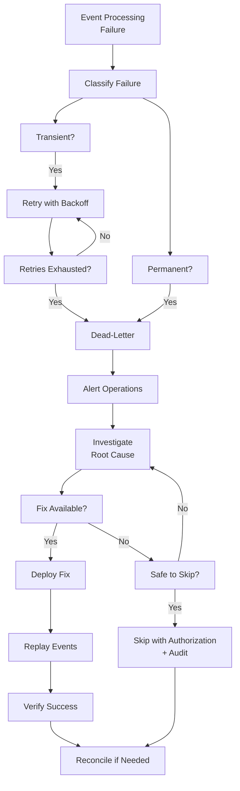
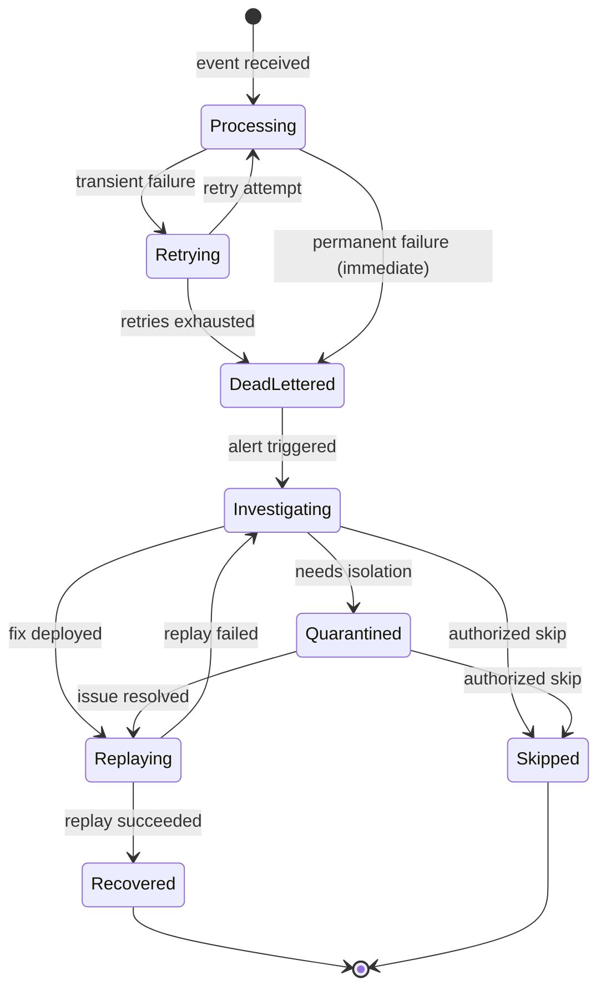

# Retry, Dead-Letter, and Recovery

## Metadata

| Field | Value |
|-------|-------|
| Title | Kairo Event Retry, Dead-Letter, Quarantine, and Recovery Architecture |
| Document ID | KAI-EVT-009 |
| Status | Draft |
| Version | 0.1 |
| Target Release | V1 |
| Owner | Event Failure Recovery and Resilience Architect |
| Created | 2026-07-22 |
| Last Updated | 2026-07-22 |
| Reviewers | TODO |
| Related Documents | [Event Architecture](./Event-Architecture.md), [Event Consumption and Inbox](./Event-Consumption-and-Inbox.md), [Delivery, Ordering, and Consistency](./Delivery-Ordering-and-Consistency.md), [Incident Response](../Security/Incident-Response.md), [Audit and Security Monitoring](../Security/Audit-and-Security-Monitoring.md), [Idempotency, Concurrency, and Retries](../API/Idempotency-Concurrency-and-Retries.md) |
| Dependencies | [Event Architecture](./Event-Architecture.md), [Event Consumption and Inbox](./Event-Consumption-and-Inbox.md) |

---

## Applicable Version

This document defines V1 event failure handling, retry, dead-letter, and recovery architecture. V1 provides bounded retry with exponential backoff, dead-letter table storage, manual investigation, and controlled replay — sufficient for a modular monolith. Advanced automation (self-healing, automated triage) is future.

---

## Purpose

This document defines how the Kairo platform handles event processing failures — from initial transient errors through permanent failures, dead-lettering, investigation, correction, and recovery. It establishes that not all failures are equal: some should be retried, some should be investigated, some should be skipped, and all should be observable.

Event processing failures are inevitable. Infrastructure goes down. Consumers have bugs. Events arrive with unexpected data. This document ensures that every failure has a defined path — retry, dead-letter, investigate, correct, replay, or skip — and that none of these paths silently loses business data or creates duplicate effects.

---

## Scope

This document covers:

- Failure categories and their distinct handling requirements.
- Retry eligibility, delay, backoff, and limits.
- Dead-letter handling, quarantine, and investigation.
- Correction, replay, skip, and manual recovery.
- Alerting, ownership, audit, and retention.
- V1 capabilities and future operational maturity.

This document does not cover:

- Dead-letter queue/topic broker configuration (infrastructure documentation).
- Consumer handler implementation code (development standards).
- Incident response procedures (see [Incident Response](../Security/Incident-Response.md)).
- API-level retry semantics (see [Idempotency, Concurrency, and Retries](../API/Idempotency-Concurrency-and-Retries.md)).
- Event contract format (see [Event Contract Standards](./Event-Contract-Standards.md)).

---

## Mandatory Principles

| # | Principle |
|---|-----------|
| 1 | Not every failure should be retried |
| 2 | Validation and compatibility failures require investigation rather than endless retry |
| 3 | Authorization and tenant failures must fail safely |
| 4 | Retries must not create duplicate business effects |
| 5 | Dead-lettering does not resolve the business failure |
| 6 | Poison events must be isolated |
| 7 | Manual replay requires authorization and audit |
| 8 | Corrected events must preserve traceability |
| 9 | Original event content must not be silently rewritten without evidence |
| 10 | Recovery must consider downstream side effects |
| 11 | Critical financial and inventory failures require reconciliation |
| 12 | Dead-letter records may contain sensitive data and require protection |

---

## Failure Categories

### 1. Failure Categories Overview

| Category | Retryable | Typical Cause | Resolution Path |
|----------|:---------:|---------------|-----------------|
| Transient | Yes | Infrastructure instability | Automatic retry with backoff |
| Permanent | No | Logic error, invalid data | Investigation and correction |
| Validation | No | Malformed event, missing fields | Investigation (producer or consumer bug) |
| Compatibility | No | Schema version mismatch | Consumer or producer update required |
| Authorization | No | Consumer lacks required permissions | Configuration fix |
| Tenant-context | No | Invalid or deleted tenant | Skip (with audit) or defer |
| Dependency | Yes | Downstream service/module unavailable | Retry with backoff |
| Consumer defect | No | Bug in handler code | Code fix and replay |
| Poison | No | Event that consistently crashes handler | Isolate and investigate |

---

### 2. Transient Failures

| Aspect | Detail |
|--------|--------|
| Definition | Temporary infrastructure-level failures that resolve without intervention |
| Examples | Database connection timeout, temporary network failure, lock contention, resource pool exhaustion |
| Retry | **Yes** — automatic retry with exponential backoff |
| Expected | Transient failures are a normal operational reality, not exceptional |
| Resolution | Self-resolving. Retry succeeds after infrastructure recovers. |
| Frequency | Common during deployments, scaling events, and infrastructure maintenance |

---

### 3. Permanent Failures

| Aspect | Detail |
|--------|--------|
| Definition | Failures that will not resolve with retry — the same input will fail identically every time |
| Examples | Business rule violation, referenced resource permanently deleted, data integrity error |
| Retry | **No** — retrying wastes resources and delays investigation |
| Resolution | Requires human investigation. May need data correction, event skip, or code fix. |
| Detection | Same event fails consistently across all retry attempts |
| Action | Dead-letter after retry exhaustion. Alert for investigation. |

---

### 4. Validation Failures

**Validation and compatibility failures require investigation rather than endless retry.**

| Aspect | Detail |
|--------|--------|
| Definition | Event does not conform to the expected contract (missing required fields, wrong types, malformed payload) |
| Cause | Producer bug, event corruption, version mismatch |
| Retry | **No** — a malformed event will be malformed on every retry |
| Resolution | Investigate root cause. Fix producer or consumer. Replay corrected event if needed. |
| Immediate action | Dead-letter immediately (no retry). Alert. |

---

### 5. Compatibility Failures

| Aspect | Detail |
|--------|--------|
| Definition | Consumer cannot process the event's schema version |
| Cause | Consumer has not been updated for a new event version. Or event was published with an old version the consumer no longer supports. |
| Retry | **No** — version mismatch does not resolve with retry |
| Resolution | Update consumer to handle the version. Or replay with compatible version. |
| Prevention | Schema versioning and consumer forward-compatibility (ignore unknown fields) minimize this |

---

### 6. Authorization Failures

**Authorization and tenant failures must fail safely.**

| Aspect | Detail |
|--------|--------|
| Definition | Consumer lacks required permissions to perform its reaction (e.g., cannot write to a resource, cannot call a downstream API) |
| Cause | Configuration error, permission revocation, deployment issue |
| Retry | **No** — permissions do not self-restore. Requires configuration fix. |
| Resolution | Fix authorization configuration. Replay after fix. |
| Safety | **Fail safely.** Do not partially process. Do not escalate privileges. Dead-letter and alert. |

---

### 7. Tenant-Context Failures

| Aspect | Detail |
|--------|--------|
| Definition | Event references a tenant that is invalid, suspended, or deleted |
| Cause | Tenant was deleted/suspended after event was produced but before consumer processed it |
| Retry | **No** — tenant state does not self-restore |
| Resolution | **Deleted tenant**: skip event (with audit log). **Suspended tenant**: defer or skip per policy. |
| Safety | **Fail safely.** Do not process business logic for an invalid tenant. Do not leak error details. |

---

### 8. Dependency Failures

| Aspect | Detail |
|--------|--------|
| Definition | Consumer's processing depends on another module or service that is temporarily unavailable |
| Examples | Called module's API returns 503, database read-replica lag, cache unavailable |
| Retry | **Yes** — dependency may recover. Exponential backoff. |
| Resolution | Self-resolving when dependency recovers. Dead-letter if dependency outage exceeds retry window. |
| Distinct from transient | Transient is infrastructure-level (connection). Dependency is application-level (module unavailable). Both are retryable. |

---

### 9. Consumer Defects

| Aspect | Detail |
|--------|--------|
| Definition | Bug in the consumer handler code (null reference, logic error, unhandled edge case) |
| Retry | **No** — same code will fail the same way every time |
| Detection | Consistent failure with identical stack trace across retries |
| Resolution | Fix the code. Deploy fix. Replay dead-lettered events. |
| Impact | May block processing of the specific event type until fix is deployed |

---

### 10. Poison Events

**Poison events must be isolated.**

| Aspect | Detail |
|--------|--------|
| Definition | A specific event instance that consistently crashes or fails the handler regardless of retry |
| Distinction from consumer defect | A consumer defect fails ALL events of a type. A poison event fails ONE specific event (unusual data, edge case). |
| Detection | Same event ID fails N consecutive times. Other events of the same type succeed. |
| Isolation | Move to dead-letter after retry exhaustion. Other events continue processing. |
| Resolution | Investigate the specific event's data. Fix handler or skip event. |
| **Must not block** | A single poison event must never block processing of unrelated events |

---

## Retry Architecture

### 11. Retry Eligibility

**Not every failure should be retried.**

| Failure Type | Retry? | Rationale |
|-------------|:------:|-----------|
| Transient (connection, timeout) | **Yes** | Will resolve when infrastructure recovers |
| Dependency (module unavailable) | **Yes** | Will resolve when dependency recovers |
| Validation (malformed event) | **No** | Same data will fail identically |
| Compatibility (version mismatch) | **No** | Version will not change between retries |
| Authorization (permission denied) | **No** | Permissions will not change between retries |
| Tenant-context (invalid tenant) | **No** | Tenant state will not change between retries |
| Consumer defect (code bug) | **No** | Same code will fail the same way |
| Poison event (specific event data) | **Limited** | Retry N times to distinguish from transient. Dead-letter on exhaustion. |

---

### 12. Retry Delay

| Rule | Detail |
|------|--------|
| Not immediate | First retry is not immediate (avoids hammering a recovering service) |
| Minimum delay | First retry waits a configurable minimum (e.g., 1-5 seconds) |
| Increasing | Each subsequent retry waits longer |
| Maximum delay | Cap on maximum delay between retries (e.g., 5 minutes) |
| Configurable | Delay parameters are configurable per consumer or event type |

---

### 13. Backoff

| Rule | Detail |
|------|--------|
| Exponential | Delay doubles with each attempt: base × 2^attempt |
| Jitter | Random jitter added to prevent thundering herd (all retries firing simultaneously) |
| Example progression | 2s → 4s → 8s → 16s → 32s → 64s → 128s → cap at 300s |
| Respects cap | Delay never exceeds the configured maximum |
| Observable | Each retry attempt logs the delay and attempt number |

---

### 14. Retry Limits

| Rule | Detail |
|------|--------|
| Bounded | Maximum retry count per event (e.g., 5-10 attempts) |
| Total window | Maximum total time spent retrying (e.g., 30 minutes to 2 hours) |
| Either limit | Whichever limit is reached first (count or time) terminates retries |
| After exhaustion | Event moves to dead-letter. Alert triggered. |
| Not infinite | Infinite retry masks problems and wastes resources |
| **Idempotent** | **Retries must not create duplicate business effects** (consumer idempotency per [Event Consumption and Inbox](./Event-Consumption-and-Inbox.md)) |

---

## Dead-Letter Architecture

### 15. Dead-Letter Handling

**Dead-lettering does not resolve the business failure.**

| Rule | Detail |
|------|--------|
| Purpose | Preserve failed events for investigation and potential recovery |
| Not resolution | Moving to dead-letter stops retrying. It does not fix the underlying problem. |
| Contains | Full event envelope, failure reason, retry history, consumer identity, timestamp |
| Per-consumer | Each consumer has its own dead-letter scope (failure in Consumer A does not affect Consumer B) |
| Observable | Dead-letter count is a monitored metric with alerting |
| Accessible | Dead-letter contents are accessible to authorized operators for investigation |

---

### 16. Quarantine

| Rule | Detail |
|------|--------|
| Definition | Temporary isolation of a problematic event or event type while investigation proceeds |
| Scope | May quarantine: a specific event, all events of a type, or all events from a specific producer |
| Effect | Quarantined events are held. Not processed. Not discarded. Not retried. |
| Controlled | Quarantine is an explicit operational action, not automatic |
| Release | After resolution, quarantined events are released for processing or permanently skipped |
| Duration | Quarantine has a defined review window. Events are not quarantined indefinitely without review. |

---

### 17. Investigation

| Step | Detail |
|------|--------|
| 1. Alert received | Dead-letter alert triggers investigation |
| 2. Identify pattern | Single event (poison)? All events of a type (consumer defect)? All events (infrastructure)? |
| 3. Examine event | Review event payload, metadata, and failure reason |
| 4. Identify root cause | Producer bug, consumer bug, data issue, configuration problem, or infrastructure failure |
| 5. Determine resolution | Fix code, fix configuration, correct data, skip event, or reconcile |
| 6. Execute resolution | Deploy fix, replay events, or skip with authorization |
| 7. Verify | Confirm processing succeeds. Monitor for recurrence. |
| 8. Document | Record root cause and resolution in incident record |

---

### 18. Correction

**Corrected events must preserve traceability.**
**Original event content must not be silently rewritten without evidence.**

| Rule | Detail |
|------|--------|
| No silent rewrite | The original event in dead-letter is preserved. Never modified. |
| New event if needed | If a corrected version is needed, a new event is created (new event ID) with a reference to the original |
| Traceability | The corrected event links to the original dead-lettered event |
| Authorization | Corrections require authorization (not any operator) |
| Audit | Every correction is audit-logged (who, what, why, when) |
| Evidence chain | Original event → correction decision → corrected event → processing result |

---

### 19. Replay

**Manual replay requires authorization and audit.**

| Rule | Detail |
|------|--------|
| Definition | Re-delivering a dead-lettered event to its consumer for reprocessing |
| Prerequisites | Root cause must be fixed before replay (otherwise the event will fail again) |
| Authorization | Replay requires explicit authorization from the consumer module owner or operations |
| Audit | Every replay is audit-logged (who authorized, what events, when) |
| Idempotency | Consumer must handle replay correctly (deduplication prevents double processing if partially processed) |
| Scope | Replay can target: specific events, event type, time range, or tenant |
| Current rules | **Replaying events must not bypass current authorization, tenant, or compatibility rules** |
| Observable | Replay progress and results are monitored |

---

### 20. Skip Decisions

| Rule | Detail |
|------|--------|
| When appropriate | Event is permanently unprocessable AND the business impact of skipping is acceptable |
| Examples | Event for deleted tenant. Event for permanently removed resource. Superseded by newer event. |
| Authorization | Skip requires explicit authorization from the consumer module owner |
| Audit | Every skip is audit-logged (who authorized, what event, why skipped) |
| Not routine | Skip is an exception, not a routine resolution. Frequent skips indicate a systematic problem. |
| Impact assessment | Before skipping, assess: will skipping create inconsistency that requires reconciliation? |
| **Recovery must consider downstream side effects** | If skipping an event means downstream consumers also miss information, this must be assessed |

---

### 21. Manual Recovery

| Scenario | Recovery Path |
|----------|-------------|
| Consumer bug fixed | Deploy fix → replay dead-lettered events → verify success |
| Configuration fixed | Update configuration → replay dead-lettered events → verify success |
| Data corrected | Correct source data → replay original event or create corrected event → verify |
| Event permanently unprocessable | Assess business impact → skip with authorization → reconcile if needed |
| Extended outage resolved | Consumer catches up from backlog → verify completeness → reconcile gaps |

| Rule | Detail |
|------|--------|
| Authorized | Manual recovery operations require authorization |
| Audited | All recovery actions are audit-logged |
| Verified | Recovery is verified (processing succeeded, state is correct) |
| Reconciled | If recovery may have missed events, reconciliation is performed |

---

### 22. Automated Recovery

| Capability | V1 | Future |
|-----------|:---:|:------:|
| Automatic retry (transient) | Yes | Yes |
| Automatic dead-lettering (exhausted retries) | Yes | Yes |
| Automatic alerting on dead-letter | Yes | Yes |
| Automatic classification (transient vs permanent) | Limited (by exception type) | Enhanced (ML-based) |
| Automatic replay after fix deployment | No | Evaluated |
| Self-healing (automatic correction) | No | Evaluated for specific patterns |
| Automatic reconciliation on gap detection | No | V2+ |

---

### 23. Data Reconciliation

**Critical financial and inventory failures require reconciliation.**

| Rule | Detail |
|------|--------|
| When required | Dead-lettered events involve financial operations (payments, refunds) or inventory operations (reservations, adjustments) |
| Mechanism | Consumer reconciles its state against producer's authoritative API |
| Financial | Payment consumer reconciles with payment module. Inventory consumer reconciles with inventory module. |
| External | If external providers are involved (payment gateway), reconciliation extends to provider API |
| Timing | Immediately after recovery. Not deferred. |
| Verification | Reconciliation results are verified (do the numbers match?) |
| Audit | Reconciliation results are audit-logged |

---

## Recovery Decision Flow

---

## Recovery Lifecycle

---

## Alerting

### 24. Alerting

| Alert | Severity | Trigger | Response |
|-------|----------|---------|----------|
| Dead-letter event created | High | Any event moves to dead-letter | Investigate within SLA |
| Dead-letter count rising | High | Multiple events dead-lettering in short window | Investigate for systemic issue |
| Financial event dead-lettered | Critical | Payment or refund event in dead-letter | Immediate investigation. Reconciliation required. |
| Inventory event dead-lettered | Critical | Inventory adjustment in dead-letter | Investigate. Stock may be inconsistent. |
| Consumer not processing | Critical | Consumer has stopped processing all events | Check consumer health. May need restart. |
| Retry rate elevated | Warning | Higher-than-normal retry percentage | Infrastructure may be degrading |
| Dead-letter age exceeding threshold | Warning | Dead-lettered events not investigated within SLA | Escalate to module owner |
| Poison event detected | High | Same event fails across all retries while others succeed | Isolate and investigate specific event |

---

## Ownership

### 25. Ownership

| Role | Responsibility |
|------|---------------|
| Consumer module owner | Owns their consumer's dead-letter investigation. Decides fix, replay, or skip. |
| Producer module owner | Consulted when dead-letter indicates a producer issue (malformed events). Owns event correction. |
| Platform team | Owns dead-letter infrastructure. Provides tooling for investigation, replay, skip. Monitors system-wide health. |
| Operations | First responder on dead-letter alerts. Escalates to module owner. Executes authorized replays. |
| Security team | Consulted on authorization and tenant-context failures. Reviews dead-letter access controls. |

---

## Audit

### 26. Audit

| Event | Audit Record |
|-------|-------------|
| Event dead-lettered | Event ID, consumer, failure reason, retry history, timestamp |
| Event quarantined | Event ID/type, operator, reason, timestamp |
| Quarantine released | Event ID/type, operator, action (replay or skip), timestamp |
| Event replayed | Event ID, operator, authorization, timestamp, result |
| Event skipped | Event ID, operator, authorization, reason, timestamp |
| Event corrected | Original event ID, corrected event ID, operator, changes, reason |
| Reconciliation triggered | Scope, operator, reason, timestamp |
| Reconciliation completed | Scope, result (matched/discrepancies), timestamp |

---

## Retention

### 27. Retention

**Dead-letter records may contain sensitive data and require protection.**

| Record Type | Retention | Notes |
|------------|-----------|-------|
| Dead-letter (active) | Until resolved (replayed, skipped, or corrected) | Not auto-deleted while unresolved |
| Dead-letter (resolved) | Short-term after resolution (e.g., 7-30 days) | Kept briefly for post-mortem, then cleaned |
| Quarantined events | Until released or permanently resolved | Not auto-deleted |
| Audit records (recovery actions) | Per standard audit retention (long-term) | Recovery actions are audit events |
| Retry logs | Short-term (days) | Operational logs, not permanent |

| Security Rule | Detail |
|---------------|--------|
| Classification | Dead-letter records inherit the classification of the event payload they contain |
| Access control | Dead-letter access restricted to authorized operators and module owners |
| Encryption | Dead-letter records follow the same at-rest encryption as all persistent data |
| No public exposure | Dead-letter contents are never exposed through public APIs |
| Sensitive masking | Investigation tooling masks sensitive fields per classification rules |

---

## V1 and Future

### 28. V1 Capabilities

| Capability | V1 Approach |
|-----------|-------------|
| Retry | Bounded retry with exponential backoff and jitter (in-process) |
| Dead-letter | Dead-letter table in consumer's database |
| Alerting | Dead-letter count metrics + alerting rules (Prometheus/Grafana) |
| Investigation | Manual — query dead-letter table, examine event data, review logs |
| Replay | Manual — operations tool resets dead-letter records for reprocessing |
| Skip | Manual — authorized operator marks event as skipped (audit-logged) |
| Quarantine | Manual — operator pauses specific event type processing |
| Correction | Manual — create corrected event referencing original |
| Reconciliation | Manual — consumer calls producer API to rebuild state |
| Classification | Basic — exception type determines retry eligibility |
| Automation | Retry is automatic. Everything else is manual. |

---

### 29. Future Operational Maturity

| Capability | Future Direction |
|-----------|-----------------|
| Self-service investigation UI | Web-based dead-letter browser for module owners |
| Automated replay after deployment | Detect fix deployment → replay affected dead-letter events automatically |
| Failure classification ML | Machine-learning classification of failures (transient vs permanent) |
| Automated reconciliation triggers | Gap detection → automatic reconciliation initiation |
| Dead-letter analytics | Patterns, trends, and root-cause aggregation across dead-letter events |
| Self-healing for known patterns | Predefined correction rules for known failure patterns |
| Cross-module dead-letter correlation | Identify failures that affect multiple consumers of the same event |
| SLA tracking | Dead-letter investigation and resolution SLA monitoring |

---

## Failure Classification Matrix

| Failure Category | Retryable | Max Retries | Dead-Letter Action | Investigation Owner | Resolution Path |
|-----------------|:---------:|:-----------:|--------------------|--------------------|-----------------|
| Transient (infrastructure) | Yes | 5-10 | After exhaustion | Operations → Platform | Self-resolving or infrastructure fix |
| Dependency (module unavailable) | Yes | 5-10 | After exhaustion | Operations → Module owner | Dependency recovery |
| Validation (malformed event) | No | 0 | Immediate | Producer module owner | Producer fix → corrected event |
| Compatibility (version mismatch) | No | 0 | Immediate | Consumer module owner | Consumer update → replay |
| Authorization (permission denied) | No | 0 | Immediate | Operations → Security | Configuration fix → replay |
| Tenant-context (invalid tenant) | No | 0 | Immediate | Operations | Skip (deleted) or defer (suspended) |
| Consumer defect (code bug) | No | 0-1 | After detection | Consumer module owner | Code fix → replay |
| Poison event (bad data) | Limited | 3-5 | After exhaustion | Consumer module owner | Data investigation → replay or skip |

---

## Retryability Matrix

| Signal | Retry Decision |
|--------|---------------|
| HTTP 5xx from dependency | Retry with backoff |
| Database connection timeout | Retry with backoff |
| Lock contention / deadlock | Retry with short backoff |
| Network unreachable | Retry with backoff |
| Null reference in handler | Do NOT retry (code bug) |
| Missing required event field | Do NOT retry (validation) |
| Unknown event version | Do NOT retry (compatibility) |
| Forbidden from downstream API | Do NOT retry (authorization) |
| Tenant not found | Do NOT retry (tenant context) |
| Business rule violation | Do NOT retry (permanent) |
| Out of memory | Retry once (may be transient). Dead-letter if recurs. |
| Serialization error | Do NOT retry (event data problem) |

---

## Operational Ownership Matrix

| Responsibility | Operations | Consumer Owner | Producer Owner | Platform Team | Security |
|---------------|:---:|:---:|:---:|:---:|:---:|
| First alert response | **Primary** | Informed | — | Informed | — |
| Failure classification | **Primary** | Consulted | — | Consulted | — |
| Investigation (consumer issue) | Assisted | **Primary** | — | — | — |
| Investigation (producer issue) | — | Informed | **Primary** | — | — |
| Investigation (infrastructure) | Assisted | — | — | **Primary** | — |
| Investigation (security/auth) | — | Informed | — | — | **Primary** |
| Code fix | — | **Primary** | **Primary** | **Primary** | — |
| Replay authorization | **Primary** | **Approver** | — | — | — |
| Skip authorization | — | **Approver** | — | — | Consulted |
| Reconciliation execution | Assisted | **Primary** | Assisted | — | — |
| Dead-letter retention | — | — | — | **Primary** | Consulted |
| Post-mortem | Participated | Participated | Participated | Participated | If security-related |

---

## Version Gate

| Version | Retry, Dead-Letter, and Recovery Gate |
|---------|---------------------------------------|
| V1 | Bounded retry with exponential backoff. Dead-letter table per consumer. Alerting on dead-letter events (with elevated severity for financial/inventory). Manual investigation via database query. Manual replay with authorization and audit. Manual skip with authorization and audit. Poison event isolation (dead-letter does not block other events). Reconciliation via producer APIs for financial/inventory. Dead-letter records classified and access-controlled. |
| V2 | Self-service investigation UI. Automated replay after deployment. Enhanced failure classification. Dead-letter analytics. SLA tracking for investigation/resolution. Automated reconciliation triggers. |
| V3 | ML-based failure classification. Self-healing for known patterns. Cross-module dead-letter correlation. Automated correction for predefined patterns. Dead-letter compliance reporting. |

---

## Decision Summary

| Decision | Rationale |
|----------|-----------|
| Bounded retry (not infinite) | Infinite retry masks problems. Permanent failures never resolve with retry. Bounded retry + investigation is correct. |
| Immediate dead-letter for validation/compatibility | Retrying a malformed event is pointless. Immediate dead-letter enables faster investigation. |
| No silent rewrite of original events | Traceability requires evidence. If an event is corrected, both original and correction must exist. |
| Per-consumer dead-letter | One consumer's failure does not affect another's investigation or recovery. Independent dead-letter per consumer. |
| Manual recovery in V1 | Automated recovery requires maturity (failure classification, deployment detection). V1 manual recovery is sufficient and safer. |
| Financial/inventory elevated alerts | These failures have real business impact (incorrect balances, stock inconsistency). Elevated severity is proportionate. |
| Dead-letter records are classified | Dead-letter contains event payloads which may include sensitive data. Same protection as the source data. |
| Skip requires authorization | Skipping an event may create business inconsistency. This is a deliberate decision, not a casual action. |

---

## Alternatives Considered

| Alternative | Rejected Because |
|------------|-----------------|
| Infinite retry for all failures | Permanent failures never resolve. Infinite retry wastes resources and delays investigation. |
| Retry all failures identically | Validation errors will never succeed on retry. Wasted effort. Different failures need different handling. |
| Discard failed events (no dead-letter) | Business data is silently lost. No investigation possible. Unacceptable. |
| Automatic replay without authorization | Risk of re-introducing bugs or processing events in incorrect state. Manual authorization is safer. |
| Shared dead-letter across consumers | One consumer's investigation contaminates another's. Independent dead-letter per consumer. |
| Rewrite original events on correction | Destroys evidence. Creates untraceable state. Original + correction preserves chain. |
| No financial/inventory elevation | Financial failures have disproportionate business impact. Generic alerting is insufficient. |
| Self-healing in V1 | Requires failure pattern knowledge that does not exist yet. Manual investigation builds the knowledge. Automation follows. |

---

## Architecture Impact

| Concern | Impact |
|---------|--------|
| Consumer design | Every consumer must classify failures (retryable vs permanent). Must implement retry eligibility logic. Must handle dead-letter transition. |
| Module design | Modules must provide reconciliation APIs for their consumers. Must participate in dead-letter investigation for their events/consumers. |
| Infrastructure | Must provide dead-letter storage, alerting, and operational tooling. Must support replay and skip operations. |
| Monitoring | Dead-letter metrics, retry rates, and failure classification are critical operational signals. |
| Testing | Must test: retry behavior, dead-letter transition, replay correctness, skip safety, reconciliation paths. |
| Governance | Recovery actions (replay, skip, correct) are governed, authorized, and audited. |

---

## Implementation Impact

| Area | Impact |
|------|--------|
| Modules (Consumers) | Must implement failure classification in handlers. Must use platform retry infrastructure. Must support investigation access to their dead-letter. |
| Modules (Producers) | Must provide reconciliation query APIs. Must investigate when dead-letter indicates producer-side issues. |
| Platform | Must provide retry framework with backoff. Must provide dead-letter storage. Must provide replay/skip tooling. Must provide alerting integration. |
| Operations | Must respond to dead-letter alerts. Must execute authorized replays and skips. Must manage reconciliation. |
| Testing | Must test retry for transient failures. Must test immediate dead-letter for permanent failures. Must test poison event isolation. |

---

## Security Responsibilities

| Role | Recovery Responsibilities |
|------|--------------------------|
| Event Recovery Architect | Defines failure handling patterns. Reviews retry and dead-letter architecture. |
| Consumer Module Owners | Implement failure classification. Investigate their dead-letter events. Authorize replay/skip for their consumers. |
| Producer Module Owners | Investigate when dead-letter indicates producer issues. Provide reconciliation APIs. |
| Platform Team | Provides retry, dead-letter, replay, and skip infrastructure. Manages dead-letter access control. |
| Security Team | Reviews dead-letter access controls. Validates sensitive data protection in dead-letter records. Reviews authorization/tenant failure handling. |
| Operations | Responds to alerts. Executes authorized recovery operations. Monitors system-wide failure patterns. |

---

## Multi-Tenancy Responsibilities

| Responsibility | Detail |
|---------------|--------|
| Tenant in dead-letter records | Dead-lettered events retain their tenant context for investigation scoping |
| Per-tenant investigation | Operators can filter dead-letter by tenant for tenant-specific support |
| Deleted-tenant handling | Events for deleted tenants are skipped (not processed, not retried) with audit |
| Cross-tenant isolation | One tenant's dead-letter events do not affect processing of other tenants' events |
| Replay respects tenant | Replayed events are processed within their original tenant context |
| Reconciliation per-tenant | Reconciliation operates within tenant boundaries |

---

## Out of Scope

This document does not define:

- Broker-specific dead-letter queue configuration (infrastructure documentation).
- Consumer handler implementation code (development standards).
- Incident response escalation procedures (see [Incident Response](../Security/Incident-Response.md)).
- Dead-letter table schema (implementation detail).
- Specific retry delay numeric values (deployment configuration).
- Self-service investigation UI design (frontend specifications).

---

## Future Considerations

- **Self-service investigation UI** — Module owners browse and manage their dead-letter events.
- **Automated replay on deployment** — Detect code fix deployment → automatically replay relevant dead-letter events.
- **ML failure classification** — Machine learning to classify failures more accurately than exception-type heuristics.
- **Self-healing patterns** — Predefined correction rules for known, recurring failure patterns.
- **Dead-letter analytics** — Aggregate analysis of failure patterns, root causes, and resolution times.
- **SLA tracking** — Monitor and enforce investigation and resolution SLAs for dead-lettered events.
- **Cross-module correlation** — Detect when the same source event causes failures in multiple consumers.

---

## Future Refactoring Triggers

This document should be revisited when:

- Dead-letter volume exceeds manual investigation capacity (trigger for self-service UI).
- Recurring failure patterns emerge (trigger for self-healing rules).
- Failure classification accuracy is insufficient (trigger for ML classification).
- Recovery SLAs need formalization (trigger for SLA tracking).
- Multi-consumer failures from single events become common (trigger for cross-module correlation).
- Automated reconciliation is needed for financial operations (trigger for automated reconciliation).

---

## Change History

| Version | Date | Author | Description |
|---------|------|--------|-------------|
| 0.1 | 2026-07-22 | Event Failure Recovery and Resilience Architect | Initial draft — retry, dead-letter, and recovery |
