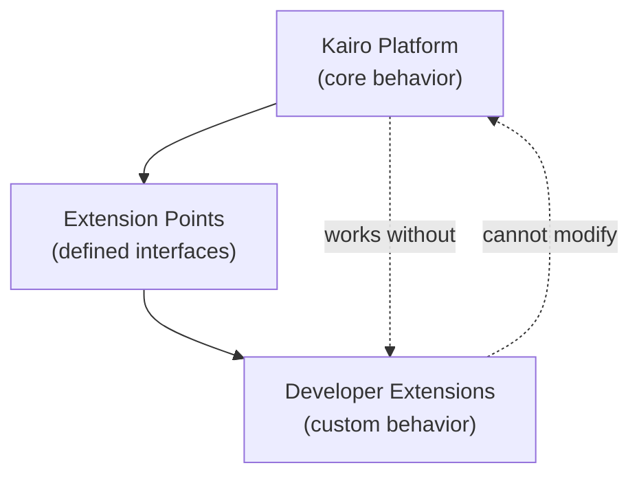
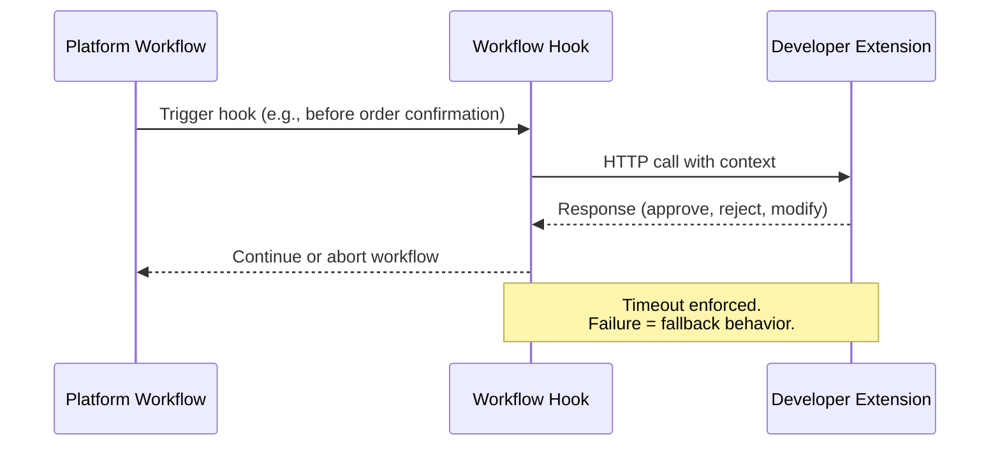
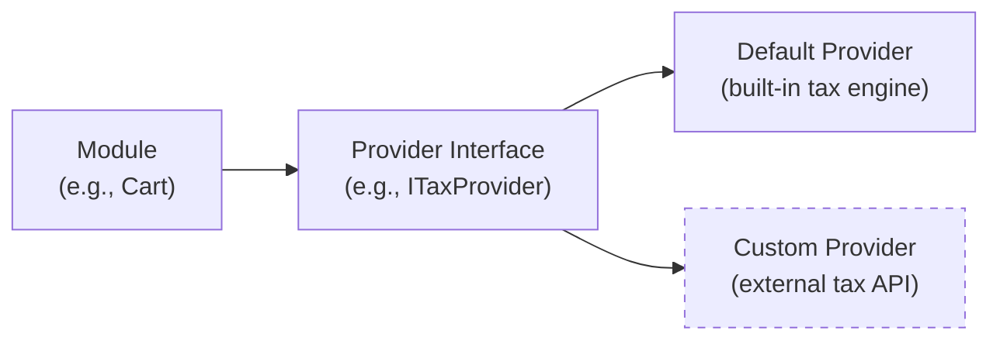
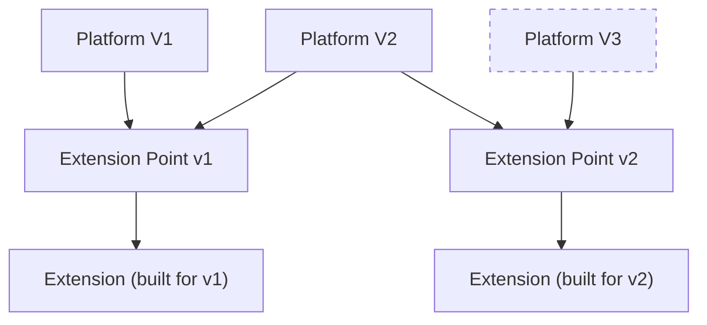

# Extension Architecture

## Metadata

| Field | Value |
|-------|-------|
| Title | Kairo Extension Architecture |
| Document ID | KAI-CORE-007 |
| Status | Draft |
| Version | 0.1 |
| Target Release | N/A |
| Owner | Chief Platform Architect |
| Created | 2026-07-18 |
| Last Updated | 2026-07-18 |
| Reviewers | TODO |
| Related Documents | [Architecture Overview](./Architecture-Overview.md), [Architecture Principles](./Architecture-Principles.md), [Module Architecture](./Module-Architecture.md), [Platform Services](../05-Platform-Core/Platform-Services.md), [System Architecture](./System-Architecture.md) |
| Dependencies | None |

---

## Purpose

This document defines how the Kairo platform supports extensibility — the ability for developers to customize, extend, and integrate platform behavior without modifying its core. Extensibility is what makes the platform adoptable by diverse businesses with unique requirements.

No platform can anticipate every customer's needs. Extensibility acknowledges this reality and provides structured mechanisms for developers to adapt the platform to their business, within defined boundaries, without compromising upgradeability, security, or reliability.

---

## Customization Philosophy

### Extend, Do Not Fork

The platform is designed to be extended through defined extension points, not forked or patched. Extensions operate within the platform's boundaries. They receive defined inputs, produce defined outputs, and do not access platform internals.

### Upgradeable by Default

Extensions must survive platform upgrades. The platform commits to maintaining extension point contracts across versions. An extension built for V1 continues to work in V2 unless the extension point is formally deprecated with a migration path.

### Safe by Design

Extensions cannot compromise platform security, data isolation, or reliability. The platform controls what extensions can access, how long they can execute, and what happens when they fail.

### Opt-In Complexity

Extensions are optional. The platform works fully without any extensions. Developers add extensions when their specific requirements demand behavior that the platform does not provide natively.

---

## Extension Types

### Webhooks

Outbound HTTP notifications triggered by platform events. The simplest and most common extension mechanism.

| Attribute | Detail |
|-----------|--------|
| Direction | Platform → External system |
| Trigger | Domain events (order created, payment captured, inventory adjusted) |
| Execution | Asynchronous. Does not block the triggering operation. |
| Scope | Per organization. Tenants register their own webhook endpoints. |
| Security | Webhook signatures for payload verification. HTTPS required. |

**When to use:** Reacting to platform events in external systems — syncing orders to an ERP, triggering fulfillment in a warehouse management system, updating a CRM when a customer places an order.

**Limitations:** Webhooks are fire-and-forget notifications. They cannot modify platform behavior or inject logic into platform workflows.

### Workflow Hooks (Future)

Synchronous extension points within platform workflows that allow developer code to participate in a business process before it completes.

| Attribute | Detail |
|-----------|--------|
| Direction | Platform → Extension → Platform |
| Trigger | Specific points in a workflow (before order confirmation, after price calculation, before payment capture) |
| Execution | Synchronous with timeout. The platform waits for the extension to respond. |
| Scope | Per organization. Configured by tenant administrators. |
| Security | Authenticated callback. Timeout enforcement. Failure handling defined by the platform. |

**When to use:** Injecting custom validation (fraud check before order confirmation), enriching data (adding custom fields during checkout), or enforcing business rules that the platform does not natively support.

**Limitations:** Workflow hooks add latency to the operation. They must respond within a defined timeout. Failure handling follows the platform's fallback policy (proceed without the extension, or abort the operation, depending on the hook's configuration).

### Custom Fields

Additional data fields attached to platform entities without schema modification.

| Attribute | Detail |
|-----------|--------|
| Direction | Developer → Platform (storage) |
| Scope | Per organization. Each tenant defines their own custom fields. |
| Storage | Managed by the platform. Custom field data is included in API responses and events. |
| Queryability | Custom fields are filterable and searchable where the platform supports it. |

**When to use:** Storing business-specific data that the platform's standard schema does not include — a loyalty tier on a customer, an internal SKU reference on a product, a priority flag on an order.

**Limitations:** Custom fields do not participate in platform business logic. They are stored and returned but do not influence pricing, authorization, or workflow decisions.

### Computed Fields (Future)

Dynamic fields whose values are calculated by developer-provided logic at read time.

| Attribute | Detail |
|-----------|--------|
| Direction | Platform → Extension (calculation) → Platform (response) |
| Scope | Per organization. |
| Execution | Synchronous at read time with caching. |
| Security | Read-only. Cannot modify entity state. |

**When to use:** Displaying derived values — a margin percentage computed from cost and price, a risk score computed from order attributes, a loyalty status derived from purchase history.

**Limitations:** Computed fields add read latency. Results are cached to minimize impact. Computation logic cannot modify data.

---

## Provider Model

The provider model allows developers to replace the platform's default implementation of specific capabilities with their own or with third-party services.

### What Providers Replace

| Provider Type | Default Behavior | Custom Provider Replaces |
|--------------|-----------------|------------------------|
| Tax calculation | Platform's built-in tax engine | External tax service (e.g., tax calculation API) |
| Shipping rates | Platform's configured rate tables | External carrier rate API |
| Payment processing | Platform's payment orchestration | Custom payment gateway integration |
| Search | Platform's built-in search | External search service |
| Notification delivery | Platform's email/webhook delivery | Custom notification channel |

### Provider Contract

### Provider Rules

- The platform defines the provider interface. The developer implements it.
- The default provider is always available. Custom providers are optional.
- Provider selection is configured per organization or per store.
- Providers must satisfy the same contract as the default implementation. They receive the same inputs and must return the same output structure.
- Provider failures are handled by the platform. Fallback behavior (use default, retry, abort) is configurable.
- Providers cannot access platform internals beyond what the provider interface exposes.

---

## Integration Points

Integration points are the defined locations in the platform where external systems can connect.

### Event-Based Integration

| Point | Mechanism | Direction |
|-------|-----------|-----------|
| Domain events | Webhooks, event subscriptions | Outbound |
| Event ingestion | API-based event submission | Inbound (future) |

External systems subscribe to platform events and react to state changes. This is the primary integration mechanism for ERP sync, warehouse management, marketing automation, and analytics.

### API-Based Integration

| Point | Mechanism | Direction |
|-------|-----------|-----------|
| REST API | Standard API endpoints | Bidirectional |
| Bulk operations | Batch API endpoints | Inbound |

External systems read and write platform data through the public API. The API is the integration surface — every capability accessible to a storefront is equally accessible to an integration.

### Provider-Based Integration

| Point | Mechanism | Direction |
|-------|-----------|-----------|
| Tax provider | Provider interface | Outbound (platform calls provider) |
| Shipping provider | Provider interface | Outbound |
| Payment provider | Provider interface | Outbound |

The platform delegates specific operations to external services through the provider model. The provider receives structured input and returns structured output.

### Integration Principles

- All integration uses the same authentication and authorization model as any other API consumer.
- Integration does not bypass tenant isolation. An integration scoped to Organization A cannot access Organization B's data.
- Integration rate limits apply. External systems are subject to the same rate limiting as any other client.
- Integration failures are isolated. A failing integration does not degrade platform operations for other tenants.

---

## Future Marketplace

A future extension marketplace may allow developers to share and discover extensions built for the Kairo platform.

### Marketplace Philosophy

- The marketplace is a discovery and distribution mechanism, not a runtime dependency. Extensions run within the tenant's environment, not within a shared marketplace runtime.
- Extensions in the marketplace are reviewed for security and contract compliance.
- The marketplace does not create lock-in. Extensions installed from the marketplace can be replaced with custom implementations at any time.
- The marketplace is optional. The platform's extensibility works without it.

### Marketplace Scope (Directional)

| Category | Examples |
|----------|---------|
| Providers | Tax calculation providers, shipping rate providers, payment integrations |
| Workflow hooks | Fraud detection, custom validation, data enrichment |
| Integration templates | Pre-built webhook configurations for popular external systems |
| Custom field schemas | Industry-specific custom field sets |

### Marketplace Rules

- Extensions must not require access beyond what the extension point provides.
- Extensions must work across platform versions within a defined compatibility window.
- Extensions must not degrade platform performance beyond defined limits.
- The platform team does not maintain marketplace extensions. Extension authors are responsible for their extensions.

---

## Version Compatibility

### Extension Point Versioning

Extension points are versioned independently from the platform. An extension built against extension point version 1 continues to work until that version is formally deprecated.

### Compatibility Rules

- Extension points follow the same backward compatibility rules as public APIs. Additive changes only.
- Breaking changes to extension points require a new version of the extension point and a deprecation period for the old version.
- The platform supports at least two concurrent versions of an extension point during the migration period.
- Extensions declare which extension point version they are built for. The platform routes to the correct version.
- Provider interfaces follow the same versioning rules. A provider built for interface v1 works until v1 is deprecated.

### Deprecation Process

1. A new version of the extension point is released.
2. The old version is marked as deprecated with a documented end-of-life date.
3. Extension authors are notified and provided migration guidance.
4. Both versions run concurrently during the migration period.
5. After the migration period, the old version is removed.

---

## Architecture Impact

| Concern | Impact |
|---------|--------|
| Request latency | Workflow hooks and computed fields add synchronous latency. Timeout enforcement limits the impact. |
| Failure handling | Every extension point defines a failure mode (fallback, retry, abort). The platform never hangs waiting for an extension. |
| Security | Extensions operate within the tenant's permission boundary. They cannot escalate privileges or access other tenants. |
| Data model | Custom fields extend the data model per tenant without schema migration. The platform stores and indexes them. |
| Testing | Extension points are part of the platform's test surface. Compatibility tests verify that extensions built for older versions continue to work. |
| Performance | Provider calls and webhook deliveries are measured. Performance budgets ensure extensions do not degrade core operations. |

---

## Decision Summary

| Decision | Rationale |
|----------|-----------|
| Webhooks are the primary extension mechanism | Simplest, most widely understood, and sufficient for the majority of integration needs. |
| Workflow hooks are synchronous with timeouts | Extensions that participate in workflows must respond quickly or the platform proceeds without them. Unbounded waits are unacceptable. |
| Custom fields do not participate in business logic | Allowing custom fields to influence pricing or authorization would create untestable, unpredictable behavior. |
| Providers implement platform-defined interfaces | The platform controls the contract. Providers are interchangeable. This prevents vendor lock-in within the extension model. |
| Extension points are versioned independently | Extensions must survive platform upgrades. Independent versioning with backward compatibility protects extension authors. |
| Marketplace is optional and future | The platform's extensibility works without a marketplace. The marketplace adds discovery, not capability. |

---

## Version Gate

| Version | Extension Architecture Expectation |
|---------|-----------------------------------|
| V1 | Webhooks for all core domain events. Custom fields for major entities (products, orders, customers). Provider interface for tax and shipping. |
| V2 | Webhook reliability proven. Custom fields are filterable and searchable. Provider interface for payments. Extension point versioning is operational. |
| V3 | Workflow hooks are evaluated and piloted. Computed fields are evaluated. Marketplace concept is validated. Multi-product extension patterns are defined. |

---

## Out of Scope

This document does not define:

- Specific webhook event payloads — documented in module event specifications.
- Custom field storage implementation — documented in module specifications.
- Provider interface definitions — documented per provider type.
- Marketplace platform design — documented when marketplace enters active planning.
- Extension SDK design — documented in development standards.

---

## Future Considerations

- **Extension analytics** — Tracking extension usage, failure rates, and latency to help developers optimize their extensions.
- **Extension sandboxing** — Running extensions in isolated environments to prevent resource exhaustion or security violations.
- **Extension chaining** — Multiple extensions at the same extension point, executed in a defined order.
- **Extension testing tools** — Sandbox environments where developers can test extensions against realistic platform behavior without affecting production.
- **GraphQL extensions** — If a GraphQL layer is added, extending the schema through custom fields and computed fields.

---

## Change History

| Version | Date | Author | Description |
|---------|------|--------|-------------|
| 0.1 | 2026-07-18 | Chief Platform Architect | Initial draft |
