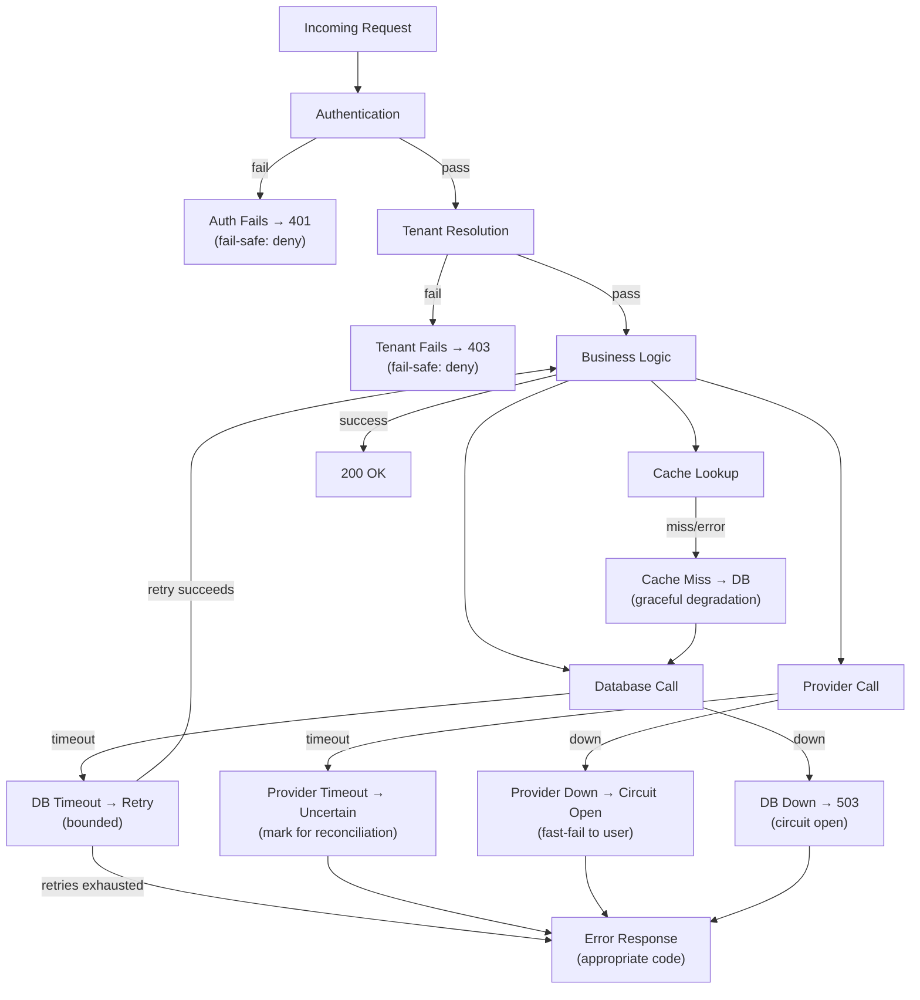

# Availability and Resilience Architecture

## Metadata

| Field | Value |
|-------|-------|
| Title | Kairo Availability, Reliability, and Resilience Architecture |
| Document ID | KAI-INFRA-009 |
| Status | Draft |
| Version | 0.1 |
| Target Release | V1 |
| Owner | Availability, Reliability, and Resilience Architect |
| Created | 2026-07-23 |
| Last Updated | 2026-07-23 |
| Reviewers | TODO |
| Related Documents | [Infrastructure Architecture](./Infrastructure-Architecture.md), [Quality Attributes](../Quality-Attributes.md), [Error Architecture](../API/Error-Architecture.md), [Delivery, Ordering, and Consistency](../Events/Delivery-Ordering-and-Consistency.md), [Incident Response](../Security/Incident-Response.md), [Hosting and Runtime Architecture](./Hosting-and-Runtime-Architecture.md) |
| Dependencies | [Infrastructure Architecture](./Infrastructure-Architecture.md), [Quality Attributes](../Quality-Attributes.md) |

---

## Applicable Version

This document defines V1 availability and resilience architecture. V1 targets practical availability appropriate for an early-stage platform — multi-replica API, managed-service failover for data stores, and graceful degradation for non-critical capabilities. Enterprise-grade high availability (multi-region, automated failover, chaos engineering) is future investment.

---

## Purpose

This document defines how the Kairo platform remains available and recovers from failures — what capabilities are most critical, how failures are isolated, what degradation is acceptable, and how the platform behaves when dependencies fail.

Every system fails. The question is not whether failures occur but how the system behaves when they do. A well-designed system degrades gracefully (serve cached catalog when database is slow), isolates failures (one module's issue does not cascade), and recovers quickly (restart, failover, or reconciliation). A poorly designed system cascades failures, returns cryptic errors, and requires manual intervention for every incident. This document ensures Kairo fails well.

---

## Scope

This document covers:

- Availability philosophy and capability criticality.
- Failure domains, isolation, and redundancy.
- Resilience patterns (timeouts, retries, circuit breakers, bulkheads, backpressure).
- Graceful degradation and fail-safe behavior.
- Dependency outage scenarios and their handling.
- Recovery and maintenance.
- V1 availability targets and future maturity.

This document does not cover:

- Specific SLA numeric percentages (contractual agreements).
- Monitoring tool configuration (operations configuration).
- Incident response procedures (see [Incident Response](../Security/Incident-Response.md)).
- Disaster recovery details (see [Backup, Restore, and Disaster Recovery](../Data/Backup-Restore-and-Disaster-Recovery.md)).
- Load testing methodology (development/operations standards).
- Specific timeout or retry values (deployment configuration).

---

## Mandatory Principles

| # | Principle |
|---|-----------|
| 1 | Not all capabilities require identical availability |
| 2 | Retry must be bounded and safe |
| 3 | A cache outage must not corrupt authoritative data |
| 4 | Search outage should not redefine transactional truth |
| 5 | External provider failure must not create ambiguous financial outcomes |
| 6 | Event transport failure must not lose committed event intent |
| 7 | Graceful degradation must not weaken authorization or tenant isolation |
| 8 | Health checks must reflect actual service readiness |
| 9 | Availability targets must be measurable before becoming contractual |
| 10 | V1 must avoid unsupported enterprise availability claims |
| 11 | Critical failures require reconciliation and incident response |

---

## 1. Availability Philosophy

| Principle | Detail |
|-----------|--------|
| Proportionate | Availability investment matches business impact. Revenue-critical paths get more investment than administrative reporting. |
| Measured | Availability is measured from real metrics, not assumed from architecture diagrams. |
| Honest | Do not claim availability that is not measured, tested, or operationally supported. |
| Progressive | V1 establishes the foundation. Availability improves as the platform matures and demand justifies investment. |
| Degraded > unavailable | A partially working system (cached data, reduced features) is better than a completely unavailable one. |
| **No unsupported claims** | **V1 must avoid unsupported enterprise availability claims.** Do not promise 99.99% without the infrastructure, testing, and operational processes to deliver it. |

---

## 2. Service Criticality

### Capability Criticality Matrix

| Capability | Criticality | Acceptable Degradation | Impact of Outage |
|-----------|-------------|------------------------|------------------|
| Authentication | **Critical** | None (cannot be degraded without security risk) | All authenticated operations fail. Revenue stop. |
| Checkout / order placement | **Critical** | Brief retry acceptable. No data loss. | Revenue loss. Customer frustration. |
| Payment processing | **Critical** | Queue for retry if provider is down. No ambiguity. | Revenue loss. Financial inconsistency. |
| Inventory reservation | **Critical** | Brief retry. No double-sell. | Oversell. Financial and fulfillment impact. |
| Storefront browsing (catalog) | **High** | Serve cached/stale catalog if database is slow. | Customer cannot browse. Lost opportunity. |
| Order management (view/track) | **High** | Read from read-model (may lag). | Customer frustration. Support volume. |
| Administrative operations | **Medium** | Delayed access acceptable. No data loss on recovery. | Operations slowed. Not revenue-impacting. |
| Search | **Medium** | Return "search unavailable" or fall back to basic filtering. | Reduced discoverability. Not critical path. |
| Reporting / analytics | **Low** | Reports delayed. Stale data acceptable with freshness indicator. | Business decisions delayed (not blocked). |
| Webhooks (outbound) | **Medium** | Queued for retry. Delivered when recovered. | External consumers miss real-time notification. Retry catches up. |
| Background processing (events) | **High** | Queued. Processed when recovered. Consumer lag acceptable briefly. | Eventual consistency window extends. |
| Notification delivery | **Medium** | Queued for retry. Delayed delivery acceptable. | Customer misses timely notification. |

---

## 3. Failure Domains

| Domain | Scope | Isolation |
|--------|-------|-----------|
| Single container instance | One API or worker replica | Automatic replacement. Other replicas serve traffic. |
| Application tier (all instances) | All API or all worker instances | Load balancer detects. Requires investigation. |
| Database | Primary persistent storage | Managed-service failover (V1). Read-only mode possible. |
| Cache | Redis/ephemeral storage | Application handles cache-miss. Self-healing. |
| Search index | Full-text search | Search unavailable. Transactional queries unaffected. |
| Event processing | Outbox/consumer infrastructure | Events queue. Delivered when recovered. Outbox protects. |
| Object storage | Files, media, exports | File operations unavailable. Core operations continue. |
| External provider | Payment, shipping, email | Provider-specific handling. Retry or queue. |
| Network | Connectivity between zones | Depends on which zone. Partial service degradation. |
| DNS | Name resolution | Catastrophic if total. Managed DNS has built-in redundancy. |
| Observability | Monitoring, logging | Invisible failures. Application continues. Operational blindness. |

---

## 4. Single Points of Failure

| Component | V1 SPOF? | Mitigation |
|-----------|:---:|-----------|
| Database (primary) | Yes (instance) | Managed service with automated failover (standby) |
| Cache | Yes (instance) | Cache-miss self-heals. Application continues without cache. |
| Search | Yes (instance) | Search unavailable. Core operations unaffected. |
| API (single instance) | No | Multi-replica. Load balancer routes around failures. |
| Worker (single instance) | Yes (V1: single worker) | Restart recovers. Outbox prevents event loss. Brief lag acceptable. |
| Object storage | No | Managed service with built-in redundancy. |
| Load balancer | Vendor SPOF | Managed load balancer has built-in redundancy. |
| DNS | Vendor SPOF | Managed DNS has global redundancy. |
| Secrets service | Vendor SPOF | Managed service. Application caches retrieved secrets. |

---

## 5. Redundancy

| Component | V1 Redundancy | Future Redundancy |
|-----------|--------------|-------------------|
| API instances | 2+ replicas | Auto-scaled, multi-AZ |
| Worker instances | 1+ (restart-recoverable) | Multi-replica, multi-AZ |
| Database | Managed failover (standby replica) | Multi-AZ, read replicas, cross-region |
| Cache | Single (loss is recoverable) | Clustered, multi-AZ |
| Search | Single (loss is rebuildable) | Multi-node cluster |
| Object storage | Built-in (managed service durability) | Cross-region replication |
| Event delivery | Outbox in database (shares DB durability) | External broker with replication |

---

## Resilience Patterns

### 6. Health Checks

**Health checks must reflect actual service readiness.**

| Check | What It Validates | If Fails |
|-------|-------------------|----------|
| Liveness | Process is alive and not deadlocked | Container restarted |
| Readiness | Process can serve requests (dependencies reachable) | Removed from load balancer (no traffic) |
| Startup | Process has completed initialization | Prevents premature liveness failure |

| Rule | Detail |
|------|--------|
| Readiness ≠ liveness | A container can be alive (process running) but not ready (database unreachable) |
| Readiness checks dependencies | Readiness should verify database connectivity and critical dependency access |
| Not too strict | Transient issues (1-second latency spike) should not fail readiness |
| Not too lenient | A container that cannot serve requests must not remain in the load balancer |

---

### 7. Dependency Timeouts

| Rule | Detail |
|------|--------|
| Every external call has a timeout | No indefinite waits. Database, cache, search, provider — all have timeouts. |
| Reasonable defaults | Timeouts are set based on expected response time + margin (not arbitrarily large) |
| Cascading prevention | A slow dependency is detected quickly (timeout) rather than blocking the caller indefinitely |
| Configurable | Timeout values are configuration (not hardcoded). Tunable per environment. |
| Timeout ≠ failure | A timeout means "response not received in time." The operation may or may not have succeeded. (See [Idempotency](../API/Idempotency-Concurrency-and-Retries.md).) |

---

### 8. Retries

**Retry must be bounded and safe.**

| Rule | Detail |
|------|--------|
| Bounded | Maximum retry count (not infinite) |
| Backoff | Exponential backoff between retries (not immediate bombardment) |
| Jitter | Random jitter prevents thundering herd |
| Idempotent only | Only retry operations that are safe to repeat (idempotent or naturally safe) |
| Not for all errors | Do not retry client errors (4xx). Do not retry permanent failures. |
| Circuit-aware | If circuit breaker is open, do not retry (destination known to be failing) |
| Budgeted | Total retry time is bounded (e.g., don't retry for 30 minutes) |

---

### 9. Circuit Breaking

| Aspect | Detail |
|--------|--------|
| Purpose | Prevent calling a dependency known to be failing (fast-fail instead of slow-fail) |
| States | Closed (normal) → Open (failing, reject immediately) → Half-Open (test one request) |
| Trigger | Consecutive failures or error-rate threshold trips the circuit open |
| Recovery | After cooldown period, circuit goes half-open. If test succeeds, circuit closes. |
| Scope | Per-dependency (database circuit, cache circuit, provider circuit — independent) |
| Caller behavior | When circuit is open, caller receives a fast error (not a timeout) |
| V1 direction | Implement for external provider calls and database connectivity |

---

### 10. Bulkheads

| Aspect | Detail |
|--------|--------|
| Purpose | Isolate resources so one workload's exhaustion does not affect others |
| Mechanisms | Separate connection pools, separate thread pools, separate processes (API vs worker) |
| V1 implementation | API and worker are separate processes (primary bulkhead). Within API: connection pool limits per dependency. |
| Example | Database connection pool exhausted by heavy report does not prevent simple queries |
| Future | Per-module resource isolation (if modules become services) |

---

### 11. Rate Limiting

| Aspect | Detail |
|--------|--------|
| Purpose | Protect the platform from excessive request volume (intentional or accidental) |
| Scope | Per-consumer, per-endpoint, per-tenant |
| Response | 429 Too Many Requests with Retry-After header |
| Not degradation | Rate limiting protects availability by preventing overload. It is a protection mechanism. |
| Fair | Rate limits ensure one consumer cannot monopolize capacity |
| Reference | Per [API Architecture](../API/API-Architecture.md) |

---

### 12. Load Shedding

| Aspect | Detail |
|--------|--------|
| Purpose | When system is overloaded, reject excess load to protect currently-processing requests |
| Trigger | System resources approaching capacity (CPU, connection pools, queue depth) |
| Response | 503 Service Unavailable for shed requests (with Retry-After) |
| Priority direction | V2+: priority-based shedding (checkout > browsing). V1: fair rejection. |
| Distinct from rate limiting | Rate limiting is per-consumer. Load shedding is system-wide capacity protection. |
| V1 | Infrastructure-managed (managed platform limits). Application-level load shedding V2+. |

---

### 13. Backpressure

| Aspect | Detail |
|--------|--------|
| Purpose | Slow down producers when consumers cannot keep up |
| Event processing | If event consumers fall behind, outbox accumulates. Worker processes at sustainable rate. |
| Import processing | Large imports processed at bounded rate (not attempting all simultaneously) |
| Database | Connection pool acts as natural backpressure (no more concurrent queries than pool size) |
| Visibility | Backpressure (queue growth, lag) is visible through monitoring |

---

### 14. Graceful Degradation

**Graceful degradation must not weaken authorization or tenant isolation.**

| Degradation | Acceptable | Not Acceptable |
|------------|:---:|:---:|
| Serve stale cached catalog data | Yes | — |
| Disable search (fall back to basic filtering) | Yes | — |
| Queue webhooks (deliver later) | Yes | — |
| Delay non-critical notifications | Yes | — |
| Show "data as of [time]" for reports | Yes | — |
| Skip authentication | — | **Never** |
| Skip authorization | — | **Never** |
| Skip tenant isolation | — | **Never** |
| Return another tenant's data from cache | — | **Never** |
| Process payments without provider confirmation | — | **Never** |

---

### 15. Fail-Safe Behavior

| Component | Fail-Safe Behavior |
|-----------|-------------------|
| Authentication | Deny access (never allow without verification) |
| Authorization | Deny access (never grant without verification) |
| Tenant resolution | Reject request (never guess or default tenant) |
| Payment provider timeout | Mark as uncertain (never assume success or failure) |
| Database write failure | Transaction rolls back (no partial state) |
| Cache miss | Fetch from authoritative source (not error) |
| Cache connection failure | Skip cache (slower but correct). Do not serve stale data as current. |
| Search unavailable | Graceful error to user ("search temporarily unavailable"). Not 500. |
| Event publication failure | Outbox retains event (never lost). Delivered when infrastructure recovers. |

---

## Dependency Outage Scenarios

### 16. Dependency Outage (General)

| Rule | Detail |
|------|--------|
| Identify | Each dependency has a defined failure behavior |
| Isolate | One dependency's failure does not cascade to unrelated capabilities |
| Communicate | Failures are communicated to users appropriately (not raw errors) |
| Recover | Recovery is automatic where possible, manual with procedures where not |
| Reconcile | After recovery, verify consistency (especially financial, inventory) |

---

### 17. Database Outage

| Scenario | Impact | Mitigation |
|----------|--------|-----------|
| Primary unavailable (brief) | All writes fail. Reads fail (unless read-replica exists). | Managed failover (standby promotes). Brief unavailability (seconds to minutes). |
| Primary unavailable (extended) | Revenue-impacting. All state-changing operations fail. | Incident response. Managed service recovery. Communication to users. |
| Read-replica lag (future) | Stale reads from replica. | Read-model lag is communicated. Critical reads go to primary. |
| Connection pool exhausted | New requests cannot get connections. | Rate limiting. Connection pool sizing. Heavy query isolation (worker process). |

| Rule | Detail |
|------|--------|
| Managed failover | V1 relies on managed-service automated failover (standby promotion) |
| Application reconnects | Application detects connection failure and reconnects automatically |
| No data corruption | Database failure never causes partial commits (transactions are atomic) |
| **Event safety** | **Event transport failure must not lose committed event intent.** Outbox is in the database — shares its durability. |

---

### 18. Cache Outage

**A cache outage must not corrupt authoritative data.**

| Scenario | Impact | Mitigation |
|----------|--------|-----------|
| Cache unavailable | All cache reads miss. Application fetches from database. Slower. | Circuit breaker on cache. Fall back to database. |
| Cache data corrupt/stale | Incorrect data served from cache. | Cache is ephemeral. TTL limits staleness. Application validates where critical. |
| Cache connection pool exhausted | Cache operations fail. | Same as unavailable — fall back to database. |

| Rule | Detail |
|------|--------|
| Cache is not authoritative | Cache loss means performance degradation, not data loss |
| Application handles miss | Every cache read has a fallback (fetch from authoritative source) |
| No cache-or-nothing | The system works without cache (slower, but works) |
| Tenant isolation preserved | Cache outage does not cause one tenant's data to be served to another |

---

### 19. Search Outage

**Search outage should not redefine transactional truth.**

| Scenario | Impact | Mitigation |
|----------|--------|-----------|
| Search index unavailable | Full-text search fails. | Graceful error: "Search temporarily unavailable." Transactional filtering still works. |
| Search index corrupt/stale | Incorrect search results. | Re-index from authoritative database. Communicate staleness. |

| Rule | Detail |
|------|--------|
| Search is derived | Search index is derived from authoritative database. Loss is rebuildable. |
| Transactional queries unaffected | Database-backed filtering (exact match, status filter) works without search |
| Not a critical path | Checkout and order placement do not depend on search |
| Recovery | Re-index from authoritative source |

---

### 20. Event Infrastructure Outage

**Event transport failure must not lose committed event intent.**

| Scenario | Impact | Mitigation |
|----------|--------|-----------|
| Event bus/delivery failure (V1: in-process) | V1: unlikely (same process). If process crashes, outbox retains events. | Outbox persistence in database. Events delivered on process restart. |
| Outbox processor failure | Events accumulate in outbox (not delivered). Consumer lag increases. | Worker restart recovers. Outbox records survive. Monitoring alerts on lag. |
| Consumer failure | Events delivered but not processed. Dead-lettered after retries. | Consumer retry. Dead-letter investigation. Reconciliation if extended. |

| Rule | Detail |
|------|--------|
| Outbox protects | The transactional outbox ensures events survive infrastructure failures |
| Lag ≠ loss | During outage, events accumulate. After recovery, they are delivered. Data is not lost. |
| Reconciliation for extended outage | If outage exceeds retention window, reconciliation via producer APIs |

---

### 21. Object-Storage Outage

| Scenario | Impact | Mitigation |
|----------|--------|-----------|
| Object storage unavailable | File upload/download fails. Media not served. Exports unavailable. | Core operations (checkout, payments) continue without files. Upload/download returns clear error. |
| Partial availability | Some files accessible, some not. | Application handles per-file failure gracefully. |

| Rule | Detail |
|------|--------|
| Not on critical path | Checkout and payment do not depend on object storage |
| Managed service durability | Object storage has built-in redundancy (provider guarantees) |
| Export retry | If export generation fails due to storage outage, retry when storage recovers |

---

### 22. External Provider Outage

**External provider failure must not create ambiguous financial outcomes.**

| Scenario | Impact | Mitigation |
|----------|--------|-----------|
| Payment provider unavailable | Payments cannot be processed. | Checkout fails gracefully: "Payment currently unavailable. Please try again." |
| Payment provider timeout | Kairo does not know if payment succeeded. | Mark as uncertain. Status check on recovery. Reconciliation. |
| Shipping provider unavailable | Shipping rates/labels cannot be obtained. | Queue for retry. Fulfillment delayed. |
| Email provider unavailable | Notifications not sent. | Queue for retry. Delivered when recovered. |

| Rule | Detail |
|------|--------|
| No ambiguous financial state | After a provider failure, the financial state must be determinable (success, failure, or explicitly uncertain) |
| Idempotent retry | Provider retries use idempotency keys (per [Idempotency](../API/Idempotency-Concurrency-and-Retries.md)) |
| Reconciliation | After provider recovery, reconcile Kairo state against provider state |
| Circuit breaker | Repeated provider failures trip circuit. Fast-fail instead of slow timeout for subsequent calls. |
| Clear user communication | "Payment service temporarily unavailable. Your card has not been charged." (Or "status uncertain — please check your orders.") |

---

### 23. Observability Outage

| Scenario | Impact | Mitigation |
|----------|--------|-----------|
| Logging unavailable | Application continues. Logs are lost during outage. | Operational blindness. Resume logging on recovery. External uptime monitoring continues. |
| Metrics collection down | Dashboards show gaps. Alerts may not fire. | External uptime monitoring as backup. Investigate quickly. |
| Alerting down | Failures go unnoticed. | External heartbeat monitoring ("are alerts working?"). |

| Rule | Detail |
|------|--------|
| Application continues | Observability failure does not stop the application |
| Blindness is temporary | Observability is recovered quickly (high priority) |
| External monitoring | An external service monitors that the application is alive (independent of internal observability) |
| Incident response | Observability outage IS an incident (operational blindness is dangerous) |

---

### 24. Partial Regional Outage

| Aspect | V1 | Future |
|--------|-----|--------|
| Single region | V1 deploys in a single region. Regional outage = full outage. | Multi-region deployment for regional independence. |
| Multi-AZ direction | V1 direction: managed services with multi-AZ (database failover, distributed storage). | Full multi-AZ application deployment. |
| Recovery | Managed service recovery within region. DR from backup if region is lost. | Active-passive or active-active multi-region. |
| Communication | Status page communicates outage to customers. | Automated region failover. |

---

### 25. Maintenance

| Aspect | Detail |
|--------|--------|
| Planned maintenance | Scheduled during low-traffic periods. Communicated in advance. |
| Zero-downtime | Rolling deployment enables zero-downtime maintenance for application workloads. |
| Database maintenance | Managed service handles patching without downtime (or with brief failover). |
| Communication | Planned maintenance communicated to tenants when user-facing impact is expected. |
| Reduced capacity | During maintenance, reduced capacity is acceptable (fewer replicas during rollout). |

---

### 26. Recovery

| Recovery Type | Trigger | Mechanism |
|--------------|---------|-----------|
| Container restart | Liveness check failure | Automatic (orchestrator restarts container) |
| Traffic rerouting | Readiness check failure | Automatic (load balancer removes unhealthy) |
| Database failover | Primary failure detected | Automatic (managed service promotes standby) |
| Cache reconnection | Connection restored | Automatic (application reconnects) |
| Event catch-up | Infrastructure recovered | Automatic (outbox processor resumes) |
| Reconciliation | Extended outage resolved | Manual or scheduled (verify consistency) |
| Full restore | Catastrophic failure | Manual (restore from backup per DR plan) |

---

## V1 Availability

### 27. V1 Availability

| Component | V1 Availability Approach |
|-----------|--------------------------|
| API | 2+ replicas. Load-balanced. Auto-restart on failure. |
| Worker | 1+ replica. Auto-restart. Brief lag acceptable on failure. |
| Database | Managed service with automated failover. |
| Cache | Single instance. Loss is recoverable (cache-miss self-heals). |
| Search | Single instance. Outage = search unavailable (not system outage). |
| Events | Outbox in database (shares DB durability). In-process delivery. |
| Object storage | Managed service (built-in durability). |
| External providers | Timeout + circuit breaker + retry with idempotency. |

| Rule | Detail |
|------|--------|
| **Measurable before contractual** | **Availability targets must be measurable before becoming contractual.** V1 measures availability. V2+ may commit to SLA targets based on evidence. |
| Practical | V1 availability is appropriate for an early-stage platform (not enterprise 99.99%). |
| Cost-conscious | Availability investment is proportionate to business stage. |
| Foundation | V1 patterns (health checks, retry, circuit breaker, graceful degradation) establish the foundation for future availability improvement. |

---

### 28. Future High-Availability Maturity

| Capability | V1 | V2 | V3+ |
|-----------|:---:|:---:|:---:|
| Multi-replica API | **Yes** | Yes | Yes |
| Database managed failover | **Yes** | Yes + read replicas | Multi-region |
| Cache redundancy | No (single, loss-recoverable) | Clustered | Multi-region |
| Search redundancy | No (single, rebuildable) | Multi-node | Clustered |
| Circuit breakers | **Yes** (external providers + DB) | Enhanced | All dependencies |
| Health checks | **Yes** (liveness + readiness) | Enhanced | + dependency health |
| Timeouts on all calls | **Yes** | Yes | Yes |
| Bounded retries | **Yes** | Yes | Yes |
| Graceful degradation | **Yes** (cache miss, search fallback) | Enhanced | Priority-based |
| Rate limiting | **Yes** | Per-tenant tiers | Adaptive |
| Load shedding | Infrastructure-managed | Application-level | Priority-based |
| Auto-scaling | No (manual) | **Yes** | Multi-region auto-scale |
| Multi-AZ | Managed-service level | Application-level | Yes |
| Multi-region | No | DR standby | Active-passive/active-active |
| Chaos engineering | No | Staging only | Production (controlled) |
| SLA commitments | None (measure first) | Direction | Formal SLA |
| Auto-failover (all tiers) | Database only | Cache + Search | Full |
| Availability measurement | **Yes** (Prometheus uptime) | SLI/SLO tracking | Formal SLA reporting |

---

## Resilience-Pattern Matrix

| Pattern | Purpose | Applied To | V1 |
|---------|---------|-----------|:---:|
| Timeout | Prevent indefinite waits | All external calls (DB, cache, search, providers) | **Yes** |
| Retry (bounded + backoff) | Handle transient failures | Provider calls, DB connection retries | **Yes** |
| Circuit breaker | Fast-fail on known-failing dependency | External providers, database | **Yes** |
| Bulkhead | Isolate resource pools | API process vs worker process. Connection pools. | **Yes** |
| Rate limiting | Protect from overload | All public API surfaces | **Yes** |
| Load shedding | Protect during extreme load | Infrastructure-managed (V1) | Partial |
| Backpressure | Control processing rate | Event processing, imports | **Yes** |
| Health checks | Detect unhealthy instances | All containers (liveness + readiness) | **Yes** |
| Graceful degradation | Maintain partial service | Cache miss → DB fallback. Search unavailable. | **Yes** |
| Fail-safe | Deny rather than corrupt | Auth, authz, tenant resolution, financial ambiguity | **Yes** |
| Redundancy | Survive instance loss | API replicas. DB failover. | **Yes** |
| Reconciliation | Verify consistency after recovery | Financial, inventory, external providers | **Yes** (manual) |

---

## Dependency-Failure Matrix

| Dependency | Failure Impact | Degradation Strategy | Recovery | Reconciliation |
|-----------|----------------|---------------------|----------|:---:|
| Database (primary) | All writes fail. Reads fail. | Managed failover. Brief unavailability. | Automatic (standby promotion) | No (atomic transactions) |
| Cache | Slower responses (cache miss → DB) | Skip cache. Serve from DB. | Automatic (reconnect) | No (cache is derived) |
| Search | Search unavailable | Graceful error. Basic filtering from DB. | Automatic (reconnect) or re-index | No (search is derived) |
| Event delivery | Consumer lag increases | Events queue in outbox. Delivered on recovery. | Automatic (worker restart) | If extended (API reconciliation) |
| Object storage | File operations fail | Core operations continue. Files unavailable. | Automatic (managed service) | No (storage has durability) |
| Payment provider | Payments fail or uncertain | Circuit breaker. Clear user communication. | Retry with idempotency | **Yes** (financial) |
| Shipping provider | Rates/labels unavailable | Fulfillment delayed. Queue for retry. | Retry on recovery | If state diverged |
| Email/SMS provider | Notifications not sent | Queue for retry. Delayed delivery. | Retry on recovery | No (delivery is best-effort) |
| DNS | All external connectivity lost | Catastrophic. Status page if reachable. | Provider recovery. | Check all integrations |
| Observability | Operational blindness | Application continues. Manual awareness. | High-priority fix. | No (operational, not business) |

---

## Failure-Flow Diagram

---

## Version Gate

| Version | Availability and Resilience Gate |
|---------|----------------------------------|
| V1 | Multi-replica API (2+). Managed database with failover. Timeouts on all external calls. Bounded retries with backoff. Circuit breakers for external providers and database. Health checks (liveness + readiness) on all containers. Graceful degradation (cache miss → DB, search unavailable → basic filter). Fail-safe for auth/authz/tenant (deny on failure). Rate limiting on public APIs. Event durability via outbox (survives infrastructure failure). Provider timeout → uncertain state (reconciliation). No unsupported SLA claims. Availability measured from metrics. |
| V2 | Auto-scaling. Multi-AZ application deployment. Clustered cache. Multi-node search. Enhanced circuit breakers. Load shedding (application-level). SLI/SLO definition. Chaos engineering (staging). Automated reconciliation triggers. |
| V3 | Multi-region deployment. Active-passive DR. Priority-based degradation. Formal SLA commitments (evidence-based). Production chaos engineering. Self-healing patterns. Full auto-failover. |

---

## Decision Summary

| Decision | Rationale |
|----------|-----------|
| Proportionate availability (not enterprise-grade V1) | V1 business stage does not justify multi-region or 99.99% investment. Practical availability with growth path. |
| Managed-service failover (database) | Database is the most critical SPOF. Managed failover provides automated recovery without manual intervention. |
| Cache loss is acceptable | Cache is derived and ephemeral. Application works without it (slower). No data is lost. |
| Search outage is not system outage | Search is derived. Transactional operations continue without it. |
| Outbox protects event durability | Events are written to database (same durability as state). Infrastructure failure cannot lose them. |
| Circuit breakers for external providers | Failing providers should fail fast (not slow-timeout). Circuit breaker provides this. |
| No SLA before measurement | Claiming availability without measuring it is dishonest. Measure first, commit later. |
| Degradation preserves security | Under no circumstances does degradation relax auth, authz, or tenant isolation. Safety > availability. |
| Financial ambiguity is explicit | "We don't know if the payment succeeded" is the correct state after a timeout. Never guess. |

---

## Alternatives Considered

| Alternative | Rejected Because |
|------------|-----------------|
| Multi-region in V1 | Over-complex. Over-costly. V1 business stage does not justify it. |
| Claim 99.99% uptime in V1 | No evidence to support. No operational maturity to deliver. Dishonest. |
| No circuit breakers | Slow-failing dependencies cascade to all requests. Circuit breakers contain the blast radius. |
| Cache required for operation | If cache is required, its outage becomes system outage. Cache must be optional (performance enhancement). |
| Assume payment success on timeout | Financial ambiguity is dangerous. Assuming success may charge twice. Assuming failure may lose revenue. Explicit uncertainty is correct. |
| Skip health checks | Unhealthy instances receive traffic. Users get errors. Load balancer needs health signals. |
| Degradation relaxes security | Speed or availability never justifies skipping authentication or authorization. |
| No retry limits | Infinite retry floods a recovering service. Bounded retry with backoff is safe. |
| Same availability for all capabilities | Reporting does not need the same availability as checkout. Proportionate investment. |

---

## Architecture Impact

| Concern | Impact |
|---------|--------|
| Application design | Must implement timeouts, retries, circuit breakers. Must handle dependency failures gracefully. Must implement health checks. Must support cache-miss fallback. |
| Data access | Must handle connection failures. Must use connection pools. Must separate heavy queries from transactional. |
| External integration | Must implement circuit breakers. Must handle timeout ambiguity. Must support reconciliation. |
| Events | Outbox provides durability. Application must handle consumer lag gracefully. |
| Operations | Must monitor availability metrics. Must respond to incidents. Must manage maintenance windows. |
| Testing | Must test degradation scenarios. Must test health check behavior. Must test circuit-breaker behavior. |

---

## Implementation Impact

| Area | Impact |
|------|--------|
| Application | Must implement timeout configuration. Must implement retry with backoff. Must implement circuit breakers for external calls. Must implement health check endpoints. Must handle cache-miss gracefully. Must handle dependency failures with appropriate responses. |
| Platform/DevOps | Must configure multi-replica deployment. Must configure health checks in orchestrator. Must manage database failover. Must configure rate limiting. Must monitor availability metrics. |
| Operations | Must respond to availability incidents. Must manage recovery procedures. Must execute reconciliation after outages. Must communicate maintenance windows. |
| Security | Must validate that degradation does not weaken security. Must review fail-safe behaviors. |
| Testing | Must test failure scenarios (dependency unavailable, timeout, circuit-open). Must test degradation paths. Must test health check accuracy. |

---

## Security Responsibilities

| Role | Availability Security Responsibilities |
|------|---------------------------------------|
| Resilience Architect | Defines availability patterns. Reviews degradation design. Validates fail-safe behaviors. |
| Module Teams | Implement resilience patterns in their code. Handle dependency failures. Test degradation scenarios. |
| Platform/DevOps | Configures redundancy. Manages health checks. Implements rate limiting. Monitors availability. |
| Security Team | **Validates degradation does not weaken security.** Reviews fail-safe designs. Ensures auth/authz is never bypassed. |
| Operations | Responds to incidents. Manages recovery. Executes reconciliation. Communicates status. |

---

## Multi-Tenancy Responsibilities

| Responsibility | Detail |
|---------------|--------|
| Degradation preserves isolation | Cache miss, search fallback, and all degradation paths maintain tenant isolation |
| Per-tenant availability | One tenant's heavy usage (rate-limited) does not degrade other tenants' experience |
| Fair scheduling during degradation | Under load, all tenants receive fair treatment (not first-come-first-served monopolization) |
| Tenant-unaware failures | Infrastructure failures affect all tenants equally (no per-tenant recovery priority in V1) |

---

## Out of Scope

This document does not define:

- Specific SLA percentage commitments (contractual decisions).
- Monitoring alert thresholds or on-call rotation (operations configuration).
- Incident response procedures (see [Incident Response](../Security/Incident-Response.md)).
- Disaster recovery execution (see [Backup and Recovery](../Data/Backup-Restore-and-Disaster-Recovery.md)).
- Load testing methodology (development standards).
- Specific timeout or retry numeric values (deployment configuration).
- Chaos engineering methodology (future operational practice).

---

## Future Considerations

- **Formal SLI/SLO** — Service Level Indicators and Objectives based on measured availability.
- **Error budgets** — Allowed error budget balancing reliability against release velocity.
- **Chaos engineering** — Controlled failure injection in staging (then production with guards).
- **Multi-region active-passive** — Regional failover for geographic resilience.
- **Priority-based degradation** — Shed low-priority work to protect critical paths under extreme load.
- **Self-healing** — Automated recovery patterns that resolve common failures without human intervention.
- **Availability observability** — Real-time availability dashboards with SLI tracking.
- **Tenant-specific availability** — Enterprise tenants with dedicated infrastructure and higher availability guarantees.

---

## Future Refactoring Triggers

This document should be revisited when:

- Measured availability indicates need for higher redundancy (trigger for multi-AZ or clustering).
- Business growth justifies SLA commitments (trigger for formal SLI/SLO definition).
- Multi-region deployment is needed (trigger for geo-distributed resilience).
- Auto-scaling is implemented (trigger for scaling-based resilience patterns).
- Chaos engineering practice is established (trigger for chaos-based resilience validation).
- External provider failures create reconciliation burden (trigger for automated reconciliation).
- Availability incidents reveal missing resilience patterns (trigger for pattern enhancement).

---

## Change History

| Version | Date | Author | Description |
|---------|------|--------|-------------|
| 0.1 | 2026-07-23 | Availability, Reliability, and Resilience Architect | Initial draft — availability and resilience architecture |
