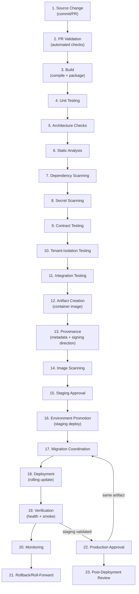
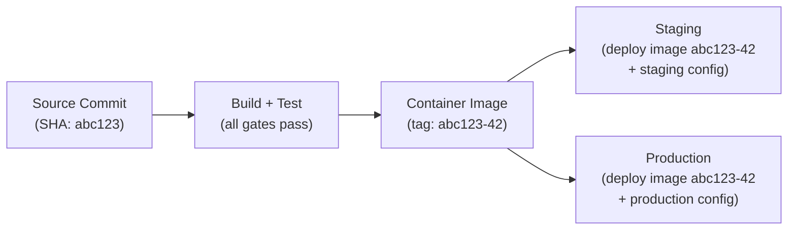
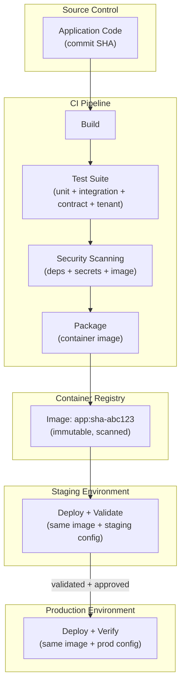

# CI/CD and Deployment Architecture

## Metadata

| Field | Value |
|-------|-------|
| Title | Kairo Continuous Integration, Delivery, and Deployment Architecture |
| Document ID | KAI-INFRA-007 |
| Status | Draft |
| Version | 0.1 |
| Target Release | V1 |
| Owner | Continuous Integration, Delivery, and Deployment Architect |
| Created | 2026-07-23 |
| Last Updated | 2026-07-23 |
| Reviewers | TODO |
| Related Documents | [Infrastructure Architecture](./Infrastructure-Architecture.md), [Secure Development Lifecycle](../Security/Secure-Development-Lifecycle.md), [Schema Evolution and Migrations](../Data/Schema-Evolution-and-Migrations.md), [Container and Workload Architecture](./Container-and-Workload-Architecture.md), [Tenant Testing Strategy](../Multi-Tenancy/Tenant-Testing-Strategy.md), [API Governance and Lifecycle](../API/API-Governance-and-Lifecycle.md), [Event Governance and Lifecycle](../Events/Event-Governance-and-Lifecycle.md), [Environment Architecture](./Environment-Architecture.md) |
| Dependencies | [Infrastructure Architecture](./Infrastructure-Architecture.md), [Container and Workload Architecture](./Container-and-Workload-Architecture.md), [Environment Architecture](./Environment-Architecture.md) |

---

## Applicable Version

This document defines V1 CI/CD and deployment architecture. V1 uses a single pipeline that builds, validates, and promotes a single immutable artifact from source through staging to production. The architecture establishes deployment gates that protect production without requiring enterprise-scale tooling from day one.

---

## Purpose

This document defines how source code changes become running production software — the pipeline stages, quality gates, artifact management, deployment coordination, and supply-chain protections that ensure every production deployment is traceable, tested, secure, and reversible.

A deployment pipeline is the assembly line between developer intent and customer experience. A broken pipeline deploys untested code. A bypassed pipeline deploys unreviewed code. A leaky pipeline exposes credentials. This document ensures the pipeline is reliable, secure, and governed — while remaining practical for V1.

---

## Scope

This document covers:

- Pipeline stages from source change through production deployment.
- Quality, security, and tenant-isolation gates.
- Artifact creation, immutability, and promotion.
- Deployment coordination (database migrations, health checks).
- Supply-chain security and dependency provenance.
- Emergency deployment and failed-deployment behavior.
- AI-generated code requirements within the pipeline.

This document does not cover:

- CI/CD product selection (GitHub Actions, Azure DevOps, etc.) — infrastructure decision.
- Pipeline YAML or script implementation (pipeline repositories).
- Specific test frameworks or testing patterns (development standards).
- Branch naming conventions (team process agreements).
- Release scheduling or cadence (roadmap/team decisions).
- Code review procedures (development standards).

---

## Mandatory Principles

| # | Principle |
|---|-----------|
| 1 | Production deployments use approved immutable artifacts |
| 2 | Production must not rebuild source independently from the approved build |
| 3 | CI/CD credentials follow least privilege |
| 4 | Pull requests cannot bypass required quality and security gates |
| 5 | Tenant-isolation failures block release |
| 6 | Migration compatibility must be evaluated before deployment |
| 7 | Deployment success requires health and behavior verification |
| 8 | Emergency changes still require evidence and retrospective review |
| 9 | AI-generated changes follow the same pipeline as human-generated changes |
| 10 | Manual production deployment must not become the normal process |
| 11 | Pipeline logs must not expose secrets |
| 12 | A successful pipeline does not itself prove successful production behavior |

---

## Pipeline Stages

### Pipeline Lifecycle Diagram

---

### 1. Source Change

| Aspect | Detail |
|--------|--------|
| Trigger | Developer pushes commit or opens pull request |
| Input | Source code changes on a branch |
| Pipeline start | PR validation pipeline runs automatically on PR creation/update |
| Main-branch pipeline | Full pipeline runs on merge to main branch |
| **AI-generated changes** | **AI-generated changes follow the same pipeline as human-generated changes.** No bypass for AI-authored code. |

---

### 2. Pull-Request Validation

**Pull requests cannot bypass required quality and security gates.**

| Check | Purpose | Blocking |
|-------|---------|:---:|
| Build compiles | Code is compilable | Yes |
| Unit tests pass | Logic correctness | Yes |
| Architecture checks pass | Boundary rules respected | Yes |
| Static analysis | Code quality and patterns | Yes (on severity threshold) |
| Secret scanning | No secrets in diff | **Yes** (absolute) |
| Contract tests | API/event contracts stable | Yes |
| Tenant-isolation tests | Multi-tenancy rules enforced | **Yes** (absolute) |
| Code review approved | Human review completed | Yes |
| Branch up to date | No merge conflicts | Yes |

| Rule | Detail |
|------|--------|
| Cannot bypass | Required checks cannot be overridden by individual developers |
| Failure blocks merge | Failed required checks prevent PR merge to main |
| Re-run on update | Checks re-run when the PR is updated |
| AI code same gates | AI-generated PRs require the same checks and human review |

---

### 3. Build

| Aspect | Detail |
|--------|--------|
| Purpose | Compile source code, resolve dependencies, produce build output |
| Deterministic | Same source + same dependencies = same build output (within practical limits) |
| Isolated | Build environment is clean (no leftover state from previous builds) |
| Cached | Build caches used for performance (dependency resolution, compilation) |
| Logged | Build output is captured for debugging (not including secrets) |

---

### 4. Unit Testing

| Aspect | Detail |
|--------|--------|
| Purpose | Verify individual component behavior |
| Coverage direction | High coverage for domain logic. Not 100% mandate. Quality over quantity. |
| Speed | Fast (seconds to low minutes). Run on every commit. |
| Isolation | No external dependencies (database, cache, network) |
| Failure | Unit test failure blocks the pipeline |

---

### 5. Architecture Checks

| Aspect | Detail |
|--------|--------|
| Purpose | Verify that code respects architectural boundaries (module separation, dependency direction) |
| Checks | Module-to-module dependency rules. No circular dependencies. Layer violations. |
| Tooling direction | Architecture fitness functions or dependency analysis |
| Failure | Architecture violation blocks the pipeline |

---

### 6. Static Analysis

| Aspect | Detail |
|--------|--------|
| Purpose | Detect code quality issues, potential bugs, and style violations |
| Scope | Code complexity, null-safety, naming conventions, dead code |
| Severity | Critical issues block. Warnings are advisory. |
| Consistent | Same rules across all modules |
| Not a substitute for review | Static analysis complements, does not replace, human code review |

---

### 7. Dependency Scanning

| Aspect | Detail |
|--------|--------|
| Purpose | Detect known vulnerabilities in third-party dependencies (NuGet packages) |
| Database | CVE databases, security advisories |
| Severity | Critical/High vulnerabilities block. Medium requires assessment. |
| Actionable | Findings include which package, which version, what fix |
| Continuous | Re-scanned periodically (new CVEs discovered after build) |
| Reference | Per [Secure Development Lifecycle](../Security/Secure-Development-Lifecycle.md) |

---

### 8. Secret Scanning

**Pipeline logs must not expose secrets.**

| Aspect | Detail |
|--------|--------|
| Purpose | Detect accidentally committed credentials, keys, or tokens |
| Scope | Full source diff (PR) and build outputs |
| Patterns | API keys, connection strings, passwords, tokens, private keys |
| **Absolute blocker** | Any detected secret blocks the pipeline. No override. |
| Remediation | Secret must be revoked (assumed compromised) and removed from history |
| Pipeline logs | Pipeline itself must not log secret values (masked in output) |

---

### 9. Contract Testing

| Aspect | Detail |
|--------|--------|
| Purpose | Verify that API contracts and event contracts remain stable |
| Checks | Response envelope compliance, field stability, error-code stability, event schema compliance |
| Breaking-change detection | Detect field removals, type changes, renamed fields |
| Failure | Contract violation blocks (prevents accidental breaking changes) |
| Reference | Per [API Governance](../API/API-Governance-and-Lifecycle.md), [Event Governance](../Events/Event-Governance-and-Lifecycle.md) |

---

### 10. Tenant-Isolation Testing

**Tenant-isolation failures block release.**

| Aspect | Detail |
|--------|--------|
| Purpose | Verify that tenant boundaries are maintained (no cross-tenant data access) |
| Checks | Query filtering applied, authorization enforced, tenant context validated |
| Cross-tenant scenarios | Attempt to access Tenant B's data with Tenant A's credentials → must fail |
| **Absolute blocker** | Tenant-isolation test failure blocks the pipeline. No override. |
| Reference | Per [Tenant Testing Strategy](../Multi-Tenancy/Tenant-Testing-Strategy.md) |

---

### 11. Integration Testing

| Aspect | Detail |
|--------|--------|
| Purpose | Verify end-to-end behavior with real dependencies (database, cache, search) |
| Environment | Ephemeral test environment with real infrastructure (test containers or CI environment) |
| Scope | Key flows (order placement, payment, inventory) against real database |
| Speed | Slower than unit tests (minutes). Run on main-branch pipeline. |
| Failure | Integration test failure blocks the pipeline |
| Data | Test fixtures. Synthetic. Never production data. |

---

### 12. Artifact Creation

| Aspect | Detail |
|--------|--------|
| Purpose | Package the validated build into a deployable container image |
| Immutable | The artifact is immutable from this point. Never modified. |
| Tagged | Tagged with commit SHA and build number (not mutable tags like "latest") |
| Single artifact | One build produces one artifact. Same artifact promoted to all environments. |
| **Build-once** | **Production must not rebuild source independently from the approved build.** |

---

### 13. Artifact Signing or Provenance

**Production deployments use approved immutable artifacts.**

| Aspect | Detail |
|--------|--------|
| Purpose | Establish traceable provenance from source to artifact |
| V1 | Build metadata (commit SHA, pipeline ID, timestamp) stored as image labels. CI/CD audit trail provides provenance. |
| Future (V2+) | Cryptographic image signing for tamper detection. Attestation of build process. |
| Traceability | Any running artifact can be traced to its source commit, build pipeline, and test results |

---

### 14. Image Scanning

| Aspect | Detail |
|--------|--------|
| Purpose | Detect known vulnerabilities in the container image (OS packages, runtime) |
| Timing | After image creation, before deployment |
| Severity | Critical vulnerabilities block promotion. High requires assessment. |
| Combined | Covers both application dependencies (stage 7) and OS/runtime packages |
| Actionable | Findings identify the specific package and available fix |
| Reference | Per [Container and Workload Architecture](./Container-and-Workload-Architecture.md) |

---

### 15. Deployment Approval (Staging)

| Aspect | Detail |
|--------|--------|
| Purpose | Gate before deploying to staging environment |
| V1 | Automatic on main-branch pipeline success (all tests pass, no critical vulnerabilities) |
| Manual override | May require manual approval for specific change categories (breaking changes) |
| Evidence | All pipeline stages passed before approval gate |

---

### 16. Environment Promotion

| Aspect | Detail |
|--------|--------|
| Mechanism | Same immutable image deployed to staging with staging configuration |
| Not rebuilt | Image is pulled from registry (not rebuilt from source) |
| Configuration | Staging-specific environment variables and secrets applied |
| Reference | Per [Environment Architecture](./Environment-Architecture.md) |

---

### 17. Database Migration Coordination

**Migration compatibility must be evaluated before deployment.**

| Aspect | Detail |
|--------|--------|
| Timing | Migrations run before or during deployment (expand-migrate-contract pattern) |
| Compatibility | New application code must work with both old and new schema (during rolling deployment) |
| Evaluation | Migration scripts reviewed for backward compatibility before deployment |
| Failure | Migration failure halts deployment. Rollback procedure engaged. |
| Single execution | Only one migration instance runs at a time |
| Reference | Per [Schema Evolution and Migrations](../Data/Schema-Evolution-and-Migrations.md) |

---

### 18. Deployment

| Aspect | Detail |
|--------|--------|
| Strategy | Rolling deployment (zero-downtime) |
| Mechanism | New containers started with new image. Old containers drained and terminated. |
| Health-gated | New containers must pass health checks before old containers are removed |
| Gradual | Traffic gradually shifts to new containers |
| Reversible | At any point during rolling deployment, rollback is possible |

---

### 19. Verification

**Deployment success requires health and behavior verification.**
**A successful pipeline does not itself prove successful production behavior.**

| Check | Purpose |
|-------|---------|
| Health checks pass | All new containers are healthy (liveness + readiness) |
| Smoke tests | Critical paths verified (can the API respond? can it reach the database?) |
| Error rate baseline | Error rate does not spike above acceptable threshold post-deployment |
| Latency baseline | Response latency does not degrade beyond acceptable threshold |
| Log inspection | No unexpected error patterns in initial post-deployment logs |

| Rule | Detail |
|------|--------|
| Not just health | Health checks prove the process is alive. Verification proves it is behaving correctly. |
| Time-based | Verification monitors for a defined period post-deployment (e.g., 10-30 minutes) |
| Failure triggers rollback | If verification fails, automatic or manual rollback is initiated |

---

### 20. Monitoring

| Aspect | Detail |
|--------|--------|
| Post-deployment | Enhanced monitoring for a defined period after deployment |
| Metrics | Error rate, latency, throughput, consumer lag |
| Alerting | Alerts during post-deployment window have elevated routing (deployer notified) |
| Duration | Enhanced monitoring window (e.g., 1-2 hours post-deployment) |
| Transition | After monitoring window, standard monitoring resumes |

---

### 21. Rollback or Roll-Forward

| Approach | When Used |
|----------|-----------|
| **Rollback** | Deploy previous known-good image. Fast (image already in registry). Used when new version has critical issues. |
| **Roll-forward** | Fix the issue with a new commit through the pipeline. Used when the fix is simple and the issue is non-critical. |

| Rule | Detail |
|------|--------|
| Rollback is always available | Previous image is retained in registry |
| Rollback is fast | No rebuild required. Deploy previous tag. |
| Migration rollback | If migration is not backward-compatible, rollback requires migration reversal (documented per migration) |
| Decision owner | On-call or deployer decides rollback vs roll-forward based on severity and fix complexity |
| Audited | Rollback decision and execution are logged |

---

### 22. Production Approval

| Aspect | Detail |
|--------|--------|
| Gate | Explicit approval before production deployment |
| Who | Designated approver (team lead, release manager, or authorized deployer) |
| Evidence | All stages passed. Staging validation complete. No critical findings. |
| Separation | The person who wrote the code should not be the sole approver (separation of duties direction) |
| Emergency | Emergency deployments have expedited approval (still requires authorization) |
| **Same artifact** | Production deploys the exact same image validated in staging |

---

### 23. Post-Deployment Review

| Aspect | Detail |
|--------|--------|
| Purpose | Confirm deployment is healthy after the monitoring window |
| Actions | Review metrics, confirm no degradation, close deployment record |
| Issues | Any issues discovered trigger investigation (may lead to rollback or follow-up fix) |
| Documentation | Deployment result recorded (success, issues, rollback, follow-up) |
| Retrospective | If issues occurred, retrospective may be warranted |

---

## Governance Areas

### Pipeline Ownership

| Component | Owner |
|-----------|-------|
| Pipeline infrastructure (runners, agents) | Platform/DevOps team |
| Pipeline definition (stages, gates) | Platform/DevOps team (with architecture input) |
| Quality gates (test thresholds) | Development team + Architecture |
| Security gates (scanning, secrets) | Security team + Platform/DevOps |
| Production approval authority | Designated approvers (team leads, release managers) |
| Emergency deployment authority | On-call + team lead |

### Artifact Immutability

| Rule | Detail |
|------|--------|
| Built once | Single build from a specific commit |
| Never modified | Artifact (container image) is never altered after creation |
| Same artifact promoted | Staging and production receive the exact same binary artifact |
| Rebuild = new artifact | If a rebuild is needed (fix), it produces a new artifact with a new tag |
| Registry retention | Artifacts retained for rollback window (then cleaned up) |

### Build-Once, Promote-Many

### Branch and Release Direction

| Aspect | V1 Direction |
|--------|-------------|
| Main branch | Always deployable (all gates pass before merge) |
| Feature branches | Short-lived. PR-validated. Merged to main. |
| Release branches | Not needed in V1 (trunk-based development). Future: if release stabilization needed. |
| Tags | Production deployments are tagged for reference |
| Hotfix | From main (if main is always deployable, hotfix is just another commit through the pipeline) |

### Environment Gates

| Gate | Staging | Production |
|------|:---:|:---:|
| All pipeline tests pass | Required | Required (proven in staging) |
| Image scan (no critical CVEs) | Required | Required |
| Secret scan clean | Required | Required |
| Tenant-isolation tests pass | Required | Required |
| Contract tests pass | Required | Required |
| Manual approval | Automatic (V1) | **Required** |
| Staging validation complete | — | **Required** |
| Migration compatibility reviewed | Required | Required |

### Separation of Duties

| Principle | Detail |
|-----------|--------|
| Author ≠ sole approver | The developer who wrote the change should not be the only person who approves production deployment |
| Builder ≠ deployer direction | V2+: formal separation where the build system and deploy system are distinct |
| Review required | Code review is a gate (not optional) |
| V1 practical | Small team may have overlapping roles, but production approval requires a second person |

### CI/CD Identity

| Rule | Detail |
|------|--------|
| Pipeline identity | CI/CD system has its own identity (not a developer's personal credentials) |
| Scoped | Pipeline credentials are scoped per environment (staging pipeline cannot deploy to production) |
| Rotatable | Pipeline credentials can be rotated without pipeline redesign |
| Audited | Pipeline actions (deploy, scan, approve) are logged under the pipeline identity |
| Not shared | Pipeline credentials are not shared with developers |

### Infrastructure Access

| Rule | Detail |
|------|--------|
| Least privilege | Pipeline has only the permissions needed for its function |
| No data access | Pipeline cannot read production business data |
| Deploy only | Pipeline can deploy artifacts and run migrations. Cannot query customer data. |
| No lateral movement | Pipeline credentials cannot be used to access other infrastructure (database, secrets vault) |

### Deployment Credentials

**CI/CD credentials follow least privilege.**

| Rule | Detail |
|------|--------|
| Per-environment | Separate credentials for staging deployment and production deployment |
| Scoped | Deployment credential can deploy containers. Nothing else. |
| Stored securely | In CI/CD system's secrets management. Not in pipeline YAML. |
| Rotatable | Can be rotated without pipeline redesign |
| Not developer credentials | Deployment uses service identity, not a person's credentials |

### Supply-Chain Security

| Protection | Detail |
|-----------|--------|
| Dependency pinning | Dependencies locked to specific versions (not floating ranges) |
| Dependency scanning | Known vulnerabilities detected before build |
| Base image governance | Only approved base images used (per [Container Architecture](./Container-and-Workload-Architecture.md)) |
| Registry security | Private registry with access control |
| Build provenance | Artifact traceable to source, build, and pipeline |
| V2+ direction | SBOM generation, image signing, attestation |

### Dependency Provenance

| Rule | Detail |
|------|--------|
| Lock files | Package lock files committed to source (reproducible dependency resolution) |
| Known sources | Dependencies pulled from approved registries (NuGet.org for .NET, npm for JS) |
| Audit trail | Dependency changes visible in pull requests (lock file diff) |
| No arbitrary sources | Private packages from controlled feeds only |

### Release Evidence

| Evidence | Purpose |
|----------|---------|
| Pipeline execution record | Proves all stages ran and passed |
| Test results | Proves quality gates were satisfied |
| Scan results | Proves no critical vulnerabilities at release time |
| Approval record | Proves authorized person approved production deployment |
| Deployment record | Proves what was deployed, when, by which pipeline |
| Verification record | Proves post-deployment health was confirmed |

### Emergency Deployment

**Emergency changes still require evidence and retrospective review.**

| Rule | Detail |
|------|--------|
| Expedited, not uncontrolled | Emergency deployments go through the pipeline (faster, not bypassed) |
| Reduced gates | Some gates may be relaxed (e.g., skip full integration tests for a critical hotfix) |
| Still built from source | Emergency deployments still use the pipeline to build (not manual image creation) |
| Still approved | Emergency deployments require authorization (may be a single authorized person) |
| Still audited | Full audit trail of what changed, who approved, why emergency was needed |
| Retrospective | Mandatory retrospective within days (why was emergency needed? what gates were relaxed? how to prevent recurrence?) |
| Security exceptions | Security team may authorize immediate deployment that bypasses non-security gates |

### Failed Deployment Behavior

| Scenario | Behavior |
|----------|----------|
| Migration fails | Deployment halts. Migration rollback executed (if applicable). Previous version continues running. Alert. |
| Health check fails | New containers terminated. Old containers continue serving. Rollback initiated. Alert. |
| Verification fails | Rollback to previous version. Investigation triggered. |
| Partial deployment (some instances updated) | Complete the rollback (return all instances to previous version). Not left partially deployed. |
| Pipeline crash | Previous version unaffected (still running). Pipeline failure investigated. Deployment retried after fix. |

### AI-Generated Code Requirements

**AI-generated changes follow the same pipeline as human-generated changes.**

| Rule | Detail |
|------|--------|
| Same pipeline | AI-generated code goes through identical pipeline stages |
| Same reviews | Code review, architecture checks, and security scanning apply equally |
| Same gates | All quality and security gates apply. No bypass for AI-authored code. |
| Attribution | AI-generated code is identified during review (reviewer awareness) |
| Accountability | The developer submitting AI-generated code is accountable for its correctness |
| Testing | AI-generated code must be tested (same coverage expectations as human code) |

### Manual Production Deployment

**Manual production deployment must not become the normal process.**

| Rule | Detail |
|------|--------|
| Exceptional | Manual deployment is for emergencies only |
| Audited | Manual deployments are logged with enhanced detail and justification |
| Retrospective | Every manual deployment triggers a retrospective (why was automation insufficient?) |
| Pipeline preferred | The normal process is automated pipeline deployment |
| Drift risk | Manual deployment creates drift risk (infrastructure state may diverge from pipeline state) |

---

## Deployment-Gate Matrix

| Gate | PR Validation | Main Build | Staging Deploy | Production Deploy |
|------|:---:|:---:|:---:|:---:|
| Compilation | Yes | Yes | — | — |
| Unit tests | Yes | Yes | — | — |
| Architecture checks | Yes | Yes | — | — |
| Static analysis | Yes | Yes | — | — |
| Secret scanning | **Yes** | **Yes** | — | — |
| Dependency scanning | Yes | Yes | — | — |
| Contract tests | Yes | Yes | — | — |
| Tenant-isolation tests | **Yes** | **Yes** | — | — |
| Integration tests | — | Yes | — | — |
| Image scanning | — | Yes | — | — |
| Staging validation | — | — | Yes (auto) | Required |
| Migration compatibility | — | — | Yes | Yes |
| Health verification | — | — | Yes | Yes |
| Manual approval | — | — | V1: auto | **Required** |
| Post-deploy monitoring | — | — | Yes | Yes |

---

## Artifact-Flow Diagram

---

## Responsibility Matrix

| Responsibility | Developers | Platform/DevOps | Security | Operations | Architecture |
|---------------|:---:|:---:|:---:|:---:|:---:|
| Write application code | **Primary** | — | — | — | Review |
| Write tests | **Primary** | — | — | — | Review |
| Define pipeline stages | Consulted | **Primary** | Consulted | Consulted | Consulted |
| Maintain pipeline infrastructure | — | **Primary** | — | Monitor | — |
| Define quality gates | Consulted | **Primary** | **Primary** (security gates) | — | **Primary** (arch gates) |
| Execute code review | **Primary** | — | Consulted | — | Consulted |
| Approve staging deployment | Automatic | **Primary** (configure) | — | — | — |
| Approve production deployment | **Approver** | **Approver** | Consulted | Informed | Consulted |
| Execute deployment | — | **Primary** (automated) | — | Monitor | — |
| Monitor post-deployment | Informed | **Primary** | — | **Primary** | — |
| Investigate deployment failure | **Primary** | **Primary** | If security-related | **Primary** | If arch-related |
| Execute rollback | — | **Primary** | — | **Primary** | — |
| Emergency deployment approval | — | **Approver** | **Approver** (security) | — | — |
| Retrospective | Participate | Participate | If security-related | Participate | If arch-related |
| Supply-chain security | Consulted | **Primary** | **Primary** | — | — |

---

## V1 versus Future Automation

| Capability | V1 | V2+ |
|-----------|:---:|:---:|
| Automated build and test | **Yes** | Yes |
| Automated staging deployment | **Yes** | Yes |
| Manual production approval | **Yes** | Yes (enhanced) |
| Automated production deployment (after approval) | **Yes** | Yes |
| Secret scanning (blocking) | **Yes** | Yes |
| Dependency scanning (blocking on critical) | **Yes** | Yes |
| Image scanning (blocking on critical) | **Yes** | Yes |
| Contract testing | **Yes** | Yes (+ consumer-driven) |
| Tenant-isolation testing | **Yes** | Yes (enhanced) |
| Post-deployment health verification | **Yes** | Yes (+ canary) |
| Rollback (manual trigger) | **Yes** | Automated rollback on metrics |
| Canary deployment | — | **Yes** |
| Blue-green deployment | — | **Yes** |
| Automated rollback on metric degradation | — | **Yes** |
| Feature-flag-driven progressive rollout | — | **Yes** |
| Image signing and attestation | — | **Yes** |
| SBOM generation | — | **Yes** |
| Formal separation of duties | Direction | **Enforced** |
| Multi-stage production rollout | — | **Yes** |
| Deployment frequency metrics | — | **Yes** |
| Lead-time-to-production metrics | — | **Yes** |

---

## Version Gate

| Version | CI/CD and Deployment Gate |
|---------|--------------------------|
| V1 | Single pipeline: build → test → scan → package → stage → approve → deploy. Immutable container images promoted across environments. Secret scanning blocks (absolute). Tenant-isolation tests block (absolute). Dependency and image scanning block on critical. Contract tests prevent accidental breaks. Manual production approval required. Rolling deployment (zero-downtime). Health check verification post-deploy. Rollback via previous image. Migration coordination before deploy. Pipeline credentials scoped and least-privilege. AI-generated code same pipeline. Emergency deployment with audit + retrospective. |
| V2 | Canary deployment. Automated rollback on metrics. Image signing + SBOM. Feature-flag progressive rollout. Blue-green deployment option. Enhanced supply-chain controls. Formal separation of duties enforced. Deployment frequency and lead-time metrics. Consumer-driven contract tests. |
| V3 | Multi-region progressive rollout. Advanced canary with traffic splitting. Automated security-gate tuning. Compliance-as-code in pipeline. Self-service pipeline configuration for mature teams. Deployment audit compliance reporting. |

---

## Decision Summary

| Decision | Rationale |
|----------|-----------|
| Build-once, promote-many | Ensures production runs exactly what was tested. Eliminates rebuild differences between environments. |
| Secret scanning as absolute blocker | Committed secrets are assumed compromised. No tolerance. Revoke and remove. |
| Tenant-isolation tests as absolute blocker | Cross-tenant data leakage is the most critical security failure for a multi-tenant platform. |
| Rolling deployment (not blue-green V1) | Simpler operationally. Blue-green requires double infrastructure. Rolling is sufficient for V1. |
| Manual production approval | Human gate before production ensures accountability. Automated approval is V2+ (after confidence is established). |
| Emergency deployment through pipeline (not manual) | Pipeline provides consistency, audit trail, and quality gates even under pressure. Manual deployment creates drift. |
| Same pipeline for AI code | AI-generated code may contain vulnerabilities, boundary violations, or logic errors. Same gates catch these regardless of authorship. |
| Trunk-based development direction | Short-lived branches + always-deployable main. Simpler than gitflow. Appropriate for V1 team size. |
| Post-deployment verification (not just health) | Health checks prove the process is alive. Verification proves the system behaves correctly (error rates, latency). |

---

## Alternatives Considered

| Alternative | Rejected Because |
|------------|-----------------|
| Rebuild per environment | Different builds may produce different output. "Works in staging, breaks in prod" from subtle build differences. |
| Skip secret scanning for speed | One committed secret = potential data breach. Speed is not worth the risk. |
| Optional tenant-isolation tests | Tenant leakage is catastrophic. Optional means it will be skipped under pressure. Mandatory is safer. |
| Blue-green deployment for V1 | Requires maintaining double infrastructure (two full environments). Operationally complex for a small team. Rolling is simpler. |
| No production approval gate | Removes human accountability. Automation errors deploy directly to production without review. |
| Manual production deployment as normal | Creates drift, reduces traceability, and removes consistency. Pipeline is the normal path. |
| Bypass pipeline for emergency | Creates precedent for bypassing. Emergency should be faster, not ungoverned. |
| Separate pipeline for AI code | Creates a second-class path. AI code should meet the same standard. Same pipeline ensures this. |
| Long-lived release branches | Merge conflicts, staleness, and complexity. Trunk-based with short branches is simpler for V1. |
| No post-deployment verification | Pipeline success is not production success. The code may pass tests but behave incorrectly under real load. |

---

## Architecture Impact

| Concern | Impact |
|---------|--------|
| Application design | Application must be deployable via rolling update (backward-compatible during rollout). Must support health checks. Must handle graceful shutdown. |
| Database | Migrations must be backward-compatible (expand-migrate-contract). Migration coordination built into pipeline. |
| Testing | Tests must be fast enough for PR validation. Integration tests must use ephemeral infrastructure. Tenant-isolation tests are mandatory. |
| Security | Secret scanning, dependency scanning, and image scanning are mandatory pipeline stages. Findings are actionable. |
| Operations | Post-deployment monitoring is a pipeline concern. Rollback is a defined operation. Emergency procedures are documented. |
| Governance | Pipeline enforces API contract stability, event contract stability, and architecture boundaries automatically. |

---

## Implementation Impact

| Area | Impact |
|------|--------|
| Developers | Must write testable code. Must not commit secrets. Must handle code review. Must support rolling deployment (backward-compatible changes). |
| Platform/DevOps | Must build and maintain the pipeline. Must manage pipeline credentials. Must configure gates. Must maintain runner infrastructure. Must support rollback execution. |
| Security | Must define scanning rules and thresholds. Must review findings. Must authorize emergency deployments when security-related. |
| Operations | Must monitor post-deployment. Must execute rollback when needed. Must participate in deployment retrospectives. |
| QA | Must define and maintain integration and tenant-isolation test suites. Must validate staging before production promotion. |

---

## Security Responsibilities

| Role | CI/CD Security Responsibilities |
|------|-------------------------------|
| Platform/DevOps | Manages pipeline credentials. Configures scanning. Controls production deployment access. Maintains pipeline security. |
| Security Team | Defines scanning rules and thresholds. Reviews critical findings. Authorizes security-related emergency deployments. Validates supply-chain controls. |
| Developers | Do not commit secrets. Fix vulnerable dependencies. Respond to scanning findings. Write secure code. |
| Operations | Monitors for post-deployment security issues. Reports anomalies. Participates in incident response. |

---

## Multi-Tenancy Responsibilities

| Responsibility | Detail |
|---------------|--------|
| Tenant-isolation testing in pipeline | Cross-tenant access attempts are tested and must fail |
| All tenants get same deployment | Deployments are platform-wide (not per-tenant in V1) |
| Tenant configuration unchanged by deployment | Application deployment does not modify tenant configuration |
| Testing with multiple test tenants | Pipeline tests exercise multi-tenant scenarios (not single-tenant tests) |

---

## Out of Scope

This document does not define:

- CI/CD product selection (infrastructure decision).
- Pipeline YAML, scripts, or configuration (pipeline repositories).
- Specific test framework selection (development standards).
- Branch naming conventions (team process).
- Release scheduling or cadence (team/roadmap decisions).
- Code review tool or process details (development standards).
- Specific scanning tool selection (infrastructure decisions).
- Runner/agent infrastructure sizing (capacity planning).

---

## Future Considerations

- **Canary deployment** — Deploy to a subset of traffic. Monitor. Expand or rollback.
- **Blue-green deployment** — Full parallel environment for instant cutover.
- **Progressive rollout** — Feature-flag-controlled gradual exposure to new behavior.
- **Automated rollback** — Automatic rollback triggered by metric degradation (no human in the loop).
- **Image signing and attestation** — Cryptographic proof of build provenance and integrity.
- **SBOM generation** — Software Bill of Materials for supply-chain compliance.
- **Deployment frequency metrics** — DORA metrics for delivery performance measurement.
- **Multi-region deployment** — Progressive rollout across geographic regions.
- **Compliance-as-code** — Pipeline-enforced compliance rules.
- **Self-service pipeline** — Mature teams configure their own pipeline gates within guardrails.

---

## Future Refactoring Triggers

This document should be revisited when:

- Deployment frequency increases (trigger for canary/progressive rollout evaluation).
- Team size requires formal separation of duties (trigger for enforced role separation).
- Compliance requires formal supply-chain evidence (trigger for signing, SBOM, attestation).
- Multi-region deployment begins (trigger for regional rollout strategy).
- Automated rollback is validated (trigger for removing manual rollback decision).
- Pipeline becomes a bottleneck (trigger for parallelization and optimization).
- Module extraction creates multiple deployment pipelines (trigger for pipeline-per-service).

---

## Change History

| Version | Date | Author | Description |
|---------|------|--------|-------------|
| 0.1 | 2026-07-23 | Continuous Integration, Delivery, and Deployment Architect | Initial draft — CI/CD and deployment architecture |
