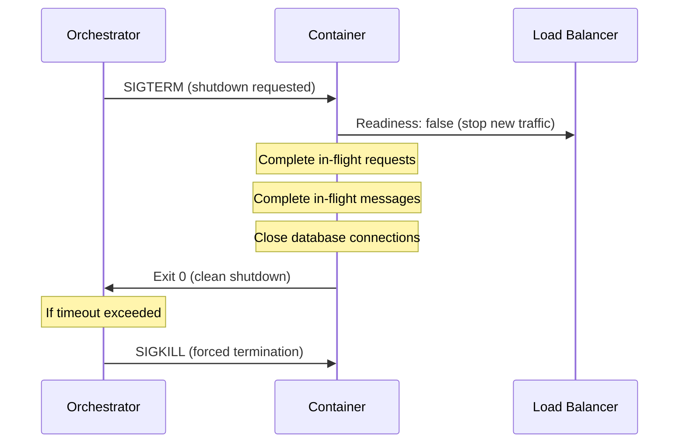
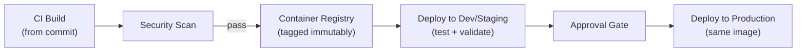

# Container and Workload Architecture

## Metadata

| Field | Value |
|-------|-------|
| Title | Kairo Container Platform and Workload Packaging Architecture |
| Document ID | KAI-INFRA-005 |
| Status | Draft |
| Version | 0.1 |
| Target Release | V1 |
| Owner | Container Platform and Workload Packaging Architect |
| Created | 2026-07-23 |
| Last Updated | 2026-07-23 |
| Reviewers | TODO |
| Related Documents | [Infrastructure Architecture](./Infrastructure-Architecture.md), [Hosting and Runtime Architecture](./Hosting-and-Runtime-Architecture.md), [Secure Development Lifecycle](../Security/Secure-Development-Lifecycle.md), [Environment Architecture](./Environment-Architecture.md) |
| Dependencies | [Infrastructure Architecture](./Infrastructure-Architecture.md), [Hosting and Runtime Architecture](./Hosting-and-Runtime-Architecture.md) |
| Forward References | CI/CD and Deployment Architecture (future document in this phase) |

---

## Applicable Version

This document defines V1 container and workload packaging architecture. V1 uses containers as the standard packaging unit, deployed to a managed container platform or orchestrator appropriate for the team's operational capacity. The architecture does not mandate Kubernetes in V1 — the simplest viable platform that meets requirements is preferred.

---

## Purpose

This document defines how Kairo application workloads are packaged into containers, how those containers are built, secured, promoted, and executed. It establishes the rules that ensure containers are immutable, promotable, secure, and operationally manageable.

Containers are the packaging boundary between application code and infrastructure. A well-designed container is immutable (same image everywhere), self-describing (health checks, resource needs), and secure (minimal privileges, scanned dependencies). A poorly designed container embeds secrets, relies on local filesystem, runs as root, and is unreproducible. This document prevents all the failure modes.

---

## Scope

This document covers:

- Container packaging principles and image ownership.
- Image immutability, promotion, and provenance.
- Runtime requirements (users, filesystem, resources, health checks).
- Configuration and secret injection (external to container).
- Security (scanning, privileges, base images).
- Worker, migration, and scheduled workload container patterns.
- Platform evaluation and V1 direction.

This document does not cover:

- Dockerfiles or container build scripts (application repositories).
- Kubernetes manifests, Helm charts, or orchestrator configuration (deployment repositories).
- Specific container registry product selection (infrastructure decisions).
- CI/CD pipeline implementation (see CI/CD and Deployment Architecture — forward reference).
- Resource limit numeric values (capacity planning/operations configuration).
- Container networking configuration (see [Network and Trust Boundaries](./Network-and-Trust-Boundaries.md)).

---

## Mandatory Principles

| # | Principle |
|---|-----------|
| 1 | Images are immutable build artifacts |
| 2 | The same approved image should be promoted across environments |
| 3 | Containers must not contain environment secrets |
| 4 | Containers should run with the minimum required privileges |
| 5 | Persistent business state must not depend on the container filesystem |
| 6 | Writable filesystem needs must be explicit |
| 7 | Shutdown behavior must protect in-flight requests and message processing |
| 8 | Image provenance must be traceable |
| 9 | Base images require ownership and patching |
| 10 | Vulnerable images must be blockable from production |
| 11 | Containerization does not require Kubernetes in V1 |
| 12 | Orchestration complexity must be justified by operational need |

---

## Container Fundamentals

### 1. Container Purpose

| Purpose | Detail |
|---------|--------|
| Packaging boundary | Encapsulates application code + runtime dependencies into a deployable unit |
| Reproducibility | Same image runs identically regardless of host environment |
| Isolation | Containers provide process-level isolation (not full VM isolation) |
| Portability | Same image runs on developer machine, CI, staging, production |
| Disposability | Containers are replaceable — terminate and restart without data loss |
| Not a VM | Containers are not long-lived servers to be patched in place. They are replaced. |

---

### 2. Container Image Ownership

| Rule | Detail |
|------|--------|
| Platform team owns base images | Base images (OS + runtime) are maintained by the platform team |
| Application team owns application images | Module/application images are owned by the developing team |
| Single Dockerfile per workload type | One Dockerfile produces the application image. Entry point configuration determines workload role. |
| Shared base | All application images derive from the same approved base image |
| Responsibility | Image owner is responsible for keeping dependencies updated and vulnerabilities resolved |

---

### 3. Image Immutability

**Images are immutable build artifacts.**

| Rule | Detail |
|------|--------|
| Built once | An image is built once from a specific commit. Never modified after build. |
| Tag represents content | An image tag (e.g., SHA-based or version) uniquely identifies the content |
| No in-place modification | Running containers are not patched in place. New image = new deployment. |
| Promotion moves image | The same binary image moves from staging to production. Not rebuilt. |
| Reproducible from source | Given the same commit, the build process produces a functionally equivalent image |
| No mutable "latest" in production | Production deployments reference specific, immutable tags (not `latest`) |

---

### 4. Base-Image Governance

**Base images require ownership and patching.**

| Rule | Detail |
|------|--------|
| Approved base images | Only approved, maintained base images may be used |
| Regular updates | Base images are updated on a defined schedule (monthly minimum or on security advisory) |
| Security patches | Critical security patches in the base image trigger immediate rebuild and redeploy |
| Minimal base | Base images contain the minimum required runtime (not full OS with unnecessary tools) |
| .NET runtime base | For Kairo: official .NET runtime images (ASP.NET Core runtime variant) |
| Ownership | Platform team owns and maintains the approved base image list |

---

### 5. Build Provenance

**Image provenance must be traceable.**

| Rule | Detail |
|------|--------|
| Source commit | Every image is traceable to the exact source commit that produced it |
| Build metadata | Image labels include: commit SHA, build timestamp, build pipeline ID |
| Audit trail | The CI/CD system records which pipeline built which image from which source |
| Signed (direction) | V2+: image signing for tamper detection. V1: provenance through CI/CD audit trail. |
| Registry of record | Images are stored in a controlled registry (not pulled from arbitrary sources) |

---

## Runtime Behavior

### 6. Runtime User

**Containers should run with the minimum required privileges.**

| Rule | Detail |
|------|--------|
| Non-root | Application containers run as a non-root user |
| Read-only filesystem (direction) | Container filesystem is read-only where feasible. Writable mounts only where explicitly needed. |
| No privilege escalation | Containers do not have `setuid` capabilities or privilege escalation |
| Minimal capabilities | Only required Linux capabilities are granted (drop all, add specific if needed) |
| No host access | Containers do not mount host filesystem or host network |

---

### 7. Filesystem Behavior

**Persistent business state must not depend on the container filesystem.**

| Rule | Detail |
|------|--------|
| Ephemeral by default | Container filesystem is ephemeral. Lost on container restart. |
| No local state | Application does not write business data to container filesystem |
| Temp files acceptable | Short-lived temporary files (request processing) are acceptable on ephemeral storage |
| Persistent storage external | All persistent data lives in database, object storage, or cache (external infrastructure) |
| Logs to stdout/stderr | Application logs to standard output (not to files inside the container) |

---

### 8. Ephemeral Storage

| Rule | Detail |
|------|--------|
| Purpose | Temporary processing space (file parsing, report generation) |
| Lifecycle | Exists only while the container runs. Lost on restart. |
| Size-limited | Ephemeral storage has defined limits (prevents runaway disk usage) |
| Not for persistence | Business data is never stored only in ephemeral storage |
| Cleanup | Application cleans up temp files after processing |

---

### 9. Persistent Storage

| Rule | Detail |
|------|--------|
| External only | Persistent storage uses managed infrastructure (database, object storage, cache) |
| Not container volumes for business data | Container volume mounts are not used for business-critical persistent data (V1) |
| Access via API/SDK | Application accesses persistent storage through client libraries, not filesystem mount |
| Backed up | Persistent infrastructure has its own backup (per [Infrastructure Architecture](./Infrastructure-Architecture.md)) |

---

### 10. Configuration Injection

**Containers must not contain environment secrets.**

| Rule | Detail |
|------|--------|
| Environment variables | Non-secret configuration injected via environment variables |
| External config | Configuration values come from the runtime environment, not baked into the image |
| Same image, different config | The same image runs in staging and production with different configuration |
| Config maps (direction) | Orchestrator-managed configuration maps for structured configuration |
| No hardcoded values | Connection strings, URLs, feature flags are never hardcoded in the image |

---

### 11. Secret Injection

| Rule | Detail |
|------|--------|
| Secrets management | Secrets injected at runtime from secrets management system (not baked into image) |
| Not in environment variables (preferred) | V1: environment variables acceptable for initial simplicity. Direction: secrets mounted as files or fetched from vault. |
| Not in source | Secrets never in source code, Dockerfiles, or image layers |
| Rotatable | Secrets can be rotated without rebuilding the image |
| Scoped | Each workload receives only the secrets it needs |
| Reference | Per [Secrets and Key Management](../Security/Secrets-and-Key-Management.md) |

---

### 12. Health Checks

| Check | Purpose | V1 Required |
|-------|---------|:---:|
| Liveness | "Is the process alive?" Restart if not. | Yes |
| Readiness | "Is the process ready to accept traffic?" Remove from load balancer if not. | Yes |
| Startup | "Has the process completed initialization?" Avoid premature liveness failures during startup. | Recommended |

---

### 13. Startup Checks

| Rule | Detail |
|------|--------|
| Purpose | Allow time for application initialization (database connection, warmup) before liveness checking begins |
| Behavior | While startup check is failing, liveness checks are not evaluated (prevents premature restart) |
| Timeout | Startup has a maximum allowed duration (after which the container is considered failed) |
| Logging | Startup progress is logged (initialization steps visible) |

---

### 14. Readiness Checks

| Rule | Detail |
|------|--------|
| Purpose | Indicate when the container is ready to receive traffic |
| Behavior | Container removed from load balancer when readiness fails. Re-added when it passes. |
| Dependencies | Readiness may check critical dependencies (database connectivity) |
| Not too strict | Readiness should not fail on transient issues that resolve in seconds |
| Deployment use | During rolling deployment, new containers must pass readiness before old containers are removed |

---

### 15. Graceful Shutdown

**Shutdown behavior must protect in-flight requests and message processing.**

| Rule | Detail |
|------|--------|
| Signal handling | Application handles shutdown signal (SIGTERM) gracefully |
| Drain period | After receiving shutdown signal, stop accepting new work but complete in-flight work |
| Request completion | In-flight HTTP requests are given time to complete (not immediately terminated) |
| Message completion | In-flight message/event processing completes or is safely abandoned (will retry) |
| Timeout | Graceful shutdown has a maximum duration (after which forced termination occurs) |
| Health update | Readiness check fails immediately on shutdown signal (stop receiving new traffic) |
| No data loss | Graceful shutdown ensures no business data is lost (transactions commit or roll back cleanly) |

---

### 16. Resource Requests and Limits Direction

| Aspect | Detail |
|--------|--------|
| Purpose | Declare expected resource consumption for scheduling and protection |
| CPU request | Minimum CPU the container needs (scheduling guarantee) |
| CPU limit | Maximum CPU the container may use (prevents resource monopolization) |
| Memory request | Minimum memory guaranteed |
| Memory limit | Maximum memory before OOM kill |
| Direction | V1: set conservative limits based on observed usage. Tune over time. |
| Not premature | Do not over-constrain before understanding actual resource patterns |
| Monitored | Resource usage monitored to inform limit tuning |

---

## Security

### 17. Logging

| Rule | Detail |
|------|--------|
| Stdout/stderr | Application writes structured logs to standard output (container runtime captures) |
| No log files inside container | Logs are not written to files within the container filesystem |
| Structured JSON | Logs are structured (JSON) for aggregation and searching |
| Classification-aware | Sensitive data not included in log output (per [Data Classification](../Data/Data-Classification-and-Sensitivity.md)) |
| Correlation IDs | All log entries include correlation and request identifiers |
| Log level configurable | Log level is configurable via environment variable (not hardcoded) |

---

### 18. Image Scanning

**Vulnerable images must be blockable from production.**

| Rule | Detail |
|------|--------|
| Scan on build | Images are scanned for known vulnerabilities during CI build |
| Scan on registry | Registry performs periodic re-scanning (new CVEs discovered after build) |
| Severity thresholds | Critical vulnerabilities block deployment. High vulnerabilities require assessment. |
| Actionable | Scan results are actionable (identify which package, which CVE, what fix) |
| Not ignored | Vulnerability findings are tracked and resolved (not permanently suppressed without justification) |

---

### 19. Dependency Scanning

| Rule | Detail |
|------|--------|
| Application dependencies | NuGet packages (and other dependencies) scanned for vulnerabilities |
| OS packages | Base image OS packages scanned |
| Runtime | .NET runtime version monitored for security updates |
| Separation | Dependency scanning is distinct from image scanning (may use different tools) |
| SBOM direction | Software Bill of Materials (SBOM) generation for V2+ compliance needs |

---

### 20. Registry Direction

| Rule | Detail |
|------|--------|
| Private registry | Images stored in a private container registry (not public Docker Hub for production images) |
| Access-controlled | Registry access requires authentication. Pull and push are separate permissions. |
| Per-environment (direction) | V1: single registry with environment-scoped access. V2+: separate registries per environment. |
| Retention | Old images retained for rollback window. Cleaned up after retention period. |
| No public pull for production | Production containers are not pulled from public registries at runtime |
| Mirrored base images | Approved base images mirrored into private registry (not pulled from public at build time in production) |

---

## Lifecycle

### 21. Image Promotion

**The same approved image should be promoted across environments.**

| Stage | What Happens |
|-------|-------------|
| Build | CI builds image from source commit. Tags with commit SHA + build number. |
| Scan | Image scanned for vulnerabilities. Critical findings block promotion. |
| Registry | Scanned image pushed to private registry with immutable tag. |
| Staging | Image deployed to staging with staging configuration. Validated. |
| Approval | Manual or automated approval gate before production. |
| Production | Same image deployed to production with production configuration. |

---

### 22. Rollback

| Rule | Detail |
|------|--------|
| Mechanism | Rollback deploys the previous known-good image (not a code revert and rebuild) |
| Fast | Rollback is fast (image already in registry, already validated) |
| Configuration preserved | Rollback deploys old image with current configuration (unless config caused the issue) |
| Retention | Previous images are retained in registry for the rollback window |
| Tested | Rollback procedure is tested periodically (not only during incidents) |

---

## Workload-Specific Containers

### 23. Worker Containers

| Aspect | Detail |
|--------|--------|
| Same image | Worker containers use the same application image as API containers |
| Different entry point | Configuration or command determines the workload role (worker mode) |
| No HTTP listener | Worker containers do not expose HTTP ports (except health check endpoint) |
| Graceful shutdown | Workers complete in-flight message processing on shutdown |
| Health check | Workers expose a health endpoint for liveness (process alive, can reach database) |
| Scaling | Worker replicas scaled based on queue depth or processing lag |

---

### 24. Migration Containers

**Containerization does not require Kubernetes in V1.**

| Aspect | Detail |
|--------|--------|
| Purpose | Runs database schema migrations during deployment |
| Same image | Uses the same application image (with migration entry point/command) |
| Run-to-completion | Container starts, runs migrations, exits. Not long-running. |
| Single execution | Only one migration container runs at a time (orchestrator or pipeline ensures this) |
| Failure handling | If migration fails, deployment is halted. Container exits with non-zero code. |
| Health check | Not applicable (run-to-completion, not long-running) |
| Privileged credentials | May require elevated database credentials (schema modification) |

---

### 25. Scheduled Workload Containers

| Aspect | Detail |
|--------|--------|
| V1 approach | Scheduled work runs within the worker container (internal scheduling with coordination) |
| Future approach | Scheduled jobs as separate run-to-completion containers (cron-like orchestration) |
| Single execution | Coordination ensures scheduled work runs once (not per replica) |
| Timeout | Scheduled containers have maximum execution duration |
| Observability | Scheduled job execution is logged and monitored (did it run? did it succeed?) |

---

### 26. Future Orchestration

| Aspect | Detail |
|--------|--------|
| V1 direction | Managed container platform (simplest viable: container app service, managed Kubernetes, or equivalent) |
| Complexity justified | Kubernetes or equivalent is used only if operational needs justify it |
| Managed preferred | Managed orchestration (control plane managed by cloud provider) over self-managed |
| Progressive | Start simple. Add orchestration features as operational needs grow. |
| Not required for containers | Containers can run on simpler platforms (Docker Compose for development, managed container service for production) |

---

## Platform Evaluation

| Platform Type | Simplicity | Scaling | Ops Burden | V1 Suitability |
|--------------|:---------:|:-------:|:----------:|:--------------:|
| **Managed container app platform** (e.g., App Service, Cloud Run, ECS Fargate) | High | Auto-scale | Low | **Recommended** |
| **Managed Kubernetes** (e.g., AKS, EKS, GKE) | Medium | Full control | Medium | Viable (if team has K8s experience) |
| **Self-managed Kubernetes** | Low | Full control | High | Not recommended (V1) |
| **Virtual machines** | Medium | Manual | Medium | Viable but less portable |
| **Serverless containers** (e.g., Azure Container Instances, Fargate spot) | High | Per-invocation | Low | Viable for scheduled/migration workloads |
| **Hybrid** (managed platform + serverless for jobs) | Medium | Mixed | Medium | Evaluated per workload |

### V1 Recommendation

| Direction | Detail |
|-----------|--------|
| **Managed container platform** as default | Simplest operational model. Auto-restart, health checking, scaling built in. |
| Kubernetes if team has capacity | If the team is Kubernetes-experienced, managed Kubernetes is a solid choice |
| Not over-engineered | A small team does not need a full Kubernetes cluster for two process types (API + worker) |
| Progressive adoption | Start with managed platform. Move to orchestrator when workload complexity justifies it. |
| **Orchestration complexity must be justified** | Running Kubernetes for two containers is overhead. Running it for ten workload types is justified. |

---

## Version Gate

| Version | Container and Workload Gate |
|---------|---------------------------|
| V1 | Container-packaged application (immutable images). Non-root execution. Health checks (liveness + readiness). Graceful shutdown with drain period. Configuration via environment variables. Secrets from management system (not in image). Image scanning in CI (critical blocks deployment). Structured logging to stdout. Private container registry. Same image promoted across environments. Rollback via previous image. Worker containers separate from API. Migration as run-to-completion container/step. |
| V2 | Image signing and verification. SBOM generation. Enhanced registry policies (per-environment separation). Scheduled jobs as dedicated containers. Serverless for specific workloads. Advanced resource management. |
| V3 | Full orchestration (if justified by workload count). Multi-region container deployment. Advanced security policies (pod security standards, network policies). Service mesh sidecar containers (if services extracted). |

---

## Decision Summary

| Decision | Rationale |
|----------|-----------|
| Containers as standard packaging | Reproducible, portable, immutable. Industry standard for modern applications. Enables consistent behavior across environments. |
| Same image promoted (not rebuilt per environment) | Ensures production runs exactly what was tested. Eliminates "works in staging, fails in prod" from rebuild differences. |
| Non-root execution | Minimizes blast radius of container compromise. Standard security best practice. |
| Secrets external (not in image) | Image may be accessed by many people (registry access). Secrets should be accessible only to the running workload. |
| Stdout/stderr logging | Container runtime captures logs. No log rotation management inside container. Log aggregation handled externally. |
| Managed platform for V1 (not self-managed K8s) | Small team should not manage a Kubernetes control plane. Managed platform provides the needed features with lower operational burden. |
| Same image for API and worker (different entry point) | Single build artifact. Single scan. Single promotion pipeline. Workload role determined by runtime configuration. |
| Vulnerability scanning blocks deployment | Deploying known-vulnerable images is an unacceptable risk. Blocking forces resolution. |

---

## Alternatives Considered

| Alternative | Rejected Because |
|------------|-----------------|
| VMs instead of containers | Less portable, slower to deploy, harder to reproduce, harder to scale. Containers are more appropriate for modern applications. |
| Self-managed Kubernetes for V1 | Operational overhead for a small team. Managed Kubernetes or simpler platforms provide the needed features. |
| Separate images per workload | Build and scan overhead multiplied. Same codebase → same image with different entry points is simpler. |
| Secrets in environment variables baked into image | Secrets visible in image layers. Anyone with registry access sees them. External injection is safer. |
| Root execution | Larger blast radius on compromise. Non-root is standard security practice with minimal effort. |
| Log files inside container | Requires log rotation, disk management, and sidecar forwarding. Stdout is simpler and standard. |
| Serverless for all workloads | Cold-start latency for API. Continuous workloads (workers) are more cost-effective as persistent containers. |
| No vulnerability scanning | Deploying known-vulnerable code is irresponsible. Scanning catches issues before production. |

---

## Architecture Impact

| Concern | Impact |
|---------|--------|
| Application design | Must be containerizable (no host dependencies, no local-file persistence, configurable via environment). Must implement health checks and graceful shutdown. |
| Build process | CI builds a single container image per commit. Scans for vulnerabilities. Pushes to private registry. |
| Deployment | Deployment = deploying a specific image tag with specific configuration. Not rebuilding. |
| Operations | Operators manage container platform, scaling, health, and registry. Do not manage individual processes inside containers. |
| Security | Images are scanned, signed (future), and non-root. Secrets are external. Vulnerable images are blocked. |
| Rollback | Fast rollback by deploying previous image tag. No rebuild required. |

---

## Implementation Impact

| Area | Impact |
|------|--------|
| Application | Must support SIGTERM graceful shutdown. Must implement health endpoints. Must log to stdout. Must work as non-root. Must not persist to local filesystem. Must accept configuration from environment. |
| Platform/DevOps | Must build and scan images in CI. Must manage private registry. Must configure container platform. Must implement image promotion pipeline. Must set resource limits. |
| Security | Must review base images. Must patch base images on schedule. Must block vulnerable images. Must validate non-root execution. |
| Operations | Must monitor container health. Must manage scaling. Must maintain registry retention. Must execute rollback when needed. |
| Development | Must develop with containers locally (Docker Compose or equivalent). Must understand health check behavior. Must test graceful shutdown. |

---

## Security Responsibilities

| Role | Container Security Responsibilities |
|------|-------------------------------------|
| Platform/DevOps | Maintains base images. Configures scanning. Manages registry access. Sets security policies (non-root, capabilities). |
| Security Team | Reviews container security posture. Validates scanning effectiveness. Reviews vulnerability findings. Audits registry access. |
| Module Teams | Keep application dependencies updated. Respond to vulnerability findings in their dependencies. Implement health checks and shutdown correctly. |
| Operations | Monitors container health. Responds to failed deployments. Manages rollback execution. |

---

## Multi-Tenancy Responsibilities

| Responsibility | Detail |
|---------------|--------|
| Shared containers | All tenants are served by the same container instances (application-level isolation) |
| No per-tenant containers (V1) | Tenant isolation is not through separate containers. It is through application logic. |
| Container does not know tenant | Container is tenant-unaware. The application inside resolves tenant per-request. |
| Future per-tenant (V3+) | Dedicated containers for enterprise tenants is a future possibility (not V1). |

---

## Out of Scope

This document does not define:

- Dockerfiles or multi-stage build configurations (application repositories).
- Kubernetes manifests, Helm charts, or Kustomize (deployment repositories).
- Container registry product selection (infrastructure decisions).
- Specific resource limit values (capacity planning).
- CI/CD pipeline scripts (pipeline repositories).
- Container networking details (see [Network and Trust Boundaries](./Network-and-Trust-Boundaries.md)).
- Orchestrator selection (infrastructure/operational decision within recommended direction).

---

## Future Considerations

- **Image signing** — Cryptographic signatures for tamper detection and provenance verification.
- **SBOM generation** — Software Bill of Materials for supply-chain compliance.
- **Admission control** — Orchestrator policies that prevent non-compliant containers from running.
- **Service mesh sidecars** — Sidecar containers for inter-service security and observability (if services extracted).
- **Multi-arch images** — ARM/x86 multi-architecture builds for cost optimization.
- **Distroless base images** — Minimal base images without package managers or shells.
- **Runtime security monitoring** — Detect anomalous behavior within running containers.
- **Serverless for scheduled jobs** — Run-to-completion containers triggered by schedule (cost optimization).

---

## Future Refactoring Triggers

This document should be revisited when:

- Workload count exceeds what a simple platform can manage (trigger for full orchestration evaluation).
- Service extraction creates many independent container deployments (trigger for advanced orchestration).
- Supply-chain security requirements mandate signing and SBOM (trigger for enhanced provenance).
- Multi-region deployment requires advanced container placement (trigger for orchestration enhancement).
- Cost optimization requires spot/preemptible instances (trigger for workload scheduling strategy).
- Compliance requires runtime security monitoring (trigger for runtime security tooling).

---

## Change History

| Version | Date | Author | Description |
|---------|------|--------|-------------|
| 0.1 | 2026-07-23 | Container Platform and Workload Packaging Architect | Initial draft — container and workload architecture |
