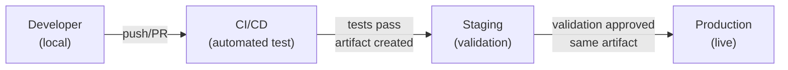

# Environment Architecture

## Metadata

| Field | Value |
|-------|-------|
| Title | Kairo Environment Isolation, Promotion, and Release Architecture |
| Document ID | KAI-INFRA-002 |
| Status | Draft |
| Version | 0.1 |
| Target Release | V1 |
| Owner | Environment Isolation and Release Architecture Lead |
| Created | 2026-07-23 |
| Last Updated | 2026-07-23 |
| Reviewers | TODO |
| Related Documents | [Infrastructure Architecture](./Infrastructure-Architecture.md), [Data Classification and Sensitivity](../Data/Data-Classification-and-Sensitivity.md), [Secrets and Key Management](../Security/Secrets-and-Key-Management.md), [Secure Development Lifecycle](../Security/Secure-Development-Lifecycle.md), [Compliance Readiness](../Security/Compliance-Readiness.md) |
| Dependencies | [Infrastructure Architecture](./Infrastructure-Architecture.md), [Secrets and Key Management](../Security/Secrets-and-Key-Management.md) |

---

## Applicable Version

This document defines V1 environment architecture. V1 requires three environments (development, staging, production) with clear isolation, promotion flow, and data-handling rules. Additional environments (ephemeral previews, disaster-recovery, dedicated tenant) are identified for future implementation.

---

## Purpose

This document defines the environment model for the Kairo platform — what environments exist, what each is for, how they are isolated, how artifacts move between them, and what rules govern data, credentials, and access in each.

Environments are the bridge between "code that works on a developer's machine" and "production serving real customers." Without explicit environment architecture, teams leak production credentials into development, copy real customer data for testing, deploy unreproducible changes, and create environments that diverge silently from production. This document prevents all of these.

---

## Scope

This document covers:

- Environment definitions, purposes, and ownership.
- Isolation rules between production and non-production.
- Promotion flow (how artifacts move from development to production).
- Data classification, credential, and access rules per environment.
- Environment parity, drift prevention, and configuration management.
- V1 required environments and future environment direction.

This document does not cover:

- Cloud account or subscription naming (deployment configuration).
- Resource group or project structure (deployment configuration).
- CI/CD pipeline YAML or scripts (pipeline repositories).
- Terraform or IaC module definitions (infrastructure-as-code repositories).
- Specific domain names or URLs (deployment configuration).
- Container registry configuration (deployment configuration).

---

## Mandatory Principles

| # | Principle |
|---|-----------|
| 1 | Production credentials must never be used in lower environments |
| 2 | Production personal data must not be casually copied into non-production |
| 3 | Environment promotion moves approved artifacts, not manually reconstructed code |
| 4 | Configuration differences must be intentional and documented |
| 5 | Production access must be restricted and audited |
| 6 | Test integrations must not trigger real financial or customer effects |
| 7 | Ephemeral environments must have automatic expiration |
| 8 | Environment parity does not require identical scale |
| 9 | Non-production environments must preserve core security boundaries |
| 10 | Dedicated tenant environments are future capabilities unless approved elsewhere |

---

## Environments

### 1. Local Development

| Aspect | Detail |
|--------|--------|
| **Purpose** | Individual developer workstation for coding, debugging, and unit testing |
| **Intended users** | Individual developers |
| **Data classification** | Public/Internal only. Synthetic seed data. No real customer data. |
| **Connectivity** | Local only. No connection to shared infrastructure. |
| **Credential rules** | Local-only credentials (no shared secrets, no production keys). Mock/fake provider integrations. |
| **Deployment source** | Developer's current working branch |
| **Configuration ownership** | Developer (personal environment settings) |
| **Observability expectations** | Console logging, local debugging tools |
| **Availability expectations** | None — developer controls their own environment |
| **Data-reset policy** | Developer resets at will (seed scripts) |
| **External integration policy** | Mocked or sandboxed. **No real provider connections.** |
| **V1 or future status** | **V1** |

---

### 2. Shared Development

| Aspect | Detail |
|--------|--------|
| **Purpose** | Shared environment for integration testing across the team. Validates that code works beyond a single developer's machine. |
| **Intended users** | Development team (all developers) |
| **Data classification** | Internal. Synthetic test data only. No real customer data. |
| **Connectivity** | Private network. Accessible to development team. Not internet-accessible. |
| **Credential rules** | Development-specific credentials. Test-mode provider keys (sandboxed). **Never production credentials.** |
| **Deployment source** | Main branch (automatic on merge) or designated development branch |
| **Configuration ownership** | Platform/DevOps team |
| **Observability expectations** | Structured logging. Basic metrics. Not production-grade alerting. |
| **Availability expectations** | Best-effort. Downtime acceptable for maintenance. |
| **Data-reset policy** | Periodically reset to seed state. Development team may request resets. |
| **External integration policy** | Test/sandbox mode only. No real charges. No real customer communication. |
| **V1 or future status** | **V1** (may be combined with staging for very small teams initially) |

---

### 3. Automated Test (CI)

| Aspect | Detail |
|--------|--------|
| **Purpose** | Ephemeral environment created by CI/CD pipeline for automated test execution |
| **Intended users** | CI/CD system (automated, not human-interactive) |
| **Data classification** | Test fixtures only. Completely synthetic. |
| **Connectivity** | Isolated. Created and destroyed per pipeline run. |
| **Credential rules** | CI-specific credentials. Mock providers. No shared secrets with any persistent environment. |
| **Deployment source** | The specific commit/branch being tested |
| **Configuration ownership** | CI/CD pipeline configuration |
| **Observability expectations** | Test output and logs captured per run. Discarded after retention period. |
| **Availability expectations** | None — ephemeral. Exists only during test execution. |
| **Data-reset policy** | N/A — destroyed after each run |
| **External integration policy** | Fully mocked. No external provider connections. |
| **V1 or future status** | **V1** |

---

### 4. Integration

| Aspect | Detail |
|--------|--------|
| **Purpose** | Validate integration with external providers and cross-module interaction in a stable shared environment |
| **Intended users** | QA team, integration testing automation |
| **Data classification** | Internal. Synthetic test data. Provider sandbox data. |
| **Connectivity** | Private network + sandbox connections to external providers (payment test mode, shipping test mode) |
| **Credential rules** | Test-mode provider credentials only. **No real financial processing.** |
| **Deployment source** | Release candidate builds (same artifact as will go to staging/production) |
| **Configuration ownership** | Platform/DevOps team |
| **Observability expectations** | Full logging and metrics (validates observability works before staging) |
| **Availability expectations** | Business-hours availability. May be offline outside working hours. |
| **Data-reset policy** | Periodically reset. Before and after integration test runs as needed. |
| **External integration policy** | Test/sandbox mode for all external providers. Validates connectivity and flow without real effects. |
| **V1 or future status** | **Future (V2)** — V1 uses staging for integration validation |

---

### 5. Staging

| Aspect | Detail |
|--------|--------|
| **Purpose** | Pre-production environment that mirrors production configuration. Final validation before production deployment. |
| **Intended users** | QA team, product team, operations team, selected stakeholders |
| **Data classification** | Internal. Synthetic test data. **Never real production customer data.** |
| **Connectivity** | Private network. May connect to provider sandbox environments. |
| **Credential rules** | Staging-specific credentials. Test-mode provider keys. **Never production credentials.** |
| **Deployment source** | Same artifact (container image) that will be deployed to production |
| **Configuration ownership** | Platform/DevOps team |
| **Observability expectations** | Full observability stack (same tools as production, different retention) |
| **Availability expectations** | High during business hours. Brief maintenance acceptable. |
| **Data-reset policy** | Reset before release validation. May be refreshed with synthetic data. |
| **External integration policy** | Test/sandbox mode. Validates integration flows without real charges or customer effects. |
| **V1 or future status** | **V1** |

---

### 6. Production

| Aspect | Detail |
|--------|--------|
| **Purpose** | Live environment serving real customers with real data |
| **Intended users** | End users (customers, tenants, administrators). Operations team (monitoring, incident response). |
| **Data classification** | Confidential to Restricted. Real customer data. Full classification rules apply. |
| **Connectivity** | Public-facing (load balancer). Private data tier. Full network isolation per [Infrastructure Architecture](./Infrastructure-Architecture.md). |
| **Credential rules** | Production-only credentials. **Never shared with other environments.** Rotatable. Managed via secrets service. |
| **Deployment source** | Approved, tested artifact (same image validated in staging) |
| **Configuration ownership** | Platform/DevOps team with change control |
| **Observability expectations** | Full production observability. Alerting active. On-call response. |
| **Availability expectations** | Highest. Zero-downtime deployments. SLA-driven availability. |
| **Data-reset policy** | **Never.** Production data is not reset. Changes through application logic only. |
| **External integration policy** | Live provider connections. Real financial processing. Real customer communication. |
| **V1 or future status** | **V1** |

---

### 7. Disaster-Recovery Environment

| Aspect | Detail |
|--------|--------|
| **Purpose** | Standby environment for failover if production becomes unavailable |
| **Intended users** | Operations team (failover execution) |
| **Data classification** | Same as production (replicated data) |
| **Connectivity** | Same network architecture as production (activatable) |
| **Credential rules** | Production-equivalent credentials (separate but equal) |
| **Deployment source** | Same artifact as production (replicated or ready to deploy) |
| **Configuration ownership** | Platform/DevOps team |
| **Observability expectations** | Health monitoring (is it ready for failover?) |
| **Availability expectations** | Ready within defined RTO |
| **Data-reset policy** | Continuously or periodically synced from production |
| **External integration policy** | Same as production (when activated) |
| **V1 or future status** | **Future (V2+)** — V1 relies on managed-service failover within single region |

---

### 8. Ephemeral Preview Environment

| Aspect | Detail |
|--------|--------|
| **Purpose** | Temporary environment for pull-request review or feature demonstration |
| **Intended users** | Developers, reviewers, product team |
| **Data classification** | Internal. Synthetic seed data. |
| **Connectivity** | Temporary private URL. May be accessible within team network. |
| **Credential rules** | Ephemeral credentials. Mock providers. Auto-destroyed with environment. |
| **Deployment source** | Specific branch/PR being reviewed |
| **Configuration ownership** | CI/CD system (automated creation and destruction) |
| **Observability expectations** | Basic logging. Not production-grade. |
| **Availability expectations** | None — ephemeral. **Must have automatic expiration.** |
| **Data-reset policy** | N/A — destroyed automatically after expiration period |
| **External integration policy** | Fully mocked. No external connections. |
| **V1 or future status** | **Future (V2)** |

---

### 9. Future Dedicated Tenant Environment

| Aspect | Detail |
|--------|--------|
| **Purpose** | Isolated infrastructure for enterprise tenants requiring physical separation |
| **Intended users** | Enterprise customers with regulatory or contractual isolation requirements |
| **Data classification** | Per-tenant. Physically isolated. Tenant's data classification. |
| **Connectivity** | Dedicated. May be in tenant-specific region. |
| **Credential rules** | Per-tenant credentials. Isolated from shared environment. |
| **Deployment source** | Same application artifact. Tenant-specific configuration. |
| **Configuration ownership** | Platform team with tenant-specific configuration |
| **Observability expectations** | Full. May be tenant-accessible. |
| **Availability expectations** | Per-tenant SLA |
| **Data-reset policy** | Per-tenant lifecycle |
| **External integration policy** | Per-tenant integration configuration |
| **V1 or future status** | **Future (V3+)** — **Dedicated tenant environments are future capabilities.** |

---

## Environment Isolation

| Rule | Detail |
|------|--------|
| Production is physically isolated | Production infrastructure shares no resources with non-production |
| Credential isolation | Each environment has its own credentials. No sharing. |
| Network isolation | Non-production cannot reach production systems (and vice versa) |
| Data isolation | Production data stays in production. Synthetic data in non-production. |
| **Non-production preserves security** | **Non-production environments must preserve core security boundaries** — authentication, authorization, and tenant isolation are still enforced even in development/staging |
| Independent failure | Non-production failures do not affect production. Production failures do not affect non-production. |
| Separate monitoring | Production monitoring and non-production monitoring are independent |

---

## Promotion Path

**Environment promotion moves approved artifacts, not manually reconstructed code.**

| Stage | What Moves | What Changes |
|-------|-----------|--------------|
| Developer → CI | Source code (commit/branch) | CI builds and tests. Creates container image. |
| CI → Staging | Container image (immutable artifact) | Only configuration changes (staging secrets, staging URLs) |
| Staging → Production | Same container image | Only configuration changes (production secrets, production URLs) |

| Rule | Detail |
|------|--------|
| Same artifact | The exact same container image tested in staging is deployed to production |
| No rebuild | Production does not rebuild from source. It uses the pre-tested artifact. |
| Configuration only | Differences between staging and production are configuration (environment variables, secrets), not code. |
| Approval gate | Promotion from staging to production requires explicit approval |
| Rollback = previous artifact | Rolling back means deploying the previous known-good image |

---

## Configuration Differences

**Configuration differences must be intentional and documented.**

| Configuration Type | Per-Environment | Example |
|-------------------|:---:|---------|
| Database connection string | Yes | Different host per environment |
| API keys / secrets | Yes | Test keys (staging) vs live keys (production) |
| Feature flags | Possibly | Features enabled in staging before production |
| Log level | Yes | Verbose in development, standard in production |
| Rate limits | Possibly | Relaxed in development, enforced in production |
| Domain names / URLs | Yes | staging.kairo.dev vs api.kairo.com |
| Scaling (replicas) | Yes | 1 replica (staging) vs 2+ (production) |
| Backup retention | Yes | Short (staging) vs long (production) |
| Alert routing | Yes | Dev channel (staging) vs on-call (production) |

| Rule | Detail |
|------|--------|
| Documented | Every intentional difference is documented |
| Minimal | Fewer differences = fewer production surprises |
| Code identical | Application code is the same. Only configuration differs. |
| Drift detected | Unintentional configuration drift is detected and corrected |

---

## Test versus Live Provider Credentials

**Test integrations must not trigger real financial or customer effects.**

| Environment | Provider Mode | Effects |
|-------------|--------------|---------|
| Local development | Mock/fake | No provider communication |
| CI (automated test) | Mock/fake | No provider communication |
| Shared development | Sandbox/test | Provider sandbox — no real charges or emails |
| Staging | Sandbox/test | Provider sandbox — no real charges or emails |
| Production | **Live** | **Real charges, real emails, real effects** |

| Rule | Detail |
|------|--------|
| Test mode exists for reason | Payment providers, email services, and SMS providers all offer test modes. Use them. |
| No real charges in non-prod | A staging test must never charge a real credit card |
| No real emails in non-prod | Staging must never email real customers |
| Test credentials separate | Test API keys are separate from production API keys |
| Clearly labeled | Test transactions are clearly distinguishable from real transactions (in provider dashboards) |

---

## Production Access

**Production access must be restricted and audited.**

| Rule | Detail |
|------|--------|
| Restricted | Only authorized personnel can access production infrastructure |
| MFA required | Multi-factor authentication for production access |
| Audited | Every production access is logged (who, when, what) |
| Time-limited | Elevated access grants are time-limited (not permanent) |
| Justified | Production access requires justification (incident, deployment, investigation) |
| Break-glass | Emergency access procedure for urgent situations (still audited) |
| No casual access | Developers do not routinely access production for debugging (use observability tools instead) |

---

## Non-Production Data

**Production personal data must not be casually copied into non-production.**

| Rule | Detail |
|------|--------|
| Synthetic data | Non-production environments use synthetic (fake) data |
| No production copies | Production database dumps are not restored into staging or development |
| Anonymization exception | If production-like data is needed (rare), it must be anonymized/de-identified before use |
| Seed scripts | Reproducible seed scripts create consistent test data |
| Classification still applies | Even synthetic data in non-production follows data handling rules (no leaking patterns that could reveal real data) |
| Tenant test data | Test tenants with synthetic data. Not real tenant data in non-production. |

---

## Preview Environments

**Ephemeral environments must have automatic expiration.**

| Rule | Detail |
|------|--------|
| Purpose | Temporary environment for PR review or feature demonstration |
| Creation | Automated (CI/CD creates on PR opening or manual trigger) |
| Destruction | Automated after expiration period (e.g., 48 hours, or on PR merge/close) |
| Data | Ephemeral synthetic data (seed script). Destroyed with environment. |
| Credentials | Temporary. Auto-destroyed. Never shared with persistent environments. |
| V1 status | Future (V2). V1 uses staging for validation. |

---

## Environment Parity

**Environment parity does not require identical scale.**

| Aspect | Parity Required | Scale Parity Required |
|--------|:---:|:---:|
| Application version (code) | **Yes** | — |
| Configuration structure | **Yes** | — |
| Database schema | **Yes** | — |
| Infrastructure type (managed services) | **Yes** (same service type) | **No** (smaller tier acceptable) |
| Network architecture pattern | **Yes** (same zones) | **No** (fewer replicas acceptable) |
| Security boundaries | **Yes** | — |
| Monitoring tools | **Yes** (same tools) | **No** (less retention acceptable) |
| Scale (replicas, instance size) | **No** | **No** (production may be larger) |
| Data volume | **No** | — |

| Rule | Detail |
|------|--------|
| Same type, different size | Staging uses the same database technology as production (but smaller instance) |
| Same boundaries | Staging has the same network zones and security boundaries as production |
| Confidence | Parity ensures staging validation is meaningful for production deployment |
| Cost-conscious | Non-production does not need production-scale infrastructure |

---

## Environment Drift

| Rule | Detail |
|------|--------|
| Definition | Unintentional differences between environments that should be identical |
| Detection | Infrastructure-as-code and configuration management detect drift |
| Prevention | All changes through automation. Manual changes are exceptional and audited. |
| Correction | Detected drift is corrected to match the authoritative configuration |
| Production is authoritative | If staging and production differ unintentionally, production's state is correct and staging is corrected |

---

## Destructive, Incident, and Recovery Testing

| Testing Type | Where | Rules |
|-------------|-------|-------|
| Destructive testing (chaos) | Non-production only (V1). Production (future with controls). | Never in production without formal chaos engineering process. |
| Incident simulation | Staging | Validate incident response procedures without affecting production |
| Recovery testing | Staging (or dedicated DR environment) | Test backup restoration, failover procedures. Use staging or DR environment. |
| Load testing | Staging or dedicated load-test environment | Never against production without explicit approval and controls |
| Security testing (pentesting) | Staging | Validate security without risking production data |

---

## Environment Responsibility Matrix

| Responsibility | Developer | QA/Test | Platform/DevOps | Security | Operations |
|---------------|:---:|:---:|:---:|:---:|:---:|
| Local environment setup | **Own** | — | Provide tooling | — | — |
| Shared development | Use | Use | **Own** | Review | — |
| CI environment | — | — | **Own** | Review | — |
| Staging | Use | **Use** (validation) | **Own** | Review | Monitor |
| Production | — | — | **Own** (deploy) | **Review** | **Own** (operate) |
| Credentials per env | — | — | **Own** | **Review** | Monitor |
| Data seeding (non-prod) | Contribute | **Own** (test data) | Provide tooling | Review (classification) | — |
| Access control | — | — | **Own** | **Own** (policy) | Enforce |
| Monitoring per env | — | — | **Own** (setup) | — | **Own** (respond) |
| Drift detection | — | — | **Own** | — | Monitor |

---

## Data-Handling Matrix

| Environment | Real Customer Data | Synthetic Data | Provider Mode | Credential Type | Audit Required |
|-------------|:---:|:---:|------|------|:---:|
| Local development | Never | Yes | Mock | Local-only | No |
| Shared development | Never | Yes | Sandbox | Development-specific | No |
| CI (automated test) | Never | Test fixtures | Mock | Ephemeral | No |
| Integration | Never | Yes | Sandbox | Test-mode | No |
| Staging | Never | Yes | Sandbox | Staging-specific | No |
| Production | **Yes** | — | **Live** | **Production-only** | **Yes** |
| DR environment | **Yes** (replicated) | — | Live (when active) | Production-equivalent | **Yes** |
| Preview (ephemeral) | Never | Seed | Mock | Ephemeral | No |
| Dedicated tenant | **Yes** (tenant-specific) | — | Live | Tenant-specific | **Yes** |

---

## V1 versus Future Environment Table

| Environment | V1 | V2 | V3+ |
|-------------|:---:|:---:|:---:|
| Local development | **Yes** | Yes | Yes |
| Shared development | **Yes** | Yes | Yes |
| CI (automated test) | **Yes** | Yes | Yes |
| Integration (dedicated) | — | **Yes** | Yes |
| Staging | **Yes** | Yes | Yes |
| Production | **Yes** | Yes | Yes |
| Disaster recovery (standby) | — | **Yes** | Yes |
| Ephemeral preview | — | **Yes** | Yes |
| Dedicated tenant | — | — | **Evaluated** |
| Load-test (dedicated) | — | **Yes** | Yes |

V1 requires: **Local + CI + Staging + Production** (minimum 4 environments including local).

---

## Version Gate

| Version | Environment Architecture Gate |
|---------|-------------------------------|
| V1 | Local development with synthetic data and mocked providers. CI environment for automated testing (ephemeral). Staging environment mirroring production type (smaller scale, sandbox providers). Production environment with full isolation, production credentials, and real provider connections. Environment promotion via same container image. Configuration-only differences documented. Production access restricted and audited. No production data in non-production. |
| V2 | Dedicated integration environment with sandbox providers. Ephemeral preview environments (auto-created, auto-destroyed). Disaster-recovery standby environment. Dedicated load-testing environment. Enhanced drift detection automation. |
| V3 | Dedicated tenant environments (enterprise isolation). Multi-region production environments. Chaos engineering in production (controlled). Automated environment provisioning for new developers. |

---

## Decision Summary

| Decision | Rationale |
|----------|-----------|
| Minimum 4 environments for V1 (local, CI, staging, production) | Minimum viable promotion path. Less than this creates risk. More than this adds operational overhead for a small team. |
| Same artifact promoted (not rebuilt) | Ensures production runs exactly what was tested. Rebuild introduces risk of different output. |
| Synthetic data in non-production | Real customer data in non-production creates privacy risk, compliance risk, and accidental exposure risk. |
| Provider sandbox/test mode in non-production | Prevents accidental real charges, real emails, or real effects from testing activities. |
| Production access restricted | Casual production access creates change risk, data exposure risk, and accountability gaps. |
| Environment parity ≠ scale parity | Same technology type ensures staging validation is meaningful. Same scale would be wasteful for non-production. |
| Ephemeral preview environments are V2 | Useful but not essential for V1 with a small team. CI + staging provides sufficient validation initially. |
| DR environment is V2 | V1 relies on managed-service failover (database automated recovery). Dedicated DR environment is V2 investment. |

---

## Alternatives Considered

| Alternative | Rejected Because |
|------------|-----------------|
| Single shared environment (no staging) | No validation step before production. Deployments go straight to customers. Unacceptable risk. |
| Production data in staging | Privacy risk. Compliance risk. Developers see real customer data without authorization. Synthetic data serves the same validation purpose. |
| Different artifact per environment (rebuild) | What was tested in staging may differ from what runs in production. "Works in staging, breaks in prod" becomes possible. |
| Shared credentials across environments | Compromised non-production credential becomes production credential. Blast radius of credential leak is maximized. |
| No CI environment (manual testing only) | Manual testing is slow, inconsistent, and non-reproducible. CI provides consistent automated validation. |
| Production-like scale for all environments | Wasteful. Non-production environments do not need production scale. Same type at smaller scale is sufficient. |
| Dedicated DR in V1 | Operational overhead for a small team. Managed-service failover provides adequate DR for V1 business stage. |
| Everyone has production access | Accountability gap. Accidental changes. Casual data access. Restricted access with audit is safer. |

---

## Architecture Impact

| Concern | Impact |
|---------|--------|
| Application design | Application must be configurable via environment variables (not hard-coded to any environment). Must work with both mock and real providers. |
| Deployment | CI/CD pipeline must build once, deploy to multiple environments with different configuration. |
| Data management | Seed scripts required for non-production. Data lifecycle (reset, refresh) defined per environment. |
| Security | Credentials isolated per environment. Production access controlled. Non-production still enforces auth/authz. |
| Testing | Test strategy aligns with environment capabilities (unit tests in CI, integration in staging, no testing in production). |
| Operations | Operations team owns production and staging. Developers own local and shared development. |

---

## Implementation Impact

| Area | Impact |
|------|--------|
| Application | Must support configuration injection. Must handle mock/sandbox providers gracefully. Must not assume any specific environment. |
| Platform/DevOps | Must provision and maintain all environments. Must implement promotion pipeline. Must manage per-environment credentials. Must detect drift. |
| QA/Testing | Must define test data strategy. Must validate in staging before production promotion. |
| Security | Must review environment isolation. Must manage per-environment credentials. Must audit production access. |
| Operations | Must monitor production. Must maintain production access controls. Must execute recovery testing in staging. |
| Developers | Must use local development effectively. Must not depend on production access for debugging. Must create reproducible seed data. |

---

## Security Responsibilities

| Role | Environment Security Responsibilities |
|------|--------------------------------------|
| Platform/DevOps | Implements environment isolation. Manages per-environment credentials. Controls production access. Detects drift. |
| Security Team | Reviews isolation design. Validates credential separation. Audits production access. Reviews data handling rules. |
| Developers | Use mocked providers locally. Do not commit credentials. Do not copy production data. Report drift. |
| Operations | Monitors production access. Responds to unauthorized access attempts. Maintains audit logs. |

---

## Multi-Tenancy Responsibilities

| Responsibility | Detail |
|---------------|--------|
| Tenant isolation in non-production | Non-production environments enforce tenant isolation (same code path as production) |
| Test tenants | Non-production uses synthetic test tenants (not real tenant data) |
| Dedicated tenant environment (future) | V3+ capability for enterprise customers requiring physical isolation |
| Production tenants never in non-production | Real tenant data never copied to non-production environments |

---

## Out of Scope

This document does not define:

- Cloud account or subscription naming conventions (deployment configuration).
- Resource group or project structure (deployment configuration).
- CI/CD pipeline scripts or YAML (pipeline repositories).
- Terraform or IaC module definitions (infrastructure-as-code repositories).
- Specific domain names or URLs per environment (deployment configuration).
- Container registry names or policies (deployment configuration).
- Alert routing configuration per environment (operations configuration).
- Specific environment sizing (capacity planning).

---

## Future Considerations

- **Ephemeral preview environments** — Auto-created per PR for isolated review.
- **Dedicated load-testing environment** — Isolated from staging to prevent interference with validation.
- **Multi-region production** — Multiple production deployments in different geographic regions.
- **Dedicated tenant environments** — Enterprise customers with physical isolation requirements.
- **Environment-as-code** — Full environment provisioning from a single configuration file.
- **Developer environment automation** — One-command developer environment setup.
- **Environment cost monitoring** — Per-environment cost tracking and optimization.
- **Compliance-specific environments** — Environments configured for specific regulatory frameworks.

---

## Future Refactoring Triggers

This document should be revisited when:

- Team grows beyond what shared development + staging can serve (trigger for additional environments).
- PR review needs exceed staging capacity (trigger for ephemeral preview environments).
- DR SLA tightens (trigger for dedicated DR environment).
- Enterprise customers require physical isolation (trigger for dedicated tenant environments).
- Multi-region deployment is needed (trigger for multi-region production environment architecture).
- Load testing interferes with staging validation (trigger for dedicated load-test environment).
- Compliance audit requires specific environment controls (trigger for compliance environment documentation).

---

## Change History

| Version | Date | Author | Description |
|---------|------|--------|-------------|
| 0.1 | 2026-07-23 | Environment Isolation and Release Architecture Lead | Initial draft — environment architecture |
