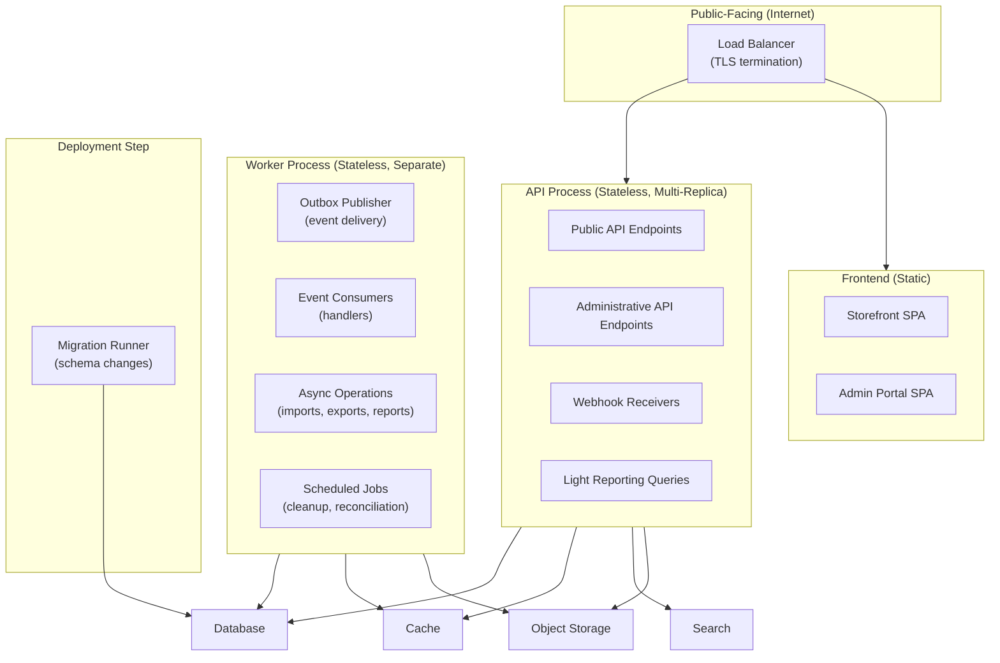
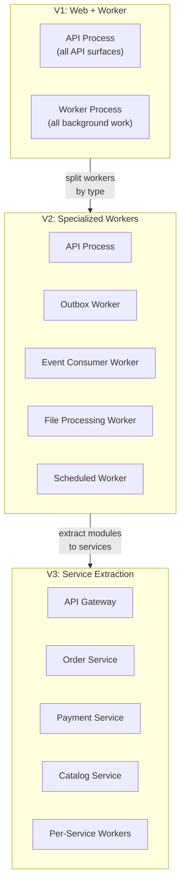

# Hosting and Runtime Architecture

## Metadata

| Field | Value |
|-------|-------|
| Title | Kairo Application Hosting and Runtime Architecture |
| Document ID | KAI-INFRA-003 |
| Status | Draft |
| Version | 0.1 |
| Target Release | V1 |
| Owner | Application Hosting and Runtime Architecture Lead |
| Created | 2026-07-23 |
| Last Updated | 2026-07-23 |
| Reviewers | TODO |
| Related Documents | [Infrastructure Architecture](./Infrastructure-Architecture.md), [Monolith Strategy](../Monolith-Strategy.md), [Module Architecture](../Module-Architecture.md), [Event Architecture](../Events/Event-Architecture.md), [Bulk and Asynchronous Operations](../API/Bulk-and-Asynchronous-Operations.md), [Environment Architecture](./Environment-Architecture.md) |
| Dependencies | [Infrastructure Architecture](./Infrastructure-Architecture.md), [Monolith Strategy](../Monolith-Strategy.md) |

---

## Applicable Version

This document defines V1 hosting and runtime architecture. V1 uses a minimal workload topology — a single deployable modular monolith with a separated background worker process — sufficient for initial scale while preserving future workload separation options.

---

## Purpose

This document defines how Kairo application workloads are categorized, hosted, and executed at runtime. It establishes which workloads exist, their responsibilities, their resource profiles, and how they relate to the deployment model.

Application workloads have different characteristics: API servers must respond quickly, background workers can tolerate latency, scheduled jobs need coordination, and heavy processing must not destabilize transactional traffic. Without explicit workload architecture, all code runs in one process with no visibility into which workload is consuming resources, no ability to scale independently, and no protection against one workload degrading another.

---

## Scope

This document covers:

- Workload category definitions and their runtime characteristics.
- Statefulness, scaling, availability, and resource profiles per workload.
- V1 workload topology (what runs where).
- Workload separation boundaries within a monolith.
- Future workload extraction direction.
- Hosting topology evaluation.

This document does not cover:

- Container image build configuration (application repositories).
- Kubernetes deployment manifests or pod specifications (deployment repositories).
- Specific hosting product selection (infrastructure decisions).
- CI/CD pipeline configuration (pipeline repositories).
- Load balancer configuration (infrastructure operations).
- Auto-scaling policies or thresholds (operations configuration).

---

## Mandatory Principles

| # | Principle |
|---|-----------|
| 1 | Application processes should remain stateless where practical |
| 2 | Durable state belongs in approved persistent infrastructure |
| 3 | Background workloads must not run accidentally on every application instance |
| 4 | Scheduled jobs require single-execution or coordination semantics where necessary |
| 5 | Webhook workloads must be isolated from unsafe synchronous business processing |
| 6 | Heavy reporting and file processing must not destabilize transactional traffic |
| 7 | Migration workloads require explicit execution and monitoring |
| 8 | Maintenance operations must be controlled and auditable |
| 9 | Workload boundaries may exist within one deployment in V1 without becoming separate services |
| 10 | Runtime architecture must support future workload separation when justified |

---

## Workload Categories

### 1. Public API Workload

| Aspect | Detail |
|--------|--------|
| **Purpose** | Serves all external-facing API requests (storefront, customer, integration) |
| **Exposure** | Public internet (via load balancer and TLS termination) |
| **Trust boundary** | Edge (untrusted clients). Full authentication and authorization required. |
| **Statefulness** | Stateless. No local state between requests. |
| **Scaling behavior** | Horizontal (add replicas). Scale based on request rate and latency. |
| **Availability expectations** | Highest. Revenue-generating surface. Multi-replica for availability. |
| **Deployment independence** | V1: deployed with all other workloads in the same image. Future: potentially separable. |
| **Configuration ownership** | Platform/DevOps team |
| **Secret requirements** | Database credentials, cache credentials, provider API keys, signing secrets |
| **Resource-consumption profile** | CPU-bound (request processing). Memory moderate (request state). Network: high (external traffic). |
| **Tenant context** | Every request operates within a resolved tenant context |
| **V1 or future status** | **V1** |

---

### 2. Administrative API Workload

| Aspect | Detail |
|--------|--------|
| **Purpose** | Serves administrative API requests (organization management, platform operations) |
| **Exposure** | Restricted. May be on same endpoint with different authorization, or separate path. |
| **Trust boundary** | Elevated trust (authenticated admin users, platform operators) |
| **Statefulness** | Stateless |
| **Scaling behavior** | Scales with public API (V1: same process). Lower traffic than public. |
| **Availability expectations** | High (but secondary to public API) |
| **Deployment independence** | V1: same process as public API. Same deployment. |
| **Configuration ownership** | Platform/DevOps team |
| **Secret requirements** | Same as public API (shared process) |
| **Resource-consumption profile** | Lower volume. May include heavier operations (reports, exports). |
| **Tenant context** | Operates within organization context (admin) or platform context (ops) |
| **V1 or future status** | **V1** (within same process as public API) |

---

### 3. Web Frontend

| Aspect | Detail |
|--------|--------|
| **Purpose** | Serves the storefront and customer-facing web application |
| **Exposure** | Public internet |
| **Trust boundary** | Edge (static assets or server-rendered pages) |
| **Statefulness** | Stateless (static files or SSR without server state) |
| **Scaling behavior** | CDN-cacheable for static assets. SSR scales horizontally. |
| **Availability expectations** | High (customer-facing) |
| **Deployment independence** | Separately deployable from API (different build artifact) |
| **Configuration ownership** | Frontend team / Platform team |
| **Secret requirements** | None in client-side code. SSR: API endpoint configuration only. |
| **Resource-consumption profile** | Low (static serving). Medium if server-side rendering. |
| **Tenant context** | Resolved by store domain/URL. Delegates to API for data. |
| **V1 or future status** | **V1** (headless platform — frontend is separate from API) |

---

### 4. Administrative Frontend

| Aspect | Detail |
|--------|--------|
| **Purpose** | Serves the administrative portal (organization management UI) |
| **Exposure** | Restricted (authenticated access only) |
| **Trust boundary** | Requires authenticated admin session |
| **Statefulness** | Stateless (SPA consuming admin API) |
| **Scaling behavior** | Low traffic. Single deployment sufficient. |
| **Availability expectations** | High during business hours |
| **Deployment independence** | Separately deployable from API |
| **Configuration ownership** | Frontend team / Platform team |
| **Secret requirements** | None in client-side code. API endpoint configuration only. |
| **Resource-consumption profile** | Very low (static SPA serving) |
| **Tenant context** | Delegates to admin API for all tenant-scoped operations |
| **V1 or future status** | **V1** (separate static deployment) |

---

### 5. Background Worker

| Aspect | Detail |
|--------|--------|
| **Purpose** | Processes asynchronous work: outbox delivery, event consumption, notification sending, async operations |
| **Exposure** | Internal only. Not internet-accessible. |
| **Trust boundary** | Internal platform trust. Service-level credentials. |
| **Statefulness** | Stateless (processes items from queues/outbox, state in database) |
| **Scaling behavior** | Horizontal (add worker replicas). Scale based on queue depth and processing lag. |
| **Availability expectations** | High. Event delivery and async operations depend on workers running. |
| **Deployment independence** | V1: separate process from API (same image, different entry point). Future: independently deployable. |
| **Configuration ownership** | Platform/DevOps team |
| **Secret requirements** | Database credentials, cache credentials, provider API keys (for notifications, integrations) |
| **Resource-consumption profile** | CPU moderate (event processing). Memory moderate. I/O heavy (database, external calls). |
| **Tenant context** | Per-item processing within the item's tenant context |
| **V1 or future status** | **V1** |

---

### 6. Scheduled Worker

| Aspect | Detail |
|--------|--------|
| **Purpose** | Executes scheduled jobs: retention cleanup, outbox cleanup, health checks, periodic reconciliation |
| **Exposure** | Internal only |
| **Trust boundary** | Internal platform trust |
| **Statefulness** | Stateless (job state tracked in database) |
| **Scaling behavior** | Single execution per job (not horizontally scaled for the same job) |
| **Availability expectations** | Must execute on schedule. Missed executions are detected and alerted. |
| **Deployment independence** | V1: runs within background worker process (scheduled internally). Future: dedicated scheduler. |
| **Configuration ownership** | Platform/DevOps team |
| **Secret requirements** | Same as background worker |
| **Resource-consumption profile** | Periodic bursts. Idle between schedules. |
| **Tenant context** | Jobs may be cross-tenant (platform maintenance) or per-tenant (tenant-specific cleanup) |
| **V1 or future status** | **V1** (within background worker) |

---

### 7. Event Publisher

| Aspect | Detail |
|--------|--------|
| **Purpose** | Reads committed events from outbox and dispatches to event infrastructure |
| **Exposure** | Internal only |
| **Trust boundary** | Internal platform trust |
| **Statefulness** | Stateless (reads outbox, dispatches, marks published) |
| **Scaling behavior** | V1: single publisher per module (sequential processing). Future: partitioned publishers. |
| **Availability expectations** | Critical. Event flow stops if publisher is not running. |
| **Deployment independence** | V1: runs within background worker process. |
| **Configuration ownership** | Platform/DevOps team |
| **Secret requirements** | Database credentials. V1: no broker credentials (in-process). Future: broker credentials. |
| **Resource-consumption profile** | Low CPU. I/O-heavy (database polling + dispatch). |
| **Tenant context** | Processes events for all tenants (fair scheduling) |
| **V1 or future status** | **V1** (within background worker) |

---

### 8. Event Consumer

| Aspect | Detail |
|--------|--------|
| **Purpose** | Processes delivered events: updates read models, triggers side effects, maintains derived state |
| **Exposure** | Internal only |
| **Trust boundary** | Internal platform trust |
| **Statefulness** | Stateless (event state + inbox in database) |
| **Scaling behavior** | V1: single consumer per event type (sequential). Future: competing consumers. |
| **Availability expectations** | High. Consumer lag directly affects system consistency. |
| **Deployment independence** | V1: runs within background worker process. Future: independently scalable. |
| **Configuration ownership** | Module team (handler logic) + Platform team (infrastructure) |
| **Secret requirements** | Database credentials, cache credentials, potentially module-specific secrets |
| **Resource-consumption profile** | Varies by handler. Some light (read model update). Some heavy (external API calls). |
| **Tenant context** | Per-event tenant context (validated before processing) |
| **V1 or future status** | **V1** (within background worker) |

---

### 9. Webhook Receiver

| Aspect | Detail |
|--------|--------|
| **Purpose** | Receives inbound webhook callbacks from external providers (payment, shipping, marketplace) |
| **Exposure** | Public internet (specific endpoints for provider callbacks) |
| **Trust boundary** | Untrusted (external providers). Signature verification required. |
| **Statefulness** | Stateless (verify, acknowledge, queue for processing) |
| **Scaling behavior** | Scales with public API (V1: same process) |
| **Availability expectations** | High. Missed webhooks cause state inconsistency. |
| **Deployment independence** | V1: within API process (separate endpoint group). |
| **Configuration ownership** | Platform team + integration-specific configuration |
| **Secret requirements** | Provider signing secrets for verification |
| **Resource-consumption profile** | Low per-request. Spike-tolerant (providers may batch). |
| **Tenant context** | Resolved from provider integration configuration (not from payload) |
| **V1 or future status** | **V1** (within API process) |

---

### 10. File-Processing Workload

| Aspect | Detail |
|--------|--------|
| **Purpose** | Processes imports, generates exports, handles media processing |
| **Exposure** | Internal only |
| **Trust boundary** | Internal platform trust |
| **Statefulness** | Stateless (reads/writes to object storage and database) |
| **Scaling behavior** | Scale based on import/export queue depth. May need more memory for large files. |
| **Availability expectations** | Moderate. Async operations — brief delay acceptable. |
| **Deployment independence** | V1: within background worker. Future: potentially resource-isolated. |
| **Configuration ownership** | Platform/DevOps team |
| **Secret requirements** | Database credentials, object storage credentials |
| **Resource-consumption profile** | Memory-intensive (large file parsing). I/O-heavy (file read/write). CPU for transformation. |
| **Tenant context** | Per-operation tenant context |
| **V1 or future status** | **V1** (within background worker) |

---

### 11. Reporting Workload

| Aspect | Detail |
|--------|--------|
| **Purpose** | Generates reports, executes analytical queries, produces scheduled reports |
| **Exposure** | Internal only (results served via API) |
| **Trust boundary** | Internal platform trust |
| **Statefulness** | Stateless (reads from database, writes results to storage) |
| **Scaling behavior** | V1: same compute as API (with query complexity limits). Future: dedicated reporting compute. |
| **Availability expectations** | Moderate. Reports can tolerate brief delays. |
| **Deployment independence** | V1: reporting queries execute within API process (bounded). Heavy reports in background worker. |
| **Configuration ownership** | Platform/DevOps team |
| **Secret requirements** | Database credentials (read-only where possible) |
| **Resource-consumption profile** | CPU and memory intensive (large queries). **Must not destabilize transactional traffic.** |
| **Tenant context** | Per-tenant reporting (strictly scoped) |
| **V1 or future status** | **V1** (bounded queries in API; heavy reports in background worker) |

---

### 12. Migration Workload

| Aspect | Detail |
|--------|--------|
| **Purpose** | Executes database schema migrations during deployment |
| **Exposure** | Internal only. Runs during deployment. Not continuously running. |
| **Trust boundary** | Highly privileged (schema modification access) |
| **Statefulness** | Transient (runs, completes, exits) |
| **Scaling behavior** | Single execution. Never parallel. |
| **Availability expectations** | Must complete successfully for deployment to proceed |
| **Deployment independence** | Runs as a deployment step (before or during application startup) |
| **Configuration ownership** | Platform/DevOps team |
| **Secret requirements** | Database credentials with schema-modification privileges |
| **Resource-consumption profile** | Brief. Low resource. Single-threaded. |
| **Tenant context** | Platform-level (schema applies to all tenants) |
| **V1 or future status** | **V1** |

---

### 13. Maintenance Workload

| Aspect | Detail |
|--------|--------|
| **Purpose** | Executes ad-hoc maintenance operations: data corrections, tenant operations, platform tasks |
| **Exposure** | Internal only. Manually triggered. |
| **Trust boundary** | Highly privileged. Authorized operators only. |
| **Statefulness** | Transient (executes task, completes) |
| **Scaling behavior** | Single execution. Controlled. |
| **Availability expectations** | On-demand. Not always running. |
| **Deployment independence** | May be a CLI tool, a management endpoint, or a one-off container job |
| **Configuration ownership** | Operations team |
| **Secret requirements** | Elevated database and platform credentials |
| **Resource-consumption profile** | Varies by operation. Must be bounded and monitored. |
| **Tenant context** | May be cross-tenant (platform operations) or tenant-specific |
| **V1 or future status** | **V1** (CLI or management endpoint) |

---

## V1 Workload Topology

### V1 Process Mapping

| Process | Contains | Replicas (V1) |
|---------|----------|:---:|
| API process | Public API + Admin API + Webhook receivers + Light reporting | 2+ |
| Worker process | Outbox publisher + Event consumers + Async operations + Scheduled jobs | 1+ |
| Frontend (storefront) | Static SPA files | 1 (or CDN) |
| Frontend (admin) | Static SPA files | 1 (or CDN) |
| Migration runner | Schema migration | 1 (deployment step) |
| Maintenance | Ad-hoc operations | 0 (on-demand) |

---

## Hosting Topology Evaluation

| Topology | Description | V1 Suitability | Future Suitability |
|----------|-------------|:-:|:-:|
| **Single deployable monolith (API + workers in one process)** | Everything in one container. Simplest. | Risky (workers affect API) | No |
| **Web + worker separation** | API process and worker process are separate containers from the same image. | **Recommended (V1)** | Good foundation |
| **Independently deployable workers** | Each worker type is a separate deployment. | Over-complex for V1 | Good (V2+) |
| **Serverless workloads** | Functions triggered by events/schedules. | Wrong model for monolith | Evaluated per use case |
| **Dedicated service workloads** | Each module is a separate service. | Premature (microservices) | V3+ (if justified) |

### V1 Recommendation: Web + Worker Separation

| Rationale | Detail |
|-----------|--------|
| **Background workloads isolated from API** | Worker process runs background tasks without affecting API latency or availability |
| **Same image, different entry point** | Both processes built from the same codebase. Configured to run different workload roles. |
| **API remains fast** | Heavy file processing, event delivery, and scheduled jobs do not compete with request handling |
| **Operationally simple** | Two process types (not N microservices). Manageable for a small team. |
| **Future separation trivial** | Worker can be further split into outbox-worker, consumer-worker, file-worker when justified by scale. |
| **Monolith compatible** | All modules' code is in both processes. Role is selected by configuration. |

---

## Workload Separation Rules

**Background workloads must not run accidentally on every application instance.**

| Rule | Detail |
|------|--------|
| Role-based startup | Each process declares which workloads it runs (API role, worker role, or both for development) |
| No accidental workers | API replicas do not accidentally start processing outbox events or scheduled jobs |
| Coordination for scheduled | Scheduled jobs use leader election or distributed locking to ensure single-execution |
| Worker can run API code | Workers may need module logic (to process events) but do not expose HTTP endpoints |
| API does not run workers | API process does not start background processing loops |

**Scheduled jobs require single-execution or coordination semantics where necessary.**

| Job Type | Execution Semantics |
|----------|-------------------|
| Outbox processing | Single-worker-per-module (sequential within module). Multiple modules can process concurrently. |
| Scheduled cleanup | Single execution (leader election or lock-based). Not every worker instance. |
| Event consumption | Single handler per event type (V1). Competing consumers (future with partitioning). |
| Periodic reconciliation | Single execution per schedule. Lock-coordinated. |
| Report generation | May run on any worker instance (idempotent by nature or operation-scoped). |

---

## Workload Isolation Concerns

**Heavy reporting and file processing must not destabilize transactional traffic.**

| Concern | Mitigation |
|---------|-----------|
| Heavy SQL queries in API process | Query timeouts. Complexity limits. Heavy queries delegated to background worker. |
| File parsing consuming memory | File processing runs in worker process (not API). Memory limits per operation. |
| Event processing causing CPU spike | Worker process is separate from API. API unaffected by event consumer load. |
| Scheduled job at peak hour | Scheduled jobs configurable to run during off-peak. Worker isolation protects API. |
| Import processing at scale | Import processing runs asynchronously in worker. API accepts the submission and returns immediately. |

**Webhook workloads must be isolated from unsafe synchronous business processing.**

| Rule | Detail |
|------|--------|
| Acknowledge quickly | Webhook receiver acknowledges receipt (200 OK) immediately |
| Process asynchronously | Actual business logic runs in worker process (queued from webhook receiver) |
| Provider timeout protection | If provider times out waiting for response, it will retry. Quick acknowledge prevents this. |
| V1: same API process | Webhook endpoints are in the API process but delegate processing to background worker via outbox/queue |

---

## Migration and Maintenance Workloads

**Migration workloads require explicit execution and monitoring.**

| Rule | Detail |
|------|--------|
| Explicit trigger | Migrations run during deployment (not continuously) |
| Single execution | Only one migration process runs at a time |
| Monitored | Migration progress is logged. Failure is alerted. |
| Blocking | Deployment does not proceed until migration completes (or is explicitly skipped for non-blocking changes) |
| Rollback aware | Failed migration has a defined rollback procedure (per [Schema Evolution](../Data/Schema-Evolution-and-Migrations.md)) |

**Maintenance operations must be controlled and auditable.**

| Rule | Detail |
|------|--------|
| Authorized | Maintenance operations require operator authorization |
| Audited | All maintenance operations are logged (who, what, when) |
| Controlled | Not triggered accidentally. Explicit command or management endpoint. |
| Bounded | Maintenance operations have timeouts and progress monitoring |
| Tested | Maintenance operations are tested in staging before production execution |

---

## Future Workload Evolution

**Runtime architecture must support future workload separation when justified.**

| Trigger | Evolution |
|---------|-----------|
| Worker memory pressure from file processing | Split file-processing worker from event-consumer worker |
| Event consumer lag at scale | Split event consumers into dedicated worker per type |
| Scheduled jobs interfere with event processing | Dedicated scheduled-job worker |
| Module extraction | Module becomes its own API service + worker(s) |

---

## Version Gate

| Version | Hosting and Runtime Gate |
|---------|------------------------|
| V1 | Two process types: API process (multi-replica) and worker process (1+ replica). Same image, role-selected by configuration. API serves all public surfaces (storefront, admin, integration, webhook receiver). Worker handles outbox publishing, event consumption, async operations, scheduled jobs, file processing. Frontend deployed separately (static). Migration runs as deployment step. Maintenance via authorized CLI/endpoint. Worker does not accidentally start on API replicas. Scheduled jobs coordinated (single-execution). Heavy work in worker (not API). |
| V2 | Specialized workers (outbox, consumer, file, scheduled) as separate deployments. Auto-scaling per workload type. Dedicated API gateway. Independent worker scaling based on queue depth. |
| V3 | Service extraction (modules as services where justified). Per-service worker deployment. Serverless evaluated for specific workloads. Multi-region workload distribution. |

---

## Decision Summary

| Decision | Rationale |
|----------|-----------|
| Web + worker separation (not everything in one process) | Isolates background work from API latency. Prevents heavy processing from degrading user-facing requests. |
| Same image, different entry points | Single codebase. Single build. Configuration determines role. Simpler than maintaining separate images for each workload. |
| 2+ API replicas, 1+ worker replicas | API needs availability (multi-replica). Worker can start with one replica (add more if lag grows). |
| Frontends separate from API | Headless platform. Frontend is a separate deployment (static SPA). API is the product. |
| Migration as deployment step (not continuous) | Migrations are schema changes. They run once per deployment. Not a continuously running workload. |
| Worker handles all background work (V1) | Single worker type is sufficient for V1 scale. Splitting into specialized workers is V2 when justified. |
| Scheduled jobs use coordination (not scale) | Cleanup runs once, not once per instance. Leader election or distributed lock prevents duplicate execution. |
| Webhook processing delegated to worker | Quick acknowledge in API process. Business processing in worker. Prevents provider timeout cascades. |

---

## Alternatives Considered

| Alternative | Rejected Because |
|------------|-----------------|
| Everything in one process | Heavy background work affects API latency. No isolation. Cannot scale independently. |
| Every workload as separate service | Over-engineering for V1. Operational complexity of N services for a small team. Premature decomposition. |
| Serverless for background work | Cold-start latency. Vendor lock-in. Harder to debug. The monolith model benefits from persistent process for outbox processing. |
| Dedicated service per module (V1) | Microservices without the justifying scale. Network hops, distributed tracing requirements, and operational complexity without proportional benefit. |
| No worker separation (accept API degradation) | Heavy imports, event processing, and scheduled jobs would degrade API response times. Unacceptable for customer-facing traffic. |
| Worker per module | Over-engineering. One module's worker is idle while another is overloaded. Shared worker with fair scheduling is more efficient for V1. |
| Frontend served from API process | Couples frontend deployment to API deployment. Headless platform should allow independent frontend deployments. |

---

## Architecture Impact

| Concern | Impact |
|---------|--------|
| Module design | Modules must work in both API and worker contexts (their code runs in both processes, but different parts activate). |
| Event processing | Event publishing and consumption run in worker process. Modules must not assume in-request event delivery. |
| Deployment | Two process types from one image. Deployment pipeline handles both. Rolling updates for API. Controlled restart for worker. |
| Scaling | API scales on request rate. Worker scales on queue depth/lag. Independent scaling decisions. |
| Monitoring | Per-process metrics (API latency vs worker throughput). Different health indicators per workload type. |
| Testing | Integration tests may need both API and worker running. Unit tests are process-agnostic. |

---

## Implementation Impact

| Area | Impact |
|------|--------|
| Application | Must support role-based startup (API mode, worker mode, combined for development). Must not hardcode which workloads run. |
| Platform/DevOps | Must configure separate deployments for API and worker from same image. Must implement leader election for scheduled jobs. Must monitor both process types independently. |
| Modules | Module code must be usable in both API and worker contexts. Event handlers registered in worker. API endpoints registered in API. |
| Operations | Must monitor API and worker health independently. Must scale based on per-workload metrics. Must detect missed scheduled jobs. |
| Frontend | Deployed independently. No coupling to API deployment timing (though API compatibility matters). |

---

## Security Responsibilities

| Role | Hosting and Runtime Responsibilities |
|------|-------------------------------------|
| Platform/DevOps | Provisions compute for API and worker. Configures role-based startup. Manages deployment pipeline. Scales workloads. |
| Security Team | Reviews workload isolation. Validates that worker credentials are appropriate. Reviews migration privileges. Validates maintenance operation controls. |
| Module Teams | Ensure module code works in appropriate workload context. Define which handlers run where. |
| Operations | Monitors workload health. Responds to degradation. Manages scaling decisions. Executes maintenance operations. |

---

## Multi-Tenancy Responsibilities

| Responsibility | Detail |
|---------------|--------|
| API tenant resolution | API process resolves tenant per request (same as always) |
| Worker tenant context | Worker processes items within per-item tenant context (not global) |
| Fair scheduling | Worker does not allow one tenant's work to starve others |
| Scheduled jobs | Cross-tenant jobs (cleanup, reconciliation) process all tenants fairly |
| Workload isolation | One tenant's heavy work in the worker does not degrade API for other tenants (separate process) |

---

## Out of Scope

This document does not define:

- Container image build configuration (Dockerfiles, build scripts).
- Kubernetes manifests, Helm charts, or orchestration configuration.
- Specific hosting products or cloud services.
- CI/CD pipeline configuration.
- Load balancer configuration or routing rules.
- Auto-scaling policies or threshold values.
- Specific resource allocations (CPU, memory limits).
- Health check endpoint implementations.

---

## Future Considerations

- **Specialized workers** — Split worker into outbox-worker, consumer-worker, file-worker for independent scaling.
- **Auto-scaling** — Metric-driven automatic scaling (request rate for API, queue depth for workers).
- **Serverless for specific workloads** — Event-triggered functions for low-frequency, bursty workloads.
- **Edge computing** — Request processing at CDN edge for latency-sensitive operations.
- **Service extraction** — Individual modules deployed as independent services (when justified by scale or team structure).
- **Multi-region workloads** — Workloads distributed across geographic regions.
- **Spot/preemptible instances** — Cost optimization for fault-tolerant worker workloads.

---

## Future Refactoring Triggers

This document should be revisited when:

- Background worker resource consumption affects its own performance (trigger for worker specialization).
- Event consumer lag grows despite single worker scaling (trigger for competing consumers or dedicated consumer workers).
- File processing requires significantly more memory than other worker tasks (trigger for dedicated file worker).
- Module extraction to services is approved (trigger for per-service workload topology).
- Auto-scaling is implemented (trigger for per-workload scaling policy documentation).
- Multi-region deployment begins (trigger for regional workload distribution).

---

## Change History

| Version | Date | Author | Description |
|---------|------|--------|-------------|
| 0.1 | 2026-07-23 | Application Hosting and Runtime Architecture Lead | Initial draft — hosting and runtime architecture |
