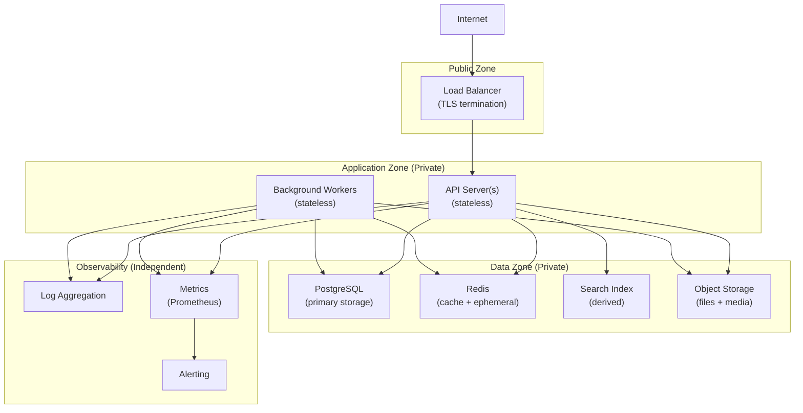
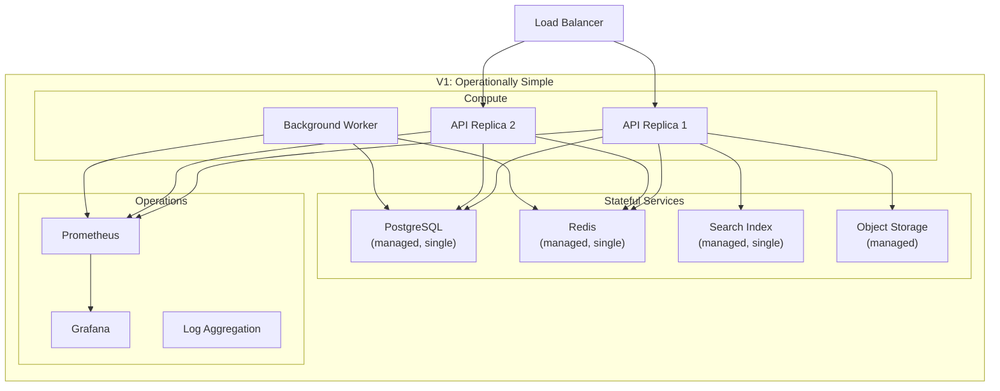
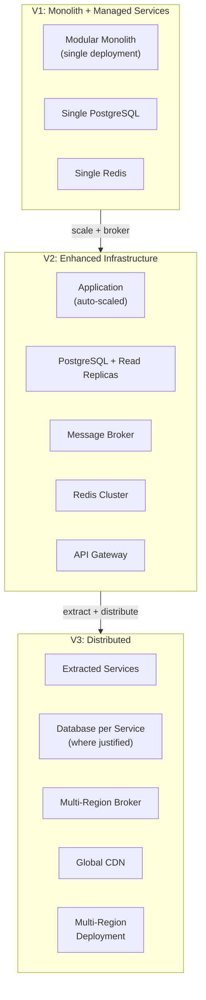

# Infrastructure Architecture

## Metadata

| Field | Value |
|-------|-------|
| Title | Kairo Infrastructure Architecture Foundation |
| Document ID | KAI-INFRA-001 |
| Status | Draft |
| Version | 0.1 |
| Target Release | V1 |
| Owner | Chief Infrastructure and Cloud Architecture Lead |
| Created | 2026-07-23 |
| Last Updated | 2026-07-23 |
| Reviewers | TODO |
| Related Documents | [Technology Stack](../Technology-Stack.md), [System Architecture](../System-Architecture.md), [Monolith Strategy](../Monolith-Strategy.md), [Security Architecture](../Security/Security-Architecture.md), [Multi-Tenancy Architecture](../Multi-Tenancy/Multi-Tenancy-Architecture.md), [Data Architecture](../Data/Data-Architecture.md), [Event Architecture](../Events/Event-Architecture.md), [API Architecture](../API/API-Architecture.md) |
| Dependencies | [Technology Stack](../Technology-Stack.md), [System Architecture](../System-Architecture.md), [Monolith Strategy](../Monolith-Strategy.md) |

---

## Applicable Version

This document defines V1 infrastructure architecture. V1 targets operational simplicity and cost-effectiveness for a modular monolith. The architecture establishes boundaries that support future scaling and service extraction without requiring premature infrastructure complexity.

---

## 1. Infrastructure Architecture Purpose

Infrastructure architecture defines where and how the Kairo platform runs — the compute, storage, networking, and operational systems that host the application. It governs:

- What workloads run and where.
- How state is stored and accessed.
- How environments are isolated.
- How the system is deployed, scaled, and recovered.
- How infrastructure is secured and observed.

Infrastructure architecture does NOT define application logic, domain models, or business rules. It provides the foundation on which application architecture executes.

---

## 2. Relationship to Application Architecture

| Aspect | Application Architecture | Infrastructure Architecture |
|--------|-------------------------|----------------------------|
| Defines | What the system does | Where and how the system runs |
| Owns | Modules, APIs, events, data models | Compute, storage, networking, deployment |
| Changes when | Business requirements change | Scale, reliability, or operational requirements change |
| Example | "Orders module processes payments" | "The application runs on X compute with Y database" |

| Rule | Detail |
|------|--------|
| **Infrastructure supports application boundaries** | Infrastructure does not replace module boundaries. Shared infrastructure does not mean shared data or shared logic. |
| Separation of concerns | Application architecture can evolve independently of infrastructure changes (and vice versa) |
| Infrastructure is invisible to users | Users interact with the application. Infrastructure is an implementation detail. |

---

## 3. Relationship to the Modular Monolith

| Aspect | V1 Direction |
|--------|-------------|
| Deployment unit | Single deployable application (modular monolith) |
| Scaling unit | The entire application scales together (vertical or horizontal replicas) |
| Module isolation | Logical (code boundaries), not physical (separate services) |
| Database | Single database instance shared across modules (schema-separated) |
| Event infrastructure | In-process (no external broker) |
| **Future extraction** | **Must remain possible without requiring microservices in V1.** Infrastructure supports future service extraction but does not force it. |

---

## 4. Runtime Workloads

| Workload | Type | Purpose | Scaling |
|----------|------|---------|---------|
| API server | Stateless compute | Serves all API surfaces (storefront, admin, integration) | Horizontal (replicas) |
| Background workers | Stateless compute | Outbox processing, lifecycle jobs, import processing, notifications | Horizontal (replicas, job-specific) |
| Database | Stateful | Primary persistent storage (PostgreSQL) | Vertical (V1). Read replicas (future). |
| Cache | Stateful (ephemeral) | Response caching, session storage, rate-limit counters | Vertical or clustered |
| Search index | Stateful (derived) | Full-text search capabilities | Vertical (V1). Clustered (future). |
| File/media storage | Stateful | Product images, import/export files, documents | Object storage (grows with usage) |
| Observability | Stateful (operational) | Logs, metrics, traces | Independent lifecycle |

---

## 5. Hosting Boundaries

| Boundary | Rule |
|----------|------|
| Application compute | Runs the Kairo application code (API + workers) |
| Data tier | Hosts persistent state (database, cache, search, files) |
| Observability tier | Hosts monitoring, logging, and alerting infrastructure |
| Edge tier | TLS termination, CDN, WAF (future) |
| Management tier | Deployment tooling, CI/CD runners, secrets management |

| Rule | Detail |
|------|--------|
| Tiers are isolated | Data tier is not directly accessible from the internet |
| Least privilege | Each tier has only the access it needs |
| Application accesses data tier | API servers and workers connect to data tier through controlled access |
| Observability is independent | Observability infrastructure has its own lifecycle (does not fail with the application) |

---

## 6. Environment Boundaries

**Production and non-production environments must be isolated.**

| Environment | Purpose | Isolation | Data |
|-------------|---------|-----------|------|
| Production | Live customer traffic | Fully isolated. No shared resources with non-production. | Real customer data. Classified. |
| Staging | Pre-production validation | Isolated from production. May share infrastructure type with development. | Synthetic test data only. No real customer data. |
| Development | Developer testing and experimentation | Isolated from production and staging. | Synthetic or minimal seed data. |
| CI/CD | Automated build and test | Ephemeral. Created and destroyed per pipeline. | Test fixtures only. |

| Rule | Detail |
|------|--------|
| No production data in non-production | Real customer data never exists in staging or development environments |
| No non-production access to production | Development and staging cannot reach production systems |
| Configuration parity | Environments use the same deployment mechanisms (different configuration values) |
| Credentials isolated | Each environment has its own credentials (not shared) |

---

## 7. Network Boundaries

| Zone | Access | Contents |
|------|--------|----------|
| Public | Internet-accessible | Load balancer, CDN endpoints |
| Application | Private (not internet-accessible) | API servers, background workers |
| Data | Private (application-accessible only) | Database, cache, search, file storage |
| Management | Restricted (operations only) | CI/CD, secrets management, monitoring administration |

---

## 8. Data Infrastructure

| System | Purpose | Statefulness | V1 Direction |
|--------|---------|:---:|-------------|
| PostgreSQL | Primary relational storage (all modules) | Persistent | Single instance. Managed service preferred. |
| Redis | Caching, session state, rate-limit counters, ephemeral data | Ephemeral (loss is recoverable) | Single instance. Managed service preferred. |
| Search (e.g., Elasticsearch/OpenSearch direction) | Full-text search, product search, catalog browsing | Derived (rebuildable) | Single node. Managed service preferred. |
| Object storage | Files, images, exports, imports | Persistent | Managed object storage service. |

| Rule | Detail |
|------|--------|
| **Persistent state uses explicitly owned storage** | Data is not stored on ephemeral compute. It lives in dedicated storage systems. |
| Managed services preferred | V1 prefers managed database/cache/search services (operational burden reduction) |
| Module-scoped logically | Single database instance but module-scoped schemas (per [Data Architecture](../Data/Data-Architecture.md)) |
| Backup | All persistent storage has backup and recovery capability |
| Encryption at rest | All persistent storage is encrypted at rest |

---

## 9. Cache Infrastructure

| Aspect | Detail |
|--------|--------|
| Technology direction | Redis (or compatible managed service) |
| Purpose | Response caching, session storage, rate-limit counters, distributed locks, ephemeral state |
| Durability | Cache is ephemeral. Loss means cache-miss recovery (application continues). |
| Not authoritative | Cache never holds the only copy of business data |
| Tenant isolation | Tenant-prefixed keys or database-number separation |
| Sizing | Sized for working set. Not for entire dataset. |
| Eviction | LRU eviction when memory is full |

---

## 10. Search Infrastructure

| Aspect | Detail |
|--------|--------|
| Technology direction | Elasticsearch or OpenSearch (managed service) |
| Purpose | Full-text search, product catalog search, faceted browsing |
| Durability | Derived from authoritative database. Rebuildable. |
| Not authoritative | Search index is never the source of truth |
| Tenant isolation | Tenant-filtered queries (same index, filtered at query time V1) |
| Lag | Eventually consistent with authoritative data (event-driven indexing) |
| V1 | Single-node managed service. Adequate for V1 data volume. |

---

## 11. Event Infrastructure

| Aspect | V1 Direction | Future Direction |
|--------|-------------|-----------------|
| Delivery mechanism | In-process (within modular monolith) | External message broker |
| Outbox storage | PostgreSQL (same database, outbox table per module) | Same (outbox publishes to broker) |
| Event bus | In-process event dispatcher | Broker-managed delivery |
| Dead-letter | Database table (dead-letter records) | Broker dead-letter queue |
| Infrastructure requirement | None beyond database and background workers | Broker deployment and management |
| Reference | Per [Event Architecture](../Events/Event-Architecture.md) | — |

---

## 12. File and Media Infrastructure

| Aspect | Detail |
|--------|--------|
| Storage | Managed object storage (e.g., S3-compatible or Azure Blob direction) |
| Access | Application servers access via API. Not directly exposed to internet. |
| Delivery to users | Via signed URLs with expiration (CDN-fronted in future) |
| Classification | Files inherit classification of their content |
| Tenant isolation | Tenant-scoped paths/containers |
| Lifecycle | Upload → active → archived → deleted (per data lifecycle) |
| Backup | Object storage provides its own durability (not application-managed backup) |
| Size | Grows with usage. Object storage scales inherently. |

---

## 13. Observability Infrastructure

**Infrastructure failures must be observable.**

| Component | Purpose | V1 Direction |
|-----------|---------|-------------|
| Logging | Structured application logs | Managed log aggregation (or self-hosted Loki/ELK) |
| Metrics | Quantitative system health | Prometheus + Grafana |
| Alerting | Notify on anomalies and failures | Grafana alerting or AlertManager |
| Tracing | Request flow (V1: correlation IDs in logs) | Structured log correlation (V1). Jaeger/Zipkin (future). |
| Health checks | Service liveness and readiness | Application-native endpoints |
| Uptime monitoring | External availability verification | External monitoring service |

| Rule | Detail |
|------|--------|
| Independent lifecycle | Observability infrastructure runs independently from the application |
| Survives application failure | If the application crashes, observability captures the failure |
| Structured and searchable | Logs are structured (JSON) and searchable |
| Retention | Logs: weeks. Metrics: months. Alerts: per incident. |
| Cost-conscious | V1 observability is sufficient for a small team. Not enterprise-scale. |

---

## 14. Security Infrastructure

**Infrastructure access follows least privilege.**
**Secrets must not be stored in source control.**

| Component | Purpose | V1 Direction |
|-----------|---------|-------------|
| Secrets management | Store and deliver application secrets | Managed secrets service (cloud KMS/Vault direction) |
| TLS termination | Encrypt traffic at the edge | Load balancer or reverse proxy |
| Network isolation | Prevent unauthorized access between zones | Private networking (VPC/VNet or equivalent) |
| Firewall rules | Restrict traffic to necessary paths | Minimal ingress (public to LB only). Internal only for data tier. |
| Access control | Limit who can access infrastructure | Role-based access. MFA for production. |
| Audit | Record infrastructure access and changes | Cloud provider audit logs + alerting |
| Vulnerability scanning | Detect known vulnerabilities | Container/dependency scanning in CI |

| Rule | Detail |
|------|--------|
| No secrets in source | Credentials, keys, and tokens are never committed to repositories |
| Rotate-capable | All secrets can be rotated without application downtime |
| Production access restricted | Production access requires elevated authorization (break-glass for emergencies) |
| Audit trail | All production access is logged |
| Reference | Per [Security Architecture](../Security/Security-Architecture.md) and [Secrets and Key Management](../Security/Secrets-and-Key-Management.md) |

---

## 15. Deployment Architecture

**Deployment must support rollback or safe roll-forward.**
**Infrastructure configuration must be reproducible.**
**Manual production changes must be minimized and auditable.**

| Aspect | V1 Direction |
|--------|-------------|
| Deployment unit | Single container image (API + workers from same build) |
| Deployment mechanism | Container-based deployment (Docker) |
| Orchestration direction | Container orchestration (Kubernetes direction) or managed container service |
| Deployment strategy | Rolling deployment (zero-downtime) |
| Rollback | Redeploy previous image version |
| Database migrations | Run before or during deployment (expand-migrate-contract per [Schema Evolution](../Data/Schema-Evolution-and-Migrations.md)) |
| Configuration | Environment-specific configuration via environment variables or config maps (not baked into image) |
| Reproducibility | Same image deployed to all environments. Environment-specific behavior via configuration only. |

| Rule | Detail |
|------|--------|
| **Disposable workloads** | **Application workloads should be disposable and replaceable.** Any instance can be terminated and replaced without data loss. |
| Immutable deployments | Deployed images are not modified in place. New version = new image. |
| No manual production changes | All production changes go through deployment pipeline. Manual changes are exceptional and audited. |
| Zero-downtime | Deployments do not cause user-visible downtime |

---

## 16. Scaling Direction

**Scaling decisions must be driven by measured demand.**

| Dimension | V1 Approach | Future Approach |
|-----------|-------------|-----------------|
| API compute | Horizontal replicas (add more instances) | Auto-scaling based on load metrics |
| Background workers | Horizontal replicas (per workload type) | Auto-scaling based on queue depth |
| Database | Vertical scaling (larger instance) | Read replicas. Possible sharding. |
| Cache | Vertical scaling (more memory) | Clustered Redis |
| Search | Vertical scaling (larger node) | Multi-node cluster |
| File storage | Inherently scalable (object storage) | CDN for delivery |

| Rule | Detail |
|------|--------|
| Measure first | Do not scale without evidence of need |
| Horizontal preferred | Prefer adding instances over making instances larger (where workload is stateless) |
| Stateless scales easily | API servers and workers are stateless — scale by adding replicas |
| Stateful scales carefully | Database and cache scaling requires planning (not just "add more") |
| Cost-aware | V1 should be cost-appropriate for a startup (not enterprise-scale infrastructure from day one) |

---

## 17. Availability Direction

| Aspect | V1 Direction | Future Direction |
|--------|-------------|-----------------|
| API availability | Multiple replicas behind load balancer | Auto-scaling + multi-AZ |
| Database availability | Managed service with automated failover | Multi-AZ + read replicas |
| Cache availability | Single instance (cache-miss is recoverable) | Clustered with failover |
| Overall target | High availability for API. Acceptable brief degradation during failures. | Formal SLA with multi-region (V3+). |
| Recovery | Automated failover for managed services. Manual recovery for application issues. | Automated recovery with self-healing. |

| Rule | Detail |
|------|--------|
| Degraded over unavailable | The system should degrade gracefully (cached responses, reduced functionality) rather than go completely offline |
| Stateless recovery | Stateless workloads (API, workers) recover by restarting — no state to restore |
| Stateful recovery | Database failover is managed-service responsibility. Application handles reconnection. |
| Not over-engineered V1 | V1 does not need multi-region or 5-nines. Appropriate availability for the business stage. |

---

## 18. Disaster-Recovery Direction

| Aspect | V1 Direction | Future Direction |
|--------|-------------|-----------------|
| Database backup | Managed service automated backup (point-in-time recovery) | Cross-region backup replication |
| File storage backup | Object storage inherent durability | Cross-region replication |
| Recovery testing | Periodic restore testing (per [Backup and Recovery](../Data/Backup-Restore-and-Disaster-Recovery.md)) | Automated DR drills |
| RTO direction | Hours (acceptable for V1 business stage) | Minutes (as business grows) |
| RPO direction | Minutes (point-in-time recovery) | Near-zero (replication) |
| Multi-region | Not V1 | V3+ (when business requires) |

| Rule | Detail |
|------|--------|
| Backup is not recovery | Backups must be tested (restorable and complete) |
| Recovery plan exists | Even V1 has a documented recovery procedure |
| Proportionate | DR investment matches business impact. V1 startup does not need enterprise DR. |
| Reference | Per [Backup, Restore, and Disaster Recovery](../Data/Backup-Restore-and-Disaster-Recovery.md) |

---

## 19. Infrastructure Ownership

| Component | Owner | Responsibility |
|-----------|-------|---------------|
| Compute (API, workers) | Platform/DevOps team | Provisioning, scaling, deployment pipeline |
| Database | Platform/DevOps team (infrastructure) + Module teams (schema) | Infrastructure owns hosting. Modules own their schema. |
| Cache | Platform/DevOps team | Provisioning, monitoring, scaling |
| Search | Platform/DevOps team (infrastructure) + Modules (index configuration) | Infrastructure owns hosting. Modules own their index definitions. |
| File storage | Platform/DevOps team | Provisioning, access control, lifecycle |
| Networking | Platform/DevOps team | Zones, firewall rules, DNS |
| Observability | Platform/DevOps team | Log aggregation, metric collection, alerting |
| Secrets | Platform/DevOps + Security team | Provisioning, rotation, access control |
| Deployment pipeline | Platform/DevOps team | Build, test, deploy automation |

---

## 20. V1 Infrastructure Architecture

**V1 must remain operationally simple.**

| Component | V1 Choice |
|-----------|-----------|
| Compute | Container-based (Docker). Orchestrated (Kubernetes or managed container service). |
| API hosting | 2+ replicas behind load balancer |
| Workers | 1+ replica per worker type |
| Database | Managed PostgreSQL (single instance with automated backup and failover) |
| Cache | Managed Redis (single instance) |
| Search | Managed Elasticsearch/OpenSearch (single node) |
| File storage | Managed object storage |
| Events | In-process (no external broker) |
| Observability | Prometheus + Grafana (metrics). Structured logging with aggregation. |
| Secrets | Managed secrets service (cloud-native) |
| Deployment | CI/CD pipeline deploying container images |
| Environments | Production + Staging + Development (isolated) |
| Network | Private networking with public load balancer endpoint only |
| TLS | Managed certificates at load balancer |
| Scaling | Manual scaling based on monitoring (auto-scaling evaluated for V2) |

---

## 21. Future Infrastructure Evolution

| Aspect | V2 Direction | V3+ Direction |
|--------|-------------|---------------|
| Event infrastructure | External message broker deployed | Multi-region broker |
| Database | Read replicas. Connection pooling. | Potential database-per-service. Sharding evaluated. |
| Cache | Clustered Redis | Multi-region cache |
| Search | Multi-node cluster | Dedicated search cluster with sharding |
| Compute | Auto-scaling based on metrics | Multi-region deployment |
| CDN | Static assets and media delivery | Full edge caching |
| API gateway | Dedicated API gateway | Multi-region routing |
| Deployment | Canary/blue-green deployment | Multi-region progressive rollout |
| DR | Cross-region backup | Active-passive multi-region. Eventually active-active. |
| Observability | Distributed tracing | Full enterprise observability stack |
| Service extraction | Selected modules extracted if needed | Independent service deployment |

---

## Mandatory Principles Summary

| # | Principle |
|---|-----------|
| 1 | Infrastructure supports application boundaries rather than replacing them |
| 2 | V1 must remain operationally simple |
| 3 | Production and non-production environments must be isolated |
| 4 | Infrastructure access follows least privilege |
| 5 | Secrets must not be stored in source control |
| 6 | Application workloads should be disposable and replaceable where practical |
| 7 | Persistent state must use explicitly owned storage systems |
| 8 | Infrastructure configuration must be reproducible |
| 9 | Manual production changes must be minimized and auditable |
| 10 | Infrastructure failures must be observable |
| 11 | Deployment must support rollback or safe roll-forward |
| 12 | Shared infrastructure does not weaken tenant isolation |
| 13 | Scaling decisions must be driven by measured demand |
| 14 | Future service extraction must remain possible without requiring microservices in V1 |

---

## Version Gate

| Version | Infrastructure Gate |
|---------|---------------------|
| V1 | Container-based deployment (Docker/orchestrator). 2+ API replicas. Managed PostgreSQL with backup. Managed Redis. Managed search. Managed object storage. Private networking (data tier not internet-accessible). TLS at load balancer. Managed secrets. CI/CD pipeline. Prometheus + Grafana. Structured logging. Environment isolation (prod/staging/dev). Zero-downtime deployment. Rollback capability. |
| V2 | External message broker. Database read replicas. Auto-scaling. Dedicated API gateway. CDN for media. Enhanced monitoring (distributed tracing). Canary deployment. Cross-region backup. |
| V3 | Multi-region deployment. Service extraction (where justified). Database-per-service (where justified). Global CDN. Active-passive DR. Enterprise observability. |

---

## Decision Summary

| Decision | Rationale |
|----------|-----------|
| Managed services for V1 | Reduces operational burden. Small team cannot manage raw database/cache/search infrastructure. Managed services provide backup, failover, and patching. |
| Single database instance (V1) | Modular monolith uses a single database. Module-scoped schemas provide logical isolation. Physical separation is V2+ when justified. |
| In-process events (no broker V1) | All modules are in one process. External broker adds complexity without V1 necessity. Outbox pattern works in-process. |
| Container-based deployment | Reproducible, portable, consistent across environments. Industry standard. |
| Horizontal scaling for stateless | API servers and workers are stateless. Adding replicas is simple and effective. |
| Vertical scaling for stateful (V1) | Scaling a database vertically (larger instance) is simpler than clustering for V1 data volumes. |
| No multi-region in V1 | Multi-region adds massive complexity. V1 business stage does not require it. |
| Prometheus + Grafana | Open-source, well-understood, part of approved technology stack. Sufficient for V1 observability. |
| Disposable compute | Stateless workloads can be killed and replaced. No pet servers. |
| Immutable deployments | New version = new image. No in-place modification. Reproducible and rollback-safe. |

---

## Alternatives Considered

| Alternative | Rejected Because |
|------------|-----------------|
| Self-managed database | Operational burden for a small team. Managed services provide backup, failover, and security patching. |
| External message broker in V1 | Adds operational complexity (broker deployment, monitoring) without V1 necessity. In-process event delivery is sufficient for a monolith. |
| Multi-region in V1 | Massive complexity (data replication, conflict resolution, routing). Not justified by V1 business stage. |
| Serverless/FaaS for all workloads | Cold-start latency, vendor lock-in concerns, harder to debug, and the modular monolith model benefits from persistent process. |
| Microservices deployment in V1 | Over-engineered for V1. Adds network hops, distributed tracing requirements, and operational complexity without proportional benefit. |
| No container orchestration | Bare-metal or VM deployment lacks scaling, health management, and rolling deployment capabilities. |
| Manual infrastructure provisioning | Not reproducible. Error-prone. Does not scale with team growth. IaC direction required (implementation deferred). |
| Shared environments (prod + staging) | Security risk. Data contamination risk. Cost savings do not justify the risk. |

---

## Architecture Impact

| Concern | Impact |
|---------|--------|
| Module design | Modules must be stateless in compute (state in database, cache, or file storage). Must not depend on local filesystem persistence. |
| Data access | All data access goes through managed data services (PostgreSQL, Redis, search). No local SQLite or file-based storage. |
| Event architecture | V1 events are in-process. Future broker deployment changes delivery mechanism but not event contracts. |
| Security | Infrastructure enforces network isolation, encryption at rest/transit, and secrets management. Application relies on these. |
| Multi-tenancy | Shared infrastructure (single database, single cache) with application-level tenant isolation. Infrastructure does not provide per-tenant physical separation (V1). |
| Deployment | Single deployment unit (container image) for all modules. Rolling deployment with zero downtime. |
| Testing | Staging environment mirrors production infrastructure type (same managed services, smaller scale). |
| Operations | Small team manages infrastructure through managed services and automation. Minimal manual intervention. |

---

## Implementation Impact

| Area | Impact |
|------|--------|
| Application | Must be containerized. Must use environment variables for configuration. Must not write to local filesystem for persistence. Must handle instance termination gracefully. |
| Database | Module schemas in single PostgreSQL instance. Connection pooling required. Managed backup and failover. |
| Cache | Application uses Redis for ephemeral state. Cache-miss recovery is application responsibility. |
| Search | Application maintains search index via event-driven updates. Index is rebuildable from database. |
| Deployment | CI/CD builds container image. Deploys to orchestrator. Rolling update strategy. Rollback is redeploy of previous image. |
| Observability | Application emits structured logs and Prometheus metrics. Infrastructure provides aggregation and alerting. |
| Security | Application retrieves secrets from secrets management (not environment files). Connects to data tier via private networking. |

---

## Security Responsibilities

| Role | Infrastructure Security Responsibilities |
|------|------------------------------------------|
| Infrastructure/DevOps Team | Provisions secure infrastructure. Manages network isolation. Manages secrets service. Maintains TLS certificates. Controls production access. |
| Security Team | Reviews infrastructure security. Validates least-privilege access. Reviews network boundaries. Audits production access. |
| Module Teams | Use infrastructure correctly (secrets from management, not hardcoded). Do not expose internal services. Handle connection failures gracefully. |
| Operations | Monitors infrastructure security events. Responds to security alerts. Manages access review. |

---

## Multi-Tenancy Responsibilities

| Responsibility | Detail |
|---------------|--------|
| Shared infrastructure (V1) | Single database, single cache, single search — all shared across tenants |
| Application-level isolation | Tenant isolation is enforced by the application layer, not by infrastructure separation |
| **Shared infrastructure does not weaken isolation** | Using the same database for all tenants does not mean tenants can access each other's data. Application-level query filtering is mandatory. |
| Future per-tenant infrastructure | V3+ may offer per-tenant database or per-tenant compute for enterprise customers (not V1) |
| Infrastructure security applies to all tenants | Encryption, network isolation, and access control protect all tenant data equally |

---

## Out of Scope

This document does not define:

- Cloud resource names, ARNs, or identifiers (deployment configuration).
- Terraform, Pulumi, or CloudFormation templates (IaC repositories).
- Kubernetes manifests, Helm charts, or Kustomize overlays (deployment repositories).
- Dockerfiles or container build configuration (application repositories).
- CI/CD pipeline YAML or configuration (pipeline repositories).
- Specific machine sizes, instance types, or pricing (capacity planning).
- Credentials, connection strings, or secrets (secrets management).
- Production configuration values (deployment configuration).
- Specific cloud provider selection (architecture decision — separate concern).

---

## Future Considerations

- **Multi-region deployment** — Geographic distribution for latency and regulatory compliance.
- **Edge computing** — Processing at the edge for latency-sensitive operations.
- **Service mesh** — Infrastructure-level service-to-service security and observability (if services are extracted).
- **GitOps** — Infrastructure and deployment state managed through Git with automated reconciliation.
- **Cost optimization** — Automated right-sizing and reserved capacity management.
- **Compliance infrastructure** — Dedicated compliance monitoring and reporting infrastructure.
- **Data residency** — Per-region data storage for regulatory requirements.
- **Chaos engineering** — Infrastructure resilience testing through controlled failure injection.

---

## Future Refactoring Triggers

This document should be revisited when:

- Application traffic exceeds single-instance database capacity (trigger for read replicas or vertical scaling review).
- Event volume requires external broker (trigger for broker deployment architecture).
- Module extraction to services begins (trigger for service mesh and inter-service networking).
- Multi-region deployment is needed (trigger for geo-distributed infrastructure architecture).
- Auto-scaling is needed (trigger for scaling policies and capacity planning).
- Cost optimization requires infrastructure changes (trigger for right-sizing review).
- Compliance requires specific infrastructure controls (trigger for compliance infrastructure).
- Disaster recovery SLA tightens (trigger for enhanced DR architecture).

---

## Change History

| Version | Date | Author | Description |
|---------|------|--------|-------------|
| 0.1 | 2026-07-23 | Chief Infrastructure and Cloud Architecture Lead | Initial draft — infrastructure architecture foundation |
