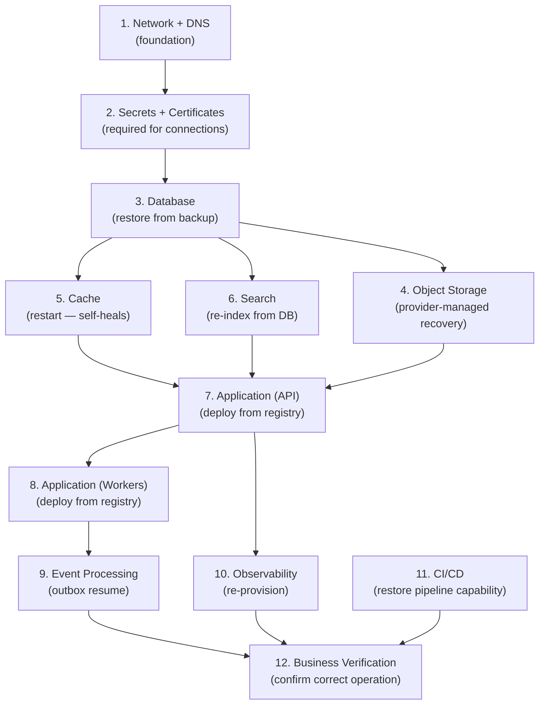

# Infrastructure Backup and Disaster Recovery

## Metadata

| Field | Value |
|-------|-------|
| Title | Kairo Infrastructure Resilience, Backup, and Disaster Recovery Architecture |
| Document ID | KAI-INFRA-012 |
| Status | Draft |
| Version | 0.1 |
| Target Release | V1 |
| Owner | Infrastructure Resilience, Backup, and Disaster Recovery Architect |
| Created | 2026-07-23 |
| Last Updated | 2026-07-23 |
| Reviewers | TODO |
| Related Documents | [Backup, Restore, and Disaster Recovery](../Data/Backup-Restore-and-Disaster-Recovery.md), [Incident Response](../Security/Incident-Response.md), [Availability and Resilience Architecture](./Availability-and-Resilience-Architecture.md), [Environment Architecture](./Environment-Architecture.md), [Infrastructure Architecture](./Infrastructure-Architecture.md), [Runtime Configuration and Secrets](./Runtime-Configuration-and-Secrets.md) |
| Dependencies | [Backup, Restore, and Disaster Recovery](../Data/Backup-Restore-and-Disaster-Recovery.md), [Infrastructure Architecture](./Infrastructure-Architecture.md) |

---

## Applicable Version

This document defines V1 infrastructure-level backup and disaster recovery architecture. It consumes and complements the approved data-level backup architecture ([Backup, Restore, and Disaster Recovery](../Data/Backup-Restore-and-Disaster-Recovery.md)) without duplicating it. V1 provides single-region recovery through managed-service backups, infrastructure-as-code reproducibility, and tested recovery procedures. Multi-region active-active is future scope.

---

## Purpose

This document defines how the Kairo platform's infrastructure is recovered after failures — from a single configuration error through full regional catastrophe. It establishes the scope of infrastructure recovery (beyond data recovery), the ordering of recovery steps, the dependencies between recovered components, and the verification that recovery is complete.

Infrastructure recovery is broader than database restoration. An application cannot start if its secrets are unavailable. It cannot serve traffic if DNS does not resolve. It cannot process events if the event infrastructure is not operational. This document ensures every infrastructure component has a recovery path and that recovery happens in the correct order.

---

## Scope

This document covers:

- Infrastructure-level recovery for all platform components (application, configuration, secrets, certificates, DNS, network, observability, CI/CD).
- Recovery dependencies and ordering.
- Failure scenarios (regional, provider, credential compromise, ransomware, accidental deletion, corruption).
- Recovery governance (declaration, authority, testing, verification).
- V1 recovery capabilities and future maturity.

This document does NOT duplicate:

- Data-level backup and recovery (RPO/RTO philosophy, database backup strategies, tenant-safe restoration, point-in-time recovery) — see [Backup, Restore, and Disaster Recovery](../Data/Backup-Restore-and-Disaster-Recovery.md).
- Incident response procedures — see [Incident Response](../Security/Incident-Response.md).
- Application-level resilience patterns — see [Availability and Resilience Architecture](./Availability-and-Resilience-Architecture.md).

---

## Mandatory Principles

| # | Principle |
|---|-----------|
| 1 | Infrastructure must be reproducible from approved definitions and artifacts |
| 2 | Backup restoration must be tested |
| 3 | Recovery order must account for dependencies |
| 4 | Secrets must be recoverable without unsafe duplication |
| 5 | Cache and search may generally be rebuilt from authoritative sources |
| 6 | Tenant-safe restoration remains mandatory |
| 7 | Disaster recovery and high availability are different concerns |
| 8 | Recovery success requires business validation, not only infrastructure startup |
| 9 | External providers may require reconciliation after recovery |
| 10 | Recovery exercises must preserve evidence and produce improvements |
| 11 | V1 must define realistic recovery capabilities |
| 12 | Multi-region active-active architecture is future scope unless explicitly approved |

---

## Recovery Scope

### 1. Infrastructure Recovery Scope

| What Infrastructure Recovery Covers | What Data Recovery Covers (see Data architecture) |
|--------------------------------------|--------------------------------------------------|
| Application deployment (container images, configuration) | Database content (business data, audit records) |
| Secrets and certificate availability | Database point-in-time recovery |
| Network and DNS resolution | Tenant data restoration |
| CI/CD pipeline operability | Backup retention and rotation |
| Observability infrastructure | Data classification during restore |
| Infrastructure-as-code state | Financial reconciliation post-restore |
| Environment recreation | Deletion propagation across stores |

---

### 2. Application Recovery

| Aspect | Detail |
|--------|--------|
| Mechanism | Redeploy known-good container image from registry |
| Dependency | Container registry accessible. Secrets available. Database reachable. |
| State | Application is stateless. Redeployment fully recovers application tier. |
| Ordering | Deploy after network, secrets, and database are available |
| V1 | Rerun deployment pipeline targeting production (same image, same config). Or deploy directly from registry with config. |
| Evidence | Application health checks pass. API responds. Workers process. |

---

### 3. Database Recovery

| Aspect | Detail |
|--------|--------|
| Mechanism | Managed-service point-in-time recovery or backup restoration |
| Dependency | Managed service operational. Network accessible. |
| Detail | Per [Backup, Restore, and Disaster Recovery](../Data/Backup-Restore-and-Disaster-Recovery.md) — not duplicated here |
| V1 | Managed-service automated backup with point-in-time restore capability |
| **Tenant-safe** | **Tenant-safe restoration remains mandatory.** Restoring one tenant's data must not expose or corrupt another tenant's data. |
| Ordering | Database recovered before application (application depends on database) |

---

### 4. Object-Storage Recovery

| Aspect | Detail |
|--------|--------|
| Mechanism | Managed object storage has built-in durability and redundancy |
| Recovery scenario | Accidental deletion (versioning/soft-delete recovery), corruption (restore from version) |
| Dependency | Provider object-storage service operational |
| V1 | Rely on managed-service durability. Versioning enabled for recovery of accidental deletion. |
| Ordering | Recovered alongside database (application may need files during startup validation) |

---

### 5. Configuration Recovery

**Infrastructure must be reproducible from approved definitions and artifacts.**

| Aspect | Detail |
|--------|--------|
| Mechanism | Reapply configuration from infrastructure-as-code definitions and deployment pipeline |
| Source | Version-controlled configuration (IaC repository, deployment manifests, config maps) |
| Recovery | Re-provision from IaC definitions. Re-apply configuration from deployment pipeline. |
| V1 | Configuration lives in version control (deployment repository). Reapply to recover. |
| Ordering | Configuration applied after network and before application deployment |
| Not manual | Recovery does not depend on remembering manual changes (all config is in code) |

---

### 6. Secret Recovery

**Secrets must be recoverable without unsafe duplication.**

| Aspect | Detail |
|--------|--------|
| Mechanism | Secrets management service has its own backup/replication (managed service feature) |
| Recovery | Secrets service restored from its own backup. Or: re-issue credentials if service is lost. |
| Re-issuance | If secrets are irrecoverable: generate new database credentials, new API keys, new signing secrets. Rotate everywhere. |
| Dependency | Secrets must be available before application starts (startup validation fails without them) |
| Not duplicated unsafely | Secrets are NOT backed up by copying them to files, emails, or shared drives |
| V1 | Managed secrets service with provider-managed redundancy. Emergency re-issuance procedure documented. |
| Ordering | Secrets recovered (or re-issued) before application deployment |

---

### 7. Certificate Recovery

| Aspect | Detail |
|--------|--------|
| Mechanism | Re-issue certificates from certificate authority (auto-renewal or manual re-issuance) |
| Recovery | If certificates are lost: re-request from CA. Managed certificate services auto-provision. |
| Dependency | Certificate needed before TLS-protected endpoints can serve traffic |
| V1 | Managed certificate service (auto-renewal). Recovery = re-provision (fast). |
| Ordering | Certificates available before load balancer accepts traffic |

---

### 8. Event Infrastructure Recovery

| Aspect | Detail |
|--------|--------|
| V1 mechanism | Events use in-process delivery with outbox in database. Event infrastructure recovery = database recovery + application restart. |
| V1 recovery | Database restored → outbox records survive → application starts → outbox processor resumes delivery. No separate event infrastructure to recover. |
| Future (broker) | Broker recovery from its own replication/backup. Messages may need replay from outbox. |
| Evidence | Events are published. Consumers process. Lag returns to normal. |
| Ordering | After database (outbox depends on database) |

---

### 9. Search Recovery

**Cache and search may generally be rebuilt from authoritative sources.**

| Aspect | Detail |
|--------|--------|
| Mechanism | Rebuild search index from authoritative database |
| Recovery | Full re-index from database (search is derived, not authoritative) |
| Data loss | No data loss (source is database, not search index) |
| Duration | Re-index may take time depending on data volume. Search unavailable during rebuild. |
| V1 | Re-index from database. Managed search service handles infrastructure recovery. |
| Ordering | After database (search is derived from database) |

---

### 10. Cache Recovery

**Cache and search may generally be rebuilt from authoritative sources.**

| Aspect | Detail |
|--------|--------|
| Mechanism | Cache self-heals through cache-miss (application fetches from database on miss) |
| Recovery | Restart cache service (empty). Application repopulates through normal operation. |
| Data loss | No data loss (cache is derived/ephemeral, not authoritative) |
| Duration | Cache warms up over minutes-hours as requests populate it. Slower performance until warm. |
| V1 | Restart managed Redis. No backup needed (ephemeral by design). |
| Ordering | After database (cache is populated from database) |

---

### 11. Observability Recovery

| Aspect | Detail |
|--------|--------|
| Mechanism | Re-provision monitoring infrastructure from configuration |
| Recovery | Redeploy Prometheus, Grafana, log aggregation from IaC definitions |
| Data loss | Historical metrics and logs during the outage are lost (acceptable — observability is operational, not archival) |
| Impact during recovery | Application runs without observability (operational blindness until monitoring recovers) |
| Priority | High (but after core application is serving traffic) |
| V1 | Monitoring infrastructure re-provisioned from IaC. Dashboards and alerts from configuration-as-code. |
| Ordering | After application is running (application can function without observability, but blindly) |

---

### 12. CI/CD Recovery

| Aspect | Detail |
|--------|--------|
| Mechanism | CI/CD system re-provisioned or restored by vendor (if managed) |
| Recovery | Pipeline definitions are in source control. Runners/agents re-provisioned from IaC. |
| Impact during recovery | Cannot deploy new versions until CI/CD recovers. Existing production continues running. |
| Priority | Medium (production runs without CI/CD — but cannot deploy fixes) |
| V1 | Managed CI/CD service. Pipeline definitions in source control. Runners are ephemeral (recreate). |
| Ordering | After production is stable. Needed before any fix can be deployed. |
| Workaround | Emergency: manual deployment from registry using deployment tooling (not pipeline) with audit. |

---

### 13. DNS Recovery

| Aspect | Detail |
|--------|--------|
| Mechanism | DNS is managed service with built-in redundancy. Recovery = provider-managed. |
| If DNS fails | Catastrophic for external access (all traffic affected). Internal services may use IP-based failover. |
| Recovery | Provider restores DNS service. Or: migrate to backup DNS provider (pre-configured if critical). |
| V1 | Rely on managed DNS provider's built-in resilience. Document DNS configuration for recreation if provider-switch needed. |
| Ordering | DNS must be operational for any external access (highest priority alongside network) |

---

### 14. Network Recovery

| Aspect | Detail |
|--------|--------|
| Mechanism | Network infrastructure re-provisioned from IaC definitions |
| Recovery | VPC/VNet, subnets, security groups, load balancers — all from code |
| Dependency | Network must be operational before anything else can communicate |
| V1 | Managed networking. IaC definitions for recreation. Provider resilience for availability. |
| Ordering | First (everything depends on network connectivity) |

---

### 15. Environment Recreation

| Aspect | Detail |
|--------|--------|
| Definition | Complete recreation of an environment from scratch (worst case) |
| Mechanism | IaC provisions infrastructure. Pipeline deploys application. Database restored from backup. |
| Duration | Hours (depending on infrastructure provisioning time and database restore size) |
| Test | Environment recreation is the ultimate DR test (can we rebuild everything from definitions + backups?) |
| V1 direction | V1 should be able to recreate from: IaC definitions + container registry + database backup + secrets |
| Ordering | Network → database → secrets → configuration → application → observability |

---

### 16. Infrastructure-State Recovery

| Aspect | Detail |
|--------|--------|
| Definition | Recovering the intended infrastructure state after drift or corruption |
| Mechanism | Re-apply IaC definitions (infrastructure converges to declared state) |
| Drift | If infrastructure has drifted from IaC, re-apply corrects it |
| Manual changes | Manual changes are lost during IaC re-application (intentional — IaC is authoritative) |
| V1 | IaC definitions are the source of truth. Re-apply recovers intended state. |

---

## Recovery Dependencies and Ordering

### 17. Recovery Dependencies

| Component | Depends On (must be available first) |
|-----------|--------------------------------------|
| Network/DNS | Provider infrastructure (external dependency) |
| Secrets service | Network, provider infrastructure |
| Database | Network, managed service provider |
| Cache | Network, managed service provider |
| Search | Network, managed service provider |
| Object storage | Network, managed service provider |
| Application (API) | Network, secrets, database, cache (optional), search (optional) |
| Application (workers) | Network, secrets, database |
| Event processing | Application (workers), database (outbox) |
| Observability | Network (can deploy after application) |
| CI/CD | Network (can recover after application is stable) |
| Webhook delivery | Application, network, external endpoints |

---

### 18. Recovery Ordering

---

## Recovery Objectives

### 19. Recovery Point Objective Direction

| Component | RPO Direction | Mechanism |
|-----------|-------------|-----------|
| Database | Minutes | Point-in-time recovery from managed backups |
| Object storage | Minutes to zero | Provider-managed durability (versioning) |
| Application state | Zero (stateless) | Redeployment recovers fully |
| Configuration | Zero | Stored in version control (always current) |
| Secrets | Zero (if service available) | Managed service replication. Or re-issue. |
| Cache | Acceptable loss | Ephemeral. Rebuilt from authoritative source. |
| Search index | Acceptable loss | Derived. Rebuilt from database. |
| Event outbox | Same as database | Outbox lives in database (same RPO). |
| Observability | Acceptable loss | Historical metrics/logs during outage lost. Acceptable. |

---

### 20. Recovery Time Objective Direction

| Component | RTO Direction | V1 | Notes |
|-----------|-------------|-----|-------|
| Network/DNS | Minutes | Provider-managed failover | External dependency |
| Database | Minutes to low hours | Managed failover (minutes). Full restore (hours). | Depends on failure type |
| Application | Minutes | Redeploy from registry | Fast (image pull + start) |
| Secrets | Minutes | Managed service. Or re-issue procedure. | Documented procedure |
| Cache | Minutes | Restart (empty, self-heals) | Performance impact until warm |
| Search | Minutes to hours | Service restart (minutes). Full re-index (hours). | Depends on data volume |
| Object storage | Minutes | Provider-managed | Rarely fails (built-in redundancy) |
| CI/CD | Hours | Re-provision. Or use manual deployment. | Not blocking production. |
| Observability | Hours | Re-provision from IaC | Production functions without it. |
| Full environment | Hours | Complete recreation from IaC + backups | Worst case |

---

## Failure Scenarios

### 21. Regional Failure

| Aspect | Detail |
|--------|--------|
| Scenario | Entire cloud region becomes unavailable |
| V1 impact | Total outage (V1 is single-region) |
| V1 recovery | Wait for region recovery. Or: recreate in alternate region (if prepared — extends RTO significantly). |
| **No multi-region claims** | **Multi-region active-active architecture is future scope.** V1 does not have cross-region failover. |
| Preparation (V1) | Database backups replicated to second region (manageable-service feature). IaC can target alternate region. |
| Future | V2+: DR standby in alternate region. V3+: active-passive multi-region. |

---

### 22. Provider Failure

| Aspect | Detail |
|--------|--------|
| Scenario | Cloud provider experiences a service-wide outage affecting managed services |
| V1 impact | Dependent on which service fails (database? networking? all?) |
| Recovery | Wait for provider recovery (V1 is on single provider) |
| Mitigation direction | Critical data backed up cross-provider (direction). IaC is provider-portable (direction, not V1 mandate). |
| V1 reality | V1 accepts single-provider risk. Multi-provider is future complexity. |

---

### 23. Credential Compromise

| Aspect | Detail |
|--------|--------|
| Scenario | Production credentials (database password, API keys, signing secrets) are compromised |
| Recovery | Immediate rotation of all compromised credentials. Re-deploy application with new credentials. |
| Dependencies | Secrets service must be accessible. Application must support credential refresh. |
| Investigation | Determine scope of compromise. Audit what was accessed. |
| Reference | Per [Secrets and Key Management](../Security/Secrets-and-Key-Management.md) |
| V1 | Document rotation procedure. Test rotation in staging. Application supports secret refresh. |

---

### 24. Ransomware

| Aspect | Detail |
|--------|--------|
| Scenario | Infrastructure or data encrypted by malicious actor |
| Recovery | Restore from clean backups (backups not connected to compromised systems) |
| Isolation | Isolate compromised systems immediately. Do not restore into compromised environment. |
| Clean environment | Rebuild infrastructure in a clean environment. Restore data from known-clean backup. |
| Verification | Verify restored data integrity. Verify no persistence of compromise in restored environment. |
| V1 | Backup isolation (backups in separate management plane). Documented procedure. Incident response engagement. |

---

### 25. Accidental Deletion

| Aspect | Detail |
|--------|--------|
| Scenario | Operator accidentally deletes a resource (database, storage bucket, configuration) |
| Recovery | Restore from backup (database). Recover from versioning (object storage). Re-apply IaC (infrastructure). |
| Prevention | Role-based access. Deletion protection on critical resources. |
| V1 | Managed-service deletion protection enabled. Backups available for database. Object versioning for files. IaC for infrastructure. |

---

### 26. Configuration Corruption

| Aspect | Detail |
|--------|--------|
| Scenario | Configuration is applied that breaks the system (wrong environment variable, invalid setting) |
| Recovery | Rollback configuration to previous known-good state (from version control) |
| Detection | Application fails health checks. Alerts fire. |
| Speed | Fast (re-apply previous configuration version) |
| V1 | Configuration in version control. Rollback = deploy previous config version. |

---

## Recovery Governance

### 27. Disaster Declaration

| Aspect | Detail |
|--------|--------|
| Definition | Formal declaration that a disaster has occurred requiring DR procedures |
| Authority | Operations lead or designated incident commander |
| Trigger | Defined criteria (e.g., production unavailable > 30 minutes with no path to quick recovery) |
| Actions initiated | DR procedures activated. Communication to stakeholders. Recovery team assembled. |
| Communication | Status page updated. Affected tenants notified. Management informed. |
| Not for every outage | Brief outages resolved through normal incident response. DR is for extended or catastrophic failures. |

---

### 28. Recovery Authority

| Role | Authority |
|------|-----------|
| Incident commander | Declares disaster. Coordinates recovery. Makes recovery decisions. |
| Operations team | Executes recovery procedures (infrastructure provisioning, deployment, restore). |
| Database team / Platform | Executes database restoration. Verifies data integrity. |
| Security team | Validates no compromise in restored environment. Reviews credential rotation. |
| Development team | Verifies application functionality post-recovery. Runs smoke tests. |
| Management | Business decisions (communication, SLA, customer impact assessment). |

---

### 29. Recovery Testing

**Backup restoration must be tested.**
**Recovery exercises must preserve evidence and produce improvements.**

| Rule | Detail |
|------|--------|
| Regular testing | Recovery procedures are tested periodically (quarterly direction) |
| Environment | Tested in staging or dedicated DR-test environment (not production) |
| Full exercise | At least annually: full environment recreation from IaC + backup restore |
| Partial exercises | Quarterly: individual component recovery (database restore, secret rotation, application redeploy) |
| Evidence | Each test records: what was tested, duration, issues found, improvements identified |
| Improvements | Issues found during testing become action items (fix before next test) |
| Documented | Test results are documented and reviewed |
| Not theoretical | A recovery procedure that has never been tested is not trusted |

### Recovery Test Checklist

| # | Test | Frequency | Last Tested | Result |
|---|------|-----------|-------------|--------|
| 1 | Database point-in-time restore | Quarterly | — | — |
| 2 | Application redeploy from registry | Quarterly | — | — |
| 3 | Secret rotation (database credentials) | Quarterly | — | — |
| 4 | Certificate re-issuance | Semi-annually | — | — |
| 5 | Search full re-index | Quarterly | — | — |
| 6 | Configuration rollback | Quarterly | — | — |
| 7 | Full environment recreation | Annually | — | — |
| 8 | Object-storage recovery (accidental deletion) | Semi-annually | — | — |
| 9 | CI/CD pipeline recreation | Semi-annually | — | — |
| 10 | Emergency manual deployment | Semi-annually | — | — |

---

### 30. Business Verification

**Recovery success requires business validation, not only infrastructure startup.**

| Verification | What It Proves |
|-------------|---------------|
| Health checks pass | Processes are alive and can reach dependencies |
| API responds correctly | API serves valid responses (not just 200 OK with empty data) |
| Authentication works | Users can log in |
| Data is correct | Spot-check business data (orders, products, customers are present and correct) |
| Orders can be placed | Critical business flow works end-to-end |
| Payments process | Financial integration is operational |
| Events flow | Event publication and consumption are working (lag returning to normal) |
| Webhooks deliver | Outbound notifications are flowing |
| Tenant isolation holds | Multi-tenant queries return correct data (not cross-tenant leakage post-restore) |
| External providers connected | Payment, shipping, email integrations operational |
| **Reconciliation** | **External providers may require reconciliation after recovery** (state may have diverged during outage) |

---

### 31. Return to Normal

| Step | Detail |
|------|--------|
| Verify all components operational | All health checks pass. All dashboards green. |
| Clear incident status | Status page updated. Tenant communication sent. |
| Resume normal operations | On-call returns to standard. Enhanced monitoring for post-recovery period. |
| Post-incident review | Mandatory review: what failed, how recovery went, what to improve |
| Action items | Issues identified during recovery become tracked improvements |
| Evidence preserved | Recovery timeline, decisions, and outcomes documented for learning |
| Reconciliation completed | Financial and inventory state reconciled with external providers |
| Monitoring window | Enhanced monitoring for 24-48 hours post-recovery (watch for secondary issues) |

---

## V1 and Future Maturity

### 32. V1 and Future Recovery Maturity

| Capability | V1 | V2 | V3+ |
|-----------|:---:|:---:|:---:|
| Database managed backup + PITR | **Yes** | Yes | Cross-region |
| Object storage durability (managed) | **Yes** | Yes | Cross-region replication |
| Application stateless (redeploy recovers) | **Yes** | Yes | Yes |
| Configuration in version control | **Yes** | Yes | Yes |
| Infrastructure reproducible from IaC | **Yes** | Yes | Multi-region IaC |
| Secret managed service | **Yes** | Yes + automated rotation | Cross-region secrets |
| Cache self-healing (rebuild from DB) | **Yes** | Yes | Yes |
| Search re-index from database | **Yes** | Yes | Yes |
| Recovery procedure documented | **Yes** | Yes | Automated DR |
| Recovery testing (manual, quarterly) | **Yes** | Automated quarterly | Continuous DR validation |
| DR standby environment | No | **Yes** | Active-passive multi-region |
| Cross-region backup replication | Direction | **Yes** | Yes |
| Automated failover (all tiers) | Database only | Enhanced | Full automated DR |
| Multi-region active-active | No | No | **Evaluated** |
| Chaos engineering for DR | No | Staging only | Production (controlled) |
| RTO < 1 hour | No (hours) | **Direction** | Yes |
| Automated business verification | No (manual) | Partial | Full |
| Recovery-as-code | No | **Direction** | Yes |
| DR compliance reporting | No | Direction | **Yes** |

---

## Failure-Scenario Matrix

| Scenario | Impact | RTO (V1) | Data Loss Risk | Recovery Path | Reconciliation |
|----------|--------|-----------|:---:|---------------|:---:|
| Single container crash | Minimal (auto-restart) | Seconds | None | Orchestrator restarts | No |
| All API instances fail | API unavailable | Minutes | None | Auto-restart or redeploy | No |
| Database failover (managed) | Brief unavailability | Minutes | Minimal (PITR) | Managed-service automatic | No |
| Database corruption | Data issues | Hours | Per-backup RPO | Point-in-time restore | **Yes** |
| Cache failure | Slower responses | Minutes | None (ephemeral) | Restart. Self-heals. | No |
| Search failure | Search unavailable | Minutes-hours | None (derived) | Restart + re-index | No |
| Secret compromise | Security incident | Minutes-hours | None | Rotate all credentials | **Yes** |
| Configuration corruption | Service broken | Minutes | None | Rollback config from VCS | No |
| Accidental DB deletion | Data unavailable | Hours | Per-backup RPO | Restore from backup | **Yes** |
| Ransomware | Total compromise | Hours-days | Per-backup RPO | Clean rebuild + restore | **Yes** |
| Regional outage | Total outage | Hours-days | Per-backup RPO | Wait or recreate in alternate region | **Yes** |
| Provider-wide outage | Total outage | Unknown (provider) | Depends on provider | Wait for provider recovery | **Yes** |
| DNS failure | External access lost | Minutes-hours | None | Provider recovery or migrate DNS | No |
| CI/CD failure | Cannot deploy new code | Hours | None (production runs) | Re-provision or workaround | No |
| Observability failure | Operational blindness | Hours | Metrics/logs lost | Re-provision from IaC | No |

---

## Recovery-Order Matrix

| Priority | Component | Dependencies | Recovery Mechanism |
|:---:|-----------|-------------|-------------------|
| 1 | Network / DNS | Provider infrastructure | Provider-managed. IaC re-provision if needed. |
| 2 | Secrets / Certificates | Network | Managed-service recovery. Or re-issuance. |
| 3 | Database | Network, secrets | Managed-service restore (PITR or backup). |
| 4 | Object Storage | Network | Provider-managed recovery (versioning). |
| 5 | Cache | Network | Restart (empty). Self-heals through operation. |
| 6 | Search | Network, database | Restart + re-index from database. |
| 7 | Application (API) | Network, secrets, database, cache, search | Deploy from registry with configuration. |
| 8 | Application (Workers) | Network, secrets, database | Deploy from registry with configuration. |
| 9 | Event Processing | Workers, database | Outbox processor resumes (automatic). |
| 10 | Observability | Network | Re-provision from IaC. |
| 11 | CI/CD | Network | Re-provision or managed-service recovery. |
| 12 | Business Verification | All above | Smoke tests, data checks, reconciliation. |

---

## DR versus HA

**Disaster recovery and high availability are different concerns.**

| Aspect | High Availability | Disaster Recovery |
|--------|-------------------|-------------------|
| Goal | Prevent outage (stay up) | Recover from outage (come back) |
| Mechanism | Redundancy, failover, replicas | Backup, restore, recreation |
| Scope | Individual component failures | Extended or catastrophic failures |
| Timing | Continuous (always running) | Activated when HA is insufficient |
| Cost | Ongoing (redundant infrastructure) | Lower ongoing (backup storage, test exercises) |
| V1 focus | HA for API (replicas), database (managed failover) | DR for catastrophic (backup restore, environment recreation) |
| Reference | [Availability and Resilience Architecture](./Availability-and-Resilience-Architecture.md) | This document |

---

## Version Gate

| Version | Infrastructure Backup and DR Gate |
|---------|----------------------------------|
| V1 | Database managed backup with PITR. Object storage with versioning. Application stateless (redeploy recovers). Configuration in version control. Secrets in managed service (recoverable or re-issuable). Cache/search rebuildable from DB. IaC for infrastructure reproduction. Recovery procedures documented. Recovery testing quarterly (at minimum database restore tested). Business verification checklist for recovery. External provider reconciliation procedure. Single-region (accept regional risk). |
| V2 | DR standby environment in alternate AZ/region. Cross-region backup replication. Automated recovery testing. Reduced RTO (< 1 hour direction). Enhanced business verification. |
| V3 | Multi-region active-passive. Automated DR failover. Chaos engineering for DR validation. RTO minutes. DR compliance reporting. Recovery-as-code. |

---

## Decision Summary

| Decision | Rationale |
|----------|-----------|
| Managed-service backups (not self-managed) | Managed services provide automated backup, PITR, and failover. Reduces operational burden for a small team. |
| Stateless application (recovery = redeploy) | No application state to restore. Deploy the image and it works. Fastest possible application recovery. |
| IaC for infrastructure (reproducible) | If infrastructure definitions are in code, any environment can be recreated from scratch. |
| Cache/search are rebuildable (no backup needed) | They are derived from the authoritative database. Backup is unnecessary — rebuild is the recovery path. |
| Single-region accepted (V1) | Multi-region DR adds enormous complexity. V1 accepts the risk of regional outage with documented procedure. |
| Quarterly recovery testing | Annual is too infrequent (procedures rot). Monthly is over-investment for V1 risk profile. Quarterly is balanced. |
| Business verification required | Infrastructure "looks up" is not enough. Business flows must work correctly after recovery. |
| Reconciliation with providers post-recovery | External state may diverge during outage. Reconciliation ensures Kairo and providers agree on state. |

---

## Alternatives Considered

| Alternative | Rejected Because |
|------------|-----------------|
| Multi-region active-active in V1 | Enormous complexity (replication, conflict resolution, routing). Not justified by V1 business stage. |
| Self-managed database backups | Operational burden. Managed-service backup is more reliable and less effort. |
| Cache backup | Cache is ephemeral and derived. Backing it up is pointless (rebuilt in minutes from normal operation). |
| Search backup | Search is derived from database. Rebuilding (re-index) is the correct recovery, not backup restoration. |
| No recovery testing | Untested procedures cannot be trusted. First test during an actual disaster has unacceptable failure risk. |
| Recovery = just restart everything | Restart without verification leaves potential data inconsistency undetected. Business verification is required. |
| Manual infrastructure recreation | Error-prone, slow, undocumented. IaC makes recreation reliable and repeatable. |
| Secrets copied to backup files | Creates unsafe duplication. Secrets should be in managed service or re-issuable. |
| Accept unrecoverable state | Unacceptable. Every component must have a recovery path (even if slow). |

---

## Architecture Impact

| Concern | Impact |
|---------|--------|
| Application design | Must be stateless (enables fast recovery through redeploy). Must tolerate database restart. Must support credential refresh. |
| Infrastructure | Must be defined as code (IaC). Must use managed services with backup. Must enable secret recovery/re-issuance. |
| Data | Database backup and PITR managed. Object storage with versioning. Backup tested periodically. |
| Operations | Must maintain recovery procedures. Must test quarterly. Must practice recovery. Must verify business correctness after restore. |
| Security | Must validate no compromise persists after recovery. Must rotate credentials after suspected breach. |
| External integrations | Must reconcile state with providers after recovery (payments, fulfillment). |

---

## Implementation Impact

| Area | Impact |
|------|--------|
| Application | Must be stateless. Must handle database reconnection. Must support secret rotation without restart. Must not depend on local filesystem state. |
| Platform/DevOps | Must maintain IaC definitions. Must configure managed backups. Must document recovery procedures. Must schedule and execute recovery tests. |
| Operations | Must know recovery procedures. Must be able to execute within RTO. Must verify business correctness. Must manage incident communication. |
| Security | Must validate clean recovery after compromise. Must manage credential re-issuance. Must review recovery for security gaps. |
| Business | Must define acceptable RPO/RTO. Must participate in business verification. Must manage customer communication. |

---

## Security Responsibilities

| Role | DR Security Responsibilities |
|------|------------------------------|
| Platform/DevOps | Maintains backups. Tests recovery. Manages IaC. Executes restoration. |
| Security Team | Validates clean recovery. Reviews credential rotation. Audits recovery access. Validates no post-compromise persistence. |
| Operations | Declares disaster. Coordinates recovery. Executes procedures. Verifies business correctness. |
| Development | Validates application behavior post-recovery. Verifies data integrity. Runs smoke tests. |

---

## Multi-Tenancy Responsibilities

| Responsibility | Detail |
|---------------|--------|
| **Tenant-safe restoration mandatory** | Database restoration must not expose one tenant's data to another or corrupt tenant boundaries |
| Per-tenant verification direction | Business verification includes spot-checking tenant isolation post-restore |
| No per-tenant DR (V1) | All tenants share DR infrastructure. Recovery recovers all tenants together. |
| Future per-tenant recovery | V3+: individual tenant data recovery without full platform restore (evaluated for enterprise). |

---

## Out of Scope

This document does not define:

- Provider-specific backup commands or restoration scripts (operations runbooks).
- Specific RPO/RTO numeric targets (business/contractual decisions — direction only).
- Incident response escalation procedures (see [Incident Response](../Security/Incident-Response.md)).
- Data-level backup strategies and tenant-safe restoration details (see [Backup, Restore, and Disaster Recovery](../Data/Backup-Restore-and-Disaster-Recovery.md)).
- Cloud provider DR features or configuration (infrastructure operations).
- Business continuity planning beyond technology (business operations).
- Status page or customer communication templates (product operations).

---

## Future Considerations

- **DR standby environment** — Warm standby in alternate region for rapid failover.
- **Cross-region backup replication** — Database backups replicated to second region for regional resilience.
- **Automated DR failover** — System automatically fails over without human declaration.
- **Recovery-as-code** — Recovery procedures encoded as executable automation.
- **Chaos engineering for DR** — Controlled failure injection to validate recovery procedures.
- **DR compliance reporting** — Formal evidence that DR meets regulatory requirements.
- **Per-tenant recovery** — Ability to restore individual tenant's data without full platform restore.
- **Multi-provider DR** — Cross-provider resilience for extreme scenarios.

---

## Future Refactoring Triggers

This document should be revisited when:

- Business requires faster RTO (trigger for DR standby environment).
- Regulatory requirements mandate DR evidence (trigger for compliance reporting).
- Multi-region deployment begins (trigger for cross-region DR architecture).
- Recovery testing reveals gaps (trigger for procedure improvement).
- Team grows to support dedicated DR exercises (trigger for enhanced testing cadence).
- Enterprise customers require per-tenant recovery SLA (trigger for tenant-specific DR).
- Ransomware threat assessment changes (trigger for enhanced backup isolation).

---

## Change History

| Version | Date | Author | Description |
|---------|------|--------|-------------|
| 0.1 | 2026-07-23 | Infrastructure Resilience, Backup, and Disaster Recovery Architect | Initial draft — infrastructure backup and disaster recovery |
