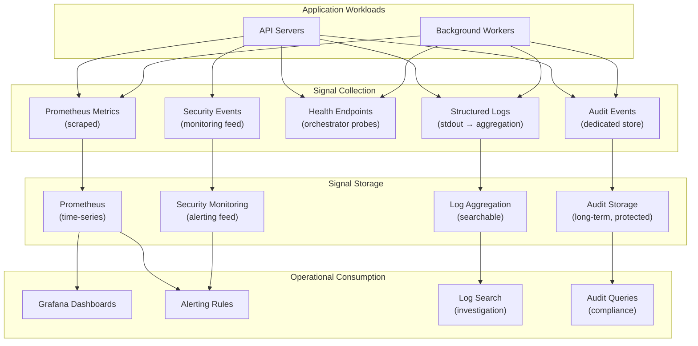

# Infrastructure Observability

## Metadata

| Field | Value |
|-------|-------|
| Title | Kairo Infrastructure Observability and Production Intelligence Architecture |
| Document ID | KAI-INFRA-011 |
| Status | Draft |
| Version | 0.1 |
| Target Release | V1 |
| Owner | Infrastructure Observability and Production Intelligence Architect |
| Created | 2026-07-23 |
| Last Updated | 2026-07-23 |
| Reviewers | TODO |
| Related Documents | [Infrastructure Architecture](./Infrastructure-Architecture.md), [Audit and Security Monitoring](../Security/Audit-and-Security-Monitoring.md), [Event Observability and Auditing](../Events/Event-Observability-and-Auditing.md), [Cross-Cutting Concerns](../Cross-Cutting-Concerns.md), [Incident Response](../Security/Incident-Response.md), [Availability and Resilience Architecture](./Availability-and-Resilience-Architecture.md) |
| Dependencies | [Infrastructure Architecture](./Infrastructure-Architecture.md), [Audit and Security Monitoring](../Security/Audit-and-Security-Monitoring.md) |

---

## Applicable Version

This document defines V1 infrastructure observability architecture. V1 uses Prometheus for metrics, structured JSON logging with aggregation, correlation IDs for request tracing, and Grafana for dashboards and alerting. Advanced capabilities (distributed tracing visualization, AI anomaly detection, SLI/SLO automation) are future investment.

---

## Purpose

This document defines how the Kairo platform is observed at the infrastructure level — what signals are collected, how they are structured, who owns them, and how they enable operational decisions.

Observability is the ability to understand the internal state of a system from its external outputs. Without deliberate observability, production becomes a black box: you know something is broken (users complain) but not what, where, or why. This document ensures every important dimension of system health is measurable, every failure is detectable, and every operational decision is informed by data.

---

## Scope

This document covers:

- Signal types (logs, metrics, traces, health, audits, security events) and their distinctions.
- Infrastructure and application signals for all platform components.
- Alerting architecture, severity, ownership, and response direction.
- Dashboards and operational visibility.
- Correlation across requests, events, and background processing.
- Sensitive data protection in observability signals.
- Tenant-level and platform-level visibility.
- V1 capabilities and future maturity.

This document does not cover:

- Monitoring vendor selection (Prometheus, Grafana, etc. are direction — not binding product selection).
- Dashboard layout or configuration (operations configuration).
- Alert routing configuration (PagerDuty, OpsGenie, etc.) (operations configuration).
- Log aggregation product selection (infrastructure decisions).
- Specific metric names or label schemas (development standards).
- Application-level event observability details (see [Event Observability and Auditing](../Events/Event-Observability-and-Auditing.md)).

---

## Mandatory Principles

| # | Principle |
|---|-----------|
| 1 | Logs, metrics, traces, audits, and security events are distinct |
| 2 | Correlation should connect requests, transactions, events, and background processing |
| 3 | Sensitive data must not be logged by default |
| 4 | Tenant-level visibility must not expose other tenants |
| 5 | Alerts must identify an owner and expected response |
| 6 | Every alert should represent an actionable condition |
| 7 | Deployment changes must be traceable in operational signals |
| 8 | Consumer lag and dead-letter growth require visibility |
| 9 | Database saturation must be observable |
| 10 | External provider failures must be distinguishable from internal failures |
| 11 | Observability infrastructure failure must not silently hide critical incidents |
| 12 | V1 should prioritize core signals before advanced analytics |

---

## Signal Taxonomy

### Distinct Signal Types

| Signal Type | Purpose | Audience | Retention | V1 |
|-------------|---------|----------|-----------|:---:|
| **Infrastructure logs** | System-level diagnostics (container, orchestrator, network) | Platform/DevOps | Days-weeks | Yes |
| **Application logs** | Application behavior, request flow, processing steps | Developers, operations | Days-weeks | Yes |
| **Audit events** | Compliance-grade record of who did what | Compliance, security, support | Long-term (years) | Yes |
| **Security events** | Security-relevant occurrences for monitoring and investigation | Security team, incident response | Long-term | Yes |
| **Metrics** | Quantitative measurements of system behavior | Operations, capacity planning | Months (aggregated) | Yes |
| **Distributed traces** | End-to-end request flow visualization | Developers, operations | Days | Direction (V2) |
| **Health signals** | Liveness, readiness, and dependency connectivity | Orchestrator, load balancer | Real-time | Yes |

**Logs, metrics, traces, audits, and security events are distinct.** They serve different audiences, have different retention requirements, and are not interchangeable.

---

## Signal Categories

### 1. Observability Purpose

| Purpose | Detail |
|---------|--------|
| Detect | Know when something is wrong (alerts, anomalies) |
| Diagnose | Understand what is wrong and where (logs, traces, metrics) |
| Resolve | Provide information to fix the problem (correlation, context) |
| Prevent | Identify trends that predict future problems (capacity, degradation) |
| Verify | Confirm that deployments, changes, and fixes are working |
| Account | Record what happened for compliance and investigation |

---

### 2. Infrastructure Logs

| Aspect | Detail |
|--------|--------|
| Source | Container runtime, orchestrator, load balancer, managed services |
| Content | Container lifecycle, scaling events, network events, DNS resolution |
| Format | Vendor/service-specific (collected by infrastructure logging) |
| Sensitivity | Generally non-sensitive (operational metadata, not business data) |
| Retention | Days to weeks |
| V1 | Collected from managed services and container platform |

---

### 3. Application Logs

**Sensitive data must not be logged by default.**

| Aspect | Detail |
|--------|--------|
| Source | Application code (API servers, workers) |
| Content | Request processing, business logic execution, errors, warnings, decisions |
| Format | Structured JSON with consistent fields (timestamp, level, message, correlationId, requestId, tenantId, module) |
| Sensitivity | **Payload content never logged for Confidential/Restricted data.** Metadata only (IDs, types, outcomes). |
| Levels | Debug (dev only), Information (standard), Warning (potential issues), Error (failures) |
| Correlation | Every log entry includes correlationId linking to the originating request |
| Retention | Days to weeks |
| V1 | Structured JSON to stdout. Collected by log aggregation. |

---

### 4. Audit Events

| Aspect | Detail |
|--------|--------|
| Source | Application (triggered by business-significant operations) |
| Content | Who (actor), what (action, resource), when (timestamp), where (tenant, context) |
| Format | Structured events per [Audit and Security Monitoring](../Security/Audit-and-Security-Monitoring.md) |
| Sensitivity | May contain identity information. Protected access. |
| Retention | Long-term (years) per compliance requirements |
| Separation | Audit events are NOT regular application logs. Different storage, retention, access control. |
| V1 | Captured through application audit service. Stored in audit-specific storage. |

---

### 5. Security Events

| Aspect | Detail |
|--------|--------|
| Source | Application security layer, infrastructure security (firewall, WAF future) |
| Content | Authentication failures, authorization violations, rate-limit triggers, suspicious patterns |
| Format | Structured events feeding security monitoring |
| Sensitivity | Contains security context (IP, user agent, failure patterns) but NOT credentials |
| Retention | Long-term (investigation and forensics) |
| Alerting | Real-time alerting for high-severity security events |
| V1 | Application emits security events. Alerting on authentication spikes, authz failures. |

---

### 6. Metrics

| Aspect | Detail |
|--------|--------|
| Source | Application (custom metrics), infrastructure (system metrics), managed services |
| Content | Counters, gauges, histograms measuring system behavior quantitatively |
| Format | Prometheus exposition format (V1 direction) |
| Cardinality | Controlled label cardinality (not per-request, not per-user by default) |
| Retention | Raw: days-weeks. Aggregated: months-years. |
| V1 | Prometheus scraping from application and infrastructure. Grafana for visualization. |

---

### 7. Distributed Traces

| Aspect | Detail |
|--------|--------|
| V1 approach | Correlation IDs in structured logs (manual trace reconstruction by filtering logs) |
| V2 approach | OpenTelemetry traces with visualization (Jaeger/Zipkin) |
| Content | Request span, dependency calls, event publication/consumption, background processing |
| Format | V1: log correlation. V2: W3C Trace Context compatible spans. |
| Retention | Days (traces are short-term diagnostic tools) |
| V1 sufficient | Correlation ID in all logs enables request tracing without dedicated trace infrastructure |

---

## Infrastructure Signals

### 8. Health Signals

**Health checks must reflect actual service readiness.**

| Signal | Source | Purpose |
|--------|--------|---------|
| Container liveness | Application health endpoint | Is the process alive? |
| Container readiness | Application readiness endpoint | Can the process serve requests? |
| Dependency connectivity | Application checks (DB, cache, search) | Are critical dependencies reachable? |
| Process CPU/memory | Container runtime metrics | Is the process resource-healthy? |

---

### 9. Availability Signals

| Signal | Metric | Alert Condition |
|--------|--------|-----------------|
| API uptime | Percentage of successful responses (non-5xx) | Below threshold |
| Endpoint availability | Per-endpoint success rate | Individual endpoint degradation |
| External monitoring | External probe (synthetic requests) | Platform unreachable from outside |
| Container restarts | Restart count per time window | Elevated restarts (crash loop) |

---

### 10. Latency Signals

| Signal | Metric | Alert Condition |
|--------|--------|-----------------|
| API response time (p50, p95, p99) | Histogram of response durations | p95/p99 exceeds threshold |
| Database query duration | Per-query latency | Slow queries above threshold |
| Cache response time | Cache operation latency | Cache degradation |
| External provider latency | Per-provider call duration | Provider slowdown |
| Event publication lag | Time from commit to publication | Publication falling behind |
| Event consumer lag | Time from publication to processing | Consumers falling behind |

---

### 11. Error Signals

| Signal | Metric | Alert Condition |
|--------|--------|-----------------|
| API error rate (5xx) | Percentage of 5xx responses | Above baseline |
| Application exceptions | Unhandled exception count | Any (should be zero normally) |
| Database errors | Connection failures, query errors | Above zero (brief transients acceptable) |
| Provider errors | External call failures | Elevated rate |
| Event processing failures | Consumer handler errors | Any failure (may indicate poison event) |
| Deployment-correlated errors | Error rate change after deployment | Spike correlated with deploy |

---

### 12. Saturation Signals

**Database saturation must be observable.**

| Signal | Metric | Alert Condition |
|--------|--------|-----------------|
| CPU utilization (API) | CPU percentage per instance | Sustained > 70% |
| Memory utilization (API/worker) | Memory usage vs limit | Approaching limit (> 85%) |
| Database CPU | Managed service CPU metric | Sustained > 60% |
| Database connections | Active connections vs pool max | Approaching pool exhaustion |
| Database I/O | Read/write throughput vs capacity | Approaching I/O limits |
| Cache memory | Used vs available | > 80% (eviction increasing) |
| Search memory | Heap usage vs allocated | Approaching limit |
| Disk (if applicable) | Usage vs capacity | > 80% |

---

### 13. Deployment Signals

**Deployment changes must be traceable in operational signals.**

| Signal | Source | Purpose |
|--------|--------|---------|
| Deployment event | CI/CD pipeline | Mark when deployments occur (annotate metrics) |
| Version identifier | Application health endpoint | Which version is running |
| Rollback event | CI/CD/operations | Mark when rollbacks occur |
| Post-deployment error rate | Metrics comparison | Detect deployment-caused issues |
| Post-deployment latency change | Metrics comparison | Detect performance regression |
| Migration execution | Deployment logs | Track schema migration timing and success |

---

### 14. Database Signals

| Signal | What It Shows | Alert When |
|--------|--------------|-----------|
| Connections active/idle | Pool utilization | Near maximum |
| Query duration (p95) | Query performance | Exceeds acceptable latency |
| Queries per second | Load | Unusual spike or drop |
| Replication lag (future) | Read-replica freshness | Lag exceeds threshold |
| Dead tuples / bloat | Maintenance needed | Exceeds threshold |
| Disk usage | Storage growth | Approaching capacity |
| Lock waits | Contention | Elevated lock waits |
| Failover events | HA activity | Any (indicates issue with primary) |

---

### 15. Cache Signals

| Signal | What It Shows | Alert When |
|--------|--------------|-----------|
| Hit rate | Cache effectiveness | Below expected threshold |
| Eviction rate | Working set exceeds memory | Elevated (capacity needed) |
| Memory usage | Capacity utilization | Approaching limit |
| Connection count | Client load | Near maximum |
| Operations per second | Load | Unusual spike or drop |
| Latency (p95) | Cache performance | Exceeds threshold |
| Key count | Data volume | Growth trend for planning |

---

### 16. Search Signals

| Signal | What It Shows | Alert When |
|--------|--------------|-----------|
| Query latency (p95) | Search performance | Exceeds threshold |
| Indexing lag | How far behind authoritative data | Lag exceeds threshold |
| Index size | Storage growth | Approaching capacity |
| Heap usage | Memory pressure | Approaching limit |
| Queries per second | Load | Unusual spike |
| Indexing errors | Data synchronization issues | Any errors |

---

### 17. Event Signals

**Consumer lag and dead-letter growth require visibility.**

| Signal | What It Shows | Alert When |
|--------|--------------|-----------|
| Outbox pending count | Publication backlog | Growing (publication stalled) |
| Outbox pending age | Oldest unprocessed event | Exceeds threshold (seconds) |
| Events published per second | Throughput | Drop (producer issue) |
| Consumer lag per consumer | Processing delay | Exceeds threshold |
| Dead-letter count | Failed events | Any (investigation needed) |
| Dead-letter age | Oldest unresolved failure | Exceeds SLA |
| Event processing duration | Consumer performance | p95 exceeds threshold |
| Reference | [Event Observability and Auditing](../Events/Event-Observability-and-Auditing.md) | — |

---

### 18. Object-Storage Signals

| Signal | What It Shows | Alert When |
|--------|--------------|-----------|
| Storage volume | Total data stored | Growth trend for cost planning |
| Request rate | Access patterns | Unusual spike |
| Error rate | Storage availability | Above zero (brief acceptable) |
| Latency | Storage performance | Degradation |

---

### 19. Network Signals

| Signal | What It Shows | Alert When |
|--------|--------------|-----------|
| Bandwidth utilization | Traffic volume | Approaching capacity |
| Packet loss | Network health | Above zero (brief acceptable) |
| DNS resolution time | Name resolution health | Elevated |
| TLS handshake failures | Certificate or config issues | Any |
| Load-balancer health | Frontend availability | Backends unhealthy |
| Connection timeouts | Network issues between zones | Elevated |

---

### 20. CI/CD Signals

| Signal | What It Shows | Alert When |
|--------|--------------|-----------|
| Pipeline duration | Build/deploy speed | Increasing (bottleneck) |
| Pipeline success rate | Build reliability | Below threshold |
| Deployment frequency | Release cadence | Unexpected change |
| Failed deployments | Release issues | Any (investigation needed) |
| Rollback count | Release quality | Any (root cause analysis needed) |

---

### 21. Cost Signals

| Signal | What It Shows | Alert When |
|--------|--------------|-----------|
| Monthly spend by component | Infrastructure cost breakdown | Exceeds budget threshold |
| Cost growth rate | Spending trend | Growing faster than revenue |
| Per-tenant resource usage (direction) | Resource attribution | Single tenant disproportionate |
| Idle resource detection | Waste | Resources provisioned but unused |

---

## Visibility Scoping

### 22. Tenant-Level Signals

**Tenant-level visibility must not expose other tenants.**

| Rule | Detail |
|------|--------|
| Per-tenant metrics | Metrics can be filtered by tenant for support and investigation |
| Scoped access | Support seeing Tenant A's metrics cannot see Tenant B's |
| No cross-tenant aggregation in tenant view | Tenant views show only their own data |
| Platform operators | Platform operators can see per-tenant metrics (authorized) |
| Tenant-facing (future) | V2+: tenants see their own API usage, webhook delivery health |
| Labels controlled | Tenant ID as a metric label has cardinality implications — used selectively |

---

### 23. Platform-Level Signals

| Rule | Detail |
|------|--------|
| Aggregate view | Platform operators see aggregate metrics (total requests, total events, total errors) |
| Drill-down | Can drill down to specific components, specific tenants (authorized) |
| Capacity focus | Platform view focuses on capacity, health, and trends |
| No business data | Platform metrics show counts and rates, not payload content |
| Cost attribution | Platform view includes infrastructure cost breakdown |

---

## Alerting

### 24. Alerting Architecture

**Every alert should represent an actionable condition.**
**Alerts must identify an owner and expected response.**

| Rule | Detail |
|------|--------|
| Actionable | Every alert has a defined response action (not just "investigate") |
| Owned | Every alert has an assigned owner (team or individual on-call) |
| Documented | Each alert has a runbook reference (what to check, how to resolve) |
| Not noisy | Alerts that fire without actionable cause are tuned or removed |
| Not silent | Critical conditions must alert. Missing alerts is worse than false alerts. |
| Correlated | Related alerts are grouped (not N separate alerts for one incident) |
| Escalation | Unacknowledged alerts escalate after defined periods |

---

### 25. Alert Severity

| Severity | Definition | Response Time | Example |
|----------|-----------|--------------|---------|
| **Critical** | Revenue-impacting. Data at risk. Security breach. | Immediate (minutes) | Database down. Payment flow broken. Auth bypass detected. |
| **High** | Significant degradation. May become critical. | Within 30 minutes | API error rate spike. Consumer lag growing. Dead-letter event (financial). |
| **Warning** | Potential issue. Monitor. May resolve. | Within hours | Elevated latency. Cache eviction rate high. Disk approaching capacity. |
| **Info** | Informational. No immediate action. | Business hours | Deployment completed. Scheduled maintenance approaching. |

---

### 26. On-Call Direction

| Aspect | V1 Direction |
|--------|-------------|
| Model | Shared on-call rotation (small team) |
| Scope | Responsible for critical and high alerts outside business hours |
| Runbooks | Each alert has a runbook entry (investigation steps, resolution options) |
| Escalation | Unacknowledged critical alerts escalate to secondary on-call |
| Post-incident | Incidents require post-incident review |
| Tooling | Alert notification service (direction: PagerDuty/OpsGenie equivalent) |
| V1 practical | Small team with shared responsibility. Formal on-call rotation as team grows. |

---

### 27. Dashboards

| Dashboard | Audience | Content |
|-----------|----------|---------|
| Platform health overview | Operations, management | API availability, error rate, latency, key dependencies status |
| API performance | Operations, developers | Per-endpoint latency, error rates, request volume |
| Database health | Operations, platform | Connections, query performance, replication, storage |
| Cache health | Operations | Hit rate, memory, evictions, latency |
| Event health | Operations, developers | Publication rate, consumer lag, dead-letter count |
| Deployment tracking | Operations, developers | Recent deployments, version distribution, deployment-correlated metrics |
| Cost overview | Platform, management | Spend per component, growth trends |
| Per-tenant (support) | Support, operations | Tenant-specific API usage, errors, event status (tenant-scoped view) |
| Security | Security team | Auth failure trends, rate-limit triggers, security event volume |
| Capacity | Operations, platform | Saturation signals, growth trends, forecasting |

---

## Data Protection

### 28. Retention

| Signal Type | V1 Retention | Future |
|-------------|-------------|--------|
| Application logs | 7-14 days | Configurable, tiered storage |
| Infrastructure logs | 7-14 days | Same |
| Metrics (raw) | 14-30 days | Longer with downsampling |
| Metrics (aggregated) | Months-years | Same |
| Audit events | Per compliance (years) | Same |
| Security events | Months-years (investigation) | Same |
| Distributed traces | Days (V2+) | Days (diagnostic, not archival) |
| Alert history | Weeks-months | Same |

---

### 29. Redaction

**Sensitive data must not be logged by default.**

| Rule | Detail |
|------|--------|
| No PII in logs | Customer names, emails, addresses never in application logs |
| No secrets in logs | Passwords, tokens, API keys never logged (even at debug level) |
| No financial details | Card numbers, bank accounts never in logs |
| IDs are acceptable | Resource IDs, tenant IDs, correlation IDs are non-sensitive (loggable) |
| Payload not logged | API request/response bodies not logged for Confidential/Restricted |
| Error messages sanitized | Error logs do not include sensitive context from the failed operation |
| Metric labels clean | Metric labels do not contain PII or tenant business data |
| Search queries | User search terms not logged (may reveal intent/personal info) |
| Provider responses | External provider responses not logged in full (may contain sensitive data) |

---

### 30. Incident Correlation

**Correlation should connect requests, transactions, events, and background processing.**

| Mechanism | How It Works |
|-----------|-------------|
| Correlation ID | Single ID flows from API request → business logic → event publication → consumer processing |
| Request ID | Unique per HTTP request (subset of correlation for single-request scope) |
| Causation chain | Event causation IDs link event chains (A caused B, B caused C) |
| Deployment annotation | Deployment events marked on metric timelines (correlate changes with behavior) |
| Tenant context | Logs include tenant ID (filter all activity for a specific tenant investigation) |
| Module identification | Logs include module/component (isolate issue to specific module) |

| Rule | Detail |
|------|--------|
| End-to-end | Given a correlation ID, an operator can find ALL related: logs, metrics, events, audit records |
| Deployment-aware | Incidents are correlated with recent deployments (was this caused by a deploy?) |
| Cross-component | Correlation spans API → worker → event consumer (same correlation ID) |
| V1 implementation | Correlation ID in all structured log entries. Metric annotations for deployments. |

---

## Observability Flow Diagram

---

## Ownership Matrix

| Signal Category | Emitter | Collector | Storage Owner | Consumer | Alert Owner |
|----------------|---------|-----------|---------------|----------|-------------|
| Application logs | Module teams | Platform infrastructure | Platform/DevOps | Developers, operations | Module team (app errors) |
| Infrastructure logs | Managed services, container platform | Platform infrastructure | Platform/DevOps | Platform/DevOps | Platform/DevOps |
| Metrics (application) | Module teams (instrumentation) | Prometheus (platform) | Platform/DevOps | Operations, developers | Per-metric owner |
| Metrics (infrastructure) | Managed services, container platform | Prometheus (platform) | Platform/DevOps | Operations | Platform/DevOps |
| Audit events | Module teams (emit) | Audit service (platform) | Security/compliance | Compliance, security, support | Security team |
| Security events | Application security layer | Security monitoring | Security team | Security team | Security team |
| Health signals | Application (endpoints) | Orchestrator | Platform/DevOps | Orchestrator (automation) | Platform/DevOps |
| Deployment signals | CI/CD pipeline | Platform/DevOps | Platform/DevOps | Operations, developers | Platform/DevOps |

---

## Alert-Severity Matrix

| Component | Warning | High | Critical |
|-----------|---------|------|----------|
| API availability | Error rate > 1% | Error rate > 5% | Error rate > 20% or total outage |
| API latency | p99 > 2x baseline | p99 > 5x baseline | p99 > 10x or timeouts |
| Database | CPU > 60%, connections > 70% | CPU > 80%, queries > 5x latency | Unreachable, failover triggered |
| Cache | Eviction rate elevated | Hit rate drops > 20% | Unreachable |
| Search | Latency > 2x baseline | Indexing lag > 5 min | Unreachable |
| Events | Consumer lag > 30s | Consumer lag > 5 min, dead-letter created | Publication stalled |
| Deployment | Elevated errors post-deploy | Error rate spike post-deploy | Critical path broken post-deploy |
| Security | Rate-limit triggers elevated | Auth failure spike | Auth bypass, data exposure |
| Workers | Processing lag elevated | Worker not processing | Worker crash loop |
| External provider | Elevated latency | Error rate spike | Provider unreachable (circuit open) |
| Cost | Growth above forecast | Unusual spend spike | — |
| Container | Restart count elevated | Memory approaching limit | Crash loop (repeated OOM) |

---

## V1 Observability

### 31. V1 Observability

| Capability | V1 Implementation |
|-----------|-------------------|
| Application logs | Structured JSON to stdout. Collected by log aggregation. Correlation ID in every entry. |
| Infrastructure logs | From managed services and container platform (vendor-provided). |
| Metrics | Prometheus. Application exposes metrics endpoint. Infrastructure metrics from exporters/managed services. |
| Dashboards | Grafana. Platform health, API performance, database, cache, events, deployment. |
| Alerting | Grafana alerting or Prometheus Alertmanager. Rules for critical/high conditions. |
| Health checks | Application liveness + readiness endpoints. Orchestrator probes. |
| Deployment tracking | Deployment events annotated on Grafana dashboards. |
| Correlation | Correlation ID in all logs. Request ID in headers. Tenant ID in all entries. |
| Audit | Application-level audit events to dedicated store. |
| Security events | Application emits security events. Alerting on authentication anomalies. |
| Distributed traces | V1: log-based correlation (no dedicated tracing infrastructure). |
| Sensitive data | Payload never logged. Metadata only. |
| Retention | Logs: 7-14 days. Metrics raw: 14-30 days. Audit: long-term. |

---

### 32. Future Maturity

| Capability | V1 | V2 | V3+ |
|-----------|:---:|:---:|:---:|
| Structured application logging | **Yes** | Yes | Yes |
| Prometheus metrics | **Yes** | Yes (+ enhanced) | Yes |
| Grafana dashboards | **Yes** | Enhanced | Full observability platform |
| Correlation ID propagation | **Yes** | Yes | Yes |
| Health checks (liveness + readiness) | **Yes** | Yes (+ dependency health) | Yes |
| Alerting (critical/high) | **Yes** | Enhanced (SLO-based) | AI-assisted |
| Deployment annotations | **Yes** | Yes | Yes |
| Audit to dedicated store | **Yes** | Yes | Yes |
| Security event alerting | **Yes** (basic) | Enhanced (SIEM) | Full SIEM integration |
| Log-based correlation | **Yes** | + Distributed tracing (OTel) | Full trace visualization |
| Tenant-level metrics | Basic (labels) | Per-tenant dashboard | Tenant-facing dashboard |
| Cost signals | Basic (cloud billing) | Per-component tracking | Automated optimization |
| SLI/SLO tracking | No (measure first) | **Yes** | Formal SLA reporting |
| AI anomaly detection | No | Evaluated | **Yes** |
| External synthetic monitoring | Direction | **Yes** | Multi-region probes |
| Observability-as-code | Basic (Grafana provisioning) | **Yes** | Full |
| Log-based alerting | Basic | Enhanced (pattern matching) | ML-based |
| On-call management | Shared rotation | Formal rotation tool | Advanced escalation |

---

## Observability Infrastructure Resilience

**Observability infrastructure failure must not silently hide critical incidents.**

| Rule | Detail |
|------|--------|
| Independent lifecycle | Observability runs independently from the application (survives application crash) |
| Self-monitoring | Monitoring monitors itself (dead-man's switch — alert if monitoring stops reporting) |
| External backup | External uptime monitoring (simple ping/probe) detects total outage even if internal monitoring is down |
| Failure is an incident | Observability outage is itself a high-severity incident (operational blindness) |
| Graceful loss | Brief log loss (during aggregation restart) is acceptable. Extended loss is not. |
| Application continues | Application does not stop if logging/metrics infrastructure is down (degrade: lose visibility, not function) |

---

## Version Gate

| Version | Infrastructure Observability Gate |
|---------|----------------------------------|
| V1 | Structured JSON application logging with correlation IDs. Prometheus metrics for API, database, cache, events, workers. Grafana dashboards (platform health, API performance, database, events, deployment). Alerting for critical/high conditions (error rate, latency, saturation, dead-letter, worker health). Health checks (liveness + readiness) on all containers. Deployment annotations on dashboards. Audit events to dedicated store. Security event alerting (auth anomalies). Sensitive data never logged. Tenant ID in logs (support filtering). External uptime monitoring direction. Log retention 7-14 days. Metric retention 14-30 days raw. |
| V2 | OpenTelemetry distributed tracing. SLI/SLO definition and tracking. External synthetic monitoring. Enhanced per-tenant dashboards. Log-based pattern alerting. SIEM integration. Observability-as-code. Cost attribution per component. Formal on-call tooling. |
| V3 | AI anomaly detection. Predictive alerting. Multi-region observability. Tenant-facing health dashboard. Full compliance observability. Automated SLA reporting. Self-healing triggers from observability signals. |

---

## Decision Summary

| Decision | Rationale |
|----------|-----------|
| Prometheus + Grafana for V1 | Open-source, well-understood, part of approved stack. Sufficient for V1 observability needs. |
| Structured JSON logging | Searchable, parseable, consistent. Enables correlation without dedicated tracing infrastructure. |
| Correlation ID as V1 tracing | Provides 80% of distributed-tracing value with minimal infrastructure. Full tracing is V2. |
| Separate audit from application logs | Different retention (years vs days), different access control (compliance vs developers), different purpose. |
| Alert severity model (4 levels) | Clear escalation. Actionable responses. Prevents alert fatigue from noise. |
| Payload never logged | Prevents sensitive data accumulation in log infrastructure with potentially weaker access controls. |
| External uptime monitoring | Detects total failure even when internal monitoring is down (independent verification). |
| Deployment annotations | Enables instant correlation between metric changes and deployments (was this deploy related?). |
| Per-metric alert ownership | Every alert has someone accountable. Unowned alerts are either assigned or deleted. |

---

## Alternatives Considered

| Alternative | Rejected Because |
|------------|-----------------|
| Full distributed tracing in V1 | Requires additional infrastructure (trace backend). Correlation IDs in logs are sufficient for V1 monolith. |
| Payload logging with redaction | Redaction is error-prone (miss a field = data leak). Not logging payloads is safer. |
| Single log/metric store for everything | Audit and security have different retention and access requirements. Mixing creates compliance issues. |
| No alerting (just dashboards) | Dashboards require someone watching. Alerts push notification of problems. Essential for production. |
| SLA commitments in V1 | Cannot commit to SLA without measured evidence of achievable availability. Measure first. |
| Log everything (worry about storage later) | Storage costs accumulate. Sensitive data in logs is a liability. Controlled logging from the start. |
| Complex observability platform (V1) | Over-investment for a small team. Prometheus + Grafana + structured logs is sufficient and cost-effective. |
| Alert on every error | Alert fatigue. Transient errors are normal. Alert on rates and trends, not individual occurrences. |

---

## Architecture Impact

| Concern | Impact |
|---------|--------|
| Application design | Must emit structured logs with correlation IDs. Must expose Prometheus metrics. Must implement health endpoints. Must emit audit events. Must not log sensitive data. |
| Infrastructure | Must provide log aggregation, Prometheus, Grafana. Must configure alerting. Must maintain external monitoring. |
| Operations | Must respond to alerts. Must investigate incidents using observability tools. Must maintain dashboards and alert rules. |
| Security | Must emit security events. Must validate no sensitive data in logs. Must manage audit event access. |
| Development | Must instrument code for observability (metrics, logs, correlation). Must consider observability in design. |

---

## Implementation Impact

| Area | Impact |
|------|--------|
| Application | Must use structured logging library. Must expose /metrics endpoint. Must implement /health and /ready endpoints. Must include correlation ID in all logs. Must emit audit events for significant operations. |
| Platform/DevOps | Must deploy and maintain Prometheus + Grafana. Must configure log aggregation. Must create dashboards. Must configure alert rules. Must manage retention. |
| Operations | Must respond to alerts per runbooks. Must maintain alert hygiene (tune noisy alerts). Must participate in incident review. |
| Security | Must monitor security events. Must manage audit access. Must validate sensitive data protection. |
| Support | Must use correlation-based log search for investigation. Must access tenant-scoped views. |

---

## Security Responsibilities

| Role | Observability Security Responsibilities |
|------|----------------------------------------|
| Platform/DevOps | Configures log collection and retention. Manages metric infrastructure. Controls dashboard access. |
| Security Team | Monitors security events. Validates no sensitive data in logs. Reviews alert rules for security conditions. Manages audit access. |
| Module Teams | Emit appropriate logs (no sensitive data). Instrument metrics. Emit audit events. Implement health checks. |
| Operations | Responds to alerts. Ensures observability infrastructure health. Manages on-call. |

---

## Multi-Tenancy Responsibilities

| Responsibility | Detail |
|---------------|--------|
| Tenant ID in logs | All tenant-scoped log entries include tenant identifier (for filtering) |
| Scoped investigation | Support investigates per-tenant (cannot see other tenants' logs) |
| Metrics labels | Tenant ID as metric label used selectively (cardinality management) |
| No cross-tenant exposure | Dashboards and log queries are scoped (tenant A cannot see tenant B) |
| Aggregate for platform | Platform operators see aggregates (totals across tenants, drill-down authorized) |

---

## Out of Scope

This document does not define:

- Monitoring vendor selection (infrastructure decision within direction).
- Dashboard layout or specific panel configuration (operations configuration).
- Alert routing configuration (PagerDuty, OpsGenie integration) (operations setup).
- Specific metric names or label schemas (development standards).
- Log aggregation product specifics (infrastructure decision).
- On-call rotation schedules (team process).
- Incident response procedures (see [Incident Response](../Security/Incident-Response.md)).
- Specific alert threshold values (operations configuration, tuned over time).

---

## Future Considerations

- **OpenTelemetry** — Full distributed tracing with trace visualization.
- **SLI/SLO framework** — Service Level Indicators and Objectives with error-budget tracking.
- **AI anomaly detection** — ML-based detection of unusual patterns without explicit threshold rules.
- **Tenant-facing observability** — Tenants see their own API usage, webhook delivery health, and error rates.
- **Observability-as-code** — Dashboard and alert definitions in version control (fully reproducible).
- **Log analytics** — Pattern detection and trend analysis from log streams.
- **Synthetic monitoring** — Automated external probes simulating user journeys.
- **Cost observability** — Per-tenant, per-request cost attribution.

---

## Future Refactoring Triggers

This document should be revisited when:

- Distributed tracing infrastructure is deployed (trigger for trace integration).
- SLI/SLO framework is adopted (trigger for SLO-based alerting).
- Team size requires formal on-call tooling (trigger for on-call platform adoption).
- Observability data volume creates storage cost concerns (trigger for retention tuning).
- Multi-region deployment requires distributed observability (trigger for cross-region aggregation).
- Tenant-facing health dashboard is needed (trigger for tenant observability design).
- Alert fatigue indicates rule tuning needed (trigger for alert hygiene review).

---

## Change History

| Version | Date | Author | Description |
|---------|------|--------|-------------|
| 0.1 | 2026-07-23 | Infrastructure Observability and Production Intelligence Architect | Initial draft — infrastructure observability |
