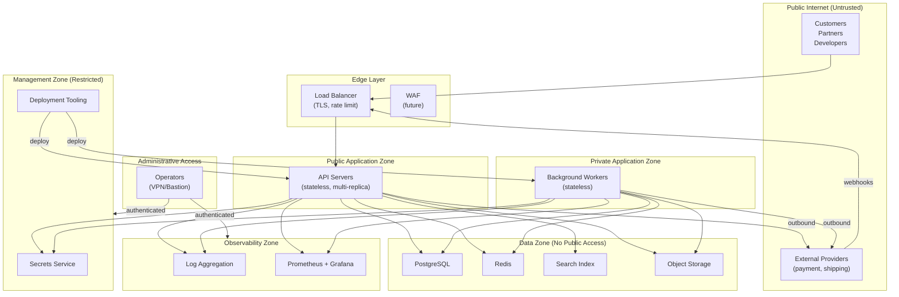
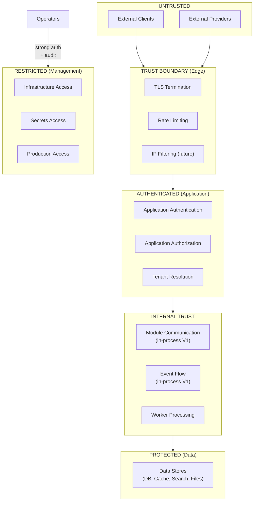

# Network and Trust Boundaries

## Metadata

| Field | Value |
|-------|-------|
| Title | Kairo Network Security and Trust Boundary Architecture |
| Document ID | KAI-INFRA-004 |
| Status | Draft |
| Version | 0.1 |
| Target Release | V1 |
| Owner | Network Security and Trust Boundary Architect |
| Created | 2026-07-23 |
| Last Updated | 2026-07-23 |
| Reviewers | TODO |
| Related Documents | [Infrastructure Architecture](./Infrastructure-Architecture.md), [Security Architecture](../Security/Security-Architecture.md), [API Security](../Security/API-Security.md), [Event Security and Tenant Context](../Events/Event-Security-and-Tenant-Context.md), [Secrets and Key Management](../Security/Secrets-and-Key-Management.md), [Hosting and Runtime Architecture](./Hosting-and-Runtime-Architecture.md) |
| Dependencies | [Infrastructure Architecture](./Infrastructure-Architecture.md), [Security Architecture](../Security/Security-Architecture.md) |

---

## Applicable Version

This document defines V1 conceptual network architecture. V1 uses a minimal zone model (public edge, private application, private data, management) with explicit trust boundaries. The architecture supports future zero-trust evolution without requiring it in V1.

---

## Purpose

This document defines the conceptual network zones, trust boundaries, and access rules that govern how traffic flows within and around the Kairo platform. It establishes what can reach what, under which conditions, and with which authentication requirements.

Network architecture is the outermost defense layer. A database reachable from the public internet is a data breach waiting to happen. An administrative interface without strong authentication is a takeover risk. This document ensures that every network path is intentional, every boundary is explicit, and no access is granted by default.

---

## Scope

This document covers:

- Conceptual network zones and their purposes.
- Trust boundaries between zones.
- Ingress, egress, and inter-zone communication rules.
- TLS, DNS, firewall, and identity direction.
- Administrative, support, CI/CD, and emergency access.
- Network observability requirements.
- V1 controls and future zero-trust direction.

This document does not cover:

- IP address ranges, CIDR blocks, or subnet definitions (infrastructure configuration).
- Specific firewall rules or security group configurations (infrastructure operations).
- Cloud networking products (VPC, VNet, etc.) selection (infrastructure decisions).
- DNS registrar or zone configuration (operations configuration).
- TLS certificate procurement or rotation procedures (operations).
- VPN product selection (infrastructure decisions).

---

## Mandatory Principles

| # | Principle |
|---|-----------|
| 1 | Internal network location does not automatically establish authorization |
| 2 | Public and administrative entry points must be distinguishable |
| 3 | Data infrastructure should not be publicly reachable |
| 4 | Inbound access is denied unless explicitly required |
| 5 | Outbound access must be controlled where practical |
| 6 | Webhook endpoints remain untrusted until payload authenticity is verified |
| 7 | Administrative infrastructure access requires strong authentication |
| 8 | Production management access must be restricted and audited |
| 9 | Application workloads must use workload identity or scoped credentials where possible |
| 10 | Tenant isolation must not depend solely on network separation |
| 11 | Future zero-trust evolution must remain possible |

---

## Conceptual Network Zones

### Zone Definitions

| Zone | Purpose | Accessibility | Trust Level |
|------|---------|---------------|-------------|
| **Public Internet** | External clients, customers, partners | Open | Untrusted |
| **Edge Layer** | TLS termination, rate limiting, WAF | Internet-facing | Boundary (filters untrusted) |
| **Public Application Zone** | API servers handling external requests | Edge-accessible only | Authenticated per request |
| **Private Application Zone** | Background workers, internal processing | Not internet-accessible | Internal trusted |
| **Background Processing Zone** | Outbox processing, event consumption, async work | Not internet-accessible | Internal trusted |
| **Data Zone** | Database, cache, search, object storage | Application-accessible only | Highly protected |
| **Management Zone** | Secrets management, deployment tooling, infrastructure control | Restricted access | Highest trust |
| **Observability Zone** | Logging, metrics, alerting infrastructure | Application-accessible (write), ops-accessible (read) | Operational |
| **CI/CD Execution Zone** | Build and deployment pipelines | Controlled egress to environments | Automated trusted |
| **External Provider Zone** | Payment gateways, shipping carriers, email services | Outbound from application | Untrusted (verified per provider) |
| **Administrative Access Zone** | Operator workstations, VPN endpoints | Restricted ingress | Strong auth required |

---

### Network-Zone Diagram

---

## Trust-Boundary Diagram

---

## Communication Rules

### 1. Public Ingress

| Rule | Detail |
|------|--------|
| Entry point | Load balancer (edge layer) is the only public entry point |
| TLS required | All public traffic is encrypted (HTTPS only, no HTTP) |
| Rate-limited | All public ingress is rate-limited before reaching the application |
| Authenticated at application | Authentication happens in the application zone (not at edge in V1) |
| Default deny | No other port or service is internet-accessible |

---

### 2. Administrative Ingress

**Public and administrative entry points must be distinguishable.**

| Rule | Detail |
|------|--------|
| Separate path | Administrative access uses distinct entry points (separate domain, path prefix, or port) |
| Not casually discoverable | Admin endpoints are not advertised to public consumers |
| Elevated authentication | Admin access requires stronger authentication (MFA, elevated roles) |
| Platform admin | Platform operations access uses separate, restricted entry (VPN/bastion for infrastructure) |
| Audited | All administrative ingress is logged |

---

### 3. Internal Communication

**Internal network location does not automatically establish authorization.**

| Rule | Detail |
|------|--------|
| V1: in-process | Module-to-module communication is in-process (same memory space). No network. |
| Application context flows | Even internal communication carries the request's authentication and tenant context |
| Future: authenticated | If services are extracted, inter-service communication requires service identity authentication |
| Not a security bypass | Being "internal" does not bypass authorization. The caller's context is still validated. |
| No implicit trust from IP | An internal IP address does not grant access. Identity must be verified. |

---

### 4. Data-Store Connectivity

**Data infrastructure should not be publicly reachable.**

| Rule | Detail |
|------|--------|
| Private only | Database is accessible only from the application and worker zones |
| Not internet-accessible | No public IP or endpoint for the database |
| Authenticated | Application connects with credentials (managed via secrets service) |
| Encrypted in transit | Connections to database use TLS |
| Scoped credentials | Application credentials have only the permissions needed (not superuser) |
| Worker access | Workers connect to the same database with appropriate credentials |

---

### 5. Cache Connectivity

| Rule | Detail |
|------|--------|
| Private only | Cache is accessible only from application and worker zones |
| Not internet-accessible | No public endpoint |
| Authenticated | Connection requires credentials (password/ACL) |
| Encrypted in transit | TLS for cache connections (V1: where managed service supports it) |
| Scoped | Application uses minimum required cache permissions |

---

### 6. Search Connectivity

| Rule | Detail |
|------|--------|
| Private only | Search index is accessible only from application and worker zones |
| Not internet-accessible | No public endpoint |
| Authenticated | Connection requires credentials |
| Encrypted in transit | TLS for search connections |
| Read/write separation | API may have read-only access. Workers have write access (for indexing). |

---

### 7. Event Transport Connectivity

| Rule | Detail |
|------|--------|
| V1: in-process | No network transport for events (in-process delivery) |
| Future: broker | When a broker is deployed, it lives in the private application zone (or data zone) |
| Not internet-accessible | Event broker (future) has no public endpoint |
| Authenticated | Broker connections require service credentials (future) |
| Encrypted | Broker connections use TLS (future) |

---

### 8. Object-Storage Connectivity

| Rule | Detail |
|------|--------|
| Application access | Application and workers access object storage via API (SDK/HTTP) |
| Not directly public | Objects are not served directly to public. Served via signed URLs or application proxy. |
| Signed URLs | Public access to files uses time-limited, signed URLs generated by the application |
| Authenticated | Application uses credentials to access storage |
| Tenant-scoped paths | Tenant data lives in tenant-scoped paths/containers |

---

### 9. External API Egress

**Outbound access must be controlled where practical.**

| Rule | Detail |
|------|--------|
| Purpose | Application calls external providers (payment, shipping, email, SMS) |
| Controlled | Only known external endpoints are accessible (allowlist direction for sensitive operations) |
| Authenticated | Application authenticates to external providers with appropriate credentials |
| Encrypted | All outbound calls use HTTPS |
| Logged | External API calls are logged (not payloads for sensitive, but occurrence and outcome) |
| Idempotent | External calls carry idempotency keys where applicable (per [Idempotency](../API/Idempotency-Concurrency-and-Retries.md)) |
| Timeout | All external calls have timeouts (no indefinite waits) |

---

### 10. Webhook Ingress

**Webhook endpoints remain untrusted until payload authenticity is verified.**

| Rule | Detail |
|------|--------|
| Entry point | Webhooks arrive through the same edge layer as public API traffic |
| Untrusted by default | Webhook payloads are untrusted until signature is verified |
| Verification first | Signature verification occurs before any business processing |
| Provider-specific | Each provider type has its own receiver endpoint |
| Rate-limited | Webhook endpoints are rate-limited (spike-tolerant) |
| No SSRF | Webhook processing does not follow redirects or fetch arbitrary URLs from payload content |
| Reference | Per [Event Security and Tenant Context](../Events/Event-Security-and-Tenant-Context.md) |

---

### 11. Webhook Egress

| Rule | Detail |
|------|--------|
| Purpose | Platform delivers outbound webhooks to tenant-registered endpoints |
| Outbound HTTPS | All webhook deliveries use HTTPS |
| Timeout | Deliveries have short timeouts (provider unresponsive → retry later) |
| No follow redirects | Webhook delivery does not follow HTTP redirects (prevents redirect-based attacks) |
| Source IP direction | V2+: publish source IP ranges for consumer allowlisting |
| SSRF prevention | Delivery targets are validated (no internal/private IP ranges) |
| Signed | Deliveries are HMAC-signed for receiver verification |

---

### 12. DNS Direction

| Rule | Detail |
|------|--------|
| Public DNS | Public API and frontend domains resolve through public DNS |
| Private DNS | Internal service discovery (future) uses private DNS (not public) |
| Environment-specific | Each environment has its own domain (per [Environment Architecture](./Environment-Architecture.md)) |
| TLS-aligned | DNS names align with TLS certificates |
| Managed | DNS is managed through infrastructure-as-code (not manual portal changes) |

---

### 13. TLS Direction

| Rule | Detail |
|------|--------|
| Everywhere external | All external communication uses TLS 1.2+ |
| Terminated at edge | TLS termination at the load balancer (V1). Re-encryption to application evaluated (V2). |
| Internal TLS | V1: internal communication is in-process (no network, no TLS needed). Future: TLS for inter-service. |
| Certificate management | Managed certificates (auto-renewal). No manual certificate handling. |
| No self-signed in production | Production uses properly issued certificates from a trusted CA |
| Data store connections | TLS for all data store connections (where managed service supports it) |

---

### 14. Firewall Direction

**Inbound access is denied unless explicitly required.**

| Rule | Detail |
|------|--------|
| Default deny inbound | All inbound traffic is blocked unless an explicit allow rule exists |
| Minimal ingress | Only the load balancer accepts public traffic. Nothing else. |
| Zone-scoped egress | Each zone can only reach what it explicitly needs |
| Application → data | Application zone can reach data zone (database, cache, search, files) |
| Application → external | Application zone can reach approved external providers |
| Data → nothing | Data zone does not initiate outbound connections |
| Management → all | Management zone can reach all zones (restricted access, audited) |
| Reviewed | Firewall rules are reviewed periodically. Unused rules are removed. |

---

### 15. Service Identity

**Application workloads must use workload identity or scoped credentials where possible.**

| Rule | Detail |
|------|--------|
| Workload identity | Application processes authenticate to infrastructure using managed identity (not long-lived static credentials where avoidable) |
| Scoped | Each workload has the minimum permissions it needs (API process ≠ same permissions as migration workload) |
| Rotatable | Where static credentials are necessary, they are rotatable without downtime |
| No shared credentials | Different workload types have separate credentials (API vs worker vs migration) |
| Future: mutual TLS | If services are extracted, mutual TLS provides service-to-service identity |
| Secret-free where possible | Prefer managed identity (automatic credential rotation) over static secrets |

---

### 16. Administrative Access

**Administrative infrastructure access requires strong authentication.**
**Production management access must be restricted and audited.**

| Rule | Detail |
|------|--------|
| VPN or bastion | Infrastructure access is not directly from the public internet. Requires VPN or bastion host. |
| MFA required | Multi-factor authentication for all administrative access |
| Role-based | Access is role-based (not everyone gets full admin) |
| Time-limited | Elevated access is granted for specific duration (not permanent) |
| Just-in-time | Production access is granted when needed, not pre-provisioned |
| Audited | Every administrative access is logged (who, when, what) |
| Separate from application auth | Infrastructure admin authentication is separate from application user authentication |

---

### 17. Support Access

| Rule | Detail |
|------|--------|
| Application-level | Support investigates using application observability tools (logs, metrics, dashboards) |
| Not direct infrastructure | Support does not directly access database or infrastructure (uses application tooling) |
| Scoped | Support access is scoped to the investigation context (tenant, time window) |
| Audited | Support access to diagnostic tools is logged |
| No production data export | Support cannot bulk-export production data through support tools |
| Escalation | If infrastructure access is needed, support escalates to operations with justification |

---

### 18. CI/CD Access

| Rule | Detail |
|------|--------|
| Deployment credentials | CI/CD pipelines have credentials to deploy to target environments |
| Environment-scoped | Pipeline credentials are scoped per environment (development pipeline cannot deploy to production) |
| No production branch-push | Only approved pipelines deploy to production (not individual developer push) |
| Ephemeral | CI execution environments are ephemeral (credentials exist only during pipeline run) |
| Artifact-only | CI/CD pushes artifacts (images) and triggers deployment. Does not directly access production data. |
| Audited | All deployments are logged (who approved, what was deployed, when) |

---

### 19. Emergency Access

| Rule | Detail |
|------|--------|
| Break-glass | Emergency procedure for urgent production access when normal channels are unavailable |
| Still authenticated | Emergency access still requires identity verification (not anonymous) |
| Still audited | All emergency access is logged with enhanced scrutiny |
| Time-limited | Emergency access expires automatically (short window) |
| Retrospective | Emergency access triggers mandatory post-incident review |
| Documented | Emergency access procedure is documented and tested periodically |

---

### 20. Network Observability

| Rule | Detail |
|------|--------|
| Traffic logging | Network traffic patterns are logged (connection-level, not payload) |
| Anomaly detection | Unusual traffic patterns (spike, unexpected source, unexpected destination) trigger alerts |
| Blocked traffic logged | Denied connections are logged for security investigation |
| Connectivity monitoring | Connectivity between zones is monitored (detect network failures) |
| Latency monitoring | Network latency between zones is measured (detect degradation) |
| Not payload inspection | Network monitoring does not inspect application payload content (that is application-layer concern) |

---

## Access-Direction Matrix

| Source → Destination | Public Internet | Edge | Public App | Private App | Data | Management | Observability | External Providers | Admin Access |
|---------------------|:---:|:---:|:---:|:---:|:---:|:---:|:---:|:---:|:---:|
| **Public Internet** | — | **Yes** (HTTPS) | No | No | No | No | No | — | No |
| **Edge** | Response only | — | **Yes** | No | No | No | No | No | No |
| **Public App** | No | Response | — | No (V1: same zone) | **Yes** | Secrets only | **Yes** (write) | **Yes** (HTTPS) | No |
| **Private App (Workers)** | No | No | No | — | **Yes** | Secrets only | **Yes** (write) | **Yes** (HTTPS) | No |
| **Data** | No | No | No | No | Internal | No | No | No | No |
| **Management** | No | No | **Yes** (deploy) | **Yes** (deploy) | **Yes** (admin) | — | **Yes** | No | No |
| **Observability** | No | No | No | No | No | No | — | No | No |
| **External Providers** | — | **Yes** (webhooks) | No | No | No | No | No | — | No |
| **Admin Access** | No | No | No | No | No | **Yes** (MFA) | **Yes** (read) | No | — |
| **CI/CD** | No | No | **Yes** (deploy) | **Yes** (deploy) | No | **Yes** (deploy) | No | No | No |

---

## V1 versus Future Network Controls

| Control | V1 | V2+ |
|---------|-----|------|
| Network zones (public, app, data) | **Yes** (private networking) | Enhanced (additional zones) |
| Load balancer TLS termination | **Yes** | Yes |
| Rate limiting at edge | **Yes** | Enhanced (per-consumer, per-tenant) |
| Database not publicly accessible | **Yes** | Yes |
| Authenticated data-store connections | **Yes** | Yes + mutual TLS |
| Firewall (default deny inbound) | **Yes** | Yes + outbound allowlisting |
| VPN/bastion for admin access | **Yes** | Yes + just-in-time access |
| MFA for production access | **Yes** | Yes |
| Workload identity (managed) | **Direction** (use where available) | Required |
| WAF (Web Application Firewall) | Future | **Yes** |
| Outbound allowlisting | Direction | **Yes** |
| Internal TLS (service-to-service) | N/A (in-process) | Required (if services extracted) |
| Mutual TLS between services | N/A | Required (if services extracted) |
| Zero-trust networking | Future direction | Evaluated |
| Network segmentation per tenant | No (application-level isolation) | Evaluated (enterprise) |
| DDoS protection | Managed service default | Enhanced |
| Private link for managed services | Direction | **Yes** |
| IP allowlisting for webhooks | Future | **Yes** (source IPs published) |

---

## Tenant Isolation and Network

**Tenant isolation must not depend solely on network separation.**

| Rule | Detail |
|------|--------|
| Application-layer isolation | Tenant isolation is enforced by application logic (query filtering, authorization), not by network separation |
| Shared network (V1) | All tenants share the same network infrastructure in V1 |
| Network does not replace auth | Even if tenants had separate network segments, application-layer authorization remains required |
| Future per-tenant network | V3+: dedicated tenant network isolation for enterprise (if contractually required). Not V1. |
| Defence in depth | Network controls are a layer of defence. They complement, not replace, application-level controls. |

---

## Version Gate

| Version | Network and Trust Boundaries Gate |
|---------|----------------------------------|
| V1 | Private networking (data zone not publicly reachable). Load balancer as single public entry point. TLS on all external communication. Authenticated data-store connections. Default-deny inbound firewall. Administrative access via VPN/bastion with MFA. CI/CD credentials scoped per environment. Emergency access procedure documented. Network traffic monitoring. Webhook endpoints untrusted until verified. Internal network position does not bypass authorization. |
| V2 | WAF deployed. Outbound egress allowlisting. Private link for managed services. Enhanced rate limiting (per-consumer). Workload identity mandatory. IP allowlisting for outbound webhooks. Just-in-time access tooling. |
| V3 | Mutual TLS between extracted services. Zero-trust evaluated. Per-tenant network isolation (enterprise). Service mesh for inter-service security. Enhanced DDoS protection. Geo-based access controls for multi-region. |

---

## Decision Summary

| Decision | Rationale |
|----------|-----------|
| Private networking for data zone | Database, cache, and search must never be directly reachable from the internet. Prevents entire classes of attacks. |
| Single public entry point (load balancer) | Reduces attack surface. All public traffic flows through one controlled point with TLS and rate limiting. |
| Application-layer tenant isolation (not network) | Network-based tenant isolation (per-tenant VPC) is V3+ complexity. Application-layer isolation is effective and scalable. |
| VPN/bastion for infrastructure access | Direct SSH/RDP to production from the internet is unacceptable. VPN/bastion provides controlled, authenticated entry. |
| Workload identity direction (not static secrets) | Managed identity eliminates manual credential rotation and reduces blast radius of credential exposure. |
| Default-deny inbound | Every allowed connection is explicitly justified. No "accidentally open" ports. |
| Future zero-trust direction | V1 uses perimeter-based networking (sufficient). Architecture does not preclude zero-trust when needed. |
| TLS termination at edge | Simpler for V1 (one certificate management point). Internal re-encryption is V2+ when services are extracted. |

---

## Alternatives Considered

| Alternative | Rejected Because |
|------------|-----------------|
| Public database endpoint | Catastrophic security risk. One misconfigured password = data breach. Never acceptable. |
| Network-based tenant isolation (V1) | Over-complex for V1. Requires per-tenant networking (VPCs, peering). Application-layer isolation is effective at V1 scale. |
| Direct production access for developers | Accountability gap. Accidental data modification. Credential exposure risk. VPN/bastion with audit is safer. |
| Static long-lived credentials everywhere | Rotation burden. Larger blast radius. Workload identity (where available) is better. |
| Allow-all outbound (no egress control) | Compromised application could exfiltrate data to arbitrary endpoints. Controlled egress limits damage. |
| Zero-trust from day one | Over-complex for V1 monolith (in-process communication). Appropriate when services are extracted. |
| No WAF | Acceptable for V1 (rate limiting + application validation provide protection). WAF adds defence for V2. |
| Internal communication without context | "Internal = trusted" is a common fallacy. Even internal calls must carry and validate authorization context. |

---

## Architecture Impact

| Concern | Impact |
|---------|--------|
| Application design | Application must not assume direct data-store access from public networks. Must handle credential injection from secrets management. Must use workload identity where available. |
| Deployment | Deployment targets private application zone. Load balancer routes traffic. No public IP on application instances. |
| Data access | All data-store connections through private networking. Credentials from secrets management. |
| External integration | Outbound calls to providers go through controlled egress. Inbound webhooks through the public edge. |
| Operations | Administrative access requires VPN/bastion + MFA. No direct public access to infrastructure. |
| Monitoring | Network traffic patterns monitored. Zone-to-zone connectivity verified. Blocked traffic logged. |

---

## Implementation Impact

| Area | Impact |
|------|--------|
| Application | Must work within private network (no assumption of public internet access from application). Must retrieve secrets from secrets management. Must use managed identity where available. |
| Platform/DevOps | Must configure private networking. Must set up VPN/bastion. Must configure firewall rules (default deny). Must implement load balancer with TLS. Must manage DNS. |
| Security | Must review network boundaries. Must validate data-zone isolation. Must audit production access. Must review emergency access procedures. |
| Operations | Must monitor network health. Must respond to anomaly alerts. Must manage VPN/bastion access. Must enforce MFA. |
| CI/CD | Must have scoped deployment credentials. Must deploy through authorized channels. Must not have direct data access. |

---

## Security Responsibilities

| Role | Network Security Responsibilities |
|------|----------------------------------|
| Platform/DevOps | Configures private networking. Manages firewall rules. Operates VPN/bastion. Manages load balancer and TLS. |
| Security Team | Reviews network architecture. Validates zone isolation. Audits access logs. Reviews emergency access. |
| Operations | Monitors network health and anomalies. Responds to blocked-traffic alerts. Manages DNS. |
| Module Teams | Use private networking correctly (do not expose internal endpoints). Use secrets management (do not hardcode). |

---

## Multi-Tenancy Responsibilities

| Responsibility | Detail |
|---------------|--------|
| Shared network (V1) | All tenants share network infrastructure. Isolation is application-layer. |
| Network does not replace authorization | Network position grants no tenant access. Application validates per-request. |
| Future per-tenant isolation | V3+: dedicated network segments for enterprise tenants (contractual requirement). |
| Webhook delivery targets | Webhook egress to tenant-registered endpoints is controlled (no private IP delivery, SSRF prevention). |

---

## Out of Scope

This document does not define:

- IP address ranges, CIDR blocks, or subnet layouts (infrastructure configuration).
- Specific firewall rule configurations (operations configuration).
- Cloud networking products (VPC, VNet, NSG) selection (infrastructure decisions).
- VPN product or bastion host implementation (infrastructure decisions).
- DNS zone files or records (operations configuration).
- TLS certificate procurement procedures (operations).
- Load balancer configuration details (infrastructure operations).
- DDoS protection product selection (infrastructure decisions).

---

## Future Considerations

- **Zero-trust networking** — No implicit trust based on network location. Every request authenticated and authorized regardless of source.
- **Service mesh** — Infrastructure-level mutual TLS and policy enforcement between extracted services.
- **Per-tenant network isolation** — Dedicated network segments for enterprise tenants with regulatory requirements.
- **Private link** — Private connectivity to managed services (no internet traversal for data-store access).
- **Geo-based access controls** — Region-aware access policies for multi-region deployment.
- **Network micro-segmentation** — Finer-grained zone separation within application tier.
- **DDoS protection** — Enhanced volumetric attack protection at the edge.
- **Outbound proxy** — Controlled egress through an explicit proxy for inspection and allowlisting.

---

## Future Refactoring Triggers

This document should be revisited when:

- Service extraction requires inter-service networking (trigger for mutual TLS and service mesh).
- Enterprise customers require network-level tenant isolation (trigger for per-tenant network design).
- Multi-region deployment introduces cross-region networking (trigger for geo-routing and replication).
- WAF deployment is approved (trigger for WAF rule architecture).
- Zero-trust initiative begins (trigger for identity-based access everywhere).
- Outbound egress control is formalized (trigger for proxy/allowlist architecture).
- Network-based compliance requirements emerge (trigger for compliance-specific networking).

---

## Change History

| Version | Date | Author | Description |
|---------|------|--------|-------------|
| 0.1 | 2026-07-23 | Network Security and Trust Boundary Architect | Initial draft — network and trust boundaries |
